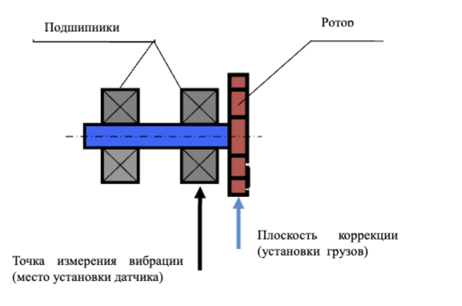
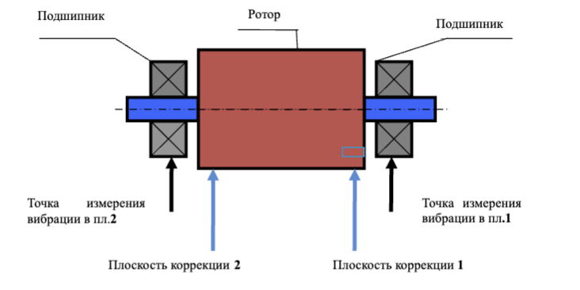
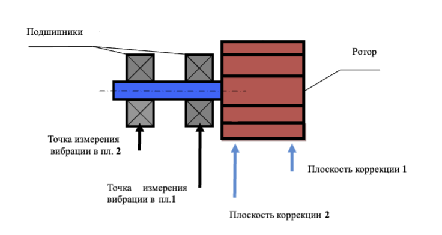

# ПРИЛОЖЕНИЕ 1  
## БАЛАНСИРОВКА МЕХАНИЗМОВ В ЭКСПЛУАТАЦИОННЫХ УСЛОВИЯХ  
*(справочные рекомендации)*  sdfsdf

---

## П.1.1. Общие требования  
- Балансировка допускается **только** для:  
  ✓ Технически исправных механизмов  
  ✓ Надёжно закреплённых на штатных фундаментах  
- **Запрещено** для механизмов с:  
  ✗ Изношенными/повреждёнными подшипниками  
  ✗ Загрязнениями на роторе, влияющими на балансировку  

---

## П.1.2. Особенности установки  
**Стандартная практика:**  
- Балансировка на месте эксплуатации  

**Исключения (резонансные случаи):**  
- Различие результатов измерений >10-20% между пусками  
- **Действия при резонансе:**  
  1. Изменить скорость вращения  
  2. При невозможности - использовать упругие опоры  

---

## П.1.3. Типы балансировки  

#### Статическая (1 плоскость)  
**Применение:**  
- Узкие дискообразные роторы без осевых биений  
- **Примеры:**  
  - Шлифовальные круги  
  - Шкивы ременных передач  
  - Дисковые маховики  
  - Зубчатые колеса  
  - Муфты  
  - Патроны токарных станков  
  - Узкие вентиляторы  

#### Динамическая (2 плоскости)  
**Применение:**  
- Длинные двухопорные роторы  
- **Примеры:**  
  - Роторы электродвигателей/генераторов  
  - Роторы компрессоров и насосов  
  - Рабочие колеса турбин  
  - Широкие шлифовальные круги  
  - Шпиндели  
  - Валы мукомольных машин  

---

## П.1.4. Точки измерений и коррекции  

#### Для 1 плоскости  

*Рис.П1.1. Выбор точки измерения и плоскости коррекции  
при балансировке в одной плоскости*
[Рис.П1.1. Схема для 1 плоскости]  

#### Для 2 плоскостей  

*Рис. П.1.2. Выбор точек измерения и плоскостей коррекции при балансировке в двух плоскостях межопорного ротора*

*Рис. П.1.3. Выбор точек измерения и плоскостей коррекции при 
балансировке в двух плоскостях консольного ротора*

**Требования:**  
- 2 точки измерения  
- Плоскости коррекции максимально близко к точкам измерений  
- Максимальное расстояние между плоскостями коррекции  

---

## П.1.5. Расчёт пробного груза  

#### Формула  
$$
M_п = \frac{K \cdot M_р}{R_п \cdot (N/100)^2}
$$  

**Где:**  

| Параметр | Описание                          | Единицы измерения |
|----------|-----------------------------------|-------------------|
| \(M_п\)  | Масса пробного груза              | г                 |
| \(M_р\)  | Масса ротора                      | г                 |
| \(R_п\)  | Радиус установки груза            | см                |
| \(N\)    | Скорость вращения                 | об/мин            |
| \(K\)    | Коэффициент жёсткости опор (1-5)  | -                 |

**Критерии эффективности:**  
- Изменение амплитуды: **>20-30%**  
- Фазовый сдвиг: **>20-30°**  

**Рекомендации:**  
- Установка в том же сечении, что и фазовая метка  
- Избегать малых изменений → риск погрешности  

---

> **Важно!** Все схемы приведены условно. Для точной настройки используйте документацию производителя оборудования.

 
## П.1.6. Выбор радиуса установки корректирующего груза  
**Основное правило:**  
Корректирующие грузы устанавливаются на тот же радиус, что и пробные.  

**Формула пересчёта массы при смене радиуса:**  

$$ M'_к = M_к \cdot \frac{R}{R'} \quad (П.1.1) $$

**Где:**  
| Параметр | Описание                          | Единицы измерения |  
|----------|-----------------------------------|-------------------|  
| \(M'_к\) | Скорректированная масса груза    | г                 |  
| \(M_к\)  | Расчётная масса груза            | г                 |  
| \(R\)    | Радиус установки пробного груза  | мм                |  
| \(R'\)   | Фактический радиус установки     | мм                |  

---

## П.1.7. Выбор частоты (скорости) вращения ротора  
**Рекомендации:**  
- Балансировка на установившейся рабочей скорости  
- Для регулируемых приводов: максимальная рабочая скорость  

> **ВНИМАНИЕ!**  
> Избегайте резонансных диапазонов (см. п.П.1.2)  

---

## П.1.8. Особенности установки датчиков  

#### а) Датчик вибрации  
**Способы крепления:**  
- Резьбовая шпилька (жёсткое крепление)  
- Магнитная присоска  
- Переходный штырь (ручной прижим)  
- Непосредственный контакт с опорой (ручной прижим)  

#### б) Датчик фазового угла  
**Требования:**  
- **Крепление:** магнитная стойка/струбцина  
- **Ориентация:** перпендикулярно поверхности ротора  
- **Зазор:** 50-500 мм (согласно документации)  

**Метка для отсчёта фазы:**  
- Материал: катафотная лента из комплекта  
- Альтернативы: шпоночные пазы, отверстия, головки болтов  

**Расчёт ширины метки:**  

$$ L \geq \frac{N \cdot R}{30000} \geq 1 - 1.5 \, см \quad (П.1.2) $$

**Где:**  
| Параметр | Описание                  | Единицы измерения |  
|----------|---------------------------|-------------------|  
| \(L\)    | Минимальная ширина метки  | см                |  
| \(N\)    | Скорость вращения         | об/мин            |  
| \(R\)    | Радиус установки метки    | см                |  

**Рекомендации:**  
- Минимум: 1-1.5 см даже при расчёте <1 см  
- Для роторов с R <10 мм: экспериментальная проверка  

> **ВНИМАНИЕ!**  
> Защищайте датчик от:  
> - Прямых солнечных лучей  
> - Яркого искусственного освещения  
> - Отражений на метке/фотодиоде  

---

*Все формулы действительны при температуре (20±5)°C. Для нестандартных условий требуется коррекция коэффициентов.*

## П.1.9. Дополнительные рекомендации по проведению балансировки

### **Предварительные измерения:**
- **Обязательный шаг:** Проведите измерения в режиме виброметра (см. раздел 7.3)
- **Анализ результатов:**  
  - Сравните суммарную вибрацию (V1s/V2s) с оборотной составляющей (V1o/V2o)

---

### **Решения по результатам анализа**
#### Случай 1: Дисбаланс ротора
- **Условие:**  
  V1s(V2s) ≈ V1o(V2o)
- **Действие:**  
  Перейти к балансировке ротора (см. раздел 7.4)

#### Случай 2: Другие неисправности
- **Условие:**  
  V1s(V2s) ≫ V1o(V2o)
- **Действия:**  
  - Проверить подшипники  
  - Убедиться в надежности крепления  
  - Исключить задевание ротора  
  - Проверить соосность узлов

---

### **Контроль стабильности измерений**
- **Допустимые отклонения:** ≤10-15%  
- **При превышении:**  
  - Проверить резонансные явления  
  - Установить на упругие опоры (см. п.П.1.2)

---

### Проверка статического дисбаланса
**Для горизонтальных роторов:**  
1. Поверните ротор на **90°**  
2. Если возвращается → **статический дисбаланс**  
3. Установите пробный груз:  
   - Расположение: верхняя точка средней части  
   - Масса: подбирать до полной неподвижности ротора  

---

## П.1.10. Критерии сбалансированности по ГОСТ ИСО 10816-1-97

### Таблица П.1. Допустимые уровни вибрации (СКЗ)
| Класс | Хорошо   | Допустимо | Еще допустимо | Недопустимо |
|-------|----------|------------|----------------|-------------|
| 1     | <0.7     | 0.7-1.8    | 1.8-4.5        | >4.5        |
| 2     | <1.1     | 1.1-2.8    | 2.8-7.1        | >7.1        |
| 3     | <1.8     | 1.8-4.5    | 4.5-11         | >11         |
| 4     | <2.8     | 2.8-7.1    | 7.1-18         | >18         |

---

## Классификация машин
- **Класс 1:**  
  Малые машины на жестких фундаментах (≤15 кВт)
  
- **Класс 2:**  
  Средние машины без отдельных фундаментов (15-75 кВт)  

- **Класс 3:**  
  Крупное оборудование на жестких фундаментах (>300 кВт)  

- **Класс 4:**  
  Крупное оборудование на облегченных фундаментах (>300 кВт)

---

