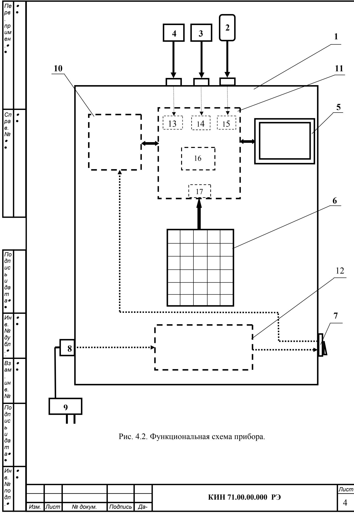

## **УСТРОЙСТВО И ПРИНЦИП РАБОТЫ ПРИБОРА**

4.1. Изображение прибора представлено на рис. 4.1. Прибор (см. рис. 4.1) состоит из измерительного блока 1, двух датчиков вибрации 3 и 4, датчика фазового угла 2.

В комплект поставки прибора также включена оснастка, необходимая для проведения балансировки механизмов в полевых условиях, которая включает в себя:

- магниты, используемые для установки на объекте датчиков вибрации;
- магнитный штатив, используемый для установки датчика фазового угла;
- весы электронные, используемые для взвешивания пробных и корректирующих балансировочных грузов.

Корпус измерительного блока прибора выполнен из пластика ABS черного цвета.

На верхней (лицевой) крышке корпуса установлен графический дисплей, на который выводятся результаты измерений, а также дополнительная информация необходимая для функционирования прибора. Там же (несколько ниже дисплея) расположена клавиатура, при помощи которой осуществляется управление прибором.

В верхней части корпуса (см. рис. 4.1) расположены разъёмы Х1 и Х2, предназначенные для подключения датчиков вибрации, а также разъём Х3, используемый для подключения датчика фазового угла.

На правой боковой поверхности корпуса установлен выключатель питания, а на левой - разъём для подключения блока питания постоянного тока с питающим напряжением + 8,4 В, используемого при подзарядке аккумуляторов.

4.2. Функциональная схема прибора приведена на рис. 4.2.

Прибор включает в себя следующие конструктивные единицы: измерительный блок 1, датчик фазового угла 2, датчики вибрации 3 и 4.

 Как уже отмечалось выше, на лицевой панели измерительного блока установлены графический дисплей 5 и клавиатура 6. На корпусе измерительного блока также установлены выключатель питания прибора 7 и разъём 8, используемый для подключения внешнего блока питания 9, предназначенного для зарядки встроенного приборного аккумулятора.

Внутри корпуса измерительного блока установлены управляющая плата программируемого контроллера 10, к которому подключены аналого-цифровая коммутационная плата 11, дисплей 5 и встроенный блок аккумуляторного питания прибора 12 с контролером заряда-разряда аккумуляторных батарей.

Плата 11 обеспечивает нормирование сигналов с датчиков и подключение к контроллеру основных узлов прибора, для чего на ней смонтированы:

- интеграторы 13 и 14 сигналов датчиков вибрации по первому и второму измерительным входам;
- преобразователь 15 сигнала датчика фазового угла;
- карта внешней памяти 16 прибора;
- разъём 17 для подключения клавиатуры;
- разъемы для подключения дисплея (на рис. Не показаны).

Принцип действия прибора основан на измерении механических колебаний, которые имеют место на корпусах машин при их работе.

Для преобразования механических колебаний в электрический сигнал используются датчики вибрации – акселерометры 4, 3. Для определения фазовых характеристик сигнала используется оптический лазерный датчик 2, работающий на отражение.

Рис. 4.1. Прибор для балансировки в комплекте с датчиками

Рис. 4.2. Функциональная схема прибора. 

Под воздействием механических колебаний на выходе датчика вибрации формируется электрический аналоговый сигнал пропорциональный виброускорению, который подается на соответствующий вход измерительного блока 1 прибора.

Далее после преобразования (интегрирования, полосовой фильтрации) видоизмененный сигнал пропорциональный виброскорости поступает на соответствующий аналоговый вход программируемого контроллера 10, в котором преобразуется в цифровую форму и запоминается в его оперативном запоминающем устройстве (ОЗУ).

В случае необходимости измерения частоты вращения и/или фазовых характеристик вибрационного сигнала дополнительно используется импульсный сигнал, формируемый датчиком фазового угла, который после нормирования также подается на соответствующий аналоговый вход контроллера 10.

В контроллере 10 прибора производится предварительная цифровая обработка и запоминание аналоговых сигналов, поступающих с датчиков. После чего по заданной программе осуществляется дальнейшая обработка цифрового сигнала (фильтрация, интерполяция, Фурье – анализ, вычисление параметров балансировки и т.д.).

Полученные результаты ( численные значения амплитуды и фазы вибрации, частоты вращения и т.п.) выводятся на дисплей и запоминаются в соответствующих отделах памяти прибора.

В зависимости от выбранного режима балансировки (одна или две плоскости коррекции) последовательно выполняется соответствующее количество измерений вибрации объекта в исходном состоянии и после установки пробного груза, используемого для тарировки прибора.

По результатам измерений в цифровом виде осуществляется решение задачи балансировки, после чего на дисплей выводятся данные о величине и угле установки корректирующей массы.

Роль пользователя сводится при этом к установке пробных и корректирующих грузов на балансируемом роторе и нажатию по готовности соответствующих клавиш на клавиатуре компьютера (или виртуальных клавиш на дисплее).

Весь процесс балансировки, включающий в себя измерение, обработку сигнала и вычисление результата, выполняется в автоматизированном режиме по программам, находящимся в памяти прибора.