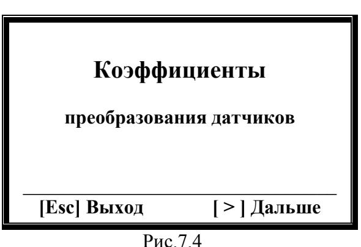

## РАБОТА С ПРИБОРОМ

 
**7.1. Включение прибора и использование клавиатуры для выбора режима работы.**

При запуске прибора на дисплее появляются служебные надписи - «Инициализа-
ция памяти», а затем «Инициализация прошла», указывающие, что программа загруже-
на в память прибора и готова к работе (Рис.7.1.)

Рис.7.1. 

Данные  надписи  высвечиваются  на  экране  в  течении  нескольких  секунд,  после чего появляется исходная рабочая заставка, представленная на рис. 7.2.

Рис.7.2. 

В нижней части экрана изображены управляющие клавиши [ < ] и [ > ], с помо-
щью  которых  можно  выбрать  один  из  двух  главных  режимов  работы  прибора,  в  том числе: режим измерения и анализа вибрации (подробности см. в разделе 7.3) или режим 
балансировки (подробности см. в разделах 7.4 и 7.5). 

При работе в данной заставке так же возможно выполнить ввод и корректировку 
коэффициентов  преобразования  датчиков  вибрации  прибора,  для  чего  используется 
клавиша [ # ] (подробности см. в разделе 7.2).

**7.2. Ввод или корректировка коэффициентов преобразования датчиков вибрации.** 

Для выбора режима просмотра или ввода уточненных коэффициентов преобразо-
вания измерительных каналов вибрации необходимо, находясь в главном рабочем меню 
(рис.7.2), нажать клавишу [ # ], после чего на дисплее  появляется заставка «Секретный 
пароль» (см. рис. 7.3). 

Рис.7.3. 

Для проведения просмотра или корректировки коэффициентов преобразования необходимо ввести пароль (цифровой код), который обеспечивает дополнительную защиту от несанкционированного вмешательства в настройку прибора.

Для данного прибора паролем является число 3.14, которое вводится с помощью цифровых клавиш клавиатуры с последующим нажатием клавиши [Ent] (Принять).

Для исправления ошибочно введенного цифрового кода используется клавиша [ < ] (Сброс), после нажатия которой можно повторить попытку ввода пароля. Внимание!

При вводе пароля или коэффициентов преобразования его дробная часть отделяется от целой части запятой (знаком « \* »).

После ввода правильного цифрового кода и нажатия клавиши [Ent] (Принять) на экране высвечивается надпись, подтверждающая возможность просмотра и корректировки коэффициентов преобразования (см. рис.7.4):

Рис.7.4. 

В этом случае при нажатии клавиши [Esc] (Выход) выполняется возврат в предыдущее меню.

При нажатии клавиши [>] (Дальше) на экране высвечивается надпись, позволяющая просмотреть существующий коэффициент преобразования датчика первого канала и при необходимости начать его корректировку (см. рис.7.5):

Рис.7.5. 

При этом в первой строке приводится значение существующего коэффициента преобразования датчика, а нижней указаны обозначения клавиш, которые необходимо нажать для продолжения работы по программе.

При нажатии клавиши [ > ] (Пропустить) сохраняется введенный ранее коэффициент преобразования.

При нажатии клавиши [Ent] (Ввод) на дисплей выводится форма, при заполнении которой можно установить новое значение коэффициента преобразования (см. рис.7.6):

Рис.7.6. 

В первой строке указанной формы вводится новое значение коэффициента преобразования для первого измерительного канала прибора.

Курсор "_" обозначает начальную позицию ввода. Для ввода коэффициента используются цифровые клавиши клавиатуры.

В нижней строке дисплея указано обозначение клавиши [Ent] (Принять), при нажатии которой в энергонезависимую память прибора заносится введённое значение коэффициента преобразования и клавиши | < | (Сброс), которую необходимо нажать, чтобы произвести исправления в случае ошибочного ввода коэффициента

После завершения ввода Кпр.1 и нажатия в данном рабочем окне клавиши [Ent] (Принять) на дисплей выводится хранящийся в памяти прибора коэффициент преобразования Кпр.2 второго измерительного канала вибрации (см. рис.7.7)

 

