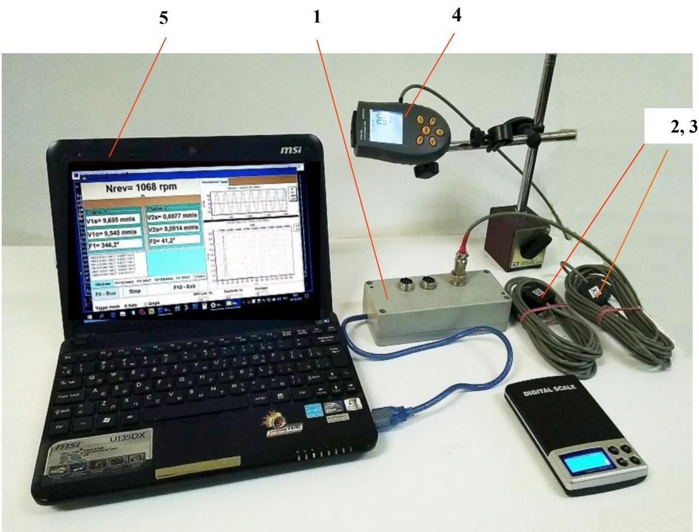
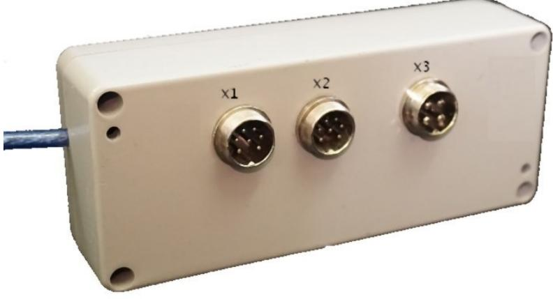

# УСТРОЙСТВО И ПРИНЦИП РАБОТЫ ПРИБОРА

## 4.1 Внешний вид прибора

На рисунках 4.1 и 4.2 изображён прибор «Балком-1А». Прибор (см. рис. 4.1) состоит из:

1. Измерительного блока (обозначен как **1**)
2. Двух датчиков вибрации (обозначены как **2** и **3**)
3. Датчика фазового угла (обозначен как **4**)
4. Портативного компьютера (ноутбук; его в комплект поставки не входит) (обозначен как **5**)

Также в комплект входит оснастка для балансировки механизмов в полевых условиях: магниты для установки датчиков вибрации, магнитный штатив для датчика фазового угла и весы.

На лицевой стенке корпуса (см. рис. 4.2) размещены:
- Разъёмы Х1 и Х2 для подключения датчиков вибрации к 1-му и 2-му измерительным каналам приборa.
- Разъём Х3 для подключения датчика фазового угла.

С боковой стороны корпуса выведён кабель с USB-разъёмом, предназначенным для подключения измерительного блока к компьютеру. По этому кабелю происходит обмен информацией между блоком и компьютером, а также подача питания **+5 В** к измерительному блоку.

  
Рис. 4.1. Прибор для балансировки «Балком-1А» в комплекте

  
Рис. 4.2. Измерительный блок прибора «Балком-1А»

---

## 4.2 Функционирование прибора

Принцип действия прибора основан на измерении механических колебаний, возникающих на корпусах машин во время работы.

- Для преобразования механических колебаний в электрический сигнал используются датчики вибрации (акселерометры) **2 и 3**.
- Для определения частоты вращения и фазовых характеристик применяется датчик фазового угла **4** (тахометр), работающий на принципе отражения лазерного луча от отражающей ленты.

При воздействии механических колебаний датчики вибрации вырабатывают электрический аналоговый сигнал, пропорциональный **виброускорению**. Этот сигнал поступает на входы Х1 и Х2 измерительного блока.

В дальнейшем сигнал подвергается интегрированию и полосовой фильтрации, в результате чего формируется сигнал, пропорциональный **виброскорости**. Этот сигнал отправляется на вход платы АЦП измерительного блока.

Для измерения частоты вращения и анализа фазовых характеристик используется импульсный сигнал, вырабатываемый датчиком фазового угла (подключён к входу Х3).

Аналоговые сигналы от датчиков преобразуются в цифровую форму и передаются по USB в портативный компьютер. На компьютере с помощью специализированной программы происходит дальнейшая обработка: фильтрация, Фурье-анализ, вычисление параметров балансировки и др.

Полученные данные (амплитуды, фазы вибрации, частота вращения и прочее) сохраняются в памяти компьютера и выводятся на дисплей.