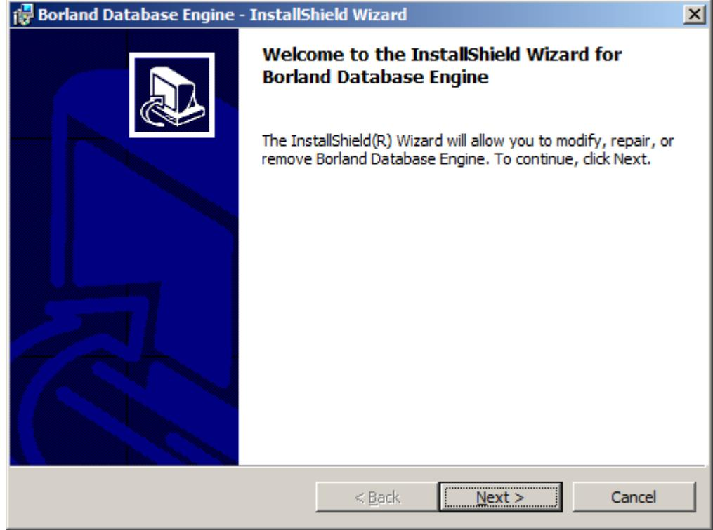

# 6. УСТАНОВКА ПРОГРАММНОГО ОБЕСПЕЧЕНИЯ И ПОДГОТОВКА ПРИБОРА К РАБОТЕ

В этом разделе описаны этапы подключения прибора «Балком-1А» к компьютеру, установки необходимого программного обеспечения и подготовки прибора к эксплуатации.

---

#### 6.1 Общие сведения

Перед началом работы с прибором "Балком-1А" (далее — Прибор) необходимо подключить его к персональному компьютеру и установить специализированное программное обеспечение, которое будет использоваться при работе.

---

**6.2 Установка ПО и подключение измерительного блока к компьютеру**

В данном разделе приводятся инструкции по подключению измерительного блока к компьютеру, настройке системы и проверке корректной работы модуля.

---

## 6.2.1 Установка USB-драйверов и специализированного программного обеспечения

### 6.2.1.1 Перечень папок и файлов на установочном носителе

На установочном диске (флеш-диске или CD), поставляемом в комплекте прибора, находятся следующие папки и файлы:

- **Bal1A** – папка с программным обеспечением для балансировки прибора «Балком-1А».
- **ArdDrv** – папка с USB-драйверами.
- **EBalancer_manual.pdf** – данный файл руководства.
- **Bal1AvXXXSetup.exe** – файл установщика, где ХХХ обозначает номер версии программы. В этом архивном файле содержатся все вышеуказанные папки и файлы.

> **Внимание!**  
> Обновленную версию программы можно скачать с сайта.

> **Важно!**  
> Перед установкой необходимо распаковать полученный zip-архив.

### 6.2.1.2 Установка программного обеспечения

1. Запустите файл **Bal1AvXXXSetup.exe**.
2. Следуйте указаниям установщика, нажимая кнопки «F4 – Настройки. Далее», «F4 – Настройки. ОК» и т.д. Не изменяйте предложенную папку для установки.
3. При запросе указания программной группы и ярлыков на рабочем столе нажмите кнопку «ОК».
4. Когда появится окно «F4 – Настройки. Все готово к установке», нажмите кнопку «Установить».

     
     
     
     
   

5. После этого откроется мастер установки драйверов:

   

6. Продолжите установку, нажимая кнопки «Далее» и «Готово»:

     
   

7. Следуйте инструкциям для установки базы данных: нажмите «Next», затем «Install» и «Finish».

     
   

8. Для завершения нажмите кнопку «Завершить». После этого на компьютер установятся все необходимые драйверы и программное обеспечение прибора «Балком».

---

#### 6.2.3 Подключение измерительного блока к компьютеру

1. Включите компьютер и загрузите операционную систему (Windows XP/Vista/Win7/Win8/Win10).
2. Подключите измерительный блок к ПК, соединив USB-разъём блока (см. Рис.4.1 «F4 – Настройки. Руководство по эксплуатации») с любым свободным USB-портом.
3. Подождите, пока операционная система распознает устройство.

---

## 6.2.4 Распознавание модуля АЦП измерительного блока

### 6.2.4.1 Первичное подключение модуля

При первом подключении модуля измерительного блока через USB кабель операционная система автоматически копирует все необходимые файлы и вносит требуемые записи в реестр.  
Для проверки корректного распознавания откройте «Диспетчер устройств». В разделе «Порты COM и LPT» должно отображаться устройство «Arduino Due» (или «Arduino D», поставляемое в комплекте), как показано на рисунке ниже:

---

## 6.3 Подготовка прибора к работе

1. Установите датчики на обследуемом или балансируемом механизме.  
   (Подробная информация по установке датчиков приведена в Приложении 1.)
2. Подключите датчики:
   - Датчики вибрации подключите к разъёмам Х1 и Х2.
   - Датчик фазового угла подключите к разъёму Х3 измерительного блока.
3. Подключите измерительный блок к USB-входу компьютера.
4. Включите компьютер и запустите программу «Балком-1А» через ярлык на рабочем столе.

