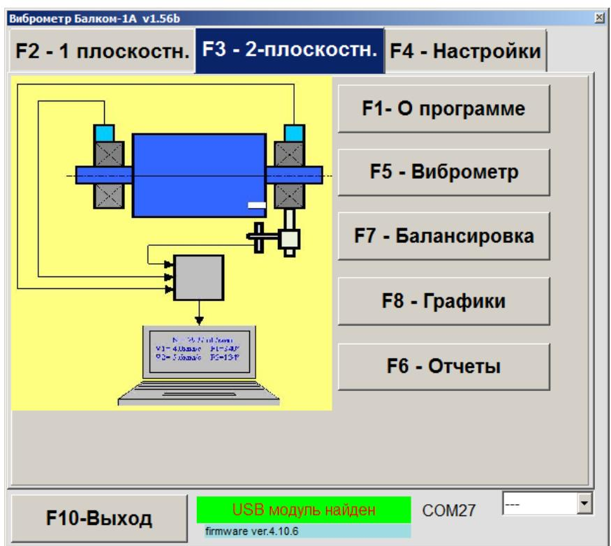

# Работа с прибором

## Внимание!

Перед началом работы с прибором обязательно ознакомьтесь со справочными рекомендациями «БАЛАНСИРОВКА МЕХАНИЗМА В ЭКСПЛУАТАЦИОННЫХ УСЛОВИЯХ», приведёнными в приложении 1.

---

## 7.1. Главное рабочее окно. Назначение основных управляющих кнопок

При запуске программы «F4 -- Настройки.Балком-1А» на дисплее компьютера появляется главное рабочее окно, изображённое на рис. 7.1. В этом окне расположены восемь управляющих кнопок с обозначениями функций, которые реализуются при их нажатии. Кроме того, можно использовать функциональные клавиши **F1–F10** на клавиатуре; их назначения указаны на соответствующих кнопках.

---

### 7.1.1. Кнопка «F1 – О программе»

При нажатии кнопки **«F1 – О программе»** или соответствующей функциональной клавиши **F1** на клавиатуре, пользователь получает краткую информацию о назначении программ. При необходимости можно также ознакомиться с Руководством по эксплуатации прибора «F4 -- Настройки.Балком-1А».

---

### 7.1.2. Кнопки «F2 – 1 плоскостн.» и «F3 – 2 плоскостн.»

- **Кнопка «F2 – 1 плоскостн.»** (или клавиша **F2**) активирует режим измерения вибрации по одному каналу (Х1) измерительного блока. Рис. 7.3 демонстрирует рабочее окно после нажатия данной кнопки – измерение вибрации в одной плоскости.

- **Кнопка «F3 – 2 плоскостн.»** (или клавиша **F3**) включает режим одновременного измерения вибрации по двум каналам (Х1 и Х2). Рис. 7.4 иллюстрирует окно программы после выбора данного режима – измерение в двух плоскостях.

---

### 7.1.3. Кнопка «F4 – Настройки»

Нажатие кнопки **«F4 – Настройки»** (или клавиши **F4**) переводит пользователя в рабочее окно «F4 – Настройки.Настройки».

---

### 7.1.4. Кнопка «F5 – Виброметр»

При выборе кнопки **«F5 – Виброметр»** (или функциональной клавиши **F5**) активируется режим измерения вибрации по одному или двум измерительным каналам. Режим работы зависит от текущего состояния кнопок **«F2 – 1 плоск.»** и **«F3 – 2 плоск.»**.

---

### 7.1.5. Кнопка «F6 – Отчеты»

Нажав кнопку **«F6 – Отчеты»** (или клавишу **F6**), вы переходите в Архив балансировки, откуда можно распечатать протокол с результатами балансировки.

---

### 7.1.6. Кнопка «F7 – Балансировка»

Кнопка **«F7 – Балансировка»** (или клавиша **F7**) активирует режим балансировки в одной или двух плоскостях коррекции. Выбор режима зависит от состояния кнопок **«F2 – 1 плоск.»** и **«F3 – 2 плоск.»**.

---

### 7.1.7. Кнопка «F8 – Графики»

При нажатии кнопки **«F8 – Графики»** (или клавиши **F8**) включается режим виброметра, при котором на дисплее одновременно отображаются значения амплитуды и фазы вибрации, а также графики её временной функции и спектра.

---

### 7.1.8. Кнопка «F10 – Выход»

Нажатие на кнопку **«F10 – Выход»** (или клавиши **F10**) завершает работу программы «F4 -- Настройки.Балком-1А».