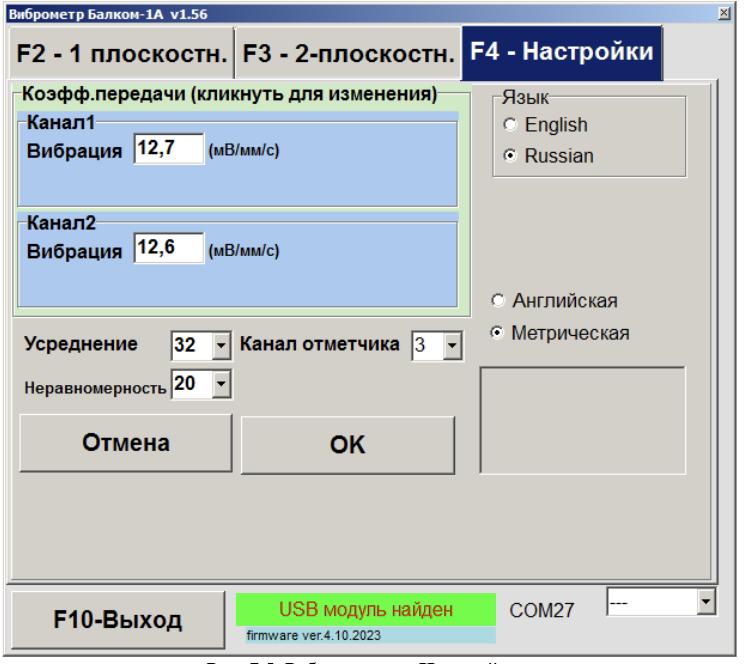

# 7.2. Настройка прибора. Кнопка «F4 -- Настройки»

## Обычно изменение настроек прибора не требуется!

При нажатии кнопки **«F4 - Настройки»** в главном рабочем окне программы на дисплее компьютера появляется окно **«F4 - Настройки»** (см. рис. 7.5).

---

## Основные настройки

- **Коэфф. передачи**  
  Коэффициенты преобразования датчиков вибрации; менять требуется только при замене датчиков!

- **Усреднение**  
  Число оборотов ротора, на которых производится усреднение данных для повышения стабильности показаний.

- **Канал отметчика#**  
  Номер канала, к которому подключён отметчик оборотов. Стандартно – 3-й канал.

- **Неравномерность**  
  Разница в длительности между соседними метками, при превышении которой появляется предупреждение «F4 -- Настройки. Сбой тахометра».

- **Английская/Метрическая**  
  Выбор системы единиц измерения.

_Com порт определяется автоматически._

---

#### Внимание!

**Коэффициенты преобразования датчиков вибрации (Чувствительность), полученные при проведении приёмо-сдаточных испытаний прибора, обычно вводятся в программу на предприятии-изготовителе, и в дальнейшем изменения не требуются!**

Эти коэффициенты также заносятся в Руководство по эксплуатации прибора. Изменение коэффициентов производится только при замене датчиков или проведении калибровки измерительной системы. Если в рабочем окне (см. рис. 7.3) и в Руководстве отсутствуют нужные коэффициенты, их можно запросить на предприятии-изготовителе, указав заводской номер прибора.

До получения указанных данных для балансировки можно использовать усреднённые значения:  
Кпр1 = 13,0 мВ/мм/с;  
Кпр2 = 13,0 мВ/мм/с.