# 7.4.2. Проведение балансировки в одной плоскости

Балансировка в одной плоскости проводится в несколько этапов. В процессе первичной балансировки требуется выполнить два пробных пуска и, как минимум, один проверочный пуск балансируемой машины.

Перед проведением балансировки строго рекомендуется провести измерения вибрации в режиме виброметр (см. раздел 7.3 «Работа прибора в режиме «F5 - Виброметр»»). Особое внимание следует обратить на стабильность амплитуды и фазы вибрации от измерения к измерению.

---

## 7.4.2.1 Пуск 1 (Без пробного груза)

1. Проверьте правильность установки датчиков вибрации и тахометра в соответствии с указаниями раздела 7.4.1 «Подготовка к проведению балансировки».
2. Включите вращение ротора и дождитесь выхода на рабочий режим со стабильной скоростью вращения.
3. Нажмите кнопку **F7 – Нач. Пуск 1**.

После успешного завершения измерений в соответствующих окошках раздела «Пуск 1» будут отображены:
- Результаты измерения частоты вращения ротора (**Nоб**);
- Значения составляющей СКЗ (**Vо1**) и фазы (**F1**) вибрации, проявляющейся на частоте вращения балансируемого ротора;
- Графики вибрации и спектра вибрации на вкладке справа.

Нижняя часть вкладки содержит файл истории, в котором сохраняются результаты всех пусков с привязкой по времени. Этот файл сохраняется на диск в папке архива под именем *memo.txt*.

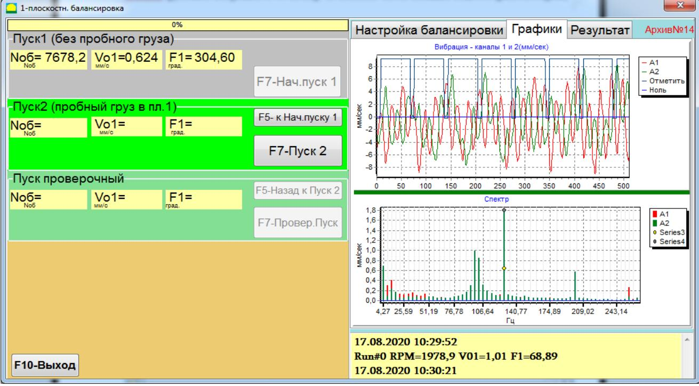

Для повторного измерения параметров вибрации и проверки стабильности показаний можно использовать кнопку **«F5 – к Нач. пуску 1»** (или функциональную клавишу **F5**).

---

## 7.4.2.2 Пуск 2 (С пробным грузом)

Перед выполнением измерений в разделе «Пуск2 (Пробный груз Плоск. 1)» необходимо:
- Остановить вращение ротора балансируемой машины,
- Установить на ротор пробный груз.

Масса пробного груза либо задается во вкладке **«Балансировка Настройки»** (см. рис. 7.6), либо условно принимается равной 100 % для дальнейших расчетов.

> **Внимание!**  
> 1. Вопрос выбора массы пробного груза и места его установки на роторе подробно рассмотрен в приложении 1.  
> 2. При использовании режима «Повторная» место установки пробного груза должно совпадать с плоскостью установки метки, используемой для отсчёта фазового угла.

После установки пробного груза:
1. Включите вращение ротора и убедитесь, что машина достигла рабочего режима.
2. Для измерения параметров вибрации в разделе «Пуск2 (Пробный груз Плоск. 1)» нажмите кнопку **«F7 – Пуск2»** (или клавишу **F7**).

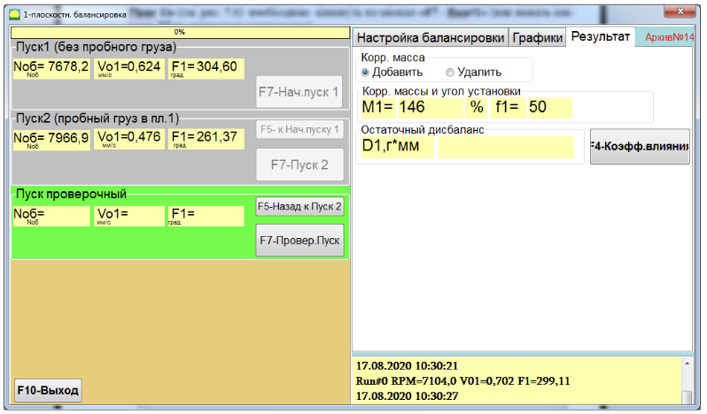

После проведения измерения в левой панели отобразятся:
- Частота вращения ротора (**Nоб**);
- Величина (**Vо1**) и фаза (**F1**) вибрации, проявляющейся на частоте вращения балансируемого ротора.

В правой части окна на вкладке «Результат» выводятся результаты расчёта параметров корректирующего груза для компенсации дисбаланса. В зависимости от выбора **Способа установки грузов** результаты могут отображаться по-разному:

- **При использовании произвольного места установки груза:**  
  На дисплее выводятся значение массы (**М1**) и угол установки (**f1**) корректирующего груза (см. рис. 7.14). Если активирована галка **Полярный график**, откроется окно с круговой диаграммой, показывающей место установки груза.

- **При разложении корректирующего груза по лопастям:**  
  На экране отображаются номера лопастей (**Zi, Zj**) балансируемого ротора и массы грузов, которые следует установить (см. рис. 7.16), либо показывается круговая диаграмма.

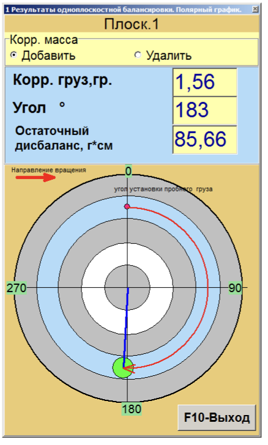

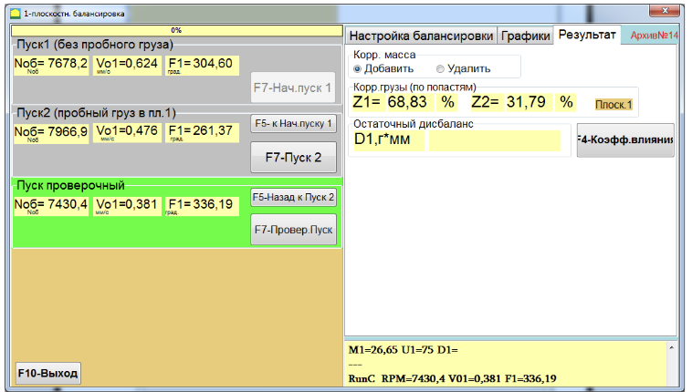

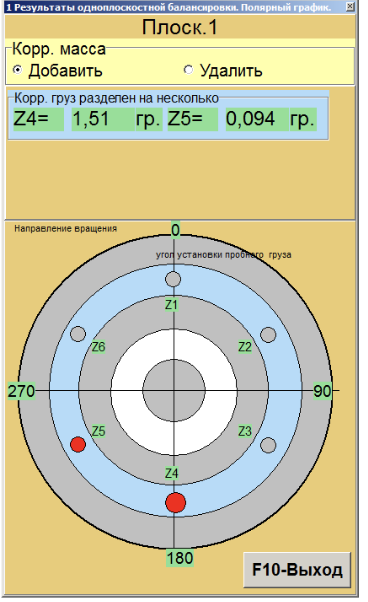

> **Внимание!**  
> - 1. По окончании измерений на втором пуске необходимо остановить вращение ротора и снять ранее установленный пробный груз. Только после этого можно приступить к установке корректирующего груза.  
>    *Если пробный груз не снимается, переключитесь на вкладку «Балансировка Настройки», активируйте параметр «Сохранить пробный груз Плоск.1», а затем вернитесь на вкладку «Результат». Масса и угол установки корректирующего груза пересчитаются автоматически.*  
> - 2. При балансировке по лопастям лопасть, условно принимаемая за первую, совпадает с местом установки пробного груза. Нумерация лопастей на дисплее выполняется в направлении вращения ротора.  
> - 3. В данной версии программы по умолчанию предполагается, что корректирующий груз будет добавлен на ротор (об этом свидетельствует метка в поле «Добавление»). При корректировке дисбаланса путём удаления груза (например, посредством высверливания) необходимо установить метку в поле **«F4 -- Настройки. Удалить»** – угловое положение корректирующего груза автоматически изменится на 180º.

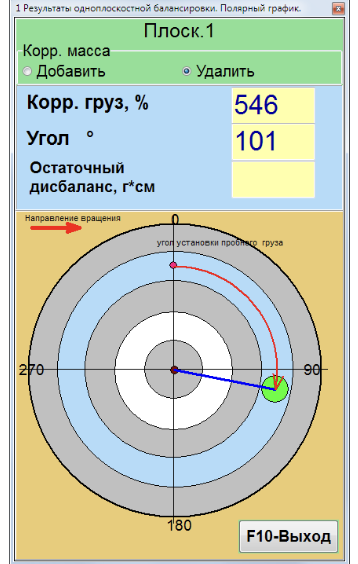

---

## 7.4.2.3 Проверочный пуск

После установки корректирующей массы на ротор необходимо провести проверочный пуск (Пуск Проверочный) для оценки эффективности выполненной балансировки.

> **Внимание!**  
> Перед началом измерений на третьем пуске включите вращение ротора и убедитесь, что машина достигла рабочего режима.

Для проведения проверочного пуска:
1. Нажмите кнопку **«F7 – Провер.Пуск»** (или нажмите клавишу **F7**).

При успешном завершении измерений в соответствующих окошках отобразятся:
- Частота вращения ротора (**Nоб**);
- Величина (**Vо1**) и фаза (**F1**) вибрации, проявляющейся на частоте вращения балансируемого ротора.

На вкладке «Результат» выводятся результаты расчёта параметров дополнительного корректирующего груза, который может быть добавлен к уже установленному для компенсации остаточного дисбаланса. Также в правой панели отображается величина остаточного дисбаланса ротора.

Если остаточная вибрация и/или остаточный дисбаланс удовлетворяют установленным допускам, процесс балансировки может быть завершён. В противном случае его следует продолжить, корректируя установку грузов по методу последовательных приближений, как указано в разделе «Корр. массы и угол установки».

---

### 7.4.3 Проведение балансировки с размещением 3-х грузов в канавке на роторе

Обычно данный метод применяется при балансировке шлифовальных кругов. Особенности проведения измерений при исходном и пробном пуске заключаются в том, что дополнительный пробный груз не устанавливается.

#### Пуск без груза

Перед пуском необходимо распределить грузы так, как показано на рисунке. Грузы таким образом компенсируют друг друга и не создают дополнительного дисбаланса.

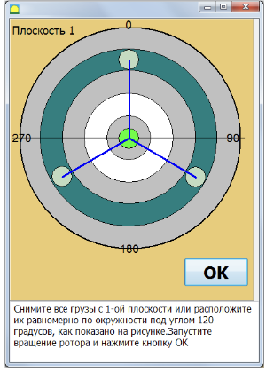

#### Пуск с пробным грузом

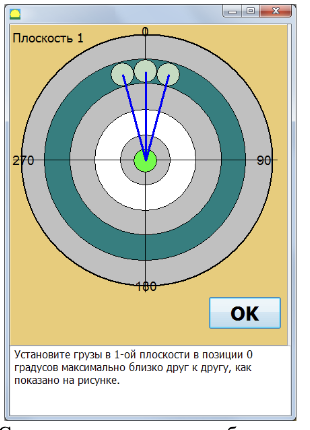

Результат балансировки отображается на круговой диаграмме. Три груза устанавливаются в позициях, как указано на круговой диаграмме (см. рис. 7.22).

---

## 7.4.4 Коэффициенты влияния (балансировочные коэффициенты)

Динамический коэффициент влияния (ДКВ) или балансировочный коэффициент – это вектор, определяющий отношение приращения вибрации опоры к вектору пробного груза, вызывающего это приращение.

Кнопка **«F4 – Коэфф. влияния»** в окне «Результат» (см. рис. 7.19) предназначена для просмотра и сохранения в памяти компьютера балансировочных коэффициентов, рассчитанных по результатам пробных пусков.

При нажатии этой кнопки на дисплее появляется рабочее окно **«Коэфф. влияния. Одна плоскость»** (см. рис. 7.23), где выводятся коэффициенты балансировки, рассчитанные по результатам тарировочных (пробных) пусков. Если при последующей балансировке данной машины предстоит использование режима «Повторная», указанные коэффициенты необходимо сохранить.

Для сохранения коэффициентов:
1. Нажмите кнопку **«F4 – Настройки. F9 – Сохранить»**.
2. Перейдите на вторую страницу окна **«Архив коэфф. влияния. Одна плоск.»** (см. рис. 7.23).
3. Введите условное обозначение (тип) машины в столбце **«Ротор»** в последней значащей строке таблицы.
4. Нажмите кнопку **«√»** для сохранения данных.

После этого вернитесь в предыдущее окно, нажав кнопку **«F10 – Выход»** (или соответствующую клавишу **F10**).

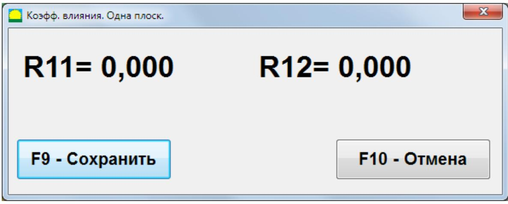

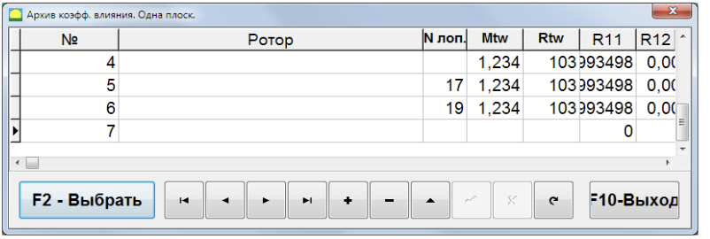

---

### 7.4.6 Протокол балансировки

При проведении балансировки автоматически формируется протокол, внешний вид которого приведён на рисунках ниже. Протокол можно редактировать во встроенном редакторе.

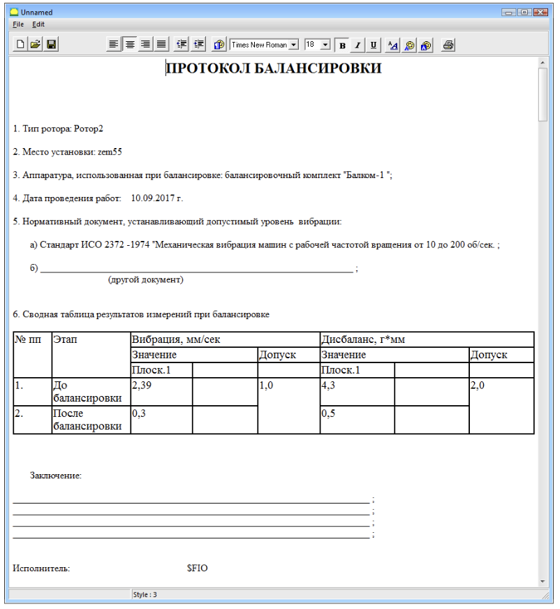

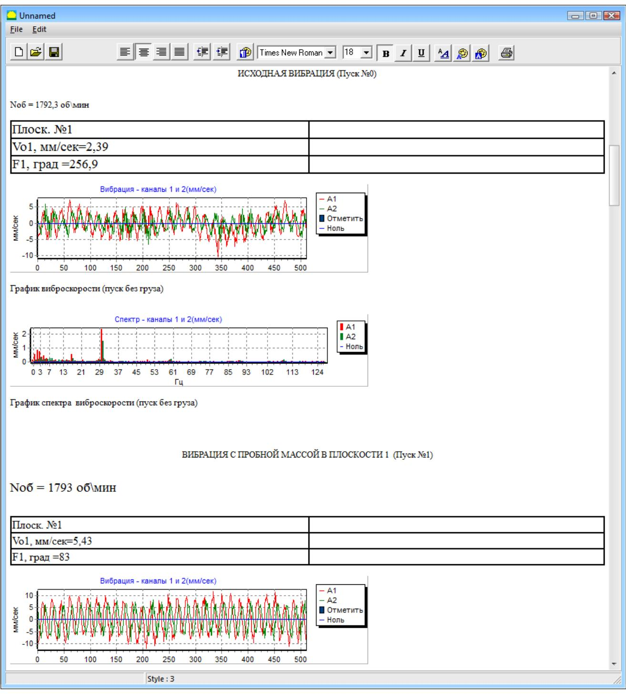