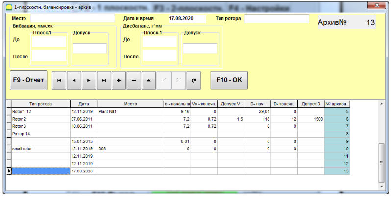
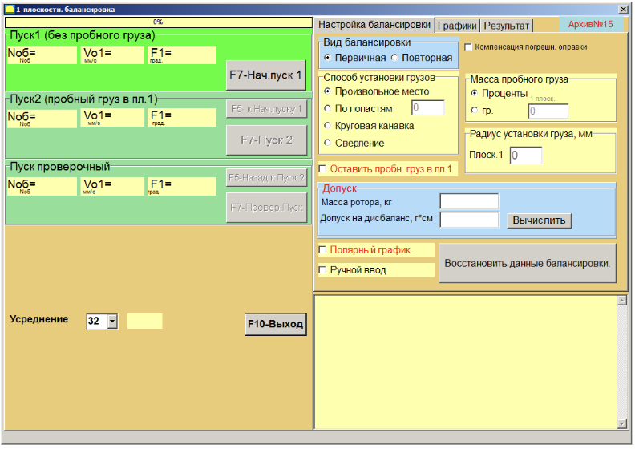

# 7.4. Балансировка в одной плоскости

#### Общие сведения о балансировке см. в Приложении, п. 1.3 "Балансировка роторов в одной и двух плоскостях коррекции".

---

## 7.4.1 Подготовка к проведению балансировки

- Установите датчик вибрации на корпусе машины в выбранной точке измерения и подключите его к входу Х1 измерительного блока.
- Установите датчик фазового угла на расстоянии 10–50 см от поверхности ротора и подключите его к входу Х3 измерительного блока.  
  Для работы датчика-тахометра на поверхность ротора необходимо наклеить отражающую метку из прилагаемой светоотражающей ленты.

_Подробные требования по выбору места установки датчиков и их креплению изложены в Приложении 1._

Для начала работы по программе в режиме **"1 плоск. Балансировка"** необходимо кликнуть по кнопке **«F2–1 плоск.»** (или нажать клавишу **F2** на клавиатуре).  
При этом на дисплее компьютера появляется мнемосхема (см. рис. 7.1), иллюстрирующая процесс измерения амплитуды и фазы вибрации только по первому измерительному каналу.

Затем в главном рабочем окне программы нажмите кнопку **«F7 – Балансировка»**. После этого на экране появится рабочее окно выбора архива (**1 плоск. Балансировка архив**), в который будут сохранены данные балансировки (см. рис. 7.9).

В данном окне можно внести следующие данные, сохраняемые в базе данных:
- Название ротора (**Тип ротора**)
- Место установки (**Место**)
- Допуски на вибрацию и остаточный дисбаланс (**Допуск**)
- Дата измерения

Также создаётся папка вида `\ArcPnnn` (где nnn – номер архива), в которой сохраняются графики измерений, файл отчёта и другие данные. После завершения балансировки будет сформирован файл отчёта, который можно отредактировать и распечатать во встроенном редакторе.

После внесения необходимых данных нажмите кнопку **«F4 – Настройки. F10-OK»**. Тогда откроется рабочее окно **«F4 – Настройки. 1 плоск. Балансировка»** (см. рис. 7.10).

В левой панели данного окна отображаются данные замеров вибрации при пусках и кнопки управления измерениями:
- **«F4 – Настройки. Пуск 1»**
- **«F4 – Настройки. Пуск 2»**
- **«F4 – Настройки. Проверочный Пуск»**

Справа расположены три вкладки:
- **«F4 – Настройки. Настройка балансировки»**
- **«F4 – Настройки. Графики»**
- **«F4 – Настройки. Результат»**

### Настройка балансировки

Во вкладке **«F4 – Настройки. Настройка балансировки»** вводятся параметры, необходимые для проведения процедуры:

#### Вид балансировки

- **Первичная** – выбор нового ротора, для которого балансировочные коэффициенты ещё не сохранены. Требуется провести два пуска для определения массы и места установки корректирующего груза.  
  При первичной балансировке в 1-й плоскости выполняются два пуска:
  - Первый пуск – измеряется исходная вибрация машины.
  - Второй пуск – проводится после установки на ротор пробного груза для определения изменения вибрации.

- **Повторная** – выбор балансировки ротора, для которого уже сохранены балансировочные коэффициенты. Для определения массы и места установки корректирующего груза требуется только один пуск.

#### Масса пробного груза

- **«Масса пробного груза»**  
  Выбор единицы измерения:
  - **Проценты** – если масса пробного груза неизвестна, масса корректирующего груза вычисляется как процент от пробного.
  - **Грамм** – если масса пробного груза известна, вводите её в граммах, и масса корректирующего груза рассчитывается соответственно.

> **Внимание!**  
> При использовании режима **«Повторная»** при первичной балансировке масса пробного груза должна вводиться в граммах.

Для взвешивания грузов в комплекте поставки включены весы.

#### Метод установки грузов

- **«Произвольное место»** – грузы можно устанавливать в любое место по углу на окружности ротора.
- **«По лопастям»** – грузы устанавливаются в определённые места (например, на лопасти или в равномерно распределённые позиции, например, 12 отверстий через 30°). При этом число лопастей вводится в соответствующее поле. После балансировки программа автоматически разделит массу груза и покажет номера позиций (лопастей) для установки.
- **Круговая канавка** – используется при балансировке шлифовальных кругов, когда три груза сдвигаются в круговой канавке на роторе для компенсации дисбаланса.
- **Сверление** – снятие массы путём высверливания, вместо установки грузов.

#### Другие параметры

- **«Радиус установки груза»**  
  Радиус установки пробного груза в плоскости 1, необходим для расчёта величины исходного и остаточного дисбаланса.
  
- **«Оставить пробный груз Плоск.1»**  
  Обычно пробный груз снимается в процессе балансировки, но если его снять невозможно, установите галку для учета пробного груза при расчётах.

- **«Ручной ввод данных»**  
  Позволяет вручную ввести значения вибрации и фазы в соответствующие поля левой части окна. На основе этих данных рассчитывается масса и место установки корректирующего груза при переходе на вкладку **«F4 – Настройки. Результат»**.

- **«Полярный график»**  
  После проведения измерений отображается круговая диаграмма.

- **Кнопка "Восстановить последние данные"**  
  Если измерительный процесс был прерван, нажав эту кнопку, можно восстановить данные и продолжить балансировку с момента прерывания. Измеренные данные сохраняются в файле `session1.ini`.

#### Компенсация погрешности оправки

При балансировке ротора на станке ротор фиксируется во фланцах оправки. Это может вызвать дополнительный дисбаланс из-за несовпадения осей ротора и оправки. Для компенсации этой погрешности проводят дополнительный замер: ротор разворачивается в оправке на 180°.

#### Допуск

В этом разделе можно задать допуск на остаточный дисбаланс (если он известен) или рассчитать его согласно ГОСТ ИСО 1940-1–2007.

Для расчёта допуска:
1. Введите массу ротора и нажмите кнопку **Вычислить**.

2. Затем введите рабочую частоту вращения ротора и выберите требуемый класс точности. Рассчитанный допуск появится в поле **«F4 – Настройки. Допуск на дисбаланс, г∙см»**.

