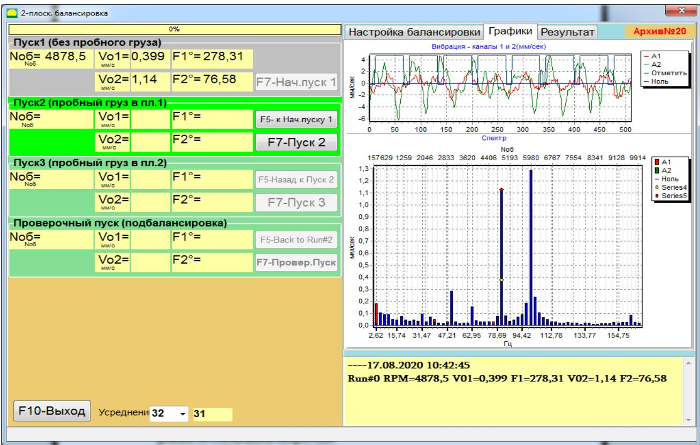
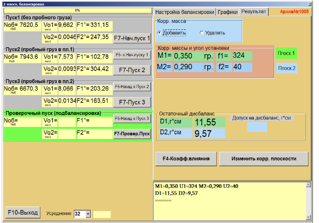
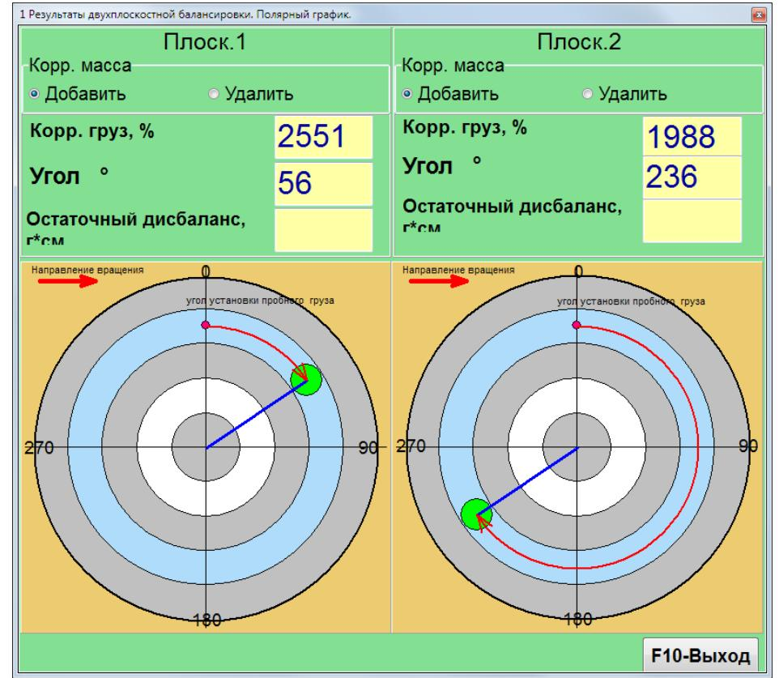
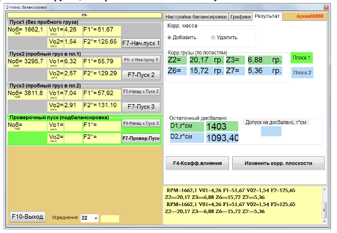
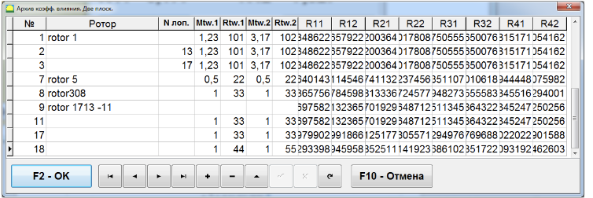
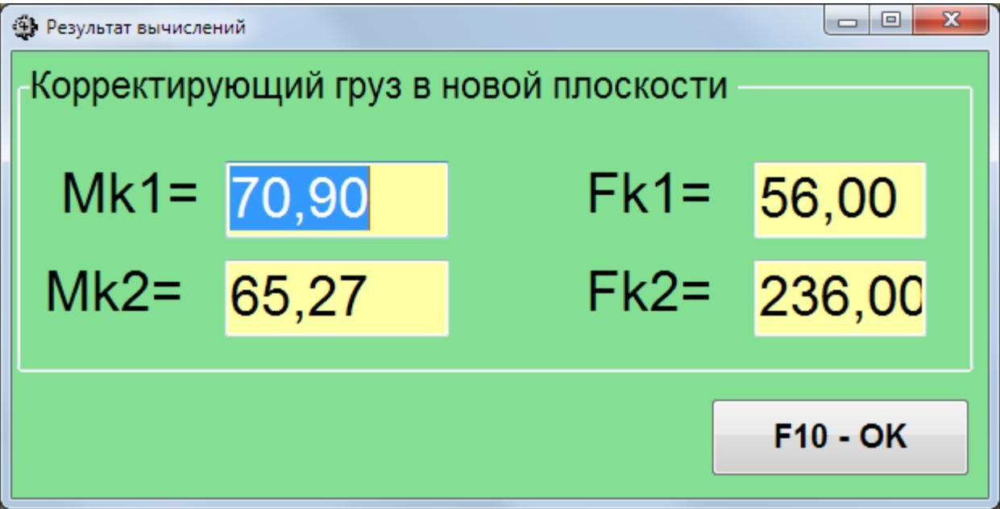

# 7.5.2. Проведение балансировки ротора с пробными пусками

В этом пункте вводятся необходимые настроечные параметры балансировки (см. п. 7.5.1).

> **Внимание!**  
> При использовании режима «Повторная» при первичной балансировке массы пробных грузов должны вводиться в граммах.

---

## 7.5.2.1. Пуск 1 (Без пробного груза)

Первичная балансировка требует проведения трех пробных пусков и, как минимум, одного проверочного пуска балансируемой машины.

Перед проведением балансировки строго рекомендуется измерить вибрацию в режиме виброметр (см. п. 7.3 «Работа прибора в режиме «F5 -- Виброметр»»). Обратите внимание на стабильность амплитуды и фазы вибрации от измерения к измерению.

**Шаги:**
- Проверьте правильность установки датчиков вибрации и тахометра в соответствии с разделом 7.4.1 «Подготовка к проведению балансировки».
- Включите вращение ротора и дождитесь его выхода на рабочий режим со стабильной скоростью.
- Нажмите кнопку **F7 – Нач. Пуск 1**.

После этого в правой панели откроется вкладка «F4 Настройки. Графики», где отображается форма временной функции вибрации и её спектр. В нижней части вкладки ведется файл истории (файл сохраняется в папке архива под именем *memo.txt*). 

При успешном завершении измерений в соответствующих окошках раздела «Пуск 1» появятся:
- Частота вращения ротора (**Nоб**);
- Величины вибрации (**Vо1, Vо2**) и фазы (**F1, F2**) на частоте вращения балансируемого ротора.

Для повторного измерения параметров вибрации можно воспользоваться кнопкой **«F5 – Назад к Пуск 1»**.

---

## 7.5.2.2. Пуск 2 (С пробным грузом в плоскости 1)

**Подготовка:**
- Остановите вращение ротора и дождитесь выхода на рабочий режим со стабильной скоростью.
- Установите на ротор в плоскости 1 пробный груз нужной массы (масса выбирается в разделе «F4 – Настройки. Масса пробного груза»).

> **Важно:**  
> 1. Вопрос выбора масс пробных грузов и мест их установки подробно рассмотрен в Приложении 1.  
> 2. При использовании режима «Повторная» место установки пробного груза должно совпадать с местом установки метки для отсчёта фазового угла.

**Действия:**
- Включите вращение ротора и дождитесь стабильного режима.
- Нажмите кнопку **F7 – Пуск 2**.

После измерения в правой панели откроется вкладка «F4 – Настройки. Графики», а в левой панели раздела **«Пуск2. Пробный груз в Плоск.1»** отобразятся:
- Частота вращения ротора (**Nоб**);
- Значения величин (**Vо1, Vо2**) и фаз (**F1, F2**) вибрации, проявляющиеся на частоте вращения ротора.

---

## 7.5.2.3. Пуск 3 (С пробным грузом в плоскости 2)

**Перед началом:**
- Остановите вращение ротора.
- **Снимите пробный груз, установленный в плоскости 1.**
- Установите на ротор пробный груз в плоскости 2 с массой, выбранной в разделе «F4 – Настройки. Масса пробного груза».
- Включите вращение ротора и убедитесь, что машина вышла на рабочий режим.

**Действия:**
- Нажмите кнопку **F7 – Пуск 3**.

После измерения в правой панели откроется вкладка «F4 – Настройки. Графики», а в левой панели раздела **«Пуск3. Пробный груз в Плоск.2»** отобразятся результаты измерений:
- Частота вращения ротора (**Nоб**);
- Значения величин (**Vо1, Vо2**) и фаз (**F1, F2**) вибрации.

После проведения пуска открывается вкладка **«Результат»** (см. рис. 7.35), в которой выводятся результаты расчёта параметров корректирующих грузов для установки на роторе в первой и второй плоскостях для компенсации дисбаланса.

Результаты зависят от выбранного **Способа установки грузов**:  
- При использовании **«Произвольного места»** выводятся значения масс (**М1, М2**) и углы установки (**F1, F2**) корректирующих грузов (см. рис. 7.35).  
- Если установлена галка **«Полярный график»**, открывается окно с круговой диаграммой, где визуально указано место установки грузов.

При разложении корректирующего груза по лопастям на дисплее для каждой плоскости отображаются номера лопастей (**Z1i, Z1j** и **Z2i, Z2j**) и массы грузов для установки.

> **Внимание!:**  
> 1. После завершения измерения на третьем пуске остановите вращение ротора и снимите установленный ранее пробный груз. Только после этого можно приступать к установке (или снятию) корректирующих грузов.  
> 2. Отсчёт углового положения добавления (или удаления) корректирующего груза в полярной системе координат выполняется от места установки пробного груза по направлению вращения ротора.  
> 3. При балансировке по лопастям лопасть, условно принимаемая за первую, совпадает с местом установки пробного груза; нумерация лопастей на дисплее выполняется по направлению вращения ротора.  
> 4. По умолчанию программа рассчитывает добавление груза на ротор (метка «Добавление»). При корректировке дисбаланса путём удаления груза (например, высверливанием) установите метку «F4 -- Настройки. Удалить» – угловое положение автоматически изменится на 180º.

---

## 7.5.2.4. Проверочный пуск

После установки корректирующих масс на ротор необходимо провести проверочный пуск для оценки качества балансировки.

> **Внимание!**  
> Перед началом измерения на проверочном пуске включите вращение ротора и убедитесь, что машина вышла на рабочий режим.

**Действия:**
- Нажмите кнопку **F7 – Проверочный Пуск** (или клавишу **F7** на клавиатуре).

В левой панели раздела **«Пуск Проверочный»** появятся результаты измерений:
- Частота вращения ротора (**Nоб**);
- Величины вибрации (**Vо1, Vо2**) и фазы (**F1, F2**) на частоте вращения ротора.

Одновременно в правой панели открывается вкладка **«Результат»** (см. рис. 7.16), где выводятся результаты расчёта параметров дополнительных корректирующих грузов. Эти грузы могут быть добавлены к уже установленным корректирующим грузам для компенсации остаточного дисбаланса. В нижней части окна также отображаются величины остаточного дисбаланса ротора после балансировки.

Если величины остаточной вибрации и/или остаточного дисбаланса удовлетворяют требованиям допусков, установленных в технической документации, процесс балансировки может быть завершён. В противном случае процесс балансировки продолжается методом последовательных приближений с установкой дополнительной корректирующей массы, параметры которой указываются в окне **«Результат»**.

---

## 7.5.3. Коэффициенты влияния

Кнопка **«F4 – Коэфф. влияния»** (или функциональная клавиша **F4**) используется для просмотра и запоминания в памяти компьютера коэффициентов балансировки ротора, рассчитанных по результатам первых двух пробных пусков.

При нажатии появляется рабочее окно **«Вид балансировки (2 плоск.)»** (см. рис. 7.17), где выводятся коэффициенты, рассчитанные по результатам трёх первых пробных пусков.

Если при последующей балансировке предполагается использовать режим **«Повторная»**, указанные коэффициенты необходимо сохранить в памяти компьютера. Для этого:
1. Нажмите кнопку **«F4 – Настройки. F9 – Сохранить»**.
2. Перейдите к окну **«Вид балансировки архив (2 плоск.)»** (см. рис. 7.41).
3. Введите название (тип) ротора, чтобы в дальнейшем при балансировке аналогичного ротора использовать сохраненные коэффициенты. В этом случае пуски с пробными грузами проводить не потребуется.

---

## 7.5.4. Изменение плоскостей коррекции

Кнопка **«F4 – Настройки. Изменить плоскости коррекции»** используется для пересчёта масс и углов установки корректирующих грузов при вынужденном изменении положения плоскостей коррекции. Этот режим особенно полезен при балансировке роторов сложной формы (например, коленчатых валов).

При нажатии этой кнопки появляется рабочее окно **«Пересчёт корр. грузов из плоскостей Н1, Н2 в К1, К2»** (см. рис. 7.11).

**Действия в рабочем окне:**
1. Выберите один из 4-х вариантов пересчёта, щёлкнув по соответствующему рисунку.  
   - Исходные плоскости коррекции (**Н1** и **Н2**) обозначены зелёным цветом.  
   - Новые плоскости (**К1** и **К2**), для которых производится пересчёт, обозначены красным.
2. В разделе **«F4 – Настройки. Данные для расчёта»** введите запрашиваемые данные:
   - Расстояния между соответствующими плоскостями коррекции (**a, b, c**).
   - Новые значения радиусов установки корректирующих грузов на роторе (**R1', R2'**).

3. Нажмите кнопку **«F4 – Настройки. F9-пересчитать»** (или функциональную клавишу **F9**) для выполнения расчёта.

**Результаты расчёта** (массы (**М1, М2**) и углы установки корректирующих грузов (**f1, f2**)) выводятся в соответствующем разделе рабочего окна.

