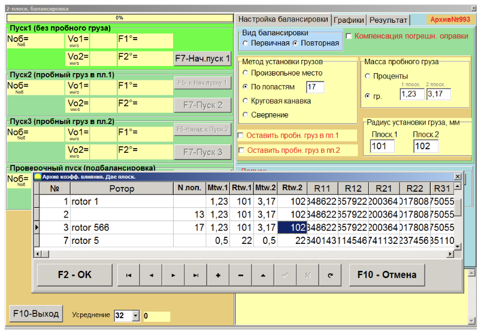
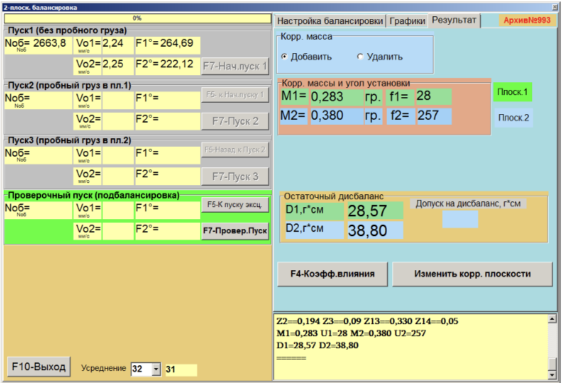
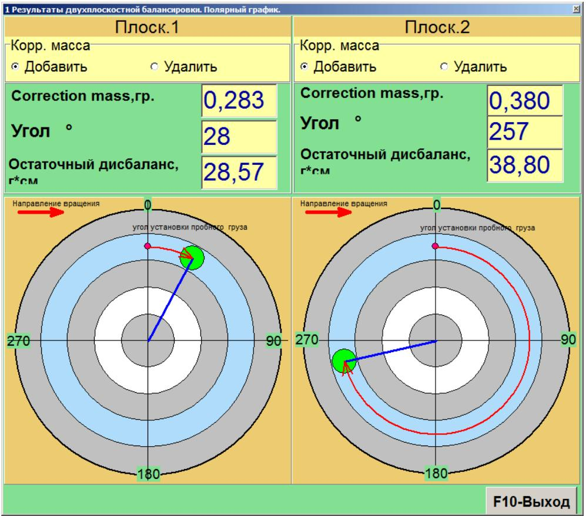
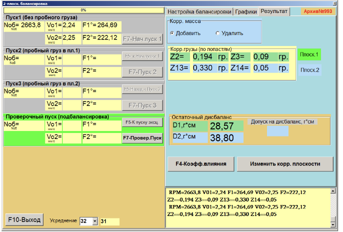
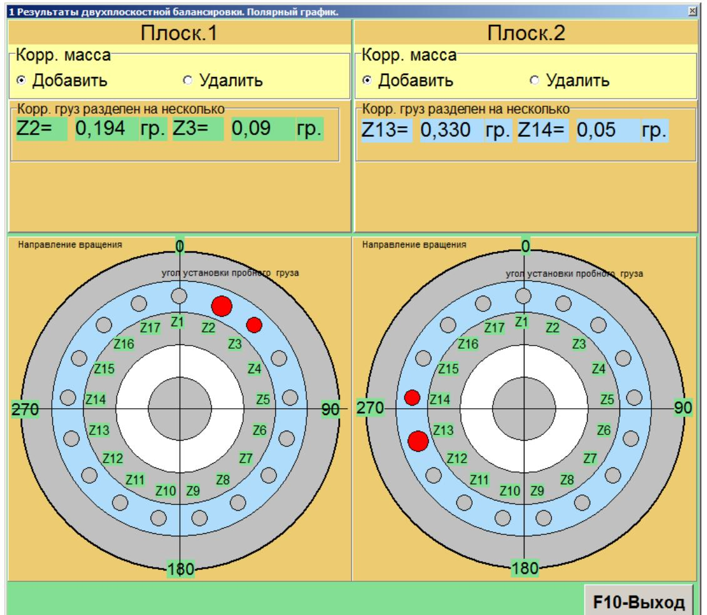

# 7.5.5. Повторная балансировка в 2-х плоскостях

## 7.5.5.1. Настройка измерительной системы (ввод исходных данных)

Повторная балансировка выполняется для машины, для которой ранее уже были определены и сохранены в архиве коэффициенты балансировки.

> **Внимание!**  
> При проведении повторной балансировки датчики вибрации и датчик фазового угла должны быть установлены точно так же, как при первичной балансировке. Обычно повторная балансировка производится на балансировочных станках для серийных изделий, где это условие выполняется.

**Действия:**
- В разделе «F4 Настройки. Вид балансировки» выберите пункт **«F4 Настройки. Повторная»**.
- В появившемся окне **«F4 Настройки. Архив коэфф. Влияния. Две плоск.»** выберите нужный ротор.
- Нажмите кнопку **«F2 OK»**. Необходимые данные заполнятся автоматически из архива.

---

## 7.5.5.2. Измерения при проведении повторной балансировки

Режим **«F4 Настройки. Повторная»** требует проведения всего одного настроечного пуска и, как минимум, одного проверочного пуска балансируемой машины.

**Действия:**
- Включите вращение ротора и убедитесь, что он находится в рабочем режиме со стабильной скоростью.
- Нажмите кнопку **«F4 Настройки. F7 – Нач. пуск 1»**.

После выполнения измерения в соответствующих окошках раздела **Пуск 1** отобразятся:
- Результаты измерения частоты вращения ротора (**Nоб**);
- Значения составляющих СКЗ (**Vо1, Vо2**) и фаз (**F1, F2**) вибрации, проявляющейся на частоте вращения балансируемого ротора.

Одновременно открывается вкладка **«Результат»** (см. рис. 7.45), в которой выводятся результаты расчёта параметров корректирующих грузов для установки на роторе с целью компенсации дисбаланса.

В случае использования полярной системы координат на дисплее выводятся значения масс и углов установки корректирующих грузов.

При установке переключателя **«F4 – Настройки. Полярный график»** выводится круговая диаграмма:

В случае разложения корректирующих грузов по лопастям на дисплее отображаются номера лопастей балансируемого ротора и массы грузов, которые необходимо установить:

Далее возможно проведение подбалансировки в соответствии с рекомендациями, изложенными в разделе 7.5.1.2 для первичной балансировки.