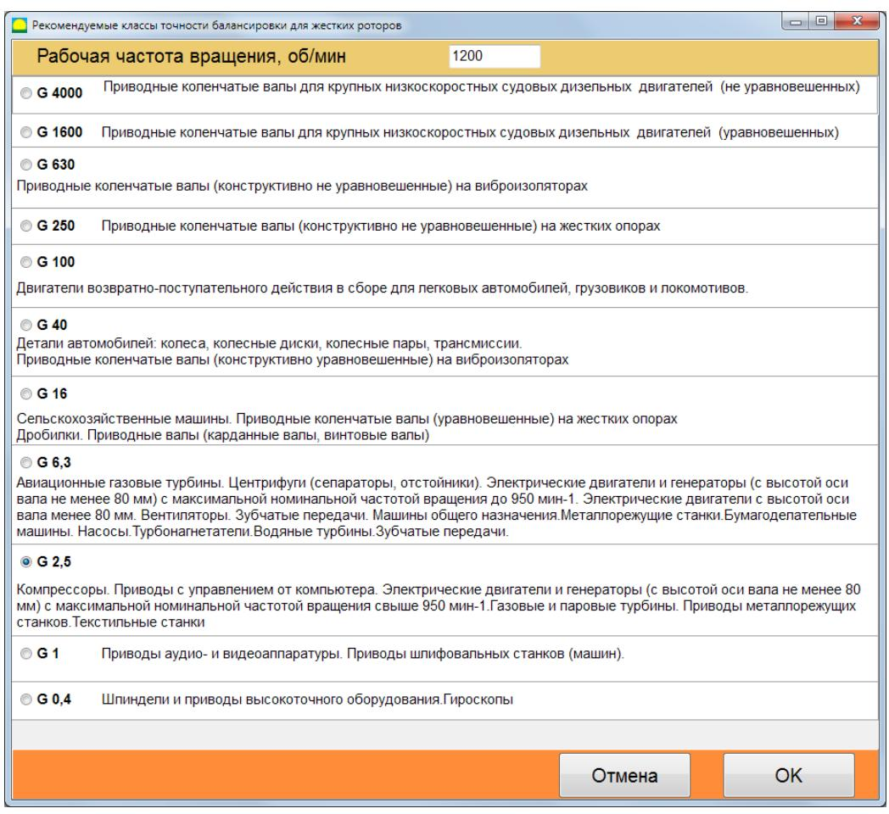

# 7.5. Балансировка в двух плоскостях (динамическая) (2 плоск. Балансировка)

## 7.5.1 Подготовка к балансировке

Перед началом работы в режиме «F4 – Настройки. 2 плоск. балансировка» необходимо выполнить следующие действия:

- Установить датчики вибрации на корпусе машины в выбранных точках измерения и подключить их соответственно к входам Х1 и Х2 измерительного блока.
- Подключить оптический датчик фазового угла к входу Х3 измерительного блока. Для его корректной работы на доступную поверхность ротора необходимо наклеить отражающую ленту.

  
Рис. 7.29. Светоотражающая лента

_Подробные требования по выбору места установки датчиков и их креплению изложены в Приложении 1._

Работа в режиме «2 плоск. Балансировка» начинается из главного рабочего окна программы. Для этого:
- Кликните по кнопке **«F3 – 2 плоск.»** (или нажмите клавишу **F3** на клавиатуре).
- Затем нажмите кнопку **«F7 – Балансировка»**. После этого на экране появится рабочее окно (см. рис. 7.13) для выбора архива, в который будут сохранены данные балансировки в двух плоскостях.

  
Рис. 7.29. Архив балансировок

В данном окне введите данные балансируемого ротора. После нажатия кнопки **«F4 – Настройки. F10-OK»** откроется окно балансировки.

  
Рис. 7.30. Рабочее окно при балансировке в двух плоскостях

В левой панели этого окна отображаются данные замеров вибрации при пусках и кнопки управления измерениями:
- **F4 – Настройки. Пуск 1**
- **F4 – Настройки. Пуск 2**
- **F4 – Настройки. Проверочный Пуск**

Справа расположены три вкладки:
- **F4 – Настройки. Настройка балансировки**
- **F4 – Настройки. Графики**
- **F4 – Настройки. Результат**

Во вкладке **«F4 – Настройки. Настройка балансировки»** вводятся основные настройки, которые описаны ниже.

### Вид балансировки

- **Первичная.**  
  Выбирается, если балансируется новый ротор, для которого не сохранены балансировочные коэффициенты. При первичной балансировке требуется провести два пуска:  
  – первый пуск для определения исходной вибрации машины,  
  – второй пуск после установки пробного груза для тарировки прибора.
  
- **Повторная.**  
  Выбирается, если балансировка выполняется для машины, для которой уже сохранены коэффициенты балансировки. В этом случае достаточно провести один пуск для определения массы и места установки корректирующего груза.

### Масса пробного груза

- **«Проценты»**  
  Если масса пробного груза неизвестна, масса корректирующего груза рассчитывается в процентах от пробного.
  
- **«Грамм»**  
  Если масса пробного груза известна, она вводится в граммах, и масса корректирующего груза рассчитывается в граммах.

> **Внимание!**  
> При использовании режима «Повторная» при первичной балансировке масса пробного груза должна обязательно вводиться в граммах.

Для взвешивания грузов в комплект поставки также включены весы.

### Метод установки грузов

- **«Произвольное»**  
  Грузы можно устанавливать в произвольное место по углу на окружности ротора.
  
- **«По лопастям»**  
  Грузы устанавливаются в определенные места по углу (например, на лопасти или в равномерно распределенные позиции – 12 отверстий через 30°). Число лопастей вводится в соответствующее поле. После балансировки программа автоматически разделит массу груза на две части и укажет номера позиций (лопастей).
  
- **Круговая канавка**  
  Используется при балансировке шлифовальных кругов, когда три груза сдвигаются в круговой канавке на роторе для компенсации дисбаланса.
  
- **Сверление**  
  Применяется для снятия массы путём высверливания (вместо установки грузов). В этом режиме необходимо ввести диаметр сверла и другие параметры.

  
Рис. 7.31. Окно ввода параметров при сверлении

### Радиус установки груза

Радиус установки пробного груза в плоскости 1 требуется для расчета величины исходного и остаточного дисбаланса и определения соответствия допуску после балансировки.

### Другие параметры

- **«Оставить пробный груз Плоск.1/Плоск.2»**  
  Обычно пробный груз снимается, но если его невозможно снять, установите галочку для учета пробного груза при вычислениях.
  
- **«Ручной ввод данных»**  
  Позволяет вручную ввести значения вибрации и фазы в соответствующие поля левой части окна для расчета массы и места установки корректирующего груза при переходе на вкладку **«F4 – Настройки. Результат»**.
  
- **«Полярный график»**  
  После проведения измерений в виде круговой диаграммы отображаются результаты.
  
- **«Восстановить последние данные»**  
  Если процесс измерения был прерван, нажмите эту кнопку для восстановления данных. Измеренные данные сохраняются в файле `session1.ini`.

### Компенсация погрешности оправки

При балансировке ротора на станке ротор часто закрепляется во фланцах оправки. Это может вызвать дополнительный дисбаланс из-за несовпадения осей ротора и оправки. Для компенсации этой погрешности проводится дополнительный замер: ротор разворачивается в оправке на 180°.

### Допуск

В данном разделе можно ввести допуск на остаточный дисбаланс (если он известен) или рассчитать его согласно ГОСТ ИСО 1940-1–2007.

Чтобы рассчитать допуск:
1. Введите массу ротора и нажмите кнопку **Вычислить**.

  
Рис. 7.32. Панель ввода допуска на остаточный дисбаланс

2. Затем введите рабочую частоту вращения ротора и выберите требуемый класс точности. Рассчитанный допуск появится в поле **«F4 – Настройки. Допуск на дисбаланс, г∙см»**.

  
Рис. 7.33. Рекомендуемые классы точности для балансировки жестких роторов