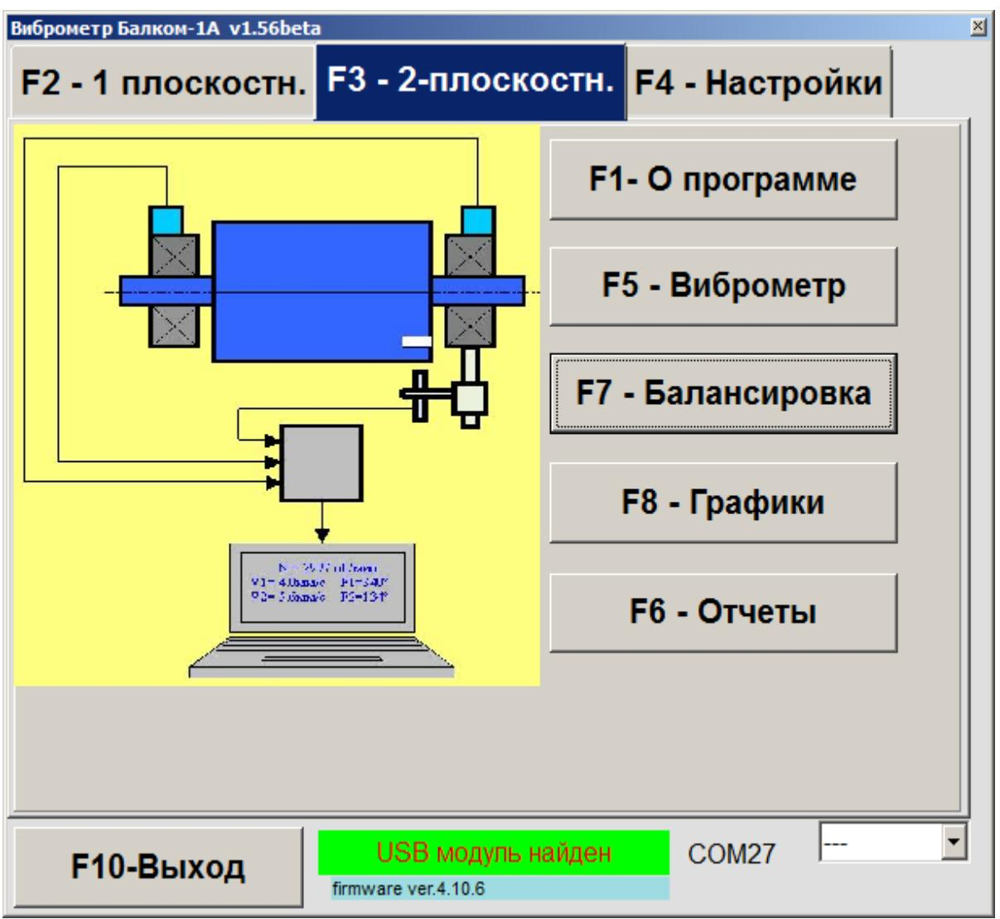
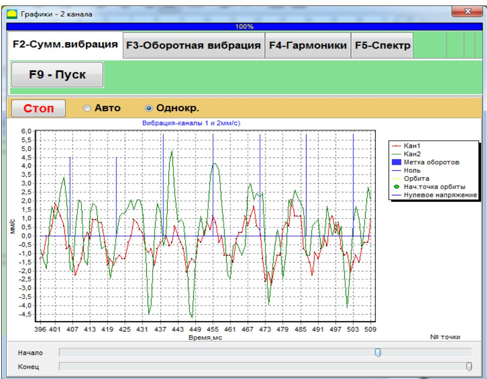
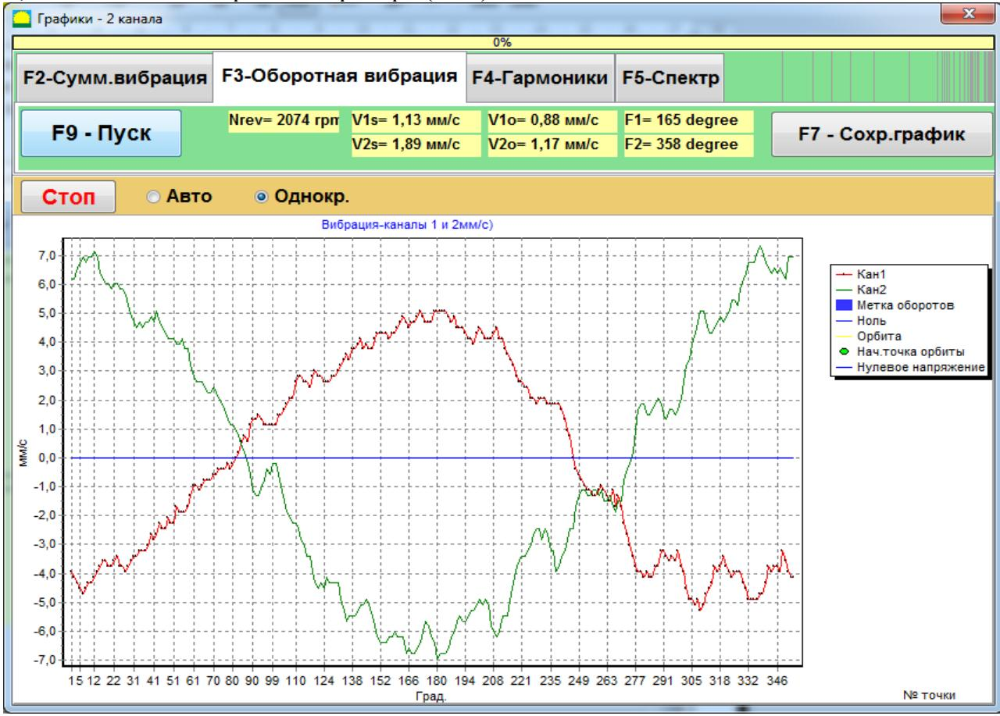
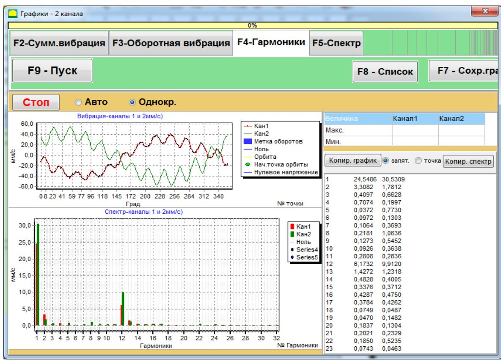
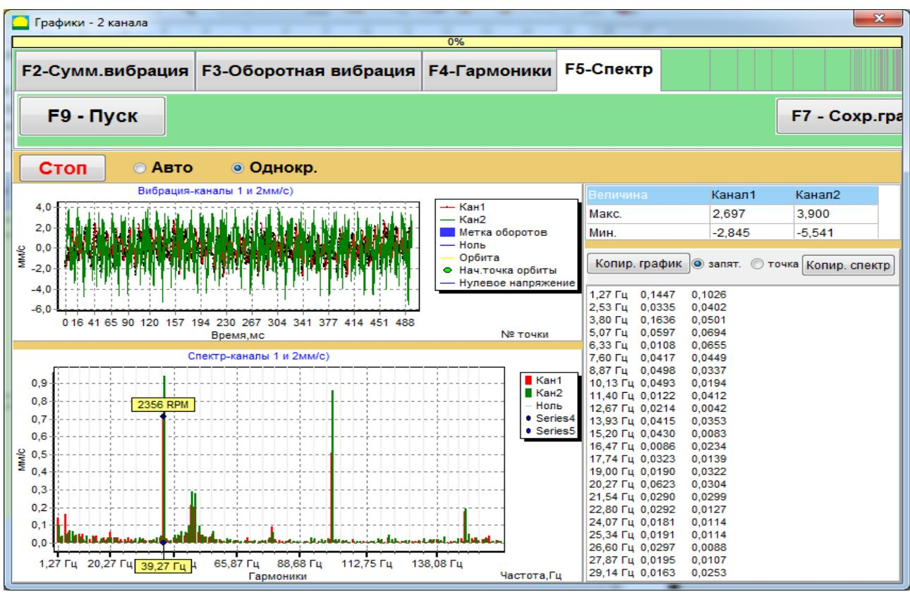

# 7.6. Работа в режиме «Графики»

Работа в режиме «F4 – Настройки. Графики» начинается из главного рабочего окна программы (см. рис. 7.1).

  
Рис. 7.49. Рабочее окно программ для работы в режиме «F4 – Настройки. Графики»

Чтобы перейти в режим графиков, нажмите кнопку **«F8 – Графики»**. После этого на экране появится рабочее окно (см. рис. 7.50), в котором можно построить четыре вида графиков вибрации.

На первой вкладке отображается график временной функции (**wave**) суммарной вибрации (по виброскорости) по первому и второму измерительным каналам.

Второй вариант позволяет построить графики вибрации (по виброскорости) для оборотной частоты ротора и её более высоких гармоник. Эти графики получаются в результате синхронной фильтрации временной функции суммарной вибрации.

Третий вариант выводит графики вибрации с результатами гармонического анализа, а четвертый – графики с результатами спектрального анализа.

  
Рис. 7.50. Рабочее окно для работы в режиме «F4 – Настройки. Графики». График временной функции суммарной вибрации

---

## 7.6.1. Графики временной функции суммарной вибрации

Чтобы построить графики временной функции суммарной вибрации:
1. В рабочем окне «F4 – Настройки. Измерение вибрации по двум каналам. Графики» нажмите кнопку **«F4 – Настройки. Суммарная вибрация»**.
2. Задайте время измерения, кликнув по кнопке **«F4 – Настройки. ▼»** и выбрав длительность (1, 5, 10, 15 или 20 секунд).
3. Нажмите кнопку **«F4 – Настройки. F7 – Измерить»** для начала измерения вибрации по двум каналам.

После завершения измерения появятся графики временной функции суммарной вибрации:
- Красным цветом — данные с первого канала;
- Зеленым цветом — данные со второго канала.

На графиках по оси **X** откладывается время, а по оси **Y** — амплитуда виброскорости (мм/сек). Дополнительно на графиках отображаются синие метки, привязывающие данные к частоте вращения ротора (каждая метка указывает на начало или завершение очередного оборота). При необходимости масштаб по оси **X** можно изменить с помощью соответствующего регулировочного элемента внизу окна.

---

## 7.6.2. Графики временной функции оборотной вибрации

Чтобы построить графики оборотной вибрации:
1. В окне «F4 – Настройки. Измерение вибрации по двум каналам. Графики» нажмите кнопку **«F4 – Настройки. Оборотная вибрация»**.
2. После этого откроется рабочее окно для измерения оборотной вибрации (см. рис. 7.51).
3. Нажмите кнопку **«F4 – Настройки. F7 – Измерить»** для начала процесса измерения.

После обработки результатов (синхронной фильтрацией временной функции суммарной вибрации) на экране появляется график оборотных составляющих вибрации:
- Красным цветом – данные по первому каналу;
- Зеленым цветом – данные по второму каналу.

В этом режиме по оси **X** откладывается угол поворота ротора за один оборот (от метки до метки), а по оси **Y** — амплитуда виброскорости (мм/сек).

Кроме того, в верхней части рабочего окна (справа от кнопки **«F4 – Настройки. F7 – Измерить»**) выводятся цифровые значения результатов, аналогичные тем, что показываются в режиме **«Виброметр»**:  
- Величины СКЗ суммарной вибрации (**V1s, V2s**);
- Величины СКЗ (**V1o, V2o**) и фазы (**F1, F2**) первой гармоники оборотной вибрации;
- Частота вращения ротора (**Nоб**).

  
Рис. 7.51. Рабочее окно для вывода графиков оборотных составляющих вибрации

---

## 7.6.3. Графики вибрации с результатами гармонического анализа

Для построения графиков с гармоническим анализом:
1. В рабочем окне «F4 – Настройки. Измерение вибрации по двум каналам. Графики» нажмите кнопку **«F4 – Настройки. Гармонический анализ»**.
2. После этого появляется рабочее окно, в котором одновременно выводятся график временной функции (верхний график) и спектр гармонических составляющих вибрации (нижний график).

В графике спектра по оси **X** указывается номер гармоники, а по оси **Y** — амплитуда виброскорости (мм/сек). Данные первого канала отображаются красным, второго — зеленым.

> **Внимание!**  
> Для работы в данном режиме необходимо использовать датчик фазового угла, который обеспечивает синхронизацию измерения с частотой вращения ротора.

Перед началом измерения выберите число оборотов ротора (1, 2, 4 или 8), кликнув по кнопке **«F4 – Настройки. ▼»** и выбрав нужное значение, затем нажмите **«F4 – Настройки. F7 – Измерить»**.

После выполнения измерения появятся два графика:
- Верхний — временная функция;
- Нижний — спектр гармонических составляющих.

  
Рис. 7.52. Рабочее окно для вывода спектра гармонических составляющих вибрации

---

## 7.6.4. Графики вибрации с результатами спектрального анализа

Для построения графиков с спектральным анализом:
1. В рабочем окне «F4 – Настройки. Измерение вибрации по двум каналам. Графики» нажмите кнопку **«F4 – Настройки. Спектральный анализ»**.
2. Откроется рабочее окно для одновременного вывода графика временной функции (верхний график) и частотного спектра вибрации (нижний график).
3. Нажмите кнопку **«F4 – Настройки. F7 – Измерить»** для начала измерения.

После завершения измерения:
- Верхний график показывает временную функцию,
- Нижний график – спектр вибрации, где по оси **X** откладывается частота (Гц), а по оси **Y** – амплитуда виброскорости (мм/сек).

Данные первого канала отображаются красным, второго – зеленым.

  
Рис. 7.53. Рабочее окно для вывода спектрального анализа вибрации