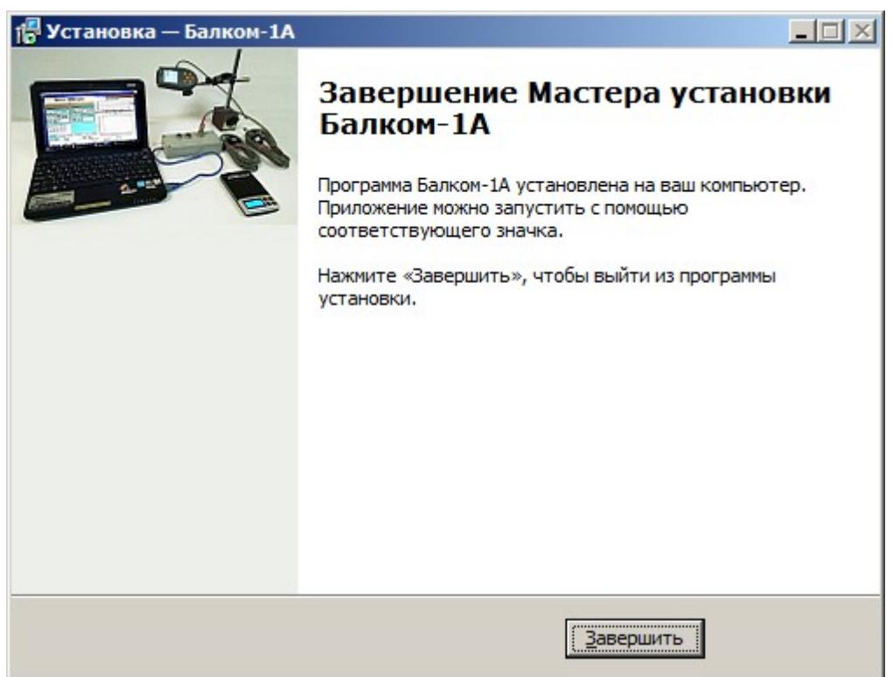
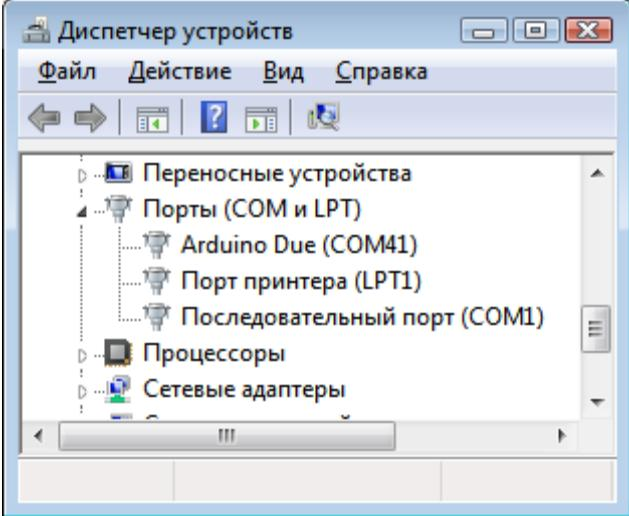
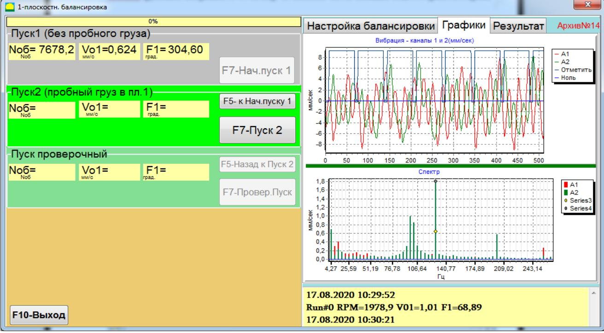
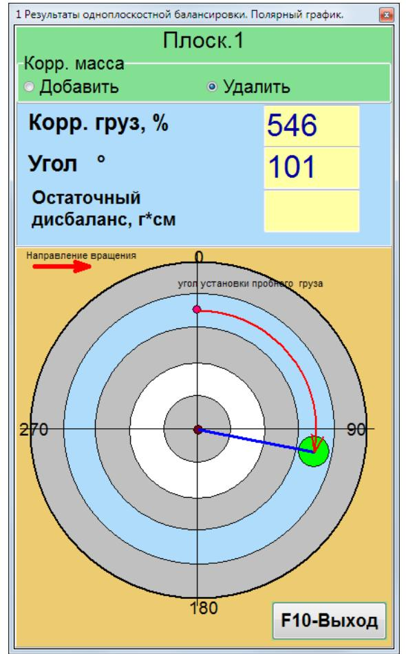
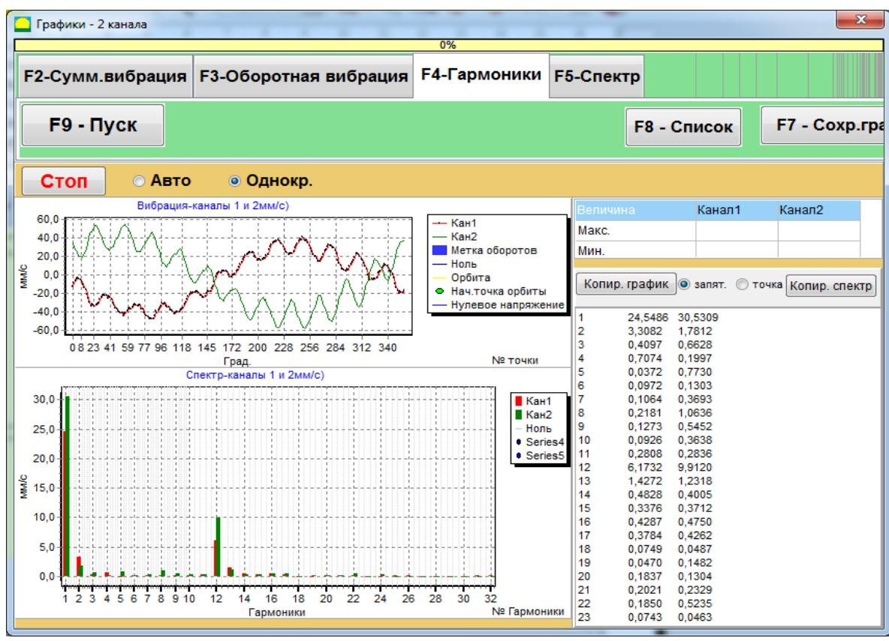

# ООО"Кинематика"

198095, Санкт-Петербург, ул.Шкапина, д.32-34 Тел +7 (812) 252-1919 E-mail:[oookin2016@yandex.ru](mailto:oookin2016@yandex.ru)

**ПРИБОР ДЛЯ БАЛАНСИРОВКИ МЕХАНИЗМОВ «Балком-1А» ПО версия 1.56А**

## **РУКОВОДСТВО ПОЛЬЗОВАТЕЛЯ**

**версия 1.56А**

**2023г.**

Санкт-Петербург

## **СОДЕРЖАНИЕ**

|    |     |                                                                                | Лист |
|----|-----|--------------------------------------------------------------------------------|------|
| 1. |     | Назначение                                                                     | 4    |
| 2. |     | Технические характеристики                                                     | 5    |
| 3. |     | Состав изделия и комплект поставки                                             | 6    |
| 4. |     | Устройство и принцип работы прибора                                            | 7    |
| 5. |     | Указания мер безопасности                                                      | 8    |
| 6. |     | Установка программного обеспечения и подготовка прибора к работе               | 9    |
| 7. |     | Работа с прибором                                                              | 16   |
|    | 7.1 | Главное рабочее окно программ. Назначение основных управляющих кно пок      | 16   |
|    | 7.2 | Настройка прибора. Кнопка «F4 – Настройки».F4 – Настройки».                    | 21   |
|    | 7.3 | Работа в режиме «F4 – Настройки».Виброметр»                                    | 20   |
|    | 7.4 | Балансировка в одной плоскости                                                 | 24   |
|    |     | 7.4.1 Подготовка к проведению балансировки                                     | 24   |
|    |     | 7.4.2. Проведение балансировки в одной плоскости                               | 28   |
|    |     | 7.4.2.1 Пуск 1 (Без пробного груза)                                            | 28   |
|    |     | 7.4.2.2 Пуск 2 (C пробным грузом)                                              | 29   |
|    |     | 7.4.2.3 Проверочный пуск                                                       | 33   |
|    |     | 7.4.3. Проведение балансировки с размещением 3-х грузов в канавке на роторе | 34   |
|    |     | 7.4.4. Коэффициенты влияния (балансировочные коэффициенты)                     | 35   |
|    |     | 7.4.6. Протокол балансировки                                                   | 37   |
|    |     | 7.4.7. Повторная. балансировка в 1-й плоскости                                 | 39   |
|    | 7.5 | Балансировка в двух плоскостях (динамическая)                                  | 41   |
|    |     | 7.5.1 Подготовка к балансировке                                                | 41   |
|    |     | 7.5.2. Проведение балансировки ротора с пробными пусками.                      | 45   |
|    |     | 7.5.2.1 Пуск 1 (Без пробного груза)                                            | 45   |
|    |     | 7.5.2.2 Пуск 2 (С пробным грузом в плоскости 1)                                | 46   |
|    |     | 7.5.2.3 Пуск 3 (С пробным грузом в плоскости 2)                                | 47   |
|    |     | 7.5.2.4 Проверочный пуск                                                       | 50   |
|    |     | 7.5.3. Коэффициенты влияния                                                    | 51   |
|    |     | 7.5.4. Изменение плоскостей коррекции                                          | 52   |
|    |     | 7.5.5. Повторная балансировка в 2-х плоскостях.                                | 54   |
|    | 7.6 | Работа в режиме «F4 – Настройки».Графики»                                      | 58   |

#### **1. НАЗНАЧЕНИЕ**

Прибор «F4 – Настройки».Балком-1А» (далее по тексту «F4 – Настройки».Прибор») предназначен для балансировки в одной или двух плоскостях коррекции роторов, вращающихся в собственных подшипниках.

Прибор включает в себя два датчика вибрации, датчик фазового угла, измерительный блок.

Результаты всех балансировок сохраняются в архиве балансировки и при необходимости могут быть распечатаны в виде протоколов.

Прибор «F4 – Настройки».Балком-1А» может использоваться как виброметр, позволяющий осуществлять измерение среднего квадратического значения (СКЗ) суммарной вибрации, СКЗ оборотной составляющей вибрации и частоты вращения контролируемого ротора.

В качестве датчиков вибрации использованы микросхемные акселерометры (MEMSакселерометры).

Прибор позволяет выводить на дисплей графики временной функции и спектра вибрации по виброскорости, что может быть полезным при оценке технического состояния балансируемой машины.

## 2. ТЕХНИЧЕСКИЕ ХАРАКТЕРИСТИКИ

2.1.Диапазон измерения среднего квадратического значения (СКЗ) виброскорости, мм/ сек

|  в широкой полосе                                                                                        | от 0.2 до 100     |
|--------------------------------------------------------------------------------------------------------------|-------------------|
|  в узкой полосе (при балансировке)                                                                       | от 0.02 до 100    |
| 2.2. Частотный диапазон измерения СКЗ виброскорости, Гц                                                   | от 5 до 200 (500) |
| 2.3. Число плоскостей коррекции при балан сировке                                                         | 1 или 2           |
| 2.4. Диапазон измерения частоты вращения, об/мин                                                          | 100 - 100000      |
| 2.5. Диапазон измерения сдвига фазы вибра ции, угловых градусов 2.6. Пределы допускаемой абсолютной по | от 0 до 360       |
| грешности измерения сдвига фазы вибра ции, угловых градусов                                               | ± 1               |
| 2.7.Габаритные размеры измерительного блока, мм, не более                                                 | 160*70*40         |
| 2.8 Масса измерительного блока, кг, не бо лее                                                             | 0.9               |
| 2.9. Габаритные размеры вибропреобразова теля, мм, не более                                               | 25*25*20          |
| 2.10. Масса вибропреобразователя (без маг нита крепления), кг, не более                                   | 0.04              |
| 2.11. Условия эксплуатации:                                                                                  |                   |
| ▪ температура окружающего воздуха, °C C                                                                      | от 1 до 45        |
| ▪ относительная влажность воздуха при температуре 25 °C C, %                                              | до 80             |
| ▪ атмосферное давление, кПа                                                                                  | от 84 до 106.7    |

## **3. СОСТАВ ИЗДЕЛИЯ И КОМПЛЕКТ ПОСТАВКИ**

Базовый комплект поставки прибора «F4 – Настройки».Балком-1А» включает в себя измерительный блок, два датчика вибрации, датчик фазового угла, оснастку, необходимую пользователю для выполнения основных измерений, а также флеш-диск с программным обеспечением.

| Наименование                                                                                  | Кол во | Примечание                           |
|-----------------------------------------------------------------------------------------------|-----------|--------------------------------------|
| Блок измерительный                                                                            | 1         | Зав.№                                |
| Тахометр (датчик фазового угла)                                                               | 1         |                                      |
| Акселерометр (вибропреобразователь)                                                           | 2         | Кпр1= мВ/мм/с Кпр2= мВ/мм/с |
| Штатив магнитный                                                                              | 1         |                                      |
| Весы электронные                                                                              | 1         |                                      |
| Чемодан для транспортировки                                                                   | 1         |                                      |
| Документация                                                                                  |           |                                      |
| Прибор для балансировки механизмов «F4 – Настройки».Балком-1А». Руко водство пользователя. |           |                                      |
| Программное обеспечение на флеш-диске                                                         | 1         |                                      |

#### **Комплект поставки**

## **4. УСТРОЙСТВО И ПРИНЦИП РАБОТЫ ПРИБОРА**

**4.1**. Внешний вид прибора «F4 – Настройки».Балком-1А» представлен на рис. 4.1 и 4.2.

Прибор (см. рис. 4.1) состоит из измерительного блока **1**, двух датчиков вибрации **2** и **3**, датчика фазового угла **4** и портативного компьютера (ноутбука -в комплект поставки не входит) **5**.

В комплект поставки прибора также включена оснастка, необходимая для проведения балансировки механизмов в полевых условиях - магниты, используемые для установки на объекте датчиков вибрации, и магнитный штатив, используемый для установки датчика фазового угла, весы.

На лицевой стенке корпуса (см. рис. 4.2) расположены разъёмы Х1 и Х2, предназначенные для подключения датчиков вибрации соответственно к 1 и 2 измерительным каналам прибора, а также разъём Х3, используемый для подключения датчика фазового угла.

Из боковой стенки корпуса выведен кабель с USB-разъёмом, предназначенный для подключения измерительного блока к компьютеру.

По этому кабелю осуществляется обмен информацией между измерительным блоком и компьютером, а также обеспечивается подача питания **+5 В** к измерительному блоку.

Рис. 4.1. Прибор для балансировки «F4 – Настройки».Балком-1А» в комплекте

 Рис. 4.2. Измерительный блок прибора «F4 – Настройки».Балком-1А»

**4.2.** Функционирование прибора

Принцип действия прибора основан на измерении механических колебаний, которые имеют место на корпусах машин при их работе.

Для преобразования механических колебаний в электрический сигнал используются датчики вибрации – акселерометры **2, 3**. Для определения частоты вращения и фазовых характеристик сигнала используется датчик фазового угла **4** (тахометр), работающий на отражение луча лазера от отражающей ленты..

Под воздействием механических колебаний на выходе датчика вибрации формируется электрический аналоговый сигнал пропорциональный **виброускорению**, который подается на соответствующий вход Х1 и Х2 измерительного блока прибора.

Далее после преобразования (интегрирования, полосовой фильтрации) сигнал пропорциональный **виброскорости** поступает на вход платы АЦП измерительного блока.

Для измерения частоты вращения и фазовых характеристик вибрационного сигнала используется импульсный сигнал, формируемый датчиком фазового угла (вх. Х3)

Аналоговые сигналы, поступающих с датчиков, преобразуются в цифровую форму и по шине USB передаются в портативный компьютер**,** в котором по заданной программе осуществляется дальнейшая обработка (фильтрация, Фурье – анализ, вычисление параметров балансировки и т.д.).

Полученные результаты ( численные значения амплитуды и фазы вибрации, частоты вращения и т.п.) сохраняются в памяти компьютера и выводятся на дисплей.

## **5. УКАЗАНИЯ МЕР БЕЗОПАСНОСТИ**

**5.1. Внимание!** При работе прибора от сети 220В необходимо соблюдать правила электробезопасности. Не допускается проводить ремонт прибора при его подключении к сети 220 В.

**5.2.** В случае эксплуатации прибора в условиях низкого качества сетевого питания и заметных сетевых помех рекомендуется использовать режим автономного питания от аккумуляторов компьютера.

## **6. УСТАНОВКА ПРОГРАММНОГО ОБЕСПЕЧЕНИЯ И ПОДГОТОВКА ПРИБО-РА К РАБОТЕ**

#### **6.1 Общие сведения**

Перед началом работы с прибором "**Балком-1А**" (далее по тексту Прибор), необходимо произвести его подключение к персональному компьютеру и установить специализированное программное обеспечение, которое в дальнейшем будет использоваться при работе с прибором.

**6.2. Установка ПО и подключение измерительного блока к компьютеру.**

В этом разделе приводится информация о том, как подключить измерительный блок к персональному компьютеру (ПК), сконфигурировать ПК и убедиться в корректной работе модуля.

## **6.2.1 Установка USB драйверов и специализированного программного обеспечения прибора «Балком-1А».**

6.2.1.1. Перечень папок и файлов, используемых при установке ПО.

На установочном диске (флеш-диске или CD), поставляемом в комплекте ), поставляемом в комплекте прибора, находятся следующие папки и файлы:

**Bal1A –** папка с со специализированным программным обеспечением для прибора Балком (программа для балансировки)

**ArdDrv –** папка с драйверами USB

**EBalancer\_manual.pdf –** файл данного руководства

**Bal1AvXXXSetup.exe –** файл программ установки, где ХХХ — номер версии программы. В этом файле в архивированном виде находятся все вышеуказанные файлы и папки.

## **Внимание!**

**Обновленную версию программы можно скачать по ссылке с сайта.**

## **Полученный zip архив перед установкой программы необходимо распаковать!**

6.2.1.2. Установка программного обеспечения.

Для установки драйверов и специализированного ПО необходимо запустить файл **Bal1AvXXXSetup.exe** и далее следовать указаниям программ установки, нажимая

## кнопки «F4 – Настройки».Далее» , «F4 – Настройки».ОК» и т.д.

Изменять предложенную папку не рекомендуется.

Далее, когда программа попросит указать Программную группу и ярлыки на рабочем столе, то следует по готовности просто нажимать кнопку ОК. После этого появится окно «F4 – Настройки».Все готово к установке»

| Установка - Балком-1А                                                                       |  |  |  |  |  |
|---------------------------------------------------------------------------------------------|--|--|--|--|--|
| Выбор папки установки В какую папку вы хотите установить Балком-1А?                      |  |  |  |  |  |
| Программа установит Балком-1А в следующую папку.                                            |  |  |  |  |  |
| Нажмите «Далее», чтобы продолжить. Если вы хотите выбрать другую папку, нажмите «Обзор». |  |  |  |  |  |
| C:\Users\sHell\Documents\BalSoft\Balkom1A Обзор                                          |  |  |  |  |  |
| Требуется как минимум 39,0 Мб свободного дискового пространства.                            |  |  |  |  |  |
|                                                                                             |  |  |  |  |  |
| < Назад   Далее >   Отмена                                                                  |  |  |  |  |  |

| Установка - Балком-1А                                                          |                                                                         |  |  |  |  |  |
|--------------------------------------------------------------------------------|-------------------------------------------------------------------------|--|--|--|--|--|
| Выберите папку в меню «Пуск» Где программа установки должна создать ярлыки? |                                                                         |  |  |  |  |  |
| Программа создаст ярлыки в следующей папке меню «Пуск».                        |                                                                         |  |  |  |  |  |
| нажмите «Обзор».                                                               | Нажмите «Далее», чтобы продолжить. Если вы хотите выбрать другую папку, |  |  |  |  |  |
| Bal 1Av 156                                                                    | Обзор                                                                   |  |  |  |  |  |
|                                                                                |                                                                         |  |  |  |  |  |
| Не создавать папку в меню «Пуск»                                               |                                                                         |  |  |  |  |  |
|                                                                                | < Назад   Далее >   Отмена                                              |  |  |  |  |  |

| Установка - Балком-1А                                                                                               |  |  |  |  |  |  |
|---------------------------------------------------------------------------------------------------------------------|--|--|--|--|--|--|
| Выберите дополнительные задачи Какие дополнительные задачи необходимо выполнить?                                 |  |  |  |  |  |  |
| Выберите дополнительные задачи, которые должны выполниться при установке Балком-1А, после этого нажмите «Далее»: |  |  |  |  |  |  |
| Дополнительные значки:                                                                                              |  |  |  |  |  |  |
| Создать значок на Рабочем столе >                                                                                |  |  |  |  |  |  |
| Создать значок в Панели быстрого запуска                                                                            |  |  |  |  |  |  |
|                                                                                                                     |  |  |  |  |  |  |
| < Назад   Далее >   Отмена                                                                                          |  |  |  |  |  |  |

| Установка - Балком-1А                                                                                            |        |
|------------------------------------------------------------------------------------------------------------------|--------|
| Всё готово к установке Программа установки готова начать установку Балком-1А на ваш компьютер.             |        |
| Нажмите «Установить», чтобы продолжить, или «Назад», если вы хотите просмотреть или изменить опции установки. |        |
| Папка установки: C:\Users\sHell\Documents\BalSoft\Balkom1A                                                    |        |
| Папка в меню «Пуск»: Ba 1Av 156                                                                               |        |
| Дополнительные задачи: Дополнительные значки: Создать значок на Рабочем столе                              |        |
|                                                                                                                  |        |
| Установить < Назад                                                                                            | Отмена |

## Нажмите кнопку **«Установить»**

| Установка - Балком-1А                                                             |        |
|-----------------------------------------------------------------------------------|--------|
| Установка Пожалуйста, подождите, пока Балком-1А установится на ваш компьютер.  |        |
| Распаковка файлов C:\Users\sHell\Documents\BalSoft\Balkom1A\ArdDrv\arduino.cat |        |
|                                                                                   |        |
|                                                                                   |        |
|                                                                                   |        |
|                                                                                   |        |
|                                                                                   | отмена |

**Далее появится окно мастера установки драйверов.**

| Мастер установки драйверов устройств |                                                                                                                                                                               |
|--------------------------------------|-------------------------------------------------------------------------------------------------------------------------------------------------------------------------------|
|                                      | Мастер установки драйверов устройств Этот мастер поможет установить драйверы, необходимые для работы некоторых устройств. Для продолжения нажмите кнопку "Далее". |
|                                      | < Назад   Далее >   Отмена                                                                                                                                                 |

## **Далее нажмите кнопки "Далее», «Готово»**

| Мастер установки драйверов устройств |                                                                                                                                                            |
|--------------------------------------|------------------------------------------------------------------------------------------------------------------------------------------------------------|
|                                      | Завершение мастера установки драйверов устройств                                                                                                        |
|                                      | Программное обеспечение для вашего оборудования не было обновлено, поскольку предлагаемое программное обеспечение ничем не лучше уже установленного. |
|                                      | Состояние Имя драйвера Arduino LLC (www.ardui  Готов к эксплуатации                                                                                  |
|                                      | < Назад Готово     Отмена                                                                                                                               |

## **Нажмите кнопку «Готово». Появится окно установки базы данных.**

## **Нажмите кнопку "Next", затем "Install" и "Finish""**

**Для завершения загрузки нажмите кнопку «Завершить»**

**В результате на компьютер установились все необходимые драйвера и специализированное программное обеспечение прибора Балком. После этого можно подключать измерительный блок к компьютеру.**

#### **6.2.3. Подключение измерительного блока к компьютеру**

 Включите питание компьютера, если оно было выключено, и загрузите операционную систему Windows XP/Vista/Win7/Win8/Win10 .

 Соедините **USB** разъём **блока** (см. Рис.4.1. «F4 – Настройки».Руководство по эксплуатации») с любым свободным **USB** портом компьютера и **дождитесь распознавания устройства операционной системой** .

## **6.2.4. Распознавание модуля АЦП измерительного блока.**

6.2.4.1. При самом первом подсоединении модуля измерительного блока к компьютеру с помощью **USB** кабеля операционная система сама скопирует все требуемые ей файлы в нужные места и сделает все необходимые записи в реестре.

Проконтролировать правильность распознавания операционной системой подключенного модуля можно в «F4 – Настройки».Диспетчере устройств». Там в появившемся разделе «F4 – Настройки».Порты COM и LPT» должно отображаться устройство «Arduino Due», как это,» должно отображаться устройство «F4 – Настройки».Arduino D), поставляемом в комплекте ue», как это, например, отображено на рисунке ниже:

## **6.3. Подготовка прибора к работе**

6.3.1. Установите датчики на обследуемом или балансируемом механизме.

(Подробная информация об установке датчиков дана в приложении 1)

6.3.2. Подключите датчики вибрации к разъемам Х1 и Х2, а датчик фазового угла к разъему Х3 измерительного блока.

6.3.3. Подключите измерительный блок к USB-входу компьютера.

6.3.4. Включите компьютер и запустите программу «F4 – Настройки».Балком-1А» кликнув по ярлыку на Рабочем столе.

## **Внимание!**

## **Перед началом работы с прибором изучите справочные рекомендации «БАЛАНСИРОВКА МЕХАНИЗМА В ЭКСПЛУАТАЦИОННЫХ УСЛОВИЯХ», приведённые в приложении 1.**

#### **7.1. Главное рабочее окно. Назначение основных управляющих кнопок.**

При запуске программы «F4 – Настройки».Балком-1А» на дисплее компьютера появляется главное рабочее окно программ, представленное на рис. 7.1.

Рис. 7.1. Главное рабочее окно программы "Балком-1А"

В указанном окне имеется 8 управляющих кнопок, на которых нанесены названия реализуемых при их нажатии функций.

Также можно использовать функциональные клавиши **F1-F10** клавиатуры компьютера, обозначение которых нанесено на кнопках.

## **7.1.1.** Кнопка **«F1-О программе».**

При нажатии этой кнопки (или функциональной клавиши **F1** на клавиатуре компьютера) пользователь может получить краткую информацию о назначении программ и, при необходимости, ознакомиться с Руководством по эксплуатации прибора «F4 – Настройки».Балком-1А».

Рис. 7.2. Окно «F4 – Настройки».О программе»

#### **7.1.2**. Кнопки **«F2-1 плоскостн.», «F3-2 плоскостн.».**

При нажатии кнопки **«F2-1 плоскостн.»** (или функциональной клавиши **F2** на клавиатуре компьютера) производится выбор режима измерения вибрации по одному каналу (Х1) измерительного блока.

Схема, представленная на рис. 7.3, иллюстрирует процесс измерения вибрации только по первому измерительному каналу (Х1) (или процесс балансировки в одной плоскости).

При нажатии кнопки **«F3-2 плоскостн.»** (или функциональной клавиши **F3** на клавиатуре компьютера) производится выбор режима измерения вибрации одновременно по двум каналам измерительного блока **( Х1 и Х2).**

Схема, представленная на рис. 7.4, иллюстрирует процесс измерения вибрации одновременно по двум измерительным каналам (или процесс балансировки в двух плоскостях).

 Рис. 7.3. Вид Главного рабочего окна программ «F4 – Настройки».Балком-1А» после нажатия кнопки **«F2-1 плоск.»**

 Рис. 7.4. Вид Главного рабочего окна программ «F4 – Настройки».Балком-1А» **после нажатия кнопки «F3-2 плоск.»**

## **7.1.3**. Кнопка **«F4 – Настройки».**

При нажатии этой кнопки (или функциональной клавиши **F4** на клавиатуре компьютера) пользователь может войти в рабочее окно «F4 – Настройки».**Настройки**».

#### **7.1.4**. Кнопка **«F5 - Виброметр».**

При нажатии этой кнопки (или функциональной клавиши **F5** на клавиатуре компьютера) включается режим измерения вибрации по одному или по двум измерительным каналам в режиме Виброметра в зависимости от состояния кнопок **«F2-1 плоск.», «F3-2 плоск.».**

## **7.1.5**. Кнопка **«F6 – Отчеты».**

При нажатии этой кнопки (или функциональной клавиши **F6** на клавиатуре компьютера) осуществляется переход в Архив балансировки, из которого можно распечатать протокол с результатами балансировки.

#### **7.1.6**. Кнопка **«F7 - Балансировка».**

При нажатии этой кнопки (или функциональной клавиши **F7** на клавиатуре компьютера) включается режим балансировки в одной или в двух плоскостях коррекции в зависимости от состояния кнопок **«F2-1 плоск.»** и **«F3-2 плоск.».**

## **7.1.7**. Кнопка **«F8 - Графики».**

При нажатии этой кнопки (или функциональной клавиши **F8** на клавиатуре компьютера) включается режим Виброметра, при этом одновременно со значениями амплитуды и фазы вибрации на дисплее выводятся Графики её временной функции и спектра.

#### **7.1.8**. Кнопка **«F10-Выход».**

При нажатии этой кнопки (или функциональной клавиши **F10** на клавиатуре компьютера) осуществляется завершение работы по программе «F4 – Настройки».Балком-1А».

## **7.2. Настройка прибора. Кнопка «F4 – Настройки».**

## **Обычно изменение настроек прибора не требуется!**

При нажатии в Главном рабочем окне программ кнопки **«F4 - Настройки»** на дисплее компьютера появляется рабочее окно **«F4 - Настройки»** (см. рис. 7.5).

| Виброметр Балком-1А v1.56                                | ×                      |
|----------------------------------------------------------|------------------------|
| F2 - 1 плоскостн.   F3 - 2-плоскостн.   F4 - Настройки   |                        |
| Коэфф.передачи (кликнуть для изменения)                  | Язык                   |
| Канал1 Вибрация 12,7 (мВ/мм/с)                        | C English @ Russian |
| Канал2 Вибрация  12,6 (мВ/мм/с)                    |                        |
|                                                          | Английская 0        |
| Усреднение 32 - Каналотметчика 3 Неравномерность 20   | Метрическая (ම)     |
| Отмена OK                                             |                        |
|                                                          |                        |
| USB модуль найден F10-Выход firmware ver.4.10.2023 | COM27                  |

Рис. 7.5. Рабочее окно **«Настройки»**

## **Основные настройки**

- **Коэфф.передачи** коэффициенты преобразования датчиков вибрации (требуется только при смене датчиков!).
- **Усреднение** число усреднений (число оборотов ротора, на которых происходит усреднение данных для повышения стабильности показаний)
- **Канал отметчика#** номер канала, к которому подключен отметчик оборотов. Стандартно — 3 канал.
- **Неравномерность**  разница в длительности между соседними метками, выше которой выдается предупреждение «F4 – Настройки».**Сбой тахометра**»
- **Английская/Метрическая** выбор системы единиц.

Com порт определяется автоматически.

#### **Внимание!**

.

 **Коэффициенты преобразования датчиков вибрации (Чувствительность), полученные при проведении приёмо-сдаточных испытаний прибора, обычно вводятся в программу на предприятии-изготовителе, и в дальнейшем изменения не требуются!**

Указанные коэффициенты также заносятся в Руководство по эксплуатации прибора.

 Изменение коэффициентов преобразования датчиков требуется только при замене датчиков или в случае проведения калибровки измерительной системы.

 В случае отсутствия указанных коэффициентов в рабочем окне на рис.7.3 и в Руководстве на прибор их можно запросить на предприятии-изготовителе, указав в запросе заводской № прибора.

 До получения указанной информации при проведении балансировки можно использовать следующие усреднённые значения коэффициентов преобразования Кпр1 = 13,0 мВ/мм/с; Кпр2 = 13,0 мВ/мм/с.

#### **7.3. Работа прибора в режиме «F5 - Виброметр».**

Перед началом работы в режиме «F4 – Настройки».**Виброметр**» необходимо установить датчики вибрации на корпусе машины в выбранных точках измерения и подключить их соответственно к входам Х1 и Х2 измерительного блока.

 Фотоэлектрический датчик фазового угла - тахометр необходимо подключить к входу Х3 измерительного блока. Для работы датчика-тахометра на поверхность ротора необходимо наклеить отражающую метку из прилагаемой светоотражающей ленты.

Рекомендации по установке и настройке датчиков приведены в приложении 1

Для начала измерения в режиме «F4 – Настройки».**Виброметр**» необходимо кликнуть по кнопке **«F5 – Виброметр»** в Главном рабочем окне программ (см. рис**.**7.1**).**

На дисплее компьютера появляется рабочее окно (см. рис.7.6). Для начала измерения вибрации необходимо кликнуть по кнопке «F4 – Настройки».**F9-Пуск**» (или нажать функциональную клавишу **F9** на клавиатуре компьютера).

После этого результаты измерений параметров вибрации объекта будут периодически (при выборе режима «F4 – Настройки».**Авто»)** выводиться в соответствующих окошках рабочего окна, в том числе: величины СКЗ суммарной вибрации (**V1s, V2s**), величины СКЗ (**V1o, V2o**) и фазы (**F1, F2**) 1-й гармоники оборотной составляющей вибрации (1x вибрация), частота вращения ротора (**Nоб**), а также графики вибрации и спектра вибрации.

Измерение вибрации в режиме «F4 – Настройки».**Виброметр**» возможно также при отключенном датчике фазового угла. При этом в рабочем окне программ будут выводиться только величины СКЗ суммарной вибрации (overall vibration) (**V1s, V2s**).

Можно выбрать следующие параметры измерения

«F4 – Настройки».**Нач.част. СКЗ, Гц**» - устанавливает нижнюю частоту, начиная с которой будет расчитываться среднеквадратичное значение суммарной вибрации (Vs1,2). По умолчанию - 10 Гц.

**«Усреднения» -** число оборотов, которые используются для вычисления средней скорости , величины и фазы вибрации. Чем выше число усреднений, тем стабильнее показания , но время измерения увеличивается.

**«Полоса , Гц» или «Полоса , 1x» -** частотный диапазон отображения спектра. При отсутствии сигнала с датчика оборотов диапазон устанавливается в герцах. При наличии сигнала датчика оборотов — в единицах оборотной составляющей 1x. Если выбрана 2, то на графике ширина спектра устанавливается как удвоенная оборотная частота х2, если 4 – то оборотная частота х4 и так далее. Величина оборотной частоты и кратных ей на спектре выводится на метках желтого цвета.

Рис. 7.6**.** Рабочее окно режима «F4 – Настройки».Виброметр». Временная функция и спектр.

**Рис. 7.7.** Рабочее окно режима «F4 – Настройки».Виброметр». Неравномерность скорости вращения и графики накопленной оборотной (1х) вибрации

Рис. 7.8. Рабочее окно режима «F4 – Настройки».Виброметр». Режим Выбег.

## **Режим Выбег является экспериментальной функцией. ПРАВИЛЬНАЯ РАБОТА НЕ ГАРАНТИРУЕТСЯ!.**

 При необходимости завершения работы в режиме «F4 – Настройки».Виброметр» следует нажать кнопку **«F10-Выход»** и вернуться в Главное рабочее окно программы.

#### **7.4. Балансировка в одной плоскости .**

#### **Общие сведения о балансировке см. в Приложении. П.1.3. Балансировка роторов в одной и двух плоскостях коррекции.**

#### **7.4.1 Подготовка к проведению балансировки**

- Установите датчик вибрации на корпусе машины в выбранной точке измерения и подключите его к входу Х1 измерительного блока.
- Установите датчик фазового угла на расстоянии 10-50 см от поверхности ротора и подключите его ко входу Х3 измерительного блока. Для работы датчика-тахометра на поверхность ротора необходимо наклеить отражающую метку из прилагаемой светоотражающей ленты.

Подробные требования по выбору места установки датчиков и их креплению на объекте при балансировке изложены в приложении 1.

Для начала работы по программе в режиме "**1 плоск. Балансировка**" необходимо кликнуть по кнопке **«F2-1 плоск.» (**или нажать клавишу **F2** на клавиатуре компьютера**).**

При этом на дисплее компьютера появляется мнемосхема, представленная на рис. 7.1 иллюстрирующая процесс измерения амплитуды и фазы вибрации только по первому измерительному каналу.

Далее в Главном рабочем окне программ необходимо кликнуть по кнопке **«F7 - Балансировка»,** после чего на дисплее компьютера появится рабочее окно выбора архива (**1 плоск. Балансировка архив**), в который будут сохранены данные балансировки (см. рис. 7.9).

| Место                              | Вибрация, мм/сек |    |        |            |          |   | Дата и время Дисбаланс, г*мм |         |    | 17.08.2020 |                           | Тип ротора |         |            |          | Архив№   | 13 |
|------------------------------------|------------------|----|--------|------------|----------|---|---------------------------------|---------|----|------------|---------------------------|------------|---------|------------|----------|----------|----|
| До                                 | Плоск.1-         |    | Допуск |            |          |   | До                              | Плоск.1 |    |            | Допуск                    |            |         |            |          |          |    |
| После                              |                  |    |        |            |          |   | После                           |         |    |            |                           |            |         |            |          |          |    |
|                                    |                  |    |        |            |          |   |                                 |         |    |            |                           |            |         |            |          |          |    |
|                                    |                  |    |        |            |          |   |                                 |         |    |            |                           |            |         |            |          |          |    |
|                                    |                  | 14 | v      | ▶          | H        | + | l                               | 4       | el | 8          | ﺮ                         | F10 - OK   |         |            |          |          |    |
| F9 - Отчет                         |                  |    |        |            |          |   |                                 |         |    |            |                           |            |         |            |          |          |    |
|                                    | Тип ротора       |    |        | Дата       |          |   | Место                           |         |    |            | о - начальна Vo - конечн. | Допуск V   | D- нач. | D- конечн. | Допуск D | № архива |    |
|                                    |                  |    |        | 12.11.2019 | Plant №1 |   |                                 |         |    | 9,16       |                           | 0          | 29,01   | 0          |          | 5        |    |
| Rotor1-12 Rotor 2               |                  |    |        | 07.06.2011 |          |   |                                 |         |    | 7,2        | 0,72                      | 1,5        | 118     | 12         | 1500     | 6        |    |
|                                    |                  |    |        | 10.06.2011 |          |   |                                 |         |    | 7,2        | 0,72                      |            | 0       | 0          |          | 7        |    |
|                                    |                  |    |        |            |          |   |                                 |         |    |            |                           |            |         |            |          | 8        |    |
|                                    |                  |    |        | 15.01.2015 |          |   |                                 |         |    | 0,01       |                           | 0          | 0       | 0          |          | 9        |    |
| Rotor 3 Ротор 14 small rotor |                  |    |        | 12.11.2019 | 308      |   |                                 |         |    |            | 0                         | 0          | 0       | 0          |          | 10       |    |
|                                    |                  |    |        | 12.11.2019 |          |   |                                 |         |    |            |                           |            |         |            |          | 11       |    |
|                                    |                  |    |        | 12.11.2019 |          |   |                                 |         |    |            |                           |            |         |            |          | 12       |    |

Рис. 7.9 Окно выбора архива балансировки в одной плоскости.

В данном окне можно внести данные о названии ротора (**Тип ротора**), месте установки (**Место**), допусках на вибрацию и остаточный дисбаланс (**Допуск**) , дате измерения. Эти данные сохраняются в базе данных. Также в создается папка вида \ArcPnnn, где nnnArcPnnn, где nnn – номер архива, в которой будут сохраняться графики измерений, файл отчета и др. В

последующем, после завершения балансировки, будет сформирован файл отчета, который можно отредактировать и распечатать во встроенном редакторе. После внесения необходимых данных, нужно нажать кнопку «F4 – Настройки».**F10-OK**», после чего откроется рабочее окно «F4 – Настройки».**1 плоск. Балансировка**» (см. рис. 7.10)

| × 1-плоскостн. балансировка             |             |              |                   |                                                           |                                              |
|--------------------------------------------|-------------|--------------|-------------------|-----------------------------------------------------------|----------------------------------------------|
| 0%                                         |             |              |                   | Настройка балансировки   Графики   Результат     Архив№15 |                                              |
| -Пуск1 (без пробного груза) No6= No6 | Vo1= MWC | F1= град. |                   | Вид балансировки • Первичная • Повторная               | Г Компенсация погрешн. оправки               |
|                                            |             |              | F7-Нач.пуск 1     | Способ установки грузов                                   | -Масса пробного груза                        |
| Пуск2 (пробный груз в пл. 1)               |             |              |                   | • Произвольное место                                      | • Проценты 1 плоск                        |
| No6=                                       | Vo1=        | F1=          | F5- к Нач.пуску 1 | 10 С Полопастям                                        | С гр. 0                                   |
| №6                                         | MM/C        | град.        | F7-Пуск 2         | С Круговая канавка Сверление                           | -Радиус установки груза, мм Плоск. 1 0 |
| Пуск проверочный                           |             |              |                   | • Оставить пробн. груз в пл.1                             |                                              |
| No6= No6                                | Vo1= MWC | F1=          | F5-Навад к Пуск 2 | Допуск                                                    |                                              |
|                                            |             | град.        | F7-Провер.Пуск    | Масса ротора, кг Допуск на дисбаланс, г*см             | Вычислить                                    |
|                                            |             |              |                   | □ Полярный график.                                        |                                              |
|                                            |             |              |                   | • Ручной ввод                                             | Восстановить данные балансировки.            |
|                                            |             |              |                   |                                                           |                                              |
|                                            |             |              |                   |                                                           |                                              |
| Усреднение                                 | 32          |              | F10-Выход         |                                                           |                                              |
|                                            |             |              |                   |                                                           |                                              |
|                                            |             |              |                   |                                                           |                                              |
|                                            |             |              |                   |                                                           |                                              |
|                                            |             |              |                   |                                                           |                                              |
|                                            |             |              |                   |                                                           |                                              |

Рис. 7.10. Рабочее окно проведения балансировки в одной плоскости. Вкладка «F4 – Настройки».Настройка балансировки»

В панели слева будут отображаться данные замеров вибрации при пусках и кнопки управления измерениями «F4 – Настройки».**Пуск 1**», «F4 – Настройки».**Пуск 2**», «F4 – Настройки».**Проверочный Пуск**». Справа имеются три вкладки «F4 – Настройки».**Настройка балансировки**», «F4 – Настройки».**Графики**», «F4 – Настройки».**Результат**».

Вкладка «F4 – Настройки».**Настройка балансировки**» используется для ввода настроечных параметров, а именно:

## **«Вид балансировки»**

**Первичная** - выбор балансировки нового ротора, для которого не имеется сохраненных балансировочных коэффициентов и требуется провести два пуска для определения массы и места установки корректирующего груза. **«Повторная.»** - выбор повторной балансировки ротора, для которого имеются сохраненные балансировочные коэффициенты и требуется провести только один пуск для определения массы и места установки корректирующего груза.

Первичная балансировка обычно выполняется для роторов машин, которые ранее не балансировались. При выполнении первичной балансировки в 1-й плоскости, требуется проведение двух пусков машины, необходимых для тарировки измерительной системы.

Во время первого пуска измеряется исходная вибрация машины. Второй пуск машины выполняется после установки на ротор пробного груза, с помощью которого определяется как меняется вибрация при установке известного груза .

Повторная балансировка может выполняться только для механизмов однотипных с уже ранее отбалансированным механизмом, для которого определены масса пробного груза и коэффициенты балансировки. В этом случае для определения массы и места установки корректирующего груза, необходимого для компенсации дисбаланса, требуется всего один пуск.

- **«Масса пробного груза»**
	- **«Проценты»** масса пробного груза неизвестна и масса корректирующего груза вычисляется в процентах от пробного.
	- **«Грамм»** вводится известная масса пробного груза и масса корректирующего груза вычисляется в граммах.

 **Внимание!** 

 **При необходимости использования в дальнейшей работе режима «Повторная.» при первичной балансировке масса пробного груза должна обязательно вводиться в граммах.**

Для взвешивания грузов в комплект поставки включены весы.

- **«Метод установки грузов»**
	- **«Произвольное место»** грузы можно устанавливать в произвольное по углу место на окружности ротора.
	- **«По лопастям»** грузы можно устанавливать в определенные места по углу на роторе, например на лопасти или в определенные места, равномерно распределенные по углу, например 12 отв. через 30 градусов и т. п. Число лопастей необходимо ввести в соответствующее поле. После проведения балансировки программа автоматически разделит массу груза на две части и укажет номера позиций (лопастей) на которые необходимо установить полученные массы.
	- **Круговая канавка**  Используется при балансировке шлифовальных кругов, когда три груза сдвигаются в круговой канавке на роторе для компенсации дисбаланса.
	- **Сверление**  снятие массы путем высверливания, вместо установки грузов.
	- **«Радиус установки груза»** Радиус установки пробного груза в плоскости 1. Требуется для расчета величины исходного и остаточного дисбаланса для определения соответствия допуску на остаточный дисбаланс после балансировки.
	- **«Оставить пробный груз Плоск.1»**. Обычно пробный груз в процессе балансировки снимается. Но в некоторых случаях снять его невозможно, тогда надо установить галку в этом пункте для учета пробного груза при вычислениях.
	- **«Ручной ввод данных»** используется для ручного ввода величины и вибрации и фазы в соответствующие поля в левой части окна и вычисления массы и места установки корректирующего груза при переходе на вкладку «F4 – Настройки».**Результат**»
	- **«Полярный график»** после проведения измерений отображается круговая диаграмма
	- Кнопка **«Восстановить последние данные»**. Если процесс измерения был прерван, то нажав данную кнопку можно

восстановить данные измерений и продолжить балансировку с момента прерывания. Измеренные данные сохраняются в файле session1.ini.

#### **«Компенсация погрешности оправки»**

При балансировке ротора на станке в некоторых случаях ротор закрепляется во фланцах оправки. При этом может возникнуть дополнительный дисбаланс, связанный с несовпадением осей ротора и оправки. Для компенсации этой погрешности, проводится дополнительный замер, когда ротор разворачивается в оправке на 180 градусов.

#### **Допуск**

В этом разделе можно ввести допуск на остаточный дисбаланс, если он известен, или рассчитать допуск в соответствии ГОСТ ИСО 1940-1—2007.

Для расчета допуска необходимо ввести массу ротора и нажать кнопку **Вычислить**

| Допуск                          |   |           |
|---------------------------------|---|-----------|
| Масса ротора, кг                | 2 |           |
| Допуск на дисбаланс, г*см 19,89 |   | Вычислить |

Рис. 7.11. Панель ввода допуска на остаточный дисбаланс

Затем ввести рабочую частоту вращения ротора и выбрать требуемый класс точности. Рассчитанный допуск появится в поле «F4 – Настройки».**Допуск на дисбаланс, г\*см**»

| Рекомендуемые классы точности балансировки для жестких роторов                                                                                                                                                                                                                                                                                                                                                                               |                                                                                         | - 0 x |  |  |
|----------------------------------------------------------------------------------------------------------------------------------------------------------------------------------------------------------------------------------------------------------------------------------------------------------------------------------------------------------------------------------------------------------------------------------------------|-----------------------------------------------------------------------------------------|-------|--|--|
| Рабочая частота вращения, об/мин 1200                                                                                                                                                                                                                                                                                                                                                                                                     |                                                                                         |       |  |  |
| Приводные коленчатые валы Для крупных низкоскоростных двигателей (не уравновешенных) O G 4000                                                                                                                                                                                                                                                                                                                                             |                                                                                         |       |  |  |
| © G 1600 Приводные коленчатые валы для крупных низкоскоростных двигателей (уравновешенных)                                                                                                                                                                                                                                                                                                                                                   |                                                                                         |       |  |  |
| G G 630 Приводные коленчатые валы (конструктивно не уравновешенные) на виброизоляторах                                                                                                                                                                                                                                                                                                                                                    |                                                                                         |       |  |  |
|                                                                                                                                                                                                                                                                                                                                                                                                                                              | © G 250 - Приводные коленчатые валы (конструктивно не уравновешенные) на жестких опорах |       |  |  |
| C G 100                                                                                                                                                                                                                                                                                                                                                                                                                                      |                                                                                         |       |  |  |
| Двигатели возвратно-поступательного действия в сборе для лековых автомобилей, грузовиков и локомотивов.                                                                                                                                                                                                                                                                                                                                      |                                                                                         |       |  |  |
| G G 40 Цетали автомобилей: колеса, колесные диски, колесные пары, трансмиссии. Приводные коленчатые валы (конструктивно уравновешенные) на виброизоляторах                                                                                                                                                                                                                                                                             |                                                                                         |       |  |  |
| C G 16                                                                                                                                                                                                                                                                                                                                                                                                                                       |                                                                                         |       |  |  |
| Сельскохозяйственные машины. Приводные копенчатые валы (уравновешенные) на жестких опорах Дробилки. Приводные валы (карданные валы, винтовые валы)                                                                                                                                                                                                                                                                                        |                                                                                         |       |  |  |
| C G 6,3 Авиационные газовые турбины. Центрифули (сепараторы, отстойники). Электрические двигатели и генераторы (с высотой оси вала не менее 80 мм) с максимальной частотой вращения до 950 мин-1. Электрические двигатели с высотой оси вала менее 80 мм. Вентиляторы. Зубчатье передачи. Машины общего назначения.Метаплорежущие станки.Бумагоделательные машины. Насосы. Турбонагнетатели. Водяные турбины. Зубчатые передачи. |                                                                                         |       |  |  |
| @ G 2,5                                                                                                                                                                                                                                                                                                                                                                                                                                      |                                                                                         |       |  |  |
| Компрессоры. Приводы с управлением от компьютера. Электрические двигатели и генераторы (с высотой оси вала не менее 80 мм) с максимальной номинальной частотой вращения свыше 950 мин-1. Газовые турбины. Приводы металорежущих станков. Текстильные станки                                                                                                                                                                            |                                                                                         |       |  |  |
| © G 1                                                                                                                                                                                                                                                                                                                                                                                                                                        |                                                                                         |       |  |  |
| © G 0,4 Шпиндели и приводы высокоточного оборудования.Гироскопы                                                                                                                                                                                                                                                                                                                                                                              |                                                                                         |       |  |  |
|                                                                                                                                                                                                                                                                                                                                                                                                                                              |                                                                                         |       |  |  |
|                                                                                                                                                                                                                                                                                                                                                                                                                                              | Отмена                                                                                  | OK    |  |  |

Рис. 7.12. Рекомендуемые классы точности для балансировки жестких роторов

## **7.4.2. Проведение балансировки в одной плоскости**

## **7.4.2.1 Пуск 1 (Без пробного груза)**

Первичная балансировка требует проведения **двух** пробных пусков и, как минимум, **одного** проверочного пуска балансируемой машины.

Перед проведением балансировки строго рекомендуется провести измерения вибрации в режиме виброметр по пункту **7.3. Работа прибора в режиме «F5 — Виброметр». При этом необходимо обратить внимание на стабильность амплитуды и фазы вибрации от измерения к измерению!**

- Проверьте правильность установки датчиков вибрации и тахометра в соответствии с 7.4.1 Подготовка к проведению балансировки
- Включите вращение ротора и дождитесь выхода на рабочий режим со стабильной скоростью вращения.
- Нажмите кнопку F7 Нач. Пуск 1

При успешном выполнении процесса измерений в соответствующих окошках раздела Пуск 1 появляются результаты измерения частоты вращения ротора (**Nоб**), а также значение составляющей СКЗ (**Vо1**) и фазы (**F1**) вибрации, проявляющейся на частоте вращения баланcируемого ротора. На вкладке справа появятся графики вибрации и спектра вибрации.

В нижней части вкладки ведется файл истории, в котором сохраняются результаты всех пусков с привязкой по времени. На диск этот файл сохраняется в папке архива под именем memo.txt

 Рис. 7.13. Проведение исходного пуска (**Пуск 1 Без пробного груза**). Вкладка «F4 – Настройки».Графики»

Кнопка **«F5- к Нач. пуску 1»** (или функциональная клавиша **F5**) используется для возвращения в раздел **Пуск 1** и проведения при необходимости повторного измерения параметров вибрации, чтобы убедиться в стабильности показаний.

## **7.4.2.2 Пуск 2 (C пробным грузом)**

Перед началом измерения параметров вибрации в разделе **«Пуск2 (Пробный груз Плоск. 1)»**, следует остановить вращение ротора балансируемой машины и установить на нём пробный груз.

 Масса этого груза, либо уже задана при подготовке к измерениям во вкладке **«Балансировка Настройки»** (см. рис. 7.6), либо условно принята в дальнейших расчетах за 100 %.

#### **Внимание!**

 **1. Вопрос о выборе массы пробного груза и места его установки на роторе балансируемой машины подробно рассмотрен в приложении 1.**

 **2. При необходимости использования в дальнейшей работе режима «Повторная.» место установки пробного груза должно обязательно совпадать с плоскостью установки метки, используемой для отсчета фазового угла.** 

После этого необходимо вновь включить вращение ротора балансируемой машины и убедиться, что она вышла на рабочий режим.

Для проведения измерения параметров вибрации в разделе **«Пуск2 (Пробный груз Плоск. 1)»** (см. рис. 7.6) необходимо кликнуть по кнопке **«F7 - Пуск2»** (или нажать клавишу **F7** на клавиатуре компьютера**).**

| 1-плоскость. балансировка и при раз 1 метации в присти в присти в присти в присти и в присти и |                   | X                                                           |
|------------------------------------------------------------------------------------------------|-------------------|-------------------------------------------------------------|
| 0%                                                                                             |                   | Настройка балансировки Графики Результат Архив№14           |
| Пуск1 (без пробного груза)                                                                     |                   | Корр. масса                                                 |
| No6= 7678,2 Vo1=0,624 F1=304,60 град.                                                       |                   | © Добавить © Удалить                                     |
|                                                                                                | F7-Нач.пуск 1     | Корр. массы и угол установки                                |
| Пуск2 (пробный груз в пл. 1)                                                                   |                   | % f1= M1= 146 50                                   |
| No6= 7966,9 Vo1=0,476 F1=261,37 град                                                        | F5- к Нач.пуску 1 | Остаточный дисбаланс D1,г*мм -4-Коэфф.влияния         |
|                                                                                                | F7-Пуск 2         |                                                             |
|                                                                                                |                   |                                                             |
| -Пуск проверочный                                                                              | F5-Назад к Пуск 2 |                                                             |
| No6= F1= Vo1= Nob MM/C град.                                                    |                   |                                                             |
|                                                                                                | F7-Провер.Пуск    |                                                             |
|                                                                                                |                   |                                                             |
|                                                                                                |                   |                                                             |
|                                                                                                |                   |                                                             |
|                                                                                                |                   |                                                             |
|                                                                                                |                   |                                                             |
|                                                                                                |                   | A 17.08.2020 10:30:21                                    |
| F10-Выход                                                                                      |                   | Run#0 RPM=7104,0 V01=0,702 F1=299,11 17.08.2020 10:30:27 |

Рис. 7.14. Рабочее окно проведения балансировки в одной плоскости. Проведение пуска с пробным грузом (Пуск2). Вкладка «F4 – Настройки».Результат»

 После измерения в левой панели появляются результаты измерения частоты вращения ротора (**Nоб**), а также величины (**Vо1**) и фазы (**F1**) вибрации, проявляющейся на частоте вращения баланcируемого ротора.

В правой части окна открывается вкладка "Результат" (см. рис.7.14).

В этой вкладке выводятся результаты расчёта параметров корректирующего груза, который необходимо установить на роторе для компенсации его дисбаланса.

В зависимости от выбора **Способа установки грузов** результаты выводятся в разном виде

 В случае использования **Произвольного места** установки груза на дисплей выводятся значение массы (**М1**) и угла установки (**f1**) корректирующего груза. (рис.7.14)

Если установлена галка **Полярный график,** то открывается окно с круговой диаграммой, где визуально указано место установки корректирующего груза.

| × 1 Результаты одноплоскостной балансировки. Полярный график. |           |  |  |
|------------------------------------------------------------------|-----------|--|--|
| Плоск. 1                                                         |           |  |  |
| Корр. масса                                                      |           |  |  |
| С Удалить « Добавить                                          |           |  |  |
| Корр. груз,гр.                                                   | 1,56      |  |  |
| Угол O                                                        | 183       |  |  |
| Остаточный дисбаланс, г*см                                    | 85,66     |  |  |
| Направление вращения                                             |           |  |  |
| угол установки пробного груза                                    |           |  |  |
|                                                                  |           |  |  |
|                                                                  |           |  |  |
|                                                                  |           |  |  |
| 70                                                               | 90        |  |  |
|                                                                  |           |  |  |
|                                                                  |           |  |  |
|                                                                  |           |  |  |
|                                                                  |           |  |  |
| 180                                                              |           |  |  |
|                                                                  | F10-Выход |  |  |

Рис. 7.15 Установка груза в произвольное место на роторе. Круговая диаграмма.

 В случае разложения корректирующего груза **По лопастям** на дисплей выводятся номера лопастей (**Zi, Zj**) балансируемого ротора и массы грузов, которые необходимо на них установить ( Рис. 7.16.) или круговая диаграмма

| 1-плоскостн. балансировка                                           |                   | ×                                                                                                  |
|---------------------------------------------------------------------|-------------------|----------------------------------------------------------------------------------------------------|
| 0% Пуск1 (без пробного груза) No6= 7678,2 Vo1=0,624 F1=304,60 |                   | Настройка балансировки   Графики   Результат Архив№14 Корр. масса • Добавить © Удалить |
|                                                                     | F7-Нач.пуск 1     | Корр.грузы (по лопастям) Z1= 68,83 % Z2= 31,79 % Плоск.1                                     |
| -Пуск2 (пробный груз в пл. 1) No6= 7966,9 Vo1=0,476 F1=261,37    | F5- к Нач.пуску 1 | Остаточный дисбаланс D1,r*MM -4-Коэфф.влияния                                                |
| -Пуск проверочный                                                   | F7-Пуск 2         |                                                                                                    |
| No6= 7430,4 Vo1=0,381 F1=336,19                                     | F5-Назад к Пуск 2 |                                                                                                    |
|                                                                     | F7-Провер.Пуск    |                                                                                                    |
|                                                                     |                   |                                                                                                    |
|                                                                     |                   |                                                                                                    |
| F10-Выход                                                           |                   | A M1=26,65 U1=75 D1=                                                                            |
|                                                                     |                   | RunC RPM=7430,4 V01=0,381 F1=336,19                                                                |

Рис. 7.16. Результат балансировки. Разбиение груза по лопастям (фиксированным позициям)

Рис. 7.17 Установка груза в фиксированные позиции на роторе при выводе на круговую диаграмму.

#### **Внимание!:**

- **1. После завершения процесса измерения на втором пуске балансируемой машины необходимо остановить вращение её ротора и снять с него установленный ранее пробный груз. Только после этого можно приступать к установке на роторе корректирующего груза.**
- **Если пробный груз не снимается, то нужно переключиться на вкладку «Балансировка Настройки» и включить галку в п. «Сохранить пробный груз Плоск.1» . Затем снова переключиться на вкладку "Результат". Масса и угол установки корректирующего груза пересчитаются автоматически.**

**Отсчет углового положения места добавления (или удаления) с ротора корректирующего груза в полярной системе координат выполняется от места установки пробного груза. Направление отсчета угла совпадает с направлением вращения ротора.** 

- **2. В случае балансировки по лопастям лопасть балансируемого ротора, условно принимаемая за 1-ю, совпадает с местом установки пробного груза. Направление отсчёта номера лопасти, указанной на дисплее компьютера, выполняется по направлению вращения ротора.**
- **3. В данной версии программ по умолчанию принимается, что корректирующий груз будет добавлен на ротор. Об этом свидетельствует метка, установленная в поле «Добавление».**

В случае корректировки дисбаланса путём удаления груза (например высверливанием) необходимо установить метку в поле «F4 – Настройки».Удалить», после чего угловое положение корректирующего груза автоматически изменится на 180º.

Рис. 7.18 Устранение дисбаланса путем удаления груза

## **7.4.2.3 Проверочный пуск**

После установки на балансируемом роторе корректирующей массы нужно провести проверочный пуск (Пуск Проверочный) и оценить эффективность выполненной балансировки.

## **Внимание! Перед началом измерения на третьем пуске необходимо включить вращение ротора машины и убедиться, что она вышла на рабочий режим.**

Для проведения измерения параметров вибрации в разделе **«Проверочный Пуск»** (см. рис. 7.16) необходимо кликнуть по кнопке **«F7 - Провер.Пуск»** (или нажать клавишу **F7** на клавиатуре **).** 

При успешном выполнении процесса измерений в соответствующих окошках раздела **Провер.Пуск** появляются результаты измерения частоты вращения ротора (**Nоб**), а также величины (**Vо1**) и фазы (**F1**) вибрации, проявляющейся на частоте вращения баланcируемого ротора.

При этом во вкладке "Результат" выводятся результаты расчёта параметров дополнительного корректирующего груза**.** 

| 1-плоскостн. балансировка                      |                   | ×                                                             |
|------------------------------------------------|-------------------|---------------------------------------------------------------|
| 0%                                             |                   | Архив№438 Настройка балансировки   Графики   Результат     |
| Пуск1 (без пробного груза)                     |                   |                                                               |
| No6= 2938,2 Vo1=5,65   F1=53,72 град.    |                   |                                                               |
|                                                | F7-Нач.пуск 1     | Корр. массы и угол установки % f1= 233 M1= 0,195     |
| Пуск2 (пробный груз в пл. 1)                   |                   |                                                               |
| No6= 2791,0 Vo1=0,54  F1=64,27 град.        | F5- к Нач.пуску 1 | Остаточный дисбаланс- Допуск на дисбаланс, г*см D1,г*см |
|                                                | F7-Пуск 2         |                                                               |
| -Пуск проверочный                              |                   | F4-Коэфф.влияния                                              |
| No6= 2790 Vo1=0,010   F1=0,00 Nob MWO | F5-Назад к Пуск 2 |                                                               |
|                                                | F7-Провер.Пуск    |                                                               |
|                                                |                   |                                                               |
|                                                |                   |                                                               |
|                                                |                   |                                                               |
|                                                |                   | A M1=546 U1=281 D1=                                        |
| Усреднение 0 32 ・                     | F10-Выход         | M1=110 U1=359 D1=                                             |

Рис. 7.19. Рабочее окно проведения балансировки в одной плоскости. Проведение проверочного пуска (F7 Провер.Пуск). Вкладка "Результат"

 Этот груз может быть добавлен к корректирующему грузу, который уже установлен на роторе для компенсации остаточного дисбаланса.

Также в правой панели выводится величина остаточного дисбаланса ротора, достигнутая после балансировки.

В случае, когда величина остаточной вибрации и/или остаточного дисбаланса балансируемого ротора удовлетворяет требованиям допусков, установленных в технической документации, процесс балансировки может быть завершён.

В противном случае процесс балансировки может быть продолжен. Это позволяет методом последовательных приближений скорректировать возможные погрешности, которые могут иметь место при установке (удалении) корректирующего груза на балансируемом роторе. При продолжении процесса балансировки на балансируемом роторе необходимо установить (удалить) дополнительную корректирующую массу, параметры которой указаны в разделе **«Корр. массы и угол установки».**

#### **7.4.3**. **Проведение балансировки с размещением 3-х грузов в канавке на роторе**

 Обычно такой метод применяется при балансировки шлифовальных кругов. В этом случае процесс измерения при исходном и пробном пуске отличается от обычного, поскольку дополнительный пробный груз не устанавливается

#### **Пуск без груза**

Перед пуском необходимо распределить грузы так, как указано на рис. 7.20 В этом случае грузы компенсируют друг друга и не создают дополнительный дисбаланс.

Рис. 7.20. Равномерное распределение грузов для начального пуска.

## **Пуск с пробным грузом**

Рис. 7.21 Смещение грузов для пробного пуска

 результат балансировки отображается на круговой диаграмме. Три груза устанавливаются в позиции, как указано на круговой диаграмме рис. 7.22

Рис. 7.22 Расположение 3-х корректирующих грузов в круговой канавке на роторе.

## **7.4.4. Коэффициенты влияния (балансировочные коэффициенты)**

Динамический коэффициент влияния (ДКВ), или балансировочный коэффициент – это вектор, определяющий отношение приращения вибрации опоры к вектору пробного груза, вызывающего это приращение.

Кнопка **«F4-Коэфф. влияния»** в окне **"Результат" (рис. 7.19)** используется для просмотра и сохранения в памяти компьютера балансировочных коэффициентов, рассчитанных по результатам пробных пусков.

При её нажатии на дисплее компьютера появляется рабочее окно **«Коэфф. влияния. Одна плоскость»** (см. рис.7.23), в котором выводятся коэффициенты балансировки, рассчитанные по результатам тарировочных (пробных) пусков. В случае, если при последующей балансировке данной машины предполагается использовать режим **«Повторная.»**, указанные коэффициенты должны быть сохранены в памяти компьютера.

Для этого следует нажать кнопку «F4 – Настройки».**F9 – Сохранить**» и перейти на вторую страницу окна **«Архив коэфф. влияния. Одна плоск.»** (см. рис.7.23)

Рис. 7.23. Рабочее окно с коэффициентами балансировки в 1-й плоскости

После чего необходимо ввести условное обозначение (тип) этой машины в столбце **«Ротор»** в последней значащей строке таблицы и нажать кнопку **« √ »** для сохранения на компьютере указанных данных**.**

Далее можно вернуться в предыдущее окно, для чего следует нажать кнопку **«F10-Выход» (**или функциональную клавишу **F10** на клавиатуре компьютера**).**

| Архив коэфф. влияния. Одна плоск. |                                                 |         |       |         |            | X    |
|-----------------------------------|-------------------------------------------------|---------|-------|---------|------------|------|
| No                                | Ротор                                           | IN лоп. |       | Mtw Rtw | R11  R12   |      |
| 4                                 |                                                 |         | 1,234 |         | 103 993498 | 0,00 |
| 5                                 |                                                 | 171     | 1,234 |         | 103 993498 | 0,00 |
| 6                                 |                                                 | 19      | 1,234 |         | 103993498  | 0.00 |
|                                   |                                                 |         |       |         | 0          |      |
| F2 - Выбрать -                    | « < > > > > + = = - - - > < < = =10-Выход 14 |         |       |         |            | -    |

Рис. 7.24. Рабочее окно **«Коэфф.влияния. архив. 1-плоск..»**

#### **7.4.6. Протокол балансировки**

При проведении балансировки автоматически формируется протокол балансировки. Его внешний вид приведен на рис. 7.21 и может быть отредактирован во встроенном редакторе.

| Unnamed      |                                                                       |                   |      |        |                                                                                                          | 一回 33  |
|--------------|-----------------------------------------------------------------------|-------------------|------|--------|----------------------------------------------------------------------------------------------------------|--------|
| File Edit    |                                                                       |                   |      |        |                                                                                                          |        |
| 0 중 밀        |                                                                       |                   |      |        | ■ モモ ミ   字 字 ①   Times New Roman ▼ 18 ▽ B I リ ' ▲ ② ೊ ◎ ●                                                |        |
|              |                                                                       |                   |      |        | ПРОТОКОЛ БАЛАНСИРОВКИ                                                                                    | A      |
|              | 1. Тип ротора: Ротор2                                                 |                   |      |        |                                                                                                          |        |
|              | 2. Место установки: zem55                                             |                   |      |        |                                                                                                          |        |
|              |                                                                       |                   |      |        | 3. Аппаратура, использованная при балансировке: балансировочный комплект "Балком-1";                     |        |
|              | 4. Дата проведения работ: 10.09.2017 г.                               |                   |      |        |                                                                                                          |        |
|              | 5. Нормативный документ, устанавливающий допустимый уровень вибрации: |                   |      |        |                                                                                                          |        |
|              |                                                                       |                   |      |        | а) Стандарт ИСО 2372 -1974 "Механическая вибрация машин с рабочей частотой вращения от 10 до 200 обсек ; |        |
| 6)           |                                                                       |                   |      |        |                                                                                                          |        |
|              |                                                                       | (другой документ) |      |        |                                                                                                          |        |
|              | 6. Сводная таблица результатов измерений при балансировке             |                   |      |        |                                                                                                          |        |
| № пп         | Этап                                                                  | Вибрация, мм/сек  |      |        | Дисбаланс, г*мм                                                                                          |        |
|              |                                                                       | Значение          |      | Допуск | Значение                                                                                                 | Допуск |
|              |                                                                       | Плоск. 1          |      |        | Плоск. 1                                                                                                 |        |
| 1.           | До балансировки                                                    | 2,39              |      | 1,0    | 4,3                                                                                                      | 2,0    |
| 2.           | После балансировки                                                 | 0,3               |      |        | 0,5                                                                                                      |        |
|              |                                                                       |                   |      |        |                                                                                                          |        |
|              | Заключение:                                                           |                   |      |        |                                                                                                          |        |
|              |                                                                       |                   |      |        |                                                                                                          |        |
| Исполнитель: |                                                                       |                   | SFIO |        |                                                                                                          |        |
|              |                                                                       | Style : 3         |      |        |                                                                                                          |        |

Рис. 7.26. Протокол балансировки. 2 лист

## **7.4.7. Повторная. балансировка в 1-й плоскости**

#### **7.4.7.1. Настройка измерительной системы (ввод исходных данных).**

Повторная. балансировка может выполняться на машине, для которой ранее уже были определены и занесены в память компьютера коэффициенты балансировки. **Внимание!**

**При проведении повторной балансировки датчик вибрации и датчик фазового угла должны быть установлены точно так же, как и при проведении первичной балансировки. Это возможно при балансировке на балансировочном станке, куда последовательно устанавливаются одинаковые ротора.**

Ввод исходных данных для проведения повторной балансировки (как и в случае первичной балансировки) начинается в рабочем окне **«1-плоск. Балансировка. Балансировка Настройки.»** (см. рис. 7.27).

При этом в разделе «F4 – Настройки».Вид балансировки» необходимо выбрать пункт «F4 – Настройки».**Повторная**». В этом случае на дисплее компьютера появится вторая страница рабочего окна **«Коэфф.влияния. архив. 1-плоск..»** (см. рис.7.27), в котором хранится архив сохраненных коэффициентов балансировки.

Рис. 7.27. Повторная балансировка **1 Плоск.**

Перемещаясь по таблице этого архива с помощью управляющих кнопок «F4 – Настройки».►» или «F4 – Настройки».◄» можно выбрать нужную запись с коэффициентами балансировки интересующей нас машины. После чего для использования этих данных в текущих измерениях следует нажать кнопку **«F2 – Выбрать».**

После этого содержание всех остальных окошек рабочего окна **«1-плоск. Балансировка. Балансировка Настройки.»** заполняются автоматически.

После завершения ввода исходных данных можно приступать к измерениям.

#### **7.4.7.2. Измерения при проведении повторной балансировки**

«F4 – Настройки».**Повторная Балансировка** » требует проведения всего лишь одного настроечного пуска и, как минимум, одного проверочного пуска балансируемой машины.

## **Внимание!**

**Перед началом измерения необходимо включить вращение ротора балансируемой машины и убедиться, что она вышла на рабочий режим.** 

Для проведения измерения параметров вибрации в разделе **Пуск 1** необходимо нажать **«F7 – Пуск 1** (или нажать клавишу **F7** на клавиатуре компьютера**).**

| 1-плоскостн. балансировка                                 |              |                    |                | ×                                                                   |
|-----------------------------------------------------------|--------------|--------------------|----------------|---------------------------------------------------------------------|
|                                                           |              | 0%                 |                | Настройка балансировки   Графики   Результат         Архив№438   |
| Пуск1 (без пробного груза) No6= 3660,5 Vo1=3,97 Nob | MWC          | F1=226,11 град. |                | Корр. масса « Добавить С Удалить                              |
|                                                           |              |                    | F7-Нач.пуск 1  | Корр. массы и угол установки гр. f1= 337 M1= 0,113            |
| -Пуск проверочный                                         |              |                    |                |                                                                     |
| No6= No6                                               | Vo1= MWC  | F1= град.       | К пуску 1      | Остаточный дисбаланс - Допуск на дисбаланс, г*см D1.r*см 6,20 |
|                                                           |              |                    | F7-Провер.Пуск |                                                                     |
|                                                           |              |                    |                | F4-Коэфф.влияния                                                    |
|                                                           |              |                    |                |                                                                     |
|                                                           |              |                    |                |                                                                     |
|                                                           |              |                    |                |                                                                     |
|                                                           |              |                    |                |                                                                     |
|                                                           |              |                    |                |                                                                     |
|                                                           |              |                    |                |                                                                     |
|                                                           |              |                    |                | ▶ 25.04.2023 17:26:14                                            |
| Усреднение                                                | 0 32 ▼ |                    | F10-Выход      | Run#0 RPM=3660,5 V01=3,97 F1=226,11 M1=0,113 U1=337              |
|                                                           |              |                    |                | D1=6,20                                                             |
|                                                           |              |                    |                |                                                                     |
|                                                           |              |                    |                | M1=0,113 U1=337 D1=6,20                                             |
|                                                           |              |                    |                |                                                                     |

Рис. 7.28. Рабочее окно проведения повторной балансировки в одной плоскости.

 При этом в соответствующих окошках раздела **Пуск 1** появляются результаты измерения частоты вращения ротора (**Nоб**), а также значение составляющей СКЗ (**Vо1**) и фазы (**F1**) вибрации, проявляющейся на частоте вращения баланcируемого ротора (1x vibration).

Одновременно во вкладке **"Результат"** выводятся результаты расчёта параметров корректирующего груза, который необходимо установить на роторе для компенсации его дисбаланса. Причём, в случае использования полярной системы координат на дисплей выводятся значения массы и угла установки корректирующего груза.

В случае разложения корректирующего груза по лопастям на дисплей выводятся номера лопастей балансируемого ротора и массы грузов, которые необходимо на них установить.

Далее процесс балансировки выполняется в соответствии с рекомендациями, изложенными в разделе 7.4.1.2. для первичной балансировки.

#### **7.5. Балансировка в двух плоскостях (динамическая) (2 плоск. Балансировка).**

#### **7.5.1 Подготовка к балансировке**

Перед началом работы в режиме «F4 – Настройки».**2 плоск. балансировка**» необходимо установить датчики вибрации на корпусе машины в выбранных точках измерения и подключить их соответственно к входам Х1 и Х2 измерительного блока.

Оптический датчик фазового угла необходимо подключить к входу Х3 измерительного блока. Кроме того, для использования этого датчика на доступную поверхность ротора балансируемой машины необходимо наклеить отражающую ленту.

Рис. 7.29. Светоотражающая лента

Подробные требования по выбору места установки датчиков и их креплению на объекте при балансировке изложены в приложении 1.

Как и в случае балансировки в 1-й плоскости, работа по программе в режиме "**2 плоск. Балансировка**" начинается из Главного рабочего окна программ.

Для этого первоначально необходимо кликнуть по кнопке **«F3-2 плоск.» (**или нажать клавишу **F3** на клавиатуре компьютера**).**

Далее в Главном рабочем окне программ необходимо кликнуть по кнопке **«F7 - Балансировка»,** после чего на дисплее компьютера появится рабочее окно (см. рис. 7.13), выбора архива для сохранения данных при балансировке в двух плоскостях.

| Тип ротора                                    |                      |           | Дата и время |       | 17.08.2020                                | Место    |         |         |         |            | Архив№     |      |                  | 20 |
|-----------------------------------------------|----------------------|-----------|--------------|-------|-------------------------------------------|----------|---------|---------|---------|------------|------------|------|------------------|----|
| Вибрация, мм/сек                              |                      |           |              |       | Дисбаланс, г*мм                           |          |         |         |         |            |            |      |                  |    |
| Плоск.1-                                      | Плоск.2              |           | Допуск       |       |                                           | Плоск.1- | Плоск.2 |         | Допуск  |            |            |      |                  |    |
| До                                            |                      |           |              | До    |                                           |          |         |         |         |            |            |      |                  |    |
|                                               |                      |           |              |       |                                           |          |         |         |         |            |            |      |                  |    |
| После                                         |                      |           |              |       | После                                     |          |         |         |         |            |            |      |                  |    |
|                                               |                      |           |              |       |                                           |          |         |         |         |            |            |      |                  |    |
|                                               |                      |           |              |       |                                           |          |         |         |         |            |            |      |                  |    |
| F9 - Отчет                                    | 14                   | T         | 4 DI      | +     | 4 I                                    | 8 -1  | C       |         |         | F10 - OK   |            |      |                  |    |
|                                               |                      |           |              |       |                                           |          |         |         |         |            |            |      |                  |    |
|                                               |                      |           |              |       |                                           |          |         |         |         |            |            |      |                  |    |
| Тип ротора                                    | Дата                 | Место     |              |       | Vo1-нач. Vo2-нач. Vo1-конечн. Vo2-конечн. |          | Доп. V. | D1-нач. | D2-нач. | D1-конечн. | D2-конечн. |      | Допуск D № архив |    |
|                                               | 06.06.2011   point 1 |           | 7,2          | 13,5  | 0.72                                      | 1,35     | 1,2     | 118     | 114     | 12         | 11         | 250  | 1                |    |
|                                               | 07.06.2011           | M16 place | 7,2          | 13,5  | 0,72                                      | 1,35     | 1,5     | 118     | 225,72  | 12         | 21,78      | 1500 | 6                |    |
|                                               | 02.04.2015           |           | 5,59         | 2,37  | 0,2                                       | 0.03     |         | 0       | 0       | 0          | 0          |      | 13               |    |
|                                               | 27.11.2018           |           | 9,77         | 10,02 | 0.06                                      | 0,13     |         | 2,4     | 0,24    | 0          | 0,24       |      | 14               |    |
| Rotor-1 Rotor M16 Training stand 308 | 25.10.2019           |           | 0            | 0     | 0                                         | 0        |         | 0       | 0       | 0          | 0          |      | 15               |    |
|                                               | 09.10.2019           |           | 3,48         | 0     | O                                         | O        |         | 0       | 0       | 0          | O          |      | 16               |    |
|                                               | 25.10.2019           |           |              |       |                                           |          |         |         |         |            |            |      | 17               |    |
|                                               | 03.08.2020           |           | 0            | 0     | 0                                         | 0        |         | 0       | 0       | 0          | 0          |      | 18               |    |
|                                               | 08.08.2020           |           | 0            | 0     | o                                         | O        |         | 0       | 0       | 0          | 0          |      | 19               |    |

Рис. 7.29. Архив балансировок

В этом окне требуется ввести данные балансируемого ротора. После нажатия кнопки «F4 – Настройки».**F10-OK**" появится окно балансировки.

| 2-плоск. балансировка |                                            |      |                   |                                                                               |  |  |  |  |  |
|-----------------------|--------------------------------------------|------|-------------------|-------------------------------------------------------------------------------|--|--|--|--|--|
|                       |                                            | 0%   |                   | Настройка балансировки Архив№639 Графики   Результат                    |  |  |  |  |  |
| No6= No6           | -Пуск1 (без пробного груза) Vo1= MWC | F1°= |                   | Вид балансировки П Компенсация погрешн. оправки • Первичная ○ Повторная |  |  |  |  |  |
|                       | Vo2= MWC                                | F2°= | F7-Нач.пуск 1     | Метод установки грузов Масса пробного груза                                |  |  |  |  |  |
|                       | Пуск2 (пробный груз в пл.1)                |      |                   | • Произвольное место • Проценты                                            |  |  |  |  |  |
| No6= Nob           | Vo1= MWC                                | F1°= | F5- к Нач.пуску 1 | 1 плоск. 2 плоск © По попастям                                             |  |  |  |  |  |
|                       | Vo2= MWVC                               | F2°= | F7-Пуск 2         | © гр. • Круговая канавка                                                   |  |  |  |  |  |
|                       | Пуск3 (пробный груз в пл.2)                |      |                   | © Сверление Радиус установки груза, мм                                     |  |  |  |  |  |
| No6= Nob           | Vo1= MWO                                | F1°= | F5-Назад к Пуск 2 | Ппоск 2 Оставить пробн. груз в пл. 1 Поск. 1                            |  |  |  |  |  |
|                       | Vo2= MWC                                | F2°= | F7-Пуск 3         | Оставить пробн. груз в пл.2                                                   |  |  |  |  |  |
|                       | -Проверочный пуск (подбалансировка)        |      |                   | Допуск                                                                        |  |  |  |  |  |
| No6= No6           | Vo1= MWC                                | F1°= | F5-Назад к Пуск 3 | Вычислить Масса ротора, кг                                                 |  |  |  |  |  |
|                       | Vo2= MWC                                | F2°= | F7-Провер.Пуск    | Допуск на дисбаланс, г*см                                                     |  |  |  |  |  |
|                       |                                            |      |                   | Полярный график. ■ Ручной ввод                                             |  |  |  |  |  |
|                       |                                            |      |                   | Восстановить данные последней балансировки.                                   |  |  |  |  |  |
|                       |                                            |      |                   |                                                                               |  |  |  |  |  |
|                       |                                            |      |                   |                                                                               |  |  |  |  |  |
| F10-Выход             | Усреднение 32                              |      |                   |                                                                               |  |  |  |  |  |

Рис. 7.30. Рабочее окно при балансировке в двух плоскостях.

В панели слева будут отображаться данные замеров вибрации при пусках и кнопки управления измерениями «F4 – Настройки».Пуск 1», «F4 – Настройки».Пуск 2», «F4 – Настройки».Проверочный Пуск». Справа имеются три вкладки «F4 – Настройки».Настройка балансировки», «F4 – Настройки».Графики», «F4 – Настройки».Результат».

Вкладка «F4 – Настройки».**Настройка балансировки**» используется для ввода настроечных параметров, а именно:

#### **«Вид балансировки»**

**Первичная** - выбор первичной балансировки нового ротора, для которого не имеется сохраненных балансировочных коэффициентов и требуется провести два пуска для определения массы и места установки корректирующего груза.

**«Повторная.»** - выбор повторной балансировки ротора, для которого имеются сохраненные балансировочные коэффициенты и требуется провести только один пуск для определения массы и места установки корректирующего груза.

Первичная балансировка обычно выполняется для роторов машин, которые ранее не балансировались и для которых в памяти компьютера отсутствует информация, необходимая для проведения «F4 – Настройки».**Повторная.**» балансировки (численные значения коэффициентов балансировки и массы пробного груза).

При выполнении Первичная балансировки в 1-й плоскости, требуется проведение двух пусков машины, необходимых для тарировки измерительной системы прибора. При этом во время первого пуска определяется исходная вибрация машины. Второй пуск машины выполняется после установки на ротор пробного груза, с помощью которого производится тарировка прибора.

Повторная балансировка может выполняться только для механизмов однотипных с уже ранее отбалансированной машиной, для которой определены и

занесены в память прибора масса пробного груза и коэффициенты балансировки. В этом случае для определения массы и места установки корректирующего груза, необходимого для компенсации дисбаланса, требуется всего один пуск.

- **«Масса пробного груза»**
	- **«Проценты»** масса пробного груза неизвестна и масса корректирующего груза вычисляется в процентах от пробного.
	- **«Грамм»** вводится известная масса пробного груза и масса корректирующего груза вычисляется в граммах.

#### **Внимание!**

 **При необходимости использования в дальнейшей работе режима «Повторная.» при первичной балансировке масса пробного груза должна обязательно вводиться в граммах.**

Для взвешивания грузов в комплект поставки включены весы.

- **«Метод установки грузов»**
	- **«Произвольное»** грузы можно устанавливать в произвольное по углу место на окружности ротора.
	- **«По лопастям»** грузы можно устанавливать в определенные места по углу на роторе, например на лопасти или в определенные места, равномерно распределенные по углу, например 12 отв. через 30 градусов и т. п. Число лопастей необходимо ввести в соответствующее поле. После проведения балансировки программа автоматически разделит массу груза на две части и укажет номера позиций (лопастей) на которые необходимо установить полученные массы.
	- **Круговая канавка**  Используется при балансировке шлифовальных кругов, когда три груза сдвигаются в круговой канавке на роторе для компенсации дисбаланса.
	- **Сверление**  снятие массы путем высверливания, вместо установки грузов. Необходимо ввести диаметр сверла и прочие параметры.

| X 0 0 Настройки сверления |        |    |  |  |  |  |  |  |
|---------------------------------|--------|----|--|--|--|--|--|--|
| Плоск.1                         |        |    |  |  |  |  |  |  |
| Диаметр сверла, мм              | 12     |    |  |  |  |  |  |  |
| Макс.глубина сверления, мм      |        | 6  |  |  |  |  |  |  |
| Плотность материала, г/см3      |        |    |  |  |  |  |  |  |
| Плоск.2                         |        |    |  |  |  |  |  |  |
| Диаметр сверла, мм              |        | 12 |  |  |  |  |  |  |
| Макс.глубина сверления, мм      | 6      |    |  |  |  |  |  |  |
| Плотность материала, г/см3      | 9      |    |  |  |  |  |  |  |
|                                 |        |    |  |  |  |  |  |  |
| Очистить                        | Отмена | OK |  |  |  |  |  |  |

Рис. 7.31 Окно ввода параметров при сверлении

## **«Радиус установки груза»** -

Радиус установки пробного груза в плоскости 1. Требуется для расчета величины исходного и остаточного дисбаланса для определения соответствия допуску на остаточный дисбаланс после балансировки.

- **«Оставить пробный груз Плоск.1/ Плоск.2 »**. Обычно пробный груз в процессе балансировки снимается. Но в некоторых случаях снять его невозможно, тогда надо установить галку в этом пункте для учета пробного груза при вычислениях.
- **«Ручной ввод данных»** используется для ручного ввода величины и вибрации и фазы в соответствующие поля в левой части окна и вычисления массы и места установки корректирующего груза при переходе на вкладку «F4 – Настройки».**Результат**»
- **«Полярный график»** после проведения измерений отображается круговая диаграмма

## Кнопка **«Восстановить последние данные»**.

 Если процесс измерения был прерван, то нажав данную кнопку можно восстановить данные измерений и продолжить балансировку с момента прерывания. Измеренные данные сохраняются в файле session1.ini.

## **«Компенсация погрешности оправки»**

При балансировке ротора на станке в некоторых случаях ротор закрепляется во фланцах оправки. При этом может возникнуть дополнительный дисбаланс, связанный с несовпадением осей ротора и оправки. Для компенсации этой погрешности, проводится дополнительный замер, когда ротор разворачивается в оправке на 180 градусов.

## **Допуск**

В этом разделе можно ввести допуск на остаточный дисбаланс, если он известен, или рассчитать допуск в соответствии ГОСТ ИСО 1940-1—2007.

Для расчета допуска необходимо ввести массу ротора и нажать кнопку **Вычислить**

| Допуск                          |   |           |
|---------------------------------|---|-----------|
| Масса ротора, кг                | 9 |           |
| Допуск на дисбаланс, г*см 19,89 |   | Вычислить |

Рис. 7.32. Панель ввода допуска на остаточный дисбаланс

Затем ввести рабочую частоту вращения ротора и выбрать требуемый класс точности. Рассчитанный допуск появится в поле «F4 – Настройки».**Допуск на дисбаланс, г\*см**»

Рис. 7.33. Рекомендуемые классы точности для балансировки жестких роторов

## **7.5.2. Проведение балансировки ротора с пробными пусками.**

Вводятся необходимые настроечные параметры балансировки (см. п 7.5.1.)

#### **Внимание!**

**При необходимости использования в дальнейшей работе режима «Повторная.» при первичной балансировке массы пробных грузов должны обязательно вводиться в граммах.** 

#### **7.5.2.1 Пуск 1 (Без пробного груза)**

Первичная балансировка требует проведения трех пробных пусков и, как минимум, одного проверочного пуска балансируемой машины.

Перед проведением балансировки строго рекомендуется провести измерения вибрации в режиме виброметр по пункту **7.3. Работа прибора в режиме «F5 — Виброметр». При этом необходимо обратить внимание на стабильность амплитуды и фазы вибрации от измерения к измерению!**

- Проверьте правильность установки датчиков вибрации и тахометра в соответствии с 7.4.1 Подготовка к проведению балансировки
- Включите вращение ротора и дождитесь выхода на рабочий режим со стабильной скоростью вращения.
- Нажмите кнопку F7 Нач. Пуск 1. В правой панели откроется вкладка «F4 Настройки».Графики», где будут показаны форма временно́й функции вибрации и ее спектр. В ниж-

ней части вкладки ведется файл истории, в котором сохраняются результаты всех пусков с привязкой по времени. На диск этот файл сохраняется в папке архива под именем memo.txt

При успешном выполнении процесса измерений в соответствующих окошках раздела Пуск 1 появляются результаты измерения частоты вращения ротора (**Nоб**), а также величины (**Vо1,Vо2**) и фазы (**F1,F2**) вибрации, проявляющейся на частоте вращения баланcируемого ротора. На вкладке справа появятся графики вибрации и спектра вибрации.

Рис. 7.34. Рабочее окно с таблицей результатов измерений при балансировке в двух плоскостях после начального пуска.

Кнопка **«F5 – Назад к Пуск 1»** используется для проведения при необходимости повторного измерения параметров вибрации.

## **7.5.2.2 Пуск 2 (С пробным грузом в плоскости 1)**

 Остановите вращение ротора. и дождитесь выхода на рабочий режим со стабильной скоростью вращения. Установите на роторе в плоскости 1 пробный груз, массой выбраной в разделе «F4 – Настройки».**Масса пробного груза». Внимание!** 

**1. Вопрос о выборе масс пробных грузов и мест их установки на роторе балансируемой машины подробно рассмотрен в приложении 1.**

**2. При необходимости использования в дальнейшей работе режима «Повторная.» место установки пробного груза должно обязательно совпадать с местом установки метки, используемой для отсчета фазового угла.**

- Включите вращение ротора и дождитесь выхода на рабочий режим со стабильной скоростью вращения.
- Нажмите кнопку **F7 Пуск 2**. После измерения в правой панели откроется вкладка «F4 – Настройки».Графики», где будут показаны форма временно́й функции вибрации и

ее спектр. В левой панели раздела "**Пуск2. Пробный груз в Плоск.1**" появляются результаты измерения частоты вращения ротора (**Nоб**), а также значение величин (**Vо1, Vо2**) и фаз (**F1, F2**) вибрации, проявляющиеся на частоте вращения ротора.

## **7.5.2.3 Пуск 3 (С пробным грузом в плоскости 2)**

Перед началом измерения параметров вибрации в разделе **«Пуск3. Пробный груз в Плоск.2»**:

- остановите вращение ротора балансируемой машины;
- **снимите пробный груз установленный в плоскости 1;**
- установите на ротор пробный груз в плоскости 2, массой выбраной в разделе «F4 – Настройки».Масса пробного груза».
- включите вращение ротора балансируемой машины и убедиться, что она вышла на рабочий режим.
- Нажмите кнопку F7 Пуск 3. После измерения в правой панели откроется вкладка «F4 – Настройки».Графики», где будут показаны форма временно́й функции вибрации и ее спектр. В левой панели раздела "**Пуск3. Пробный груз в Плоск.2**" появляются результаты измерения частоты вращения ротора (**Nоб**), а также значение величин (**Vо1, Vо2**) и фаз (**F1, F2**) вибрации, проявляющиеся на частоте вращения ротора.

После проведения измерения открывается вкладка **"Результат"** (см. рис.7.35), в котором выводятся результаты расчёта параметров корректирующих грузов, которые необходимо установить на роторе в первой и второй плоскостях для компенсации его дисбаланса.

В зависимости от выбора **Способа установки грузов** результаты выводятся в разном виде

 В случае использования **Произвольного места** установки груза на дисплей выводятся значение массы (**М1, М2**) и угла установки (**F1, F2**) корректирующего груза. (рис.7.35)

| 2-плоск. балансировка                                                  |             |  |                       |                   |                                     |                      |                                            |            |     |  |                           | × |
|------------------------------------------------------------------------|-------------|--|-----------------------|-------------------|-------------------------------------|----------------------|--------------------------------------------|------------|-----|--|---------------------------|---|
| 0%                                                                     |             |  |                       |                   |                                     |                      | Настройка балансировки   Графики Результат |            |     |  | Архив№1005                |   |
| Пуск1 (без пробного груза) No6= 7620.5 Vo1=9.662 F1°= 331.15 No6 |             |  |                       |                   | Корр. масса                         |                      |                                            |            |     |  |                           |   |
|                                                                        |             |  | Vo2=0,0046F2°=247,35  | F7-Нач.пуск       | Добавить (.                      |                      | С Удалить                                  |            |     |  |                           |   |
| Пуск2 (пробный груз в пл.1)                                            |             |  |                       |                   |                                     |                      | Корр. массы и угол установки               |            |     |  | Плоск. 1                  |   |
| No6= 7943,6 Vo1= 7,573 F1°= 102,78 No6                              |             |  |                       | F5- к Нач.пуску 1 |                                     | M1= 0,350            |                                            | гр. f1=    | 324 |  |                           |   |
|                                                                        | MWO         |  | Vo2=0.0093F2 = 304.42 | F7 Пуск 2         |                                     | M2= 0,290            |                                            | гр. f2= 40 |     |  | Ппоск 2                   |   |
| Пуск3 (пробный груз в пл.2)                                            |             |  |                       |                   |                                     |                      |                                            |            |     |  |                           |   |
| No6= 6670.3 Vo1=8.066 F1 °= 203.26                                     |             |  |                       | F5-Назад к Пуск 2 |                                     |                      |                                            |            |     |  |                           |   |
|                                                                        |             |  | Vo2=0.0134F2°= 163,51 | F7-Пуск 3         |                                     |                      |                                            |            |     |  |                           |   |
| -Проверочный пуск (подбалансировка)                                    |             |  |                       |                   |                                     | Остаточный дисбаланс |                                            |            |     |  |                           |   |
| No6= No6                                                            | Vo1= MWC |  | F1°=                  | F6-Назад к Пуск 3 | D1.r*cM                             |                      | 11,55                                      |            |     |  | Допуск на дисбаланс, г*см |   |
|                                                                        | Vo2= MWC |  | F2°=                  | F7-Провер.Пуск    | D2.r*cM                             |                      | 9,57                                       |            |     |  |                           |   |
|                                                                        |             |  |                       |                   |                                     |                      |                                            |            |     |  |                           |   |
|                                                                        |             |  |                       |                   |                                     | F4-Коэфф.влияния     |                                            |            |     |  | Изменить корр. плоскости  |   |
|                                                                        |             |  |                       |                   |                                     |                      |                                            |            |     |  |                           |   |
|                                                                        |             |  |                       |                   | ▲ M1=0,350 U1=324 M2=0,290 U2=40 |                      |                                            |            |     |  |                           |   |
|                                                                        |             |  |                       |                   | D1=11,55 D2=9,57                    |                      |                                            |            |     |  |                           |   |
|                                                                        |             |  |                       |                   |                                     |                      |                                            |            |     |  |                           |   |
|                                                                        |             |  |                       |                   |                                     |                      |                                            |            |     |  |                           |   |
| F10-Выход 32 Усреднение                                          |             |  |                       |                   |                                     |                      |                                            |            |     |  |                           | ) |

Рис. 7.35 Результат балансировки при установке груза в произвольное место

Если установлена галка **Полярный график,** то открывается окно с круговой диаграммой, где визуально указано место установки корректирующего груза.

Рис. 7.36. Установка груза в произвольное место на роторе. Круговая диаграмма.

 В случае разложения корректирующего груза по лопастям на дисплей для каждой плоскости выводятся номера лопастей (**Z1i, Z1j** и **Z2i, Z2j**) балансируемого ротора и массы грузов, которые необходимо на них установить.

| 2-плоск. балансировка                                |                    |             |                   |             |                                                 |                                          |           |                                                 | 18                       |  |
|------------------------------------------------------|--------------------|-------------|-------------------|-------------|-------------------------------------------------|------------------------------------------|-----------|-------------------------------------------------|--------------------------|--|
|                                                      |                    |             |                   |             |                                                 | Настройка балансировки Графики Результат | Архив№990 |                                                 |                          |  |
| Пуск1 (без пробного груза) No6= 1662.1   Vo1=4.26 |                    | F1°=51.67   |                   | Корр. масса |                                                 |                                          |           |                                                 |                          |  |
|                                                      | Vo2= 1,54 MWC   | F2°= 125,65 | F7-Нач.пуск 1     | • Добавить  |                                                 | © Удалить                                |           |                                                 |                          |  |
| Пуск2 (пробный груз в пл.1)                          |                    |             |                   |             | Корр.грузы (по лопастям)                        |                                          |           |                                                 |                          |  |
| No6= 3295.7 Nob                                   | Vo1=6.32 MWO    | F1°=55,79   | F5- к Нач.пуску 1 | 72=         |                                                 | 20,17 гр. Z3=                            |           | 6.88 гр.                                     | Плоск. 1                 |  |
|                                                      | Vo2= 2.57 MWC   | F2°= 129,29 | F7-Пуск 2         | 76=         |                                                 | 15,72 гр. Z7 =                           |           | 5,36 гр.                                     | Плоск.2                  |  |
| Пуск3 (пробный груз в пл.2)                          |                    |             |                   |             |                                                 |                                          |           |                                                 |                          |  |
| No6= 3811.8                                          | Vo1= 7,04 under | F1°=57,92   | F5-Назад к Пуск 2 |             |                                                 |                                          |           |                                                 |                          |  |
|                                                      | Vo2= 2,91 MWO   | F2°= 131,10 | F7-Пуск 3         |             |                                                 |                                          |           |                                                 |                          |  |
| Проверочный пуск (подбалансировка)                   |                    |             |                   |             | Остаточный дисбаланс                            |                                          |           |                                                 |                          |  |
| No6= Nob                                          | Vo1= MWC        | F1°=        | F6-Назад к Пуск 3 | D1,r*cM     |                                                 | 1403                                     |           | Допуск на дисбаланс, г*см                       |                          |  |
|                                                      | Vo2= MWC        | F2 =        | F7-Провер.Пуск    | D2,r*cM     |                                                 | 1093.40                                  |           |                                                 |                          |  |
|                                                      |                    |             |                   |             |                                                 |                                          |           |                                                 |                          |  |
|                                                      |                    |             |                   |             | F4-Коэфф.влияния                                |                                          |           |                                                 | Изменить корр. плоскости |  |
|                                                      |                    |             |                   |             |                                                 |                                          |           |                                                 |                          |  |
|                                                      |                    |             |                   |             |                                                 |                                          |           | RPM=1662,1 V01=4,26 F1=51,67 V02=1,54 F2=125,65 | A                        |  |
|                                                      |                    |             |                   |             |                                                 | Z2==20,17 Z3=6,88 Z6-=15,72 Z7=5,36      |           |                                                 |                          |  |
|                                                      |                    |             |                   |             | RPM=1662,1 V01=4,26 F1=51,67 V02=1,54 F2=125,65 |                                          |           |                                                 |                          |  |
|                                                      |                    |             |                   |             |                                                 | Z2==20,17 Z3=6,88 Z6-=15,72 Z7=5,36      |           |                                                 | 111                      |  |
| F10-Выход                                            | Усреднение 32      |             |                   |             |                                                 |                                          |           |                                                 | -                        |  |

Рис. 7.37. Установка груза в фиксированные позиции на роторе.

Рис. 7.38. Установка груза в фиксированные позиции на роторе. Круговая диаграмма.

**Внимание!:**

- **1. После завершения процесса измерения на третьем пуске балансируемой машины необходимо остановить вращение её ротора и снять с него, установленный ранее, пробный груз. Только после этого можно приступать к установке (или съему) на роторе корректирующих грузов.**
- **2. Отсчет углового положения места добавления (или удаления) с ротора корректирующего груза в полярной системе координат выполняется от места установки пробного груза по направлению вращения ротора.**
- **3. В случае балансировки по лопастям лопасть балансируемого ротора, условно принимаемая за 1-ю, совпадает с местом установки пробного груза. Направление отсчёта номера лопасти, указанной на дисплее компьютера, выполняется по направлению вращения ротора.**
- **4. В данной версии программ по умолчанию принимается, что корректирующий груз будет добавлен на ротор. Об этом свидетельствует метка, установленная в поле «Добавление».**

В случае корректировки дисбаланса путём удаления груза (например высверливанием) необходимо установить метку в поле «F4 – Настройки».Удалить», после чего угловое положение корректирующего груза автоматически изменится на 180º.

## **7.5.2.4 Проверочный пуск**

После установки на балансируемом роторе корректирующих масс необходимо провести проверочный пуск («F4 – Настройки».**Пуск Проверочный**» для оценки качества балансировки.

#### **Внимание!**

## **Перед началом измерения на проверочном пуске необходимо включить вращение ротора машины и убедиться, что она вышла на рабочий режим.**

Для проведения измерения параметров вибрации в разделе **Пуск Проверочный** (см. рис. 7.39) необходимо кликнуть по кнопке **«F7 – Проверочный Пуск»** (или нажать клавишу **F7** на клавиатуре компьютера**).**

 При этом в панели слева **Пуск Проверочный** появляются результаты измерения частоты вращения ротора (**Nоб**), а также величины (**Vо1,Vо2**) и фазы (**F1,F2**) вибрации, проявляющейся на частоте вращения баланcируемого ротора.

Одновременно в правой панели появляется вкладка **"Результат"** (см. рис.7.16), в котором выводятся результаты расчёта параметров дополнительных корректирующих грузов**.**

 Эти грузы могут быть добавлены к корректирующим грузам, которые уже установлены на роторе для компенсации остаточного дисбаланса.

Кроме того в нижней части этого окна выводятся величины остаточного дисбаланса ротора, достигнутые после балансировки.

|                                                                                               | × 2-плоск. балансировка                                                                                                                                                      |  |  |  |  |  |  |
|-----------------------------------------------------------------------------------------------|---------------------------------------------------------------------------------------------------------------------------------------------------------------------------------|--|--|--|--|--|--|
| 0%                                                                                            | Настройка балансировки Графики Результат Архив№14                                                                                                                            |  |  |  |  |  |  |
| Пуск0 (без пробного груза) No6= 2936,4 Vo1=3,64 F1= 279.2 град                       | Корр. масса О Добавить • Удалить                                                                                                                                          |  |  |  |  |  |  |
| Vo2= 1,37 F2= 252,4 F7-Пуск О MM/C град.                                          | Корр. массы и угол установки M1= 0,000 84 11= 0                                                                                                                     |  |  |  |  |  |  |
| Пуск1 (пробный груз в пл.1) F1= 327.0 No6= 2938,4 Vo1=5,12 F5-Назад к Пуск 10 cm  | M2= 0,007 f2= 221 ರ                                                                                                                                                    |  |  |  |  |  |  |
| F2= 301,5 Vo2= 1,98 F7-Пуск 1 град MWC                                            | Остаточный дисбаланс 0.0 D1,r*MM                                                                                                                                          |  |  |  |  |  |  |
| Пуск2 (пробный груз в пл.2) F1= 257.0 No6= 2937,7 Vo1= 3,35 F5-Назад к Пуск гозд. | D2,r*MM 0.4                                                                                                                                                                  |  |  |  |  |  |  |
| Vo2=4.48 F2= 209,7 F7-Пуск 2 град                                                    | F4-Коэфф.влияния Изменить корр. плоскости                                                                                                                                    |  |  |  |  |  |  |
| Проверочный пуск (подбалансировка No6= 2942 Vo1=0.027 F1= 298.4 F5-Назад к Пуск 2 | Run#1 RPM=2938,4 V01=5,12 F1=327,0 V02=1,98 F2=301,5                                                                                                                            |  |  |  |  |  |  |
| Vo2=0.046 F2= 328,6 7-Провер.Пус 000                                                 | Run#2 RPM=2936,9 V01=3,35 F1=256,9 V02=4,52 F2=209,4 M1=0,672 U1=273 M2=0,014 U2=313                                                                                         |  |  |  |  |  |  |
| F10-Выход                                                                                     | Run#2 RPM=2937,7 V01=3,35 F1=257,0 V02=4,48 F2=209,7 M1=0,672 U1=273 M2=0,014 U2=313 RunC RPM=2939 V01=3,68 F1=278,4 V02=1,37 F2=252,3 M1=0,679 U1=274 M2=0,021 U2=326 |  |  |  |  |  |  |

Рис. 7.39. Расчет дополнительных корректирующих грузов по результатам проверочного пуска.

В случае, когда величины остаточной вибрации и/или остаточного дисбаланса балансируемого ротора удовлетворяют требованиям допусков, установленных в технической документации, процесс балансировки может быть завершён.

В противном случае процесс балансировки может быть продолжен. Это позволяет методом последовательных приближений скорректировать возможные погрешности, которые могут иметь место при установке (удалении) корректирующего груза на балансируемом роторе.

При продолжении процесса балансировки на балансируемом роторе необходимо установить дополнительную корректирующую массу, параметры которой указаны в окне **"Результат".**

#### **7.5.3. Коэффициенты влияния**

Кнопка **«F4-Коэфф.влияния» (**или функциональная клавиша **F4** на клавиатуре компьютера**)** используется для просмотра и запоминания в памяти компьютера коэффициентов балансировки ротора, рассчитанных по результатам двух пробных пусков.

При её нажатии на дисплее компьютера появляется рабочее окно **«Вид балансировки (2 плоск.)»** (см. рис.7.17), в котором выводятся коэффициенты балансировки, рассчитанные по результатам трёх первых пробных пусков.

| Коэфф. влияния - 2 плоскости |              |
|------------------------------|--------------|
| R11= 4,286                   | R12= 0,297   |
| R21= -0,002                  | R22= -0,002  |
| R31= -3,929                  | R32= -0,115  |
| R41= 0,000                   | R42= -0,002  |
| F9 - Сохранить               | F10 - Отмена |

Рис. 7.40. Рабочее окно с коэффициентами балансировки в 2-х плоскостях.

В случае, если при последующей балансировке данной машины предполагается использовать режим **«Повторная.»**, указанные коэффициенты должны быть сохранены в памяти компьютера.

Для этого следует нажать кнопку «F4 – Настройки».**F9 – Сохранить**» и перейти к окну **«Вид балансировки архив (2Плоск.)»** (см. рис.7.41)

В этом окне необходимо ввести название (тип) ротора, чтобы в дальнейшем при проведении балансировки аналогичного ротора использовать эти сохраненные коэффициенты. В этом случае не потребуется проводить пуски с пробными грузами.

|    | Архив коэфф. влияния. Две плоск.                                                                                                  |                                  |      |     |      |  |     |     |                                                      |     |     |     |     |     |  |
|----|-----------------------------------------------------------------------------------------------------------------------------------|----------------------------------|------|-----|------|--|-----|-----|------------------------------------------------------|-----|-----|-----|-----|-----|--|
| No | Ротор                                                                                                                             | N лоп.   Mtw.1 Rtw.1 Mtw.2 Rtw.2 |      |     |      |  | R11 | R12 | R21                                                  | R22 | R31 | R32 | R41 | R42 |  |
|    | rotor 1                                                                                                                           |                                  | 1.23 | 101 | 3.17 |  |     |     | 1023486225579222003640178087505555550076315171054162 |     |     |     |     |     |  |
|    | 2                                                                                                                                 | 13                               | 1,23 | 101 | 3.17 |  |     |     | 102348622657922200364017808750555550076315171054162  |     |     |     |     |     |  |
|    | 3                                                                                                                                 | 17                               | 1.23 | 101 | 3.17 |  |     |     | 1023486226579222003640178087505555550076315171054162 |     |     |     |     |     |  |
|    | 7 rotor 5                                                                                                                         |                                  | 0.5  | 22  | 0.5  |  |     |     | 22640143114546741132237456351107010618944448075982   |     |     |     |     |     |  |
|    | 8 rotor308                                                                                                                        |                                  |      | 33  |      |  |     |     | 3336575678459831333672457794827355583345516294001    |     |     |     |     |     |  |
|    | rotor 1713 -11                                                                                                                    |                                  |      |     |      |  |     |     | 597582132365701929648712511345364322345247250256     |     |     |     |     |     |  |
|    | 11                                                                                                                                |                                  |      | 33  |      |  |     |     | 33597582132365701929648712511345364322345247250256   |     |     |     |     |     |  |
|    | 17                                                                                                                                |                                  |      | 33  |      |  |     |     | 33979902991866125177305571294976769688022022901588   |     |     |     |     |     |  |
|    | 18                                                                                                                                |                                  |      | 44  |      |  |     |     |                                                      |     |     |     |     |     |  |
|    | 55293398945958852511141923386102351722093192462603 F2 - OK F10 - Отмена de 8 C + 14 T ▲ 1 - I |                                  |      |     |      |  |     |     |                                                      |     |     |     |     |     |  |

Рис. 7.41. Вторая страница рабочего окна с коэффициентами балансировки в 2-х плоскостях.

## **7.5.4. Изменение плоскостей коррекции**

Кнопка «F4 – Настройки».**Изменить плоскости коррекции**» используется тогда, когда необходимо выполнить пересчёт масс и углов установки корректирующих грузов в случае вынужденного изменения положения плоскостей коррекции.

Данный режим в первую очередь может быть полезен при балансировке роторов сложной формы (например, коленчатых валов)

**При нажатии этой кнопки на дисплей компьютера выводится рабочее окно «Пересчёт корр. грузов из плоскостей Н1,Н2 в К1,К2 е» (см.рис.7.11).**

Рис. 7.42 Ввод данных для пересчета корректирующих грузов при изменении плоскостей коррекции.

В данном рабочем следует выбрать один из 4-х возможных вариантов пересчёта, «F4 – Настройки».щелкнув» мышкой по соответствующему рисунку.

При выборе нужного варианта пересчёта следует иметь ввиду, что исходные плоскости коррекции (**Н1** и **Н2**) на рис. 7.42 обозначены зелёным цветом, а новые (**К1** и **К2**), для которых производит пересчёт, красным.

Далее в раздел «F4 – Настройки».**Данные для расчёта**» следует ввести запрашиваемые данные, в том числе:

- расстояния между соответствующими плоскостями коррекции (**а, b, c**);

- новые значения радиусов установки корректирующих грузов на роторе (**R1', R2'**).

После ввода исходных данных необходимо нажать кнопку «F4 – Настройки».**F9-пересчитать**» (или, что однозначно, функциональную клавишу компьютера **F9**) для выполнения расчёта.

 **Результаты расчёта (массы М1, М2 и углы установки корректирующих грузов f1, f2) выводятся в соответствующем разделе данного рабочего окна (см. рис. 7.11).**

Рис. 7.43 Результатов пересчёта параметров корректирующих грузов при изменении плоскостей коррекции.

## **7.5.5. Повторная балансировка в 2-х плоскостях.**

## **7.5.5.1. Настройка измерительной системы (ввод исходных данных).**

Повторная. балансировка может выполняться на машине, для которой ранее уже были определены и сохранены в архиве коэффициенты балансировки.

#### **Внимание!**

**При проведении повторной балансировки датчики вибрации и датчик фазового угла должны быть установлены точно так же, как и при проведении первичной балансировки. Обычно повторная балансировка производится на балансировочных станках при балансировке серийных изделий, тогда это условие выполняется.**

- в разделе «F4 Настройки».Вид балансировки» выберите пункт «F4 Настройки».Повторная»
- в появившемся окне «F4 Настройки».Архив коэфф. Влияния. Две плоск.» выберите ротор.
- нажмите кнопку **«F2 OK».** Необходимые данные заполнятся автоматически из архива.

|             | 2-плоск. балансировка              |             |                                  |         |   |                   |                     |     |                                                                               |                                                           |                               |     |                                   |          |                             | × |  |
|-------------|------------------------------------|-------------|----------------------------------|---------|---|-------------------|---------------------|-----|-------------------------------------------------------------------------------|-----------------------------------------------------------|-------------------------------|-----|-----------------------------------|----------|-----------------------------|---|--|
|             | 0%                                 |             |                                  |         |   |                   |                     |     |                                                                               | Архив№993 Настройка балансировки   Графики   Результат |                               |     |                                   |          |                             |   |  |
|             | -Пуск1 (без пробного груза         |             |                                  |         |   |                   |                     |     |                                                                               |                                                           |                               |     |                                   |          |                             |   |  |
| No6= No6 |                                    | Vo1=        |                                  | F1°=    |   |                   |                     |     | Вид балансировки Г Компенсация погрешн. оправки • Первичная • Повторная |                                                           |                               |     |                                   |          |                             |   |  |
|             |                                    | MWC         |                                  |         |   |                   |                     |     |                                                                               |                                                           |                               |     |                                   |          |                             |   |  |
|             |                                    | Vo2= MWC |                                  | F2°=    |   | F7-Нач.пуск 1     |                     |     |                                                                               | Метод установки грузов                                    |                               |     | Масса пробного груза              |          |                             |   |  |
|             | -Пуск2 (пробный груз в пл.1)       |             |                                  |         |   |                   |                     |     |                                                                               | • Произвольное место                                      |                               |     |                                   |          |                             |   |  |
| No6=        |                                    | Vo1=        |                                  | F1°=    |   | F5- к Нач.пуску 1 |                     |     | С По лопастям                                                                 |                                                           | 17                            |     | С Проценты                        | 1 плоск. | 2 плоск                     |   |  |
| No6         |                                    | MWC         |                                  |         |   |                   |                     |     |                                                                               |                                                           |                               |     | © гр.                             | 1,23     | 3,17                        |   |  |
|             |                                    | Vo2=        |                                  | F2°=    |   | F7-Пуск 2         |                     |     |                                                                               | С Круговая канавка                                        |                               |     |                                   |          |                             |   |  |
|             |                                    | MW/C        |                                  |         |   |                   |                     |     | Сверление                                                                     |                                                           |                               |     |                                   |          |                             |   |  |
|             | Пуск3 (пробный груз в пл.2)        |             |                                  |         |   |                   |                     |     |                                                                               |                                                           |                               |     |                                   |          | -Радиус установки груза, мм |   |  |
| No6= №6  |                                    | Vo1= MWC |                                  | F1°=    |   | F5-Назад к Пуск 2 |                     |     |                                                                               |                                                           | Оставить пробн. груз в пл.1   |     | Плоск. 1                          | Ппоск 2  |                             |   |  |
|             |                                    | Vo2=        |                                  | F2°=    |   |                   |                     |     |                                                                               |                                                           |                               |     | 101                               | 102      |                             |   |  |
|             |                                    | MWC         |                                  |         |   | F7-Пуск 3         |                     |     |                                                                               |                                                           | • Оставить пробн. груз в пл.2 |     |                                   |          |                             |   |  |
|             | Проверочный пуск (подбалансировка) |             |                                  |         |   |                   |                     |     |                                                                               |                                                           |                               |     |                                   |          |                             |   |  |
| No6=        |                                    |             | Архив коэфф. влияния. Две плоск. |         |   |                   |                     |     |                                                                               |                                                           |                               |     |                                   |          | ×                           |   |  |
| №б          | No                                 |             |                                  | Ротор   |   | N лоп.            | Mtw.1 Rtw.1   Mtw.2 |     |                                                                               | Rtw.2                                                     | R11                           | R12 | R21                               | R22      | R31 =                       |   |  |
|             |                                    | 1 rotor 1   |                                  |         |   |                   | 1,23                | 101 | 3,17                                                                          |                                                           |                               |     | 10234862255792220036401780875055  |          |                             |   |  |
|             |                                    | 2           |                                  |         |   | 13                | 1,23                | 101 | 3.17                                                                          |                                                           |                               |     | 10234862255792220036401780875055  |          |                             |   |  |
|             |                                    |             |                                  |         |   |                   |                     |     |                                                                               |                                                           |                               |     |                                   |          |                             |   |  |
|             |                                    | 3 rotor 566 |                                  |         |   | 17                | 1,23                | 101 | 3,17                                                                          |                                                           |                               |     | 102348622557922200364 01780875055 |          |                             |   |  |
|             |                                    | 7 rotor 5   |                                  |         |   |                   | 0,5                 | 22  | 0.5                                                                           |                                                           |                               |     | 2254014311454674113223745635110   |          |                             |   |  |
|             | -                                  |             |                                  |         |   |                   |                     |     |                                                                               |                                                           |                               |     |                                   |          | ▶                           |   |  |
|             |                                    |             |                                  |         |   |                   |                     |     |                                                                               |                                                           |                               |     |                                   |          |                             |   |  |
|             |                                    | F2 - OK     |                                  | 14      | ▼ | ﺘ A            | +                   |     | ▲                                                                             | 2                                                         | 88 C                       |     | F10 - Отмена                      |          |                             | ﻢ |  |
|             |                                    |             |                                  |         |   |                   |                     |     |                                                                               |                                                           |                               |     |                                   |          |                             |   |  |
|             |                                    |             |                                  |         |   |                   |                     |     |                                                                               |                                                           |                               |     |                                   |          |                             |   |  |
|             |                                    |             |                                  |         |   |                   |                     |     |                                                                               |                                                           |                               |     |                                   |          |                             |   |  |
|             | F10-Выход                          |             | Усреднение                       | 32 0 |   |                   |                     |     |                                                                               |                                                           |                               |     |                                   |          |                             |   |  |
|             |                                    |             |                                  |         |   |                   |                     |     |                                                                               |                                                           |                               |     |                                   |          |                             |   |  |

Рис. 7.44 Ввод настроек при повторной балансировке

## **7.5.5.2. Измерения при проведении Повторная. Балансировка**

«F4 – Настройки».**Повторная.**» балансировка требует проведения всего лишь одного настроечного пуска и, как минимум, одного проверочного пуска балансируемой машины.

- включите вращение ротора балансируемой машины и убедитесь, что она вышла на рабочий режим со стабильной скоростью.
- Нажмите кнопку «F4 Настройки».F7-Нач.пуск1»

 После выполнения измерения соответствующих окошках раздела Пуск 1 появляются результаты измерения частоты вращения ротора (**Nоб**), а также значение составляющих СКЗ (**Vо1, Vо2**) и фаз (**F1, F2** ) вибрации, проявляющиеся на частоте вращения баланcируемого ротора.

Одновременно открывается вкладка **"Результат"** (см. рис.7.45), в котором выводятся результаты расчёта параметров корректирующих грузов, которые необходимо установить на роторе для компенсации его дисбаланса.

В случае использования полярной системы координат на дисплей выводятся значения масс и углов установки корректирующих грузов.

| 2-плоск. балансировка               |                  |    |            |                   |            |                                                                       |           |  |             |  |                           | ×                        |
|-------------------------------------|------------------|----|------------|-------------------|------------|-----------------------------------------------------------------------|-----------|--|-------------|--|---------------------------|--------------------------|
|                                     |                  |    | 0%         |                   |            | Настройка балансировки   Графики Результат                            |           |  |             |  |                           | Архив№993                |
| Пуск1 (без пробного груза)          | -Корр. масса     |    |            |                   |            |                                                                       |           |  |             |  |                           |                          |
| No6= 2663,8 No6                  | Vo1=2.24         |    | F1°=264.69 |                   |            |                                                                       |           |  |             |  |                           |                          |
|                                     | Vo2= 2.25 MWC |    | F2°=222,12 | F7-Нач.пуск       | • Добавить |                                                                       | с Удалить |  |             |  |                           |                          |
| Пуск2 (пробный груз в пл.1)         |                  |    |            |                   |            | Корр. массы и угол установки                                          |           |  |             |  |                           |                          |
| No6= No6                         | Vo1= MWC      |    | F1°=       | F5- к Нач.пуску 1 |            | M1= 0,283                                                             |           |  | гр. f1= 28  |  |                           | Плоск. 1                 |
|                                     | Vo2= MM/C     |    | F2°=       | F7-Пуск 2         |            | M2= 0,380                                                             |           |  | rp. f2= 257 |  |                           | Плоск 2                  |
| Пуск3 (пробный груз в пл.2)         |                  |    |            |                   |            |                                                                       |           |  |             |  |                           |                          |
| No6= No6                         | Vo1= MWC      |    | F1°=       | F5-Назад к Пуск 2 |            |                                                                       |           |  |             |  |                           |                          |
|                                     | Vo2= Mulo:    |    | F2°=       | F7-Tyck 3         |            |                                                                       |           |  |             |  |                           |                          |
| -Проверочный пуск (подбалансировка) |                  |    |            |                   |            | Остаточный дисбаланс-                                                 |           |  |             |  |                           |                          |
| No6= №6                          | Vo1= MWC      |    | F1°=       | F5-K пуску эксц.  | D1,r*см    |                                                                       | 28,57     |  |             |  | Допуск на дисбаланс, г*см |                          |
|                                     | Vo2= MWC      |    | F2 =       | F7-Провер.Пуск    | D2.r*см    |                                                                       | 38,80     |  |             |  |                           |                          |
|                                     |                  |    |            |                   |            |                                                                       |           |  |             |  |                           |                          |
|                                     |                  |    |            |                   |            | F4-Коэфф.влияния                                                      |           |  |             |  |                           | Изменить корр. плоскости |
|                                     |                  |    |            |                   |            |                                                                       |           |  |             |  |                           |                          |
|                                     |                  |    |            |                   |            |                                                                       |           |  |             |  |                           | ▶                        |
|                                     |                  |    |            |                   |            | Z2=0,194 Z3=0,09 Z13=0,330 Z14=0,05 M1=0,283 U1=28 M2=0,380 U2=257 |           |  |             |  |                           |                          |
|                                     |                  |    |            |                   |            | D1=28,57 D2=38,80                                                     |           |  |             |  |                           |                          |
|                                     |                  |    |            |                   |            |                                                                       |           |  |             |  |                           |                          |
| F10-Выход                           | Усреднение       | 32 | 31         |                   |            |                                                                       |           |  |             |  |                           | ▼                        |

Рис. 7.45 Результат балансировки в режиме «F4 – Настройки».Повторная балансировка»

В случае установки переключателя «F4 – Настройки».Полярный график» выводится круговая диаграмма.

Рис. 7.46 Результат балансировки. Полярный график

В случае разложения корректирующих грузов по лопастям на дисплей выводятся номера лопастей балансируемого ротора и массы грузов, которые необходимо на них уста-

|  |  |  |  | новить. |  |  |  |  |  |  |  |
|--|--|--|--|---------|--|--|--|--|--|--|--|
|  |  |  |  |         |  |  |  |  |  |  |  |
|  |  |  |  |         |  |  |  |  |  |  |  |
|  |  |  |  |         |  |  |  |  |  |  |  |
|  |  |  |  |         |  |  |  |  |  |  |  |
|  |  |  |  |         |  |  |  |  |  |  |  |
|  |  |  |  |         |  |  |  |  |  |  |  |
|  |  |  |  |         |  |  |  |  |  |  |  |
|  |  |  |  |         |  |  |  |  |  |  |  |
|  |  |  |  |         |  |  |  |  |  |  |  |
|  |  |  |  |         |  |  |  |  |  |  |  |
|  |  |  |  |         |  |  |  |  |  |  |  |
|  |  |  |  |         |  |  |  |  |  |  |  |
|  |  |  |  |         |  |  |  |  |  |  |  |
|  |  |  |  |         |  |  |  |  |  |  |  |
|  |  |  |  |         |  |  |  |  |  |  |  |
|  |  |  |  |         |  |  |  |  |  |  |  |
|  |  |  |  |         |  |  |  |  |  |  |  |
|  |  |  |  |         |  |  |  |  |  |  |  |
|  |  |  |  |         |  |  |  |  |  |  |  |

Рис. 7.47 Результат балансировки. Фиксированные позиции

Рис. 7.48 Результат балансировки. Фиксированные позиции. Полярный график

Далее возможно проведение подбалансировки в соответствии с рекомендациями, изложенными в разделе 7.5.1.2. для первичной балансировки.

## **7.6. Работа в режиме «Графики»**

Работа в режиме «F4 – Настройки».**Графики**» начинается из Главного рабочего окна программ (см. рис. 7.1 ).

Рис. 7.49. Рабочее окно программ для работы в режиме «F4 – Настройки».Графики».

 Для работы в этом режиме в рабочем окне (см. рис. 7.49). следует нажать кнопку **«F8-Графики»**, после чего на дисплее компьютера появится рабочее окно (см. рис. 7.50), при работе в котором возможно построение 4 видов графиков вибрации.

На первой вкладке отображается график временной функции (**wave**) суммарной вибрации (по виброскорости) по первому и второму измерительным каналам.

Второй вариант позволяет получить Графики вибрации (по виброскорости), проявляющейся на оборотной частоте ротора и её более высоких гармонических составляющих.

 Указанные Графики получаются в результате проведения синхронной фильтрации временной функции суммарной вибрации.

 Третий вариант позволяет получить Графики вибрации с результатами гармонического анализа.

 Четвёртый вариант позволяет получить Графики вибрации с результатами спектрального анализа.

 

 Рис. 7.50. Рабочее окно программ для работы в режиме «F4 – Настройки».Графики». График временной функции суммарной вибрации.

#### **7.6.1. Графики временной функции суммарной вибрации.**

Для построения графиков временной функции суммарной вибрации в рабочем окне «F4 – Настройки».**Измерение вибрации по двум каналам. Графики**» необходимо кликнуть по кнопке «F4 – Настройки».**Суммарная вибрация**». Далее там же следует задать время измерения, для чего кликнуть по кнопке «F4 – Настройки».▼» и выбрать из выпадающего списка нужную длительность процесса измерения, которая может быть равна 1, 5, 10, 15 или 20 секундам.

Далее по готовности следует нажать (кликнуть) кнопку «F4 – Настройки».**F7 – Измерить**», после чего начинается процесс измерения вибрации одновременно по двум каналам.

После завершения процесса измерения в рабочем окне появляются Графики временной функции суммарной вибрации по первому (красный цвет) и второму (зелёный цвет) измерительным каналам (см. рис. 7.50).

На указанных графиках по оси **Х** откладывается время, а по оси **У** - амплитуда виброскорости в мм/сек.

На этих графиках также имеются метки (синий цвет), «F4 – Настройки».привязывающие» Графики суммарной вибрации к частоте вращения ротора. При этом каждая метка характеризует начало (завершение) очередного оборота ротора.

При необходимости изменения масштаба графика по оси Х может использоваться движок внизу окна.

#### **7.6.2. Графики временной функции оборотной вибрации.**

Для построения графиков оборотной вибрации в рабочем окне «F4 – Настройки».**Измерение вибрации по двум каналам. Графики**» (см. рис. 7.50) необходимо кликнуть по кнопке «F4 – Настройки».**Оборотная вибрация**».

После чего на дисплее появляется рабочее окно для измерения оборотной вибрации (см. рис. 7.51).

В этом окне необходимо нажать (кликнуть) кнопку «F4 – Настройки».**F7 – Измерить**», после чего начинает выполняться процесс измерения оборотных составляющих вибрации одновременно по двум каналам.

После завершения процесса измерения и математической обработки результатов (синхронной фильтрации временной функции суммарной вибрации) на дисплее в рабочем окне на периоде равном **одному обороту ротора** выводятся Графики **оборотных составляющих вибрации** по обоим каналам. При этом вибрация, измеренная по первому каналу, отображается красным, а по второму – зелёным цветом. На указанных графиках по оси **Х** откладывается угол поворота ротора на одном обороте (от метки до метки), а по оси **У** - амплитуда виброскорости в мм/сек.

Кроме того, в верхней части рабочего окна (справа от кнопки «F4 – Настройки».**F7 – Измерить**») выводятся цифровые значения результатов измерений вибрации по обоим каналам, аналогичные тем, которые мы получаем в режиме **«Виброметр».**

В частности там выводятся: величины СКЗ суммарной вибрации (**V1s, V2s**), величины СКЗ (**V1o, V2o**) и фазы (**F1, F2**) 1-й гармоники оборотной составляющей вибрации, а также частота вращения ротора (**Nоб**).

Рис. 7.51. Рабочее окно для вывода графиков оборотных составляющих вибрации.

#### **7.6.3. Графики вибрации с результатами гармонического анализа.**

Для построения графиков вибрации с результатами гармонического анализа в рабочем окне «F4 – Настройки».**Измерение вибрации по двум каналам. Графики**» (см. рис. 7.50) необходимо кликнуть по кнопке «F4 – Настройки».**Гармонический анализ**».

После чего на дисплее появляется рабочее окно для одновременного вывода графиков временной функции, а также спектра гармонических составляющих вибрации, период которых равен или кратен частоте вращения ротора (см. рис. 7.52).

#### **Внимание!**

**При работе в данном режиме необходимо использовать датчик фазового угла, обеспечивающий синхронизацию процесса измерения с частотой вращения ротора машины, на который настроен датчик.**

Для работы в данном окне следует задать число оборотов ротора, на которых предполагается проводить измерения. Для этого нужно кликнуть по кнопке «F4 – Настройки».▼» и выбрать из выпадающего списка нужный период измерения, который может быть равен 1, 2, 4 или 8 оборотам ротора.

Далее по готовности следует нажать (кликнуть) кнопку «F4 – Настройки».**F7 – Измерить**», после чего начинается процесс измерения вибрации одновременно по двум каналам.

После завершения процесса измерения в рабочем окне (см. рис. 7.52)появляются Графики временной функции (верхний график) и спектра гармонических составляющих вибрации (нижний график).

На графике спектра по оси **Х** откладывается номер гармоники, а по оси **У** - амплитуда виброскорости в мм/сек.

При этом вибрация, измеренная по первому каналу, отображается красным, а по второму – зелёным цветом.

Рис. 7.52. Рабочее окно для вывода спектра гармонических составляющих вибрации.

#### **7.6.4. Графики вибрации с результатами спектрального анализа.**

Для построения графиков вибрации с результатами спектрального анализа в рабочем окне «F4 – Настройки».**Измерение вибрации по двум каналам. Графики**» (см. рис. 7.50) необходимо кликнуть по кнопке «F4 – Настройки».**Спектральный анализ**».

После чего на дисплее появляется рабочее окно, предназначенное для одновременного вывода графиков временной функции и частотного спектра вибрации (рис. 7.53).

Далее по готовности следует нажать (кликнуть) кнопку «F4 – Настройки».**F7 – Измерить**», после чего начинается процесс измерения вибрации одновременно по двум каналам.

После завершения процесса измерения в рабочем окне (см. рис. 7.53 ) появляются Графики временной функции (верхний график) и спектра вибрации (нижний график).

На графике спектра по оси **Х** откладывается частота составляющей вибрации в Гц, а по оси **У** - амплитуда виброскорости в мм/сек.

При этом вибрация, измеренная по первому каналу, отображается красным, а по второму – зелёным цветом.

Рис. 7.53. Рабочее окно для вывода спектрального анализа вибрации.

## **ПРИЛОЖЕНИЕ 1**

## **БАЛАНСИРОВКА МЕХАНИЗМОВ В ЭКСПЛУАТАЦИОННЫХ УСЛОВИЯХ** (справочные рекомендации)

 **П.1.1**. Балансировка может производиться только для технически исправных механизмов, надёжно закрепленных на своих штатных фундаментах (опорах).

 Не рекомендуется проводить балансировку механизмов, имеющих изношенные или повреждённые подшипники.

 Перед началом работы ротор балансируемого механизма должен быть очищен от загрязнений, мешающих проведению балансировки и/или приводящих к дополнительному дисбалансу.

**П.1.2.** Особенности установки балансируемой машины.

Как правило, балансировка машины выполняется непосредственно на месте ее установки.

Исключением являются случаи, когда скорость ротора попадает в один из диапазонов резонанса машины. Признаком этого является отличие (более чем на 10-20%) результатов измерений по амплитуде и/или фазе от пуска к пуску. В случае выявления резонанса необходимо изменить скорость вращения ротора, а если такая возможность отсутствует - изменить условия установки машины на фундаменте (например, временно установив ее на упругие опоры).

**П.1.3**. Балансировка роторов в одной и двух плоскостях коррекции.

Количество плоскостей балансировки определяется с учетом конструктивных особенностей ротора балансируемой машины.

Балансировка в одной плоскости ("статическая") обычно выполняется для узких дискообразных роторов, не имеющих существенных осевых биений.

Типичными примерами роторов этого класса являются:

- узкие шлифовальные круги;
- шкивы ременных передач;
- дисковые маховики;
- зубчатые колеса;
- муфты;
- зажимные патроны токарных станков;
- узкие вентиляторы и т.п.

Балансировка в двух плоскостях ("динамическая") выполняется для длинных (валообразных) двухопорных роторов.

Типичными примерами роторов этого класса являются:

- роторы электродвигателей и генераторов;
- роторы компрессоров и насосов;
- рабочие колеса турбин и вентиляторов;
- широкие шлифовальные круги;
- шпиндели;
- валы мукомольных машин с бичами и т.п.

#### **Внимание!**

#### **При выборе скорости вращения ротора при балансировке необходимо избегать попадания в диапазоны резонансов машины (см.п.П.1.3.).**

 **П.1.4.** Выбор точек измерения и плоскостей коррекции.

В качестве точек измерения вибрации выбирают преимущественно подшипниковые опоры или основания машин в плоскости опор.

При балансировке в одной плоскости достаточна одна точка измерения вибрации (см.рис.П1.1.).

(установки грузов) Точка измерения вибрации (место установки датчика)

Плоскость коррекции

**Рис.П1.1.** Выбор точки измерения и плоскости коррекции при балансировке в одной плоскости.

При балансировке в двух плоскостях необходимо иметь две точки измерения (см. рис. П.1.2 и П.1.3).

Плоскости коррекции, в которых осуществляется съем (установка) корректирующих масс на роторе, должны выбираться как можно ближе к точкам измерения.

В случае балансировки в двух плоскостях коррекции расстояние (плечо) между плоскостями должно выбираться (по возможности) максимально большим.

**Рис. П.1.2.** Выбор точек измерения и плоскостей коррекции при балансировке в двух плоскостях межопорного ротора

**Рис. П.1.3.** Выбор точек измерения и плоскостей коррекции при балансировке в двух плоскостях консольного ротора

**П.1.5**. Выбор массы и места установки пробного груза.

Масса пробного груза может быть ориентировочно определена по эмпирической формуле:

$$\mathbf{M}\mathbf{n} = \begin{array}{c} \mathbf{K} \ \text{\* } \mathbf{M}\mathbf{p} \\ \hline \\ \mathbf{R}\mathbf{n}\text{\*} (\text{N/100})^2 \end{array} \tag{\text{II.1.1}}$$
  $\text{где: } \begin{array}{c} \mathbf{M}\mathbf{n} \text{ - } \mathbf{M}\mathbf{n}\text{- } \mathbf{n}\text{po\'o}\mathbf{H}\mathbf{n}\text{or}\mathbf{p}\text{\'y}\mathbf{3a}, \text{r}; \\ \mathbf{M}\mathbf{p} \text{ - } \mathbf{M}\mathbf{c}\text{\'a}\text{\'a}\text{\'a}\text{\'a}\text{\'a}\text{\'b}\text{\'e}\text{\'o}\text{\'o}\text{\'o}\text{\'o}\text{\'o}\text{\'o}\text{\'o}\text{\'o}\text{\'o}\text{\'o}\text{\'o}\text{\'o}, \text{c\'m}; \end{array}$ 

N - скорость ротора, об/мин;

 К = (1 – 5) – коэффициент, учитывающий жёсткость опор балансируемого механизма

 При правильном подборе массы пробного груза его установка на роторе должна привести к заметным изменениям уровня вибрации по амплитуде ( более чем на 20-30 %) и/или фазе (более 20-30 ).

 Если изменения вибрации при установке пробных грузов будут относительно невелики, то это приводит к возрастает погрешность определения корректирующих грузов при последующих расчетах.

 Пробные грузы рекомендуется устанавливать в том же диаметральном сечении (на тот же угол), в котором устанавливается метка для датчика фазового угла.

 Это позволяет исключить ошибки при определении начальной координаты отсчёта углового положения корректирующих грузов на роторе.

**П.1.6**. Выбор радиуса установки корректирующего груза.

 Как правило, корректирующие грузы должны устанавливаться **на тот же радиус**, что и пробные.

 В случае невозможности установки корректирующего груза на тот же радиус, на который был установлен пробный груз, расчетная масса корректирующего груза может быть пересчитана с учётом фактически возможного радиуса установки по формуле:

$$\mathbf{M'}\mathbf{k} = \mathbf{M}\mathbf{k} \; \ast \; \mathbf{R} \; / \; \mathbf{R'} \tag{11.1.1}$$

где: Мк - расчётная масса корректирующего груза, г;

- М'к масса корректирующего груза, г , скорректированная при невозможности его установки на радиусе установки пробного груза;
- Rп радиус установки пробного груза, см; радиус установки пробного груза, мм;
- Rп радиус установки пробного груза, см;' скорректированный радиус установки корректирующего груза, мм

**П.1.7.** Выбор частоты (скорости) вращения ротора.

Балансировку обычно проводят на установившейся рабочей скорости вращения ротора, которая не меняется от пуска к пуску.

При этом в случае, когда применяется привод с возможностью изменения скорости, целесообразно выбирать наивысшую рабочую скорость вращения.

#### **Внимание!**

#### **При выборе скорости вращения ротора при балансировке необходимо избегать попадания в диапазоны резонансов машины (см.п.П.1.2).**

#### **П.1.8**. Особенности установки датчиков.

а) Датчик вибрации может устанавливаться в точке измерения при помощи:

- резьбовой шпильки (жесткое крепление);
- магнитной присоски;
- переходного штыря (прижим рукой);
- непосредственного контакта датчика с опорой (прижим рукой).

б) Датчик фазового угла может устанавливаться на корпусе машины при помощи специального приспособления (например, магнитной стойки или струбцины)и должен быть ориентирован по нормали к цилиндрической или торцевой поверхности ротора.

 На поверхности ротора при помощи клейкой ленты наносится метка для отсчета фазового угла. В качестве метки могут также использоваться имеющиеся на отдельных роторах шпоночные пазы, отверстия, выступающие головки болтов и т.п.

Для изготовления отражающей метки в комплект поставки прибора включены клейкая катафотная отражающая лента.

 Зазор между чувствительным элементом датчика и вращающейся поверхностью ротора должен устанавливаться в пределах 50 - 500 мм в зависимости от поставляемой модели датчика в соответствии с его технической документацией.

Следует иметь в виду, что выбор ширины метки "**L**" зависит от частоты вращения ротора и радиуса установки метки. Ориентировочно она может быть рассчитана по формуле:

$$\mathbf{L} \ge \frac{\mathbf{N}^\* \mathbf{R}}{\mathbf{30000}} \ge 1 - 1.5 \text{ cm} \tag{\Pi.1.2}$$

где: L - ширина метки (не менее), см

N - скорость ротора, об/мин

Rп - радиус установки пробного груза, см; - радиус установки метки, см

С учетом опыта практического применения рекомендуемая ширина метки не должна быть не меньше 1 - 1.5 см.

Для миниатюрных роторов с радиусом установки метки менее 10 мм рекомендуется использование более узкой метки. При этом желательно проведение экспериментальной проверки правильности выбора ширины метки.

#### **Внимание!**

 **При использовании датчика фазового угла во избежание помех желательно избегать попадания прямых солнечных лучей или яркого искусственного освещения на отражающую метку и/или чувствительный элемент (фотодиод) датчика**

#### **П.1.9. Дополнительные рекомендации по проведению балансировки**

 Перед проведением балансировки рекомендуется провести измерения в режиме Виброметра (см. раздел.7.3).

 По результатам проверки вибрации в этом режиме можно сделать ряд выводов, позволяющих облегчить возможность достижения необходимого качества балансировки.

Если величина суммарной вибрации V1s(V2s) примерно совпадает с величиной оборотной составляющей V1o(V2o), то можно предположить, что основной вклад в вибрацию механизма вносит дисбаланс ротора.

В этом случае можно перейти к балансировке ротора (см. раздел 7.4).

 Если величина суммарной вибрации V1s(V2s) значительно превышает оборотную составляющую V1o(V2o), рекомендуется провести обследование механизма – проверить состояние подшипников, надежность крепления на фундаменте, отсутствие задевания ротора за неподвижные части при вращении и т.д.

Также следует обратить внимание на стабильность показаний в режиме Виброметра.

При нормальной работе механизма величины амплитуды и фазы вибрации не должны меняться более чем на 10-15% в процессе измерения.

В противном случае можно предположить, что механизм работает близко к области резонанса.

В этом случае, как уже отмечалось в пункте П.1.2, следует изменить условия установки машины на фундаменте (например, временно установив ее на упругие опоры).

 Перед проведением балансировки с использованием прибора, также полезно убедиться в отсутствии значительной величины статического дисбаланса балансируемого ротора.

 Для этого (для роторов с горизонтальным расположением оси), можно вручную повернуть ротор на угол 90 градусов от текущего положения.

 Если ротор статически разбалансирован, то он будет поворачиваться, чтобы вернуться в положение равновесия.

 После того как ротор займет положение равновесия, желательно установить уравновешивающий груз в верхней точке примерно в средней части ротора по длине.

 Массу груза следует подбирать таким образом, чтобы ротор оставался неподвижным в любом угловом положении.

 Подобная предварительная балансировка позволит уменьшить величину вибрации при первых пусках сильно несбалансированного ротора.

## **П.1.10.** Критерии сбалансированности механизмов по ГОСТ ИСО 10816-3-97 (стандарту ИСО 2372).

Предельные значения уровней вибрации, установленные для четырех классов машин, приведены в таблице П.1.

Таблица П.1

| *) Класс маши | Допустимые уровни вибрации, мм/сек СКЗ |           |               |             |  |  |  |  |  |  |  |
|---------------|----------------------------------------|-----------|---------------|-------------|--|--|--|--|--|--|--|
| ны            | Хорошо                                 | Допустимо | Еще допустимо | Недопустимо |  |  |  |  |  |  |  |
| 1             | < 0.7                                  | 0.7 - 1.8 | 1.8 - 4.5     | > 4.5       |  |  |  |  |  |  |  |
| 2             | < 1.1                                  | 1.1 - 2.8 | 2.8 - 7.1     | > 7.1       |  |  |  |  |  |  |  |
| 3             | < 1.8                                  | 1.8 - 4.5 | 4.5 - 11      | > 11        |  |  |  |  |  |  |  |
| 4             | < 2.8                                  | 2.8 - 7.1 | 7.1 - 18      | > 18        |  |  |  |  |  |  |  |

| *)Примечание: |         |  |  | - классу 1 соответствуют небольшие машины, установленные на |  |
|---------------|---------|--|--|-------------------------------------------------------------|--|
|               |         |  |  | жестких фундаментах (аналог - электродвигатели мощностью до |  |
|               | 15квт); |  |  |                                                             |  |

**- классу 2 соответствуют средние машины, установленные без отдельных фундаментов (аналог - электродвигатели мощностью 15-75квт ), а также приводные механизмы на отдельных фундаментах мощностью до 300квт;**

**- классу 3 соответствуют крупные машины, установленные на жестких фундаментах (аналог - электрооборудование мощностью свыше 300квт);**

**- классу 4 соответствуют крупные машины, установленные на фундаментах облегченного типа (аналог - электрооборудование мощностью свыше 300квт).**