# **5. УКАЗАНИЯ МЕР БЕЗОПАСНОСТИ**

**5.1. Внимание!** При работе прибора от сети 220В необходимо соблюдать правила электробезопасности. Не допускается проводить ремонт прибора при его подключении к сети 220 В.

**5.2.** В случае эксплуатации прибора в условиях низкого качества сетевого питания и заметных сетевых помех рекомендуется использовать режим автономного питания от аккумуляторов компьютера.

# **6. УСТАНОВКА ПРОГРАММНОГО ОБЕСПЕЧЕНИЯ И ПОДГОТОВКА ПРИБОРА К РАБОТЕ**

#### **6.1 Общие сведения**

Перед началом работы с прибором "**Балком-1А**" (далее по тексту Прибор), необходимо произвести его подключение к персональному компьютеру и установить специализированное программное обеспечение, которое в дальнейшем будет использоваться при работе с прибором.

**6.2. Установка ПО и подключение измерительного блока к компьютеру.**

В этом разделе приводится информация о том, как подключить измерительный блок к персональному компьютеру (ПК), сконфигурировать ПК и убедиться в корректной работе модуля.

## **6.2.1 Установка USB драйверов и специализированного программного обеспечения прибора «Балком-1А».**

6.2.1.1. Перечень папок и файлов, используемых при установке ПО.

На установочном диске (флеш-диске или CD), поставляемом в комплекте ), поставляемом в комплекте прибора, находятся следующие папки и файлы:

**Bal1A –** папка с со специализированным программным обеспечением для прибора Балком (программа для балансировки)

**ArdDrv –** папка с драйверами USB

**EBalancer\_manual.pdf –** файл данного руководства

**Bal1AvXXXSetup.exe –** файл программ установки, где ХХХ — номер версии программы. В этом файле в архивированном виде находятся все вышеуказанные файлы и папки.

## **Внимание!**

**Обновленную версию программы можно скачать по ссылке с сайта.**

## **Полученный zip архив перед установкой программы необходимо распаковать!**

6.2.1.2. Установка программного обеспечения.

Для установки драйверов и специализированного ПО необходимо запустить файл **Bal1AvXXXSetup.exe** и далее следовать указаниям программ установки, нажимая

## кнопки «F4 – Настройки».Далее» , «F4 – Настройки».ОК» и т.д.

Изменять предложенную папку не рекомендуется.

Далее, когда программа попросит указать Программную группу и ярлыки на рабочем столе, то следует по готовности просто нажимать кнопку ОК. После этого появится окно «F4 – Настройки».Все готово к установке»

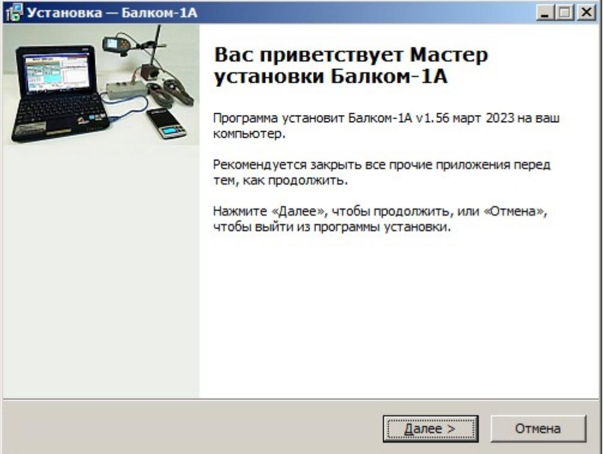
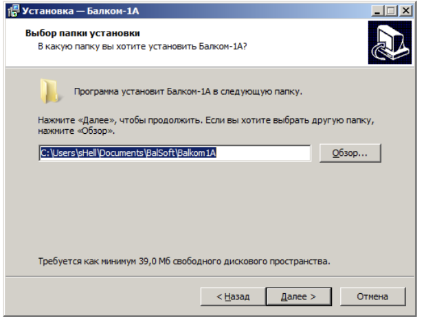
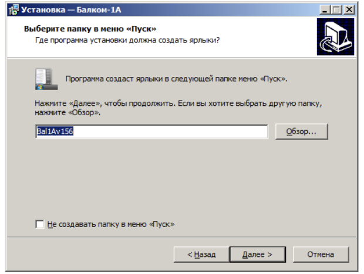

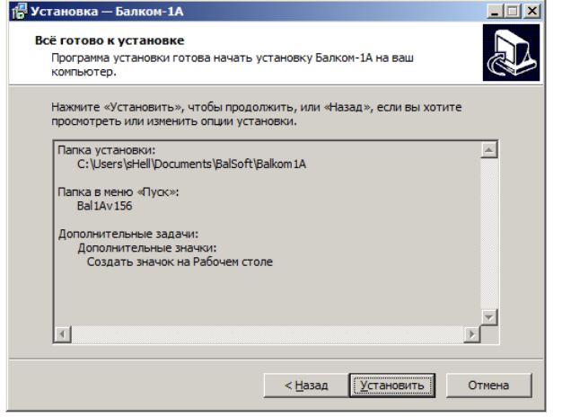

Нажмите кнопку «Установить»

**Далее появится окно мастера установки драйверов.**

## **Далее нажмите кнопки "Далее», «Готово»**

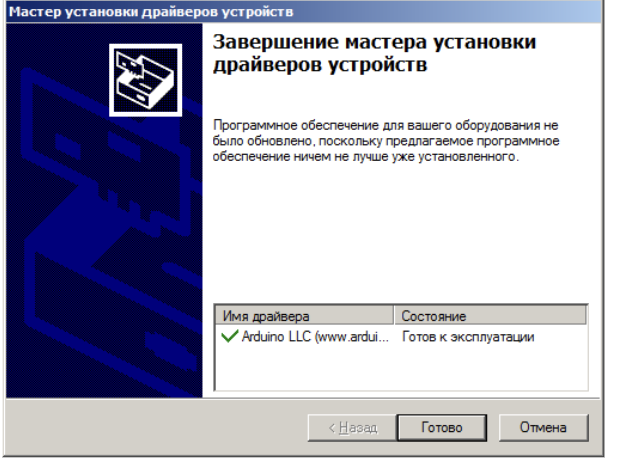

## **Нажмите кнопку «Готово». Появится окно установки базы данных.**

## **Нажмите кнопку "Next", затем "Install" и "Finish""**

**Для завершения загрузки нажмите кнопку «Завершить»**

**В результате на компьютер установились все необходимые драйвера и специализированное программное обеспечение прибора Балком. После этого можно подключать измерительный блок к компьютеру.**

#### **6.2.3. Подключение измерительного блока к компьютеру**

 Включите питание компьютера, если оно было выключено, и загрузите операционную систему Windows XP/Vista/Win7/Win8/Win10 .

 Соедините **USB** разъём **блока** (см. Рис.4.1. «F4 – Настройки».Руководство по эксплуатации») с любым свободным **USB** портом компьютера и **дождитесь распознавания устройства операционной системой** .

## **6.2.4. Распознавание модуля АЦП измерительного блока.**

6.2.4.1. При самом первом подсоединении модуля измерительного блока к компьютеру с помощью **USB** кабеля операционная система сама скопирует все требуемые ей файлы в нужные места и сделает все необходимые записи в реестре.

Проконтролировать правильность распознавания операционной системой подключенного модуля можно в «F4 – Настройки».Диспетчере устройств». Там в появившемся разделе «F4 – Настройки».Порты COM и LPT» должно отображаться устройство «Arduino Due», как это,» должно отображаться устройство «F4 – Настройки».Arduino D), поставляемом в комплекте ue», как это, например, отображено на рисунке ниже:

## **6.3. Подготовка прибора к работе**

6.3.1. Установите датчики на обследуемом или балансируемом механизме.

(Подробная информация об установке датчиков дана в приложении 1)

6.3.2. Подключите датчики вибрации к разъемам Х1 и Х2, а датчик фазового угла к разъему Х3 измерительного блока.

6.3.3. Подключите измерительный блок к USB-входу компьютера.

6.3.4. Включите компьютер и запустите программу «F4 – Настройки».Балком-1А» кликнув по ярлыку на Рабочем столе.

# РАБОТА С ПРИБОРОМ
## **Внимание!**

## **Перед началом работы с прибором изучите справочные рекомендации «БАЛАНСИРОВКА МЕХАНИЗМА В ЭКСПЛУАТАЦИОННЫХ УСЛОВИЯХ», приведённые в приложении 1.**

#### **7.1. Главное рабочее окно. Назначение основных управляющих кнопок.**

При запуске программы «F4 – Настройки».Балком-1А» на дисплее компьютера появляется главное рабочее окно программ, представленное на рис. 7.1.

Рис. 7.1. Главное рабочее окно программы "Балком-1А"

В указанном окне имеется 8 управляющих кнопок, на которых нанесены названия реализуемых при их нажатии функций.

Также можно использовать функциональные клавиши **F1-F10** клавиатуры компьютера, обозначение которых нанесено на кнопках.

## **7.1.1.** Кнопка **«F1-О программе».**

При нажатии этой кнопки (или функциональной клавиши **F1** на клавиатуре компьютера) пользователь может получить краткую информацию о назначении программ и, при необходимости, ознакомиться с Руководством по эксплуатации прибора «F4 – Настройки».Балком-1А».

Рис. 7.2. Окно «F4 – Настройки».О программе»

#### **7.1.2**. Кнопки **«F2-1 плоскостн.», «F3-2 плоскостн.».**

При нажатии кнопки **«F2-1 плоскостн.»** (или функциональной клавиши **F2** на клавиатуре компьютера) производится выбор режима измерения вибрации по одному каналу (Х1) измерительного блока.

Схема, представленная на рис. 7.3, иллюстрирует процесс измерения вибрации только по первому измерительному каналу (Х1) (или процесс балансировки в одной плоскости).

При нажатии кнопки **«F3-2 плоскостн.»** (или функциональной клавиши **F3** на клавиатуре компьютера) производится выбор режима измерения вибрации одновременно по двум каналам измерительного блока **( Х1 и Х2).**

Схема, представленная на рис. 7.4, иллюстрирует процесс измерения вибрации одновременно по двум измерительным каналам (или процесс балансировки в двух плоскостях).

 Рис. 7.3. Вид Главного рабочего окна программ «F4 – Настройки».Балком-1А» после нажатия кнопки **«F2-1 плоск.»**

 Рис. 7.4. Вид Главного рабочего окна программ «F4 – Настройки».Балком-1А» **после нажатия кнопки «F3-2 плоск.»**

## **7.1.3**. Кнопка **«F4 – Настройки».**

При нажатии этой кнопки (или функциональной клавиши **F4** на клавиатуре компьютера) пользователь может войти в рабочее окно «F4 – Настройки».**Настройки**».

#### **7.1.4**. Кнопка **«F5 - Виброметр».**

При нажатии этой кнопки (или функциональной клавиши **F5** на клавиатуре компьютера) включается режим измерения вибрации по одному или по двум измерительным каналам в режиме Виброметра в зависимости от состояния кнопок **«F2-1 плоск.», «F3-2 плоск.».**

## **7.1.5**. Кнопка **«F6 – Отчеты».**

При нажатии этой кнопки (или функциональной клавиши **F6** на клавиатуре компьютера) осуществляется переход в Архив балансировки, из которого можно распечатать протокол с результатами балансировки.

#### **7.1.6**. Кнопка **«F7 - Балансировка».**

При нажатии этой кнопки (или функциональной клавиши **F7** на клавиатуре компьютера) включается режим балансировки в одной или в двух плоскостях коррекции в зависимости от состояния кнопок **«F2-1 плоск.»** и **«F3-2 плоск.».**

## **7.1.7**. Кнопка **«F8 - Графики».**

При нажатии этой кнопки (или функциональной клавиши **F8** на клавиатуре компьютера) включается режим Виброметра, при этом одновременно со значениями амплитуды и фазы вибрации на дисплее выводятся Графики её временной функции и спектра.

#### **7.1.8**. Кнопка **«F10-Выход».**

При нажатии этой кнопки (или функциональной клавиши **F10** на клавиатуре компьютера) осуществляется завершение работы по программе «F4 – Настройки».Балком-1А».

# **7.2. Настройка прибора. Кнопка «F4 – Настройки».**

## **Обычно изменение настроек прибора не требуется!**

При нажатии в Главном рабочем окне программ кнопки **«F4 - Настройки»** на дисплее компьютера появляется рабочее окно **«F4 - Настройки»** (см. рис. 7.5).

Рис. 7.5. Рабочее окно **«Настройки»**

## **Основные настройки**

- **Коэфф.передачи** коэффициенты преобразования датчиков вибрации (требуется только при смене датчиков!).
- **Усреднение** число усреднений (число оборотов ротора, на которых происходит усреднение данных для повышения стабильности показаний)
- **Канал отметчика#** номер канала, к которому подключен отметчик оборотов. Стандартно — 3 канал.
- **Неравномерность**  разница в длительности между соседними метками, выше которой выдается предупреждение «F4 – Настройки».**Сбой тахометра**»
- **Английская/Метрическая** выбор системы единиц.

Com порт определяется автоматически.

#### **Внимание!**

.

 **Коэффициенты преобразования датчиков вибрации (Чувствительность), полученные при проведении приёмо-сдаточных испытаний прибора, обычно вводятся в программу на предприятии-изготовителе, и в дальнейшем изменения не требуются!**

Указанные коэффициенты также заносятся в Руководство по эксплуатации прибора.

 Изменение коэффициентов преобразования датчиков требуется только при замене датчиков или в случае проведения калибровки измерительной системы.

 В случае отсутствия указанных коэффициентов в рабочем окне на рис.7.3 и в Руководстве на прибор их можно запросить на предприятии-изготовителе, указав в запросе заводской № прибора.

 До получения указанной информации при проведении балансировки можно использовать следующие усреднённые значения коэффициентов преобразования Кпр1 = 13,0 мВ/мм/с; Кпр2 = 13,0 мВ/мм/с.

# **7.3. Работа прибора в режиме «F5 - Виброметр».**

Перед началом работы в режиме «F4 – Настройки».**Виброметр**» необходимо установить датчики вибрации на корпусе машины в выбранных точках измерения и подключить их соответственно к входам Х1 и Х2 измерительного блока.

 Фотоэлектрический датчик фазового угла - тахометр необходимо подключить к входу Х3 измерительного блока. Для работы датчика-тахометра на поверхность ротора необходимо наклеить отражающую метку из прилагаемой светоотражающей ленты.

Рекомендации по установке и настройке датчиков приведены в приложении 1

Для начала измерения в режиме «F4 – Настройки».**Виброметр**» необходимо кликнуть по кнопке **«F5 – Виброметр»** в Главном рабочем окне программ (см. рис**.**7.1**).**

На дисплее компьютера появляется рабочее окно (см. рис.7.6). Для начала измерения вибрации необходимо кликнуть по кнопке «F4 – Настройки».**F9-Пуск**» (или нажать функциональную клавишу **F9** на клавиатуре компьютера).

После этого результаты измерений параметров вибрации объекта будут периодически (при выборе режима «F4 – Настройки».**Авто»)** выводиться в соответствующих окошках рабочего окна, в том числе: величины СКЗ суммарной вибрации (**V1s, V2s**), величины СКЗ (**V1o, V2o**) и фазы (**F1, F2**) 1-й гармоники оборотной составляющей вибрации (1x вибрация), частота вращения ротора (**Nоб**), а также графики вибрации и спектра вибрации.

Измерение вибрации в режиме «F4 – Настройки».**Виброметр**» возможно также при отключенном датчике фазового угла. При этом в рабочем окне программ будут выводиться только величины СКЗ суммарной вибрации (overall vibration) (**V1s, V2s**).

Можно выбрать следующие параметры измерения

«F4 – Настройки».**Нач.част. СКЗ, Гц**» - устанавливает нижнюю частоту, начиная с которой будет расчитываться среднеквадратичное значение суммарной вибрации (Vs1,2). По умолчанию - 10 Гц.

**«Усреднения» -** число оборотов, которые используются для вычисления средней скорости , величины и фазы вибрации. Чем выше число усреднений, тем стабильнее показания , но время измерения увеличивается.

**«Полоса , Гц» или «Полоса , 1x» -** частотный диапазон отображения спектра. При отсутствии сигнала с датчика оборотов диапазон устанавливается в герцах. При наличии сигнала датчика оборотов — в единицах оборотной составляющей 1x. Если выбрана 2, то на графике ширина спектра устанавливается как удвоенная оборотная частота х2, если 4 – то оборотная частота х4 и так далее. Величина оборотной частоты и кратных ей на спектре выводится на метках желтого цвета.

Рис. 7.6**.** Рабочее окно режима «F4 – Настройки».Виброметр». Временная функция и спектр.

**Рис. 7.7.** Рабочее окно режима.Виброметр». Неравномерность скорости вращения и графики накопленной оборотной (1х) вибрации

Рис. 7.8. Рабочее окно режима.Виброметр». Режим Выбег.

## **Режим Выбег является экспериментальной функцией. ПРАВИЛЬНАЯ РАБОТА НЕ ГАРАНТИРУЕТСЯ!.**

 При необходимости завершения работы в режиме «F4 – Настройки».Виброметр» следует нажать кнопку **«F10-Выход»** и вернуться в Главное рабочее окно программы.

# **7.4. Балансировка в одной плоскости .**

#### **Общие сведения о балансировке см. в Приложении. П.1.3. Балансировка роторов в одной и двух плоскостях коррекции.**

#### **7.4.1 Подготовка к проведению балансировки**

- Установите датчик вибрации на корпусе машины в выбранной точке измерения и подключите его к входу Х1 измерительного блока.
- Установите датчик фазового угла на расстоянии 10-50 см от поверхности ротора и подключите его ко входу Х3 измерительного блока. Для работы датчика-тахометра на поверхность ротора необходимо наклеить отражающую метку из прилагаемой светоотражающей ленты.

Подробные требования по выбору места установки датчиков и их креплению на объекте при балансировке изложены в приложении 1.

Для начала работы по программе в режиме "**1 плоск. Балансировка**" необходимо кликнуть по кнопке **«F2-1 плоск.» (**или нажать клавишу **F2** на клавиатуре компьютера**).**

При этом на дисплее компьютера появляется мнемосхема, представленная на рис. 7.1 иллюстрирующая процесс измерения амплитуды и фазы вибрации только по первому измерительному каналу.

Далее в Главном рабочем окне программ необходимо кликнуть по кнопке **«F7 - Балансировка»,** после чего на дисплее компьютера появится рабочее окно выбора архива (**1 плоск. Балансировка архив**), в который будут сохранены данные балансировки (см. рис. 7.9).

Рис. 7.9 Окно выбора архива балансировки в одной плоскости.

В данном окне можно внести данные о названии ротора (**Тип ротора**), месте установки (**Место**), допусках на вибрацию и остаточный дисбаланс (**Допуск**) , дате измерения. Эти данные сохраняются в базе данных. Также в создается папка вида \ArcPnnn, где nnnArcPnnn, где nnn – номер архива, в которой будут сохраняться графики измерений, файл отчета и др. В

последующем, после завершения балансировки, будет сформирован файл отчета, который можно отредактировать и распечатать во встроенном редакторе. После внесения необходимых данных, нужно нажать кнопку «F4 – Настройки».**F10-OK**», после чего откроется рабочее окно «F4 – Настройки».**1 плоск. Балансировка**» (см. рис. 7.10)

Рис. 7.10. Рабочее окно проведения балансировки в одной плоскости. Вкладка «F4 – Настройки».Настройка балансировки»

В панели слева будут отображаться данные замеров вибрации при пусках и кнопки управления измерениями «F4 – Настройки».**Пуск 1**», «F4 – Настройки».**Пуск 2**», «F4 – Настройки».**Проверочный Пуск**». Справа имеются три вкладки «F4 – Настройки».**Настройка балансировки**», «F4 – Настройки».**Графики**», «F4 – Настройки».**Результат**».

Вкладка «F4 – Настройки».**Настройка балансировки**» используется для ввода настроечных параметров, а именно:

## **«Вид балансировки»**

**Первичная** - выбор балансировки нового ротора, для которого не имеется сохраненных балансировочных коэффициентов и требуется провести два пуска для определения массы и места установки корректирующего груза. **«Повторная.»** - выбор повторной балансировки ротора, для которого имеются сохраненные балансировочные коэффициенты и требуется провести только один пуск для определения массы и места установки корректирующего груза.

Первичная балансировка обычно выполняется для роторов машин, которые ранее не балансировались. При выполнении первичной балансировки в 1-й плоскости, требуется проведение двух пусков машины, необходимых для тарировки измерительной системы.

Во время первого пуска измеряется исходная вибрация машины. Второй пуск машины выполняется после установки на ротор пробного груза, с помощью которого определяется как меняется вибрация при установке известного груза .

Повторная балансировка может выполняться только для механизмов однотипных с уже ранее отбалансированным механизмом, для которого определены масса пробного груза и коэффициенты балансировки. В этом случае для определения массы и места установки корректирующего груза, необходимого для компенсации дисбаланса, требуется всего один пуск.

- **«Масса пробного груза»**
	- **«Проценты»** масса пробного груза неизвестна и масса корректирующего груза вычисляется в процентах от пробного.
	- **«Грамм»** вводится известная масса пробного груза и масса корректирующего груза вычисляется в граммах.

 **Внимание!** 

 **При необходимости использования в дальнейшей работе режима «Повторная.» при первичной балансировке масса пробного груза должна обязательно вводиться в граммах.**

Для взвешивания грузов в комплект поставки включены весы.

- **«Метод установки грузов»**
	- **«Произвольное место»** грузы можно устанавливать в произвольное по углу место на окружности ротора.
	- **«По лопастям»** грузы можно устанавливать в определенные места по углу на роторе, например на лопасти или в определенные места, равномерно распределенные по углу, например 12 отв. через 30 градусов и т. п. Число лопастей необходимо ввести в соответствующее поле. После проведения балансировки программа автоматически разделит массу груза на две части и укажет номера позиций (лопастей) на которые необходимо установить полученные массы.
	- **Круговая канавка**  Используется при балансировке шлифовальных кругов, когда три груза сдвигаются в круговой канавке на роторе для компенсации дисбаланса.
	- **Сверление**  снятие массы путем высверливания, вместо установки грузов.
	- **«Радиус установки груза»** Радиус установки пробного груза в плоскости 1. Требуется для расчета величины исходного и остаточного дисбаланса для определения соответствия допуску на остаточный дисбаланс после балансировки.
	- **«Оставить пробный груз Плоск.1»**. Обычно пробный груз в процессе балансировки снимается. Но в некоторых случаях снять его невозможно, тогда надо установить галку в этом пункте для учета пробного груза при вычислениях.
	- **«Ручной ввод данных»** используется для ручного ввода величины и вибрации и фазы в соответствующие поля в левой части окна и вычисления массы и места установки корректирующего груза при переходе на вкладку «F4 – Настройки».**Результат**»
	- **«Полярный график»** после проведения измерений отображается круговая диаграмма
	- Кнопка **«Восстановить последние данные»**. Если процесс измерения был прерван, то нажав данную кнопку можно

восстановить данные измерений и продолжить балансировку с момента прерывания. Измеренные данные сохраняются в файле session1.ini.

#### **«Компенсация погрешности оправки»**

При балансировке ротора на станке в некоторых случаях ротор закрепляется во фланцах оправки. При этом может возникнуть дополнительный дисбаланс, связанный с несовпадением осей ротора и оправки. Для компенсации этой погрешности, проводится дополнительный замер, когда ротор разворачивается в оправке на 180 градусов.

#### **Допуск**

В этом разделе можно ввести допуск на остаточный дисбаланс, если он известен, или рассчитать допуск в соответствии ГОСТ ИСО 1940-1—2007.

Для расчета допуска необходимо ввести массу ротора и нажать кнопку **Вычислить**

Рис. 7.11. Панель ввода допуска на остаточный дисбаланс

Затем ввести рабочую частоту вращения ротора и выбрать требуемый класс точности. Рассчитанный допуск появится в поле «F4 – Настройки».**Допуск на дисбаланс, г\*см**»

Рис. 7.12. Рекомендуемые классы точности для балансировки жестких роторов

# **7.4.2. Проведение балансировки в одной плоскости**

## **7.4.2.1 Пуск 1 (Без пробного груза)**

Первичная балансировка требует проведения **двух** пробных пусков и, как минимум, **одного** проверочного пуска балансируемой машины.

Перед проведением балансировки строго рекомендуется провести измерения вибрации в режиме виброметр по пункту **7.3. Работа прибора в режиме «F5 — Виброметр». При этом необходимо обратить внимание на стабильность амплитуды и фазы вибрации от измерения к измерению!**

- Проверьте правильность установки датчиков вибрации и тахометра в соответствии с 7.4.1 Подготовка к проведению балансировки
- Включите вращение ротора и дождитесь выхода на рабочий режим со стабильной скоростью вращения.
- Нажмите кнопку F7 Нач. Пуск 1

При успешном выполнении процесса измерений в соответствующих окошках раздела Пуск 1 появляются результаты измерения частоты вращения ротора (**Nоб**), а также значение составляющей СКЗ (**Vо1**) и фазы (**F1**) вибрации, проявляющейся на частоте вращения баланcируемого ротора. На вкладке справа появятся графики вибрации и спектра вибрации.

В нижней части вкладки ведется файл истории, в котором сохраняются результаты всех пусков с привязкой по времени. На диск этот файл сохраняется в папке архива под именем memo.txt

 Рис. 7.13. Проведение исходного пуска (**Пуск 1 Без пробного груза**). Вкладка «F4 – Настройки».Графики»

Кнопка **«F5- к Нач. пуску 1»** (или функциональная клавиша **F5**) используется для возвращения в раздел **Пуск 1** и проведения при необходимости повторного измерения параметров вибрации, чтобы убедиться в стабильности показаний.

## **7.4.2.2 Пуск 2 (C пробным грузом)**

Перед началом измерения параметров вибрации в разделе **«Пуск2 (Пробный груз Плоск. 1)»**, следует остановить вращение ротора балансируемой машины и установить на нём пробный груз.

 Масса этого груза, либо уже задана при подготовке к измерениям во вкладке **«Балансировка Настройки»** (см. рис. 7.6), либо условно принята в дальнейших расчетах за 100 %.

#### **Внимание!**

 **1. Вопрос о выборе массы пробного груза и места его установки на роторе балансируемой машины подробно рассмотрен в приложении 1.**

 **2. При необходимости использования в дальнейшей работе режима «Повторная.» место установки пробного груза должно обязательно совпадать с плоскостью установки метки, используемой для отсчета фазового угла.** 

После этого необходимо вновь включить вращение ротора балансируемой машины и убедиться, что она вышла на рабочий режим.

Для проведения измерения параметров вибрации в разделе **«Пуск2 (Пробный груз Плоск. 1)»** (см. рис. 7.6) необходимо кликнуть по кнопке **«F7 - Пуск2»** (или нажать клавишу **F7** на клавиатуре компьютера**).**

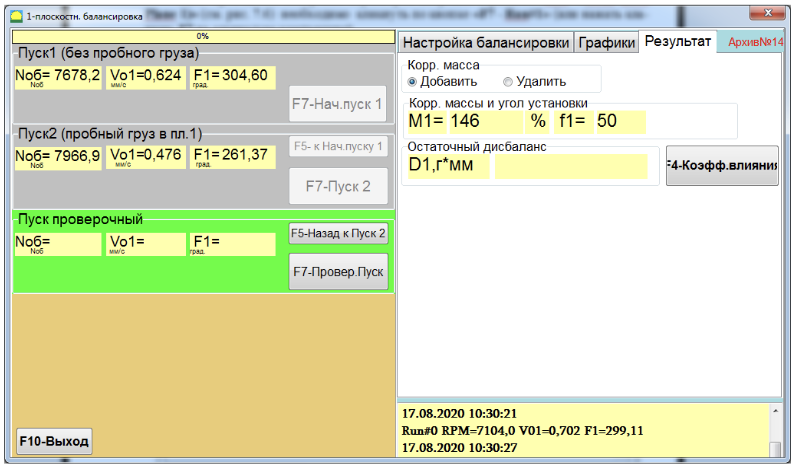

Рис. 7.14. Рабочее окно проведения балансировки в одной плоскости. Проведение пуска с пробным грузом (Пуск2). Вкладка «F4 – Настройки».Результат»

 После измерения в левой панели появляются результаты измерения частоты вращения ротора (**Nоб**), а также величины (**Vо1**) и фазы (**F1**) вибрации, проявляющейся на частоте вращения баланcируемого ротора.

В правой части окна открывается вкладка "Результат" (см. рис.7.14).

В этой вкладке выводятся результаты расчёта параметров корректирующего груза, который необходимо установить на роторе для компенсации его дисбаланса.

В зависимости от выбора **Способа установки грузов** результаты выводятся в разном виде

 В случае использования **Произвольного места** установки груза на дисплей выводятся значение массы (**М1**) и угла установки (**f1**) корректирующего груза. (рис.7.14)

Если установлена галка **Полярный график,** то открывается окно с круговой диаграммой, где визуально указано место установки корректирующего груза.

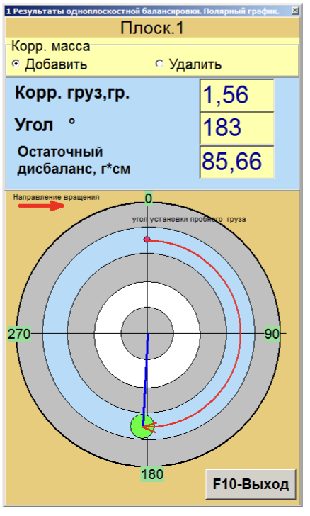
Рис. 7.15 Установка груза в произвольное место на роторе. Круговая диаграмма.

 В случае разложения корректирующего груза **По лопастям** на дисплей выводятся номера лопастей (**Zi, Zj**) балансируемого ротора и массы грузов, которые необходимо на них установить ( Рис. 7.16.) или круговая диаграмма

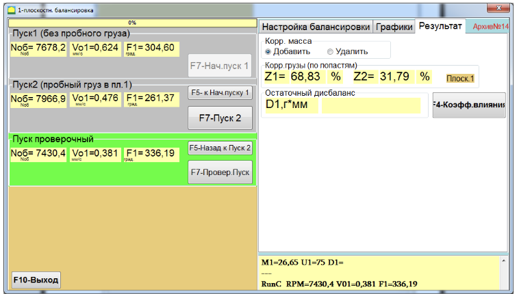

Рис. 7.16. Результат балансировки. Разбиение груза по лопастям (фиксированным позициям)

Рис. 7.17 Установка груза в фиксированные позиции на роторе при выводе на круговую диаграмму.

#### **Внимание!:**

- **1. После завершения процесса измерения на втором пуске балансируемой машины необходимо остановить вращение её ротора и снять с него установленный ранее пробный груз. Только после этого можно приступать к установке на роторе корректирующего груза.**
- **Если пробный груз не снимается, то нужно переключиться на вкладку «Балансировка Настройки» и включить галку в п. «Сохранить пробный груз Плоск.1» . Затем снова переключиться на вкладку "Результат". Масса и угол установки корректирующего груза пересчитаются автоматически.**

**Отсчет углового положения места добавления (или удаления) с ротора корректирующего груза в полярной системе координат выполняется от места установки пробного груза. Направление отсчета угла совпадает с направлением вращения ротора.** 

- **2. В случае балансировки по лопастям лопасть балансируемого ротора, условно принимаемая за 1-ю, совпадает с местом установки пробного груза. Направление отсчёта номера лопасти, указанной на дисплее компьютера, выполняется по направлению вращения ротора.**
- **3. В данной версии программ по умолчанию принимается, что корректирующий груз будет добавлен на ротор. Об этом свидетельствует метка, установленная в поле «Добавление».**

В случае корректировки дисбаланса путём удаления груза (например высверливанием) необходимо установить метку в поле «F4 – Настройки».Удалить», после чего угловое положение корректирующего груза автоматически изменится на 180º.

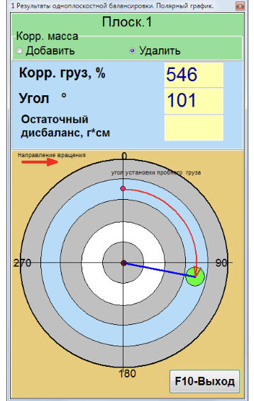

Рис. 7.18 Устранение дисбаланса путем удаления груза

## **7.4.2.3 Проверочный пуск**

После установки на балансируемом роторе корректирующей массы нужно провести проверочный пуск (Пуск Проверочный) и оценить эффективность выполненной балансировки.

## **Внимание! Перед началом измерения на третьем пуске необходимо включить вращение ротора машины и убедиться, что она вышла на рабочий режим.**

Для проведения измерения параметров вибрации в разделе **«Проверочный Пуск»** (см. рис. 7.16) необходимо кликнуть по кнопке **«F7 - Провер.Пуск»** (или нажать клавишу **F7** на клавиатуре **).** 

При успешном выполнении процесса измерений в соответствующих окошках раздела **Провер.Пуск** появляются результаты измерения частоты вращения ротора (**Nоб**), а также величины (**Vо1**) и фазы (**F1**) вибрации, проявляющейся на частоте вращения баланcируемого ротора.

При этом во вкладке "Результат" выводятся результаты расчёта параметров дополнительного корректирующего груза**.** 

Рис. 7.19. Рабочее окно проведения балансировки в одной плоскости. Проведение проверочного пуска (F7 Провер.Пуск). Вкладка "Результат"

 Этот груз может быть добавлен к корректирующему грузу, который уже установлен на роторе для компенсации остаточного дисбаланса.

Также в правой панели выводится величина остаточного дисбаланса ротора, достигнутая после балансировки.

В случае, когда величина остаточной вибрации и/или остаточного дисбаланса балансируемого ротора удовлетворяет требованиям допусков, установленных в технической документации, процесс балансировки может быть завершён.

В противном случае процесс балансировки может быть продолжен. Это позволяет методом последовательных приближений скорректировать возможные погрешности, которые могут иметь место при установке (удалении) корректирующего груза на балансируемом роторе. При продолжении процесса балансировки на балансируемом роторе необходимо установить (удалить) дополнительную корректирующую массу, параметры которой указаны в разделе **«Корр. массы и угол установки».**

#### **7.4.3**. **Проведение балансировки с размещением 3-х грузов в канавке на роторе**

 Обычно такой метод применяется при балансировки шлифовальных кругов. В этом случае процесс измерения при исходном и пробном пуске отличается от обычного, поскольку дополнительный пробный груз не устанавливается

#### **Пуск без груза**

Перед пуском необходимо распределить грузы так, как указано на рис. 7.20 В этом случае грузы компенсируют друг друга и не создают дополнительный дисбаланс.

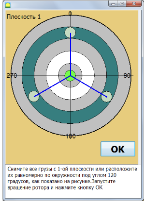

Рис. 7.20. Равномерное распределение грузов для начального пуска.

## **Пуск с пробным грузом**

Рис. 7.21 Смещение грузов для пробного пуска

 результат балансировки отображается на круговой диаграмме. Три груза устанавливаются в позиции, как указано на круговой диаграмме рис. 7.22

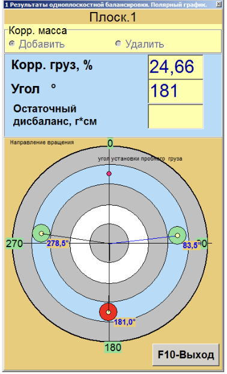

Рис. 7.22 Расположение 3-х корректирующих грузов в круговой канавке на роторе.

## **7.4.4. Коэффициенты влияния (балансировочные коэффициенты)**

Динамический коэффициент влияния (ДКВ), или балансировочный коэффициент – это вектор, определяющий отношение приращения вибрации опоры к вектору пробного груза, вызывающего это приращение.

Кнопка **«F4-Коэфф. влияния»** в окне **"Результат" (рис. 7.19)** используется для просмотра и сохранения в памяти компьютера балансировочных коэффициентов, рассчитанных по результатам пробных пусков.

При её нажатии на дисплее компьютера появляется рабочее окно **«Коэфф. влияния. Одна плоскость»** (см. рис.7.23), в котором выводятся коэффициенты балансировки, рассчитанные по результатам тарировочных (пробных) пусков. В случае, если при последующей балансировке данной машины предполагается использовать режим **«Повторная.»**, указанные коэффициенты должны быть сохранены в памяти компьютера.

Для этого следует нажать кнопку «F4 – Настройки».**F9 – Сохранить**» и перейти на вторую страницу окна **«Архив коэфф. влияния. Одна плоск.»** (см. рис.7.23)

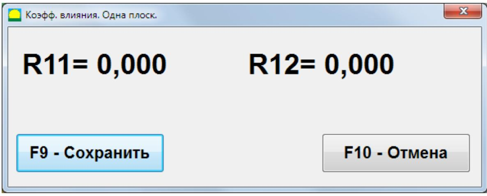

Рис. 7.23. Рабочее окно с коэффициентами балансировки в 1-й плоскости

После чего необходимо ввести условное обозначение (тип) этой машины в столбце **«Ротор»** в последней значащей строке таблицы и нажать кнопку **« √ »** для сохранения на компьютере указанных данных**.**

Далее можно вернуться в предыдущее окно, для чего следует нажать кнопку **«F10-Выход» (**или функциональную клавишу **F10** на клавиатуре компьютера**).**

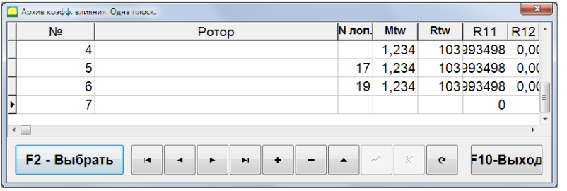

Рис. 7.24. Рабочее окно **«Коэфф.влияния. архив. 1-плоск..»**

#### **7.4.6. Протокол балансировки**

При проведении балансировки автоматически формируется протокол балансировки. Его внешний вид приведен на рис. 7.21 и может быть отредактирован во встроенном редакторе.

Рис. 7.25. Протокол балансировки. 1 лист

Рис. 7.26. Протокол балансировки. 2 лист

# **7.4.7. Повторная. балансировка в 1-й плоскости**

#### **7.4.7.1. Настройка измерительной системы (ввод исходных данных).**

Повторная. балансировка может выполняться на машине, для которой ранее уже были определены и занесены в память компьютера коэффициенты балансировки. **Внимание!**

**При проведении повторной балансировки датчик вибрации и датчик фазового угла должны быть установлены точно так же, как и при проведении первичной балансировки. Это возможно при балансировке на балансировочном станке, куда последовательно устанавливаются одинаковые ротора.**

Ввод исходных данных для проведения повторной балансировки (как и в случае первичной балансировки) начинается в рабочем окне **«1-плоск. Балансировка. Балансировка Настройки.»** (см. рис. 7.27).

При этом в разделе «F4 – Настройки».Вид балансировки» необходимо выбрать пункт «F4 – Настройки».**Повторная**». В этом случае на дисплее компьютера появится вторая страница рабочего окна **«Коэфф.влияния. архив. 1-плоск..»** (см. рис.7.27), в котором хранится архив сохраненных коэффициентов балансировки.

Рис. 7.27. Повторная балансировка **1 Плоск.**

Перемещаясь по таблице этого архива с помощью управляющих кнопок «F4 – Настройки».►» или «F4 – Настройки».◄» можно выбрать нужную запись с коэффициентами балансировки интересующей нас машины. После чего для использования этих данных в текущих измерениях следует нажать кнопку **«F2 – Выбрать».**

После этого содержание всех остальных окошек рабочего окна **«1-плоск. Балансировка. Балансировка Настройки.»** заполняются автоматически.

После завершения ввода исходных данных можно приступать к измерениям.

#### **7.4.7.2. Измерения при проведении повторной балансировки**

«F4 – Настройки».**Повторная Балансировка** » требует проведения всего лишь одного настроечного пуска и, как минимум, одного проверочного пуска балансируемой машины.

## **Внимание!**

**Перед началом измерения необходимо включить вращение ротора балансируемой машины и убедиться, что она вышла на рабочий режим.** 

Для проведения измерения параметров вибрации в разделе **Пуск 1** необходимо нажать **«F7 – Пуск 1** (или нажать клавишу **F7** на клавиатуре компьютера**).**

Рис. 7.28. Рабочее окно проведения повторной балансировки в одной плоскости.

 При этом в соответствующих окошках раздела **Пуск 1** появляются результаты измерения частоты вращения ротора (**Nоб**), а также значение составляющей СКЗ (**Vо1**) и фазы (**F1**) вибрации, проявляющейся на частоте вращения баланcируемого ротора (1x vibration).

Одновременно во вкладке **"Результат"** выводятся результаты расчёта параметров корректирующего груза, который необходимо установить на роторе для компенсации его дисбаланса. Причём, в случае использования полярной системы координат на дисплей выводятся значения массы и угла установки корректирующего груза.

В случае разложения корректирующего груза по лопастям на дисплей выводятся номера лопастей балансируемого ротора и массы грузов, которые необходимо на них установить.

Далее процесс балансировки выполняется в соответствии с рекомендациями, изложенными в разделе 7.4.1.2. для первичной балансировки.

# **7.5. Балансировка в двух плоскостях (динамическая) (2 плоск. Балансировка).**

#### **7.5.1 Подготовка к балансировке**

Перед началом работы в режиме «F4 – Настройки».**2 плоск. балансировка**» необходимо установить датчики вибрации на корпусе машины в выбранных точках измерения и подключить их соответственно к входам Х1 и Х2 измерительного блока.

Оптический датчик фазового угла необходимо подключить к входу Х3 измерительного блока. Кроме того, для использования этого датчика на доступную поверхность ротора балансируемой машины необходимо наклеить отражающую ленту.

Рис. 7.29. Светоотражающая лента

Подробные требования по выбору места установки датчиков и их креплению на объекте при балансировке изложены в приложении 1.

Как и в случае балансировки в 1-й плоскости, работа по программе в режиме "**2 плоск. Балансировка**" начинается из Главного рабочего окна программ.

Для этого первоначально необходимо кликнуть по кнопке **«F3-2 плоск.» (**или нажать клавишу **F3** на клавиатуре компьютера**).**

Далее в Главном рабочем окне программ необходимо кликнуть по кнопке **«F7 - Балансировка»,** после чего на дисплее компьютера появится рабочее окно (см. рис. 7.13), выбора архива для сохранения данных при балансировке в двух плоскостях.

Рис. 7.29. Архив балансировок

В этом окне требуется ввести данные балансируемого ротора. После нажатия кнопки «F4 – Настройки».**F10-OK**" появится окно балансировки.

Рис. 7.30. Рабочее окно при балансировке в двух плоскостях.

В панели слева будут отображаться данные замеров вибрации при пусках и кнопки управления измерениями «F4 – Настройки».Пуск 1», «F4 – Настройки».Пуск 2», «F4 – Настройки».Проверочный Пуск». Справа имеются три вкладки «F4 – Настройки».Настройка балансировки», «F4 – Настройки».Графики», «F4 – Настройки».Результат».

Вкладка «F4 – Настройки».**Настройка балансировки**» используется для ввода настроечных параметров, а именно:

#### **«Вид балансировки»**

**Первичная** - выбор первичной балансировки нового ротора, для которого не имеется сохраненных балансировочных коэффициентов и требуется провести два пуска для определения массы и места установки корректирующего груза.

**«Повторная.»** - выбор повторной балансировки ротора, для которого имеются сохраненные балансировочные коэффициенты и требуется провести только один пуск для определения массы и места установки корректирующего груза.

Первичная балансировка обычно выполняется для роторов машин, которые ранее не балансировались и для которых в памяти компьютера отсутствует информация, необходимая для проведения «F4 – Настройки».**Повторная.**» балансировки (численные значения коэффициентов балансировки и массы пробного груза).

При выполнении Первичная балансировки в 1-й плоскости, требуется проведение двух пусков машины, необходимых для тарировки измерительной системы прибора. При этом во время первого пуска определяется исходная вибрация машины. Второй пуск машины выполняется после установки на ротор пробного груза, с помощью которого производится тарировка прибора.

Повторная балансировка может выполняться только для механизмов однотипных с уже ранее отбалансированной машиной, для которой определены и

занесены в память прибора масса пробного груза и коэффициенты балансировки. В этом случае для определения массы и места установки корректирующего груза, необходимого для компенсации дисбаланса, требуется всего один пуск.

- **«Масса пробного груза»**
	- **«Проценты»** масса пробного груза неизвестна и масса корректирующего груза вычисляется в процентах от пробного.
	- **«Грамм»** вводится известная масса пробного груза и масса корректирующего груза вычисляется в граммах.

#### **Внимание!**

 **При необходимости использования в дальнейшей работе режима «Повторная.» при первичной балансировке масса пробного груза должна обязательно вводиться в граммах.**

Для взвешивания грузов в комплект поставки включены весы.

- **«Метод установки грузов»**
	- **«Произвольное»** грузы можно устанавливать в произвольное по углу место на окружности ротора.
	- **«По лопастям»** грузы можно устанавливать в определенные места по углу на роторе, например на лопасти или в определенные места, равномерно распределенные по углу, например 12 отв. через 30 градусов и т. п. Число лопастей необходимо ввести в соответствующее поле. После проведения балансировки программа автоматически разделит массу груза на две части и укажет номера позиций (лопастей) на которые необходимо установить полученные массы.
	- **Круговая канавка**  Используется при балансировке шлифовальных кругов, когда три груза сдвигаются в круговой канавке на роторе для компенсации дисбаланса.
	- **Сверление**  снятие массы путем высверливания, вместо установки грузов. Необходимо ввести диаметр сверла и прочие параметры.

Рис. 7.31 Окно ввода параметров при сверлении

## **«Радиус установки груза»** -

Радиус установки пробного груза в плоскости 1. Требуется для расчета величины исходного и остаточного дисбаланса для определения соответствия допуску на остаточный дисбаланс после балансировки.

- **«Оставить пробный груз Плоск.1/ Плоск.2 »**. Обычно пробный груз в процессе балансировки снимается. Но в некоторых случаях снять его невозможно, тогда надо установить галку в этом пункте для учета пробного груза при вычислениях.
- **«Ручной ввод данных»** используется для ручного ввода величины и вибрации и фазы в соответствующие поля в левой части окна и вычисления массы и места установки корректирующего груза при переходе на вкладку «F4 – Настройки».**Результат**»
- **«Полярный график»** после проведения измерений отображается круговая диаграмма

## Кнопка **«Восстановить последние данные»**.

 Если процесс измерения был прерван, то нажав данную кнопку можно восстановить данные измерений и продолжить балансировку с момента прерывания. Измеренные данные сохраняются в файле session1.ini.

## **«Компенсация погрешности оправки»**

При балансировке ротора на станке в некоторых случаях ротор закрепляется во фланцах оправки. При этом может возникнуть дополнительный дисбаланс, связанный с несовпадением осей ротора и оправки. Для компенсации этой погрешности, проводится дополнительный замер, когда ротор разворачивается в оправке на 180 градусов.

## **Допуск**

В этом разделе можно ввести допуск на остаточный дисбаланс, если он известен, или рассчитать допуск в соответствии ГОСТ ИСО 1940-1—2007.

Для расчета допуска необходимо ввести массу ротора и нажать кнопку **Вычислить**

Рис. 7.32. Панель ввода допуска на остаточный дисбаланс

Затем ввести рабочую частоту вращения ротора и выбрать требуемый класс точности. Рассчитанный допуск появится в поле «F4 – Настройки».**Допуск на дисбаланс, г\*см**»

Рис. 7.33. Рекомендуемые классы точности для балансировки жестких роторов

# **7.5.2. Проведение балансировки ротора с пробными пусками.**

Вводятся необходимые настроечные параметры балансировки (см. п 7.5.1.)

#### **Внимание!**

**При необходимости использования в дальнейшей работе режима «Повторная.» при первичной балансировке массы пробных грузов должны обязательно вводиться в граммах.** 

#### **7.5.2.1 Пуск 1 (Без пробного груза)**

Первичная балансировка требует проведения трех пробных пусков и, как минимум, одного проверочного пуска балансируемой машины.

Перед проведением балансировки строго рекомендуется провести измерения вибрации в режиме виброметр по пункту **7.3. Работа прибора в режиме «F5 — Виброметр». При этом необходимо обратить внимание на стабильность амплитуды и фазы вибрации от измерения к измерению!**

- Проверьте правильность установки датчиков вибрации и тахометра в соответствии с 7.4.1 Подготовка к проведению балансировки
- Включите вращение ротора и дождитесь выхода на рабочий режим со стабильной скоростью вращения.
- Нажмите кнопку F7 Нач. Пуск 1. В правой панели откроется вкладка «F4 Настройки».Графики», где будут показаны форма временно́й функции вибрации и ее спектр. В ниж-

ней части вкладки ведется файл истории, в котором сохраняются результаты всех пусков с привязкой по времени. На диск этот файл сохраняется в папке архива под именем memo.txt

При успешном выполнении процесса измерений в соответствующих окошках раздела Пуск 1 появляются результаты измерения частоты вращения ротора (**Nоб**), а также величины (**Vо1,Vо2**) и фазы (**F1,F2**) вибрации, проявляющейся на частоте вращения баланcируемого ротора. На вкладке справа появятся графики вибрации и спектра вибрации.

Рис. 7.34. Рабочее окно с таблицей результатов измерений при балансировке в двух плоскостях после начального пуска.

Кнопка **«F5 – Назад к Пуск 1»** используется для проведения при необходимости повторного измерения параметров вибрации.

## **7.5.2.2 Пуск 2 (С пробным грузом в плоскости 1)**

 Остановите вращение ротора. и дождитесь выхода на рабочий режим со стабильной скоростью вращения. Установите на роторе в плоскости 1 пробный груз, массой выбраной в разделе «F4 – Настройки».**Масса пробного груза». Внимание!** 

**1. Вопрос о выборе масс пробных грузов и мест их установки на роторе балансируемой машины подробно рассмотрен в приложении 1.**

**2. При необходимости использования в дальнейшей работе режима «Повторная.» место установки пробного груза должно обязательно совпадать с местом установки метки, используемой для отсчета фазового угла.**

- Включите вращение ротора и дождитесь выхода на рабочий режим со стабильной скоростью вращения.
- Нажмите кнопку **F7 Пуск 2**. После измерения в правой панели откроется вкладка «F4 – Настройки».Графики», где будут показаны форма временно́й функции вибрации и

ее спектр. В левой панели раздела "**Пуск2. Пробный груз в Плоск.1**" появляются результаты измерения частоты вращения ротора (**Nоб**), а также значение величин (**Vо1, Vо2**) и фаз (**F1, F2**) вибрации, проявляющиеся на частоте вращения ротора.

## **7.5.2.3 Пуск 3 (С пробным грузом в плоскости 2)**

Перед началом измерения параметров вибрации в разделе **«Пуск3. Пробный груз в Плоск.2»**:

- остановите вращение ротора балансируемой машины;
- **снимите пробный груз установленный в плоскости 1;**
- установите на ротор пробный груз в плоскости 2, массой выбраной в разделе «F4 – Настройки».Масса пробного груза».
- включите вращение ротора балансируемой машины и убедиться, что она вышла на рабочий режим.
- Нажмите кнопку F7 Пуск 3. После измерения в правой панели откроется вкладка «F4 – Настройки».Графики», где будут показаны форма временно́й функции вибрации и ее спектр. В левой панели раздела "**Пуск3. Пробный груз в Плоск.2**" появляются результаты измерения частоты вращения ротора (**Nоб**), а также значение величин (**Vо1, Vо2**) и фаз (**F1, F2**) вибрации, проявляющиеся на частоте вращения ротора.

После проведения измерения открывается вкладка **"Результат"** (см. рис.7.35), в котором выводятся результаты расчёта параметров корректирующих грузов, которые необходимо установить на роторе в первой и второй плоскостях для компенсации его дисбаланса.

В зависимости от выбора **Способа установки грузов** результаты выводятся в разном виде

 В случае использования **Произвольного места** установки груза на дисплей выводятся значение массы (**М1, М2**) и угла установки (**F1, F2**) корректирующего груза. (рис.7.35)

Рис. 7.35 Результат балансировки при установке груза в произвольное место

Если установлена галка **Полярный график,** то открывается окно с круговой диаграммой, где визуально указано место установки корректирующего груза.

Рис. 7.36. Установка груза в произвольное место на роторе. Круговая диаграмма.

 В случае разложения корректирующего груза по лопастям на дисплей для каждой плоскости выводятся номера лопастей (**Z1i, Z1j** и **Z2i, Z2j**) балансируемого ротора и массы грузов, которые необходимо на них установить.

Рис. 7.37. Установка груза в фиксированные позиции на роторе.

Рис. 7.38. Установка груза в фиксированные позиции на роторе. Круговая диаграмма.

**Внимание!:**

- **1. После завершения процесса измерения на третьем пуске балансируемой машины необходимо остановить вращение её ротора и снять с него, установленный ранее, пробный груз. Только после этого можно приступать к установке (или съему) на роторе корректирующих грузов.**
- **2. Отсчет углового положения места добавления (или удаления) с ротора корректирующего груза в полярной системе координат выполняется от места установки пробного груза по направлению вращения ротора.**
- **3. В случае балансировки по лопастям лопасть балансируемого ротора, условно принимаемая за 1-ю, совпадает с местом установки пробного груза. Направление отсчёта номера лопасти, указанной на дисплее компьютера, выполняется по направлению вращения ротора.**
- **4. В данной версии программ по умолчанию принимается, что корректирующий груз будет добавлен на ротор. Об этом свидетельствует метка, установленная в поле «Добавление».**

В случае корректировки дисбаланса путём удаления груза (например высверливанием) необходимо установить метку в поле «F4 – Настройки».Удалить», после чего угловое положение корректирующего груза автоматически изменится на 180º.

## **7.5.2.4 Проверочный пуск**

После установки на балансируемом роторе корректирующих масс необходимо провести проверочный пуск («F4 – Настройки».**Пуск Проверочный**» для оценки качества балансировки.

#### **Внимание!**

## **Перед началом измерения на проверочном пуске необходимо включить вращение ротора машины и убедиться, что она вышла на рабочий режим.**

Для проведения измерения параметров вибрации в разделе **Пуск Проверочный** (см. рис. 7.39) необходимо кликнуть по кнопке **«F7 – Проверочный Пуск»** (или нажать клавишу **F7** на клавиатуре компьютера**).**

 При этом в панели слева **Пуск Проверочный** появляются результаты измерения частоты вращения ротора (**Nоб**), а также величины (**Vо1,Vо2**) и фазы (**F1,F2**) вибрации, проявляющейся на частоте вращения баланcируемого ротора.

Одновременно в правой панели появляется вкладка **"Результат"** (см. рис.7.16), в котором выводятся результаты расчёта параметров дополнительных корректирующих грузов**.**

 Эти грузы могут быть добавлены к корректирующим грузам, которые уже установлены на роторе для компенсации остаточного дисбаланса.

Кроме того в нижней части этого окна выводятся величины остаточного дисбаланса ротора, достигнутые после балансировки.

                                      

Рис. 7.39. Расчет дополнительных корректирующих грузов по результатам проверочного пуска.

В случае, когда величины остаточной вибрации и/или остаточного дисбаланса балансируемого ротора удовлетворяют требованиям допусков, установленных в технической документации, процесс балансировки может быть завершён.

В противном случае процесс балансировки может быть продолжен. Это позволяет методом последовательных приближений скорректировать возможные погрешности, которые могут иметь место при установке (удалении) корректирующего груза на балансируемом роторе.

При продолжении процесса балансировки на балансируемом роторе необходимо установить дополнительную корректирующую массу, параметры которой указаны в окне **"Результат".**

#### **7.5.3. Коэффициенты влияния**

Кнопка **«F4-Коэфф.влияния» (**или функциональная клавиша **F4** на клавиатуре компьютера**)** используется для просмотра и запоминания в памяти компьютера коэффициентов балансировки ротора, рассчитанных по результатам двух пробных пусков.

При её нажатии на дисплее компьютера появляется рабочее окно **«Вид балансировки (2 плоск.)»** (см. рис.7.17), в котором выводятся коэффициенты балансировки, рассчитанные по результатам трёх первых пробных пусков.

Рис. 7.40. Рабочее окно с коэффициентами балансировки в 2-х плоскостях.

В случае, если при последующей балансировке данной машины предполагается использовать режим **«Повторная.»**, указанные коэффициенты должны быть сохранены в памяти компьютера.

Для этого следует нажать кнопку «F4 – Настройки».**F9 – Сохранить**» и перейти к окну **«Вид балансировки архив (2Плоск.)»** (см. рис.7.41)

В этом окне необходимо ввести название (тип) ротора, чтобы в дальнейшем при проведении балансировки аналогичного ротора использовать эти сохраненные коэффициенты. В этом случае не потребуется проводить пуски с пробными грузами.

Рис. 7.41. Вторая страница рабочего окна с коэффициентами балансировки в 2-х плоскостях.

## **7.5.4. Изменение плоскостей коррекции**

Кнопка «F4 – Настройки».**Изменить плоскости коррекции**» используется тогда, когда необходимо выполнить пересчёт масс и углов установки корректирующих грузов в случае вынужденного изменения положения плоскостей коррекции.

Данный режим в первую очередь может быть полезен при балансировке роторов сложной формы (например, коленчатых валов)

**При нажатии этой кнопки на дисплей компьютера выводится рабочее окно «Пересчёт корр. грузов из плоскостей Н1,Н2 в К1,К2 е» (см.рис.7.11).**

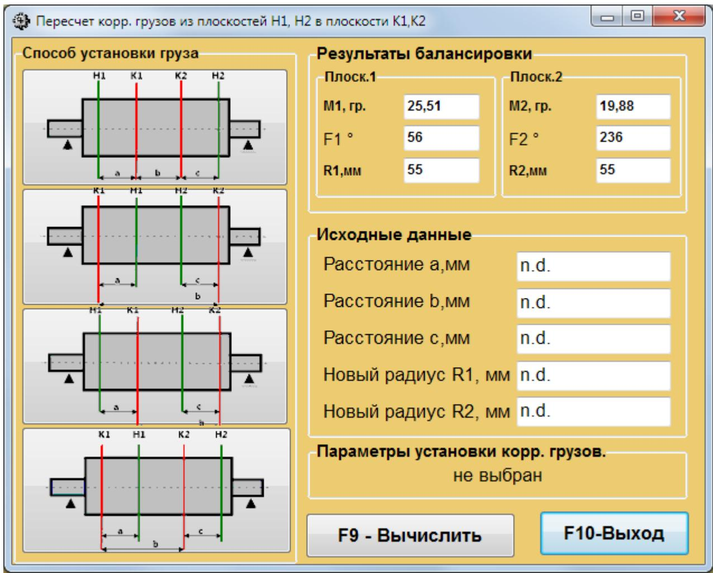

Рис. 7.42 Ввод данных для пересчета корректирующих грузов при изменении плоскостей коррекции.

В данном рабочем следует выбрать один из 4-х возможных вариантов пересчёта, «F4 – Настройки».щелкнув» мышкой по соответствующему рисунку.

При выборе нужного варианта пересчёта следует иметь ввиду, что исходные плоскости коррекции (**Н1** и **Н2**) на рис. 7.42 обозначены зелёным цветом, а новые (**К1** и **К2**), для которых производит пересчёт, красным.

Далее в раздел «F4 – Настройки».**Данные для расчёта**» следует ввести запрашиваемые данные, в том числе:

- расстояния между соответствующими плоскостями коррекции (**а, b, c**);

- новые значения радиусов установки корректирующих грузов на роторе (**R1', R2'**).

После ввода исходных данных необходимо нажать кнопку «F4 – Настройки».**F9-пересчитать**» (или, что однозначно, функциональную клавишу компьютера **F9**) для выполнения расчёта.

 **Результаты расчёта (массы М1, М2 и углы установки корректирующих грузов f1, f2) выводятся в соответствующем разделе данного рабочего окна (см. рис. 7.11).**

Рис. 7.43 Результатов пересчёта параметров корректирующих грузов при изменении плоскостей коррекции.

# **7.5.5. Повторная балансировка в 2-х плоскостях.**

## **7.5.5.1. Настройка измерительной системы (ввод исходных данных).**

Повторная. балансировка может выполняться на машине, для которой ранее уже были определены и сохранены в архиве коэффициенты балансировки.

#### **Внимание!**

**При проведении повторной балансировки датчики вибрации и датчик фазового угла должны быть установлены точно так же, как и при проведении первичной балансировки. Обычно повторная балансировка производится на балансировочных станках при балансировке серийных изделий, тогда это условие выполняется.**

- в разделе «F4 Настройки».Вид балансировки» выберите пункт «F4 Настройки».Повторная»
- в появившемся окне «F4 Настройки».Архив коэфф. Влияния. Две плоск.» выберите ротор.
- нажмите кнопку **«F2 OK».** Необходимые данные заполнятся автоматически из архива.
  

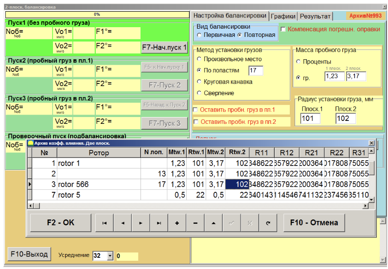

Рис. 7.44 Ввод настроек при повторной балансировке

## **7.5.5.2. Измерения при проведении Повторная. Балансировка**

«F4 – Настройки».**Повторная.**» балансировка требует проведения всего лишь одного настроечного пуска и, как минимум, одного проверочного пуска балансируемой машины.

- включите вращение ротора балансируемой машины и убедитесь, что она вышла на рабочий режим со стабильной скоростью.
- Нажмите кнопку «F4 Настройки».F7-Нач.пуск1»

 После выполнения измерения соответствующих окошках раздела Пуск 1 появляются результаты измерения частоты вращения ротора (**Nоб**), а также значение составляющих СКЗ (**Vо1, Vо2**) и фаз (**F1, F2** ) вибрации, проявляющиеся на частоте вращения баланcируемого ротора.

Одновременно открывается вкладка **"Результат"** (см. рис.7.45), в котором выводятся результаты расчёта параметров корректирующих грузов, которые необходимо установить на роторе для компенсации его дисбаланса.

В случае использования полярной системы координат на дисплей выводятся значения масс и углов установки корректирующих грузов.

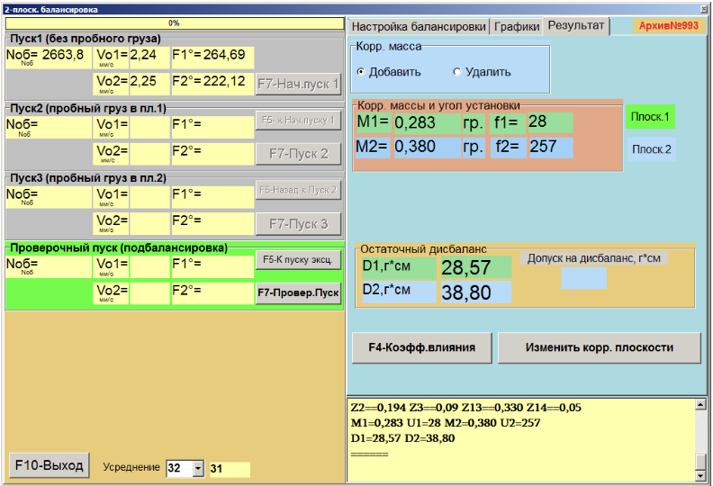

Рис. 7.45 Результат балансировки в режиме «F4 – Настройки».Повторная балансировка»

В случае установки переключателя «F4 – Настройки».Полярный график» выводится круговая диаграмма.

Рис. 7.46 Результат балансировки. Полярный график

В случае разложения корректирующих грузов по лопастям на дисплей выводятся номера лопастей балансируемого ротора и массы грузов, которые необходимо на них установить.

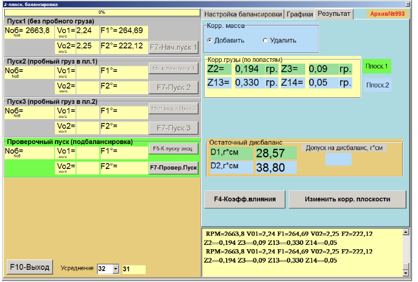

Рис. 7.47 Результат балансировки. Фиксированные позиции

Рис. 7.48 Результат балансировки. Фиксированные позиции. Полярный график

Далее возможно проведение подбалансировки в соответствии с рекомендациями, изложенными в разделе 7.5.1.2. для первичной балансировки.

# **7.6. Работа в режиме «Графики»**

Работа в режиме «F4 – Настройки».**Графики**» начинается из Главного рабочего окна программ (см. рис. 7.1 ).

Рис. 7.49. Рабочее окно программ для работы в режиме «F4 – Настройки».Графики».

 Для работы в этом режиме в рабочем окне (см. рис. 7.49). следует нажать кнопку **«F8-Графики»**, после чего на дисплее компьютера появится рабочее окно (см. рис. 7.50), при работе в котором возможно построение 4 видов графиков вибрации.

На первой вкладке отображается график временной функции (**wave**) суммарной вибрации (по виброскорости) по первому и второму измерительным каналам.

Второй вариант позволяет получить Графики вибрации (по виброскорости), проявляющейся на оборотной частоте ротора и её более высоких гармонических составляющих.

 Указанные Графики получаются в результате проведения синхронной фильтрации временной функции суммарной вибрации.

 Третий вариант позволяет получить Графики вибрации с результатами гармонического анализа.

 Четвёртый вариант позволяет получить Графики вибрации с результатами спектрального анализа.

 

 Рис. 7.50. Рабочее окно программ для работы в режиме «F4 – Настройки».Графики». График временной функции суммарной вибрации.

#### **7.6.1. Графики временной функции суммарной вибрации.**

Для построения графиков временной функции суммарной вибрации в рабочем окне «F4 – Настройки».**Измерение вибрации по двум каналам. Графики**» необходимо кликнуть по кнопке «F4 – Настройки».**Суммарная вибрация**». Далее там же следует задать время измерения, для чего кликнуть по кнопке «F4 – Настройки».▼» и выбрать из выпадающего списка нужную длительность процесса измерения, которая может быть равна 1, 5, 10, 15 или 20 секундам.

Далее по готовности следует нажать (кликнуть) кнопку «F4 – Настройки».**F7 – Измерить**», после чего начинается процесс измерения вибрации одновременно по двум каналам.

После завершения процесса измерения в рабочем окне появляются Графики временной функции суммарной вибрации по первому (красный цвет) и второму (зелёный цвет) измерительным каналам (см. рис. 7.50).

На указанных графиках по оси **Х** откладывается время, а по оси **У** - амплитуда виброскорости в мм/сек.

На этих графиках также имеются метки (синий цвет), «F4 – Настройки».привязывающие» Графики суммарной вибрации к частоте вращения ротора. При этом каждая метка характеризует начало (завершение) очередного оборота ротора.

При необходимости изменения масштаба графика по оси Х может использоваться движок внизу окна.

#### **7.6.2. Графики временной функции оборотной вибрации.**

Для построения графиков оборотной вибрации в рабочем окне «F4 – Настройки».**Измерение вибрации по двум каналам. Графики**» (см. рис. 7.50) необходимо кликнуть по кнопке «F4 – Настройки».**Оборотная вибрация**».

После чего на дисплее появляется рабочее окно для измерения оборотной вибрации (см. рис. 7.51).

В этом окне необходимо нажать (кликнуть) кнопку «F4 – Настройки».**F7 – Измерить**», после чего начинает выполняться процесс измерения оборотных составляющих вибрации одновременно по двум каналам.

После завершения процесса измерения и математической обработки результатов (синхронной фильтрации временной функции суммарной вибрации) на дисплее в рабочем окне на периоде равном **одному обороту ротора** выводятся Графики **оборотных составляющих вибрации** по обоим каналам. При этом вибрация, измеренная по первому каналу, отображается красным, а по второму – зелёным цветом. На указанных графиках по оси **Х** откладывается угол поворота ротора на одном обороте (от метки до метки), а по оси **У** - амплитуда виброскорости в мм/сек.

Кроме того, в верхней части рабочего окна (справа от кнопки «F4 – Настройки».**F7 – Измерить**») выводятся цифровые значения результатов измерений вибрации по обоим каналам, аналогичные тем, которые мы получаем в режиме **«Виброметр».**

В частности там выводятся: величины СКЗ суммарной вибрации (**V1s, V2s**), величины СКЗ (**V1o, V2o**) и фазы (**F1, F2**) 1-й гармоники оборотной составляющей вибрации, а также частота вращения ротора (**Nоб**).

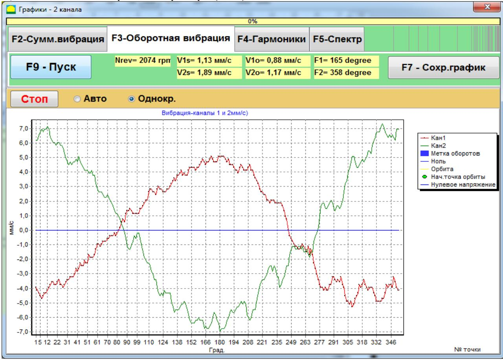

Рис. 7.51. Рабочее окно для вывода графиков оборотных составляющих вибрации.

#### **7.6.3. Графики вибрации с результатами гармонического анализа.**

Для построения графиков вибрации с результатами гармонического анализа в рабочем окне «F4 – Настройки».**Измерение вибрации по двум каналам. Графики**» (см. рис. 7.50) необходимо кликнуть по кнопке «F4 – Настройки».**Гармонический анализ**».

После чего на дисплее появляется рабочее окно для одновременного вывода графиков временной функции, а также спектра гармонических составляющих вибрации, период которых равен или кратен частоте вращения ротора (см. рис. 7.52).

#### **Внимание!**

**При работе в данном режиме необходимо использовать датчик фазового угла, обеспечивающий синхронизацию процесса измерения с частотой вращения ротора машины, на который настроен датчик.**

Для работы в данном окне следует задать число оборотов ротора, на которых предполагается проводить измерения. Для этого нужно кликнуть по кнопке «F4 – Настройки».▼» и выбрать из выпадающего списка нужный период измерения, который может быть равен 1, 2, 4 или 8 оборотам ротора.

Далее по готовности следует нажать (кликнуть) кнопку «F4 – Настройки».**F7 – Измерить**», после чего начинается процесс измерения вибрации одновременно по двум каналам.

После завершения процесса измерения в рабочем окне (см. рис. 7.52)появляются Графики временной функции (верхний график) и спектра гармонических составляющих вибрации (нижний график).

На графике спектра по оси **Х** откладывается номер гармоники, а по оси **У** - амплитуда виброскорости в мм/сек.

При этом вибрация, измеренная по первому каналу, отображается красным, а по второму – зелёным цветом.

Рис. 7.52. Рабочее окно для вывода спектра гармонических составляющих вибрации.

#### **7.6.4. Графики вибрации с результатами спектрального анализа.**

Для построения графиков вибрации с результатами спектрального анализа в рабочем окне «F4 – Настройки».**Измерение вибрации по двум каналам. Графики**» (см. рис. 7.50) необходимо кликнуть по кнопке «F4 – Настройки».**Спектральный анализ**».

После чего на дисплее появляется рабочее окно, предназначенное для одновременного вывода графиков временной функции и частотного спектра вибрации (рис. 7.53).

Далее по готовности следует нажать (кликнуть) кнопку «F4 – Настройки».**F7 – Измерить**», после чего начинается процесс измерения вибрации одновременно по двум каналам.

После завершения процесса измерения в рабочем окне (см. рис. 7.53 ) появляются Графики временной функции (верхний график) и спектра вибрации (нижний график).

На графике спектра по оси **Х** откладывается частота составляющей вибрации в Гц, а по оси **У** - амплитуда виброскорости в мм/сек.

При этом вибрация, измеренная по первому каналу, отображается красным, а по второму – зелёным цветом.

Рис. 7.53. Рабочее окно для вывода спектрального анализа вибрации.

