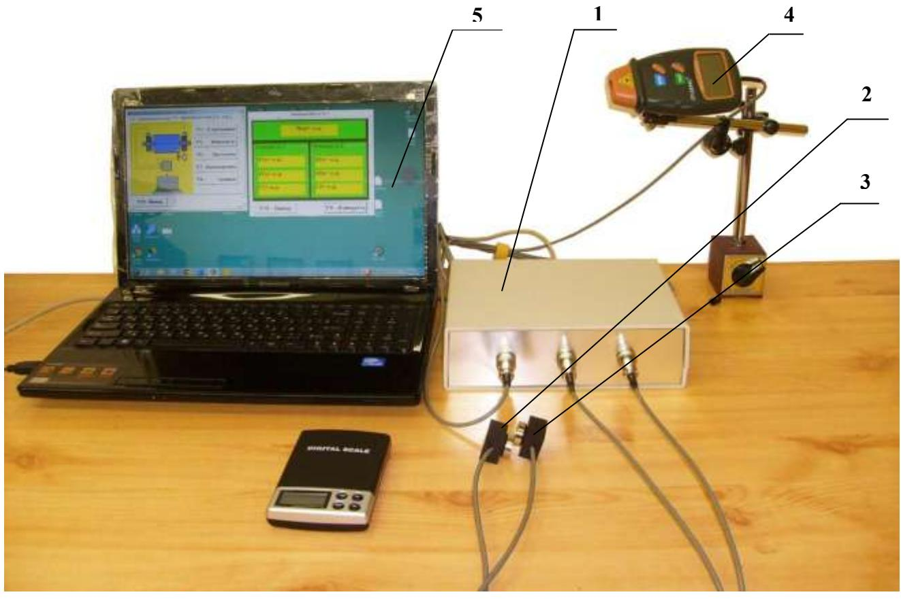
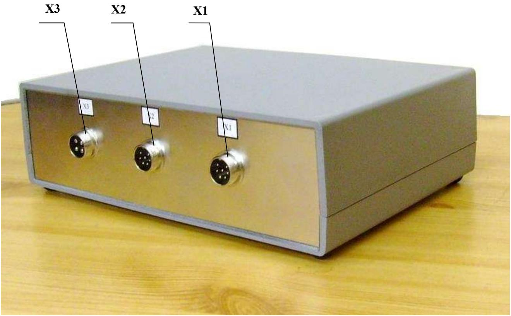
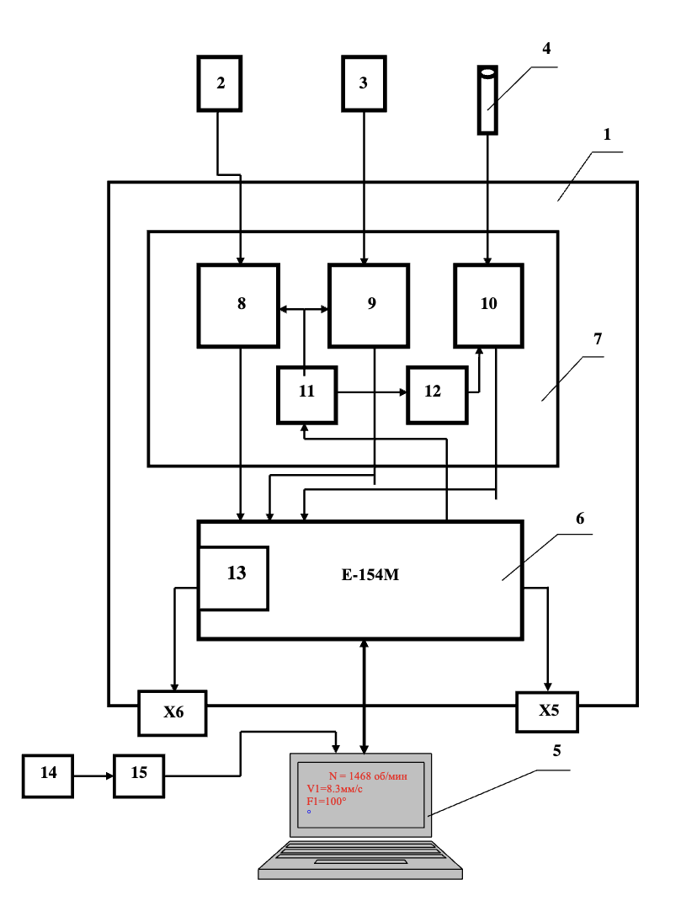

# 4. УСТРОЙСТВО И ПРИНЦИП РАБОТЫ ПРИБОРА

## 4.1. Физическая компоновка прибора

Фотографии прибора «Балком-2С КС» приведены на рисунках 4.1 и 4.2.

Прибор (см. рис. 4.1) состоит из следующих основных компонентов:

1. **Измерительный блок** (обозначен как **1**)
2. **Датчики вибрации или датчики силы** (обозначены как **2** и **3**)
3. **Датчик фазового угла** (обозначен как **4**)
4. **Компьютер** (нетбук, ноутбук, моноблок – обозначен как **5**)

Корпус измерительного блока выполнен из серого пластика ABS. Его лицевой стенке (см. рис. 4.2) соответствуют следующие разъёмы:
- **Х1 и Х2** – для подключения датчиков вибрации (или силы) к первому и второму измерительным каналам;
- **Х3** – для подключения датчика фазового угла.

С боковой стороны корпуса выведён кабель с USB-разъёмом **Х4**, предназначенный для соединения измерительного блока с компьютером. По этому кабелю осуществляется обмен данными, а также питание измерительного блока от компьютера (+5 В).

Кроме того, на задней стенке корпуса (по требованию заказчика) могут устанавливаться:
- Разъём релейного выхода (**Х5**);
- Разъём **Х6**, предназначенный для вывода двух управляющих сигналов, программно изменяемых в диапазоне от 0 до +10 В. Данные сигналы могут использоваться для включения привода станка и задания частоты вращения балансируемого ротора.

*Рис. 4.1*

*Рис. 4.2*

## 4.2. Функциональная схема и принцип работы

Функциональная схема прибора приведена на рисунке 4.3. Основными конструктивными единицами являются:
- **Измерительный блок** (**1**);
- **Датчики вибрации** (**2** и **3**);
- **Датчик фазового угла** (**4**);
- **Портативный компьютер** (**5**).

При необходимости в состав прибора могут быть включены:
- Датчик угла поворота ротора (**14**);
- Интерфейсный модуль для подключения датчика угла поворота (**15**).

### Внутренняя компоновка измерительного блока

Внутри корпуса измерительного блока установлен модуль **6** (АЦП/ЦАП Е-154М), к которому подключена плата **7** нормирующих преобразователей сигналов датчиков. На плате **7** сосредоточены ключевые узлы, обеспечивающие нормирование сигналов, а именно:
- **Интеграторы (8 и 9)** для сигналов датчиков вибрации по первому и второму входам;
- **Преобразователь (10)** сигнала датчика фазового угла;
- Преобразователи питания:
  - **11** – DC-DC +5B/+5B;
  - **12** – DC-DC +5B/+12B.

Модуль **6** имеет программируемый выход ЦАП – **13**, позволяющий формировать на разъёме **Х6** управляющее напряжение в диапазоне от 0 до +10 В (предусматривается по дополнительному заказу). Также присутствует цифровой выход для управления реле, подключённым к разъёму **Х5**.

Рис. 4.3. Функциональная схема прибора «Балком-2С КС»

### Принцип работы

Принцип действия прибора основан на измерении механических колебаний или деформаций, возникающих на опорах балансировочного станка. Основные этапы работы прибора следующие:

1. **Преобразование механических колебаний в электрические сигналы.**  
   Для этого используются датчики вибрации – акселерометры (или датчики силы) (**2, 3**), чей выходной аналоговый сигнал пропорционален виброускорению (или изменяемой силе).

2. **Обработка сигнала.**  
   - Сигнал проходит процесс интегрирования и полосовой фильтрации, в результате чего формируется сигнал, пропорциональный виброскорости.  
   - Этот изменённый сигнал поступает на аналоговый вход модуля **6** (АЦП/ЦАП Е-154М), где он преобразуется в цифровую форму и сохраняется в оперативной памяти.

3. **Определение фазовых характеристик.**  
   При необходимости измерения частоты вращения или фазовых характеристик используется оптический лазерный датчик (**4**). Его импульсный сигнал нормируется и также поступает на модуль **6**.

4. **Цифровая обработка и передача данных.**  
   В модуле **6** производится первичная цифровая обработка и запоминание сигналов. Затем данные передаются через USB-шину в портативный компьютер (**5**), где с помощью программного обеспечения осуществляется дальнейшая обработка (фильтрация, интерполяция, Фурье-анализ, вычисление параметров балансировки и т.д.).

5. **Вывод результатов и управление.**  
   Полученные численные значения амплитуды и фазы вибрации (или силы), а также частоты вращения выводятся на дисплей компьютера и сохраняются в памяти. По результатам измерений осуществляется автоматизированное решение задачи балансировки, после чего на дисплее появляются данные о величине и угле установки корректирующей массы.

Пользователю требуется установить пробные и корректирующие грузы на балансируемом роторе и нажать соответствующие клавиши (физические или на сенсорном экране). Весь процесс – от измерения до вычисления результатов – осуществляется автоматически программным обеспечением, установленным в компьютере.

Также на задней стенке измерительного блока, по желанию заказчика, может быть установлен разъём ЦАП (**Х6**) для программного задания управляющего напряжения (0 до +10 В) для управления балансировочным станком, а также разъём **Х5** для релейного выхода.

При необходимости комплект может дополнительно включать импульсный преобразователь (датчик) угла поворота ротора (**14**) с соответствующим интерфейсным модулем (**15**), позволяющим подключить датчик непосредственно к USB-порту компьютера.