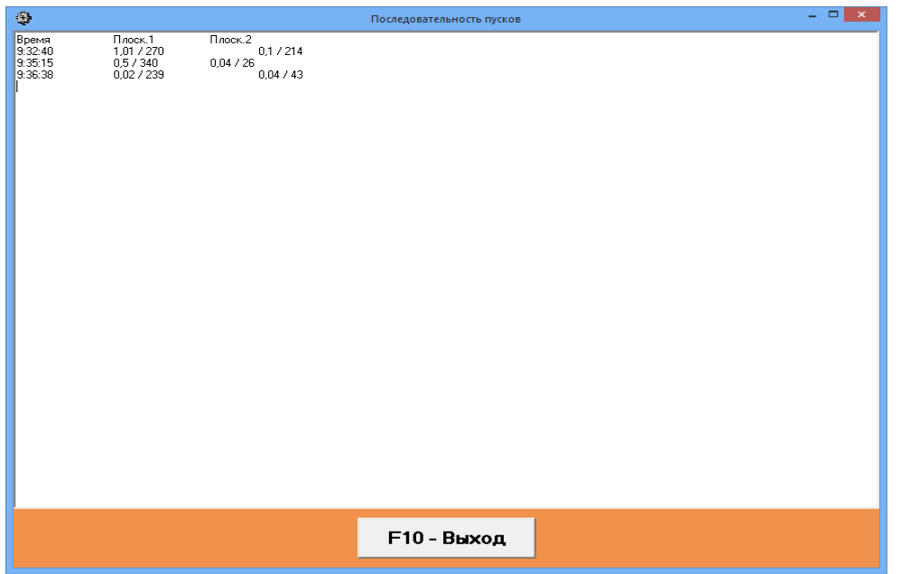
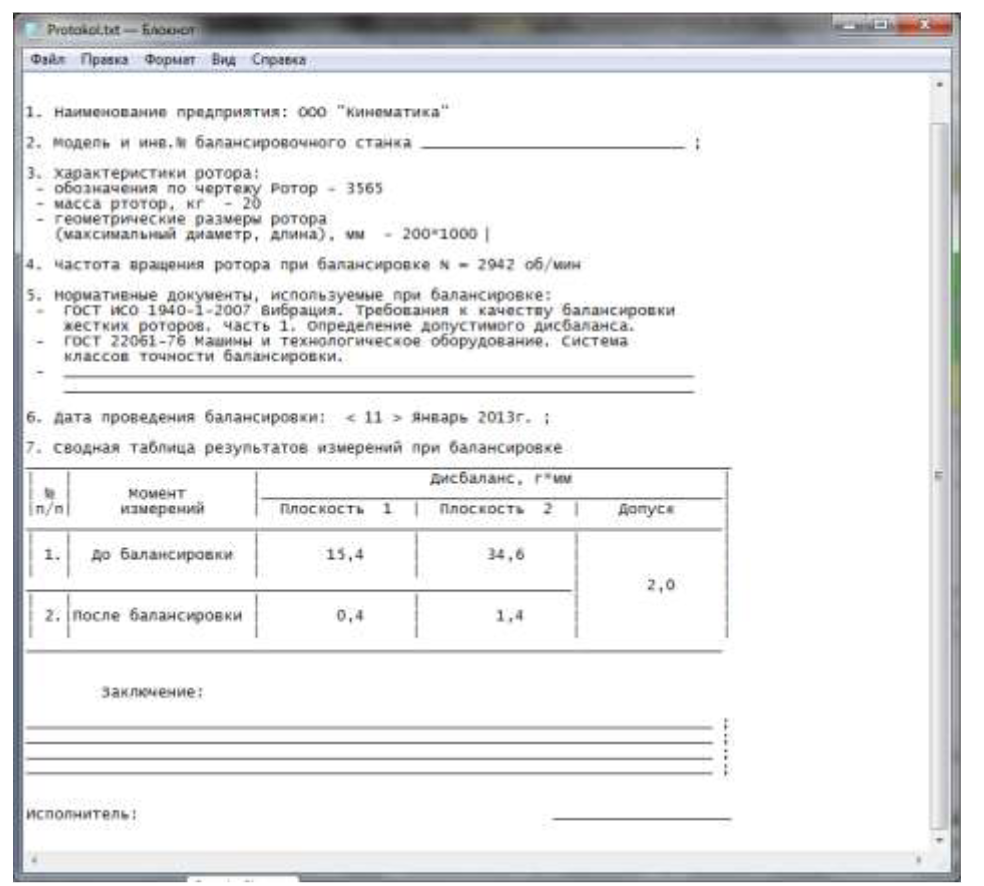

# 7.3.1.3. Дополнительные функции и возможности, доступные при работе в рабочем окне «Установка грузов и дисбаланс»

Как видно из рис. 7.9.а, при работе в окне **«Установка грузов и дисбаланс»** помимо кнопки **«Выход»** могут использоваться ещё шесть управляющих кнопок, в том числе: **«Угломер»**, **«Смещение»**, **«Калькулятор»**, **«Учёт эксц.»**, **«Коэфф-ты, В архив, История»**.

Дополнительно, в верхней части этого окна имеется строка меток **«Способ коррекции»**. Путём установки соответствующей метки можно изменить ранее выбранный способ коррекции. Например, можно изменить способ, выполняемый путём добавления корректирующего груза, на способ, предусматривающий съём (удаление) корректирующего груза.

Кнопка **«История»** используется для вывода архивных результатов балансировки (данных о массах и углах установки корректирующих грузов), полученных для конкретного ротора при выполнении нескольких итерационных циклов балансировки. При её нажатии на дисплее компьютера выводится последовательность результатов, полученных на всех циклах балансировки, которые могут служить оператору дополнительными справочными материалами.

Результаты выводятся в виде трёх столбцов (см. рис. 7.10):

- **Первый столбец**: время завершения очередного цикла балансировки.
- **Второй столбец**: данные о массе и угле установки корректирующего груза в первой плоскости, полученные при очередном цикле.
- **Третий столбец**: данные о массе и угле установки корректирующего груза во второй плоскости, полученные при том же цикле.

Рис. 7.10.а. Рабочее окно вывода истории балансировки

---

## Кнопка «Угломер»

Кнопка **«Угломер»** в рабочем окне **«Установка грузов и дисбаланс»** (см. рис. 7.9.а) позволяет, при наличии на балансировочном станке преобразователя угловых перемещений, контролировать угловое положение балансируемого ротора.

При её нажатии на дисплее появляется дополнительное рабочее окно (см. рис. 7.10.б), в котором отображаются угловые координаты ротора. Измерение производится относительно установленной на роторе метки.

#### Внимание!

**Перед началом измерения угла следует, путём разворота ротора, совместить установленную на нём метку с плоскостью, в которой предполагается производить установку (съём) корректирующих грузов.**

Рис. 7.10.б. Дополнительное рабочее окно для определения углового положения ротора

Для подключения датчика угла поворота ротора в дополнительном рабочем окне (см. рис. 7.10.б) следует нажать кнопку **«Подкл.»**, после чего в окошке индикации **«Угол поворота»** устанавливается значение **0**.

### Внимание!

**Если после нажатия кнопки «Подкл.» в окошке «Угол поворота» не появятся никакие показания, необходимо последовательно нажать кнопки «Откл.» и «Подкл.», а также отключить и вновь подключить к компьютеру USB-разъём интерфейсного блока датчика угла поворота.**

Далее, используя показания преобразователя угловых перемещений, можно начать разворот ротора на угол, соответствующий месту съёма (установки) корректирующего груза, определённому для первой плоскости коррекции.

Если на станке задействована функция программного управления работой привода, для проведения доворота ротора следует нажать кнопку **«Пуск»** и включить вращение привода (см. рис. 7.10.б). После перемещения ротора в заданное положение нажмите кнопку **«Стоп»** и приступайте к операции установки корректирующего груза.

После завершения операции установки (или съёма) корректирующего груза в первой плоскости ротор следует развернуть на угол, соответствующий месту установки (или съёма) корректирующего груза, определённому для второй плоскости коррекции, и выполнить корректировку дисбаланса в ней.

#### Внимание!

**В данной измерительной системе отсчёт углового положения места добавления (удаления) корректирующего груза производится от метки на роторе и ведётся в направлении, совпадающем с направлением вращения ротора.**

---

## Кнопка «Смещение»

Кнопка **«Смещение»** используется при вынужденном изменении положения плоскостей коррекции, когда необходимо выполнить пересчёт масс и углов установки корректирующих грузов. Этот режим особенно полезен при балансировке роторов сложной формы (например, коленчатых валов).

При нажатии кнопки на дисплее появляется рабочее окно **«Пересчёт дисбалансов из одних плоскостей в другие»** (см. рис. 7.11). В окне необходимо выбрать один из четырёх возможных вариантов пересчёта, щёлкнув по соответствующему рисунку.

Стоит отметить, что исходные плоскости коррекции (**Н1** и **Н2**) обозначены зелёным цветом, а новые плоскости (**К1** и **К2**), для которых производят пересчёт, — красным.

В разделе **«Данные для расчёта»** необходимо ввести запрашиваемые параметры:
- Расстояния между соответствующими плоскостями коррекции (**a, b, c**);
- Новые значения радиусов установки корректирующих грузов на роторе (**R1', R2'**).

После ввода исходных данных нажмите кнопку **«F9-Пересчитать»** (или функциональную клавишу **F9**) для выполнения расчёта. Результаты (массы **М1, М2** и углы установки корректирующих грузов **f1, f2**) отображаются в соответствующем разделе рабочего окна (см. рис. 7.11).

Рис. 7.11. Рабочее окно вывода результатов пересчёта параметров корректирующих грузов при изменении плоскостей коррекции

---

## Кнопка «Калькулятор»

Кнопка **«Калькулятор»** используется, когда необходимо суммировать несколько корректирующих грузов или разлагать груз по лопастям. При её нажатии на дисплее появляется рабочее окно **«Векторный калькулятор»** (см. рис. 7.12), в котором можно выполнить суммирование двух векторов или разложение одного вектора по фиксированным углам (например, по лопастям).

Рис. 7.12. Рабочее окно «Векторный калькулятор»

---

## Кнопка «Учёт Эксц.»

Кнопка **«Учёт Эксц.»** применяется при необходимости учёта эксцентриситета оправки (или шпинделя), используемых на станке при балансировке ротора. Подробное описание работы в данном режиме приведено в разделе **7.3.3**.

---

## Кнопка «Коэффициенты»

Кнопка **«Коэффициенты»** предназначена для просмотра и запоминания коэффициентов балансировки ротора, рассчитанных по результатам трёх настроечных пусков. При её нажатии появляется рабочее окно **«Коэффициенты балансировок в 2-х плоскостях»** (см. рис. 7.13), где отображаются расчётные коэффициенты.

Если при последующей балансировке ротора предполагается использовать режим **«Повторная балансировка»**, указанные коэффициенты необходимо сохранить в памяти компьютера. Для этого в окне **«Коэффициенты балансировок в 2-х плоскостях»** нажмите кнопку **«Сохранить»** и перейдите на вторую страницу окна (см. рис. 7.14). Затем введите условное обозначение балансируемого ротора в поле **«Машина»**, располагающемся в последней значащей строке таблицы, и нажмите кнопку **«√»** для сохранения данных.

Рис. 7.13. Рабочее окно с коэффициентами балансировки в 2-х плоскостях

После сохранения можно вернуться в предыдущее окно (рис. 7.13), нажав кнопку **«Выход».** Для выхода из рабочего окна (см. рис. 7.13) в окно **«Установка грузов и дисбаланс»** (см. рис. 7.10) также нажмите кнопку **«Выход»**.

Рис. 7.14. Вторая страница рабочего окна с коэффициентами балансировки в 2-х плоскостях

---

## Кнопка «В архив»

Кнопка **«В архив»** используется в рабочем окне **«Установка грузов и дисбаланс»** (см. рис. 7.10) для перехода в архив, где автоматически сохраняются результаты всех балансировок.

### Внимание!

#### Кнопка «В архив» доступна только после выполнения полного цикла балансировки, включая проверочный пуск.

При её нажатии на дисплее появляется рабочее окно **«Архив балансировок в 2-х плоскостях»** (см. рис. 7.15), в котором отображаются исходные и конечные данные текущей балансировки, а также таблица с результатами всех предыдущих балансировок. В этом окне выполняется подготовка результатов последней балансировки для архивного хранения и последующей распечатки протокола.

Подготовка включает ввод названия (или условного обозначения) балансируемого ротора в поле **«Имя ротора»**. После ввода данных нажмите кнопку **«√»**, расположенную среди управляющих кнопок окна **«Архив балансировок в 2-х плоскостях»**.

Далее, нажав кнопку **«Протокол»**, можно вывести на дисплей проект протокола проверки, отредактировать его и, при необходимости, распечатать на принтере или сохранить как текстовый документ.

Рис. 7.15. Рабочее окно «Архив балансировки в 2-х плоскостях»

Пример оформления протокола балансировки ротора приведён на рис. 7.16. Для завершения работы в этом окне нажмите кнопку **«Выход»**.

Рис. 7.16. Пример оформления протокола балансировки ротора