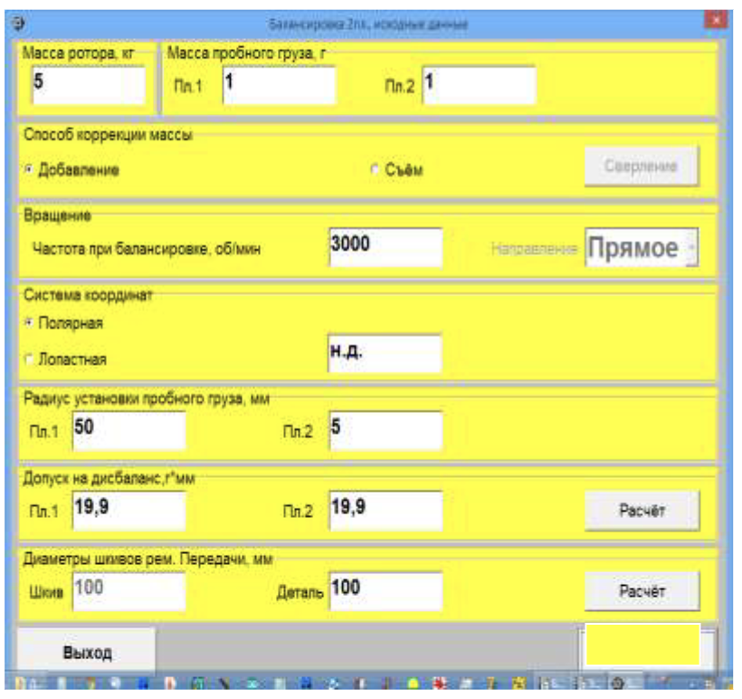

# 7.3.1. Первичная балансировка ротора

Первичная (настроечная) балансировка ротора начинается при нажатии кнопки **«Первичная»** в Главном рабочем окне программы (см. рис. 7.1).

На дисплее компьютера появляется рабочее окно **«Балансировка в двух плоскостях. Исходные данные»** (см. рис. 7.3), где вводятся все необходимые исходные данные для настройки измерительной системы балансировочного станка под конкретный ротор.

Рис. 7.3. Рабочее окно для ввода исходных данных при балансировке ротора в двух плоскостях

---

## 7.3.1.1. Ввод исходных данных

*Изм. Лист № докум. Подпись Дата*

Ввод исходных данных для первичной балансировки начинается с раздела **«Масса ротора»**, где указывается масса балансируемого ротора в килограммах.

Далее в разделе **«Масса пробного груза»** вводятся массы пробных грузов (в граммах), которые будут устанавливаться на роторе в первой (**«Пл.1»**) и второй (**«Пл.2»**) плоскостях коррекции.

В разделе **«Способ коррекции»** выбирается способ компенсации дисбаланса. Здесь предлагается два варианта:
- а) **«Добавление»** корректирующих грузов;
- б) **«Съём»** (удаление) корректирующих грузов.

Для выбора варианта необходимо поставить метку с помощью мышки рядом с соответствующей надписью. При выборе варианта на съём корректирующих грузов возможно отображение их в единицах глубины сверления. Для этого после выбора варианта **«Съём»** нужно нажать кнопку **«Сверление»**. Появится дополнительное рабочее окно для ввода необходимых исходных данных.

Рис. 7.4. Рабочее окно для ввода исходных данных, необходимых для вывода масс корректирующих грузов в единицах глубины сверления (мм)

После ввода всех данных в этом окне следует нажать кнопку **«Принять»** для возврата в окно **«Балансировка в 2-х плоскостях. Исходные данные»** (см. рис. 7.3). В случае ошибочного ввода какого-либо параметра, нажмите кнопку **«Отменить»** и повторите ввод.

#### ВНИМАНИЕ!

**При вводе исходных данных их дробная часть отделяется от целой части запятой (знаком « , »).**

Далее в разделе **«Вращение»** (см. рис. 7.3) необходимо ввести частоту вращения ротора (обороты в минуту).

В разделе **«Система координат»** выбирается вариант размещения корректирующих грузов на роторе — **«Полярная»** или **«Лопастная»** система координат. Для выбора варианта воспользуйтесь мышкой, установив метку рядом с нужной надписью. При выборе системы координат «Лопастная» необходимо ввести число лопастей ротора в специальном поле.

В следующем разделе рабочего окна (см. рис. 7.3) вводятся радиусы установки пробного груза в первой и второй плоскостях коррекции, что позволяет рассчитывать величину остаточного дисбаланса ротора в **«г * мм»**.

Далее заполняется раздел **«Допуск на дисбаланс, г*мм»**, в котором вводятся допуски на величину остаточного дисбаланса, установленные в технической документации. Если допуск не указан, его можно рассчитать с учётом требований ГОСТ ИСО 1940-1-2007. Для этого нажмите кнопку **«Расчёт»** в разделе **«Допуск на дисбаланс, г*мм»**.

При нажатии этой кнопки появится таблица с перечнем типов механизмов, для роторов которых по ГОСТ ИСО 1940-1-2007 рекомендованы соответствующие классы остаточного дисбаланса.

Рис.7.5.а. Рабочее окно для выбора класса балансировки машин по ИСО 1940-1-2007

В данном окне в разделе **«Рабочая частота вращения»** (в левом верхнем углу) вводится эксплуатационная частота вращения ротора (обороты в минуту). Затем в таблице выбирается класс точности балансировки (от G0.4 до G4000), путем установки метки в соответствующей строке (например, строка G2.5) и нажатия кнопки **«Принять»**. После этого расчетные значения допусков на остаточный дисбаланс заносятся в соответствующий раздел окна **«Балансировка в двух плоскостях. Исходные данные»** (см. рис. 7.3). Если расчет не требуется, можно выйти из окна на рис. 7.5.а, нажав кнопку **«Отменить»**.

После задания допусков в окно вносится диаметр балансируемого ротора (или его шкива), который используется для расчёта передаточного отношения ременной передачи привода станка (или стенда). Если ремённой передачи нет и привод выполняется напрямую от электродвигателя, диаметр ротора условно принимается равным диаметру воображаемого шкива.

По завершении ввода всех исходных данных нажмите кнопку **«Продолжить»**. Тогда на дисплее появится рабочее окно (см. рис. 7.6), предназначенное для проведения полного цикла измерений при первичной балансировке.

---

## 7.3.1.2. Измерения при проведении первичной балансировки

При балансировке в двух плоскостях в режиме **«Первичная балансировка»** необходимо провести три настроечных пуска и как минимум один проверочный пуск балансируемого ротора.

### 1. Первый пуск: Измерение вибрации (силы) на опорах станка

Измерения выполняются в рабочем окне **«Балансировка в 2-х плоскостях»** (см. рис. 7.6) в разделе **«Пуск без груза»**. Готовность программы к работе подтверждается темно-зеленым фоном раздела и подсветкой кнопок **«Возврат»** и **«Измерить»**, расположенных в правой части таблицы.

Кнопка **«Возврат»** позволяет вернуться на предыдущий шаг программы.

#### ВНИМАНИЕ!

**Перед началом измерения (если не предусмотрено программное управление пуском и остановкой станка) необходимо включить вращение ротора (первый пуск).**

Для начала измерения в разделе **«Пуск без груза»** щёлкните по кнопке **«Измерить»**. После этого в окне **«Измерения Nоб, Vs, Vo, F»** (см. рис. 7.7) начинают проводиться циклические замеры частоты вращения и вибрации (силы) ротора в режиме «Мониторинг».

Если измеренное значение частоты вращения отличается не более чем на ±10% от заданного, фон окна (см. рис. 7.7) окрашивается в зелёный цвет, что указывает на готовность к переходу в режим **«Рабочий замер»**. Для перехода в этот режим нажмите кнопку **«Принять»**. Тогда в окне появится красный транспарант **«Режим — Рабочий замер»**, сигнализирующий, что проводится измерение вибрации для расчёта параметров балансировки.

Если частота вращения не укладывается в допуск, фон окна будет синим (ниже допуска) или красным (выше допуска), что указывает на невозможность дальнейшей работы до дополнительной настройки частоты.

Время измерения вибрации (силы) на опорах может длиться от 4 до 15 секунд. После успешного завершения измерений в разделе **«Пуск без груза»** отображаются результаты: частота вращения ротора (**Nоб**), значения СКЗ (**Vo1, Vo2**) и фазы (**F1, F2**) вибрации (силы).

После первого пуска фон раздела **«Груз в плоскости 1»** меняется с салатного на темно-зеленый, а кнопки **«Возврат»** и **«Измерить»** подсвечиваются, что свидетельствует о готовности прибора к работе на втором пуске.

Рис. 7.7. Рабочее окно, используемое для измерения вибрации в режимах «Мониторинг» и «Рабочий замер»

### 2. Второй пуск: Измерение на плоскости 1

Перед началом измерения в разделе **«Груз в плоскости 1»** необходимо остановить вращение ротора и установить на нем пробный груз в первой плоскости. Масса этого груза задается заранее в окне **«Балансировка в двух плоскостях. Исходные данные»** (см. рис. 7.3).

После установки груза включите вращение ротора и убедитесь, что он работает в рабочем режиме. Для начала измерения параметров вибрации (силы) в разделе **«Груз в плоскости 1»** нажмите кнопку **«Измерить»**. Затем в окне **«Измерения Nоб, Vs, Vo, F»** (см. рис. 7.7) производится замер частоты вращения и вибрации (силы) при втором пуске. После завершения замера в соответствующих окошках раздела отображаются результаты: **Nоб**, **Vo1, Vo2** и **F1, F2**.

Рис. 7.8. Рабочее окно, используемое для измерения на втором шаге балансировки при установке пробного груза в плоскости 1

### 3. Третий пуск: Измерение на плоскости 2

Перед началом измерения в разделе **«Груз в плоскости 2»** остановите вращение ротора, снимите пробный груз с плоскости 1 и установите пробный груз в плоскости 2. Масса этого груза также задается в окне **«Балансировка в двух плоскостях. Исходные данные»** (см. рис. 7.3).

После включения вращения ротора и перехода в рабочий режим нажмите кнопку **«Измерить»** в разделе **«Груз в плоскости 2»**. Начинается замер частоты вращения и вибрации (силы) при третьем пуске. После завершения замера отображаются результаты (**Nоб**, **Vo1, Vo2**, **F1, F2**).

### 4. Отображение результатов расчёта корректирующих грузов

Одновременно поверх окна **«Балансировка в 2-х плоскостях»** появляется окно **«Установка грузов и дисбаланс»**, в котором выводятся результаты расчёта параметров корректирующих грузов для установки на роторе в первой и второй плоскостях для компенсации дисбаланса.

При использовании полярной системы координат на дисплее отображаются значения масс (**М1, М2**) и углов установки (**f1, f2**) корректирующих грузов (см. рис. 7.9.а).

В случае разложения корректирующих грузов по лопастям, на дисплее (см. рис. 7.9.б) для каждой плоскости выводятся номера лопастей (**Z1i, Z1j** и **Z2i, Z2j**) и массы грузов, которые необходимо установить на этих лопастях.

Рис. 7.9.а. Рабочее окно вывода результатов расчёта параметров корректирующих грузов

Рис. 7.9.б. Рабочее окно вывода результатов расчёта параметров корректирующих грузов, разложенных по лопастям

Если величины корректирующих грузов выводятся в единицах глубины сверления (см. рис. 7.9.в), то для каждой плоскости отображаются:
- Глубина отверстия **Н** в мм,
- Количество высверливаемых отверстий **N**,
- Угловое положение отверстий **f** (в градусах) относительно метки.

Рис. 7.9.в. Рабочее окно вывода результатов расчёта параметров корректирующих грузов в единицах глубины сверления

#### ВНИМАНИЕ!

- **1. После появления окна «Установка грузов и дисбаланс» (рис. 7.9) остановите вращение ротора и снимите установленные ранее пробные грузы. Только после этого приступайте к установке (или съему) корректирующих грузов.**
- **2. Отсчёт углового положения места добавления (удаления) корректирующего груза в полярной системе координат производится от места установки пробного груза. Направление отсчёта совпадает с направлением вращения ротора.**
- **3. При балансировке по лопастям условно первая лопасть (1-я) совпадает с местом установки пробного груза (метки). Направление отсчёта номера лопасти, указанного на дисплее, совпадает с направлением вращения ротора.**

После установки необходимых корректирующих грузов нажмите кнопку **«Выход»** для возврата в окно **«Балансировка в 2-х плоскостях»** и оцените эффективность проведённой балансировочной операции. В этом окне раздел **«Проверка»** меняет цвет фона с салатного на темно-зеленый, а кнопка **«Выполнить»** подсвечивается, что указывает на готовность прибора к четвёртому (проверочному) пуску.

---

#### ВНИМАНИЕ!

**Перед началом измерения на четвёртом (проверочном) пуске включите вращение ротора и убедитесь, что он достиг заданной частоты вращения.**

После проверочного пуска в разделе **«Проверка»** появляются результаты измерения частоты вращения ротора (**Nоб**) и значения СКЗ (**Vo1, Vo2**) и фаз (**F1, F2**) вибрации (силы).

Одновременно поверх окна **«Балансировка в 2-х плоскостях»** снова появляется окно **«Установка грузов и дисбаланс»**, в котором выводятся результаты расчёта параметров **дополнительных** корректирующих грузов для компенсации остаточного дисбаланса ротора. Также в этом окне отображаются величины остаточного дисбаланса, достигнутые после балансировки.

Если остаточный дисбаланс удовлетворяет допускам, установленным в технической документации, процесс балансировки можно завершить. В противном случае балансировку следует продолжить путем последовательной установки (или удаления) дополнительных корректирующих грузов, параметры которых указаны в окне **«Установка грузов и дисбаланс»**.

После внесения корректирующих изменений нажмите кнопку **«Выход»** для возврата в предыдущее рабочее окно программы и продолжения работы по программе.