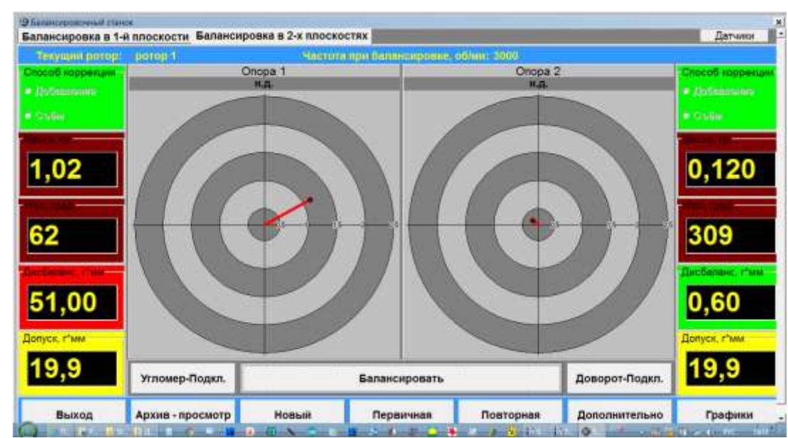
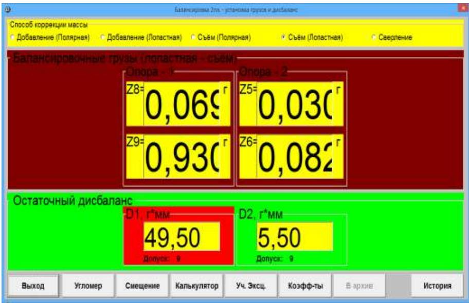
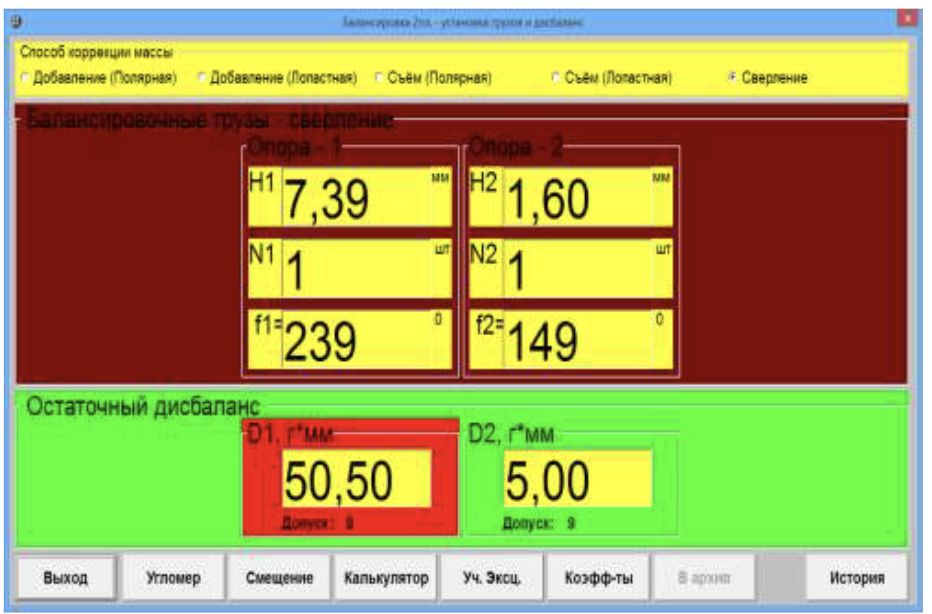

# 7.3.2. Повторная балансировка ротора

## 7.3.2.1. Подготовка измерительной системы для повторной балансировки (ввод исходных данных)

Повторная балансировка может выполняться только для ранее отбалансированного ротора, для которого уже были определены и занесены в память компьютера коэффициенты балансировки и другие исходные данные.

#### ВНИМАНИЕ!
**При проведении повторной балансировки датчики вибрации и датчик фазового угла должны быть установлены точно так же, как при проведении первичной балансировки.**

Работа в режиме повторной балансировки начинается из Главного рабочего окна программы (см. рис. 7.1) при нажатии кнопки **«Повторная»**. В этом случае на дисплее прибора появится вторая страница рабочего окна **«Коэффициенты балансировок в 2-х плоскостях»** (см. рис. 7.14), содержащая коэффициенты балансировки и ряд других параметров для всех ранее отбалансированных роторов.

Перемещаясь по таблице этого окна с помощью управляющих кнопок «►» или «◄», можно выбрать нужный тип ротора, для которого ранее была сформирована запись с коэффициентами балансировки. После этого для использования этих данных в текущих измерениях следует нажать кнопку **«Выбрать»**. Далее следует нажать кнопку **«Выход»** и вернуться в Главное рабочее окно программы (см. рис. 7.1).

После этого можно установить ротор выбранного типа на балансировочном станке и включить его вращение.

## 7.3.2.2. Измерения при проведении повторной балансировки

Повторная балансировка требует проведения всего лишь одного настроечного и, как минимум, одного проверочного пуска балансируемой машины.

Для начала измерения на первом пуске в Главном рабочем окне программы (см. рис. 7.1) следует нажать кнопку **«Балансировать»**. После этого на дисплее компьютера появится рабочее окно (см. рис. 7.7), в котором в режиме мониторинга начинается измерение вибрации и частоты вращения ротора.

Если измеренное значение частоты вращения отличается не более чем на ±10% от заданного значения, то фон окна на рис. 7.7 имеет зелёный цвет, что указывает на возможность выполнения замера вибрации, используемой для расчётов при балансировке. Если же измеренное значение частоты вращения ротора не укладывается в допуск, то фон рабочего окна будет синим (при значении ниже допуска) или красным (при значении выше допуска). Это означает, что дальнейшая работа невозможна до дополнительной настройки частоты вращения ротора.

Когда частота вращения ротора находится в заданном диапазоне, в рабочем окне **«Измерения Nоб, Vs, Vo, F»** (см. рис. 7.7) необходимо нажать кнопку **«Принять»**. После этого загорается красный транспарант **«Режим -- Рабочий замер»**. При появлении этого транспаранта начинается замер вибрации (силы) на опорах станка, а также производится обработка результатов измерений. Время замера зависит от частоты вращения ротора и может длиться от 4 до 15 секунд.

При успешном завершении процесса измерений результаты расчёта параметров корректирующих грузов для установки на роторе в первой и второй плоскостях выводятся на дисплей компьютера (см. рис. 7.17). Эти параметры отображаются для обеих плоскостей коррекции как в цифровом, так и в графическом виде (например, в виде векторов дисбаланса на панорамных индикаторах в полярной системе координат).

Кроме того, на дисплее выводятся следующие справочные данные:
- тип балансируемого ротора;
- частота его вращения при балансировке;
- допуски на величину остаточного дисбаланса;
- информация о способе коррекции (добавление или съём корректирующих грузов).

Корректирующие грузы, информация о которых представлена на рис. 7.17, необходимо установить на роторе (или удалить с ротора) для компенсации его дисбаланса. После установки (или съёма) корректирующих грузов при необходимости можно проверить эффективность балансировки, повторно нажав кнопку **«Балансировать»**.

Рис. 7.17. Пример вывода на дисплей компьютера результатов балансировки в полярной системе координат

Если при проведении первичной (настроечной) балансировки был выбран вариант разложения корректирующих грузов по лопастям, следует дополнительно нажать кнопку **«F3-Дополн.»**. После этого на дисплее поверх рабочего окна, представленного на рис. 7.17, в табличной форме (см. рис. 7.18) выводятся результаты разложения корректирующих грузов по лопастям.

Рис. 7.18. Пример вывода на дисплей компьютера результатов балансировки с разложением корректирующих грузов по лопастям

При этом в правой и левой зонах рабочего окна сохраняются предварительно рассчитанные параметры корректирующих грузов в полярной системе координат.

После завершения процедуры установки (или съёма) корректирующих грузов, указанной в таблице, следует нажать кнопку **«Выход»** и вернуться в Главное меню программы.

Если при проведении первичной балансировки был выбран вариант вывода параметров корректирующих грузов в единицах глубины сверления, то в рабочем окне (см. рис. 7.17) также следует нажать кнопку **«F3-Дополн.»**. После этого на дисплее поверх исходного рабочего окна выводится таблица (см. рис. 7.19), в которой для обеих плоскостей коррекции указаны:
- количество высверливаемых отверстий **N**;
- глубина отверстий **Н** в мм;
- угол расположения отверстий на роторе **f** в градусах.

Рис. 7.19. Пример вывода на дисплей компьютера результатов балансировки, заданных в глубине сверления

Одновременно в правой и левой зонах рабочего окна сохраняются предварительно рассчитанные параметры корректирующих грузов в полярной системе координат.

После завершения процедуры сверления и съёма корректирующих грузов с ротора нажмите кнопку **«Выход»** и вернитесь в Главное меню программы.

Если выполняется балансировка партии однотипных роторов, после завершения балансировки очередного ротора в Главном рабочем окне программы (см. рис. 7.17) следует нажать кнопку **«Новый»**, чтобы обнулить результаты балансировки предыдущего ротора. Затем установите на станке новый ротор, включите вращение станка и, нажав кнопку **«Баланс»**, приступите к балансировке нового ротора.