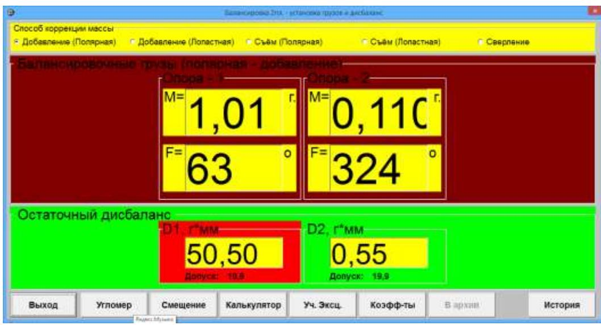
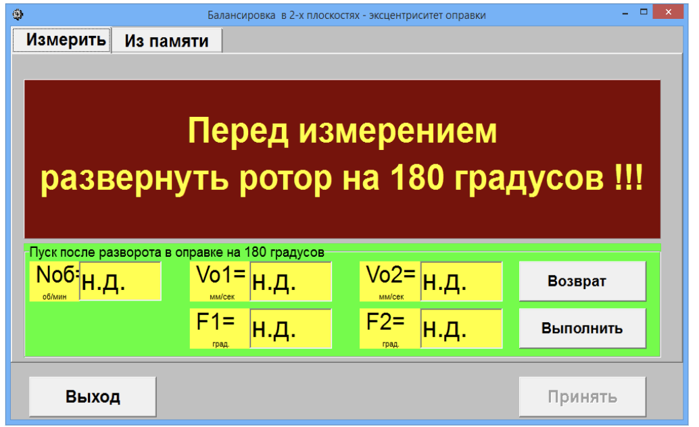
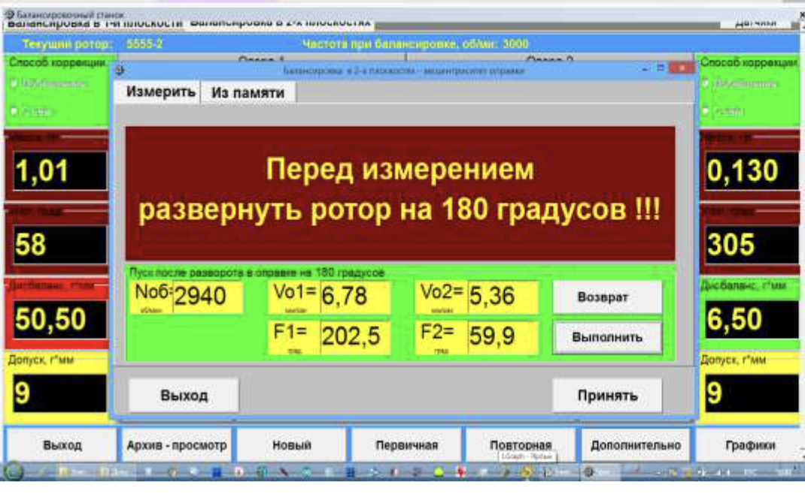
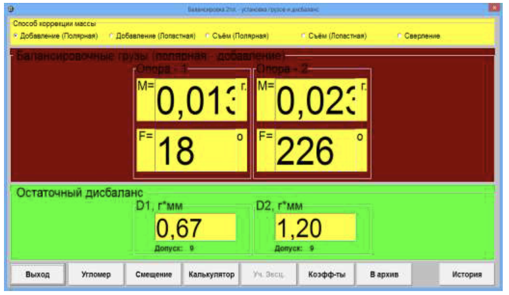
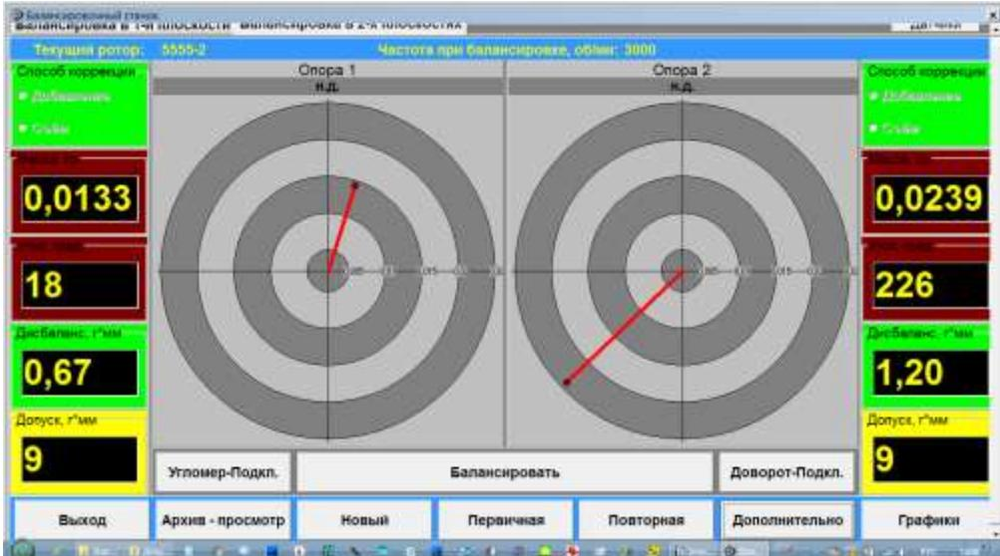

# 7.3.3. Балансировка ротора с компенсацией эксцентриситета оправки

## 7.3.3.1. Первичная балансировка с компенсацией эксцентриситета оправки

При выполнении первичной балансировки с учётом эксцентриситета оправки выполняется стандартная процедура первичной балансировки, подробно рассмотренная в разделе 7.3.1. По завершении этой процедуры на дисплее компьютера выводится рабочее окно с результатами расчёта параметров корректирующих грузов (см. рис. 7.20).

Рис. 7.20. Рабочее окно вывода результатов расчета параметров корректирующих грузов

Для начала компенсации эксцентриситета оправки, который может приводить к дополнительному дисбалансу ротора, в данном рабочем окне необходимо нажать кнопку **«F7-Уч.Эксц.»**. После нажатия появляется новое рабочее окно (см. рис. 7.21), в котором выполняются дополнительные измерения, необходимые для учета эксцентриситета оправки.

В этом окне необходимо:
- Развернуть балансируемый ротор относительно оправки, на которой он установлен, на 180°.
- Нажать кнопку **«Измерить»**, расположенную в левом верхнем углу рабочего окна.
- Включить вращение балансируемого ротора.
- Нажать кнопку **«Выполнить»** для измерения вибрации (силы) на опорах станка.

После завершения измерений в блоках данных этого окна выводятся результаты измерений частоты вращения ротора (**Nоб**), а также значения СКЗ (**Vо1, Vо2**) и фаз (**F1, F2**) вибрации (силы), проявляющиеся на частоте вращения балансируемого ротора (см. рис. 7.22).

Рис. 7.21. Рабочее окно для учёта эксцентриситета оправки

Рис. 7.22. Рабочее окно с результатом измерения параметров вибрации после разворота ротора на 180°

Для продолжения работы в этом окне нажмите кнопку **«Принять»**. После этого на дисплее компьютера появляется новое рабочее окно с параметрами корректирующих грузов, определёнными с учётом эксцентриситета оправки (см. рис. 7.23).

Рис. 7.23. Рабочее окно вывода результатов расчета параметров корректирующих грузов с учётом эксцентриситета оправки

При необходимости проведения повторных балансировок роторов данного типа в рабочем окне (см. рис. 7.23) следует нажать кнопку **«Коэффициенты»** для сохранения указанных коэффициентов в памяти компьютера. Для выхода из данного окна нажмите кнопку **«Выход»**. После этого на дисплее компьютера вновь появляется главное рабочее окно (см. рис. 7.24) с панорамными индикаторами, на которых отображаются векторы, характеризующие параметры корректирующих грузов, рассчитанные с учетом эксцентриситета оправки.

Рис. 7.24. Главное рабочее окно с параметрами корректирующих грузов, отображённых на панорамных индикаторах

## 7.3.3.2. Продолжение балансировки однотипных роторов с учётом эксцентриситета оправки

Для балансировки нового однотипного ротора необходимо установить его на оправке станка, после чего в главном рабочем окне следует нажать кнопку **«Новый»** для обнуления данных, полученных при предыдущей балансировке. После этого можно включить вращение изделия, нажать кнопку **«Балансировка»** и выполнить балансировку нового ротора. При этом поправки, определённые на стадии настройки (см. раздел 7.3.3.1) и учитывающие эксцентриситет оправки, будут применяться автоматически.