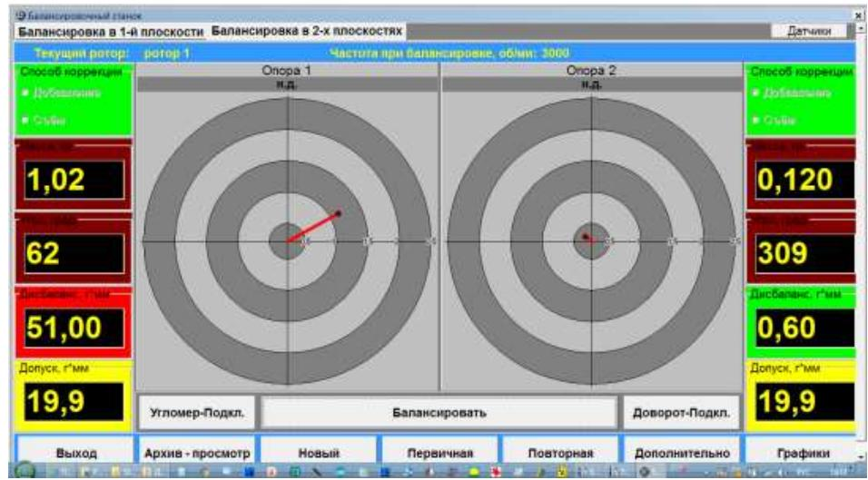

# 7.3.4. Индикация угла поворота ротора в режиме повторной балансировки

В случае, когда балансировочный станок оснащён системой измерения угла поворота ротора, определение мест установки корректирующих грузов при проведении повторной балансировки может выполняться с использованием показаний этой системы.

Работа в данном режиме начинается из рабочего окна (см. рис. 7.24), в котором выводится цифровая и графическая информация о массах и углах установки корректирующих грузов.

Рис. 7.24. Рабочее окно с результатами расчёта корректирующих грузов

Для подключения системы измерения угла в этом окне необходимо нажать кнопку **«Угломер-подкл.»**, с помощью которой включается система измерения угла поворота ротора.

### Внимание!

**Перед началом работы в этом окне необходимо развернуть ротор в положение, при котором метка на роторе совмещается с предполагаемой зоной обработки (плоскостью, в которой выполняется установка или съём корректирующих грузов).**

При этом в рабочем окне с результатами расчёта корректирующих грузов (см. рис. 7.25) на круговых диаграммах, помимо векторов, соответствующих положению корректирующих грузов на роторе (векторы красного цвета), появляются векторы синего цвета, указывающие, что метка на роторе совмещена с зоной обработки (то есть ротор находится в исходном положении).

Рис. 7.25. Рабочее окно с результатами расчёта корректирующих грузов и векторами исходного положения ротора

При повороте ротора векторы синего цвета изменяют своё угловое положение на круговых диаграммах. В момент, когда вектор синего цвета совмещается с одним из векторов корректирующих грузов (см. рис. 7.26), балансируемый ротор устанавливается в зоне, где производится съём или установка соответствующего корректирующего груза.

Об этом дополнительно сигнализирует цифровое табло с угловой координатой ротора, которое в момент совмещения векторов изменяет свой цвет с серого на красный.

Рис. 7.26. Рабочее окно с результатами расчёта корректирующих грузов в момент разворота ротора в зону съёма (установки) корректирующего груза в плоскости 1

После завершения процедуры установки (съёма) корректирующих грузов в обеих плоскостях коррекции следует отключить датчик (преобразователь) угла поворота ротора, для чего нажмите кнопку **«Угломер-откл.»**.