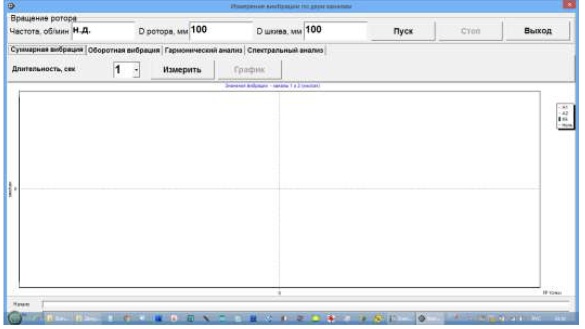
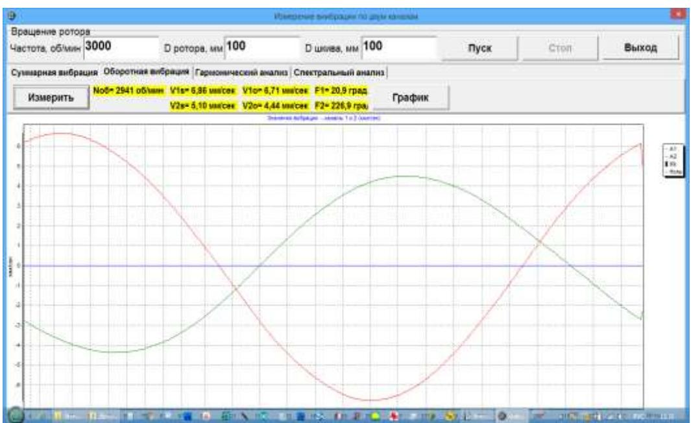
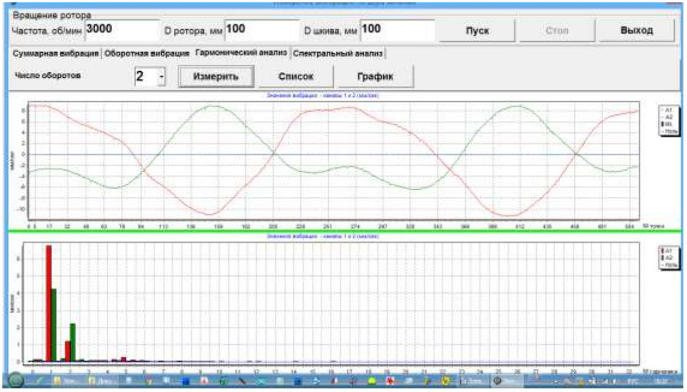
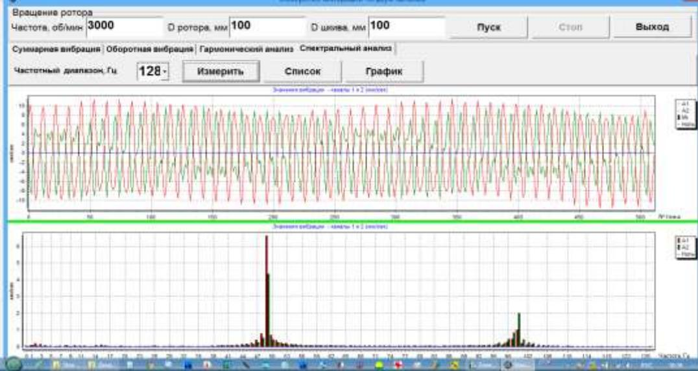

# 7.5. Работа в режиме «Графики»

Работа в режиме **«Графики»** начинается из Главного рабочего окна программы (см. рис. 7.1) при нажатии кнопки «Графики». После этого на дисплее компьютера открывается окно «Измерение вибрации по двум каналам. Графики» (см. рис. 7.27).

Рис. 7.27. Рабочее окно «Измерение вибрации по двум каналам. Графики»

В данном режиме возможно построение четырёх вариантов графиков вибрации:

- **Первый вариант.** Графики временной функции суммарной вибрации (по виброскорости) или графики изменения усилия на опорах по первому и второму измерительным каналам.
- **Второй вариант.** Графики вибрации (силы), проявляющейся на оборотной частоте вращения ротора и её более высоких гармонических составляющих. Эти графики получаются в результате синхронной фильтрации временной функции суммарной вибрации.
- **Третий вариант.** Графики вибрации с результатами гармонического анализа.
- **Четвёртый вариант.** Графики вибрации с результатами спектрального анализа.

---

## 7.5.1. Графики суммарной вибрации

Для построения графиков суммарной вибрации в рабочем окне «Измерение вибрации по двум каналам. Графики» необходимо нажать кнопку **«Суммарная вибрация»**.

После этого задаётся частота вращения ротора (в случае программного управления приводом). Затем в окне (см. рис. 7.27) необходимо задать время измерения. Для этого нажмите кнопку «▼» и выберите из выпадающего списка требуемую длительность измерения, которая может быть равна 1, 5, 10, 15 или 20 секундам.

Далее включите вращение ротора и нажмите кнопку **«Измерить»** для запуска процесса измерения вибрации одновременно по двум каналам.

После завершения измерений на экране появляются графики временной функции суммарной вибрации:
- График по первому измерительному каналу (отображается красным цветом).
- График по второму измерительному каналу (отображается зелёным цветом).

На графиках по оси **Х** откладывается время, а по оси **У** – амплитуда виброскорости в мм/сек (или сила в условных единицах). Вертикальные линии (синего цвета) обозначают отметки оборотов ротора, где каждая метка характеризует начало или завершение очередного оборота.

При необходимости масштаб по оси **Х** можно изменить с помощью движка, расположенного под графиком.

---

## 7.5.2. Графики оборотной вибрации

Для построения графиков оборотной вибрации в рабочем окне «Измерение вибрации по двум каналам. Графики» нажмите кнопку **«Оборотная вибрация»**.

После этого появляется рабочее окно для измерения оборотной вибрации (см. рис. 7.29).

Задайте частоту вращения ротора и нажмите кнопку **«Измерить»** для начала измерения оборотных составляющих вибрации по двум каналам.

Рис. 7.29. Рабочее окно для вывода графиков оборотных составляющих вибрации

После завершения измерений и применения математической обработки (синхронной фильтрации временной функции суммарной вибрации) на экране выводятся графики оборотных составляющих вибрации за один оборот ротора:
- Вибрация по первому каналу отображается красным цветом.
- Вибрация по второму каналу – зелёным цветом.

На графиках по оси **Х** откладывается угол поворота ротора на одном обороте (от метки до метки), а по оси **У** – амплитуда виброскорости в мм/сек.

Кроме того, в верхней части рабочего окна (справа от кнопки **«Измерить»**) выводятся цифровые значения результатов измерений по обоим каналам. Здесь отображаются:
- Величины СКЗ суммарной вибрации (**V1s, V2s**),
- Величины СКЗ (**V1o, V2o**) и фазы (**F1, F2**) первой гармоники оборотной составляющей вибрации,
- Частота вращения ротора (**Nоб**).

---

## 7.5.3. Графики вибрации с результатами гармонического анализа

Чтобы построить графики вибрации с результатами гармонического анализа, в рабочем окне «Измерение вибрации по двум каналам. Графики» нажмите кнопку **«Гармонический анализ»**.

После этого появляется рабочее окно, в котором одновременно выводятся графики временной функции и спектр гармонических составляющих вибрации, период которых равен или кратен частоте вращения ротора (см. рис. 7.30).

#### Внимание!
**При работе в данном режиме обязательно используйте датчик фазового угла, обеспечивающий синхронизацию измерения с частотой вращения ротора.**

Рис. 7.30. Рабочее окно для вывода спектра гармонических составляющих вибрации

В этом окне задаётся частота вращения ротора (при программном управлении приводом) и выбирается число оборотов, на которых проводится измерение. Для этого нажмите кнопку «▼» и выберите требуемый период измерения: 1, 2, 4 или 8 оборотов ротора.

Далее включите вращение ротора и нажмите кнопку **«Измерить»** для начала процесса измерения вибрации одновременно по двум каналам.

После завершения измерения в окне появляются два графика:
- Верхний график – временная функция.
- Нижний график – спектр гармонических составляющих вибрации.

На спектре по оси **Х** откладывается номер гармоники, а по оси **У** – СКЗ виброскорости в мм/сек (или сила в условных единицах). Вибрация по первому каналу отображается красным цветом, по второму – зелёным.

---

## 7.5.4. Графики вибрации с результатами спектрального анализа

Для построения графиков с результатами спектрального анализа в рабочем окне «Измерение вибрации по двум каналам. Графики» нажмите кнопку **«Спектральный анализ»**.

После этого появляется рабочее окно для одновременного вывода графиков временной функции и частотного спектра вибрации (см. рис. 7.31).

Рис. 7.31. Рабочее окно для вывода спектра гармонических составляющих вибрации

В этом окне необходимо задать частоту вращения ротора и выбрать частотный диапазон для измерения. Для выбора диапазона нажмите кнопку «▼» и выберите одно из значений: 64 Гц, 128 Гц, 320 Гц или 640 Гц. Учтите, что:
- Для 64 Гц полоса анализа составляет 0,5 Гц.
- Для 128 Гц – 1 Гц.
- Для 320 Гц – 2,5 Гц.
- Для 640 Гц – 5 Гц.

После этого включите вращение ротора и нажмите кнопку **«Измерить»** для начала измерения вибрации по двум каналам.

После завершения измерения в рабочем окне появляются:
- Верхний график – временная функция.
- Нижний график – частотный спектр вибрации.

На спектре по оси **Х** откладывается частота составляющей вибрации в Гц, а по оси **У** – СКЗ виброскорости в мм/сек (или сила в условных единицах). Вибрация по первому каналу отображается красным цветом, по второму – зелёным.