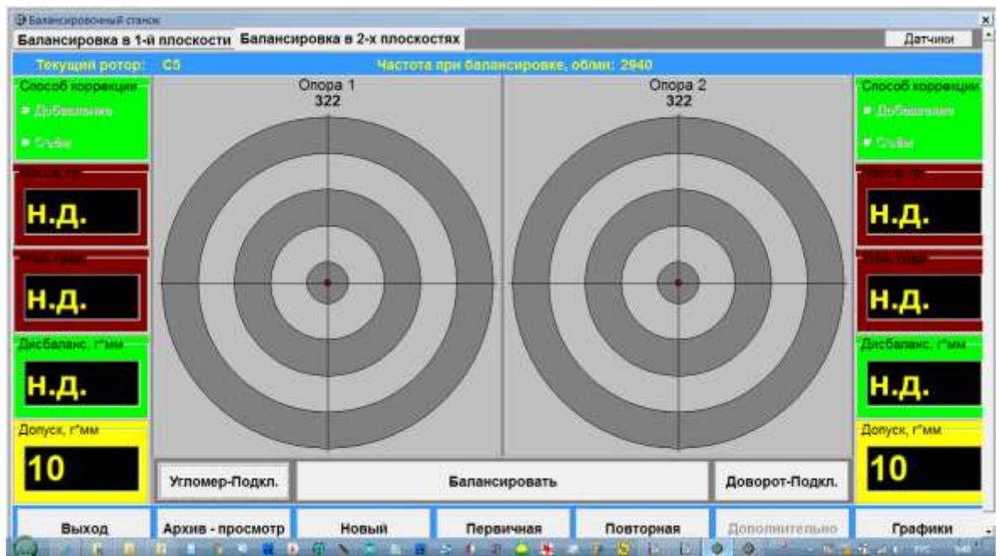

# 7. РАБОТА С ПРИБОРОМ

При запуске программы «Балком-2С КС» на дисплее компьютера появляется стартовая заставка с названием программы и данными её разработчика.

Рис. 7.0. Стартовая заставка программы.

Для начала работы по программе «Балком-2С КС» следует нажать кнопку «Продолжить», после чего на дисплее компьютера появляется Главное рабочее окно программы, представленное на рис. 7.1.

## 7.1. Главное рабочее окно программы. Назначение основных управляющих кнопок.

Рис. 7.1. Главное рабочее окно программы «Балком-2С КС»

Для управления работой программы в указанном окне имеется 13 виртуальных кнопок с названиями реализуемых при их нажатии функций. Для нажатия выбранной кнопки необходимо навести на неё стрелку «мышки» и «щёлкнуть» по ней, нажав левую клавишу мышки. При использовании сенсорного дисплея управление в Главном окне программы может выполняться прямым нажатием на кнопки.

### 7.1.1. Кнопка «Балансировка в 2-х плоскостях».

При нажатии этой кнопки выбирается режим работы, позволяющий проводить динамическую балансировку ротора с установкой корректирующих грузов в двух плоскостях коррекции.

### 7.1.2. Кнопка «Балансировка в 1-й плоскости».

При нажатии этой кнопки выбирается режим работы, позволяющий проводить статическую балансировку ротора с установкой корректирующего груза в первой плоскости коррекции.

### 7.1.3. Кнопка «Датчики».

При нажатии этой кнопки пользователь может войти в раздел «Коэффициенты преобразования» и, при необходимости, провести корректировку коэффициентов преобразования датчиков вибрации, выбрать число циклов усреднения при измерении, ввести параметры датчика угла поворота ротора и выбрать номер COM-порта, используемого для его подключения к измерительному блоку и т.п. Кроме того, в случае программного управления частотой вращения, пользователь может задать максимальную частоту вращения электродвигателя привода станка, соответствующую управляющему напряжению 10 В.

### 7.1.4. Кнопка «Архив -просмотр».

При нажатии этой кнопки осуществляется переход в архив балансировок для просмотра сохранённых ранее результатов.

### 7.1.5. Кнопка «Первичная» (Настройка).

При нажатии этой кнопки включается режим проведения первичной (настроечной) балансировки, позволяющий настроить измерительную систему на балансировку конкретного типа ротора. Первичная балансировка предусматривает проведение трёх настроечных и одного проверочного пуска балансировочного станка. Данные, полученные при проведении первичной балансировки, могут быть сохранены в памяти измерительной системы и впоследствии использованы для балансировки роторов данного типа в режиме повторной балансировки.

### 7.1.6. Кнопка «Повторная».

При нажатии этой кнопки появляется рабочее окно, позволяющее выбрать из архива коэффициенты балансировки, необходимые для настройки измерительной системы перед проведением повторной балансировки.

### 7.1.7. Кнопка «Балансировать».

При нажатии этой кнопки включается режим балансировки роторов известного типа, для которых ранее была проведена настройка измерительной системы. Повторная балансировка предусматривает проведение как минимум одного контрольного и (при необходимости) одного проверочного пуска балансировочного станка. Кроме того, при нажатии этой кнопки в режиме повторной балансировки завершается балансировка одного ротора и осуществляется переход к балансировке следующего ротора, входящего в партию однотипных роторов.

### 7.1.9. Кнопка «Дополнительно».

При нажатии этой кнопки открывается доступ к ряду дополнительных функций, в том числе:
- Функции вывода величин корректирующих масс в единицах глубины сверления (в режиме повторной балансировки);
- Функции вывода величин корректирующих масс при их разложении по лопастям (в режиме повторной балансировки);
- Функции пересчёта масс и углов установки корректирующих грузов в случае изменения плоскостей коррекции на балансируемом роторе;
- Функции учёта эксцентриситета ротора;
- Функции суммирования корректирующих грузов, определяемых при проведении нескольких повторных уточняющих пусков ротора и т.п.

### 7.1.10. Кнопка «Графики».

При нажатии этой кнопки осуществляется переход в рабочее окно «Графики», в котором могут быть получены графики временной функции и спектра вибрационных сигналов, измеренных на опорах балансировочного станка.

### 7.1.11. Кнопка «Угломер- Подкл.».

Эта кнопка используется для подключения датчика угла поворота ротора и вывода на дисплей компьютера вектора его углового положения.

### 7.1.12. Кнопка «Доворот-Подкл.».

Эта кнопка может использоваться для управления работой привода в режиме доворота (установки) ротора в заданное угловое положение.

### 7.1.13. Кнопка «Выход».

При нажатии этой кнопки осуществляется завершение работы по программе «Балком-2С КС».

## 7.2. Ввод или корректировка коэффициентов преобразования датчиков вибрации (силы).

При нажатии в Главном рабочем окне программы кнопки **«Датчики»** на дисплее компьютера появляется рабочее окно «Коэффициенты преобразования» (см. рис. 7.3).

В этом окне проводится ввод или корректировка коэффициентов преобразования датчиков вибрации, осуществляемая в процессе их калибровки. В случае использования датчиков силы в рабочем окне устанавливаются коэффициенты преобразования Кпр1 = 25 мВ/усл. ед. и Кпр2 = 25 мВ/усл. ед.

Для ввода, уточнённых по результатам калибровки, значений коэффициентов преобразования или корректирующих смещений нуля АЦП необходимо навести стрелку «мышки» на соответствующее окошко (**Кпр1** или **Кпр2** или **«Vs1»** или **«Vs2»**), «щёлкнуть» по нему левой клавишей мышки и ввести соответствующее значение.