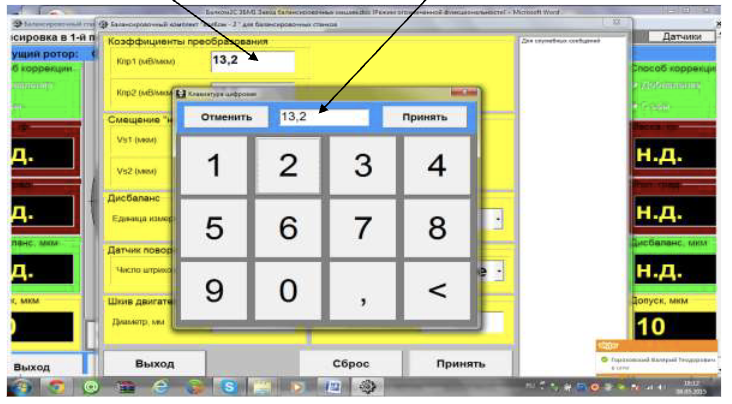
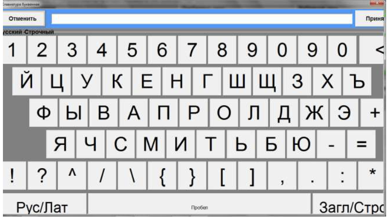
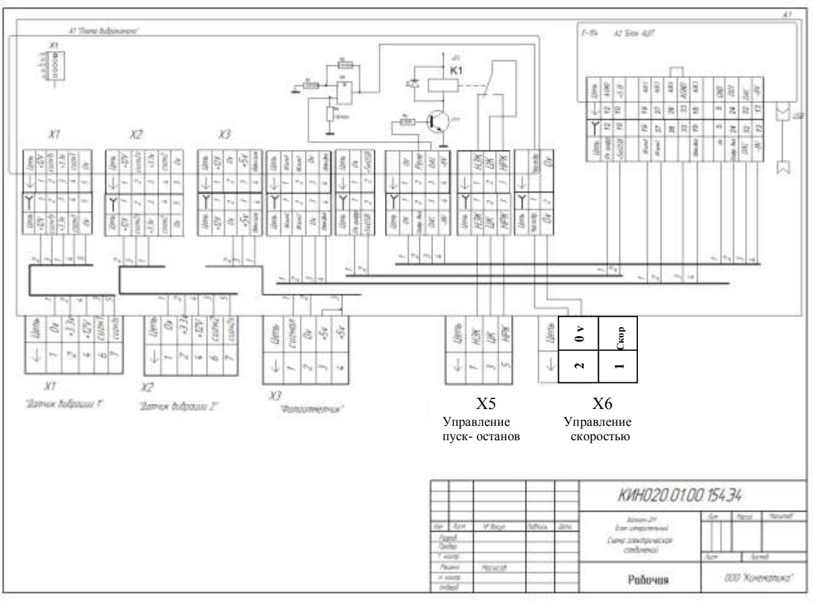

# **ВВОД ЦИФРОВЫХ И ТЕКСТОВЫХ ПАРАМЕТРОВ С ИСПОЛЬЗОВАНИЕМ СЕНСОРНОЙ КЛАВИАТУРЫ**

В процессе работы системы периодически возникает потребность ввода ряда цифровых и текстовых параметров.

В данной версии программного обеспечения их ввод выполняется в режиме сенсорного экрана (touch screen) с использованием виртуальной сенсорной клавиатуры или с помощью «мышки».

 Для ввода цифровых параметров используется вариант цифровой клавиатуры, представленной на рис. П.2.1.

Рис. П.2.1. Пример использования виртуальной цифровой клавиатуры

 Указанная клавиатура появляется после нажатия (касания) в окне ввода, в котором должен вводиться цифровой параметр.

 Она включает в себя ряд цифровых кнопок (от **0** до **9**), две символьных кнопки со знаками **« , »** и **« < »,** а также две управляющие кнопки **«Принять» и «Отменить».**

При нажатии цифровой или символьной кнопки соответствующий знак заносится в строку ввода, расположенную в верхней части клавиатуры.(см. рис. П.2.1).

 Для завершения ввода цифрового параметра на виртуальной клавиатуре необходимо нажать кнопку **«Принять»,** после чего указанный цифровой параметр заносится в окошко ввода.

 В случае ошибочного ввода какой либо цифры или символа необходимо нажать кнопку **«Отменить»,** после чего ошибочно введённый символ стирается в строке ввода.

 Для ввода текстовых параметров используется расширенный вариант виртуальной клавиатуры, содержащий цифры, буквы и ряд управляющих кнопок.

Указанная клавиатура представлена на рис. П.2.2.

 Правила работы с этим вариантом клавиатуры аналогичны тем, которые описаны выше для цифровой виртуальной клавиатуры.

Рис. П.2.2. Пример использования виртуальной сивольной клавиатуры

#### **Схема электрических подключений**

