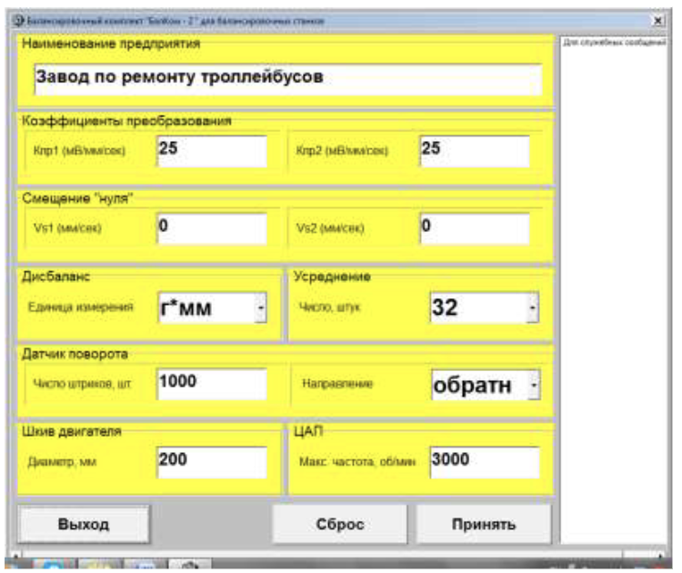

# **Внимание!**

**При вводе коэффициентов их дробная часть отделяется от целой части запятой (знаком « , »).**

 Рис. 7.2. Рабочее окно для ввода коэффициентов преобразования датчиков вибрации. 

В случае ошибочного ввода какого-либо коэффициента преобразования для устранения ошибки необходимо «щёлкнуть мышкой» по кнопке «**Отменить**», после чего можно повторить ввод данного коэффициента.

В случае программного управления частотой вращения ротора в данном окне задаётся **максимальная величина частоты вращения электродвигателя привода**, соответствующая максимальному значению управляющего напряжения на выходе ЦАП измерительного блока (+10 В).

В этом же окне можно выбрать вариант задания единиц измерения остаточного дисбаланса:

**- г\*мм** (остаточный дисбаланс);

- **мкм** (удельный остаточный дисбаланс).

При использовании в составе прибора **импульсного преобразователя угловых перемещений** ротора в соответствующих разделах (окошках) данного рабочего окна необходимо:

- задать **число импульсов**, генерируемых датчиком за 1 оборот;

- выбрать **направление отсчёта преобразователя** (прямое или обратное);

- задать **диаметр шкива**, установленного на вале электродвигателя;

При необходимости в рабочем окне, представленном на рис. 7.2 , можно также задать **число усреднений** при измерении. Количество усреднений выбирается из ряда чисел: **16; 32; 64; 128; 256**.

С ростом числа усреднений повышается точность и стабильность результатов измерения амплитуды и фазы вибрации. Но при этом также следует иметь в виду, что с ростом числа усреднений возрастает время измерения.

В верхней строке данного окна также возможно ввести **наименование предприятия**, на котором эксплуатируется данный балансировочный станок (стенд).

Ввод всех рассмотренных выше цифровых и символьных данных может проводиться с использованием как **обычной (кнопочной),** так и **сенсорной клавиатуры**.

В окне на рис.2 имеется окошко «**Клавиатура**» с выпадающим списком, используемое для выбора типа клавиатуры (кнопочной или сенсорной).

Процедура ввода данных с использованием **сенсорной** клавиатуры подробно рассмотрена в приложении 2.

После завершения ввода коэффициентов преобразования датчиков и задания других параметров необходимо «щёлкнуть мышкой» по кнопке «**Принять**», после чего все новые изменения будут сохранены в памяти программы.

Для продолжения работы по программе необходимо «щёлкнуть мышкой» по кнопке «**Выход**» и вернуться в Главное рабочее окно программы.

