# **1. НАЗНАЧЕНИЕ**

Балансировочный комплект «Балком-2С КС» (далее по тексту «прибор») является портативной измерительно-вычислительной системой, предназначенной для использования в составе дорезонансных и зарезонансных балансировочных станков.

Прибор включает в себя: два датчика вибрации (или два датчика силы), датчик фазового угла, измерительный блок, преобразователь угловых перемещений, а также компьютер (нетбук, ноутбук, моноблок или т.п.).

Датчики вибрации обычно используются в измерительных системах для зарезонансных станков, а датчики силы – для дорезонансных станков.

Весь процесс балансировки, включающий в себя измерение, обработку и вывод на индикацию информации о величине и месте установки корректирующего груза, выполняется в автоматизированном режиме и не требует от пользователя дополнительных навыков и знаний, выходящих за рамки настоящей инструкции.

Результаты всех балансировок сохраняются в Архиве балансировки и при необходимости могут быть распечатаны в виде протоколов.

Кроме того, данный прибор позволяет выводить дисплей графики временной функции и спектра вибрации, что может быть полезным при оценке качества изготовления балансируемого ротора.

 **Внимание! Программная версия, поставляемая с данным прибором, предусматривает возможность использования компьютера, как с обычной кнопочной клавиатурой, так и с сенсорным дисплеем.**

# **2. ТЕХНИЧЕСКИЕ ХАРАКТЕРИСТИКИ**

| 2.1. Диапазон измерения среднего квадратического значения (СКЗ) виброскорости на частоте враще                                                   |                                                                                |
|-----------------------------------------------------------------------------------------------------------------------------------------------------|--------------------------------------------------------------------------------|
| ния ротора, мм/сек                                                                                                                                  | от 0.01 до 50                                                               |
| 2.2. Диапазон измерения среднего квадратического значения (СКЗ) силы, г                                                                          | Уточняется в зависимости от конструкции станка                              |
| 2.2. Частотный диапазон измерения СКЗ виброско рости (силы), Гц                                                                                  | от 5 до 200                                                                    |
| 2.3. Пределы допускаемой абсолютной погрешно сти измерения СКЗ виброскорости на базовой час тоте (80 Гц) и в рабочем диапазоне частот, мм/сек | ±(0.1 + 0.1*Vи), где Vи – измеренное значение СКЗ виброскорости       |
| 2.4. Число плоскостей коррекции при балансировке                                                                                                    | 2                                                                              |
| 2.5. Диапазон измерения частоты вращения, об/мин                                                                                                    | 300 - 30000                                                                 |
| 2.6. Пределы допускаемой абсолютной погрешно сти измерения частоты вращения в рабочем диапа зоне частот, об/мин                               | ±(1 + 0.005*Nи), где Nи – измеренное значение частоты вращения ротора |
| 2.7. Диапазон измерения сдвига фазы вибрации, угловых градусов                                                                                   | от 0 до 360                                                                    |
| 2.8. Пределы допускаемой абсолютной погрешно сти измерения сдвига фазы вибрации, угловых гра дусов                                            | ± 2                                                                            |
| 2.9.Габаритные размеры измерительного блока, мм, не более                                                                                        | 200X160X65                                                                     |
| 2.10. Масса измерительного блока, кг, не более                                                                                                      | 0.9                                                                            |
| 2.11. Габаритные размеры вибропреобразователя, мм, не более                                                                                      | 25X25X20                                                                       |
| 2.12. Масса вибропреобразователя, кг, не более                                                                                                      | 0.04                                                                           |
| 2.13. Габаритные размеры датчика фазового угла, мм, не более                                                                                     | 150X70X40                                                                      |
| 2.14. Масса датчика фазового с кабелем, кг, не бо                                                                                                   |                                                                                |
| лее                                                                                                                                                 | 0.3                                                                            |
| 2.15. Условия эксплуатации:                                                                                                                         |                                                                                |
| ▪ температура окружающего воздуха, °C                                                                                                            | от 1 до 35                                                                     |
| ▪ относительная влажность воздуха при                                                                                                            |                                                                                |
| температуре 25 °C, %                                                                                                                                | до 80                                                                          |
| ▪ атмосферное давление, кПа                                                                                                                      | от 84 до 106.7                                                                 |
| 2.16. Средняя наработка на отказ, час,                                                                                                              |                                                                                |
| не менее                                                                                                                                            | 1000                                                                           |
| 2.17. Средний срок службы, лет, не менее                                                                                                            | 6                                                                              |

*Лист*

# **3. СОСТАВ ИЗДЕЛИЯ И КОМПЛЕКТ ПОСТАВКИ**

Базовый комплект поставки прибора «Балком-2С КС» включает в себя измерительный блок, два датчика вибрации или два датчика силы, датчик фазового угла, датчик угла поворота ротора с интерфейсным модулем, оснастку, необходимую пользователю для выполнения основных измерений, а также флеш-накопитель с программным обеспечением.

Дополнительно (по желанию Заказчика) прибор может быть укомплектован переносным компьютером (нетбуком, ноутбуком или моноблоком)

| Обозначение               | Наименование                                                                                                          | Кол-во | Примечание                              |
|---------------------------|-----------------------------------------------------------------------------------------------------------------------|--------|-----------------------------------------|
| КИН 028.00.00.000      | Блок измерительный                                                                                                    | 1      |                                         |
| DT 2234                   | Тахометр лазерный (датчик фазового уг ла)                                                                       | 1      |                                         |
| AD 1                      | Вибропреобразователь (на базе акселеро метра ADXL335) для зарезонансных балан сировочных станков                | 2      |                                         |
| SD 1                      | Преобразователь силы для дорезонансных балансировочных станков                                                     | 2      | Поставляется по доп. заказу    |
| EIL 580 Baumer            | Преобразователь угловых перемещений                                                                                   | 1      | Поставляется по доп. заказу    |
|                           | Интерфейс-модуль                                                                                                      | 1      | Поставляется по доп. заказу    |
|                           | Компьютер (нетбук или ноутбук или моно блок)                                                                       | 1      | Поставляется по желанию Заказчика |
|                           | Документация                                                                                                          |        |                                         |
| КИН 028.00.00.000 ПиРЭ | Измерительно-вычислительная система для КС». балансировочных станков «Балком 2С Руководство по эксплуатации. | 1      |                                         |
| DT 2234                   | Тахометр лазерный. Этикетка.                                                                                          | 1      |                                         |
| EIL 580 Baumer            | Преобразователь угловых перемещений. Паспорт                                                                       | 1      |                                         |
|                           | Программное обеспечение на флэш накопителе                                                                | 1      |                                         |

#### **3.1. Комплект поставки**

# **4. УСТРОЙСТВО И ПРИНЦИП РАБОТЫ ПРИБОРА**

**4.1**. Фотографии прибора «Балком- 2С КС» представлены на рис. 4.1 и 4.2.

Прибор (см. рис. 4.1) состоит из измерительного блока **1**, двух датчиков вибрации (или датчиков силы) **2** и **3**, датчика фазового угла **4** и компьютера (нетбука, ноутбука, моноблока) **5**.

Корпус измерительного блока прибора выполнен из пластика ABS серого цвета.

На лицевой стенке корпуса (см. рис. 4.2) расположены разъёмы Х1 и Х2 предназначенные для подключения датчиков вибрации (силы) **1** и **2** измерительным каналам прибора, а также разъём Х3, используемый для подключения датчика фазового угла **4**.

Из боковой стенки корпуса выведен кабель с USB-разъёмом Х4, предназначенный для подключения измерительного блока к компьютеру.

По этому кабелю осуществляется обмен информацией между измерительным блоком и компьютером. По нему также обеспечивается подача питания **+5 В** от компьютера к измерительному блоку.

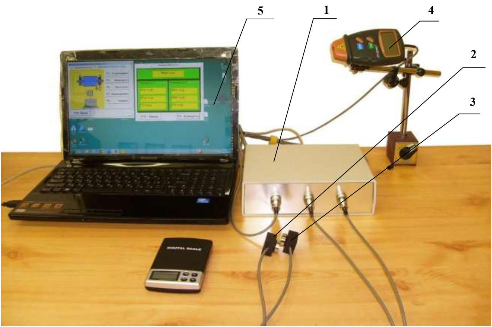

Рис. 4.1. Прибор для балансировки «Балком-2С КС» в комплекте

На задней стенке корпуса по требованию заказчика может устанавливаться разъёмы, используемые для управления приводом станка. В том числе:

- разъём релейного выхода прибора Х5;

- разъём Х6, предназначенный для вывода двух управляющего сигнала по напряжению, который может программно изменяться соответственно в диапазонах от 0 до +10 В.

Указанные сигналы при необходимости могут использоваться, например, для включения вращения привода и задания частоты вращения балансируемого ротора.

Рис. 4.2. Измерительный блок прибора «Балком-2С КС»

**4.2.** Функциональная схема прибора приведена на рис. 4.3.

Прибор включает в себя следующие конструктивные единицы: измерительный блок **1**, датчики вибрации **2** и **3**, датчик фазового угла **4**, портативный компьютер **5**.

Кроме того в состав прибора могут быть включены датчик угла поворота ротора **14** и интерфейс модуль к нему **15**.

Как видно из схемы, в корпусе измерительного блока установлены модуль **6**  АЦП/ЦАП Е-154М**,** к которому подключена плата **7** нормирующих преобразователей сигналов датчиков**.**

На плате **7** собраны основные узлы, обеспечивающие нормирование сигналов с датчиков, в том числе:

- интеграторы **8** и **9** сигналов датчиков вибрации по первому и второму измерительным входам;
- преобразователь **10** сигнала датчика фазового угла;
- преобразователь **11** питания DC-DC +5B/+5B;
- преобразователь **12** питания DC-DC +5B/+12B.

Модуль **6** имеет программируемый выход ЦАП -**13**, позволяющий формировать на разъёме **Х6** управляющее напряжение, которое может изменяться в диапазонах от 0 до +10В. (по доп. заказу), а также цифровой выход, управляющий работой реле, подключённому к разъёму **Х5**.

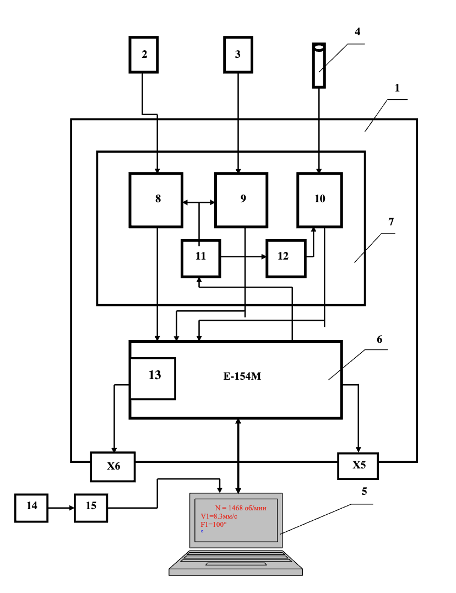

Рис. 4.3. Функциональная схема прибора «Балком-2С КС»

Принцип действия прибора основан на измерении механических колебаний или деформаций, которые имеют место на опорах балансировочного станка.

Для преобразования механических колебаний в электрический сигнал используются датчики вибрации – акселерометры (или датчики силы) **2, 3**. Для определения фазовых характеристик сигнала используется оптический лазерный датчик **4**, работающий на отражение.

Под воздействием механических колебаний на выходе датчика вибрации (силы) формируется электрический аналоговый сигнал пропорциональный виброускорению (или переменной силе), который подается на соответствующий вход измерительного блока **1** прибора.

Далее после преобразования (интегрирования, полосовой фильтрации) видоизмененный сигнал пропорциональный виброскорости поступает на соответствующий аналоговый вход модуля **6** АЦП/ЦАП Е-154М, в котором преобразуется в цифровую форму и запоминается в его оперативном запоминающем устройстве (ОЗУ).

В случае необходимости измерения частоты вращения и/или фазовых характеристик вибрационного сигнала дополнительно используется импульсный сигнал, формируемый датчиком фазового угла, который после нормирования также подается на соответствующий аналоговый вход модуля **6**.

В модуле **6** АЦП/ЦАП Е-154М производится предварительная цифровая обработка и запоминание аналоговых сигналов, поступающих с датчиков. После чего оцифрованные сигналы по шине USB передаются в портативный компьютер **5**, в котором по заданной программе осуществляется дальнейшая обработка цифрового сигнала (фильтрация, интерполяция, Фурье – анализ, вычисление параметров балансировки и т.д.). Полученные результаты (численные значения амплитуды и фазы вибрации или силы, частоты вращения и т.п.) выводятся на дисплей компьютера и запоминаются в соответствующих разделах его памяти.

По результатам измерений в цифровом виде осуществляется решение задачи балансировки, после чего на дисплей компьютера выводятся данные о величине и угле установки корректирующей массы.

Роль пользователя сводится при этом к установке пробных и корректирующих грузов на балансируемом роторе и нажатию по готовности соответствующих клавиш на клавиатуре компьютера (или виртуальных клавиш на дисплее).

Весь процесс балансировки, включающий в себя измерение, обработку сигнала и вычисление результата, выполняется в автоматизированном режиме по программам, находящимся в памяти компьютера.

На задней стенке корпуса измерительного блока по желанию Заказчика может быть установлен разъём ЦАП – **Х6,** на выходе которого может программно задаваться напряжения от 0 до +10В, которое может использоваться для управления работой балансировочного станка.

 Там же может устанавливаться разъём **Х5,** используемый как релейный выход прибора.

 При необходимости в комплект прибора может быть включен импульсный преобразователь (датчик) угла поворота ротора **14** с интерфейсным модулем **15**, позволяющим подключать датчик непосредственно к входу USB компьютера

# **5. УКАЗАНИЯ МЕР БЕЗОПАСНОСТИ**

1. **Внимание!** При работе прибора от сети 220В необходимо соблюдать правила электробезопасности. Не допускается проводить ремонт прибора при его подключении к сети 220 В.

2. В случае эксплуатации прибора в условиях низкого качества сетевого питания и заметных сетевых помех рекомендуется использовать режим автономного питания от аккумуляторов компьютера.

При этом с целью увеличения времени эксплуатации прибора на автономном питании рекомендуется в случае длительных перерывов в его работе переводить компьютер в режим **гибернации (спящий режим)**.

В этом случае вся имеющаяся на момент выключении компьютера информация автоматически сохраняется в его энергонезависимой памяти, что позволяет при повторном запуске продолжить работу прибора с начала прерванного шага программы.

# **6. ПОДГОТОВКА ПРИБОРА К РАБОТЕ**

6.1. Установить датчики вибрации (или силы) **2, 3** на опорах балансировочного станка (стенда).

При необходимости экран кабелей датчиков силы заземлить на корпус станка.

- 6.2. Установить датчик фазового угла **4** на корпусе станка и настроить его согласно требованиям паспорта или рекомендациям, приведённым в приложении 1.
- 6.3. Подключить датчики вибрации (силы) **2** и **3** к разъемам **Х1** и **Х2**, а датчик фазового угла **4** к разъему **Х3** измерительного блока.
- 6.4. Подключить управляемый привод станка к разъёмам **Х5 и Х6** (При использовании релейного выхода и выхода ЦАП для управления приводом балансировочного станка).
- 6.5. Подключить измерительный блок (разъём **Х4**) к USB-входу компьютера.
- 6.6. Подключить преобразователь угловых перемещений **14** к интерфейсному модулю **15,** который, в свою очередь, подключить в USB входу компьютера.
- 6.7. При использовании сетевого питания подключить компьютер к блоку сетевого питания. Подключить блок питания к сети 220 В, 50 Гц.

# **7. РАБОТА С ПРИБОРОМ**

При запуске программы «Балком-2С КС» на дисплее компьютера появляется стартовая заставка с названием программы и данными её разработчика.

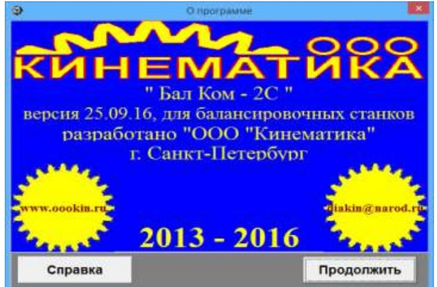

Рис. 7.0. Стартовая заставка программы.

Для начала работы по программе «Балком-2С КС» следует нажать кнопку «Продолжить», после чего на дисплее компьютера появляется Главное рабочее окно программы, представленное на рис. 7.1.

## **7.1. Главное рабочее окно программы. Назначение основных управляющих кнопок.**

Рис. 7.1. Главное рабочее окно программы «Балком-2С КС»

Для управления работой программы в указанном окне имеется 13 виртуальных кнопок, на которых нанесены названия реализуемых при их нажатии функций.

Для нажатия выбранной кнопки необходимо навести на неё стрелку «мышки» и «щёлкнуть» по ней, нажав левую клавишу «мышки».

При использовании сенсорного дисплея управление работой в Главном окне программы может выполняться прямым нажатием на кнопки.

## **7.1.1.** Кнопка **«Балансировка в 2-х плоскостях».**

При нажатии этой кнопки выбирается режим работы, позволяющий проводить динамическую балансировку ротора с установкой корректирующих в 2-х плоскостях коррекции.

## **7.1.2.** Кнопка **«Балансировка в 1-й плоскости».**

При нажатии этой кнопки выбирается режим работы, позволяющий проводить статическую балансировку ротора с установкой корректирующего груза в 1-й плоскости коррекции.

## **7.1.3**. Кнопка **«Датчики».**

При нажатии этой кнопки пользователь может войти в «Коэффициенты преобразования» и, при необходимости, провести корректировку коэффициентов преобразования датчиков вибрации, выбрать число циклов усреднения при измерении, ввести параметры датчика угла поворота ротора и выбрать номер COM-порта, используемого для его подключения к измерительному блоку и т.п.

Кроме того, в случае программного управления частотой вращения, пользователь может задать максимальную частоту вращения электродвигателя привода станка, соответствующую управляющему напряжению 10 В.

## **7.1.4**. Кнопка **«Архив -просмотр».**

При нажатии этой кнопки осуществляется переход в Архив балансировок для просмотра сохранённых ранее результатов

## **7.1.5**. Кнопка **«Первичная» (Настройка).**

При нажатии этой кнопки включается режим проведения первичной (настроечной) балансировки, позволяющий настроить измерительную систему на балансировку конкретного типа ротора.

Первичная балансировка предусматривает проведение 3-х настроечных и одного проверочного пуска балансировочного станка.

Данные, полученные при проведении первичной балансировки, могут быть сохранены в памяти измерительной системы и в дальнейшем использованы для балансировки роторов данного типа в режиме повторной балансировки..

## **7.1.6**. Кнопка **«Повторная».**

При нажатии этой кнопки появляется рабочее окно, позволяющее выбрать из архива коэффициенты балансировки, необходимые для настройки измерительной системы перед проведением повторной балансировки.

## **7.1.7**. Кнопка **«Балансировать»**

При нажатии этой кнопки включается режим балансировки роторов известного типа, для которых ранее была проведена настройка измерительной системы.

 Повторная балансировка предусматривает проведение как минимум одного контрольного и (при необходимости) одного проверочного пуска балансировочного станка.

При нажатии этой кнопки в режиме повторной балансировки завершается балансировка одного ротора и осуществляется переход к балансировке следующего ротора, входящего в партию однотипных роторов.

## **7.1.9**. Кнопка **«Дополнительно».**

При нажатии этой кнопки открывается доступ к ряду дополнительных функций, в том числе:

- функции вывода величин корректирующих масс в единицах глубины сверления (в режиме повторной балансировки);
- функции вывода величин корректирующих масс при их разложении по лопастям (в режиме повторной балансировки);
- функции пересчёта масс и углов установки корректирующих грузов в случае изменения плоскостей коррекции на балансируемом роторе;
- функции учёта эксцентриситета ротора;
- функции суммирования корректирующих грузов, определяемых при проведении нескольких повторных уточняющих пусков ротора и т.п.

## **7.1.10**. Кнопка **«Графики».**

При нажатии этой кнопки осуществляется переход в рабочее окно «Графики», в котором могут быть получены графики временной функции и спектра вибрационных сигналов, измеренных на опорах балансировочного станка.

## **7.1.11**. Кнопка **«Угломер- Подкл.».**

Кнопка используется для подключения датчика угла поворота ротора и вывода на дисплей компьютера вектора его углового положения.

## **7.1.12**. Кнопка **«Доворот-Подкл.».**

Указанная кнопка может использоваться для управления работой привода в режиме доворота (установки) ротора в заданное угловое положение.

## **7.1.13**. Кнопка **«Выход».**

При нажатии этой кнопки осуществляется завершение работы по программе «Балком-2С КС».

## **7.2. Ввод или корректировка коэффициентов преобразования датчиков вибрации (силы).**

При нажатии в Главном рабочем окне программы кнопки **«Датчики»** на дисплее компьютера появляется рабочее окно «Коэффициенты преобразования» (см. рис. 7.3).

В этом окне проводится ввод или корректировка коэффициентов преобразования датчиков вибрации, которая производится в процессе проведения их калибровки.

В случае использования датчиков силы в рабочем окне устанавливаются коэффициенты преобразования Кпр1=25 мВ/усл. ед. и Кпр2=25 мВ/усл. ед.

Для ввода, уточнённых по результатам калибровки, значений коэффициентов преобразования датчиков или значений корректирующих смещений нуля АЦП необходимо навести стрелку «мышки» на соответствующее окошко («**Кпр1**» или «**Кпр2»** или **«Vs1»** или **«Vs2»)** рабочего окна, «щёлкнуть» по нему левой клавишей «мышки» и ввести соответствующее значение коэффициента преобразования датчика вибрации.

# **Внимание!**

**При вводе коэффициентов их дробная часть отделяется от целой части запятой (знаком « , »).**

 Рис. 7.2. Рабочее окно для ввода коэффициентов преобразования датчиков вибрации. 

В случае ошибочного ввода какого-либо коэффициента преобразования для устранения ошибки необходимо «щёлкнуть мышкой» по кнопке «**Отменить**», после чего можно повторить ввод данного коэффициента.

В случае программного управления частотой вращения ротора в данном окне задаётся **максимальная величина частоты вращения электродвигателя привода**, соответствующая максимальному значению управляющего напряжения на выходе ЦАП измерительного блока (+10 В).

В этом же окне можно выбрать вариант задания единиц измерения остаточного дисбаланса:

**- г\*мм** (остаточный дисбаланс);

- **мкм** (удельный остаточный дисбаланс).

При использовании в составе прибора **импульсного преобразователя угловых перемещений** ротора в соответствующих разделах (окошках) данного рабочего окна необходимо:

- задать **число импульсов**, генерируемых датчиком за 1 оборот;

- выбрать **направление отсчёта преобразователя** (прямое или обратное);

- задать **диаметр шкива**, установленного на вале электродвигателя;

При необходимости в рабочем окне, представленном на рис. 7.2 , можно также задать **число усреднений** при измерении. Количество усреднений выбирается из ряда чисел: **16; 32; 64; 128; 256**.

С ростом числа усреднений повышается точность и стабильность результатов измерения амплитуды и фазы вибрации. Но при этом также следует иметь в виду, что с ростом числа усреднений возрастает время измерения.

В верхней строке данного окна также возможно ввести **наименование предприятия**, на котором эксплуатируется данный балансировочный станок (стенд).

Ввод всех рассмотренных выше цифровых и символьных данных может проводиться с использованием как **обычной (кнопочной),** так и **сенсорной клавиатуры**.

В окне на рис.2 имеется окошко «**Клавиатура**» с выпадающим списком, используемое для выбора типа клавиатуры (кнопочной или сенсорной).

Процедура ввода данных с использованием **сенсорной** клавиатуры подробно рассмотрена в приложении 2.

После завершения ввода коэффициентов преобразования датчиков и задания других параметров необходимо «щёлкнуть мышкой» по кнопке «**Принять**», после чего все новые изменения будут сохранены в памяти программы.

Для продолжения работы по программе необходимо «щёлкнуть мышкой» по кнопке «**Выход**» и вернуться в Главное рабочее окно программы.

# **7.3. Балансировка ротора в двух плоскостях (динамическая).**

Перед началом работы в режиме «**Балансировка в двух плоскостях**» необходимо предварительно провести настройку оптического датчика фазового угла.

Для этого на доступную поверхность балансируемого ротора необходимо нанести специальную метку, имеющую отражающую способность, контрастную по отношению к отражающей способности поверхности ротора.

Подробные требования по выбору места установки датчиков, их креплению и настройке изложены в приложении 1.

Работа по программе в режиме " **Балансировка в двух плоскостях**" начинается из Главного рабочего окна программы (см. рис. 7.1), в котором выбирается один из двух возможных вариантов работы:

а) Первичная (настроечная) балансировка ротора;

б) Повторная балансировка ротора.

Первичная балансировка обычно выполняется для роторов, которые ранее на данном станке не балансировались и для которых в архивной памяти компьютера отсутствует информация, необходимая для проведения повторной балансировки (в том числе: численные значения коэффициентов балансировки, частоты вращения ротора, массы пробных грузов и др.).

При выполнении первичной балансировки в 2-х плоскостях, требуется проведение трёх пусков ротора, необходимых для настройки (тарировки) измерительной системы балансировочного станка на конкретный тип ротора.

При этом во время первого пуска определяется исходная вибрация (сила) на опорах станка.

Второй пуск ротора и измерение вибрации (силы) на опорах станка выполняется после установки на балансируемый ротор пробного груза в первой плоскости коррекции.

Третий пуск ротора и измерение вибрации (силы) на опорах станка выполняется после установки на балансируемый ротор пробного груза во второй плоскости коррекции.

Повторная балансировка может выполняться только для ранее отбалансированного ротора, для которого определены и занесены в память прибора массы и радиусы установки пробных грузов, частота вращения, коэффициенты балансировки и ряд других параметров.

В этом случае для определения масс и мест установки корректирующих грузов, необходимых для компенсации дисбаланса, требуется всего один пуск ротора.

# **7.3.1. Первичная балансировка ротора.**

Первичная (настроечная) балансировка ротора начинает выполняться при нажатии кнопки **«Первичная**» в Главном рабочем окне программы (см. рис. 7.1).

 При этом на дисплей компьютера выводится рабочее окно **«Балансировка в двух плоскостях. Исходные данные»** (см. рис. 7.3), в котором вводятся исходные данные, необходимые для настройки измерительной системы балансировочного станка под конкретный ротор.

Рис. 7.3. Рабочее окно для ввода исходных данных при балансировке ротора в двух плоскостях.

## **7.3.1.1. Ввод исходных данных.**

*Изм. Лист № докум. Подпись Дата*

Ввод исходных данных для проведения первичной балансировки начинается с ввода в разделе **«Масса ротора»** массы балансируемого ротора в килограммах.

Далее в разделе «**Масса пробного груза**» выполняется ввод масс пробных грузов в граммах, которые будут устанавливаться на роторе в первой **(«Пл.1»)** и второй **(«Пл.2»)** плоскостях коррекции.

Далее в разделе **«Способ коррекции»** выбирается способ компенсации дисбаланса.

В данном разделе предлагается два возможных варианта корекции:

а) «**Добавление»** корректирующих грузов;

*Инв. № подл.*

б) **«Съём»** (удаление) корректирующих грузов.

Для этого необходимо с помощью мышки поставить метку рядом с соответствующей надписью.

В варианте съёма корректирующих грузов возможно их отображение в единицах глубины сверления.

Для этого после выбора варианта «Съём» следует дополнительно нажать кнопку «**Сверление**», после чего появляется рабочее окно для ввода необходимых исходных данных (см. рис. 7.4).

Рис. 7.4. Рабочее окно для ввода исходных данных, необходимых для вывода масс корректирующих грузов в единицах глубины сверления (мм).

После ввода всех запрашиваемых данных в указанном окне следует с помощью «мышки» нажать кнопку **«Принять»** и вернуться в предыдущее рабочее «Балансировка в 2-х плоскостях. Исходные данные» (см. рис. 7.3).

В случае ошибочного ввода какого-либо параметра следует нажать кнопку **«Отменить»** и повторить ввод исходных данных.

#### **ВНИМАНИЕ!**

*Изм. Лист № докум. Подпись Дата*

**При вводе исходных данных их дробная часть отделяется от целой части запятой (знаком « , »).**

 После этого в следующем разделе «**Вращение**» (см. рис. 7.3) необходимо ввести частоту вращения ротора, на которой должна проводиться его балансировка, в оборотах в минуту.

Далее в разделе «**Система координат**» (см. рис. 7.3) следует выбрать один из возможных вариантов размещения корректирующих грузов на балансируемом роторе – в «**Полярной**» или «**Лопастной**» системе координат. Для этого необходимо с помощью мышки поставить метку рядом с соответствующей надписью.

В случае выбора варианта размещения грузов по лопастям рабочего колеса балансируемой машины необходимо ввести число лопастей ротора в соответствующем окошке, расположенном рядом с надписью «**Лопастная**».

В следующем разделе данного рабочего окна (см. рис. 7.3), необходимо ввести радиусы установки пробного груза соответственно в первой и второй плоскостях коррекции, что позволяет рассчитывать величину остаточного дисбаланса ротора в «**г \* мм**».

Далее следует заполнить раздел рабочего окна «**Допуск на дисбаланс, г\*мм**», введя допуски на величину остаточного дисбаланса, установленные для балансируемого ротора в технической документации.

Если допуск в технической документации отсутствует, то его можно рассчитать с учётом требований ГОСТ ИСО 1940-1-2007.

Для этого в разделе рабочего окна «**Допуск на дисбаланс, г\*мм**» (см. рис. 7.3) следует нажать кнопку **«Расчёт».**

При этом на дисплее компьютера появится таблица (см. рис.7.5.а) с перечнем типов различных механизмов, для роторов которых по ГОСТ ИСО 1940-1-2007 рекомендованы соответствующие классы остаточного дисбаланса.

Рис.7.5.а. Рабочее окно для выбора класса балансировки машин по ИСО 1940-1-2007.

 В этом окне в разделе **«Рабочая частота вращения» (**см. окошко ввода в левом верхнем углу) следует ввести эксплуатационную частоту вращения ротора в оборотах в минуту.

Далее в таблице на рис. 7.5.а следует выбрать класс точности балансировки ротора (от G0.4 до G4000), для чего следует поставить метку в соответствующей строке таблицы (например, в строке G2.5) и нажать кнопку «**Принять**».

После чего данные с расчетными значениями допусков на остаточный дисбаланс в г\*мм будут занесены в соответствующем разделе рабочего окна **«Балансировка в двух плоскостях. Исходные данные»** (см. рис. 7.3)

При необходимости выхода из рабочего окна на рис. 7.5.а без выполнения расчёта допуска следует нажать кнопку «**Отменить**».

После задания допусков в соответствующее окошко рабочего окна, представленного на рис. 7.3, следует ввести о диаметр балансируемого ротора (или его шкива), используемый для расчёта передаточного отношения ременной передачи привода станка (стенда).

В случае, когда ременная передача в станке отсутствует и привод вращения ротора выполняется напрямую от электродвигателя, диаметр ротора условно принимается равным диаметру воображаемого шкива привода.

После завершения ввода всех исходных данных следует «щёлкнуть мышкой» по кнопке **«Продолжить»,** после чего на дисплее компьютера появится рабочее окно (см. рис. 7.6), используемое для выполнения полного цикла измерений при первичной балансировке.

### **7.3.1.2. Измерения при проведении первичной балансировки.**

При проведении балансировки в двух плоскостях в режиме «**Первичная балансировка**» требуется, как уже отмечалось выше, проведение трёх настроечных пусков и, как минимум, одного проверочного пуска балансируемого ротора.

Измерение вибрации (силы) на опорах станка при первом пуске ротора выполняется в рабочем окне «**Балансировка в 2-х плоскостях**» (см. рис. 7.6) в разделе **«Пуск без груза**

На готовность программы к работе в данном разделе указывает темно-зеленый цвет фона раздела и подсветка кнопок **«Возврат»** и **«Измерить»,** которые расположены в правой части данной таблицы.

Кнопка **«Возврат»** может использоваться для возврата к предыдущему шагу программы.

#### **ВНИМАНИЕ!**

**Перед началом измерения (если не предусмотрено программное управление процессом пуска и останова станка) необходимо включить вращение балансируемого ротора (первый пуск).**

Для начала измерений в разделе **«Пуск без груза»** необходимо «щёлкнуть мышкой» по кнопке **«Измерить»,** после чего в окне «**Измерения Nоб, Vs, Vo, F**» (см. рис. 7.7) начинают выполняться циклические замеры частоты вращения и вибрации ротора в режиме «Мониторинг».

Если измеренное значение частоты вращения отличается не более чем на ±10% от заданного значения, то фон окна на рис. 7.7 окрашен в зелёный цвет.

Это указывает на возможность выполнения замера вибрации в рабочем режиме балансировки.

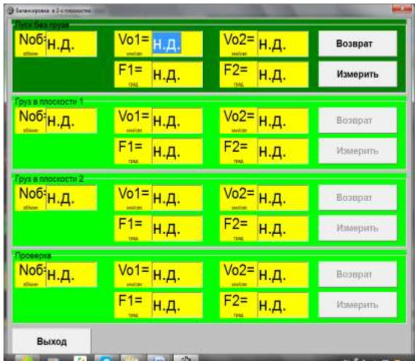

Рис. 7.6. Рабочее окно, используемое для измерений при первичной балансировке в двух плоскостях.

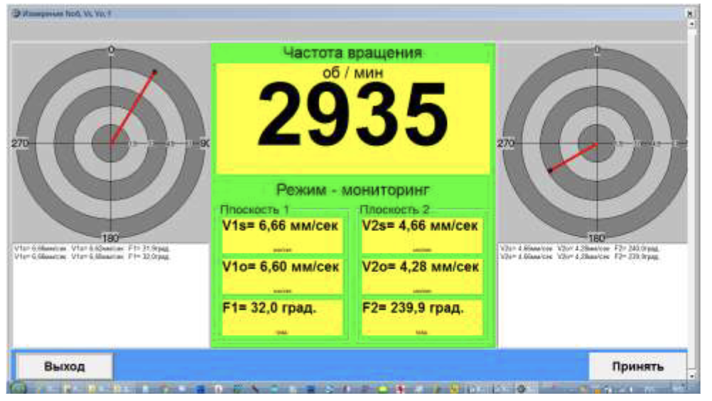

 Рис. 7.7. Рабочее окно, используемое для измерения вибрации в режимах «мониторинг» и «рабочий замер»

При этом для перехода в режим **«Рабочий замер»** в рабочем окне, представленном на рис 7.7, следует нажать кнопку **«Принять».** После этого в нем загорается крас-

ный транспарант «**Режим – Рабочий замер**», указывающий что проводится измерение вибрации, используемое при расчете параметров балансировки.

Если же измеренное значение частоты вращения ротора не укладывается в допуск, то фон рабочего окна имеет, соответственно, либо синий цвет (ниже допуска), либо красный цвет (выше допуска).

Это указывает на то, что дальнейшая работа по программе невозможна пока не будет проведена дополнительная настройка частоты вращения ротора до момента её совпадения с допуском.

Время выполнения измерения вибрации (силы) на опорах станка в зависимости от частоты вращения ротора может длиться от 4 до 15 секунд.

При успешном выполнении процесса измерений в соответствующих окошках раздела «**Пуск без груза**» появляются результаты измерения частоты вращения ротора (**Nоб**), а также значения величин СКЗ (**Vо1, Vо2**) и фаз (**F1, F2**) вибрации (силы), проявляющиеся на частоте вращения баланcируемого ротора.

После завершения замера на первом пуске изменяется цвет фона раздела **«Груз в плоскости 1» (**с салатного на темно-зеленый) и включается подсветка кнопок **«Возврат» и «Измерить»**, что указывает на готовность прибора к работе на втором пуске (см. рис. 7.8).

Рис. 7.8. Рабочее окно, используемое для измерения на втором шаге балансировки при установке пробного груза в плоскости 1.

Перед началом измерения параметров вибрации (силы) в разделе **«Груз в плоскости 1»**, следует остановить вращение балансируемого ротора и установить на нём в первой плоскости пробный груз.

Масса этого груза уже задана при подготовке к измерениям в память прибора в рабочем окне **«Балансировка в двух плоскостях. Исходные данные»** (см. рис. 7.3).

После этого необходимо вновь включить вращение ротора и убедиться, что она вышла на рабочий режим.

### **ВНИМАНИЕ!**

**1. Вопрос о выборе массы пробного груза рассмотрен в приложении 1.**

**2. При необходимости использования в дальнейшей работе режима «Повторной балансировки» место установки пробного груза должно обязательно совпадать с плоскостью установки метки, используемой для отсчета фазового угла.**

Для проведения измерения параметров вибрации (силы) в разделе **«Груз в плоскости 1»** необходимо «щёлкнуть мышкой» по кнопке **«Измерить».**

После этого в окне «**Измерения Nоб, Vs, Vo, F**» (см. рис. 7.7) начинает выполняться замер частоты вращения и вибрации (силы) на втором пуске.

После завершения замера на втором пуске в соответствующих окошках раздела «**Груз в плоскости 1**» появляются результаты измерения частоты вращения ротора (**Nоб**), а также значения величин СКЗ (**Vо1, Vо2**) и фаз (**F1, F2**) вибрации (силы), проявляющиеся на частоте вращения баланcируемого ротора.

Перед началом измерения параметров вибрации в разделе **«Груз в плоскости 2»**, следует остановить вращение ротора балансируемой машины, **снять пробный груз в плоскости 1** и установить на пробный груз в плоскости 2.

Масса этого груза задана при подготовке к измерениям в рабочем окне **«Балансировка в двух плоскостях. Исходные данные»** (см. рис. 7.3).

После этого необходимо вновь включить вращение ротора балансируемой машины и убедиться, что она вышла на рабочий режим.

Для проведения измерения параметров вибрации (силы) в разделе **«Груз в плоскости 2»** необходимо «щёлкнуть мышкой» по кнопке **«Измерить».** После этого начинает выполняться замер частоты вращения и вибрации (силы) на третьем пуске.

После завершения замера на третьем пуске в соответствующих окошках раздела «**Груз в плоскости 2**» появляются результаты измерения частоты вращения ротора (**Nоб**), а также значения величин СКЗ (**Vо1, Vо2**) и фаз (**F1, F2**) вибрации, (силы), проявляющиеся на частоте вращения баланcируемого ротора.

Одновременно поверх рабочего окна «**Балансировка в 2-х плоскостях**» появляется рабочее окно **«Установка грузов и дисбаланс»**, в котором выводятся результаты расчёта параметров корректирующих грузов.

Указанные грузы необходимо установить на роторе в первой и второй плоскостях для компенсации его дисбаланса.

Причём, в случае использования полярной системы координат на дисплей выводятся значения масс (**М1, М2**) и углов установки (**f1, f2**) корректирующих грузов, как это показано на рис.7.9.а.

В случае разложения корректирующих грузов по лопастям на дисплей (см. рис. 7.9.б) для каждой плоскости коррекции выводятся номера лопастей (**Z1i, Z1j** и **Z2i, Z2j**) балансируемого ротора, а также массы грузов, которые необходимо на этих лопастях установить.

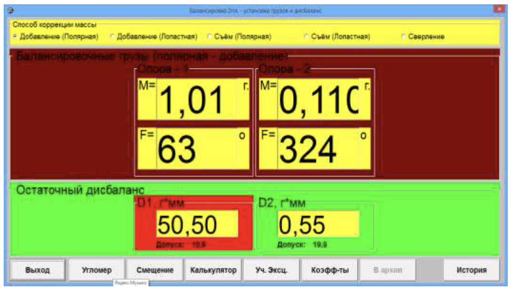

Рис. 7.9.а. Рабочее окно вывода результатов расчета параметров корректирующих грузов.

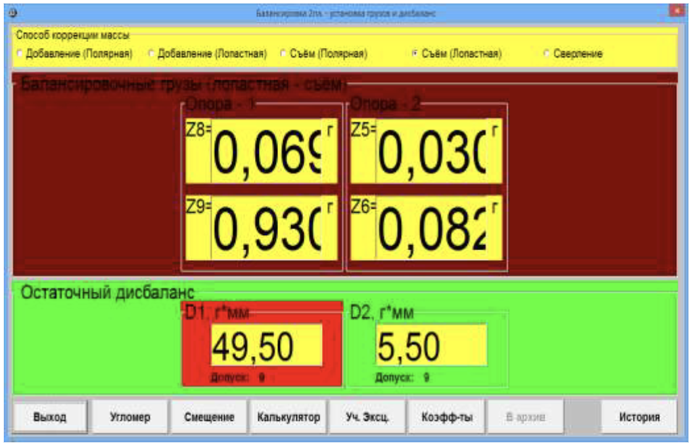
Рис. 7.9.б. Рабочее окно вывода результатов расчета параметров 
корректирующих грузов, разложенных по лопастям.

В случае вывода величин корректирующих грузов в единицах глубины сверления (см. рис. 7.9.в) для каждой плоскости коррекции выводятся глубина отверстия **Н** в мм,

*Инв. № подл.*

количество высверливаемых отверстий **N**, а также угловое положение отверстий **f** на роторе относительно метки в угловых градусах.

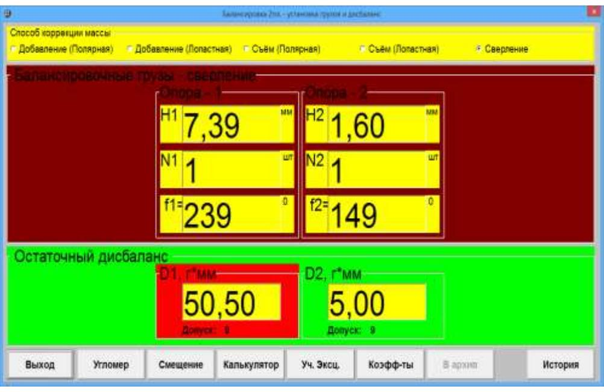

Рис. 7.9.в. Рабочее окно вывода результатов расчета параметров корректирующих грузов в единицах глубины сверления.

#### **ВНИМАНИЕ!**

- **1. После появления на дисплее компьютера рабочего окна «Установка грузов и дисбаланс» (рис. 7.9) необходимо остановить вращение ротора и снять с него установленный ранее пробный груз. Только после этого можно приступать к установке (или съему) на роторе корректирующих грузов.**
- **2. Отсчет углового положения места добавления (удаления) на роторе корректирующего груза в полярной системе координат выполняется от места установки пробного груза. Направление отсчета угла совпадает с направлением вращения ротора.**
- **3. В случае балансировки по лопастям, лопасть ротора условно принимаемая за**

 **1-ю, совпадает с местом установки пробного груза (метки). Направление отсчёта номера лопасти, указанной на дисплее компьютера, совпадает с направлением вращения ротора.**

После установки на балансируемом роторе требуемых корректирующих грузов нужно нажать кнопку **«Выход»,** вернуться в предыдущее рабочее окно программы **«Балансировка в 2-х плоскостях»** и провести оценку эффективности выполненной балансировочной операции.

При этом рабочем окне программы **«Балансировка в 2-х плоскостях»** (рис.7.8) меняется цвет фона раздела **«Проверка» (**с салатного на темно-зеленый) и включается подсветка кнопки **«Выполнить»**, что указывает на готовность прибора к работе на четвёртом (проверочном) пуске.

**ВНИМАНИЕ!**

#### **Перед началом измерения на четвёртом (проверочном) пуске необходимо включить вращение ротора и убедиться, что он вышел на заданную частоту вращения.**

После завершения проверочного пуска в соответствующих окошках раздела «**Проверка**» появляются результаты измерения частоты вращения ротора (**Nоб**), а также значения величин СКЗ (**Vо1, Vо2**) и фаз (**F1, F2**) вибрации, (силы), проявляющиеся на частоте вращения баланcируемого ротора.

Одновременно поверх рабочего окна «**Балансировка в 2-х плоскостях**» вновь появляется рабочее окно **«Установка грузов и дисбаланс»** (см. рис.7.9), в котором выводятся результаты расчёта параметров **дополнительных** корректирующих грузов, которые необходимо установить (удалить) на роторе для компенсации его остаточного дисбаланса.

Кроме того в этом же окне также выводятся величины остаточного дисбаланса ротора, достигнутые после балансировки.

В случае, когда величины остаточного дисбаланса удовлетворяют требованиям допусков, установленных в технической документации на балансируемый ротор, процесс балансировки может быть завершён.

В противном случае процесс балансировки может быть продолжен. Это позволяет методом последовательных приближений скорректировать возможные погрешности, которые могут иметь место при установке (удалении) корректирующего груза на балансируемом роторе.

При продолжении процесса балансировки на балансируемом роторе необходимо установить (удалить) дополнительные корректирующие грузы, параметры которой указаны в окне **«Установка грузов и дисбаланс».**

После чего нужно нажать кнопку **«Выход »** и вернуться в предыдущее рабочее окно программы для продолжения работы по программе.

# **7.3.1.3. Дополнительные функции и возможности доступные при работе в рабочем окне «Установка грузов и дисбаланс».**

Как видно из рис. 7.9.а, при работе в окне **«Установка грузов и дисбаланс»** помимо кнопки **«Выход»** могут использоваться ещё шесть управляющие кнопок, в том числе: «**Угломер**», «**Смещение**», **«Калькулятор»,** «**Учёт эксц.**», **«Коэфф-ты», «В архив»,** «**История**»**.**

Дополнительно (помимо указанных кнопок) в верхней части этого окна имеется строка меток «**Способ коррекции**», в которой путём установки соответствующей метки можно изменить ранее выбранный способ коррекции. Например, изменить способ коррекции, выполняемый путём добавления корректирующего груза, на способ коррекции, предусматривающий съем (удаление) корректирующего груза.

Кнопка «**История**» используется для вывода архивных результатов балансировки (данных о массах и углах установки корректирующих грузов), полученных для конкретного ротора при выполнении нескольких итерационных циклов балансировки.

При её нажатии на дисплей компьютера выводится последовательность результатов, полученных на всех циклах балансировки, которые могут использоваться оператором в качестве дополнительных справочных материалов.

Указанные результаты выводятся на дисплей в виде трёх столбцов (см. рис. 7.10).

В первом столбце приводится время завершения очередного цикла балансировки. Во втором столбце приводятся данные о массе и угле установки корректирующего груза в первой плоскости, полученные при выполнении очередного цикла.

В третьем столбце приводятся данные о массе и угле установки корректирующего груза во второй плоскости, полученные при выполнении того же цикла.

Рис. 7.10.а. Рабочее окно вывода истории балансировки

Кнопка **«Угломер»** в рабочем окне **«Установка грузов и дисбаланс»** (см. рис. 7.9.а) позволяет при наличии на балансировочном станке преобразователя угловых перемещений контролировать угловое положение балансируемого ротора.

 При её нажатии на дисплее компьютера появляется дополнительное рабочее окно (см. рис 7.10.б), в котором выводятся угловые координаты ротора. Измерение угловых координат производится относительно установленной на роторе метки.

#### **Внимание!**

 **Перед началом измерения угла следует путём разворота ротора совместить установленную на нём метку с плоскостью, в которой предполагается производить установку (съем) корректирующих грузов.** 

Рис. 7.10.б. Дополнительное рабочее окно для определения углового положения ротора.

Для подключения датчика угла поворота ротора в дополнительном рабочем окне (см. рис. 7.10.б) следует нажать кнопку «**Подкл.»,** после чего в окне индикации «**Угол поворота**» устанавливается значение **0.**

### **Внимание!**

 **В случае, если после нажатия кнопки** «**Подкл.» в окошке «Угол поворта» не появятся какие либо показания, то необходимо последовательно нажать кнопки «Откл.» и «Подкл.», а также отключить и вновь подключить к компьютеру USB-разъём интерфейсного блока датчика угла поворота.**

Далее, используя показания преобразователя угловых перемещений, можно начать разворот ротора на угол, соответствующий месту съема (установки) корректирующего груза, определённого для первой плоскости коррекции.

 В случае, когда на станке задействована функция программного управления работой привода, для проведения доворота ротора следует нажать кнопку **«Пуск»** и включить вращение привода (см. рис. 7.10.б.).

 После перемещения (доворота) ротора в заданное положение следует нажать кнопку **«Стоп»** и приступить к выполнению операции по установке корректирующего груза.

 После завершения операции установки (съёма) корректирующего груза в первой плоскости, ротор следует развернуть на угол, соответствующий месту установки (съема) корректирующего груза, определённого для второй плоскости коррекции и выполнить корректировку дисбаланса в этой плоскости.

#### **Внимание!**

 **В данной измерительной системе отсчет углового положения места добавления (удаления) корректирующего груза производится от метки на роторе и ведётся в направлении, которое совпадает с направлением вращения ротора.**

Кнопка «**Смещение**» используется в случае вынужденного изменения положения плоскостей коррекции, когда необходимо выполнить пересчёт масс и углов установки корректирующих грузов

Данный режим в первую очередь может быть полезен при балансировке роторов сложной формы (например, коленчатых валов)

При нажатии этой кнопки на дисплей компьютера выводится рабочее окно «Пересчёт дисбалансов из одних плоскостей в другие» (см. рис.7.11).

В данном рабочем окне следует выбрать один из 4-х возможных вариантов пересчёта, «щелкнув» мышкой по соответствующему рисунку.

При выборе нужного варианта пересчёта следует иметь ввиду, что исходные плоскости коррекции (**Н1** и **Н2**) на рис. 7.11 обозначены зелёным цветом, а новые (**К1** и **К2**), для которых производит пересчёт, красным.

Далее в раздел «**Данные для расчёта**» следует ввести запрашиваемые данные, в том числе:

- расстояния между соответствующими плоскостями коррекции (**а, b, c**);

- новые значения радиусов установки корректирующих грузов на роторе (**R1', R2'**).

После ввода исходных данных необходимо нажать кнопку «**F9-Пересчитать**» (или, что однозначно, функциональную клавишу компьютера **F9**) для выполнения расчёта.

 Результаты расчёта (массы **М1, М2** и углы установки корректирующих грузов **f1, f2**) выводятся в соответствующем разделе данного рабочего окна (см. рис. 7.11).

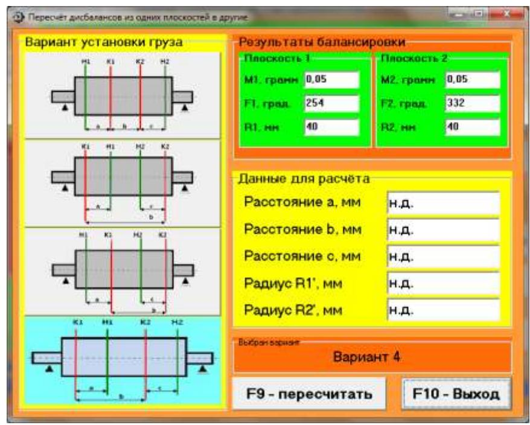

 Рис. 7.11. Рабочее окно вывода результатов пересчёта параметров корректирующих грузов при изменении плоскостей коррекции.

Кнопка «**Калькулятор**» используется в случае, когда необходимо суммировать несколько корректирующих грузов или разлагать груз по лопастям.

 При нажатии кнопки «**Калькулятор**» на дисплей компьютера выводится рабочее окно «**Векторный калькулятор**» (рис.7.12.), в котором можно провести суммирование двух векторов или разложение по фиксированным углам (например, лопастям). одного вектора на два.

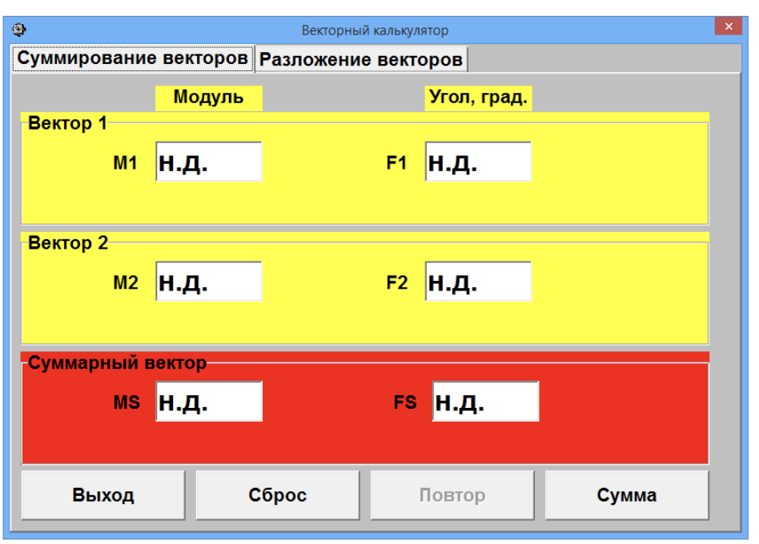
Рис. 7.12. Рабочее окно «Векторный калькулятор».

Кнопка «**Учёт Эксц.**» используется при необходимости учёта эксцентриситета оправки (или шпинделя), которые применяются на станке при балансировке ротора.

Подробное описание работы в данном режиме приведено в разделе **7.3.3**.

 Кнопка **«Коэффициенты»** используется для просмотра и запоминания в памяти компьютера коэффициентов балансировки ротора, рассчитанных по результатам трёх настроечных пусков

При её нажатии на дисплее компьютера появляется рабочее окно **«Коэффициенты балансировок в 2-х плоскостях»** (см. рис.7.13), в котором выводятся коэффициенты балансировки, рассчитанные по результатам трёх настроечных пусков.

В случае, если при последующей балансировке данного ротора (механизма) предполагается использовать режим **«Повторная балансировка»**, указанные коэффициенты должны быть сохранены в памяти компьютера.

Для этого в рабочем окне **«Коэффициенты балансировок в 2-х плоскостях»**  следует нажать кнопку «**Сохранить**» и перейти на вторую страницу этого окна (см. рис.7.14).

После чего следует ввести условное обозначение балансируемого ротора в окошке **«Машина»,** помещаемое в последней значащей строке таблицы, и нажать («щёлкнуть мышкой») кнопку **« √ »** для сохранения в памяти компьютера указанных данных**.**

Рис. 7.13. Рабочее окно с коэффициентами балансировки в 2-х плоскостях.

После этого можно вернуться предыдущее окно (рис.7.13) , для чего следует нажать кнопку **«Выход».**

Для выхода из рабочего окна, представленного на рис.7.13, в рабочее окно **«Установка грузов и дисбаланс» (**рис. 7.10**)**, также следует нажать кнопку **«Выход».**

Рис. 7.14. Вторая страница рабочего окна с коэффициентами балансировки в 2-х плоскостях.

Кнопка **«В архив»** используется в рабочем окне **«Установка грузов и дисбаланс»** (см. рис. 7.10) для перехода в архив, где автоматически сохраняются результаты всех балансировок.

### **Внимание!**

#### **Кнопка «В архив» доступна только после выполнения полного цикла баланси ровки, включая проверочный пуск.**

При её нажатии на дисплее компьютера появляется рабочее окно **«Архив балансировок в 2-х плоскостях»** (см. рис.7.15), в котором приводятся исходные и конечные данные текущей балансировки, а также таблица с результатами всех предыдущих балансировок.

При работе в данном окне выполняется подготовка результатов последней балансировки для архивного хранения и последующей распечатки протокола.

Подготовка включает в себя ввод названия (или условного обозначения) балансируемого ротора, который выполняется в окошке **«Имя ротора»;**

После ввода указанных данных для их запоминания в памяти компьютера необходимо нажать («щёлкнуть мышкой») кнопку **« √ »**, расположенную в ряду управляющих кнопок рабочего окна **«Архив балансировок в 2-х плоскости»**.

После этого, нажав («щёлкнув мышкой») кнопку **«Протокол»**, можно вывести на дисплей компьютера проект протокола проверки, отредактировать его и, при необходимости, распечатать на принтере или сохранить в памяти компьютера как текстовый документ.

Рис. 7.15. Рабочее окно «Архив балансировки в 2-х плоскостях»

Пример оформления протокола балансировки ротора представлен на рис. 7.16. Для завершения работы в данном окне (см. рис. 7.5) необходимо нажать («щёлкнуть мышкой») кнопку **«Выход».**

Рис. 7.16. Пример оформления протокола балансировки ротора.

# **7.3.2. Повторная балансировка ротора.**

### **7.3.2.1. Подготовка измерительной системы для повторной балансировки (ввод исходных данных).**

Повторная балансировка может выполняться только для ранее отбалансированного ротора, для которого уже были определены и занесены в память компьютера коэффициенты балансировки и другие исходные данные.

#### **ВНИМАНИЕ!**

**При проведении повторной балансировки датчики вибрации и датчик фазового угла должен быть установлен точно так же, как и при проведении первичной балансировки.**

Работа в режиме повторной балансировки начинается из главного рабочего окна программы (рис. 7.1) при нажатии кнопки **«Повторная».**

В этом случае на дисплее прибора появится вторая страница рабочего окна **«Коэффициенты балансировок в 2-х плоскостях»** (см. рис.7.14), содержащая коэффициенты балансировки, а также ряд других параметров, для всех ранее отбалансированных роторов.

Перемещаясь по таблице этого окна с помощью управляющих кнопок «►» или «◄» можно выбрать нужный тип ротора, для которого ранее была сформирована запись с коэффициентами балансировки.

После чего для использования этих данных в текущих измерениях следует нажать кнопку **«Выбрать».**

Далее **следует** нажать кнопку **«Выход»** и вернуться в предыдущее Главное рабочее окно **программы** (см. рис. 7.1)**.**

После этого можно установить ротор выбранного типа на балансировочном станке и включить вращение ротора.

## **7.3.2.2. Измерения при проведении повторной балансировки.**

 Повторная балансировка требует проведения всего лишь одного настроечного и, как минимум, одного проверочного пуска балансируемой машины.

Для начала измерения на первом пуске в Главном рабочем окне программы (см. рис. 7.1) следует нажать кнопку **«Балансировать**», после чего на дисплее компьютера появится рабочее окно (см. рис. 7.7), в котором в режиме мониторинга начинает выполняться измерение вибрации и частоты вращения ротора.

Если измеренное значение частоты вращения отличается не более чем на ±10% от заданного значения, то фон окна на рис. 7.7 имеет зелёный цвет, что указывает на возможность выполнения замера вибрации, используемой для расчетов при проведении балансировки.

Если же измеренное значение частоты вращения ротора не укладывается в допуск, то фон рабочего окна имеет соответственно либо синий цвет (ниже допуска), либо красный цвет (выше допуска).

Это указывает, что дальнейшая работа по программе невозможна пока не будет проведена дополнительная настройка частоты вращения ротора до момента её совпадения с допуском.

В случае, когда частота вращения ротора находится в заданном диапазоне, в рабочем окне «**Измерения Nоб, Vs, Vo, F**» (см. рис 7.7) необходимо нажать кнопку **«Принять»,** после чего загорается красный транспарант «**Режим – Рабочий замер**».

При появлении этого транспаранта начинает выполняться замер вибрации (силы) на опорах станка, а также проводится обработка результатов этих измерений, который в зависимости от частоты вращения ротора может длиться от 4 до 15 секунд.

При успешном выполнении процесса измерений на дисплей компьютера (см. рис. 7.17) выводятся результаты расчёта параметров корректирующих грузов, которые необходимо установить на роторе в первой и второй плоскостях для компенсации его дисбаланса.

Указанные параметры выводятся для обеих плоскостей коррекции, как в цифровом, так и в графическом виде (то есть в виде векторов дисбаланса, представленных на панорамных индикаторах в полярной системе координат).

Кроме того на дисплей выводится дополнительные справочные данные:

- тип балансируемого ротора;

- частота его вращения при балансировке;
- допуски на величину остаточного дисбаланса;
- информация о способе коррекции (добавление или съём корректирующих грузов).

Корректирующие грузы, информация о которых представлена на рис. 7.17, необходимо установить на роторе (удалить с ротора) для компенсации его дисбаланса.

После установки (съёма) корректирующих грузов при необходимости можно провести проверку эффективности балансировки, для чего следует повторно нажать кнопку **«Балансировать**».

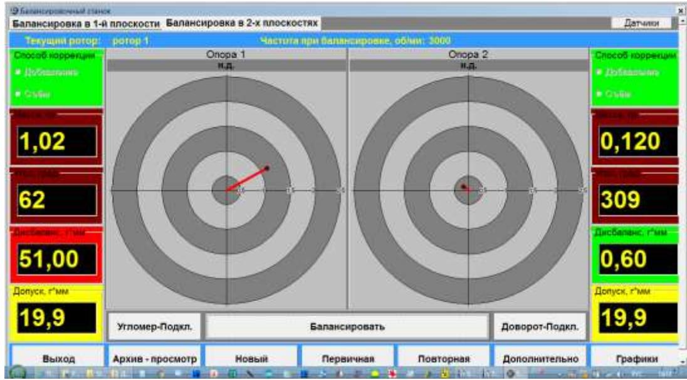

Рис. 7.17. Пример вывода на дисплей компьютера результатов балансировки в полярной системе координат.

В случае, когда при проведении первичной (настроечной) балансировки был выбран вариант разложения корректирующих грузов по лопастям, следует дополнительно нажать кнопку «F3-Дополн.», после чего на дисплей компьютера поверх рабочего окна, представленного на рис. 7.17, в табличной форме (см. рис. 7.18) выводятся результаты разложения корректирующих грузов по лопастям.

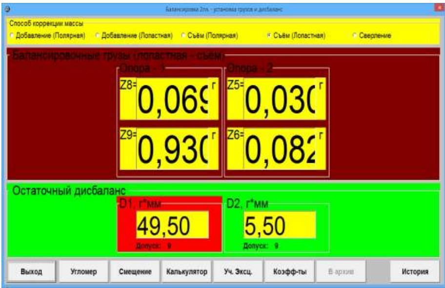

Рис. 7.18. Пример вывода на дисплей компьютера результатов балансировки с разложением корректирующих грузов по лопастям.

При этом в правой и левой зонах рабочего окна сохраняются предварительно рассчитанные параметры корректирующих грузов в полярной системе координат.

После завершения процедуры установки (съёма), указанных в таблице корректирующих грузов, следует нажать кнопку «**Выход**» и вернуться в Главное меню программы.

В случае, когда при проведении первичной (настроечной) балансировки был выбран вариант вывода параметров корректирующих в глубине сверления, в рабочем окне, представленном на рис. 7.17 также следует нажать кнопку «F3-Дополн.».

После чего на дисплей компьютера поверх исходного рабочего окна выводится таблица (см. рис. 7.19), в которой для обеих плоскостей коррекции указаны:

- количество высверливаемых отверстий **N**;

- глубина отверстий **Н** в мм;

- угол расположения отверстий на роторе **f** в градусах.

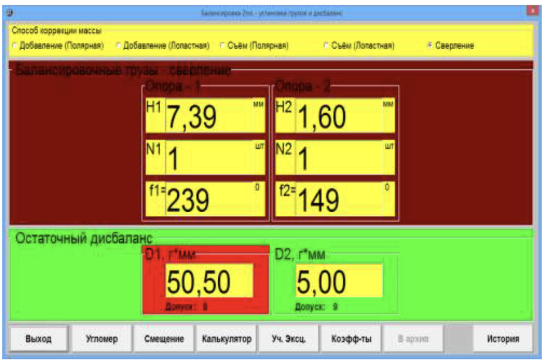

 Рис. 7.19. Пример вывода на дисплей компьютера результатов балансировки, которые заданы в глубине сверления.

Одновременно в правой и левой зонах рабочего окна сохраняются предварительно рассчитанные параметры корректирующих грузов в полярной системе координат.

После завершения процедуры сверления, и съёма с ротора указанных в таблице корректирующих грузов, следует нажать кнопку «**Выход**» и вернуться в Главное меню программы.

 В случае балансировки партии однотипных роторов, после завершения балансировки очередного ротора в Главном рабочем окне программы (см. рис. 7.17) следует нажать кнопку «**Новый**», с помощью которой обнуляются результаты балансировки предыдущего ротора.

 После этого необходимо установить на станке новый ротор, включить вращение станка и, нажав кнопку «**Баланс**», приступить к балансировке очередного ротора

# **7.3.3. Балансировка ротора с компенсацией эксцентриситета оправки.**

#### **7.3.3.1. Первичная балансировка с компенсацией эксцентриситета оправки.**

 При выполнении первичной балансировки, предполагающей учёт эксцентриситета оправки, на первом этапе необходимо выполнить стандартную процедуру первичной балансировки, подробно рассмотренную в разделе **7.3.1.**

 По завершении этой процедуры на дисплей компьютера выводится рабочее окно с результатами расчета параметров корректирующих грузов (см. рис. 7.20).

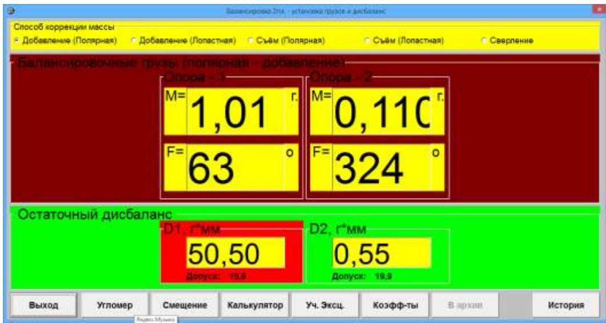

Рис. 7.20. Рабочее окно вывода результатов расчета параметров корректирующих грузов.

 Для учёта компенсации эксцентриситета оправки, который может приводить к дополнительному дисбалансу ротора, в этом рабочем окне (см. рис.7.20) необходимо нажать кнопку «F7-Уч.Эксц.».

 При этом появится новое рабочее окно (см. рис. 7.21) , в котором должны проводиться дополнительные измерения, необходимые для учёта эксцентриситета оправки.

Для выполнения работы в этом окне следует:

- развернуть балансируемый ротор относительно оправки, на которой он установлен, на 180;
- нажать кнопку **«Измерить»,** расположенную в левом верхнем углу рабочего окна;
- включить вращение балансируемого ротора;

 - нажать кнопку **«Выполнить**» и произвести измерение вибрации (силы) на опорах станка.

 После завершения процесса измерения в окошках данных этого рабочего окна выводятся результаты измерений частоты вращения ротора (**Nоб**), а также значения величин СКЗ (**Vо1, Vо2**) и фаз (**F1, F2**) вибрации (силы), проявляющиеся на частоте вращения баланcируемого ротора (см.рис.7.22)

 Для продолжения работы в этом окне следует нажать кнопку «**Принять**», после чего на дисплее компьютера появляется новое рабочее окно с параметрами корректирующих грузов, определенными с учётом эксцентриситета оправки (см. рис.7.23).

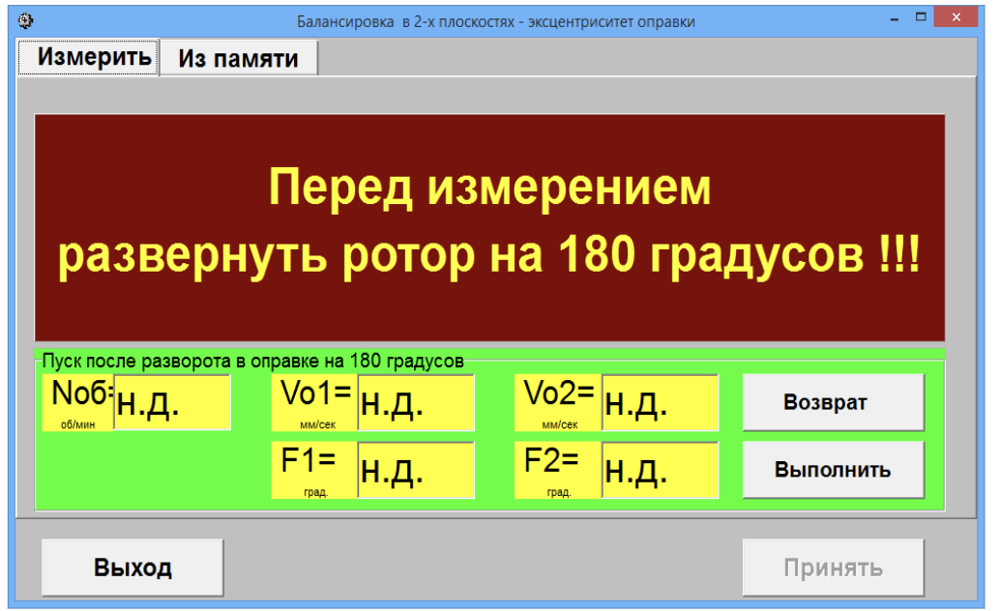

Рис. 7.21. Рабочее окно для учёта эксцентриситета оправки

Рис. 7.22. Рабочее окно с результатом измерения параметров вибрации после разворота ротора на 180.

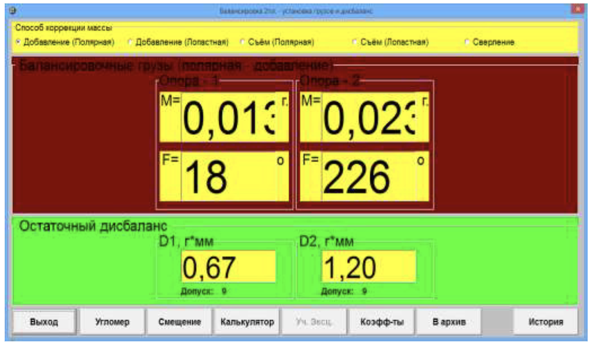
Рис. 7.23. Рабочее окно вывода результатов расчета параметров корректирующих грузов с учётом эксцентриситета оправки.

 При необходимости выполнения повторных балансировок роторов данного типа в рабочем окне, представленном на рис. 7.23, следует нажать кнопку **«Коэффициенты»**  и сохранить указанные коэффициенты в памяти компьютера.

 Для выхода из рабочего окна, представленного на рис. 7.23, в главное рабочее окно следует нажать кнопку **«Выход»**.

 После чего на дисплее компьютера вновь появится главное рабочее окно (см. рис.7.24) с панорамными индикаторами, на которых будут нанесены векторы, характеризующие параметры корректирующих грузов, определённых с учётом эксцентриситета оправки.

 Рис.7.24. Главное рабочее окно с параметрами корректирующих грузов, отображённых на панорамных индикаторах.

## **7.3.3.2. Продолжение балансировки однотипных роторов с учётом эксцентриситета оправки**

 Для балансировки **нового** однотипного ротора необходимо установить его на оправке станка, после чего в главном рабочем окне следует нажать кнопку «**Новый**» и обнулить данные, полученные при выполнении предыдущей балансировки.

 После этого можно включить вращение изделия, нажать кнопку «**Балансировка**» и выполнить балансировку нового ротора.

 При этом поправки, определённые на стадии настройки (см. раздел 7.3.3.1) и учитывающие эксцентриситет оправки, будут учитываться автоматически.

# **7.3.4. Индикация угла поворота ротора в режиме повторной балансировки**

 В случае, когда балансировочный станок оснащён системой измерения угла поворота ротора, определение мест установки корректирующих грузов при проведении повторной балансировки может выполняться с использованием показаний указанной системы.

 Работа в данном режиме начинается из рабочего окна (см. рис. 7.24), в котором выводится цифровая и графическая информация о массах и углах установки корректирующих грузов.

Рис. 7.24. Рабочее окно с результатами расчёта корректирующих грузов.

 Для подключения системы измерения угла в этом окне необходимо нажать кнопку **«Угломер-подкл.»**, с помощью которой включается система измерения угла поворота ротора.

### **Внимание!**

 **Перед началом работы в этом окне необходимо развернуть ротор в положение, при котором метка на роторе совмещается с предполагаемой зоной обработки (плоскостью, в которой выполняется установка или съём корректирующих грузов).** 

 При этом в рабочем окне с результатами расчёта корректирующих грузов (см. рис. 7.25) на круговых диаграммах помимо векторов, соответствующих положению

корректирующих грузов на роторе (векторы красного цвета), появляются векторы синего цвета, указывающие, что метка на роторе совмещена с зоной обработки (то есть ротор находится в исходном положении).

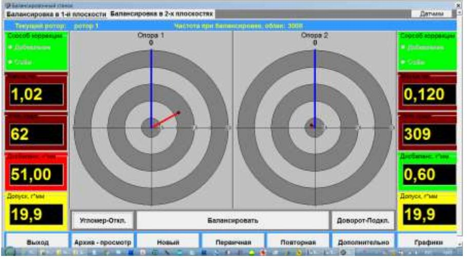

Рис. 7.25. Рабочее окно с результатами расчёта корректирующих грузов и векторами исходного положения ротора.

 При повороте ротора векторы синего цвета изменяют свое угловое положение на круговых диаграммах.

 При этом в момент, когда вектор синего цвета совмещается с одним из векторов корректирующих грузов (см. рис. 7.26), балансируемый ротор устанавливается в зоне, в которой производится съём или установка соответствующего корректирующего груза.

 Об этом моменте дополнительно сигнализирует цифровое табло с угловой координатой ротора, которое в момент совмещения векторов изменяет свой цвет с серого на красный.

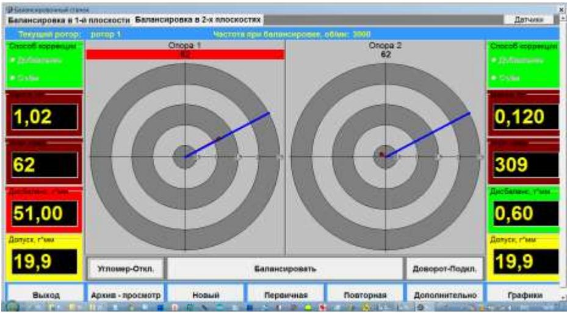

 Рис. 7.26. Рабочее окно с результатами расчёта корректирующих грузов в момент разворота ротора в зону съёма (установки) корректирующего груза в плоскости 1

 После завершения процедуры установки (съёма) корректирующих грузов в обеих плоскостях коррекции следует отключить датчик (преобразователь) угла поворота ротора, для чего следует нажать кнопку «**Угломер-откл.».**

# **7.4. Балансировка ротора в одной плоскости (статическая).**

Работа по программе в режиме " **Балансировка в одной плоскости**" начинается из Главного рабочего окна программы (см. рис. 7.1) при нажатии кнопки **«Балансировка в 1-й плоскости».**

Далее в этом окне выбирается один из двух возможных вариантов работы:

- а) Первичная (настроечная) балансировка ротора, которая начинает выполняться при нажатии кнопки **«Первичная»;**
- б) Повторная балансировка ротора, которая начинает выполняться при нажатии кнопки **«Повторная»**

Как уже отмечалось выше, первичная балансировка выполняется для роторов, которые ранее на данном станке не балансировались и для которых в архивной памяти компьютера отсутствует информация, необходимая для проведения повторной балансировки (в том числе: численные значения коэффициентов балансировки, частоты вращения ротора, массы пробных грузов и др.).

При выполнении первичной балансировки в одной плоскости, требуется проведение двух пусков ротора, необходимых для настройки (тарировки) измерительной системы балансировочного станка на конкретный тип ротора.

При этом во время первого пуска определяется исходная вибрация (сила) на опорах станка.

Второй пуск ротора и измерение вибрации (силы) на опорах станка выполняется после установки на балансируемый ротор пробного груза в выбранной плоскости коррекции.

Повторная балансировка может выполняться только для ранее отбалансированного ротора, для которого определены и занесены в память прибора массы и радиусы установки пробных грузов, частота вращения, коэффициенты балансировки и ряд других параметров.

В этом случае для определения масс и мест установки корректирующих грузов, необходимых для компенсации дисбаланса, требуется всего один пуск ротора.

 Процедура проведения балансировки в одной плоскости (за исключением сокращённого числа пусков) аналогична той, которая подробно описана выше для балансировки в двух плоскостях коррекции.

Поэтому при проведении балансировки в одной плоскости необходимо следовать рекомендациям, приведённым в п. 7.3 настоящего руководства.

# **7.5. Работа в режиме «Графики»**

Работа в режиме «**Графики**» начинается из Главного рабочего окна программы (см. рис. 7.1 ) при нажатии кнопки «Графики». После чего на дисплее компьютера открывается окно «Измерение вибрации по двум каналам. Графики» (см. рис. 7.27).

Рис. 7.27. Рабочее окно «Измерение вибрации по двум каналам. Графики».

При работе в данном окне возможно построение четырёх вариантов графиков вибрации.

Первый вариант позволяет получить графики временной функции **суммарной вибрации** (по виброскорости) или графики временной функции изменения усилия на опорах по первому и второму измерительным каналам.

Второй вариант позволяет получить графики вибрации (силы), проявляющейся на **оборотной частоте** вращения ротора и её более высоких гармонических составляющих.

 Указанные графики получаются в результате проведения синхронной фильтрации временной функции суммарной вибрации.

 Третий вариант позволяет получить графики вибрации с результатами **гармонического анализа.**

 Четвёртый вариант позволяет получить графики вибрации с результатами **спектрального анализа.**

## **7.5.1. Графики суммарной вибрации.**

Для построения графиков суммарной вибрации в рабочем окне «**Измерение вибрации по двум каналам. Графики**» необходимо и «щёлкнуть мышкой» по кнопке «**Суммарная вибрация**».

 После этого следует задать частоту вращения ротора при измерении (в случае программного управления приводом).

 Далее в окне на рис. 7.27 следует задать время измерения, для чего «щёлкнуть мышкой» по кнопке «▼» и выбрать из выпадающего списка нужную длительность процесса измерения, которая может быть равна 1, 5, 10, 15 или 20 секундам.

 Далее следует включить вращение ротора и нажать («щёлкнуть мышкой») «**Измерить**», после чего начинается процесс измерения вибрации одновременно по двум каналам.

После завершения процесса измерения в рабочем окне появляются графики временной функции суммарной вибрации по первому (красный цвет) и второму (зелёный цвет) измерительным каналам (см. рис. 7.28).

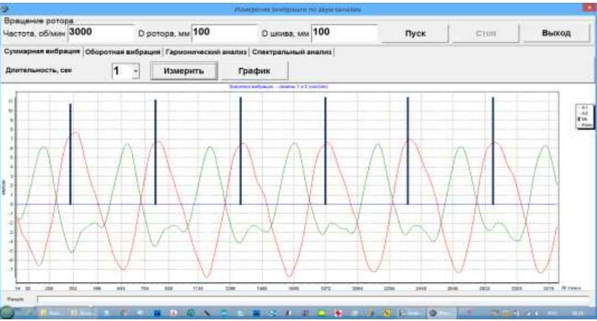

Рис. 7.28. Рабочее окно для вывода графиков временной функции суммарной вибрации

 На указанных графиках по оси **Х** откладывается время, а по оси **У** - амплитуда виброскорости в мм/сек (силы в усл. ед.).

На этих графиках также имеются вертикальные линии – отметки оборотов (синий цвет), «привязывающие» графики вибрации к частоте вращения ротора. При этом каждая метка характеризует начало (завершение) очередного оборота ротора.

При необходимости изменения масштаба графика по оси Х может использоваться движок, расположенный под графиком.

## **7.5.2. Графики оборотной вибрации.**

Для построения графиков оборотной вибрации в рабочем окне «**Измерение вибрации по двум каналам. Графики**» (см. рис. 7.27) необходимо «щёлкнуть мышкой» по кнопке «**Оборотная вибрация**».

После чего на дисплее появляется рабочее окно для измерения оборотной вибрации (см. рис. 7.29).

В этом окне также необходимо задать частоту вращения ротора и нажать («щёлкнуть мышкой») кнопку «**Измерить**», после чего начинает выполняться процесс измерения оборотных составляющих вибрации одновременно по двум каналам.

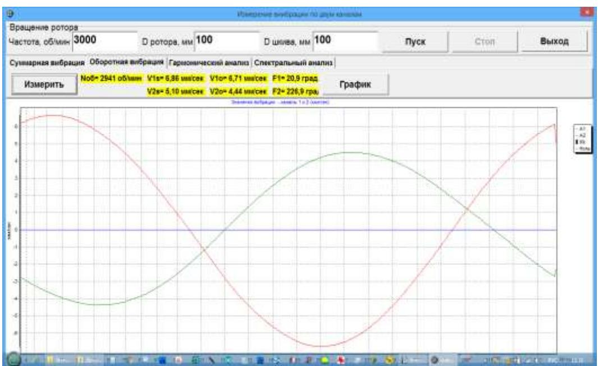

Рис. 7.29. Рабочее окно для вывода графиков оборотных составляющих вибрации.

 После завершения процесса измерения и математической обработки результатов (синхронной фильтрации временной функции суммарной вибрации) на дисплее в рабочем окне на периоде равном **одному обороту ротора** выводятся графики **оборотных составляющих вибрации** по обоим каналам. При этом вибрация, измеренная по первому каналу, отображается красным, а по второму – зелёным цветом. На указанных графиках по оси **Х** откладывается угол поворота ротора на одном обороте (от метки до метки), а по оси **У** - амплитуда виброскорости в мм/сек. (силы в усл. ед.)

Кроме того, в верхней части рабочего окна (справа от кнопки «**Измерить**») выводятся цифровые значения результатов измерений вибрации по обоим каналам.

В частности там выводятся: величины СКЗ суммарной вибрации (**V1s, V2s**), величины СКЗ (**V1o, V2o**) и фазы (**F1, F2**) 1-й гармоники оборотной составляющей вибрации, а также частота вращения ротора (**Nоб**).

#### **7.5.3. Графики вибрации с результатами гармонического анализа.**

 Для построения графиков вибрации с результатами гармонического анализа в рабочем окне «**Измерение вибрации по двум каналам. Графики**» (см. рис. 7.27) необходимо «щёлкнуть мышкой» по кнопке «**Гармонический анализ**».

После чего на дисплее появляется рабочее окно для одновременного вывода графиков временной функции, а также спектра гармонических составляющих вибрации, период которых равен или кратен частоте вращения ротора (см. рис. 7.30).

#### **Внимание!**

 **При работе в данном режиме необходимо использовать датчик фазового угла, обеспечивающий синхронизацию процесса измерения с частотой вращения ротора.**

*Лист*

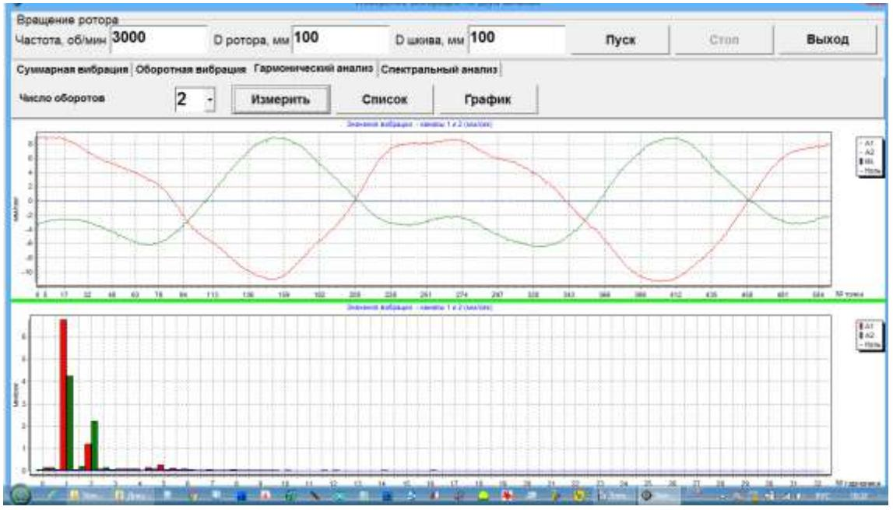

Рис. 7.30. Рабочее окно для вывода спектра гармонических составляющих вибрации.

 Для работы в данном окне следует задать частоту вращения ротора (в случае программного управления приводом) и выбрать число оборотов ротора, на которых предполагается проводить измерения. Для этого нужно «щёлкнуть мышкой» по кнопке «▼» и выбрать из выпадающего списка нужный период измерения, который может быть равен 1, 2, 4 или 8 оборотам ротора.

Далее следует включить вращение ротора и нажать («щёлкнуть мышкой») кнопку «**Измерить**», после чего начинается процесс измерения вибрации одновременно по двум каналам.

После завершения процесса измерения в рабочем окне (см. рис. 7.30) появляются графики временной функции (верхний график) и спектра гармонических составляющих вибрации (нижний график).

На графике спектра по оси **Х** откладывается номер гармоники, а по оси **У** – СКЗ виброскорости в мм/сек (силы в усл. ед.).

 При этом вибрация, измеренная по первому каналу, отображается красным, а по второму – зелёным цветом.

## **7.5.4. Графики вибрации с результатами спектрального анализа.**

 Для построения графиков вибрации с результатами спектрального анализа в рабочем окне «**Измерение вибрации по двум каналам. Графики**» (см. рис. 7.37) необходимо «щёлкнуть мышкой» по кнопке «**Спектральный анализ**».

После чего на дисплее появляется рабочее окно, предназначенное для одновременного вывода графиков временной функции и частотного спектра вибрации (рис. 7.31).

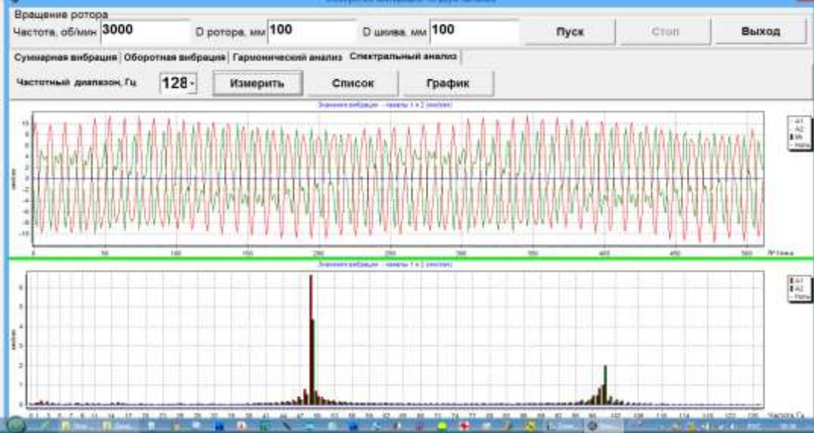

Рис. 7.31. Рабочее окно для вывода спектра гармонических составляющих вибрации.

 Для работы в данном окне следует задать частоту вращения ротора и выбрать частотный диапазон, в котором предполагается проводить измерения. Для этого нужно «щёлкнуть мышкой» по кнопке «▼» и выбрать из выпадающего списка нужное значение частотного диапазона, которое может быть равно 64 Гц, 128 Гц, 320 Гц или 640 Гц.

 При этом следует иметь ввиду, что в диапазоне 64 Гц полоса анализа составляет 0,5 Гц, в диапазоне 128 Гц – 1 Гц, в диапазоне 320 Гц – 2,5 Гц, а в диапазоне 640 Гц – 5Гц.

Далее по готовности следует включить вращение ротора и нажать («щёлкнуть мышкой») кнопку «**Измерить**», после чего начинается процесс измерения вибрации одновременно по двум каналам.

После завершения процесса измерения в рабочем окне (см. рис. 7.31) появляются графики временной функции (верхний график) и спектра вибрации (нижний график).

 На графике спектра по оси **Х** откладывается частота составляющей вибрации в Гц, а по оси **У** - СКЗ виброскорости в мм/сек ( силы в усл. ед.).

 При этом вибрация, измеренная по первому каналу, отображается красным, а по второму – зелёным цветом.

# **8. ОБЩИЕ УКАЗАНИЯ ПО ЭКСПЛУАТАЦИИ И ТЕХНИЧЕСКОМУ ОБСЛУЖИВАHИЮ**

**8.1.** Перед началом работы необходимо провести внешний осмотр прибора, при выполнении которого необходимо проверить:

- комплектность прибора согласно разделу 3 "Состав изделия и комплект поставки";
- отсутствие механических повреждений корпуса измерительного блока и компьютера, кабелей, датчиков и других комплектующих изделий;
- отсутствие загрязнения и окисления контактов разъемов на приборе и кабелях и легкость их соединения.

**8.2.** При эксплуатации прибора не рекомендуется включать его в производственную электросеть, в которой могут возникать резкие скачки тока и напряжения, которые могут привести к сбоям в работе прибора, особенно компьютера.

В случае невозможности обеспечения качественного электропитания прибора от внешней электросети рекомендуется использовать автономное питание от аккумулятора компьютера.

**8.3.** Климатические условия эксплуатации и хранения прибора должны соответствовать требованиям п.п.. 2.15 и 9.4 настоящей инструкции.

**8.4**. В процессе эксплуатации с целью обеспечения нормальной работы прибора и поддержания его в исправном состоянии необходимо проводить регламентные работы по техническому обслуживанию прибора.

Виды и периодичность технического обслуживания приведены в таблице 8.1.

# Таблица 8.1

| Виды технического обслужи вания                       | Периодичность проведения                 | Кто выполняет                                                                 |  |  |
|----------------------------------------------------------|------------------------------------------|-------------------------------------------------------------------------------|--|--|
| 1. Плановое техническое об служивание (ТО 1) | Ежемесячно                               | оператор, работающий с при бором                                           |  |  |
| 2. Внеплановое техническое обслуживание         | По возникновению неисправ ности | оператор, работающий с при бором; представитель ООО "Кинематика". |  |  |

**8.4.1.** Плановое техническое обслуживание включает в себя следующие виды работ:

- внешний осмотр всех устройств прибора;

- удаление пыли и грязи с датчиков вибрации, соединительных кабелей, разъемов и измерительного блока, компьютера;
- промывку разъемов и оптических частей (светодиод-фотодиод) датчика фазового угла (очистку и промывку проводить марлей, смоченной в этиловом спирте);

- протирку кабелей (протирку выполнять марлей, смоченной в бензине);

**8.4.2**. Внеплановое обслуживание производится при возникновении неисправности. Оно включает в себя работы, связанные с устранением неисправностей, заменой вышедших из строя комплектующих деталей, а также, при необходимости, все работы, по п. 8.4.1.

**8.4.3.** Перечень расходных материалов, необходимых для технического обслуживания, приведен в таблице 8.2.

*Лист*

48

| №№   | Наименование и обозначение                             | ГОСТ, ТУ         | Нормы расхода материалов |     |                |  |
|------|--------------------------------------------------------|------------------|--------------------------|-----|----------------|--|
| п.п. | материалов                                             | Материала        | ТО1                      | ТО2 | Итого в год |  |
| 1    | Спирт этиловый ректифицирован ный технический | ГОСТ 18300-72 | 0,05 л                   | -   | 0,6 л          |  |
| 2    | Бензин Б-70                                            | ГОСТ 1012-77     | 0,10 л                   | -   | 1,20 л         |  |
| 3    | Марля медицинская                                      | ГОСТ 9412-77     | 5 дм                     | -   | 60 дм          |  |

# **9. ПРАВИЛА ТРАНСПОРТИРОВАНИЯ И ХРАНЕНИЯ**

**9.1.** Для удобства транспортировки прибора, комплектующие изделия и документация укладываются в специальную сумку или чемодан.

**9.2.** При транспортировке по почте сумка (чемодан) с прибором, комплектующими и документацией должна быть упакована в жесткий ящик. На ящике сверху должен быть помещен упаковочный лист. На двух боковых стенках ящика должны быть нанесены предупредительные знаки:

**9.3.** Хранить прибор необходимо на стеллаже в специально отведенном для него месте, защищенном от попадания влаги и пыли. Не допускается устанавливать на прибор другие изделия или воздействие на него механических нагрузок.

**9.4.** Температура воздуха в помещении для хранения прибора допускается в пределах от +4 до +45°С, относительная влажность не более 90 % при температуре 30°С.

**9.5.** Прибор, находящийся на длительном хранении, рекомендуется включать не реже одного раза в три месяца для тренировки элементов и подзарядки аккумуляторов.

# **10. КАЛИБРОВКА ПРИБОРА**

Калибровка прибора производится в соответствии с требованиями Методики калибровки прибора для балансировки «Балком-2» КИН 003.00.00.000 МП.

Периодическая Калибровка прибора должна проводиться не реже одного раза в 3 года организациями, уполномоченными Ростехрегулированием.

В случае использования прибора в качестве измерительной системы балансировочного станка его калибровка может не проводиться при условии проведения комплексной проверки станка в соответствии с требованиями ГОСТ ИСО 20076-2007 «Вибрация. Станки балансировочные. Характеристики и методы их проверки».

# **ВВОД ЦИФРОВЫХ И ТЕКСТОВЫХ ПАРАМЕТРОВ С ИСПОЛЬЗОВАНИЕМ СЕНСОРНОЙ КЛАВИАТУРЫ**

В процессе работы системы периодически возникает потребность ввода ряда цифровых и текстовых параметров.

В данной версии программного обеспечения их ввод выполняется в режиме сенсорного экрана (touch screen) с использованием виртуальной сенсорной клавиатуры или с помощью «мышки».

 Для ввода цифровых параметров используется вариант цифровой клавиатуры, представленной на рис. П.2.1.

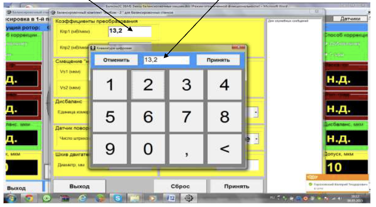

Рис. П.2.1. Пример использования виртуальной цифровой клавиатуры

 Указанная клавиатура появляется после нажатия (касания) в окне ввода, в котором должен вводиться цифровой параметр.

 Она включает в себя ряд цифровых кнопок (от **0** до **9**), две символьных кнопки со знаками **« , »** и **« < »,** а также две управляющие кнопки **«Принять» и «Отменить».**

При нажатии цифровой или символьной кнопки соответствующий знак заносится в строку ввода, расположенную в верхней части клавиатуры.(см. рис. П.2.1).

 Для завершения ввода цифрового параметра на виртуальной клавиатуре необходимо нажать кнопку **«Принять»,** после чего указанный цифровой параметр заносится в окошко ввода.

 В случае ошибочного ввода какой либо цифры или символа необходимо нажать кнопку **«Отменить»,** после чего ошибочно введённый символ стирается в строке ввода.

 Для ввода текстовых параметров используется расширенный вариант виртуальной клавиатуры, содержащий цифры, буквы и ряд управляющих кнопок.

Указанная клавиатура представлена на рис. П.2.2.

 Правила работы с этим вариантом клавиатуры аналогичны тем, которые описаны выше для цифровой виртуальной клавиатуры.

Рис. П.2.2. Пример использования виртуальной сивольной клавиатуры

#### **Схема электрических подключений**
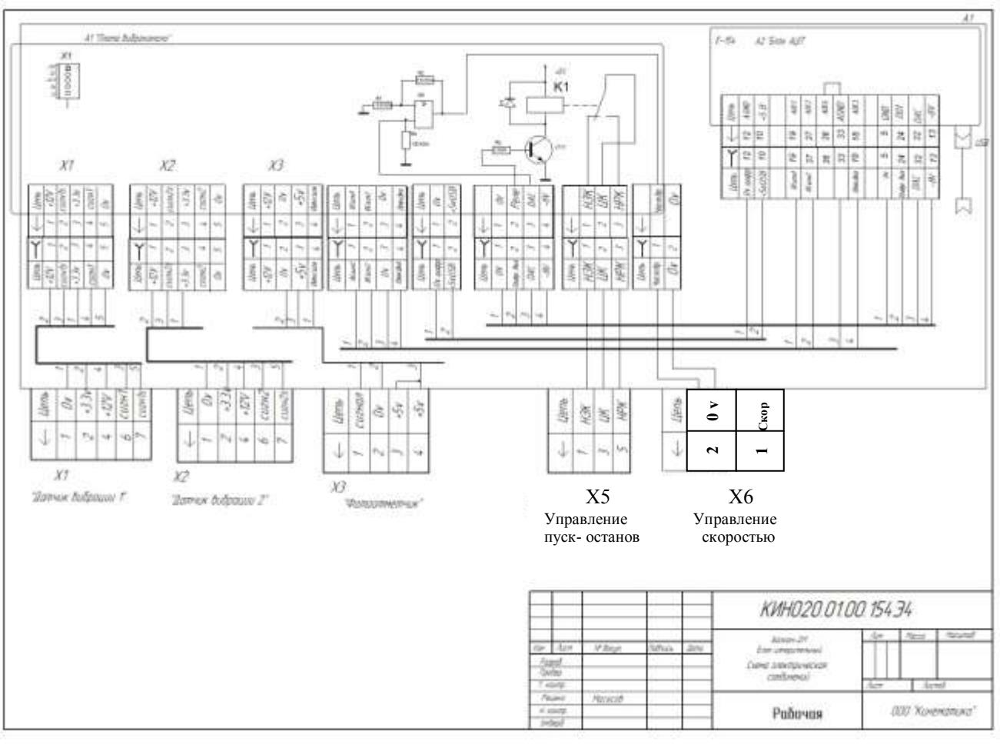

