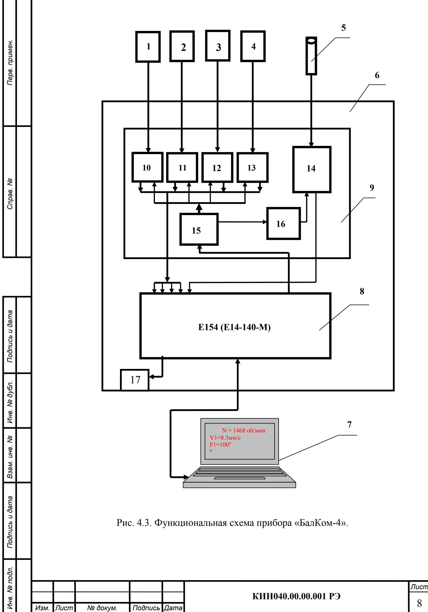

# 4. УСТРОЙСТВО И ПРИНЦИП РАБОТЫ ПРИБОРА

## 4.1. Фотографии прибора «БалКом-4»

Фотографии прибора «БалКом-4» представлены на рис. 4.1 и 4.2.

Прибор (см. рис. 4.1) состоит из:
- измерительного блока 6,
- четырёх датчиков вибрации 1, 2, 3, 4,
- датчика фазового угла 5,
- портативного компьютера (нетбука или ноутбука) 7.

В комплект поставки прибора также входит оснастка, необходимая для проведения балансировки механизмов в полевых условиях. В частности, это магниты для установки датчиков вибрации на объекте и магнитный штатив для установки датчика фазового угла.

Корпус измерительного блока изготовлен из пластика ABS серого цвета.

На лицевой стенке корпуса (см. рис. 4.2) расположены разъёмы Х1, Х2, Х3, Х4, предназначенные для подключения датчиков вибрации к 1, 2, 3 и 4 измерительным каналам прибора, а также разъём Х5 для подключения датчика фазового угла.

С задней стороны датчика выведён кабель с USB-разъёмом Х6, который служит для подключения измерительного блока к компьютеру. По этому кабелю осуществляется обмен информацией между измерительным блоком и компьютером, а также подаётся питание +5 В от компьютера к измерительному блоку.

Рис. 4.1. Прибор для балансировки «БалКом-4» в комплекте

Рис. 4.2. Лицевая панель измерительного блока прибора «БалКом-4».

## 4.2. Функциональная схема и принцип работы прибора

Функциональная схема прибора приведена на рис. 4.3.

Прибор включает в себя следующие конструктивные единицы:
- измерительный блок 6;
- датчики вибрации 1, 2, 3, 4;
- датчик фазового угла (лазерный тахометр) 5;
- портативный компьютер 7.

Как видно из схемы, в корпусе измерительного блока установлен модуль 8 АЦП/ЦАП Е154 (или Е14-140-М), к которому подключена плата 9 нормирующих преобразователей сигналов датчиков. На плате 9 собраны основные узлы нормирования сигналов, в том числе:
- интеграторы 10, 11, 12, 13 сигналов датчиков вибрации по первому, второму, третьему и четвёртому измерительным входам;
- преобразователь 14 сигнала датчика фазового угла;
- преобразователь 15 питания DC-DC +5B/+3B;
- преобразователь 16 питания DC-DC +5B/+12B;
- реле 17 с нормально замкнутыми и нормально разомкнутыми контактами.

Принцип действия прибора основан на измерении механических колебаний, возникающих на корпусах машин при их работе. Для преобразования механических колебаний в электрический сигнал используются датчики вибрации — емкостные интегральные акселерометры (обозначены как 2-5). Фазовые характеристики сигнала определяются с помощью оптического лазерного тахометра (обозначен как 6), работающего по принципу отражения.

Рис. 4.3. Функциональная схема прибора «БалКом-4».

Под воздействием механических колебаний на выходе датчика вибрации формируется электрический аналоговый сигнал, пропорциональный виброускорению. Этот сигнал подаётся на соответствующий вход измерительного блока 6.

После преобразования (интегрирования, полосовой фильтрации) сигнал преобразуется в вид, пропорциональный виброскорости, и поступает на аналоговый вход модуля 8 АЦП/ЦАП Е154 (Е14-140-М). Здесь сигнал оцифровывается и запоминается в оперативном запоминающем устройстве (ОЗУ).

В случае необходимости измерения частоты вращения и/или фазовых характеристик вибрационного сигнала дополнительно используется импульсный сигнал, формируемый датчиком фазового угла 5. Этот сигнал, после нормирования, также подаётся на аналоговый вход модуля 8.

На модуле 8 АЦП/ЦАП производится предварительная цифровая обработка аналоговых сигналов. Затем оцифрованные данные передаются по шине USB в портативный компьютер 7, где по заданной программе осуществляется дальнейшая обработка (фильтрация, интерполяция, Фурье-анализ, вычисление параметров балансировки и т.д.).

Полученные результаты (численные значения амплитуды и фазы вибрации, частоты вращения и другие параметры) выводятся на дисплей компьютера и сохраняются в соответствующих разделах его памяти.

В зависимости от выбранного режима балансировки (одна, две, три или четыре плоскости коррекции) последовательно выполняется соответствующее количество измерений вибрации объекта в исходном состоянии и после установки пробного груза для тарировки прибора. По результатам измерений в цифровом виде выполняется задача балансировки, после чего на дисплей компьютера выводятся данные о величине и угле установки корректирующей массы.

Роль пользователя сводится к установке пробных и корректирующих грузов на балансируемом роторе и нажатию соответствующих клавиш (физических или виртуальных) на компьютере.

Весь процесс балансировки, включающий измерение, обработку сигнала и вычисление результата, выполняется в автоматизированном режиме по программам, установленным в памяти компьютера.

Внимание! В данной модификации прибора предусмотрен специальный разъём Х7 для подключения внешних устройств к выходам реле 17. Этот разъём может быть использован для программного управления включением и отключением электродвигателя привода балансировочного станка.

1. Внимание! При работе прибора от сети 220В необходимо соблюдать правила электробезопасности. Не допускается проводить ремонт прибора при его подключении к сети 220В.

2. В случае эксплуатации прибора в условиях низкого качества сетевого питания и заметных сетевых помех рекомендуется использовать режим автономного питания от аккумуляторов компьютера. При длительных перерывах в работе прибора для увеличения времени автономной работы рекомендуется переводить компьютер в режим гибернации (спящий режим). В этом случае вся информация, находящаяся в памяти компьютера в момент его выключения, автоматически сохраняется в энергонезависимой памяти, что позволяет возобновить работу с того места, где программа была прервана.