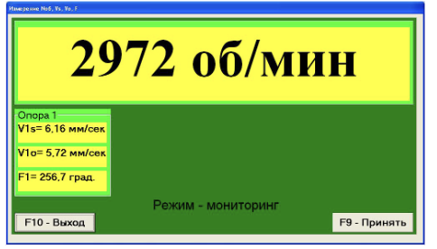
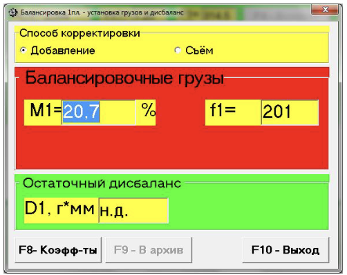
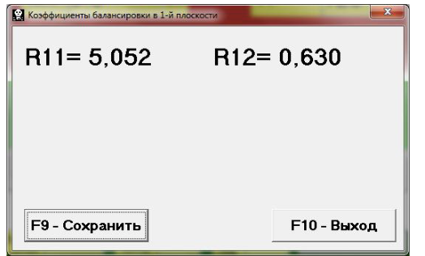
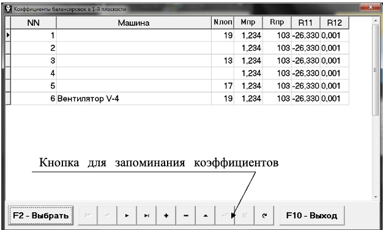
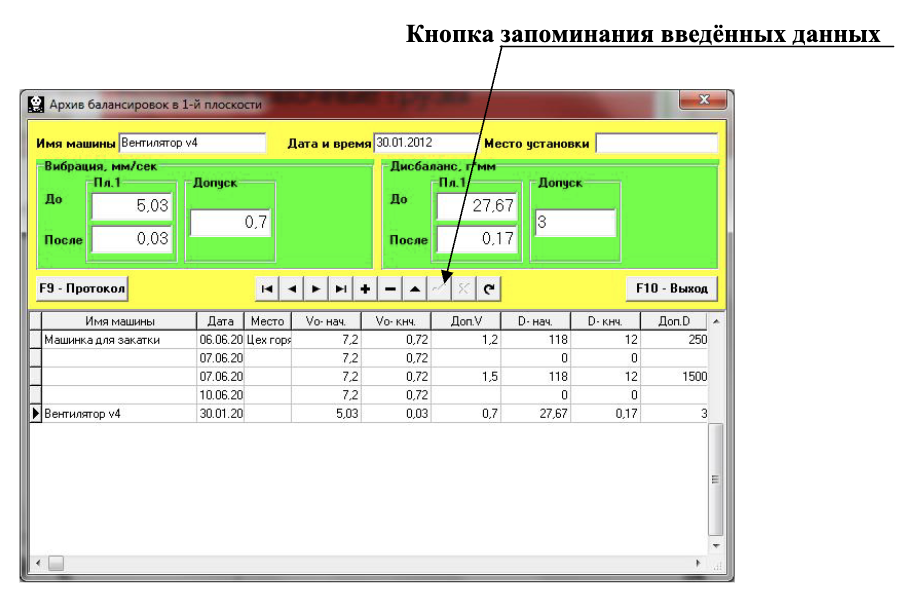
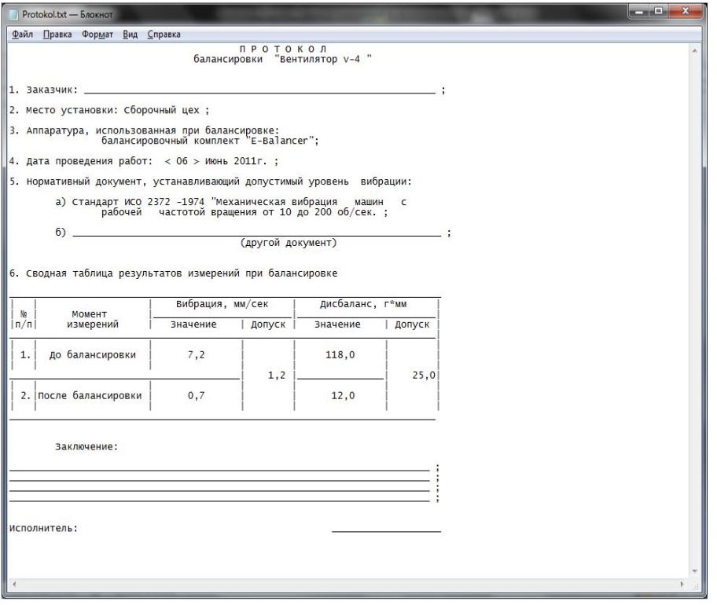

# 7.4.1. Первичная балансировка в 1-й плоскости

## 7.4.1.1. Настройка измерительной системы (ввод исходных данных)

Ввод исходных данных для проведения первичной балансировки начинается в рабочем окне «Балансировка в 1 пл. Исходные данные» (см. рис. 7.7.).  
В разделе «Вид балансировки» необходимо с помощью мышки поставить метку в графе «Первичная».  

Далее, в разделе «Масса пробного груза» необходимо выбрать единицы измерения массы пробного груза, для чего с помощью мышки ставится метка в графе «Граммы» или «Проценты».  
При выборе единицы измерения «Проценты» все дальнейшие расчёты массы корректирующего груза будут выполняться в процентах по отношению к массе пробного груза.  
При выборе единицы измерения «Граммы» все дальнейшие расчёты массы корректирующего груза будут выполняться в граммах. После чего ввести в окошке, расположенном справа от надписи «Граммы», массу пробного груза, который будет устанавливаться на роторе.

#### ВНИМАНИЕ!
При необходимости использования в дальнейшей работе режима «Повторно» при первичной балансировке масса пробного груза должна обязательно вводиться в граммах.

Далее, в разделе «Система координат» следует выбрать один из возможных вариантов размещения корректирующих грузов на балансируемом роторе — в «Полярной» или «Лопастной» системе координат. Для этого необходимо с помощью мышки поставить метку рядом с соответствующей надписью.  
В случае выбора варианта размещения грузов по лопастям балансируемой машины необходимо ввести число лопастей ротора в соответствующем окошке, расположенном рядом с надписью «Лопастная».  
Кроме того, в следующем разделе данного рабочего окна желательно ввести радиус установки пробного груза, что позволит получать дополнительную информацию о величине остаточного дисбаланса ротора в «г·мм».

После завершения ввода исходных данных необходимо «щёлкнуть мышкой» по кнопке «F9 -- Продолжить» (или нажать клавишу F9 на клавиатуре компьютера).  
После этого на дисплее компьютера появится рабочее окно (см. рис. 7.8.а.), используемое для выполнения полного цикла измерений при балансировке.

#### 7.4.1.2. Измерения при проведении балансировки

Как уже отмечалось, «Первичная» балансировка требует проведения двух тарировочных пусков и, как минимум, одного проверочного пуска балансируемой машины.

Измерение вибрации на первом пуске машины начинается в рабочем окне «Балансировка в 1-й плоскости» (см. рис. 7.8.а.) в разделе «Пуск без груза».

Рис. 7.8.а. Рабочее окно, используемое для вывода результатов измерений при балансировке в одной плоскости

На готовность программы к работе в данном разделе указывает темно-зеленый цвет фона раздела и подсветка кнопок «F8 -- Возврат» и «F9 -- Выполнить», расположенных в его правой части.  
Кнопка «F8 -- Возврат» (или функциональная клавиша F8) может использоваться для возврата в предыдущее рабочее окно программы.  

Для проведения измерения параметров вибрации в разделе «Пуск без груза» необходимо «щёлкнуть мышкой» по кнопке «F9 -- Выполнить» (или нажать клавишу F9 на клавиатуре компьютера), после чего замыкается нормально разомкнутый контакт реле 17, который можно использовать для программного пуска электродвигателя станка.  
Одновременно подаётся команда на начало циклического измерения вибрации в режиме мониторинга.  
При этом на дисплей прибора выводится рабочее окно (см. рис. 7.8.б.) «Измерение Nоб, Vs, Vo, F», в котором начинается циклический замер вибрации (режим — мониторинга).

Рис. 7.8.б. Рабочее окно, используемое для настроечных измерений при балансировке в одной плоскости в режиме мониторинга

#### Внимание!

В случае, когда при измерении отсутствует сигнал с датчика фазового угла (датчик не подключен к прибору или поврежден), или когда частота вращения ротора меньше 300 об/мин, на дисплей компьютера выводится предупреждающий транспарант (см. рис. 7.9), указывающий, что фактическая частота вращения ротора находится вне пределов измерений.  
После устранения причины ошибки для продолжения работы по программе следует нажать кнопку «ОК» на транспаранте.

Рис. 7.9. Транспарант, предупреждающий о нештатном режиме работы датчика фазового угла

При наборе балансируемым ротором требуемой частоты вращения необходимо нажать кнопку «F9-Принять».  
После чего в рабочем окне (см. рис. 7.8.б.) на красном фоне появляется надпись «Режим — рабочий замер», что указывает на начало рабочего замера вибрации, результаты которого будут использованы в последующих вычислениях.  
В зависимости от выбранной частоты вращения балансируемого ротора замер вибрации и обработка результатов измерений могут длиться от 2 до 10 секунд.

При успешном выполнении измерений в разделе «Пуск без груза» (см. рис. 7.8.а) появляются:
- результаты измерения частоты вращения ротора (Nоб),
- значение составляющей СКЗ (Vо1) и фазы (F1) вибрации, проявляющейся на частоте вращения балансируемого ротора.

При этом также меняется цвет фона раздела «Груз в плоскости 1» (с салатного на темно-зеленый) и включается подсветка кнопок «F8 -- Возврат» и «F9 -- Выполнить», что указывает на готовность прибора к работе на втором пуске.  
Кнопка «F8 -- Возврат» используется для возвращения в раздел «Пуск без груза» и проведения повторного измерения параметров вибрации по необходимости.

Перед началом измерения параметров вибрации в разделе «Груз в плоскости 1» следует остановить вращение ротора балансируемой машины и установить на нём пробный груз. Масса этого груза либо уже задана при подготовке исходных данных в рабочем окне «Балансировка в 1-й плоскости. Исходные данные» (см. рис. 7.7), либо условно принята в дальнейших расчётах за 100 %.

##### Внимание!

1. Вопрос о выборе массы пробного груза и места его установки на роторе балансируемой машины подробно рассмотрен в приложении 1.  
2. При необходимости использования режима «Повторно» место установки пробного груза должно обязательно совпадать с плоскостью установки метки, используемой для отсчёта фазового угла.

Для измерения параметров вибрации в разделе «Груз в плоскости 1» необходимо «щёлкнуть мышкой» по кнопке «F9 -- Выполнить» (или нажать клавишу F9 на клавиатуре компьютера), после чего начинается цикл измерений, аналогичный процессу при первом пуске.  
После завершения замера результаты измерений частоты вращения ротора (Nоб) и величины СКЗ (V1o) и фазы (F1) оборотной составляющей вибрации выводятся на дисплее компьютера в соответствующих окошках данного раздела.

Одновременно поверх рабочего окна «Балансировка в 1-й плоскости» появляется рабочее окно «Балансировочные грузы» (см. рис. 7.10), в котором выводятся результаты расчёта параметров корректирующего груза, который необходимо установить на роторе для компенсации его дисбаланса.  
При использовании полярной системы координат на дисплей выводятся значение массы (М1) и угла установки (f1) корректирующего груза.  
В случае разложения корректирующего груза по лопастям на дисплей выводятся номера лопастей (Z1i, Z1j) балансируемого ротора и массы грузов, которые необходимо на них установить.

Рис. 7.10. Рабочее окно с результатами расчёта параметров корректирующего груза

После установки на балансируемом роторе корректирующей массы в рабочем окне (см. рис. 7.10) необходимо нажать кнопку «Выход - F10» (или функциональную клавишу F10 на клавиатуре компьютера), вернуться в предыдущее рабочее окно программы «Балансировка в 1-й плоскости» и провести оценку эффективности выполненной балансировочной операции.  
При этом в рабочем окне программы «Балансировка в 1-й плоскости» (см. рис. 7.8.а) изменяется цвет фона раздела «Проверка» (с салатного на темно-зеленый) и включается подсветка кнопки «F9 -- Выполнить», что указывает на готовность прибора к работе на третьем (проверочном) пуске.

После завершения проверочного пуска ротора результаты измерений частоты вращения (Nоб) и величины СКЗ (V1o) и фазы (F1) оборотной составляющей вибрации, полученные после балансировки, выводятся на дисплее компьютера в соответствующих окошках данного раздела.  
Одновременно поверх рабочего окна «Балансировка в 1-й плоскости» появляется рабочее окно «Балансировочные грузы» (см. рис. 7.10), в котором выводятся результаты расчёта параметров дополнительного корректирующего груза, который необходимо установить (или удалить) на роторе для компенсации остаточного дисбаланса.  
Кроме того, в этом же окне выводится величина остаточного дисбаланса ротора, достигнутая после балансировки.

В случае, когда величина остаточной вибрации и/или остаточного дисбаланса балансируемого ротора удовлетворяет требованиям допусков, установленных в технической документации, процесс балансировки может быть завершён.  
В противном случае, процесс балансировки может быть продолжен. Это позволяет методом последовательных приближений скорректировать возможные погрешности, возникающие при установке (или удалении) корректирующего груза на роторе.  
При продолжении процесса балансировки на ротор необходимо установить (или удалить) дополнительную корректирующую массу, параметры которой указаны в окне «Балансировочные грузы».  
После чего нужно нажать кнопку «Выход - F10» (или функциональную клавишу F10) и вернуться в предыдущее рабочее окно программы для продолжения работы.

Как видно из рис. 7.10, в рабочем окне «Балансировочные грузы» помимо кнопки «Выход - F10» могут использоваться ещё две управляющие кнопки — «Коэффициенты — F8» и «В архив — F9».  

Кнопка «Коэффициенты — F8» (или функциональная клавиша F8) используется для просмотра и запоминания в памяти компьютера коэффициентов балансировки ротора, рассчитанных по результатам двух тарировочных пусков.  
При её нажатии на дисплее компьютера появляется рабочее окно «Коэффициенты балансировок в 1-й плоскости» (см. рис. 7.11), в котором выводятся коэффициенты, рассчитанные по результатам двух первых тарировочных пусков.  
В случае, если при последующей балансировке данной машины предполагается использование режима «Повторная», указанные коэффициенты должны быть сохранены в памяти компьютера.  
Для этого следует нажать кнопку «F9 — Сохранить» и перейти на вторую страницу окна «Коэффициенты балансировок в 1-й плоскости» (см. рис. 7.12).

Рис. 7.11. Рабочее окно с коэффициентами балансировки в 1-й плоскости

Рис. 7.12. Вторая страница рабочего окна «Коэффициенты балансировки в 1-й плоскости»

После чего необходимо ввести условное обозначение этой машины в окошке «Машина» в последней значащей строке таблицы и нажать кнопку «√» для сохранения данных в памяти компьютера.  
Далее можно вернуться в предыдущее окно, для чего следует нажать кнопку «Выход - F10» (или функциональную клавишу F10).

Кнопка «В архив — F9» в рабочем окне «Балансировка в 1-й пл. Установка грузов и дисбаланс» (см. рис. 7.10) используется для просмотра и редактирования архивных данных, хранящихся в памяти компьютера, и при необходимости для распечатки протоколов балансировки.  
При её нажатии на дисплее компьютера появляется рабочее окно «Архив балансировок в 1-й плоскости» (см. рис. 7.13), в котором приводятся исходные и конечные данные текущей балансировки, а также таблица с результатами всех предыдущих балансировок.  
В этом окне выполняется подготовка результатов последней балансировки для архивного хранения и последующей распечатки протокола, что включает:
- ввод названия (или условного обозначения) балансируемого механизма (в окошке «Имя машины»),
- ввод места установки балансируемого механизма (в окошке «Место установки»),
- ввод допусков, установленных в нормативной документации на вибрацию и остаточный дисбаланс балансируемого механизма (в соответствующих окошках «Допуск»).

Рис. 7.13. Рабочее окно «Архив балансировки в 1-й плоскости»

После ввода указанных данных для их сохранения в памяти компьютера необходимо нажать кнопку «√», расположенную в ряду управляющих кнопок рабочего окна «Архив балансировок в 1-й плоскости».  
После этого, нажав кнопку «F9 - Протокол», можно вывести на дисплей компьютера проект протокола проверки (см. рис. 7.14), отредактировать его и, при необходимости, распечатать на принтере или сохранить в памяти компьютера как текстовый документ.  
Для завершения работы в данном окне необходимо нажать кнопку «F10 - Выход».

Рис. 7.14. Протокол балансировки.