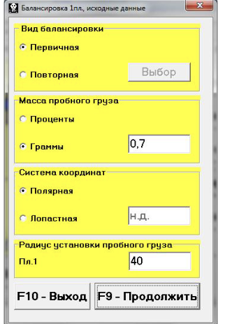

# 7.4. Балансировка в одной плоскости (статическая).

Перед началом работы в режиме «Балансировка в 1-й плоскости» выполните следующие действия:

- Установите датчик вибрации 1 на корпусе машины в выбранной точке измерения и подключите его к входу Х1 измерительного блока.
- Подключите оптический датчик фазового угла 5 к входу Х5 измерительного блока.
- Для использования оптического датчика нанесите на доступную поверхность ротора балансируемой машины специальную метку с отражающей способностью, контрастной по отношению к поверхности ротора.
- Ознакомьтесь с подробными требованиями по выбору места установки датчиков и их креплению, изложенными в Приложении 1.

Работа по программе в режиме «Балансировка в 1-й плоскости» начинается из Главного рабочего окна программы. Для этого:

1. Щёлкните мышкой по кнопке «F2 одноплостная» или нажмите клавишу F2 на клавиатуре.
   - Подтверждением выбора режима является отображение на дисплее компьютера мнемосхемы (см. Рис. 7.1), иллюстрирующей процесс измерения амплитуды и фазы вибрации только по первому измерительному каналу.
2. В Главном рабочем окне программы щёлкните мышкой по кнопке «F7 — Балансировка». После этого на дисплее появится рабочее окно (см. Рис. 7.7), предназначенное для ввода исходных данных при балансировке.

В рабочем окне необходимо выполнить выбор одного из вариантов балансировки:

- **Первичная балансировка**
  - Применяется для роторов, которые ранее не балансировались и для которых в архивной памяти прибора отсутствует информация, необходимая для проведения повторной балансировки.
  - При первичной балансировке в 1-й плоскости требуется выполнение двух пусков машины для тарировки измерительной системы прибора:
    1. Во время первого пуска определяется исходная вибрация машины.
    2. Второй пуск производится после установки на ротор пробного груза, с помощью которого осуществляется тарировка прибора.

- **«Повторная» балансировка**
  - Может выполняться только для ранее отбалансированной машины, для которой уже занесены в память прибора масса пробного груза и коэффициенты балансировки.
  - Для определения массы и места установки корректирующего груза, необходимого для компенсации дисбаланса, требуется всего один пуск ротора балансируемой машины.

Рис. 7.7. Рабочее окно для ввода исходных данных при балансировке в одной плоскости.