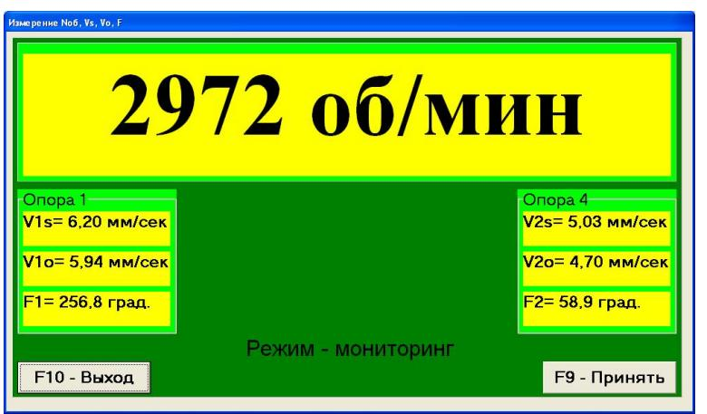

# 7.5.1. Первичная балансировка в 2-х плоскостях

#### 7.5.1.1. Настройка измерительной системы (ввод исходных данных)

Ввод исходных данных для проведения первичной балансировки начинается в рабочем окне «Балансировка в 2 пл. Исходные данные» (см. рис. 7.15).

- В разделе «Вид балансировки» с помощью мышки установите метку в графе «Первичная».
- В разделе «Масса пробного груза» выберите единицы измерения массы:
  - Если выбрать «Граммы», все дальнейшие расчёты массы корректирующего груза будут выполняться в граммах. После этого в соответствующих окнах справа от надписи «Граммы» введите массы пробных грузов, которые будут устанавливаться на роторе.
  - Если выбрать «Проценты», расчёты будут проводиться в процентах относительно массы пробного груза.

> Внимание!  
> При необходимости использования режима «Повторно» массы пробных грузов должны вводиться в граммах.

- В разделе «Система координат» выберите вариант размещения корректирующих грузов на балансируемом роторе: «Полярная» или «Лопастная». Для этого установите метку мышкой рядом с соответствующей надписью.
  - При выборе варианта «Лопастная» введите число лопастей ротора в соответствующем окошке рядом с надписью «Лопастная».

- В следующем разделе окна желательно ввести радиусы установки пробного груза в первой и второй плоскостях балансировки. Это позволит получать дополнительную информацию о величине остаточного дисбаланса ротора в «г * мм».

После завершения ввода исходных данных щёлкните мышкой по кнопке «F9 -- Продолжить» (или нажмите клавишу F9 на клавиатуре). После этого на дисплее появится рабочее окно (см. рис. 7.16), используемое для выполнения полного цикла измерений при балансировке.

### 7.5.1.2. Измерения при проведении балансировки

При балансировке в двух плоскостях режим «Первичная» требует проведения трёх тарировочных пусков и, как минимум, одного проверочного пуска балансируемой машины.

1. **Первый пуск – Измерение без груза**
   - Измерение вибрации на первом пуске начинается в рабочем окне «Балансировка в 2-х плоскостях» (см. рис. 7.16.а) в разделе «Пуск без груза».
   - Готовность программы подтверждается темно-зеленым фоном раздела и подсветкой кнопок «F8 -- Возврат» и «F9 -- Выполнить», расположенных в правой части.

Рис. 7.16.а. Рабочее окно, используемое для измерений при балансировке в 2-х плоскостях

   - Для проведения измерения параметров вибрации в разделе «Пуск без груза» щёлкните мышкой по кнопке «F9 -- Выполнить» (или нажмите F9). При этом замыкается контакт реле 17, что позволяет программно пускать электродвигатель.
   - Одновременно подается команда для начала циклического измерения вибрации в режиме мониторинга. На дисплее выводится рабочее окно «Измерение Nоб, Vs, Vo, F» (см. рис. 7.16.б), где начинается циклический замер вибрации.

Рис. 7.16.б. Рабочее окно, используемое для настроечных измерений при балансировке в 2-х плоскостях в режиме мониторинга

   - Кнопка «F8 -- Возврат» (или клавиша F8) позволяет вернуться к предыдущему окну программы.

2. **Обработка ошибок при измерении**
   - Если отсутствует сигнал с датчика фазового угла (датчик не подключен или поврежден) или частота вращения ротора меньше 300 об/мин, на дисплее появляется предупреждающий транспарант (см. рис. 7.9). Он информирует, что фактическая частота вращения вне пределов измерений.
   - После устранения ошибки, щёлкните кнопку «ОК» на транспаранте.
   - Когда ротор достигает требуемой частоты, в рабочем окне (см. рис. 7.16.б) щёлкните кнопку «F9-Принять». После этого на красном фоне появляется надпись «Режим -- рабочий замер», сигнализирующая о начале рабочего замера вибрации. Процесс измерения может длиться от 2 до 10 секунд.

   - При успешном замере в разделе «Пуск без груза» отображаются результаты: частота вращения ротора (Nоб), значения составляющей СКЗ (Vo1, Vo2) и фазы (F1, F2) вибрации.
   - Цвет фона раздела «Груз в плоскости 1» меняется с салатного на темно-зеленый, а кнопки «F8 -- Возврат» и «F9 -- Выполнить» подсвечиваются, что указывает на готовность прибора к работе на втором пуске.

> Внимание!  
> Если отсутствует сигнал с датчика фазового угла или частота вращения ротора ниже 300 об/мин, на дисплее появляется предупреждающий транспарант (см. рис. 7.9). Для продолжения работы устраните причину ошибки и нажмите «ОК» на транспаранте.

3. **Второй пуск – Измерение в разделе «Груз в плоскости 1»**
   - Перед началом измерения вибрации в разделе «Груз в плоскости 1» остановите вращение ротора и установите пробный груз в первой плоскости. Масса этого груза либо задана ранее (см. рис. 7.15), либо условно принимается за 100 %.
   - Затем снова включите ротор и убедитесь, что машина вышла на рабочий режим.
   - Щёлкните по кнопке «F9 -- Выполнить» (или нажмите F9), после чего начинается цикл измерений, аналогичный первому пуску.
   - По завершении замера выводятся результаты: частота вращения (Nоб), значения СКЗ (Vo1, Vo2) и фазы (F1, F2) вибрации. Цвет фона раздела «Груз в плоскости 2» меняется с салатного на темно-зеленый, а кнопки «F8 -- Возврат» и «F9 -- Выполнить» подсвечиваются, сигнализируя о готовности прибора к работе на следующем пуске.

4. **Подготовка к измерению в разделе «Груз в плоскости 2»**
   - Остановите ротор.
   - Снимите пробный груз, установленный в плоскости 1.
   - Установите пробный груз в плоскости 2.  
     Масса этого груза либо задана ранее (см. рис. 7.15), либо условно принимается за 100 %.
   - Щёлкните по кнопке «F9 -- Выполнить» для начала цикла измерений в данной плоскости.

5. **Переход к расчету корректирующих грузов**
   - После успешного замера (в секциях «Пуск без груза», «Груз в плоскости 1» и «Груз в плоскости 2») рабочее окно обновляется. Поверх окна «Балансировка в 2-х плоскостях» появляется окно «Балансировочные грузы» (см. рис. 7.17), где выводятся результаты расчёта параметров корректирующих грузов.

   - Если используется полярная система координат, на дисплее выводятся:
     - Значения масс (М1, М2)
     - Углы установки (f1, f2) корректирующих грузов.
     
   - Если выбран вариант разложения груза по лопастям, для каждой плоскости отображаются:
     - Номера лопастей (Z1i, Z1j и Z2i, Z2j)
     - Массы грузов, которые необходимо установить.

Рис. 7.17. Рабочее окно с результатами расчёта параметров корректирующих грузов

> Внимание!  
> 1. После третьего пуска остановите вращение ротора и снимите пробный груз. Только после этого можно устанавливать (или снимать) корректирующие грузы.  
> 2. Отсчет углового положения корректирующего груза в полярной системе выполняется от места установки пробного груза; направление отсчета совпадает с вращением ротора.  
> 3. При балансировке по лопастям условно первая лопасть совпадает с местом установки пробного груза; отсчет номера лопасти производится по направлению вращения ротора.  
> 4. По умолчанию программа принимает, что корректирующий груз будет добавлен на ротор. Если корректировка выполняется путём удаления груза (например, путём высверливания), установите метку в поле «Съём». Угловое положение корректирующего груза изменится на 180º.

После установки корректирующих масс нажмите кнопку «Выход - F10» (или клавишу F10) для возврата в окно «Балансировка в 2-х плоскостях». Затем проведите проверку эффективности балансировочной операции.

- При проверочном пуске окно изменяет цвет фона раздела «Проверка» с салатного на темно-зеленый, а кнопка «F9 -- Выполнить» подсвечивается.
- По завершении проверочного пуска результаты (Nоб, Vo1, Vo2, F1, F2) отображаются в соответствующих окнах, а поверх появляется окно «Балансировочные грузы» (см. рис. 7.17) с данными о дополнительных корректирующих грузах и величинами остаточного дисбаланса.

Если остаточные вибрация и дисбаланс удовлетворяют установленным допускам, процесс балансировки может быть завершён. В противном случае продолжите балансировку, устанавливая или снимая дополнительные корректирующие массы согласно параметрам, указанным в окне «Балансировочные грузы». После этого нажмите кнопку «Выход - F10» для продолжения работы.

В рабочем окне «Балансировочные грузы» помимо кнопки «Выход - F10» доступны две управляющие кнопки:
- «Коэффициенты -- F8»
- «В архив - F9»

**Кнопка «Коэффициенты -- F8»**
- Используется для просмотра и запоминания коэффициентов балансировки ротора, рассчитанных по результатам трёх тарировочных пусков.
- При нажатии появляется рабочее окно «Коэффициенты балансировок в 2-х плоскостях» (см. рис. 7.18), где отображаются рассчитанные коэффициенты.

Рис. 7.18. Рабочее окно с коэффициентами балансировки в 2-х плоскостях

Если предполагается дальнейшая балансировка в режиме «Повторная», сохраните указанные коэффициенты:
- Нажмите кнопку «F9 -- Сохранить» и перейдите на вторую страницу окна «Коэффициенты балансировок в 2-х плоскостях» (см. рис. 7.19).
- Введите условное обозначение машины в окошке «Машина» в последней значащей строке таблицы и нажмите кнопку «√» для сохранения данных.
- Нажмите кнопку «Выход - F10» для возврата к предыдущему окну.

**Кнопка «В архив - F9»**
- Используется в рабочем окне «Балансировка в 2-х пл. Установка грузов и дисбаланс» (см. рис. 7.17) для перехода в архив, где автоматически сохраняются результаты балансировок.
- При нажатии появляется окно «Архив балансировок в 2-х плоскостях» (см. рис. 7.20), содержащее исходные и конечные данные текущей балансировки, а также таблицу результатов предыдущих балансировок.

Рис. 7.19. Вторая страница рабочего окна с коэффициентами балансировки в 2-х плоскостях

В окне архива выполняется подготовка результатов последней балансировки для архивного хранения и дальнейшей распечатки протокола:
- Введите название (или условное обозначение) балансируемого механизма в окошке «Имя машины».
- Введите место установки балансируемого механизма в окошке «Место установки».
- Введите допуски, установленные в нормативной документации, в соответствующих окнах «Допуск».

Нажмите кнопку «√» для сохранения данных в памяти компьютера. Затем, нажав кнопку «F9 - Протокол», выведите проект протокола на дисплей, отредактируйте его и, при необходимости, распечатайте или сохраните в виде текстового документа. Этот документ аналогичен протоколу балансировки в одной плоскости (см. рис. 7.14).

Для завершения работы в окне архива щёлкните кнопку «F10 - Выход».

Рис. 7.20. Рабочее окно «Архив балансировки в 2-х плоскостях»