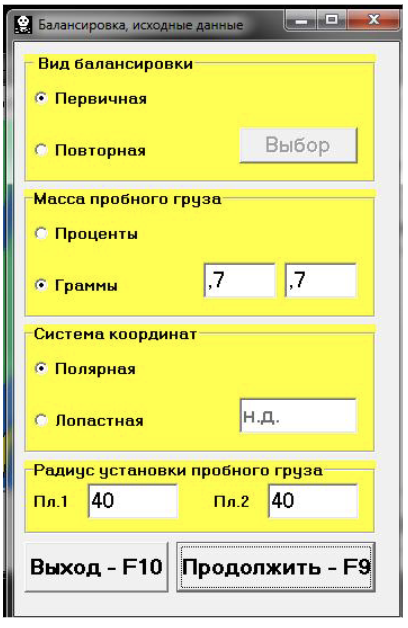

# 7.5. Балансировка в двух плоскостях (динамическая)

Перед началом работы в режиме «Балансировка в 2-х плоскостях» выполните следующие действия:

- Установите датчики вибрации 1 и 4 на корпусе машины в выбранных точках измерения.  
  Подключите их соответственно к входам Х1 и Х4 измерительного блока.
- Подключите оптический датчик фазового угла к входу Х5 измерительного блока.
  - Для использования этого датчика нанесите на доступную поверхность ротора балансируемой машины специальную метку, которая имеет отражающую способность, контрастную по отношению к поверхности ротора.
- Ознакомьтесь с подробными требованиями по выбору места установки датчиков и их креплению, изложенными в Приложении 1.

Как и в случае балансировки в 1-й плоскости, работа по программе в режиме «Балансировка в 2-х плоскостях» начинается из Главного рабочего окна программы.

Для начала работы:

1. Щёлкните мышкой по кнопке «F3 двухплоскостная» (или нажмите клавишу F3 на клавиатуре компьютера).
   - Подтверждением выбора режима является появление на дисплее компьютера мнемосхемы, представленной на рис. 7.2, которая иллюстрирует процесс измерения амплитуды и фазы вибрации по первому и второму измерительным каналам.
2. В Главном рабочем окне программы щёлкните мышкой по кнопке «F7 -- Балансировка».
   - После этого на дисплее компьютера появится рабочее окно для ввода исходных данных при балансировке (см. рис. 7.15).

В данном окне необходимо выбрать один из вариантов балансировки:
- **Первичная балансировка**  
  Используется для роторов машин, которые ранее не балансировались и для которых в архивной памяти компьютера отсутствует необходимая информация (численные значения коэффициентов балансировки и массы пробного груза).  
  При первичной балансировке в 2-х плоскостях требуется проведение трёх пусков машины:
  - Первый пуск – определение исходной вибрации машины.
  - Второй пуск – после установки пробного груза в первой балансировочной плоскости.
  - Третий пуск – после установки пробного груза во второй балансировочной плоскости.
- **Повторная балансировка**  
  Выполняется только для уже отбалансированных машин, для которых определены и занесены в память прибора масса пробного груза и коэффициенты балансировки.  
  Для определения масс и мест установки корректирующих грузов, необходимых для компенсации дисбаланса, требуется всего один пуск ротора балансируемой машины.

Рис. 7.15. Рабочее окно для ввода исходных данных при балансировке в двух плоскостях.