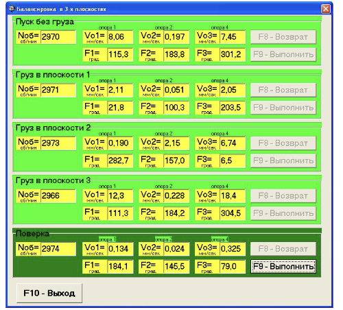
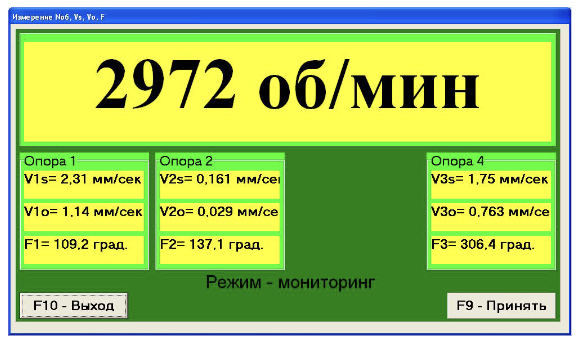
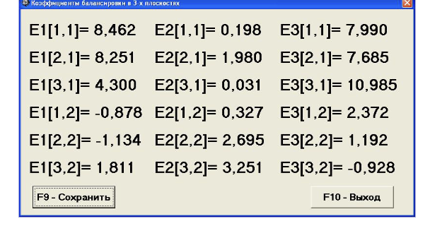
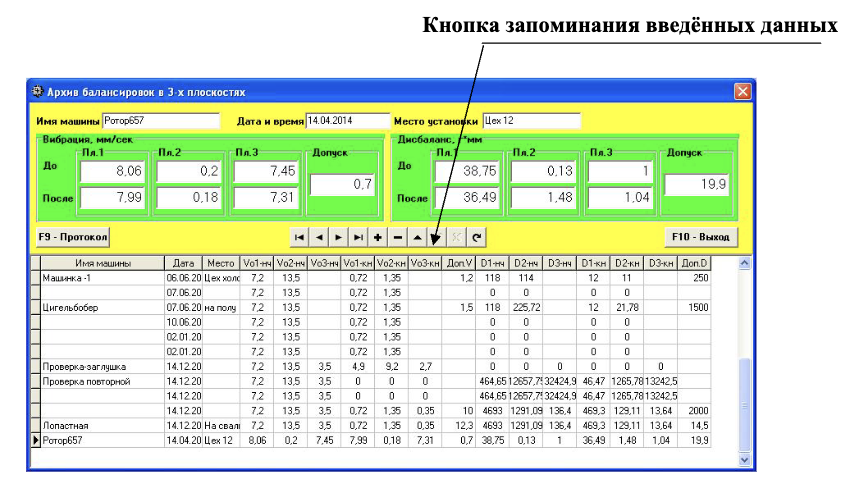

# 7.6.1. Первичная балансировка в 3-х плоскостях

## 7.6.1.1. Настройка измерительной системы (ввод исходных данных)

Ввод исходных данных для проведения первичной балансировки начинается в рабочем окне «Балансировка в 3 пл. Исходные данные» (см. рис. 7.21).

- В разделе «Вид балансировки» с помощью мышки установите метку в графе «Первичная».
- Далее, в разделе «Масса пробного груза», выберите единицы измерения массы пробного груза:
  - Если выбраны **«Проценты»**, все дальнейшие расчёты массы корректирующего груза будут выполняться в процентах по отношению к массе пробного груза.
  - Если выбраны **«Граммы»**, расчёты будут проводиться в граммах. В этом случае в окошках, расположенных справа от надписи «Граммы», введите массы пробных грузов, которые будут устанавливаться на роторе в 1-й, 2-й и 3-й плоскостях коррекции.

> **Внимание!**  
> При необходимости использования в дальнейшей работе режима «Повторно» при первичной балансировке массы пробных грузов должны обязательно вводиться в граммах.

- В разделе «Система координат» выберите один из вариантов размещения корректирующих грузов на балансируемом роторе — в «Полярной» или «Лопастной» системе координат. Для этого с помощью мышки поставьте метку рядом с соответствующей надписью.
  - В случае выбора варианта размещения грузов по лопастям рабочего колеса балансируемой машины, введите число лопастей ротора в соответствующем окошке, расположенном рядом с надписью «Лопастная».
- В следующем разделе рабочего окна рекомендуется ввести радиусы установки пробного груза в первой, второй и третьей плоскостях коррекции. Это позволит получать дополнительную информацию о величине остаточного дисбаланса ротора в «г * мм».

После завершения ввода исходных данных щёлкните мышкой по кнопке «F9 -- Продолжить» (или нажмите клавишу F9 на клавиатуре компьютера). После этого на дисплее появится рабочее окно (см. рис. 7.22), используемое для выполнения полного цикла измерений при балансировке.

## 7.6.1.2. Измерения при проведении балансировки

При проведении балансировки в трёх плоскостях в режиме «Первичная» балансировка требуется выполнение четырех тарировочных пусков и, как минимум, одного проверочного пуска балансируемой машины.

1. **Первый пуск – Измерение в разделе «Пуск без груза»**
   - Измерение вибрации на первом пуске машины начинается в рабочем окне «Балансировка в 3-х плоскостях» (см. рис. 7.22.а) в разделе «Пуск без груза».
   - Готовность программы к работе в данном разделе подтверждается:
     - темно-зеленым цветом фона раздела, и
     - подсветкой кнопок «F8 -- Возврат» и «F9 -- выполнить», расположенных в правой части.
   - Кнопка «F8 -- Возврат» (или функциональная клавиша F8) может использоваться для возврата в предыдущее рабочее окно программы.
   
   - Щёлкните мышкой по кнопке «F9 -- Выполнить» (или нажмите клавишу F9 на клавиатуре компьютера). После этого замыкается нормально разомкнутый контакт реле 17, который можно использовать для программного пуска электродвигателя станка.
   - Одновременно подается команда на начало циклического измерения вибрации в режиме мониторинга. При этом на дисплее прибора выводится рабочее окно «Измерение Nоб, Vs, Vo, F» (см. рис. 7.22.б), в котором начинается циклический замер вибрации (режим – мониторинга).

Рис. 7.22.а. Рабочее окно, используемое для измерений при балансировке в 3-х плоскостях

Рис. 7.22.б. Рабочее окно, используемое для настроечных измерений при балансировке в 3-х плоскостях в режиме мониторинга

> **Внимание!**  
> В случае, когда при измерении отсутствует сигнал с датчика фазового угла (датчик не подключен к прибору или поврежден), или когда частота вращения ротора меньше 300 об/мин, на дисплей компьютера выводится предупреждающий транспарант (см. рис. 7.9), указывающий, что фактическая частота вращения ротора находится вне пределов измерений.  
> После устранения причины ошибки для продолжения работы по программе нажмите («щёлкните мышкой») кнопку «ОК» на транспаранте.
>  
> При наборе балансируемым ротором требуемой частоты вращения в рабочем окне (см. рис. 7.22.б) нажмите кнопку «F9-Принять». После этого в рабочем окне на красном фоне выводится надпись «Режим -- рабочий замер», указывающая, что начинается рабочий замер вибрации. Замер вибрации и обработка результатов измерений могут длиться от 2 до 10 секунд.

2. **Второй пуск – Измерения в разделе «Груз в плоскости 1»**
   - Перед началом измерения параметров вибрации в разделе «Груз в плоскости 1» остановите вращение ротора балансируемой машины и установите на нём в первой плоскости пробный груз. Масса этого груза либо задана при подготовке к измерениям в память прибора в рабочем окне «Балансировка в 3-х плоскостях. Исходные данные» (см. рис. 7.21), либо условно принимается за 100 %.
   - Щёлкните мышкой по кнопке «F9 -- Выполнить» (или нажмите клавишу F9 на клавиатуре компьютера), после чего начинается цикл измерений, описанный при выполнении первого пуска.
   - По завершении замера на втором пуске результаты измерений частоты вращения ротора (Nоб), а также значения составляющих СКЗ (Vo1, Vo2, Vo3) и фаз (F1, F2, F3) вибрации выводятся в соответствующих окошках рабочего окна «Балансировка в 3-х плоскостях».
   - При этом цвет фона раздела «Груз в плоскости 1» меняется с салатного на темно-зеленый, а кнопки «F8 -- Возврат» и «F9 -- выполнить» подсвечиваются, что указывает на готовность прибора к работе на втором пуске.

3. **Третий пуск – Измерения в разделе «Груз в плоскости 2»**
   - Перед началом измерения параметров вибрации в разделе «Груз в плоскости 2»:
     - Остановите вращение ротора балансируемой машины.
     - Снимите пробный груз, ранее установленный в плоскости 1.
     - Установите пробный груз в плоскости 2. Масса этого груза либо задана при подготовке к измерениям (см. рис. 7.21), либо условно принимается за 100 %.
   - Щёлкните мышкой по кнопке «F9 -- Выполнить» (или нажмите клавишу F9) для начала цикла измерений.
   - По завершении замера на третьем пуске результаты измерений выводятся в соответствующих окошках рабочего окна «Балансировка в 3-х плоскостях». При этом цвет фона раздела «Груз в плоскости 2» меняется с салатного на темно-зеленый, а кнопки «F8 -- Возврат» и «F9 -- выполнить» подсвечиваются, что указывает на готовность прибора к работе на следующем этапе.

4. **Четвертый пуск – Измерения в разделе «Груз в плоскости 3»**
   - Перед началом измерения параметров вибрации в разделе «Груз в плоскости 3»:
     - Остановите вращение ротора балансируемой машины.
     - Снимите пробный груз, ранее установленный в плоскости 2.
     - Установите пробный груз в плоскости 3. Масса этого груза либо задана при подготовке к измерениям (см. рис. 7.21), либо условно принимается за 100 %.
   - Вновь включите вращение ротора и убедитесь, что машина вышла на рабочий режим.
   - Нажмите кнопку «F9 -- Выполнить» (или соответствующую клавишу), после чего начинается цикл измерений, аналогичный первому пуску.
   - После завершения замера на четвёртом пуске результаты измерений (Nоб, Vo1, Vo2, Vo3, F1, F2, F3) выводятся в соответствующих окошках.

5. **Проверочный пуск**
   - При этом цвет фона раздела «Проверка» меняется с салатного на темно-зеленый, а кнопки «F8 -- Возврат» и «F9 -- выполнить» подсвечиваются, что указывает на готовность прибора к работе на проверочном пуске.
   - Одновременно поверх рабочего окна «Балансировка в 3-х плоскостях» появляется рабочее окно «Балансировочные грузы» (см. рис. 7.23), в котором выводятся результаты расчёта параметров корректирующих грузов, которые необходимо установить на роторе в первой, второй и третьей плоскостях для компенсации его дисбаланса.
     - В случае использования полярной системы координат на дисплее выводятся значения масс (М1, М2, М3) и углов установки (f1, f2, f3) корректирующих грузов.
     - При разложении корректирующего груза по лопастям выводятся номера лопастей (Z1i, Z1j, Z2i, Z2j, Z3i, Z3j) балансируемого ротора и массы грузов, которые необходимо установить на них.

Рис. 7.23. Рабочее окно с результатами расчета параметров корректирующих грузов в трёх плоскостях

### Последующие этапы балансировки

- **Перед установкой корректирующих грузов:**  
  После завершения процесса измерения на четвёртом пуске остановите вращение ротора и снимите с него установленный ранее пробный груз. Только после этого можно приступать к установке (или съему) корректирующих грузов.
  
- **Отсчёт углового положения:**  
  Отсчет углового положения места добавления (или удаления) корректирующего груза в полярной системе координат выполняется от места установки пробного груза. Направление отсчёта угла совпадает с направлением вращения ротора.
  
- **Балансировка по лопастям:**  
  При балансировке по лопастям условно первая лопасть совпадает с местом установки пробного груза. Отсчёт номера лопасти, указанной на дисплее, выполняется по направлению вращения ротора.
  
- **Корректирующий груз по умолчанию:**  
  В данной версии программы по умолчанию принимается, что корректирующий груз будет добавлен на ротор (это свидетельствует метка, установленная в поле «Добавление»).  
  Если дисбаланс корректируется путём удаления груза (например, высверливанием), установите с помощью мышки метку в поле «Съём». Угловое положение корректирующего груза автоматически изменится на 180º.

После установки корректирующих грузов нажмите кнопку «Выход - F10» (или функциональную клавишу F10) и вернитесь в предыдущее рабочее окно «Балансировка в 3-х плоскостях» для проведения проверки эффективности балансировочной операции.

- При проверочном пуске цвет фона раздела «Проверка» меняется с салатного на темно-зеленый, а кнопка «F9 -- Выполнить» подсвечивается, что указывает на готовность прибора к работе на пятом (проверочном) пуске.
- По завершении проверочного пуска результаты измерений (Nоб, Vo1, Vo2, Vo3, F1, F2, F3) выводятся в соответствующих окошках.
- Одновременно поверх рабочего окна появляется рабочее окно «Балансировочные грузы» (см. рис. 7.23), в котором выводятся результаты расчёта дополнительных корректирующих грузов для компенсации остаточного дисбаланса, а также величины остаточного дисбаланса ротора, достигнутые после балансировки.

Если величины остаточной вибрации и/или остаточного дисбаланса удовлетворяют требованиям допусков, установленных в технической документации, процесс балансировки может быть завершён. В противном случае балансировку можно продолжить, устанавливая (или снимая) дополнительные корректирующие массы, параметры которых указаны в окне «Балансировочные грузы». После чего нажмите кнопку «Выход - F10» для продолжения работы.

### Управляющие кнопки в рабочем окне «Балансировочные грузы»

Помимо кнопки «Выход - F10» могут использоваться ещё две управляющие кнопки:

- **Коэффициенты — F8**  
  По нажатию этой кнопки (или клавиши F8) на дисплее появляется рабочее окно «Коэффициенты балансировок в 3-х плоскостях» (см. рис. 7.24), в котором выводятся коэффициенты балансировки, рассчитанные по результатам четырех тарировочных пусков.

  
  Рис. 7.24. Рабочее окно с коэффициентами балансировки в 3-х плоскостях

  Если при последующей балансировке данной машины предполагается использовать режим «Повторная», указанные коэффициенты необходимо сохранить в памяти компьютера:
  
  - Нажмите кнопку «F9 -- Сохранить» и перейдите на вторую страницу окна «Коэффициенты балансировок в 3-х плоскостях» (см. рис. 7.25).
  
    
    Рис. 7.25. Вторая страница рабочего окна с коэффициентами балансировки в 3-х плоскостях
  
  - Введите условное обозначение машины в окошке «Машина» в последней значащей строке таблицы и щёлкните кнопку «√» для сохранения данных.
  - Вернитесь в предыдущее окно, нажав кнопку «Выход - F10».

- **В архив — F9**  
  Эта кнопка в рабочем окне «Балансировка в 3-х пл. Установка грузов и дисбаланс» (см. рис. 7.23) используется для перехода в архив, где автоматически сохраняются результаты балансировок.  
  После её нажатия на дисплее появляется рабочее окно «Архив балансировок в 3-х плоскостях» (см. рис. 7.26).

### Архив балансировок

В рабочем окне «Архив балансировок в 3-х плоскостях» (см. рис. 7.26) отображаются исходные и конечные данные текущей балансировки, а также таблица с результатами всех предыдущих балансировок. Здесь выполняется подготовка результатов последней балансировки для архивного хранения и последующей печати протокола. Подготовка включает:

- Ввод названия (или условного обозначения) балансируемого механизма в окошке «Имя машины».
- Ввод места установки балансируемого механизма в окошке «Место установки».
- Ввод допусков, установленных в нормативной документации на вибрацию и остаточный дисбаланс, в соответствующих окошках «Допуск».

После ввода данных щёлкните кнопку «√», расположенную в ряду управляющих кнопок рабочего окна «Архив балансировок в 3-х плоскостях». Затем, нажав кнопку «F9 - Протокол», можно вывести на дисплей проект протокола, отредактировать его и, при необходимости, распечатать или сохранить в виде текстового документа. Этот документ аналогичен протоколу балансировки в одной плоскости (см. рис. 7.14). Для завершения работы в данном окне нажмите кнопку «F10 - Выход».

Рис. 7.26. Рабочее окно «Архив балансировки в 3-х плоскостях»