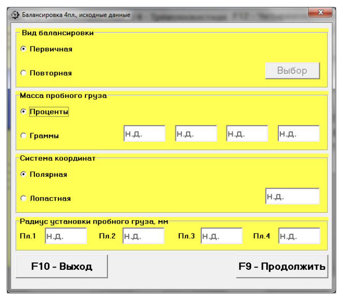
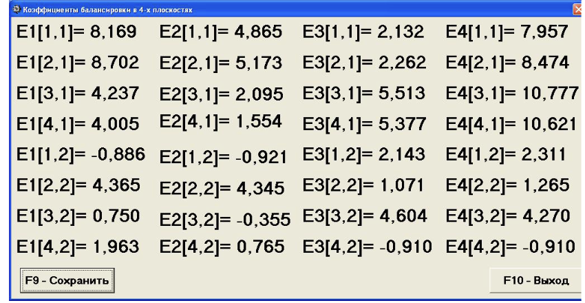

# 7.7. Балансировка в четырёх плоскостях (динамическая)

Перед началом работы в режиме «Балансировка в 4-х плоскостях» выполните следующие действия:

- Установите датчики вибрации 1, 2, 3 и 4 на корпусе машины в выбранных точках измерения и подключите их соответственно к входам Х1, Х2, Х3 и Х4 измерительного блока.
- Подключите оптический датчик фазового угла к входу Х5 измерительного блока.
  - Для использования датчика нанесите на доступную поверхность ротора балансируемой машины специальную метку с отражающей способностью, контрастной по отношению к отражающей способности поверхности ротора.
- Ознакомьтесь с подробными требованиями по выбору места установки датчиков и их креплению, изложенными в Приложении 1.

Работа по программе в данном режиме начинается из Главного рабочего окна программы. Для начала выполните следующие шаги:

1. Щёлкните мышкой по кнопке «F12 четырёхплоскостная» (или нажмите клавишу F12).
   - Подтверждением выбора режима является появление на дисплее мнемосхемы (см. рис. 7.4), иллюстрирующей процесс измерения амплитуды и фазы вибрации по каналам 1, 2, 3 и 4.
2. Далее, в Главном рабочем окне щёлкните по кнопке «F7 -- Балансировка».
   - После этого появится рабочее окно для ввода исходных данных при балансировке (см. рис. 7.27).

В этом окне выбирается один из вариантов балансировки:

- **Первичная балансировка**
  - Выполняется для роторов, которые ранее не балансировались и для которых отсутствует информация, необходимая для проведения «Повторной» балансировки (коэффициенты балансировки и масса пробного груза).
  - При первичной балансировке в четырёх плоскостях требуется проведение:
    - Четырёх пусков, необходимых для тарировки измерительной системы прибора:
      1. Первый пуск – определение исходной вибрации.
      2. Второй пуск – после установки пробного груза в 1-й плоскости.
      3. Третий пуск – после установки пробного груза во 2-й плоскости.
      4. Четвёртый пуск – после установки пробного груза в 3-й плоскости.
      - Далее могут выполняться дополнительные пуски для проверки.
- **Повторная балансировка**
  - Выполняется для машин, для которых уже были определены и занесены в память прибора масса пробного груза и коэффициенты балансировки.
  - В этом случае для определения масс и мест установки корректирующих грузов требуется всего один пуск ротора.

Рис. 7.27. Рабочее окно для ввода исходных данных при балансировке в четырёх плоскостях

---

## 7.7.1. Первичная балансировка в 4-х плоскостях

### 7.7.1.1. Настройка измерительной системы (ввод исходных данных)

- Введите исходные данные в рабочем окне «Балансировка в 4 пл. Исходные данные» (см. рис. 7.27).
- В разделе «Вид балансировки» установите с помощью мышки метку в графе «Первичная».
- В разделе «Масса пробного груза» выберите единицы измерения:
  - Если выбраны **«Проценты»** – расчёты массы корректирующего груза будут выполняться в процентах относительно массы пробного груза.
  - Если выбраны **«Граммы»** – расчёты будут проводиться в граммах. В этом случае введите массы пробных грузов для 1-й, 2-й, 3-й и 4-й плоскостей.
  
> **Внимание!**  
> При использовании режима «Повторно» массы пробных грузов должны вводиться в граммах.

- В разделе «Система координат» выберите вариант размещения корректирующих грузов:
  - Варианты: «Полярная» или «Лопастная».
  - Если выбираете «Лопастная», введите число лопастей ротора в соответствующем окошке.
- В следующем разделе введите радиусы установки пробного груза в каждой из четырёх плоскостей коррекции. Это позволит получать информацию о величине остаточного дисбаланса ротора в «г * мм».

Щёлкните по кнопке «F9 -- Продолжить» (или нажмите F9). После этого появится рабочее окно для выполнения полного цикла измерений при балансировке (см. рис. 7.28).

### 7.7.1.2. Измерения при проведении балансировки

При первичной балансировке в 4-х плоскостях требуется выполнение пяти тарировочных пусков и, как минимум, одного проверочного пуска.

1. **Первый пуск – Пуск без груза**
   - Начните измерение вибрации в рабочем окне «Балансировка в 4-х плоскостях» (см. рис. 7.28.а) в разделе «Пуск без груза».
   - Готовность программы подтверждается:
     - Темно-зеленым фоном раздела.
     - Подсветкой кнопок «F8 -- Возврат» и «F9 -- выполнить».
   - Для начала измерения щёлкните на кнопке «F9 -- Выполнить».
     - При этом замыкается контакт реле 17, используемый для программного пуска электродвигателя.
     - Одновременно подаётся команда на циклический замер вибрации в режиме мониторинга. Результаты замера выводятся в окне «Измерение Nоб, Vs, Vo, F» (см. рис. 7.28.б).

   
   Рис. 7.28.а. Рабочее окно, используемое для измерений при балансировке в 4-х плоскостях

   
   Рис. 7.28.б.

2. **Внимание!**
   - Если отсутствует сигнал с датчика фазового угла или частота вращения ротора меньше 300 об/мин, на дисплее появляется предупреждающий транспарант (см. рис. 7.9).
   - После устранения ошибки щёлкните кнопку «ОК».
   - При достижении требуемой частоты нажмите кнопку «F9-Принять». В рабочем окне появится надпись «Режим -- рабочий замер», и начинается рабочий замер вибрации.
   - Продолжительность замера зависит от выбранной частоты: от 2 до 10 секунд.

3. **Второй пуск – Измерения в разделе «Груз в плоскости 1»**
   - Перед замером остановите вращение ротора и установите пробный груз в 1-й плоскости.
     - Масса грузa либо задана при подготовке (см. рис. 7.27), либо принимается условно за 100%.
   - Нажмите кнопку «F9 -- Выполнить», чтобы начать цикл измерений.
   - После завершения замера результаты (Nоб, Vо1–Vо4, F1–F4) выводятся в соответствующих окнах.
   - Цвет фона раздела «Груз в плоскости 1» меняется с салатного на темно-зеленый, а кнопки «F8 -- Возврат» и «F9 -- выполнить» подсвечиваются.

4. **Третий пуск – Измерения в разделе «Груз в плоскости 2»**
   - Для начала:
     - Остановите вращение ротора.
     - Снимите груз, установленный в плоскости 1.
     - Установите пробный груз в плоскости 2 (масса задана или условно принята за 100%).
   - Нажмите «F9 -- Выполнить» для начала замера.
   - По завершении замера результаты выводятся в соответствующих окнах.
   - Фон раздела «Груз в плоскости 2» меняется на темно-зеленый с подсветкой кнопок.

5. **Четвёртый пуск – Измерения в разделе «Груз в плоскости 3»**
   - Перед замером:
     - Остановите ротор.
     - Снимите груз, установленный в плоскости 2.
     - Установите пробный груз в плоскости 3 (масса задана или условно 100%).
   - Нажмите «F9 -- Выполнить».
   - Результаты замера (Nоб, Vо1–Vо4, F1–F4) выводятся по завершении, а фон раздела меняется на темно-зеленый.

6. **Пятый пуск – Измерения в разделе «Груз в плоскости 4»**
   - Перед замером:
     - Остановите ротор.
     - Снимите груз, установленный в плоскости 3.
     - Установите пробный груз в плоскости 4 (масса задана или условно 100%).
   - Нажмите «F9 -- Выполнить» для начала замера.
   - После замера результаты выводятся в соответствующих окошках.

7. **Проверочный пуск**
   - После измерений в разделах «Груз в плоскостях 1–4» цвет фона раздела «Проверка» меняется с салатного на темно-зеленый, а кнопки «F8 -- Возврат» и «F9 -- выполнить» подсвечиваются.
   - Одновременно поверх рабочего окна появляется окно «Балансировочные грузы» (см. рис. 7.29), в котором выводятся результаты расчёта параметров корректирующих грузов для установки в 1-й и 2-й плоскостях.
     - При использовании полярной системы координат выводятся значения масс (М1, М2, М3, М4) и углов установки (f1, f2, f3, f4).
     - При разложении грузов по лопастям выводятся номера лопастей (например, Z1i, Z1j, Z2i, Z2j, Z3i, Z3j, Z4i, Z4j) и массы грузов.
   - После проверки данные отображаются, и, если вибрация или остаточный дисбаланс удовлетворяют допускам, процесс балансировки завершается.
   - Если допуски не соблюдены, производится корректировка (повторная установка или удаление дополнительных грузов).

> **Внимание!**
> - После завершения измерений на пятом пуске остановите ротор и снимите пробный груз, прежде чем устанавливать или снимать корректирующие грузы.
> - Отсчёт углового положения корректирующего груза в полярной системе производится от места установки пробного груза, с направлением отсчёта, совпадающим с направлением вращения ротора.
> - При балансировке по лопастям первая лопасть условно считается совпадающей с местом установки пробного груза.
> - По умолчанию считается, что груз добавляется (метка «Добавление»). Для корректировки путём удаления груза установите метку «Съём» – угловое положение изменится на 180º.

После установки корректирующих грузов нажмите кнопку «Выход - F10» (или F10) для возврата в рабочее окно «Балансировка в 4-х плоскостях» и проведения проверки эффективности балансировки. При проверочном пуске фон раздела «Проверка» меняется на темно-зеленый и активируется кнопка «F9 -- Выполнить». После проверки выводятся результаты измерений (Nоб, Vо1–Vо4, F1–F4) и данные о дополнительных корректирующих грузах для компенсации остаточного дисбаланса.

---

### Управляющие кнопки в рабочем окне «Балансировочные грузы»

Помимо кнопки «Выход - F10» используются следующие кнопки:

- **Коэффициенты — F8**
  - Позволяет просмотреть и запомнить коэффициенты балансировки, рассчитанные по результатам пяти тарировочных пусков.
  - При нажатии открывается рабочее окно «Коэффициенты балансировок в 4-х плоскостях» (см. рис. 7.30).

  
  Рис. 7.30. Рабочее окно с коэффициентами балансировки в 4-х плоскостях

  - Для сохранения коэффициентов для последующих повторных балансировок нажмите кнопку «F9 -- Сохранить» и перейдите на вторую страницу этого окна (см. рис. 7.31).

  
  Рис. 7.31. Вторая страница рабочего окна с коэффициентами балансировки в 4-х плоскостях

  - Введите условное обозначение машины в поле «Машина» и щёлкните кнопку «√» для сохранения.
  - Вернитесь в предыдущее окно, нажав «Выход - F10».

- **В архив — F9**
  - Используется в рабочем окне «Балансировка в 4-х пл. Установка грузов и дисбаланс» (см. рис. 7.29) для перехода в архив балансировок.
  - При нажатии открывается рабочее окно «Архив балансировок в 4-х плоскостях» (см. рис. 7.32).

  В этом окне:
  - Введите название или условное обозначение балансируемого механизма в поле «Имя машины».
  - Укажите место установки в поле «Место установки».
  - Введите допуски, установленные нормативной документацией, в поле «Допуск».
  - Щёлкните кнопку «√» для сохранения данных.
  - Для вывода протокола нажмите кнопку «F9 - Протокол», отредактируйте и, при необходимости, распечатайте или сохраните документ.
  - Завершите работу, нажав кнопку «F10 - Выход».

  
  Рис. 7.32. Рабочее окно «Архив балансировки в 4-х плоскостях»

Кнопка запоминания введённых данных также присутствует для сохранения результатов.
  
---

## 7.7.2. Повторная балансировка в 4-х плоскостях

(Секция повторной балансировки описывается аналогично процедурам первичной балансировки, с отличием в выборе режима и автоматическом заполнении исходных данных из архива коэффициентов. При повторной балансировке требуется проведение всего одного настроечного пуска и, как минимум, одного проверочного пуска, в соответствии с рекомендациями, изложенными в разделе 7.7.1.2.)