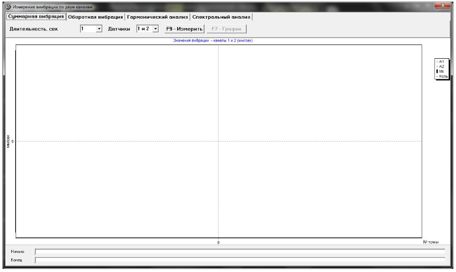

# 7.8. Работа в режиме «Графики»

Работа в режиме «Графики» начинается из Главного рабочего окна программы (см. рис. 7.1) при нажатии кнопки «F8 -- Графики». После этого на дисплее компьютера открывается окно «Измерение вибрации по двум каналам. Графики» (см. рис. 7.33).

Рис. 7.33. Рабочее окно «Измерение вибрации по двум каналам. Графики»

В данном окне можно построить четыре варианта графиков вибрации:

- **Первый вариант** – графики временной функции суммарной вибрации (по виброскорости) по парам каналов 1 и 2 или 3 и 4.
- **Второй вариант** – графики вибрации, проявляющейся на оборотной частоте ротора и её более высоких гармонических составляющих. Эти графики получаются в результате синхронной фильтрации временной функции суммарной вибрации.
- **Третий вариант** – графики вибрации с результатами гармонического анализа.
- **Четвёртый вариант** – графики вибрации с результатами спектрального анализа.

---

## 7.8.1. Графики суммарной вибрации

Для построения графиков суммарной вибрации в рабочем окне необходимо:

- **Выбрать режим работы «Суммарная вибрация»**  
  Щёлкните мышкой по соответствующей кнопке.
- **Задать время измерения вибрации**  
  В окошке «Длительность, сек» щёлкните по кнопке «▼» и выберите из выпадающего списка нужную длительность: 1, 5, 10, 15 или 20 секунд.
- **Выбрать датчики**  
  В окошке «Датчики» выберите пару каналов 1 и 2 или 3 и 4, для которых будет проводиться измерение.

После настройки параметров нажмите кнопку «F9 -- Измерить». Начнётся процесс измерения вибрации одновременно по двум каналам.

По завершении измерения в рабочем окне появятся графики временной функции суммарной вибрации для обоих выбранных каналов (см. рис. 7.34):

- График канала с меньшим номером (1 или 3) изображается красным.
- График канала с большим номером (2 или 4) изображается зелёным.

На графиках по оси Х откладывается время, а по оси У — амплитуда виброскорости в мм/сек.

Рис. 7.34. Рабочее окно для вывода графиков временной функции суммарной вибрации

На этих графиках также присутствуют синие метки, которые «привязывают» графики к частоте вращения ротора (начало или завершение очередного оборота). При необходимости изменения масштаба графика по оси Х можно использовать движок, обозначенный стрелкой на рисунке.

---

## 7.8.2. Графики оборотной вибрации

Для построения графиков оборотной вибрации:

1. В рабочем окне «Измерение вибрации по двум каналам. Графики» выберите режим работы «Оборотная вибрация» щёлчком по соответствующей кнопке.
2. В появившемся окне «Оборотная вибрация» в окошке «Датчики» выберите нужную пару каналов (1 и 2 или 3 и 4) для измерения.
3. После этого нажмите кнопку «F9 -- Измерить». Начнётся измерение вибрации одновременно по двум каналам.

Рис. 7.35. Рабочее окно для вывода графиков оборотных составляющих вибрации

После завершения измерения и математической обработки (синхронной фильтрации временной функции суммарной вибрации) на дисплее выводятся графики оборотных составляющих вибрации для обоих каналов в пределах одного оборота ротора:

- График для канала с меньшим номером (1 или 3) отображается красным.
- График для канала с большим номером (2 или 4) — зелёным.

На этих графиках по оси Х откладывается угол поворота ротора (от метки до метки), а по оси У — амплитуда виброскорости в мм/сек.

Кроме того, в верхней части рабочего окна (справа от кнопки «F9 -- Измерить») выводятся цифровые значения измерений:
- СКЗ суммарной вибрации (Vis, Vjs)
- СКЗ (Vio, Vjo) и фазы (Fi, Fj) 1-й гармоники оборотной вибрации
- Частота вращения ротора (Nоб)

> **Внимание!**  
> При работе в данном режиме необходимо использовать датчик фазового угла.

---

## 7.8.3. Графики вибрации с результатами гармонического анализа

Для построения графиков с результатами гармонического анализа:

1. В рабочем окне «Измерение вибрации по двум каналам. Графики» выберите режим «Гармонический анализ» щёлкнув по соответствующей кнопке.
2. В появившемся окне «Гармонический анализ» в окошке «Датчики» выберите нужную пару каналов (1 и 2 или 3 и 4).
3. Задайте число оборотов ротора, за которые будут проводиться измерения. Для этого щёлкните по кнопке «▼» и выберите период: 1, 2, 4 или 8 оборотов.
4. После настройки нажмите кнопку «F9 -- Измерить».

После завершения измерения в рабочем окне (см. рис. 7.36) появятся:
- Верхний график — временная функция вибрации.
- Нижний график — спектр гармонических составляющих вибрации, где по оси Х откладывается номер гармоники, а по оси У — СКЗ виброскорости в мм/сек.

При этом:
- График канала с меньшим номером (1 или 3) отображается красным, а с большим номером (2 или 4) — зелёным.

> **Внимание!**  
> При работе в данном режиме необходимо использовать датчик фазового угла.

Рис. 7.36. Рабочее окно для вывода спектра гармонических составляющих вибрации

---

## 7.8.4. Графики вибрации с результатами спектрального анализа

Для построения графиков с результатами узкополосного спектрального анализа:

1. В рабочем окне «Измерение вибрации по двум каналам. Графики» выберите режим «Спектральный анализ» щёлчком по соответствующей кнопке.
2. В появившемся окне «Спектральный анализ» выберите частотный диапазон для измерений. Для этого щёлкните по кнопке «▼» и выберите одно из значений: 64 Гц, 128 Гц, 320 Гц или 640 Гц.
   - При выборе частотного диапазона учтите:
     - 64 Гц – полоса анализа 0,5 Гц.
     - 128 Гц – полоса анализа 1 Гц.
     - 320 Гц – полоса анализа 2,5 Гц.
     - 640 Гц – полоса анализа 5 Гц.
3. Выберите в окошке «Датчики» нужную пару каналов (1 и 2 или 3 и 4).
4. Нажмите кнопку «F9 -- Измерить». Начнётся измерение вибрации одновременно по двум каналам.

После завершения измерения в рабочем окне (см. рис. 7.37) появляются:
- Верхний график — временная функция.
- Нижний график — спектр вибрации, на котором по оси Х откладывается частота составляющей в Гц, а по оси У — СКЗ виброскорости в мм/сек.

При этом:
- Вибрация канала с меньшим номером (1 или 3) отображается красным цветом, а с большим номером (2 или 4) — зелёным.

Рис. 7.37. Рабочее окно для вывода узкополосного спектра вибрации.