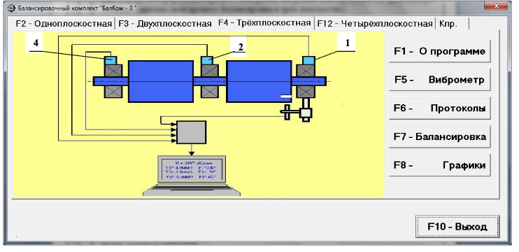

# 7. РАБОТА С ПРИБОРОМ

## 7.1. Главное рабочее окно программы. Назначение основных управляющих кнопок

При запуске программы «БалКом-4» на дисплее компьютера появляется Главное рабочее окно, представленное на рис. 7.1.

Рис. 7.1. Главное рабочее окно программы "БалКом-4"

В этом окне расположены 11 виртуальных кнопок, на которых указаны функции, выполняемые при их нажатии. Для активации выбранной кнопки необходимо навести на неё указатель мыши и щёлкнуть левой клавишей.

Управление в Главном окне можно осуществлять также с помощью функциональных клавиш клавиатуры компьютера, обозначения которых нанесены на соответствующие кнопки окна.

### 7.1.1. Кнопка «F1 – о программе»

При нажатии этой кнопки (или клавиши F1) пользователь получает краткую информацию о назначении программы, а также имеет возможность ознакомиться с Руководством по эксплуатации прибора «БалКом-4».

### 7.1.2. Кнопки «F2 – одноплоскостная», «F3 – двухплоскостная», «F4 – трёхплоскостная», «F12 – четырёхплоскостная»

- **Кнопка «F2 – одноплоскостная»**  
  При нажатии (или клавиши F2) производится выбор режима измерения вибрации в одной плоскости с использованием датчика вибрации 1, подключённого к входу Х1 измерительного блока.
  - После нажатия сохраняется мнемосхема, иллюстрирующая измерение вибрации по первому измерительному каналу (или балансировку в одной плоскости).

- **Кнопка «F3 – двухплоскостная»**  
  При нажатии (или клавиши F3) производится выбор режима измерения вибрации одновременно в двух плоскостях с использованием датчиков вибрации 1 и 4, подключённых к входам Х1 и Х4.
  - После нажатия на дисплее появляется мнемосхема, представленная на рис. 7.2, иллюстрирующая измерение по двум каналам (или балансировку в двух плоскостях).

  
  Рис. 7.2. Вид Главного рабочего окна программы «БалКом-4» после нажатия кнопки «F3 – двухплоскостная»

- **Кнопка «F4 – трёхплоскостная»**  
  При нажатии (или клавиши F4) производится выбор режима измерения вибрации в трёх плоскостях с использованием датчиков вибрации 1, 2 и 4, подключённых к входам Х1, Х2 и Х4.
  - После нажатия на дисплее появляется мнемосхема, представленная на рис. 7.3, иллюстрирующая измерение по трём каналам (или балансировку в трёх плоскостях).

- **Кнопка «F12 – четырёхплоскостная»**  
  При нажатии (или клавише F5, согласно описанию кнопок) производится выбор режима измерения вибрации в четырёх плоскостях с использованием датчиков вибрации 1, 2, 3 и 4, подключённых к входам Х1, Х2, Х3 и Х4.
  - На дисплее появляется мнемосхема, представленная на рис. 7.3, иллюстрирующая измерение по трём измерительным каналам (или балансировку в четырёх плоскостях).

Рис. 7.3. Вид Главного рабочего окна программы «БалКом-4»

После нажатия кнопки «F4 – трёхплоскостная»:

Рис. 7.4. Вид Главного рабочего окна программы «БалКом-4»  
после нажатия кнопки «F5 – четырёхплоскостная»

### 7.1.3. Кнопка «Кпр»

При нажатии этой кнопки пользователь переходит в рабочее окно «Коэффициенты преобразования датчиков», где можно провести корректировку этих коэффициентов.

### 7.1.4. Кнопка «F5 – Виброметр»

При нажатии (или клавиши F5) включается режим измерения вибрации с использованием одного, двух, трёх или четырёх измерительных каналов виртуального виброметра. Режим зависит от выбранного ранее режима измерения (одноплоскостная, двухплоскостная, трёхплоскостная или четырёхплоскостная).

### 7.1.5. Кнопка «F6 – Протоколы»

При нажатии (или клавиши F6) осуществляется переход в Архив балансировки, откуда можно распечатать протокол с результатами балансировки для конкретного механизма (или ротора).

### 7.1.6. Кнопка «F7 – Балансировка»

При нажатии (или клавиши F7) включается режим балансировки в одной, двух, трёх или четырёх плоскостях коррекции. Режим определяется выбором: «F2 – одноплоскостная», «F3 – двухплоскостная», «F4 – трёхплоскостная», «F12 – четырёхплоскостная».

### 7.1.7. Кнопка «F8 – Графики»

При нажатии (или клавиши F8) включается режим графического виброметра. В этом режиме на дисплее выводятся одновременно цифровые значения амплитуды и фазы вибрации, а также графики её временной функции.

### 7.1.8. Кнопка «F10 – Выход»

При нажатии (или клавиши F10) осуществляется завершение работы программы «БалКом-1».

## 7.2. Ввод или корректировка коэффициентов преобразования датчиков вибрации

При нажатии кнопки «Кпр» в Главном рабочем окне на дисплее появляется рабочее окно «Коэффициенты преобразования» (см. рис. 7.5).

В этом окне проводится корректировка коэффициентов преобразования датчиков вибрации, что становится необходимым в процессе их калибровки.

**Порядок действий:**
- Наведите указатель мыши на нужное окошко «Кпрi».
- Щёлкните левой клавишей мыши и введите уточнённое по результатам калибровки значение коэффициента.
- При необходимости можно провести корректировку с учётом смещения нуля АЦП измерительного блока.

> **Внимание!**  
> При вводе коэффициента преобразования дробная часть отделяется от целой запятой (знаком «,»).

Если введённый коэффициент был ошибочным, щёлкните по кнопке «Отменить» для устранения ошибки и повторного ввода.

После ввода коэффициентов по всем измерительным каналам нажмите кнопку «Принять», чтобы сохранить новые значения в памяти программы.

Для продолжения работы щёлкните кнопку «F10 – Выход» и вернитесь в Главное рабочее окно.
  

Рис. 7.5. Рабочее окно для ввода коэффициентов преобразования датчиков вибрации.