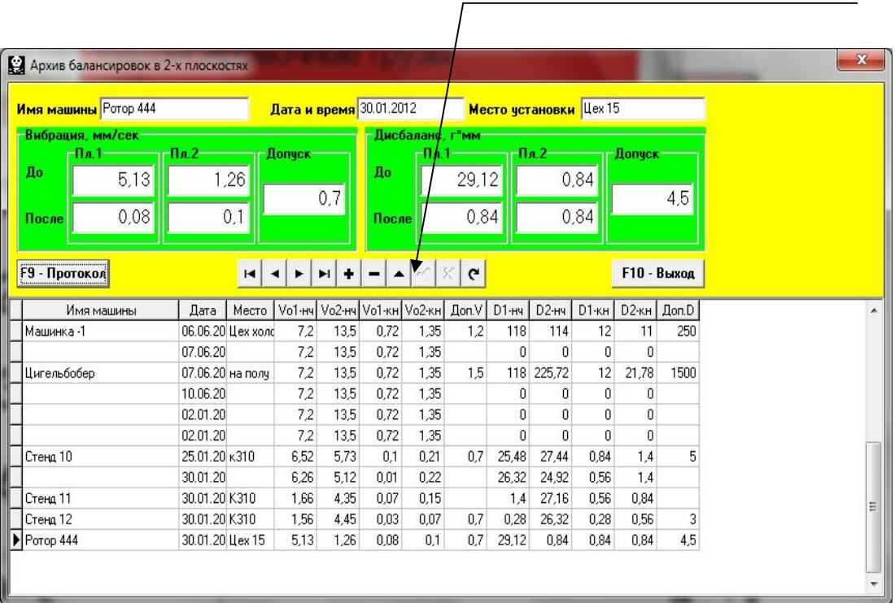

# ПРИБОР ДЛЯ МНОГОПЛОСКОСТНОЙ БАЛАНСИРОВКИ МЕХАНИЗМОВ «БАЛКОМ-4»

# ППАСПОРТ И РУКОВОДСТВО ПО ЭКСПЛУАТАЦИИ

КИН040.00.00.001ПиРЭ

г. Санкт-Петербург 2014 г.

Подпись и дата Инв. № дубл. Взам. инв. № Подпись и дата Инв. № подл.

Перв. примен.

Справ. №

|                |                                                                                   |                                                                                                                                                      |                                                                             |                                     |              |  | СОДЕРЖАНИЕ                                                         |      |                  |        |  |  |
|----------------|-----------------------------------------------------------------------------------|------------------------------------------------------------------------------------------------------------------------------------------------------|-----------------------------------------------------------------------------|-------------------------------------|--------------|--|--------------------------------------------------------------------|------|------------------|--------|--|--|
|                |                                                                                   |                                                                                                                                                      |                                                                             |                                     |              |  |                                                                    |      |                  | Лист   |  |  |
| Перв. примен.  | 1. Назначение                                                                  |                                                                                                                                                      |                                                                             |                                     |              |  |                                                                    |      |                  |        |  |  |
|                |                                                                                   |                                                                                                                                                      | 2. Технические характеристики                                            |                                     |              |  |                                                                    |      |                  |        |  |  |
|                |                                                                                   | 3.                                                                                                                                                   |                                                                             | Состав изделия и комплект поставки  |              |  |                                                                    |      |                  | 5      |  |  |
|                |                                                                                   | 4.                                                                                                                                                   |                                                                             | Устройство и принцип работы прибора |              |  |                                                                    |      |                  | 6      |  |  |
|                |                                                                                   | 5.                                                                                                                                                   | Указания мер безопасности                                                   |                                     |              |  |                                                                    |      |                  |        |  |  |
|                |                                                                                   | 6.                                                                                                                                                   |                                                                             | Подготовка прибора к работе         |              |  |                                                                    |      |                  | 10     |  |  |
| №              |                                                                                   | 7.                                                                                                                                                   |                                                                             | Работа с прибором                   |              |  |                                                                    |      |                  | 11     |  |  |
| Справ.         | 7.1 Главное рабочее окно программы. Назначение основных управ ляющих кнопок |                                                                                                                                                      |                                                                             |                                     |              |  |                                                                    |      |                  | 11     |  |  |
|                |                                                                                   |                                                                                                                                                      | 7.2 Ввод или коррекция коэффициентов преобразования датчиков вибрации |                                     |              |  |                                                                    |      |                  |        |  |  |
|                |                                                                                   |                                                                                                                                                      |                                                                             | 7.3                                 |              |  | Работа в режиме «Виброметр»                                        |      |                  | 15     |  |  |
|                |                                                                                   |                                                                                                                                                      |                                                                             | 7.4                                 |              |  | Балансировка в одной плоскости (статическая)                       |      |                  | 17     |  |  |
|                |                                                                                   |                                                                                                                                                      |                                                                             | 7.5                                 |              |  | Балансировка в двух плоскостях (динамическая)                      |      |                  | 28     |  |  |
|                | 7.6 Балансировка в трёх плоскостях (динамическая)                              |                                                                                                                                                      |                                                                             |                                     |              |  |                                                                    |      | 39               |        |  |  |
| Подпись и дата |                                                                                   | 7.7 Балансировка в четырёх плоскостях (динамическая)                                                                                              |                                                                             |                                     |              |  |                                                                    | 50   |                  |        |  |  |
|                |                                                                                   |                                                                                                                                                      |                                                                             | 7.8                                 |              |  | Работа в режиме «Графики»                                          |      |                  | 62     |  |  |
|                |                                                                                   | 8. Общие указания по эксплуатации и техническому обслуживанию при бора 9. Правила транспортирования и хранения 10. Поверка прибора |                                                                             |                                     |              |  |                                                                    |      |                  |        |  |  |
| № дубл.        |                                                                                   |                                                                                                                                                      |                                                                             |                                     |              |  |                                                                    |      |                  |        |  |  |
| Инв.           |                                                                                   |                                                                                                                                                      |                                                                             |                                     |              |  |                                                                    |      |                  |        |  |  |
| №              |                                                                                   | 11.                                                                                                                                                  |                                                                             | Свидетельство о приёмке             |              |  |                                                                    |      |                  | 69     |  |  |
| Взам. инв.     |                                                                                   | 12.                                                                                                                                                  |                                                                             | Свидетельство об упаковке           |              |  |                                                                    |      |                  | 69     |  |  |
|                |                                                                                   | 13.                                                                                                                                                  |                                                                             | Гарантии изготовителя               |              |  |                                                                    |      |                  | 69     |  |  |
|                |                                                                                   |                                                                                                                                                      |                                                                             | Приложение 1                        |              |  |                                                                    |      |                  | 70     |  |  |
| Подпись и дата |                                                                                   |                                                                                                                                                      |                                                                             |                                     |              |  | Балансировка в эксплуатационных условиях (справочные рекомендации) |      |                  |        |  |  |
|                |                                                                                   |                                                                                                                                                      |                                                                             |                                     |              |  | КИН040.00.00.001 РЭ                                                |      |                  |        |  |  |
|                |                                                                                   | Изм.                                                                                                                                                 | Лист                                                                        | № докум.                            | Подпись Дата |  |                                                                    |      |                  |        |  |  |
|                |                                                                                   | Разраб.                                                                                                                                              |                                                                             | Фельдман                            |              |  | Прибор для балансировки                                            | Лит. | Лист             | Листов |  |  |
| № подл.        |                                                                                   | Провер. Реценз.                                                                                                                                   |                                                                             |                                     |              |  | «БалКом – 4»                                                       |      | 2                | 76     |  |  |
| Инв.           |                                                                                   | Н. Контр.                                                                                                                                            |                                                                             |                                     |              |  | Паспорт и руководство                                              |      | ООО «Кинематика» |        |  |  |
|                |                                                                                   | Утверд.                                                                                                                                              |                                                                             | Шелковенко                          |              |  | по эксплуатации                                                    |      |                  |        |  |  |

# 1. НАЗНАЧЕНИЕ

Прибор «БалКом-4» (далее по тексту «Прибор») является портативным балансировочным комплектом, предназначенным для балансировки в одной, двух, трёх и четырёх плоскостях коррекции роторов, вращающихся в собственных подшипниках.

Перв. примен.

Справ. №

Подпись и дата

Инв. № дубл.

Взам. инв. №

Подпись и дата

Прибор включает в себя: до 4-х датчиков вибрации, датчик фазового угла, измерительный блок, а так же переносной компьютер - нетбук или ноутбук. (При необходимости в составе прибора возможно использование стационарного компьютера).

Он может быть использован при проведении сборочных, монтажных и ремонтных работ с целью снижения динамических нагрузок, действующих на подшипниковые узлы машин вследствие их неуравновешенности. При этом существенно повышается ресурс работы машин и механизмов.

Использование балансировочного комплекта позволяет во многих случаях исключить потребность в специальных балансировочных станках, так как балансировка ротора выполняется в его собственных подшипниках без разборки механизма.

При необходимости прибор «БалКом-4» может быть также использован в качестве измерительной системы балансировочного станка.

Весь процесс балансировки, включающий в себя измерение, обработку и вывод на индикацию информации о величине и месте установки корректирующего груза, выполняется в автоматизированном режиме и не требует от пользователя дополнительных навыков и знаний, выходящих за рамки настоящей инструкции.

Результаты всех балансировок сохраняются в Архиве балансировки и при необходимости могут быть распечатаны в виде протоколов.

Помимо балансировки прибор «БалКом-4» дополнительно может использоваться как обычный вибротахометр, позволяющий осуществлять измерение по четырём каналам среднего квадратического значения (СКЗ) суммарной вибрации, СКЗ оборотной составляющей вибрации, а также контролировать частоту вращения ротора.

Кроме того, данный прибор позволяет выводить на дисплей графики временной функции и спектра вибрации по виброскорости, что может быть полезным при оценке технического состояния балансируемой машины.

| № подл. |      |      |          |              |                     |      |
|---------|------|------|----------|--------------|---------------------|------|
|         |      |      |          |              |                     | Лист |
| Инв.    |      |      |          |              | КИН040.00.00.001 РЭ |      |
|         | Изм. | Лист | № докум. | Подпись Дата |                     | 3    |

|                |                                                                                            | 2. ТЕХНИЧЕСКИЕ ХАРАКТЕРИСТИКИ                              |      |  |  |
|----------------|--------------------------------------------------------------------------------------------|------------------------------------------------------------|------|--|--|
| Перв. примен.  | 2.1. Число плоскостей коррекции при балан                                                  |                                                            |      |  |  |
|                | сировке                                                                                    | 1, 2, 3, 4                                                 |      |  |  |
|                | 2.2. Число каналов измерения вибрации                                                      | 4                                                          |      |  |  |
|                | 2.3. Число каналов измерения частоты вра                                                   |                                                            |      |  |  |
|                | щения 2.4.Диапазон измерения среднего квадрати                                          | 1                                                          |      |  |  |
|                | ческого значения (СКЗ) виброскорости,                                             |                                                            |      |  |  |
|                | мм/сек                                                                                     | от 0.2 до 50                                               |      |  |  |
|                | 2.5. Частотный диапазон измерения СКЗ                                          |                                                            |      |  |  |
|                | виброскорости, Гц                                                                          | от 5 до 200                                                |      |  |  |
|                | 2.6.Пределы допускаемой абсолютной по                                                      |                                                            |      |  |  |
| №              | грешности измерения СКЗ виброскорости на базовой частоте (80 Гц) и в рабочем диапа      | ±(0.1 + 0.1*Vи), где Vи – измеренное значение СКЗ вибро |      |  |  |
|                | зоне частот, мм/сек                                                                        | скорости                                                   |      |  |  |
| Справ.         | 2.7. Диапазон измерения частоты вращения,                                                  |                                                            |      |  |  |
|                | об/мин                                                                                     | 300 - 30000                                                |      |  |  |
|                | 2.8. Пределы допускаемой абсолютной по                                                     | ±(1 + 0.005*Nи),                                           |      |  |  |
|                | грешности измерения частоты враще-ния в рабочем диапазоне частот, об/мин                | где Nи – измеренное значение частоты вра щения ротора   |      |  |  |
|                | 2.9. Диапазон измерения сдвига фазы вибра                                                  |                                                            |      |  |  |
|                | ции, угловых градусов                                                                      | от 0 до 360                                                |      |  |  |
|                | 2.10. Пределы допускаемой абсолютной по                                                    |                                                            |      |  |  |
|                | грешности измерения сдвига фазы вибрации, угловых градусов                              | ± 2                                                        |      |  |  |
|                | 2.11.Габаритные размеры измерительного                                               |                                                            |      |  |  |
|                | блока, мм, не более                                                                        | 200*160*65                                                 |      |  |  |
| Подпись и дата | 2.12.Масса измерительного блока, кг, не бо                                                 |                                                            |      |  |  |
|                | лее                                                                                        | 0.9                                                        |      |  |  |
|                | 2.13. Габаритные размеры вибропрео                                                |                                                            |      |  |  |
|                | бразователя, мм, не более 2.14. Масса вибропреобразователя, кг, не                      | 25*25*20                                                   |      |  |  |
| № дубл.        | более                                                                                      | 0.04                                                       |      |  |  |
| Инв.           | 2.15. Габаритные размеры датчика фазового                                                  |                                                            |      |  |  |
|                | угла, мм, не более                                                                         | 120*60*30                                                  |      |  |  |
| №              | 2.16. Масса датчика фазового с кабелем, кг,                                                |                                                            |      |  |  |
| Взам. инв.     | не более                                                                                   | 0.2                                                        |      |  |  |
|                | 2.17. Условия эксплуатации:                                                                |                                                            |      |  |  |
|                | ▪ температура окружающего воздуха, °C ▪ относительная влажность воздуха при | от 1 до 35                                                 |      |  |  |
|                | температуре 25 °C, %                                                                       | до 80                                                      |      |  |  |
| Подпись и дата | ▪ атмосферное давление, кПа                                                                | от 84 до 106.7                                             |      |  |  |
|                | 2.18. Средняя наработка на отказ, час, не                                                  |                                                            |      |  |  |
|                | менее                                                                                      | 1000                                                       |      |  |  |
|                | 2.19. Средний срок службы, лет, не менее                                                   | 6                                                          |      |  |  |
|                |                                                                                            |                                                            |      |  |  |
| № подл.        |                                                                                            |                                                            |      |  |  |
|                |                                                                                            | КИН040.00.00.001 РЭ                                        | Лист |  |  |
| Инв.           | Изм. Лист № докум. Подпись Дата                                                   |                                                            | 4    |  |  |

# 3. СОСТАВ ИЗДЕЛИЯ И КОМПЛЕКТ ПОСТАВКИ

Базовый комплект поставки прибора «БалКом-1» включает в себя измерительный блок, два датчика вибрации, датчик фазового угла, оснастку, необходимую пользователю для выполнения основных измерений, а также флеш-диск с программным обеспечением.

Перв. примен.

Справ. №

Подпись и дата

Инв. № дубл.

Взам. инв. №

Подпись и дата

Инв. № подл.

Дополнительно (по желанию Заказчика) прибор может быть укомплектован переносным компьютером (нетбуком, ноутбуком)

# Комплект поставки

|              | Обозначение          | Наименование         |                                                                            | Кол во | Примечание                        |      |
|--------------|----------------------|----------------------|----------------------------------------------------------------------------|-----------|-----------------------------------|------|
|              | КИН040.00.00.001     | Блок измерительный   |                                                                            | 1         |                                   |      |
| DT 2234C+    |                      | Тахометр лазерный    |                                                                            | 1         |                                   |      |
| AD 1         |                      | базе акселерометра ) | Вибропреобразователь емкостной (на                                         | 4 (3)     |                                   |      |
|              |                      |                      | Компьютер (нетбук или ноутбук)                                             | 1         | Поставляется желанию Заказчика | по   |
|              |                      | Штатив магнитный     |                                                                            | 1         |                                   |      |
|              |                      | Весы электронные     |                                                                            | 1         |                                   |      |
|              |                      | прибора              | Чемодан (сумка) для транспортировки                                        | 1         |                                   |      |
|              |                      | Документация         |                                                                            |           |                                   |      |
|              | КИН040.00.00.001ПиРЭ | эксплуатации.        | Прибор для балансировки механизмов «БалКом-4». Паспорт и Руководство по | 1         |                                   |      |
| DT 2234C+    |                      |                      | Тахометр лазерный. Этикетка                                                | 1         |                                   |      |
|              |                      | флэшнакопителе       | Программное обеспечение на                                                 | 1         |                                   |      |
|              |                      |                      |                                                                            |           |                                   |      |
|              |                      |                      |                                                                            |           |                                   |      |
|              |                      |                      | КИН040.00.00.001 РЭ                                                        |           |                                   | Лист |
| Изм. Лист | № докум.             | Подпись Дата         |                                                                            |           |                                   | 5    |

# 4. УСТРОЙСТВО И ПРИНЦИП РАБОТЫ ПРИБОРА

4.1. Фотографии прибора «БалКом-4» представлены на рис. 4.1 и 4.2.

Перв. примен.

Справ. №

Подпись и дата

Инв. № дубл.

Взам. инв. №

Подпись и дата

Прибор (см. рис. 4.1) состоит из измерительного блока 6, четырёх датчиков вибрации 1 ,2, 3, 4, датчика фазового угла 5 и портативного компьютера (нетбука или ноутбука) 7.

В комплект поставки прибора также включена оснастка, необходимая для проведения балансировки механизмов в полевых условиях. В частности магниты, используемые для установки на объекте датчиков вибрации, и магнитный штатив, используемый для установки датчика фазового угла.

Корпус измерительного блока прибора выполнен из пластика ABS серого цвета.

На лицевой стенке корпуса (см. рис. 4.2) расположены разъёмы Х1, Х2 Х3, Х4, предназначенные для подключения датчиков вибрации соответственно к 1, 2, 3 и 4 измерительным каналам прибора, а также разъём Х5, используемый для подключения датчика фазового угла.

Из задней стенки датчика выведен кабель с USB-разъёмом Х6, предназначенный для подключения измерительного блока к компьютеру.

По этому кабелю осуществляется обмен информацией между измерительным блоком и компьютером. По нему также обеспечивается подача питания +5 В от компьютера к измерительному блоку.

Рис. 4.1. Прибор для балансировки «БалКом-4» в комплекте

| № подл. |      |      |          |              |                     |      |
|---------|------|------|----------|--------------|---------------------|------|
|         |      |      |          |              |                     | Лист |
| Инв.    |      |      |          |              | КИН040.00.00.001 РЭ |      |
|         | Изм. | Лист | № докум. | Подпись Дата |                     | 6    |

Рис. 4.2. Лицевая панель измерительного блока прибора «БалКом-4».

4.2. Функциональная схема прибора приведена на рис. 4.3.

Прибор включает в себя следующие конструктивные единицы: измерительный блок 6, датчики вибрации 1, 2, 3, 4, датчик фазового угла (лазерный тахометр) 5, портативный компьютер 7

Как видно из схемы, в корпусе измерительного блока установлены модуль 8 АЦП/ЦАП Е154 (или Е14-140-М), к которому подключена плата 9 нормирующих преобразователей сигналов датчиков.

На плате 9 собраны основные узлы, обеспечивающие нормирование сигналов с датчиков, в том числе:

- интеграторы 10, 11, 12, 13 сигналов датчиков вибрации по первому, второму, третьему и четвёртому измерительным входам;
- преобразователь 14 сигнала датчика фазового угла;
- преобразователь 15 питания DC-DC +5B/+3B;
- преобразователь 16 питания DC-DC +5B/+12B;
- реле 17 с нормально замкнутым и нормально разомкнутым контактами .

Принцип действия прибора основан на измерении механических колебаний, которые имеют место на корпусах машин при их работе.

Для преобразования механических колебаний в электрический сигнал используются датчики вибрации – емкостные интегральные акселерометры 2-5. Для определения фазовых характеристик сигнала используется оптический лазерный тахометр 6, работающий на отражение.

|  |      |      |          |              |  | Лист                |   |
|--|------|------|----------|--------------|--|---------------------|---|
|  |      |      |          |              |  | КИН040.00.00.001 РЭ |   |
|  | Изм. | Лист | № докум. | Подпись Дата |  |                     | 7 |

Подпись и дата Инв. № дубл. Взам. инв. № Подпись и дата Инв. № подл.

Перв. примен.

Справ. №

Под воздействием механических колебаний на выходе датчика вибрации формируется электрический аналоговый сигнал пропорциональный виброускорению, который подается на соответствующий вход измерительного блока 6 прибора.

Далее после преобразования (интегрирования, полосовой фильтрации) видоизмененный сигнал пропорциональный виброскорости поступает на соответствующий аналоговый вход модуля 8 АЦП/ЦАП Е154 (Е14-140-М), в котором преобразуется в цифровую форму и запоминается в его оперативном запоминающем устройстве (ОЗУ).

Перв. примен.

Справ. №

Подпись и дата

Инв. № дубл.

Взам. инв. №

Подпись и дата

В случае необходимости измерения частоты вращения и/или фазовых характеристик вибрационного сигнала дополнительно используется импульсный сигнал, формируемый датчиком фазового угла 5, который после нормирования также подается на соответствующий аналоговый вход модуля 8.

В модуле 8 АЦП/ЦАП производится предварительная цифровая обработка аналоговых сигналов, поступающих с датчиков. После чего оцифрованные сигналы по шине USB передаются в портативный компьютер 7, в котором по заданной программе осуществляется дальнейшая обработка (фильтрация, интерполяция, Фурье – анализ, вычисление параметров балансировки и т.д.).

Полученные результаты (численные значения амплитуды и фазы вибрации, частоты вращения и т.п.) выводятся на дисплей компьютера и запоминаются в соответствующих отделах его памяти.

В зависимости от выбранного режима балансировки (одна, две, три или четыре плоскости коррекции) последовательно выполняется соответствующее количество измерений вибрации объекта в исходном состоянии и после установки пробного груза, используемого для тарировки прибора.

По результатам измерений в цифровом виде осуществляется решение задачи балансировки, после чего на дисплей компьютера выводятся данные о величине и угле установки корректирующей массы.

Роль пользователя сводится при этом к установке пробных и корректирующих грузов на балансируемом роторе и нажатию по готовности соответствующих клавиш на клавиатуре компьютера (или виртуальных клавиш на дисплее).

Весь процесс балансировки, включающий в себя измерение, обработку сигнала и вычисление результата, выполняется в автоматизированном режиме по программам, находящимся в памяти компьютера.

Внимание! В данной модификации прибора предусмотрен специальный разъём Х7, обеспечивающий подключение внешних устройств к выходам реле 17.

Этот разъём может быть использован для программного управления включением и отключением электродвигателя привода балансировочного станка при проведении балансировки.

| № подл. |      |      |          |              |                     |      |
|---------|------|------|----------|--------------|---------------------|------|
|         |      |      |          |              |                     | Лист |
| Инв.    |      |      |          |              | КИН040.00.00.001 РЭ |      |
|         | Изм. | Лист | № докум. | Подпись Дата |                     | 9    |

1. Внимание! При работе прибора от сети 220В необходимо соблюдать правила электробезопасности. Не допускается проводить ремонт прибора при его подключении к сети 220 В.

2. В случае эксплуатации прибора в условиях низкого качества сетевого питания и заметных сетевых помех рекомендуется использовать режим автономного питания от аккумуляторов компьютера.

При этом с целью увеличения времени эксплуатации прибора на автономном питании рекомендуется в случае длительных перерывов в его работе переводить компьютер в режим гибернации (спящий режим).

В этом случае вся имеющаяся на момент выключении компьютера информация автоматически сохраняется в его энергонезависимой памяти, что позволяет при повторном запуске продолжить работу прибора с начала прерванного шага программы.

# 6. ПОДГОТОВКА ПРИБОРА К РАБОТЕ

6.1. Установить датчики вибрации 1, 2, 3, 4 на обследуемом или балансируемом механизме, (Подробная информация об установке датчиков дана в приложении 1).

Подключить датчики вибрации к разъемам Х1, Х2, Х3, Х4.

6.2. Установить датчик фазового угла (лазерный тахометр) 5 таким образом, чтобы номинальный зазор между радиальной (или торцовой) поверхностью балансируемого ротора и корпусом датчика находился в диапазоне от 10 до 300 мм.

Наклеить на поверхность ротора метку из катафотной ленты шириной не менее 10 -15 мм.

Подключить датчик фазового угла к разъёму Х5.

Перв. примен.

Справ. №

Подпись и дата

Инв. № дубл.

Взам. инв. №

Подпись и дата

Инв. № подл.

6.3. При необходимости подключить схему управления пуском (остановом) электродвигателя привода балансировочного станка через разъём 7 к реле 17.

6.4. Подключить измерительный блок к USB-входу компьютера.

6.5. При использовании сетевого питания подключить компьютер к блоку сетевого питания. Подключить блок питания к сети 220 В, 50 Гц.

6.6. Включить компьютер и выбрать программу «БалКом-4».

|  |      |      |          |              |                     | Лист |
|--|------|------|----------|--------------|---------------------|------|
|  |      |      |          |              | КИН040.00.00.001 РЭ |      |
|  | Изм. | Лист | № докум. | Подпись Дата |                     | 10   |

# 7. РАБОТА С ПРИБОРОМ

# 7.1. Главное рабочее окно программы. Назначение основных управляющих кнопок.

Перв. примен.

Справ. №

Подпись и дата

Инв. № дубл.

Взам. инв. №

Подпись и дата

Инв. № подл.

При запуске программы «БалКом-4» на дисплее компьютера появляется главное рабочее окно программы, представленное на рис. 7.1.

Рис. 7.1. Главное рабочее окно программы "БалКом-4"

Для управления работой программы в указанном окне имеется 11 виртуальных кнопок, на которых нанесены названия реализуемых при их нажатии функций.

Для нажатия выбранной кнопки необходимо навести на неё стрелку «мышки» и «щёлкнуть» по ней, нажав левую клавишу «мышки».

Управление работой в Главном окне программы также может осуществляться с помощью функциональных клавиш клавиатуры компьютера, обозначение которых также нанесено на соответствующих кнопках окна.

# 7.1.1. Кнопка «F1-о программе».

При нажатии этой кнопки (или, что однозначно, функциональной клавиши F1 на клавиатуре компьютера) пользователь может получить краткую информацию о назначении программы и, при необходимости, ознакомиться с Руководством по эксплуатации прибора «БалКом-4».

# 7.1.2. Кнопки «F2-одноплоскостная», «F3-двухплоскостная» , «F4-трёхплоскостная», «F12-четырёхплоскостная».

При нажатии кнопки «F2-одноплоскостная» (или функциональной клавиши F2 на клавиатуре компьютера) производится выбор режима измерения вибрации в одной плоскости с использованием датчика вибрации 1, подключённого к входу Х1 измерительного блока.

|      |      |          |              |                     | Лист |
|------|------|----------|--------------|---------------------|------|
|      |      |          |              | КИН040.00.00.001 РЭ |      |
| Изм. | Лист | № докум. | Подпись Дата |                     | 11   |

После нажатия этой кнопки на дисплее компьютера сохраняется мнемосхема, представленная на рис. 7.1, иллюстрирующая процесс измерения вибрации только по первому измерительному каналу (или процесс балансировки в одной плоскости).

При нажатии кнопки «F3-двухплоскостная» (или функциональной клавиши F3 на клавиатуре компьютера) производится выбор режима измерения вибрации одновременно в двух плоскостях с использованием датчиков вибрации 1 и 4, подключённых соответственно к входам Х1 и Х4 измерительного блока.

Перв. примен.

Справ. №

Подпись и дата

Инв. № дубл.

Взам. инв. №

Подпись и дата

Инв. № подл.

В этом случае на дисплее компьютера появляется мнемосхема, представленная на рис. 7.2, иллюстрирующая процесс измерения вибрации одновременно по двум измерительным каналам (или процесс балансировки в двух плоскостях).

Рис. 7.2. Вид Главного рабочего окна программы «БалКом-4» после нажатия кнопки «F3-двухплоскостная»

 При нажатии кнопки «F4-трёхплоскостная» (или функциональной клавиши F4 на клавиатуре компьютера) производится выбор режима измерения вибрации одновременно в трёх плоскостях с использованием датчиков вибрации 1, 2 и 4, подключённых соответственно к входам Х1, Х2 и Х4 измерительного блока.

В этом случае на дисплее компьютера появляется мнемосхема, представленная на рис. 7.3, иллюстрирующая процесс измерения вибрации одновременно по трём измерительным каналам (или процесс балансировки в трёх плоскостях).

 При нажатии кнопки «F12-четырёхплоскостная» (или функциональной клавиши F5 на клавиатуре компьютера) производится выбор режима измерения вибрации одновременно в четырёх плоскостях с использованием датчиков вибрации 1, 2, 3, 4, подключённых соответственно к входам Х1, Х2, Х3 и Х4 измерительного блока.

В этом случае на дисплее компьютера появляется мнемосхема, представленная на рис. 7.3, иллюстрирующая процесс измерения вибрации одновременно по трём измерительным каналам (или процесс балансировки в четырёх плоскостях).

|      |      |          |              |                     | Лист |
|------|------|----------|--------------|---------------------|------|
|      |      |          |              | КИН040.00.00.001 РЭ |      |
| Изм. | Лист | № докум. | Подпись Дата |                     | 12   |

# 7.1.4. Кнопка «F5 – Виброметр».

Перв. примен.

Справ. №

Подпись и дата

Инв. № дубл.

Взам. инв. №

Подпись и дата

Инв. № подл.

При нажатии этой кнопки (или функциональной клавиши F5 на клавиатуре компьютера) включается режим измерения вибрации по одному, двум, трём или четырём измерительным каналам виртуального виброметра в зависимости от того, какой режим измерения выбран с помощью кнопок «F2-одноплоскостная», «F3-двухплоскостная», «F4-трёхплоскостная», «F12-четырёхплоскостная».

# 7.1.5. Кнопка «F6 – Протоколы».

При нажатии этой кнопки (или функциональной клавиши F6 на клавиатуре компьютера) осуществляется переход в Архив балансировки, из которого можно распечатать протокол с результатами балансировки для конкретного механизма (или ротора).

# 7.1.6. Кнопка «F7 – Балансировка».

При нажатии этой кнопки (или функциональной клавиши F7 на клавиатуре компьютера) включается режим балансировки в одной, двух, трёх или четырёх плоскостях коррекции в зависимости от того, какой режим измерения выбран с помощью кнопок «F2-одноплоскостная», «F3-двухплоскостная», «F4-трёхплоскостная», «F12 четырёхплоскостная».

# 7.1.7. Кнопка «F8 – Графики».

При нажатии этой кнопки (или функциональной клавиши F8 на клавиатуре компьютера) включается режим графического виброметра, при реализации которого одновременно с цифровыми значениями амплитуды и фазы вибрации на дисплее компьютера выводятся графики её временной функции.

# 7.1.8. Кнопка «F10 – Выход».

При нажатии этой кнопки (или функциональной клавиши F10 на клавиатуре компьютера) осуществляется завершение работы по программе «БалКом-1».

# 7.2. Ввод или корректировка коэффициентов преобразования датчиков вибрации.

При нажатии в Главном рабочем окне программы кнопки «К пр» на дисплее компьютера появляется рабочее окно «Коэффициенты преобразования» (см. рис. 7.5).

В этом окне проводится корректировка коэффициентов преобразования датчиков вибрации, необходимость в которой выявляется в процессе проведения их калибровки.

Для ввода уточнённого по результатам калибровки значения коэффициента преобразования необходимо навести стрелку «мышки» на соответствующее окошко «Кпрi» рабочего окна, «щёлкнуть» по нему левой клавишей «мышки» и ввести соответствующее значение коэффициента преобразования датчика вибрации.

### Внимание!

При вводе коэффициента преобразования его дробная часть отделяется от целой части запятой (знаком « , »).

 В этом же окне, при необходимости, имеется возможность провести корректировку, учитывающую величину смещения нуля АЦП измерительного блока.

|      |      |          |              |                     | Лист |
|------|------|----------|--------------|---------------------|------|
|      |      |          |              | КИН040.00.00.001 РЭ |      |
| Изм. | Лист | № докум. | Подпись Дата |                     | 14   |

| Коэффициенты преобразования |                      | F2 - Одноплоскостная   F3 - Двухплоскостная   F4 - Трёхплоскостная   F12 - Четырёхплоскостная Кпр. Для служебных сообщений |
|-----------------------------|----------------------|-------------------------------------------------------------------------------------------------------------------------------|
| 20 Кпр1 (мВ/мм/с)        | 20 Кпр3 (мВ/мм/с) |                                                                                                                               |
| Кпр2 (мВ/мм/с)  20          | 20 Кпр4 (мВ/мм/с) |                                                                                                                               |
| Смещение "нуля"             |                      |                                                                                                                               |
| 0 Vs1 (мм/сек)           | 10 Vs3 (мм/сек)   |                                                                                                                               |
| Vs2 (мм/сек) 10          | Vs4 (мм/сек) 0    |                                                                                                                               |
| Отменить                    | Принять              |                                                                                                                               |

Рис. 7.5. Рабочее окно для ввода коэффициентов преобразования датчиков вибрации.

В случае ошибочного ввода какого-либо коэффициента преобразования для устранения ошибки необходимо «щёлкнуть мышкой» по кнопке «Отменить», после чего можно повторить ввод данного коэффициента.

После завершения ввода коэффициентов преобразования датчиков по всем измерительным каналам необходимо «щёлкнуть мышкой» по кнопке «Принять», после чего новые значения коэффициентов будут сохранены в памяти программы.

Для продолжения работы по программе необходимо «щёлкнуть мышкой» по кнопке «F10 – Выход» и вернуться в Главное рабочее окно программы.

# 7.3. Работа прибора в режиме «Виброметр».

Перв. примен.

Справ. №

Подпись и дата

Инв. № дубл.

Взам. инв. №

Подпись и дата

Инв. № подл.

Перед началом работы в режиме «Виброметр» необходимо установить датчики вибрации на корпусе машины и подключить их соответствующим входам измерительного блока.

 В случае использования одного датчика вибрации (1) он должен быть подключен на вход Х1 измерительного блока.

 При использовании двух датчиков вибрации (1 и 4) они соответственно должны быть подключены на входы Х1 и Х4 измерительного блока.

 При использовании трёх датчиков вибрации (1, 2, 4) они соответственно должны быть подключены на входы Х1, Х2, Х4 измерительного блока.

 При использовании четырёх датчиков вибрации (1, 2, 3, 4)они соответственно должны быть подключены на входы Х1, Х2, Х3, Х4 измерительного блока.

 Фотоэлектрический датчик фазового угла 5 необходимо подключить к входу Х5 измерительного блока.

 Кроме того, для использования этого датчика на доступную поверхность ротора машины необходимо нанести специальную метку, имеющую отражающую способность, контрастную по отношению к отражающей способности поверхности ротора.

Рекомендации по установке и настройка датчиков приведены в приложении 1.

|      |      |          |              |                     | Лист |
|------|------|----------|--------------|---------------------|------|
|      |      |          |              | КИН040.00.00.001 РЭ |      |
| Изм. | Лист | № докум. | Подпись Дата |                     | 15   |

После этого для выполнения измерения в режиме «Виброметр» необходимо «щёлкнуть мышкой» по кнопке «F5 – Виброметр» в Главном рабочем окне программы (см. рис.7.1).

 При этом на дисплее компьютера появляется рабочее окно (см. рис.7.6), в котором периодически выводятся результаты измерения, в том числе: величины СКЗ суммарной вибрации (Vis), величины СКЗ (Vio,) и фазы (Fi) 1-й гармоники оборотной составляющей вибрации, а также частота вращения ротора (Nоб).

#### Внимание!

Перв. примен.

Справ. №

Подпись и дата

Инв. № дубл.

Взам. инв. №

Подпись и дата

 Перед началом работы в данном режиме необходимо выбрать по скольким каналам (одному, двум, трём или четырём) будет проводиться измерение вибрации.

 При этом в случае измерения вибрации только по первому каналу в главном рабочем окне программы (см. рис. 7.1) должна быть нажата кнопка «F2 одноплоскостная».

 В случае одновременного измерения по двум каналам должна быть нажата кнопка «F3-двухплоскостная».

 В случае одновременного измерения по трём каналам должна быть нажата кнопка «F4-трёхплоскостная».

 В случае одновременного измерения по четырём каналам должна быть нажата кнопка «F5-четырёхплоскостная».

Рис. 7.6. Рабочее окно режима «Виброметр»

Для начала измерения вибрации в данном окне необходимо «щёлкнуть мышкой» по кнопке «F9 – Измерить» (или нажать функциональную клавишу F9 на клавиатуре компьютера).

После этого результаты измерений параметров вибрации объекта будут периодически выводиться в соответствующих окошках рабочего окна.

При этом в случае измерения вибрации только по первому каналу будут заполняться окошки, расположенные под надписью «Опора 1» в левой части рабочего окна.

|         |      |      |          |              |                     | Лист |
|---------|------|------|----------|--------------|---------------------|------|
| № подл. |      |      |          |              | КИН040.00.00.001 РЭ |      |
| Инв.    | Изм. | Лист | № докум. | Подпись Дата |                     | 16   |

В случае одновременного измерения вибрации по первому и второму каналам, будут заполняться окошки рабочего окна, расположенные под надписями «Опора 1» и «Опора 2» и т.д.

Измерение вибрации в режиме «Виброметр» возможно также при отключенном датчике фазового угла. При этом в рабочем окне программы (см. рис 7.6) будут выводиться только величины СКЗ суммарной вибрации.

Для завершения работы в режиме «Виброметр» необходимо «щёлкнуть мышкой» по кнопке «F10 – Выход» и вернуться в Главное рабочее окно программы.

#### 7.4. Балансировка в одной плоскости (статическая).

Перв. примен.

Справ. №

Подпись и дата

Инв. № дубл.

Взам. инв. №

Подпись и дата

Перед началом работы в режиме «Балансировка в 1-й плоскости» необходимо установить датчик вибрации 1 на корпусе машины в выбранной точке измерения и подключить его к входу Х1 измерительного блока.

Оптический датчик фазового угла 5 необходимо подключить к входу Х5 измерительного блока. Кроме того, для использования этого датчика на доступную поверхность ротора балансируемой машины необходимо нанести специальную метку, имеющую отражающую способность, контрастную по отношению к отражающей способности поверхности ротора.

Подробные требования по выбору места установки датчиков и их креплению на объекте при балансировке изложены в приложении 1.

Работа по программе в режиме "Балансировка в 1-й плоскости" начинается из Главного рабочего окна программы.

Для этого первоначально необходимо «щёлкнуть мышкой» по кнопке «F2 одноплоскостная» (или нажать клавишу F2 на клавиатуре компьютера).

Подтверждением того, что выбран режим балансировки в одной плоскости, является сохранение на дисплее компьютера мнемосхемы, представленной на рис. 7.1 и иллюстрирующей процесс измерения амплитуды и фазы вибрации только по первому измерительному каналу.

Далее в Главном рабочем окне программы необходимо «щёлкнуть мышкой» по кнопке «F7 – Балансировка», после чего на дисплее компьютера появится рабочее окно (см. рис. 7.7), используемое для ввода исходных данных при балансировке.

В данном окне первоначально выбирается один из возможных вариантов балансировки – «Первичная» или «Повторная» балансировка.

«Первичная» балансировка обычно выполняется для роторов машин, которые ранее не балансировались и для которых в архивной памяти компьютера отсутствует информация, необходимая для проведения «Повторной» балансировки (численные значения коэффициентов балансировки и массы пробного груза).

При выполнении «Первичной» балансировки в 1-й плоскости, требуется проведение двух пусков машины, необходимых для тарировки измерительной системы прибора.

При этом во время первого пуска определяется исходная вибрация машины. Второй пуск машины выполняется после установки на ротор пробного груза, с помощью которого производится тарировка прибора.

| № подл. |      |      |          |              |                     | Лист |
|---------|------|------|----------|--------------|---------------------|------|
| Инв.    |      |      |          |              | КИН040.00.00.001 РЭ |      |
|         | Изм. | Лист | № докум. | Подпись Дата |                     | 17   |

| Вид балансировки • Первичная |       |  |  |  |  |  |  |  |
|---------------------------------|-------|--|--|--|--|--|--|--|
| 0 Повторная                  | Выбор |  |  |  |  |  |  |  |
| Масса пробного груза            |       |  |  |  |  |  |  |  |
| С Проценты                      |       |  |  |  |  |  |  |  |
| Граммы (e)                   | 0,7   |  |  |  |  |  |  |  |
| Система координат               |       |  |  |  |  |  |  |  |
| • Полярная                      |       |  |  |  |  |  |  |  |
| С Лопастная                     | н.д.  |  |  |  |  |  |  |  |
|                                 |       |  |  |  |  |  |  |  |
| Радиус установки пробного груза |       |  |  |  |  |  |  |  |

«Повторная» балансировка может выполняться только для уже ранее отбалансированной машины, для которой определены и занесены в память прибора масса пробного груза и коэффициенты балансировки. В этом случае для определения массы и места установки корректирующего груза, необходимого для компенсации дисбаланса, требуется всего один пуск ротора балансируемой машины.

### 7.4.1. Первичная балансировка в 1-й плоскости.

Перв. примен.

Справ. №

Подпись и дата

Инв. № дубл.

Взам. инв. №

Подпись и дата

Инв. № подл.

# 7.4.1.1. Настройка измерительной системы (ввод исходных данных).

Ввод исходных данных для проведения первичной балансировки начинается в рабочем окне «Балансировка в 1 пл. Исходные данные» (см. рис. 7.7.).

При этом в разделе «Вид балансировки» необходимо с помощью «мышки» поставить метку в графе «Первичная».

Далее в разделе «Масса пробного груза» необходимо выбрать единицы измерения массы пробного груза, для чего помощью «мышки» поставить метку в графе соответственно в графе «Граммы» или «Проценты».

При выборе единицы измерения «Проценты» все дальнейшие расчеты массы корректирующего груза будут выполняться в процентах по отношению к массе пробного груза.

При выборе единицы измерения «Граммы» все дальнейшие расчеты массы корректирующего груза будут выполняться в граммах. После чего ввести в окошке, распо-

|      |      |          |              | КИН040.00.00.001 РЭ |    |  |  |
|------|------|----------|--------------|---------------------|----|--|--|
| Изм. | Лист | № докум. | Подпись Дата |                     | 18 |  |  |

ложенном справа от надписи «Граммы» массу пробного груза, который будет устанавливаться на роторе.

#### ВНИМАНИЕ!

Перв. примен.

Справ. №

Подпись и дата

Инв. № дубл.

Взам. инв. №

Подпись и дата

Инв. № подл.

При необходимости использования в дальнейшей работе режима «Повторно» при первичной балансировке масса пробного груза должна обязательно вводиться в граммах.

Далее в разделе «Система координат» следует выбрать один из возможных вариантов размещения корректирующих грузов на балансируемом роторе – в «Полярной» или «Лопастной» системе координат. Для этого необходимо с помощью мышки поставить метку рядом с соответствующей надписью.

В случае выбора варианта размещения грузов по лопастям рабочего колеса балансируемой машины необходимо ввести число лопастей ротора в соответствующем окошке, расположенном рядом с надписью «Лопастная».

Кроме того, в следующем разделе данного рабочего окна желательно ввести радиус установки пробного груза, что позволит получать дополнительную информацию о величине остаточного дисбаланса ротора в «г \* мм».

После завершения ввода исходных данных следует «щёлкнуть мышкой» по кнопке «F9 – Продолжить» (или нажать клавишу F9 на клавиатуре компьютера).

После чего на дисплее компьютера появится рабочее окно (см. рис. 7.8.а.), используемое для выполнения полного цикла измерений при балансировке.

#### 7.4.1.2. Измерения при проведении балансировки.

Как уже отмечалось выше, «Первичная» балансировка требует проведения двух тарировочных пусков и, как минимум, одного проверочного пуска баласируемой машины.

Измерение вибрации на первом пуске машины начинается в рабочем окне «Балансировка в 1-й плоскости» (см. рис. 7.8.а.) в разделе «Пуск без груза».

| Балансировка в 1-й плоскости |  | X                                                          |
|------------------------------|--|------------------------------------------------------------|
| Пуск без груза               |  |                                                            |
|                              |  | No6= H.д.                                                  |
|                              |  | F9 - Выполнить                                             |
| Груз в плоскости 1           |  |                                                            |
|                              |  | No6= H. д.   Vo. 1= Н.д.     F. 1=   Н.д.     F8 - Возврат |
|                              |  |                                                            |
|                              |  | F9 - Выполнить                                             |
|                              |  |                                                            |
|                              |  |                                                            |
|                              |  |                                                            |
| Поверка                      |  |                                                            |
|                              |  | Noo6= H. д.                                                |
|                              |  |                                                            |
|                              |  | F9 - Выполнить                                             |
| F10 - Выход                  |  |                                                            |
|                              |  |                                                            |

Рис. 7.8.а. Рабочее окно, используемое для вывода результатов измерений при балансировке в одной плоскости.

|      |      |          |              |  | КИН040.00.00.001 РЭ |    |
|------|------|----------|--------------|--|---------------------|----|
| Изм. | Лист | № докум. | Подпись Дата |  |                     | 19 |
|      |      |          |              |  |                     |    |

На готовность программы к работе в данном разделе указывает темно-зеленый цвет фона раздела и подсветка кнопок «F8 – Возврат» и «F9 – выполнить», расположенных в его правой части.

Кнопка «F8 – Возврат» (или функциональная клавиша F8) может использоваться для возврата в предыдущее рабочее окно программы.

Для проведения измерения параметров вибрации в разделе «Пуск без груза» необходимо «щёлкнуть мышкой» по кнопке «F9 – Выполнить» (или нажать клавишу F9 на клавиатуре компьютера), после чего замыкается нормально разомкнутый контакт реле 17, который можно использовать для программного пуска электродвигателя станка.

 Одновременно подается команда на начало циклического измерения вибрации в режиме мониторинга.

 При этом на дисплей прибора выводится рабочее окно (см. рис. 7.8.б.) «Измерение Nоб, Vs, Vo, F», в котором начинает выполняться циклический замер вибрации (режим – мониторинга).

| Измерение Noб, Vs, Vo, F                                           | 2972 об/мин        |              |
|--------------------------------------------------------------------|--------------------|--------------|
| Опора 1 V1s= 6.16 мм/сек V1o= 5,72 мм/сек F1= 256,7 град. |                    |              |
| F10 - Выход                                                        | Режим - мониторинг | F9 - Принять |

Рис. 7.8.б. Рабочее окно, используемое для настроечных измерений при балансировке в одной плоскости в режиме мониторинга

#### Внимание!

Перв. примен.

Справ. №

Подпись и дата

Инв. № дубл.

Взам. инв. №

Подпись и дата

В случае, когда при измерении отсутствует сигнал с датчика фазового угла (датчик не подключен к прибору или поврежден), или когда частота вращения ротора меньше 300 об/мин, на дисплей компьютера выводится предупреждающий транспарант (см. рис. 7.9), указывающий, что фактическая частота вращения ротора находится вне пределов измерений.

После устранения причины ошибки для продолжения работы по программе следует нажать («щёлкнуть мышкой») кнопку «ОК» на транспаранте.

| № подл. |      |      |          |              |                     | Лист |
|---------|------|------|----------|--------------|---------------------|------|
| Инв.    |      |      |          |              | КИН040.00.00.001 РЭ |      |
|         | Изм. | Лист | № докум. | Подпись Дата |                     | 20   |

Рис. 7.9. Транспарант, предупреждающий о нештатном режиме работы датчика фазового угла.

 При наборе балансируемым ротором требуемой частоты вращения, необходимо нажать кнопку «F9-Принять».

 После чего в рабочем окне (см. рис. 7.8.б.) на красном фоне выводится надпись «Режим – рабочий замер», указывающая, что начинает выполняться рабочий замер вибрации, результаты которого будут использованы в последующих вычислениях.

 В зависимости от выбранной частоты вращения балансируемого ротора замер вибрации и обработка результатов измерений могут длиться от 2 до 10 секунд.

При успешном выполнении процесса измерений в соответствующих окошках раздела «Пуск без груза» (см. рис. 7.8.а) появляются результаты измерения частоты вращения ротора (Nоб), а также значение составляющей СКЗ (Vо1) и фазы (F1) вибрации, проявляющейся на частоте вращения баланcируемого ротора.

При этом также меняется цвет фона раздела «Груз в плоскости 1» (с салатного на темно-зеленый) и включается подсветка кнопок «F8 – Возврат» и «F9 – выполнить», что указывает на готовность прибора к работе на втором пуске.

Кнопка «F8 – Возврат» (или функциональная клавиша F8) используется для возвращения в раздел «Пуск без груза» и проведения при необходимости повторного измерения параметров вибрации на этом режиме.

Перед началом измерения параметров вибрации в разделе «Груз в плоскости 1», следует остановить вращение ротора балансируемой машины и установить на нём пробный груз. Масса этого груза, либо уже задана при подготовке к измерениям в память прибора в рабочем окне «Балансировка в 1-й плоскости. Исходные данные» (см. рис. 7.7), либо условно принята в дальнейших расчетах за 100 %.

### Внимание!

Перв. примен.

Справ. №

Подпись и дата

Инв. № дубл.

Взам. инв. №

Подпись и дата

Инв. № подл.

- 1. Вопрос о выборе массы пробного груза и места его установки на роторе балансируемой подробно рассмотрен в приложении 1.
- 2. При необходимости использования в дальнейшей работе режима «Повторно» место установки пробного груза должно обязательно совпадать с плоскостью установки метки, используемой для отсчета фазового угла.

Для проведения измерения параметров вибрации в разделе «Груз в плоскости 1» необходимо «щёлкнуть мышкой» по кнопке «F9 – Выполнить» (или нажать клавишу F9 на клавиатуре компьютера), после чего начинает выполняться цикл измерений, описанный при выполнении первого пуска.

После завершения замера результаты измерений частоты вращения ротора (Nоб) и величины СКЗ (V1o) и фазы (F1), оборотной составляющей вибрации выводятся на дисплее компьютера в соответствующих окошках данного раздела.

|      |      |          |              | КИН040.00.00.001 РЭ | Лист |
|------|------|----------|--------------|---------------------|------|
|      |      |          |              |                     |      |
| Изм. | Лист | № докум. | Подпись Дата |                     | 21   |

Одновременно поверх рабочего окна «Балансировка в 1-й плоскости» появляется рабочее окно «Балансировочные грузы» (см. рис.7.10), в котором выводятся результаты расчёта параметров корректирующего груза, который необходимо установить на роторе для компенсации его дисбаланса.

Причём, в случае использования полярной системы координат на дисплей выводятся значение массы (М1) и угла установки (f1) корректирующего груза.

В случае разложения корректирующего груза по лопастям на дисплей выводятся номера лопастей (Z1i, Z1j) балансируемого ротора и массы грузов, которые необходимо на них установить.

| Балансировка 1пл. - установка грузов и дисбаланс |        |     |             |  |
|--------------------------------------------------|--------|-----|-------------|--|
| Способ корректировки                             |        |     |             |  |
| « Добавление                                     | с Съем |     |             |  |
| Балансировочные трузы                            |        |     |             |  |
| 1% M1=20,7                                    |        | ff= | 201         |  |
|                                                  |        |     |             |  |
|                                                  |        |     |             |  |
|                                                  |        |     |             |  |
| Остаточный дисбаланс                             |        |     |             |  |
| D1, r*mm н.д.                                    |        |     |             |  |
|                                                  |        |     |             |  |
| F8- Коэфф-ты   F9 - В архив                      |        |     | F10 - Выход |  |
|                                                  |        |     |             |  |

### Внимание!:

Перв. примен.

Справ. №

Подпись и дата

Инв. № дубл.

Взам. инв. №

Подпись и дата

Инв. № подл.

- 1. После завершения процесса измерения на втором пуске балансируемой машины необходимо остановить вращение её ротора и снять с него, установленный ранее, пробный груз. Только после этого можно приступать к установке (или съему) на роторе корректирующего груза.
- 2. Отсчет углового положения места добавления (или удаления) с ротора корректирующего груза в полярной системе координат выполняется от места установки пробного груза. Направление отсчета угла совпадает с направлением вращения ротора.
- 3. В случае балансировки по лопастям лопасть балансируемого ротора, условно принимаемая за 1-ю, совпадает с местом установки пробного груза. Направление отсчёта номера лопасти, указанной на дисплее компьютера, выполняется по направлению вращения ротора.
- 4. В данной версии программы по умолчанию принимается, что корректирующий груз будет добавлен на ротор. Об этом свидетельствует метка, установленная в поле «Добавление».

|  |      |      |          |              | КИН040.00.00.001 РЭ | Лист |  |  |
|--|------|------|----------|--------------|---------------------|------|--|--|
|  | Изм. | Лист | № докум. | Подпись Дата |                     | 22   |  |  |

В случае корректировки дисбаланса путём удаления груза (например высверливанием) необходимо установить с помощью мышки метку в поле «Съём», после чего угловое положение корректирующего груза автоматически изменится на 180º.

После установки на балансируемом роторе корректирующей массы в рабочем окне (см. рис. 7.10) нужно нажать кнопку «Выход -F10» (или функциональную клавишу F10 на клавиатуре компьютера), вернуться в предыдущее рабочее окно программы «Балансировка в 1-й плоскости» и провести оценку эффективности выполненной балансировочной операции.

При этом рабочем окне программы «Балансировка в 1-й плоскости» (см. рис. 7.8.а) меняется цвет фона раздела «Проверка» (с салатного на темно-зеленый) и включается подсветка кнопки «F9 – выполнить», что указывает на готовность прибора к работе на третьем (проверочном) пуске.

После завершения проверочного пуска ротора результаты измерений частоты вращения ротора (Nоб) и величины СКЗ (V1o) и фазы (F1) оборотной составляющей вибрации, полученные после балансировки, выводятся на дисплее компьютера в соответствующих окошках данного раздела.

Одновременно поверх рабочего окна «Балансировка в 1-й плоскости» появляется рабочее окно «Балансировочные грузы» (см. рис.7.10), в котором выводятся результаты расчёта параметров дополнительного корректирующего груза, который необходимо установить (удалить) на роторе для компенсации его остаточного дисбаланса.

Кроме того, в этом же окне выводится величина остаточного дисбаланса ротора, достигнутая после балансировки.

В случае, когда величина остаточной вибрации и/или остаточного дисбаланса балансируемого ротора удовлетворяет требованиям допусков, установленных в технической документации, процесс балансировки может быть завершён.

В противном случае процесс балансировки может быть продолжен. Это позволяет методом последовательных приближений скорректировать возможные погрешности, которые могут иметь место при установке (удалении) корректирующего груза на балансируемом роторе.

При продолжении процесса балансировки на балансируемом роторе необходимо установить (удалить) дополнительную корректирующую массу, параметры которой указаны в окне «Балансировочные грузы».

После чего нужно нажать кнопку «Выход - F10» (или функциональную клавишу F10 на клавиатуре компьютера) и вернуться в предыдущее рабочее окно программы для продолжения работы..

Как видно из рис. 7.10, при рабочем окне «Балансировочные грузы» помимо кнопки «Выход -F10» могут использоваться ещё две других управляющих кнопки - «Коэффициенты – F8», «В архив - F9».

Кнопка «Коэффициенты – F8» (или функциональная клавиша F8 на клавиатуре компьютера) используется для просмотра и запоминания в памяти компьютера коэффициентов балансировки ротора, рассчитанных по результатам двух тарировочных пусков.

При её нажатии на дисплее компьютера появляется рабочее окно «Коэффициенты балансировок в 1-й плоскости» (см. рис.7.11), в котором выводятся коэффициенты балансировки, рассчитанные по результатам двух первых тарировочных пусков.

|      |      |          |              |                     | Лист |
|------|------|----------|--------------|---------------------|------|
|      |      |          |              | КИН040.00.00.001 РЭ |      |
| Изм. | Лист | № докум. | Подпись Дата |                     | 23   |

Подпись и дата

Инв. № дубл.

Взам. инв. №

Подпись и дата

Инв. № подл.

В случае, если при последующей балансировке данной машины предполагается использовать режим «Повторная», указанные коэффициенты должны быть сохранены в памяти компьютера.

Для этого следует нажать кнопку «F9 – Сохранить» и перейти на вторую страницу окна «Коэффициенты балансировок в 1-й плоскости» (см. рис.7.12)

| Коэффициенты балансировки в 1-й плоскости |             |
|-------------------------------------------|-------------|
| R11= 5,052                                | R12= 0,630  |
|                                           |             |
|                                           |             |
|                                           |             |
|                                           |             |
| F9 - Сохранить                            | F10 - Выход |

Рис. 7.11. Рабочее окно с коэффициентами балансировки в 1-й плоскости

| Кнопка для запоминания коэффициентов Рис. 7.12. Вторая страница рабочего окна «Коэффициенты балансировки в 1-й плоскости». |  |  |  |  |  |
|-------------------------------------------------------------------------------------------------------------------------------------------|--|--|--|--|--|
|                                                                                                                                           |  |  |  |  |  |
|                                                                                                                                           |  |  |  |  |  |
|                                                                                                                                           |  |  |  |  |  |
|                                                                                                                                           |  |  |  |  |  |
|                                                                                                                                           |  |  |  |  |  |
|                                                                                                                                           |  |  |  |  |  |
|                                                                                                                                           |  |  |  |  |  |
|                                                                                                                                           |  |  |  |  |  |

КИН040.00.00.001 РЭ

Изм. Лист № докум. Подпись Дата

Перв. примен.

Справ. №

Подпись и дата

Инв. № дубл.

Взам. инв. №

Подпись и дата

Инв. № подл.

Лист 24

После чего необходимо ввести условное обозначение этой машины в окошке «Машина» в последней значащей строке таблицы и нажать («щёлкнуть мышкой») кнопку « √ » для сохранения в памяти компьютера указанных данных.

Далее можно вернуться предыдущее окно, для чего следует нажать кнопку «Выход - F10» (или функциональную клавишу F10 на клавиатуре компьютера).

Кнопка «В архив - F9» в рабочем окне «Балансировка в 1-й пл. Установка грузов и дисбаланс» (см. рис. 7.10.) используется для просмотра и редактирования архивных данных, которые хранятся в памяти компьютера и при необходимости используются как справочные документы или для распечатки протоколов балансировки.

При её нажатии на дисплее компьютера появляется рабочее окно «Архив балансировок в 1-й плоскости» (см. рис.7.13), в котором приводятся исходные и конечные текущей балансировки, а также таблица с результатами всех предыдущих балансировок.

При работе в данном окне выполняется подготовка результатов последней балансировки для архивного хранения и последующей распечатки протокола.

Подготовка включает в себя:

Перв. примен.

Справ. №

Подпись и дата

Инв. № дубл.

Взам. инв. №

Подпись и дата

Инв. № подл.

- ввод названия (или условного обозначения) блансируемого механизма, который выполняется в окошке «Имя машины»;
- ввод места установки блансируемого механизма, который выполняется в окошке «Место установки»;
- ввод допусков, установленных в нормативной документации на вибрацию и остаточный дисбаланс блансируемого механизма, который выполняется в соответствующих окошках «Допуск».

#### Кнопка запоминания введённых данных

Рис. 7.13. Рабочее окно «Архив балансировки в 1-й плоскости»

После ввода указанных данных для их запоминания в памяти компьютера необходимо нажать («щёлкнуть мышкой») кнопку « √ », расположенную в ряду управляющих кнопок рабочего окна «Архив балансировок в 1-й плоскости».

|      |      |          |              |                     | Лист |
|------|------|----------|--------------|---------------------|------|
|      |      |          |              | КИН040.00.00.001 РЭ |      |
| Изм. | Лист | № докум. | Подпись Дата |                     | 25   |

После этого, нажав («щёлкнув мышкой») кнопку «F9 - Протокол», можно вывести на дисплей компьютера проект протокола проверки (рис. 7.14), отредактировать его и, при необходимости, распечатать на принтере или сохранить в памяти компьютера как текстовый документ.

Перв. примен.

Справ. №

Подпись и дата

Инв. № дубл.

Взам. инв. №

Подпись и дата

Инв. № подл.

Для завершения работы в данном окне необходимо нажать («щёлкнуть мышкой») кнопку «F10 - Выход».

|  | Рис. 7.14. Протокол балансировки. |                     |  |
|--|-----------------------------------|---------------------|--|
|  |                                   |                     |  |
|  |                                   |                     |  |
|  |                                   |                     |  |
|  |                                   |                     |  |
|  |                                   |                     |  |
|  |                                   |                     |  |
|  |                                   |                     |  |
|  |                                   |                     |  |
|  |                                   |                     |  |
|  |                                   |                     |  |
|  |                                   |                     |  |
|  |                                   | КИН040.00.00.001 РЭ |  |

# 7.4.2. Повторная балансировка в 1-й плоскости.

#### 7.4.2.1. Настройка измерительной системы (ввод исходных данных).

Повторная балансировка может выполняться на машине, для которой ранее уже были определены и занесены в память компьютера коэффициенты балансировки.

Внимание!

Перв. примен.

Справ. №

Подпись и дата

Инв. № дубл.

Взам. инв. №

Подпись и дата

Инв. № подл.

При проведении повторной балансировки датчик вибрации и датчик фазового угла должны быть установлены точно так же, как и при проведении первичной балансировки.

Ввод исходных данных для проведения повторной балансировки (как и в случае первичной балансировки) начинается в рабочем окне «Балансировка в 1 пл. Исходные данные» (см. рис. 7.7.).

При этом в разделе «Вид балансировки» необходимо с помощью «мышки» поставить метку в графе «Повторная» и нажать, расположенном справа от неё кнопку «Выбор».

В этом случае на дисплее прибора появится вторая страница рабочего окна «Коэффициенты балансировок в 1-й плоскости» (см. рис.7.12), в котором хранится архив, определённых раннее коэффициентов балансировки.

Перемещаясь по таблице этого архива с помощью управляющих кнопок «►» или «◄» можно выбрать нужную запись с коэффициентами балансировки интересующей нас машины. После чего для использования этих данных в текущих измерениях следует нажать кнопку «F2 – Выбрать» и вернуться в предыдущее рабочее окно «Балансировка в 1 пл. Исходные данные» (см. рис. 7.7.), нажав кнопку «F10 – Выход».

После этого содержание всех остальных окошек рабочего окна «Балансировка в 1 пл. Исходные данные» заполняются автоматически.

### Внимание!

При необходимости исходные данные, сохранённые в разделах этого окна «Система координат» и «Радиус установки пробного груза», могут быть изменены.

После завершения ввода исходных данных следует «щёлкнуть мышкой» по кнопке «F9 – Продолжить» (или нажать клавишу F9 на клавиатуре компьютера).

После чего на дисплее компьютера появится рабочее окно (см. рис. 7.8), используемое для выполнения цикла измерений при повторной балансировке.

# 7.4.2.2. Измерения при проведении повторной балансировки.

«Повторная» балансировка требует проведения всего лишь одного настроечного пуска и, как минимум, одного проверочного пуска балансируемой машины.

Измерение вибрации на первом - настроечном пуске машины выполняется в рабочем окне «Балансировка в 1-й плоскости» (см. рис. 7.8.а) в разделе «Пуск без груза».

На готовность программы к работе в данном разделе указывает темно-зеленый цвет фона раздела и подсветка кнопок «F8 – Возврат» и «F9 – выполнить», расположенных в его правой части.

Кнопка «F8 – Возврат» (или функциональная клавиша F8) может использоваться для возврата в предыдущее рабочее окно программы.

|      |      |          |              |                     | Лист |
|------|------|----------|--------------|---------------------|------|
|      |      |          |              | КИН040.00.00.001 РЭ |      |
| Изм. | Лист | № докум. | Подпись Дата |                     | 27   |

Для проведения измерения параметров вибрации в разделе «Пуск без груза» необходимо «щёлкнуть мышкой» по кнопке «F9 – Выполнить» (или нажать клавишу F9 на клавиатуре компьютера), после чего начинает выполняться цикл измерений, описанный при выполнении первого пуска в разделе 7.4.1.2.

После завершения замера результаты измерений частоты вращения ротора (Nоб) и величины СКЗ (V1o) и фазы (F1), оборотной составляющей вибрации выводятся в соответствующих окошках рабочего окна «Балансировка в 1-й плоскости».

Одновременно поверх рабочего окна «Балансировка в 1-й плоскости» появляется рабочее окно «Балансировочные грузы» (см. рис.7.10), в котором выводятся результаты расчёта параметров корректирующего груза, который необходимо установить на роторе для компенсации его дисбаланса.

Причём, в случае использования полярной системы координат на дисплей выводятся значения массы и угла установки корректирующего груза.

В случае разложения корректирующего груза по лопастям на дисплей выводятся номера лопастей балансируемого ротора и массы грузов, которые необходимо на них установить.

Далее процесс балансировки выполняется в соответствии с рекомендациями, изложенными в разделе 7.4.1.2. для первичной балансировки.

# 7.5. Балансировка в двух плоскостях (динамическая).

Перв. примен.

Справ. №

Подпись и дата

Инв. № дубл.

Взам. инв. №

Подпись и дата

Инв. № подл.

Перед началом работы в режиме «Балансировка в 2-х плоскостях» необходимо установить датчики вибрации 1 и 4 на корпусе машины в выбранных точках измерения и подключить их соответственно к входам Х1 и Х4 измерительного блока.

Оптический датчик фазового угла необходимо подключить к входу Х5 измерительного блока. Кроме того, для использования этого датчика на доступную поверхность ротора балансируемой машины необходимо нанести специальную метку, имеющую отражающую способность, контрастную по отношению к отражающей способности поверхности ротора.

Подробные требования по выбору места установки датчиков и их креплению на объекте при балансировке изложены в приложении 1.

Как и в случае балансировки в 1-й плоскости, работа по программе в режиме "Балансировка в 2-х плоскостях" начинается из Главного рабочего окна программы.

Для этого первоначально необходимо «щёлкнуть мышкой» по кнопке «F3 двухплоскостная» (или нажать клавишу F3 на клавиатуре компьютера).

Подтверждением того, что выбран режим балансировки в одной плоскости, является появление на дисплее компьютера мнемосхемы, представленной на рис. 7.2 и иллюстрирующей процесс измерения амплитуды и фазы вибрации по первому и второму измерительным каналам.

Далее в Главном рабочем окне программы необходимо «щёлкнуть мышкой» по кнопке «F7 – Балансировка», после чего на дисплее компьютера появится рабочее окно (см. рис. 7.15), используемое для ввода исходных данных при балансировке.

В данном окне первоначально выбирается один из возможных вариантов балансировки – «Первичная» или «Повторная» балансировка.

«Первичная» балансировка обычно выполняется для роторов машин, которые ранее не балансировались и для которых в архивной памяти компьютера отсутствует

|      |      |          |              |                     | Лист |  |  |  |
|------|------|----------|--------------|---------------------|------|--|--|--|
|      |      |          |              | КИН040.00.00.001 РЭ |      |  |  |  |
| Изм. | Лист | № докум. | Подпись Дата |                     | 28   |  |  |  |

информация, необходимая для проведения «Повторной» балансировки (численные значения коэффициентов балансировки и массы пробного груза).

При выполнении «Первичной» балансировки в 2-х плоскостях, требуется проведение трёх пусков машины, необходимых для тарировки измерительной системы прибора.

Перв. примен.

Справ. №

Подпись и дата

Инв. № дубл.

Взам. инв. №

Подпись и дата

При этом во время первого пуска определяется исходная вибрация машины. Второй пуск машины выполняется после установки на ротор пробного груза в первой балансировочной плоскости.

Третий пуск машины выполняется после установки на ротор пробного груза во второй балансировочной плоскости

«Повторная» балансировка может выполняться только для уже ранее отбалансированной машины, для которой определены и занесены в память прибора масса пробного груза и коэффициенты балансировки. В этом случае для определения масс и мест установки корректирующих грузов, необходимых для компенсации дисбаланса, требуется всего один пуск ротора балансируемой машины.

| Балансировка, исходные данные |                                 |
|-------------------------------|---------------------------------|
| Вид балансировки              |                                 |
| • Первичная                   |                                 |
| Повторная C                | Выбор                           |
| Масса пробного груза          |                                 |
| 0 Проценты                 |                                 |
| 0 Граммы                   | 1,7 ,7                       |
| Система координат             |                                 |
| 0 Полярная                 |                                 |
| С Лопастная                   | H.D.                            |
|                               | Радиус установки пробного груза |
| 40 Пл.1                    | 40 Пл.2                      |
|                               | Выход - F10 Продолжить -        |

Рис. 7.15. Рабочее окно для ввода исходных данных при балансировке в двух плоскостях.

| № подл. |      |      |          |              |                     |      |
|---------|------|------|----------|--------------|---------------------|------|
|         |      |      |          |              |                     | Лист |
| Инв.    |      |      |          |              | КИН040.00.00.001 РЭ |      |
|         | Изм. | Лист | № докум. | Подпись Дата |                     | 29   |

# 7.5.1. Первичная балансировка в 2-х плоскостях.

#### 7.5.1.1. Настройка измерительной системы (ввод исходных данных).

Ввод исходных данных для проведения первичной балансировки начинается в рабочем окне «Балансировка в 2 пл. Исходные данные» (см. рис. 7.15.).

При этом в разделе «Вид балансировки» необходимо с помощью «мышки» поставить метку в графе «Первичная».

Далее в разделе «Масса пробного груза» необходимо выбрать единицы измерения массы пробного груза, для чего помощью «мышки» поставить метку в графе соответственно в графе «Граммы» или «Проценты».

При выборе единицы измерения «Проценты» все дальнейшие расчеты массы корректирующего груза будут выполняться в процентах по отношению к массе пробного груза.

При выборе единицы измерения «Граммы» все дальнейшие расчеты массы корректирующего груза будут выполняться в граммах. В этом случае необходимо ввести в окошках, расположенных справа от надписи «Граммы», массы пробных грузов, которые будут устанавливаться на роторе.

#### Внимание!

Перв. примен.

Справ. №

Подпись и дата

Инв. № дубл.

Взам. инв. №

Подпись и дата

Инв. № подл.

При необходимости использования в дальнейшей работе режима «Повторно» при первичной балансировке массы пробных грузов должны обязательно вводиться в граммах.

Далее в разделе «Система координат» следует выбрать один из возможных вариантов размещения корректирующих грузов на балансируемом роторе – в «Полярной» или «Лопастной» системе координат. Для этого необходимо с помощью мышки поставить метку рядом с соответствующей надписью.

В случае выбора варианта размещения грузов по лопастям рабочего колеса балансируемой машины необходимо ввести число лопастей ротора в соответствующем окошке, расположенном рядом с надписью «Лопастная».

Кроме того, в следующем разделе данного рабочего окна желательно ввести радиусы установки пробного груза соответственно в первой и второй плоскостях балансировки, что позволит получать дополнительную информацию о величине остаточного дисбаланса ротора в «г \* мм».

После завершения ввода исходных данных следует «щёлкнуть мышкой» по кнопке «F9 – Продолжить» (или нажать клавишу F9 на клавиатуре компьютера).

После чего на дисплее компьютера появится рабочее окно (см. рис. 7.16), используемое для выполнения полного цикла измерений при балансировке.

### 7.5.1.2. Измерения при проведении балансировки.

При проведении балансировки в двух плоскостях в режиме «Первичная» балансировка требует проведения трёх тарировочных пусков и, как минимум, одного проверочного пуска баласируемой машины.

Измерение вибрации на первом пуске машины начинается в рабочем окне «Балансировка в 2-х плоскостях» (см. рис. 7.16.а.) в разделе «Пуск без груза».

На готовность программы к работе в данном разделе указывает темно-зеленый цвет фона раздела и подсветка кнопок «F8 – Возврат» и «F9 – выполнить», расположенных в его правой части.

|  |      |      |          |              |  | КИН040.00.00.001 РЭ | Лист |  |  |
|--|------|------|----------|--------------|--|---------------------|------|--|--|
|  |      |      |          |              |  |                     |      |  |  |
|  | Изм. | Лист | № докум. | Подпись Дата |  |                     | 30   |  |  |

| Пуск без груза     |           |           |                                    |
|--------------------|-----------|-----------|------------------------------------|
| No6= 2991,7        | Vo1= 6,81 | F1= 349,6 | Возврат - F8                       |
|                    | Vo2= 5,74 | F2= 185,3 | Выполнить - F9                     |
| Груз в плоскости 1 |           |           |                                    |
| No6= 2992.9        | Vo1= 9.43 | F1= 26,3  | Возврат - F8                       |
|                    | Vo2= 6,23 |           | F2= 197,3 Выполнить - F9           |
| Груз в плоскости 2 |           |           |                                    |
| No6= 2992.5        | Vo1= 7.00 | F1= 332,9 | Возврат - F8                       |
|                    | Vo2= 5,68 |           | F2= 131.1 Выполнить - F9           |
| Поверка            |           |           |                                    |
| No6= 2992.3        | Vo1= 0,05 | F1= 207,1 | Возврат - F8                       |
|                    |           |           | Vo2= 0,02 F2= 332,5 Выполнить - F9 |

Перв. примен.

Справ. №

Подпись и дата

Инв. № дубл.

Взам. инв. №

Подпись и дата

Инв. № подл.

 Рис. 7.16.а. Рабочее окно, используемое для измерений при балансировке в 2-х плоскостях.

Кнопка «F8 – Возврат» (или функциональная клавиша F8) может использоваться для возврата в предыдущее рабочее окно программы.

 Для проведения измерения параметров вибрации в разделе «Пуск без груза» необходимо «щёлкнуть мышкой» по кнопке «F9 – Выполнить» (или нажать клавишу F9 на клавиатуре компьютера), после чего замыкается нормально разомкнутый контакт реле 17, который можно использовать для программного пуска электродвигателя станка.

 Одновременно подается команда на начало циклического измерения вибрации в режиме мониторинга.

 При этом на дисплей прибора выводится рабочее окно (см. рис. 7.16.б.) «Измерение Nоб, Vs, Vo, F», в котором начинает выполняться циклический замер вибрации (режим – мониторинга).

Рис. 7.16.б. Рабочее окно, используемое для настроечных измерений при балансировке в 2-х плоскостях в режиме мониторинга

|  |      |      |          |              | КИН040.00.00.001 РЭ |    |
|--|------|------|----------|--------------|---------------------|----|
|  | Изм. | Лист | № докум. | Подпись Дата |                     | 31 |

#### Внимание!

Перв. примен.

Справ. №

Подпись и дата

Инв. № дубл.

Взам. инв. №

Подпись и дата

Инв. № подл.

В случае, когда при измерении отсутствует сигнал с датчика фазового угла (датчик не подключен к прибору или поврежден), или когда частота вращения ротора меньше 300 об/мин, на дисплей компьютера выводится предупреждающий транспарант (см. рис. 7.9), указывающий, что фактическая частота вращения ротора находится вне пределов измерений.

После устранения причины ошибки для продолжения работы по программе следует нажать («щёлкнуть мышкой») кнопку «ОК» на транспаранте.

 При наборе балансируемым ротором требуемой частоты вращения, в рабочем окне (см. рис. 7.16.б.) необходимо нажать кнопку «F9-Принять».

 После чего в рабочем окне на красном фоне выводится надпись «Режим – рабочий замер», указывающая, что начинает выполняться рабочий замер вибрации, результаты которого будут использованы в последующих вычислениях.

 В зависимости от выбранной частоты вращения балансируемого ротора замер вибрации и обработка результатов измерений могут длиться от 2 до 10 секунд.

При успешном выполнении процесса измерений в соответствующих окошках раздела «Пуск без груза» (см. рис. 7.16.а) появляются результаты измерения частоты вращения ротора (Nоб), а также значение составляющей СКЗ (Vо1, Vо2) и фаз (F1, F2) вибрации, проявляющейся на частоте вращения баланcируемого ротора.

При этом также меняется цвет фона раздела «Груз в плоскости 1» (с салатного на темно-зеленый) и включается подсветка кнопок «F8 – Возврат» и «F9 – выполнить», что указывает на готовность прибора к работе на втором пуске.

#### Внимание!

В случае, когда при измерении отсутствует сигнал с датчика фазового угла (датчик не подключен к прибору или поврежден), или когда частота вращения ротора меньше 300 об/мин, на дисплей компьютера выводится предупреждающий транспарант (см. рис. 7.9), указывающий, что фактическая частота вращения ротора находится вне пределов измерений.

После устранения причины ошибки для продолжения работы по программе следует нажать («щёлкнуть мышкой») кнопку «ОК» на транспаранте.

Перед началом измерения параметров вибрации в разделе «Груз в плоскости 1», следует остановить вращение ротора балансируемой машины и установить на нём в первой плоскости пробный груз. Масса этого груза, либо уже задана при подготовке к измерениям в память прибора в рабочем окне «Балансировка в 2-х плоскостях. Исходные данные» (см. рис. 7.15), либо условно принята в дальнейших расчетах за 100 %.

После этого необходимо вновь включить вращение ротора балансируемой машины и убедиться, что она вышла на рабочий режим.

#### Внимание!

1. Вопрос о выборе массы пробного груза и места его установки на роторе балансируемой подробно рассмотрен в приложении 1.

2. При необходимости использования в дальнейшей работе режима «Повторно» место установки пробного груза должно обязательно совпадать с плоскостью установки метки, используемой для отсчета фазового угла.

Для проведения измерения параметров вибрации в разделе «Груз в плоскости 1» необходимо «щёлкнуть мышкой» по кнопке «F9 – Выполнить» (или нажать клавишу

|      |      |          |              |                     | Лист |
|------|------|----------|--------------|---------------------|------|
|      |      |          |              | КИН040.00.00.001 РЭ |      |
| Изм. | Лист | № докум. | Подпись Дата |                     | 32   |

F9 на клавиатуре компьютера), после чего начинает выполняться цикл измерений, описанный при выполнении первого пуска.

После завершения замера на втором пуске результаты измерений частоты вращения ротора (Nоб), а также значения величин СКЗ (Vо1, Vо2) и фаз (F1, F2) оборотной составляющей вибрации выводятся на дисплее компьютера в соответствующих окошках данного рабочего окна (см. рис. 7.16.а.).

При этом также меняется цвет фона раздела «Груз в плоскости 2» (с салатного на темно-зеленый) и включается подсветка кнопок «F8 – Возврат» и «F9 – выполнить», что указывает на готовность прибора к работе на втором пуске

Перед началом измерения параметров вибрации в разделе «Груз в плоскости 2», следует:

- остановить вращение ротора балансируемой машины;

- снять пробный груз, ранее установленный в плоскости 1;

- установить пробный груз в плоскости 2.

Перв. примен.

Справ. №

Подпись и дата

Инв. № дубл.

Взам. инв. №

Подпись и дата

 Масса этого груза, либо уже задана при подготовке к измерениям в память прибора в рабочем окне «Балансировка в 2-х плоскостях. Исходные данные» (см. рис. 7.15), либо условно принята в дальнейших расчетах за 100 %.

Для проведения измерения параметров вибрации в разделе «Груз в плоскости 2» необходимо «щёлкнуть мышкой» по кнопке «F9 – Выполнить» (или нажать клавишу F9 на клавиатуре компьютера), после чего начинает выполняться цикл измерений, описанный при выполнении первого пуска.

При успешном выполнении процесса измерений в соответствующих окошках рабочего окна «Балансировка в 2-х плоскостях» появляются результаты измерения частоты вращения ротора (Nоб), а также значения величин СКЗ (Vо1, Vо2) и фаз (F1, F2) вибрации, проявляющиеся на частоте вращения баланcируемого ротора.

При этом также меняется цвет фона раздела «Проверка» (с салатного на темнозеленый) и включается подсветка кнопок «F8 – Возврат» и «F9 – выполнить», что указывает на готовность прибора к работе на втором пуске.

Одновременно поверх рабочего окна «Балансировка в 2-х плоскостях» появляется рабочее окно «Балансировочные грузы» (см. рис.7.17), в котором выводятся результаты расчёта параметров корректирующих грузов, которые необходимо установить на роторе в первой и второй плоскостях для компенсации его дисбаланса.

Причём, в случае использования полярной системы координат на дисплей выводятся значения масс (М1, М2) и углов установки (f1, f2) корректирующих грузов.

В случае разложения корректирующего груза по лопастям на дисплей для каждой плоскости выводятся номера лопастей (Z1i, Z1j и Z2i, Z2j) балансируемого ротора и массы грузов, которые необходимо на них установить.

Лист

| № подл. |      |      |          |              |  |                     |  |  |  |  |
|---------|------|------|----------|--------------|--|---------------------|--|--|--|--|
|         |      |      |          |              |  |                     |  |  |  |  |
| Инв.    |      |      |          |              |  | КИН040.00.00.001 РЭ |  |  |  |  |
|         | Изм. | Лист | № докум. | Подпись Дата |  |                     |  |  |  |  |

| Балансировка 2пл. - установка грузов и дисбаланс Способ корректировки • Добавление |     | с Съем        |             |
|------------------------------------------------------------------------------------------|-----|---------------|-------------|
| Балансировочные грузы                                                                    |     |               |             |
| M1=12,0                                                                                  | 9/0 | f ==          | 253         |
| M2=50.0                                                                                  | 9/8 | (2=           | 221         |
| Остаточный дисбаланс                                                                     |     |               |             |
| D1, г*мм н.д.                                                                            |     | D2, г*мм н.д. |             |
| F8 - Коэфф-ты   F9 - В архив                                                             |     |               | F10 - Выход |

Рис. 7.17. Рабочее окно с результатами расчета параметров корректирующих грузов

#### Внимание!:

Перв. примен.

Справ. №

Подпись и дата

Инв. № дубл.

Взам. инв. №

Подпись и дата

Инв. № подл.

- 1. После завершения процесса измерения на третьем пуске балансируемой машины необходимо остановить вращение её ротора и снять с него, установленный ранее, пробный груз. Только после этого можно приступать к установке (или съему) на роторе корректирующих грузов.
- 2. Отсчет углового положения места добавления (или удаления) с ротора корректирующего груза в полярной системе координат выполняется от места установки пробного груза. Направление отсчета угла совпадает с направлением вращения ротора.
- 3. В случае балансировки по лопастям лопасть балансируемого ротора, условно принимаемая за 1-ю, совпадает с местом установки пробного груза. Направление отсчёта номера лопасти, указанной на дисплее компьютера, выполняется по направлению вращения ротора.
- 4. В данной версии программы по умолчанию принимается, что корректирующий груз будет добавлен на ротор. Об этом свидетельствует метка, установленная в поле «Добавление».

В случае корректировки дисбаланса путём удаления груза (например высверливанием) необходимо установить с помощью мышки метку в поле «Съём», после чего угловое положение корректирующего груза автоматически изменится на 180º.

После установки на балансируемом роторе корректирующих масс нужно нажать кнопку «Выход -F10» (или функциональную клавишу F10 на клавиатуре компьютера), вернуться в предыдущее рабочее окно программы «Балансировка в 2-х плоскостях» и провести проверку эффективности выполненной балансировочной операции.

При этом рабочем окне программы «Балансировка в 2-х плоскостях» меняется цвет фона раздела «Проверка» (с салатного на темно-зеленый) и включается подсветка кнопки «F9 – Выполнить», что указывает на готовность прибора к работе на четвёртом (проверочном) пуске.

|  |      |      |          |              |                     | Лист |
|--|------|------|----------|--------------|---------------------|------|
|  |      |      |          |              | КИН040.00.00.001 РЭ |      |
|  | Изм. | Лист | № докум. | Подпись Дата |                     | 34   |

После завершения проверочного пуска результаты измерений частоты вращения ротора (Nоб) а также значения величин СКЗ (Vо1, Vо2) и фаз (F1, F2) вибрации, проявляющиеся на частоте вращения баланcируемого ротора.

Одновременно поверх рабочего окна «Балансировка в 2-х плоскостях» появляется рабочее окно «Балансировочные грузы» (см. рис.7.17), в котором выводятся результаты расчёта параметров дополнительных корректирующих грузов, которые необходимо установить (удалить) на роторе для компенсации его остаточного дисбаланса.

Перв. примен.

Справ. №

Подпись и дата

Инв. № дубл.

Взам. инв. №

Подпись и дата

Инв. № подл.

Кроме того, в этом же окне выводится величины остаточного дисбаланса ротора, достигнутые после балансировки.

В случае, когда величины остаточной вибрации и/или остаточного дисбаланса балансируемого ротора удовлетворяют требованиям допусков, установленных в технической документации, процесс балансировки может быть завершён.

В противном случае процесс балансировки может быть продолжен. Это позволяет методом последовательных приближений скорректировать возможные погрешности, которые могут иметь место при установке (удалении) корректирующего груза на балансируемом роторе.

При продолжении процесса балансировки на балансируемом роторе необходимо установить (удалить) дополнительные корректирующуие массы, параметры которых указаны в окне «Балансировочные грузы».

После чего нужно нажать кнопку «Выход - F10» (или функциональную клавишу F10 на клавиатуре компьютера) и вернуться в предыдущее рабочее окно программы для продолжения работы..

Как видно из рис. 7.17, при рабочем окне «Балансировочные грузы» помимо кнопки «Выход - F10» могут использоваться ещё две других управляющих кнопки - «Коэффициенты – F8», «В архив - F9».

Кнопка «Коэффициенты – F8» (или функциональная клавиша F8 на клавиатуре компьютера) используется для просмотра и запоминания в памяти компьютера коэффициентов балансировки ротора, рассчитанных по результатам трёх тарировочных пусков.

При её нажатии на дисплее компьютера появляется рабочее окно «Коэффициенты балансировок в 2-х плоскостях» (см. рис.7.18), в котором выводятся коэффициенты балансировки, рассчитанные по результатам трёх тарировочных пусков.

| Коэффициенты балансировки в 2-х плоскостях |             |
|--------------------------------------------|-------------|
| R11= 4,952                                 | R12= 0,151  |
| R21= - 1,234                               | R22= 0,193  |
| R31= - 1,916                               | R32= -0,278 |
| R41= 4,493                                 | R42= -0,586 |
| F9 - Сохранить                             | F10 - Выход |

Рис. 7.18. Рабочее окно с коэффициентами балансировки в 2-х плоскостях.

|  |      |      |          |              |  | КИН040.00.00.001 РЭ |    |  |
|--|------|------|----------|--------------|--|---------------------|----|--|
|  |      |      |          |              |  |                     |    |  |
|  | Изм. | Лист | № докум. | Подпись Дата |  |                     | 35 |  |

В случае, если при последующей балансировке данной машины предполагается использовать режим «Повторная», указанные коэффициенты должны быть сохранены в памяти компьютера.

Для этого следует нажать кнопку «F9 – Сохранить» и перейти на вторую страницу окна «Коэффициенты балансировок в 2-х плоскостях» (см. рис.7.19)

После чего необходимо ввести условное обозначение этой машины в окошке «Машина» в последней значащей строке таблицы и нажать («щёлкнуть мышкой») кнопку « √ » для сохранения в памяти компьютера указанных данных.

Далее можно вернуться предыдущее окно, для чего следует нажать кнопку «Выход - F10» (или функциональную клавишу F10 на клавиатуре компьютера).

После чего можно вернуться предыдущее окно, для чего следует нажать кнопку «Выход - F10» (или функциональную клавишу F10 на клавиатуре компьютера).

Кнопка «В архив - F9» в рабочем окне «Балансировка в 2-х пл. Установка грузов и дисбаланс» (см. рис. 7.17.) используется для перехода в архив, где автоматически сохраняются результаты балансировок.

При её нажатии на дисплее компьютера появляется рабочее окно «Архив балансировок в 2-х плоскостях» (см. рис.7.20), в котором приводятся исходные и конечные данные текущей балансировки, а также таблица с результатами всех предыдущих балансировок.

| Nлоп Mnp.1 Rnp.1 Mnp.2 Rnp.2 R11 R12 R21 R22 R32 R41 R42 NN Машина R31 1,23 101 3.17 102 1,83977 10,57623,0715910,05214,5942410,0238-1,419611,01139 2 13 1.23 101 3.17 102 1,83977 10,5762 3,07159 10,05214,59424 10,0238-1,4196 1,01139 3 17 1.23 101 3.17 102 1,83977 10,5762 3,07159 10,05214,59424 10,0238 -1,4196 1,01139 0.7 40 0.7 4 Стенд 10 40 3,940103,40712-1,1099-0,7072-0,9769-1,6310 3,493133,05852 40 5 0.7 0.7 40 3,9401C3,40712-1,1099-0,7072-0,9769-1,6310 3,493133,05852 40 0.7 0.7 6 Стенд 11 40 4,94805-0,0136-1,1263 0,26029-1,7180-0,7058 4,50653-0,3069 40 0,7 0.7 40 5,133330,63873-1,4287-0,0023-1,5946-0,3213 4,68955-0,3571 7 Стенд12 | Коэффициенты балансировок в 2-х плоскостях |  |  |  |  |  |  |  |
|-------------------------------------------------------------------------------------------------------------------------------------------------------------------------------------------------------------------------------------------------------------------------------------------------------------------------------------------------------------------------------------------------------------------------------------------------------------------------------------------------------------------------------------------------------------------------------------------------------------------------------------------------------------------------------------------------------------------------------------------------------------------------------------------------------------|--------------------------------------------|--|--|--|--|--|--|--|
|                                                                                                                                                                                                                                                                                                                                                                                                                                                                                                                                                                                                                                                                                                                                                                                                             |                                            |  |  |  |  |  |  |  |
|                                                                                                                                                                                                                                                                                                                                                                                                                                                                                                                                                                                                                                                                                                                                                                                                             |                                            |  |  |  |  |  |  |  |
|                                                                                                                                                                                                                                                                                                                                                                                                                                                                                                                                                                                                                                                                                                                                                                                                             |                                            |  |  |  |  |  |  |  |
|                                                                                                                                                                                                                                                                                                                                                                                                                                                                                                                                                                                                                                                                                                                                                                                                             |                                            |  |  |  |  |  |  |  |
|                                                                                                                                                                                                                                                                                                                                                                                                                                                                                                                                                                                                                                                                                                                                                                                                             |                                            |  |  |  |  |  |  |  |
|                                                                                                                                                                                                                                                                                                                                                                                                                                                                                                                                                                                                                                                                                                                                                                                                             |                                            |  |  |  |  |  |  |  |
|                                                                                                                                                                                                                                                                                                                                                                                                                                                                                                                                                                                                                                                                                                                                                                                                             |                                            |  |  |  |  |  |  |  |
|                                                                                                                                                                                                                                                                                                                                                                                                                                                                                                                                                                                                                                                                                                                                                                                                             |                                            |  |  |  |  |  |  |  |
|                                                                                                                                                                                                                                                                                                                                                                                                                                                                                                                                                                                                                                                                                                                                                                                                             |                                            |  |  |  |  |  |  |  |

Рис. 7.19. Вторая страница рабочего окна с коэффициентами балансировки в 2-х плоскостях.

При работе в данном окне (см. рис. 7.20) выполняется подготовка результатов последней балансировки для архивного хранения и последующей распечатки протокола.

Подготовка включает в себя:

 ввод названия (или условного обозначения) балансируемого механизма, который выполняется в окошке «Имя машины»;

| № подл. |      |      |          |              |                     |      |
|---------|------|------|----------|--------------|---------------------|------|
|         |      |      |          |              |                     | Лист |
| Инв.    |      |      |          |              | КИН040.00.00.001 РЭ |      |
|         | Изм. | Лист | № докум. | Подпись Дата |                     | 36   |

Справ. №

Перв. примен.

- ввод места установки балансируемого механизма, который выполняется в окошке «Место установки»;
- ввод допусков, установленных в нормативной документации на вибрацию и остаточный дисбаланс балансируемого механизма, который выполняется в соответствующих окошках «Допуск».

Перв. примен.

Справ. №

Подпись и дата

Инв. № дубл.

Взам. инв. №

Подпись и дата

Инв. № подл.

После ввода указанных данных для их запоминания в памяти компьютера необходимо нажать («щёлкнуть мышкой») кнопку « √ », расположенную в ряду управляющих кнопок рабочего окна «Архив балансировок в 2-х плоскостях».

После этого, нажав («щёлкнув мышкой») кнопку «F9 - Протокол», можно вывести на дисплей компьютера проект протокола проверки отредактировать его и, при необходимости, распечатать на принтере или сохранить в памяти компьютера как текстовый документ.

Указанный документ аналогичен протоколу балансировки в одной плоскости, представленному выше на рис. 7.14.

Для завершения работы в данном окне необходимо нажать («щёлкнуть мышкой») кнопку «F10 - Выход».

Кнопка запоминания введённых данных

Рис. 7.20. Рабочее окно «Архив балансировки в 2-х плоскостях»

# 7.5.2. Повторная балансировка в 2-х плоскостях.

# 7.5.2.1. Настройка измерительной системы (ввод исходных данных).

Повторная балансировка может выполняться на машине, для которой ранее уже были определены и занесены в память компьютера коэффициенты балансировки.

|  |      |      |          |              |                     | Лист |
|--|------|------|----------|--------------|---------------------|------|
|  |      |      |          |              | КИН040.00.00.001 РЭ |      |
|  | Изм. | Лист | № докум. | Подпись Дата |                     | 37   |

#### Внимание!

Перв. примен.

Справ. №

Подпись и дата

Инв. № дубл.

Взам. инв. №

Подпись и дата

Инв. № подл.

При проведении повторной балансировки датчики вибрации и датчик фазового угла должны быть установлены точно так же, как и при проведении первичной балансировки.

Ввод исходных данных для проведения повторной балансировки (как и в случае первичной балансировки) начинается в рабочем окне «Балансировка в 2 пл. Исходные данные» (см. рис. 7.15).

При этом в разделе «Вид балансировки» необходимо с помощью «мышки» поставить метку в графе «Повторная» и нажать, расположенном справа от неё кнопку «Выбор».

В этом случае на дисплее прибора появится вторая страница рабочего окна «Коэффициенты балансировок в 2-х плоскостях» (см. рис.7.19), в котором хранится архив, определённых раннее коэффициентов балансировки.

Перемещаясь по таблице этого архива с помощью управляющих кнопок «►» или «◄» можно выбрать нужную запись с коэффициентами балансировки интересующей нас машины. После чего для использования этих данных в текущих измерениях следует нажать кнопку «F2 – Выбрать» и вернуться в предыдущее рабочее окно «Балансировка в 2 пл. Исходные данные» (см. рис. 7.13), нажав кнопку «F10 – Выход».

После этого содержание всех остальных окошек рабочего окна «Балансировка в 2 пл. Исходные данные» заполняются автоматически.

#### Внимание!

При необходимости исходные данные, сохранённые в разделах этого окна «Система координат» и «Радиус установки пробного груза», могут быть изменены.

После завершения ввода исходных данных следует «щёлкнуть мышкой» по кнопке «F9 – Продолжить» (или нажать клавишу F9 на клавиатуре компьютера).

После чего на дисплее компьютера появится рабочее окно (см. рис. 7.16), используемое для выполнения цикла измерений при повторной балансировке.

### 7.5.2.2. Измерения при проведении повторной балансировки.

«Повторная» балансировка требует проведения всего лишь одного настроечного пуска и, как минимум, одного проверочного пуска балансируемой машины.

Измерение вибрации на первом - настроечном пуске машины выполняется в рабочем окне «Балансировка в 2-х плоскостях» (см. рис. 7.16.а.) в разделе «Пуск без груза».

На готовность программы к работе в данном разделе указывает темно-зеленый цвет фона раздела и подсветка кнопок «F8 – Возврат» и «F9 – выполнить», расположенных в его правой части.

Кнопка «F8 – Возврат» (или функциональная клавиша F8) может использоваться для возврата в предыдущее рабочее окно программы.

Для проведения измерения параметров вибрации в разделе «Пуск без груза» необходимо «щёлкнуть мышкой» по кнопке «F9 – Выполнить» (или нажать клавишу F9 на клавиатуре компьютера), после чего начинает выполняться цикл измерений, описанный в разделе 7.5.1.2 при выполнении первого пуска.

После завершения замера результаты измерений частоты вращения ротора (Nоб) и величин СКЗ (V1o, V2o ) и фазы (F1, F2) оборотной составляющей вибрации выво-

|      |      |          |              |                     | Лист |
|------|------|----------|--------------|---------------------|------|
|      |      |          |              | КИН040.00.00.001 РЭ |      |
| Изм. | Лист | № докум. | Подпись Дата |                     | 38   |

дятся в соответствующих окошках рабочего окна «Балансировка в 2-х плоскостях», представленного на рис. 7.16.а.

Одновременно поверх этого рабочего окна появляется рабочее окно «Балансировочные грузы» (см. рис.7.17), в котором выводятся результаты расчёта параметров корректирующих грузов, которые необходимо установить на роторе для компенсации его дисбаланса.

Причём, в случае использования полярной системы координат на дисплей выводятся значения масс и углов установки корректирующих грузов.

В случае разложения корректирующих грузов по лопастям на дисплей выводятся номера лопастей балансируемого ротора и массы грузов, которые необходимо на них установить.

Далее процесс балансировки выполняется в соответствии с рекомендациями, изложенными в разделе 7.5.1.2. для первичной балансировки.

#### 7.6. Балансировка в трёх плоскостях (динамическая).

Перв. примен.

Справ. №

Подпись и дата

Инв. № дубл.

Взам. инв. №

Подпись и дата

Перед началом работы в режиме «Балансировка в 3-х плоскостях» необходимо установить датчики вибрации 1, 2 и 4 на корпусе машины в выбранных точках измерения и подключить их соответственно к входам Х1, Х2 и Х4 измерительного блока.

Оптический датчик фазового угла необходимо подключить к входу Х5 измерительного блока. Кроме того, для использования этого датчика на доступную поверхность ротора балансируемой машины необходимо нанести специальную метку, имеющую отражающую способность, контрастную по отношению к отражающей способности поверхности ротора.

Подробные требования по выбору места установки датчиков и их креплению на объекте при балансировке изложены в приложении 1.

Работа по программе в режиме "Балансировка в 3-х плоскостях" начинается из Главного рабочего окна программы.

Для этого первоначально необходимо «щёлкнуть мышкой» по кнопке «F4 трёхплоскостная» (или нажать клавишу F4 на клавиатуре компьютера).

Подтверждением того, что выбран режим балансировки в одной плоскости, является появление на дисплее компьютера мнемосхемы, представленной на рис. 7.3 и иллюстрирующей процесс измерения амплитуды и фазы вибрации по первому и второму и четвёртому измерительным каналам.

Далее в Главном рабочем окне программы необходимо «щёлкнуть мышкой» по кнопке «F7 – Балансировка», после чего на дисплее компьютера появится рабочее окно (см. рис. 7.21), используемое для ввода исходных данных при балансировке.

В данном окне первоначально выбирается один из возможных вариантов балансировки – «Первичная» или «Повторная» балансировка.

«Первичная» балансировка обычно выполняется для роторов машин, которые ранее не балансировались и для которых в архивной памяти компьютера отсутствует информация, необходимая для проведения «Повторной» балансировки (численные значения коэффициентов балансировки и массы пробного груза).

| № подл. |      |      |          |              |                     |      |
|---------|------|------|----------|--------------|---------------------|------|
|         |      |      |          |              |                     | Лист |
| Инв.    |      |      |          |              | КИН040.00.00.001 РЭ |      |
|         | Изм. | Лист | № докум. | Подпись Дата |                     | 39   |

При выполнении «Первичной» балансировки в 3-х плоскостях, требуется проведение четырёх пусков машины, необходимых для тарировки измерительной системы прибора.

Перв. примен.

Справ. №

Подпись и дата

Инв. № дубл.

Взам. инв. №

Подпись и дата

При этом во время первого пуска определяется исходная вибрация машины. Второй пуск машины выполняется после установки на ротор пробного груза в первой балансировочной плоскости. Третий пуск машины выполняется после установки на ротор пробного груза во второй балансировочной плоскости. Четвёртый пуск машины выполняется после установки на ротор пробного груза во третьей балансировочной плоскости.

«Повторная» балансировка может выполняться только для уже ранее отбалансированной машины, для которой определены и занесены в память прибора масса пробного груза и коэффициенты балансировки. В этом случае для определения масс и мест установки корректирующих грузов, необходимых для компенсации дисбаланса, требуется всего один пуск ротора балансируемой машины.

| • Балансировка Зпл., исходные данные |              | - Box Friday / |                 | X |
|--------------------------------------|--------------|----------------|-----------------|---|
| Вид балансировки                     |              |                |                 |   |
| • Первичная                          |              |                |                 |   |
| 0 Повторная                       |              |                | Выбор           |   |
| Масса пробного груза                 |              |                |                 |   |
| (Ca Проценты                      |              |                |                 |   |
| 0 Граммы                          | H.Д.         | Н.Д.           | Н.Д.            |   |
| Система координат                    |              |                |                 |   |
| Полярная 0                        |              |                |                 |   |
| C Лопастная                       |              |                | н.д.            |   |
| Радиус установки пробного груза, мм  |              |                |                 |   |
| Пл.1 Н.Д.                         | Пл.2 Н.Д. | 1              | Пл. 4 Н.Д.      |   |
| F10 - Выход                          |              |                | F9 - Продолжить |   |

Рис. 7.21. Рабочее окно для ввода исходных данных при балансировке в трёх плоскостях.

# 7.6.1. Первичная балансировка в 3-х плоскостях.

7.6.1.1. Настройка измерительной системы (ввод исходных данных).

Ввод исходных данных для проведения первичной балансировки начинается в рабочем окне «Балансировка в 3 пл. Исходные данные» (см. рис. 7.21.).

При этом в разделе «Вид балансировки» необходимо с помощью «мышки» поставить метку в графе «Первичная».

| № подл. |      |      |          |              |  |                     |      |  |  |  |  |  |
|---------|------|------|----------|--------------|--|---------------------|------|--|--|--|--|--|
|         |      |      |          |              |  |                     | Лист |  |  |  |  |  |
| Инв.    |      |      |          |              |  | КИН040.00.00.001 РЭ |      |  |  |  |  |  |
|         | Изм. | Лист | № докум. | Подпись Дата |  |                     | 40   |  |  |  |  |  |

Далее в разделе «Масса пробного груза» необходимо выбрать единицы измерения массы пробного груза, для чего помощью «мышки» поставить метку в графе соответственно в графе «Граммы» или «Проценты».

При выборе единицы измерения «Проценты» все дальнейшие расчеты массы корректирующего груза будут выполняться в процентах по отношению к массе пробного груза.

При выборе единицы измерения «Граммы» все дальнейшие расчеты массы корректирующего груза будут выполняться в граммах. В этом случае необходимо ввести в окошках, расположенных справа от надписи «Граммы», массы пробных грузов, которые будут устанавливаться на роторе соответственно в 1-й, 2-й и 3-й плоскостях коррекции.

#### Внимание!

Перв. примен.

Справ. №

Подпись и дата

Инв. № дубл.

Взам. инв. №

Подпись и дата

При необходимости использования в дальнейшей работе режима «Повторно» при первичной балансировке массы пробных грузов должны обязательно вводиться в граммах.

Далее в разделе «Система координат» следует выбрать один из возможных вариантов размещения корректирующих грузов на балансируемом роторе – в «Полярной» или «Лопастной» системе координат. Для этого необходимо с помощью мышки поставить метку рядом с соответствующей надписью.

В случае выбора варианта размещения грузов по лопастям рабочего колеса балансируемой машины необходимо ввести число лопастей ротора в соответствующем окошке, расположенном рядом с надписью «Лопастная».

Кроме того, в следующем разделе данного рабочего окна желательно ввести радиусы установки пробного груза соответственно в первой, второй и третьей плоскостях коррекции, что позволит получать дополнительную информацию о величине остаточного дисбаланса ротора в «г \* мм».

После завершения ввода исходных данных следует «щёлкнуть мышкой» по кнопке «F9 – Продолжить» (или нажать клавишу F9 на клавиатуре компьютера).

После чего на дисплее компьютера появится рабочее окно (см. рис. 7.22), используемое для выполнения полного цикла измерений при балансировке.

#### 7.6.1.2. Измерения при проведении балансировки.

При проведении балансировки в трёх плоскостях в режиме «Первичная» балансировка требуется выполнение четырёх тарировочных пусков и, как минимум, одного проверочного пуска балансируемой машины.

Измерение вибрации на первом пуске машины начинается в рабочем окне «Балансировка в 3-х плоскостях» (см. рис. 7.22.а) в разделе «Пуск без груза».

На готовность программы к работе в данном разделе указывает темно-зеленый цвет фона раздела и подсветка кнопок «F8 – Возврат» и «F9 – выполнить», расположенных в его правой части.

Кнопка «F8 – Возврат» (или функциональная клавиша F8) может использоваться для возврата в предыдущее рабочее окно программы.

| № подл. |      |      |          |              |                     | Лист |
|---------|------|------|----------|--------------|---------------------|------|
| Инв.    |      |      |          |              | КИН040.00.00.001 РЭ |      |
|         | Изм. | Лист | № докум. | Подпись Дата |                     | 41   |

| Пуск без груза        | onopa 1                            | опора 2                           | опора 4                           |                |
|-----------------------|------------------------------------|-----------------------------------|-----------------------------------|----------------|
| No6= 2970 об/мин   | Vo1= 8.06                       | Vo2= 0,197                        | VO3= 7.45                      | F8 - Возврат   |
|                       | F1= 115,3 град               | F2= 183,8 град              | F3= 301.2 град              | F9 - Выполнить |
| Груз в плоскости 1    |                                    |                                   |                                   |                |
| No6= 2971 06/Mish  | опора 1 Vo1= 2.11            | опора 2 Vo2= 0.051          | опора 4 Vo3= 2.05 MM/cak | F8 - Возврат   |
|                       | F1= 21.8 град                | F2= 100.3 град              | F3= 203.5 град              | F9 - Выполнить |
| Груз в плоскости 2    |                                    |                                   |                                   |                |
| No6= 2973 06/14/24 | опора 1 Vo1= 0.190 MM/CPX | опора Z Vo2= 2.15 MM/CAK | опора 4 Vo3= 6.74 MM/CAK    | F8 - Возврат   |
|                       | F1= 282.7 град               | F2= 157.0 град.             | F3= 6.5 град                | F9 - Выполнить |
| Груз в плоскости 3-   |                                    |                                   |                                   |                |
| No6= 2966 об/мин   | опора 1 Vo1= 12.3 мм/сек  | опора 2 Vo2= 0.228 мм/сек   | опора 4 Vo3= 18.4 MM/CAK | F8 - Возврат   |
|                       | F1= 111.3 град               | F2= 184.2 град.             | F3= 304.5 град              | F9 - Выполнить |
| Поверка-              |                                    |                                   |                                   |                |
| No6= 2974 06/14/1  | опора 1 Vo1= 0,134              | опора 2 Vo2= 0,024             | опора 4 Vo3= 0,325             | F8 - Возврат   |
|                       | F1= 184.1                       | F2= 145,5                      | F3= 79.0                       | F9 - Выполнить |

Перв. примен.

Справ. №

Подпись и дата

Инв. № дубл.

Взам. инв. №

Подпись и дата

Инв. № подл.

 Рис. 7.22.а. Рабочее окно, используемое для измерений при балансировке в 3-х плоскостях.

 Для проведения измерения параметров вибрации в разделе «Пуск без груза» необходимо «щёлкнуть мышкой» по кнопке «F9 – Выполнить» (или нажать клавишу F9 на клавиатуре компьютера), после чего замыкается нормально разомкнутый контакт реле 17, который можно использовать для программного пуска электродвигателя станка.

 Одновременно подается команда на начало циклического измерения вибрации в режиме мониторинга.

 При этом на дисплей прибора выводится рабочее окно (см. рис. 7.22.б.) «Измерение Nоб, Vs, Vo, F», в котором начинает выполняться циклический замер вибрации (режим – мониторинга).

|                   |                                  | 2972 об/мин      |
|-------------------|----------------------------------|------------------|
| Опора 1 --------- | Опора 2                          | Опора 4          |
|                   | V1s=2.31 мм/сек V2s=0.161 мм/сек | V3s= 1.75 мм/сек |
| V1o= 1.14 мм/сек  | V2o=0.029 мм/се                  | V3o= 0.763 мм/се |
|                   |                                  |                  |
| F1= 109,2 град.   | F2= 137,1 град.                  | F3= 306,4 град.  |

Рис. 7.22.б. Рабочее окно, используемое для настроечных измерений при балансировке в 3-х плоскостях в режиме мониторинга

|      |      |          |              | КИН040.00.00.001 РЭ | Лист |  |  |  |
|------|------|----------|--------------|---------------------|------|--|--|--|
| Изм. | Лист | № докум. | Подпись Дата |                     | 42   |  |  |  |

#### Внимание!

Перв. примен.

Справ. №

Подпись и дата

Инв. № дубл.

Взам. инв. №

Подпись и дата

Инв. № подл.

В случае, когда при измерении отсутствует сигнал с датчика фазового угла (датчик не подключен к прибору или поврежден), или когда частота вращения ротора меньше 300 об/мин, на дисплей компьютера выводится предупреждающий транспарант (см. рис. 7.9), указывающий, что фактическая частота вращения ротора находится вне пределов измерений.

После устранения причины ошибки для продолжения работы по программе следует нажать («щёлкнуть мышкой») кнопку «ОК» на транспаранте.

 При наборе балансируемым ротором требуемой частоты вращения, в рабочем окне (см. рис. 7.22.б.) необходимо нажать кнопку «F9-Принять».

 После чего в рабочем окне на красном фоне выводится надпись «Режим – рабочий замер», указывающая, что начинает выполняться рабочий замер вибрации, результаты которого будут использованы в последующих вычислениях.

 В зависимости от выбранной частоты вращения балансируемого ротора замер вибрации и обработка результатов измерений могут длиться от 2 до 10 секунд.

При успешном выполнении процесса измерений в соответствующих окошках раздела «Пуск без груза» (см. рис. 7.22.а) появляются результаты измерения частоты вращения ротора (Nоб), а также значение составляющей СКЗ (Vо1, Vо2, Vо3) и фаз (F1, F2, F3) вибрации, проявляющейся на частоте вращения баланcируемого ротора.

При этом также меняется цвет фона раздела «Груз в плоскости 1» (с салатного на темно-зеленый) и включается подсветка кнопок «F8 – Возврат» и «F9 – выполнить», что указывает на готовность прибора к работе на втором пуске.

Перед началом измерения параметров вибрации в разделе «Груз в плоскости 1», следует остановить вращение ротора балансируемой машины и установить на нём в первой плоскости пробный груз. Масса этого груза, либо уже задана при подготовке к измерениям в память прибора в рабочем окне «Балансировка в 3-х плоскостях. Исходные данные» (см. рис. 7.21), либо условно принята в дальнейших расчетах за 100 %.

#### Внимание!

- 1. Вопрос о выборе массы пробного груза и места его установки на роторе балансируемой подробно рассмотрен в приложении 1.
- 2. При необходимости использования в дальнейшей работе режима «Повторно» место установки пробного груза должно обязательно совпадать с плоскостью установки метки, используемой для отсчета фазового угла.

Для проведения измерения параметров вибрации в разделе «Груз в плоскости 1» необходимо «щёлкнуть мышкой» по кнопке «F9 – Выполнить» (или нажать клавишу F9 на клавиатуре компьютера), после чего начинает выполняться цикл измерений, описанный при выполнении первого пуска.

После завершения замера на втором пуске результаты измерений частоты вращения ротора (Nоб), а также значения величин СКЗ (Vо1, Vо2, Vо3) и фаз (F1, F2, F3) вибрации, проявляющиеся на частоте вращения баланcируемого ротора, выводятся в соответствующих окошках рабочего окна «Балансировка в 3-х плоскостях.

При этом также меняется цвет фона раздела «Груз в плоскости 2» (с салатного на темно-зеленый) и включается подсветка кнопок «F8 – Возврат» и «F9 – выполнить», что указывает на готовность прибора к работе на втором пуске

|  |      |      |          |              | КИН040.00.00.001 РЭ | 43 |  |  |
|--|------|------|----------|--------------|---------------------|----|--|--|
|  | Изм. | Лист | № докум. | Подпись Дата |                     |    |  |  |

Перед началом измерения параметров вибрации в разделе «Груз в плоскости 2», следует:

- остановить вращение ротора балансируемой машины;

- снять пробный груз, ранее установленный в плоскости 1;

- установить пробный груз в плоскости 2.

Перв. примен.

Справ. №

Подпись и дата

Инв. № дубл.

Взам. инв. №

Подпись и дата

Инв. № подл.

 Масса этого груза, либо уже задана при подготовке к измерениям в память прибора в рабочем окне «Балансировка в 3-х плоскостях. Исходные данные» (см. рис. 7.21), либо условно принята в дальнейших расчетах за 100 %.

Для проведения измерения параметров вибрации в разделе «Груз в плоскости 2» необходимо «щёлкнуть мышкой» по кнопке «F9 – Выполнить» (или нажать клавишу F9 на клавиатуре компьютера),

При успешном выполнении процесса измерений в соответствующих окошках раздела «Груз в плоскости 2» появляются результаты измерения частоты вращения ротора (Nоб), а также значения величин СКЗ (Vо1, Vо2, Vо3) и фаз (F1, F2, F3) вибрации, проявляющиеся на частоте вращения баланcируемого ротора.

При этом также меняется цвет фона раздела «Груз в плоскости 3» (с салатного на темно-зеленый) и включается подсветка кнопок «F8 – Возврат» и «F9 – выполнить», что указывает на готовность прибора к работе на втором пуске

Перед началом измерения параметров вибрации в разделе «Груз в плоскости 3», следует:

- остановить вращение ротора балансируемой машины;

- снять пробный груз, ранее установленный в плоскости 2;

- установить пробный груз в плоскости 3.

 Масса этого груза, либо уже задана при подготовке к измерениям в память прибора в рабочем окне «Балансировка в 3-х плоскостях. Исходные данные» (см. рис. 7.21), либо условно принята в дальнейших расчетах за 100 %.

После этого необходимо вновь включить вращение ротора балансируемой машины и убедиться, что она вышла на рабочий режим.

Для проведения измерения параметров вибрации в разделе «Груз в плоскости 3» необходимо «щёлкнуть мышкой» по кнопке «F9 – Выполнить» (или нажать клавишу F9 на клавиатуре компьютера), после чего начинает выполняться цикл измерений, описанный при выполнении первого пуска.

После завершения замера на четвёртом пуске результаты измерений частоты вращения ротора (Nоб), а также значения величин СКЗ (Vо1, Vо2, Vо3) и фаз (F1, F2, F3) вибрации, проявляющиеся на частоте вращения баланcируемого ротора, выводятся в соответствующих окошках рабочего окна «Балансировка в 3-х плоскостях.

При этом также меняется цвет фона раздела «Проверка» (с салатного на темнозеленый) и включается подсветка кнопок «F8 – Возврат» и «F9 – выполнить», что указывает на готовность прибора к работе на втором пуске.

Одновременно поверх рабочего окна «Балансировка в 3-х плоскостях» появляется рабочее окно «Балансировочные грузы» (см. рис.7.23), в котором выводятся результаты расчёта параметров корректирующих грузов, которые необходимо установить на роторе в первой и второй плоскостях для компенсации его дисбаланса.

Причём, в случае использования полярной системы координат на дисплей выводятся значения масс (М1, М2, М3) и углов установки (f1, f2, f3) корректирующих грузов.

Изм. Лист № докум. Подпись Дата Лист 44 КИН040.00.00.001 РЭ

В случае разложения корректирующего груза по лопастям на дисплей для каждой плоскости выводятся номера лопастей (Z1i, Z1j, Z2i, Z2j, Z3i, Z3j) балансируемого ротора и массы грузов, которые необходимо на них установить.

Рис. 7.23. Рабочее окно с результатами расчета параметров корректирующих грузов в трёх плоскостях

#### Внимание!:

Перв. примен.

Справ. №

Подпись и дата

Инв. № дубл.

Взам. инв. №

Подпись и дата

Инв. № подл.

- 1. После завершения процесса измерения на четвёртом пуске балансируемой машины необходимо остановить вращение её ротора и снять с него, установленный ранее, пробный груз. Только после этого можно приступать к установке (или съему) на роторе корректирующих грузов.
- 2. Отсчет углового положения места добавления (или удаления) на роторе корректи рующего груза в полярной системе координат выполняется от места установки пробного груза. Направление отсчета угла совпадает с направлением вращения ротора.
- 3. В случае балансировки по лопастям лопасть балансируемого ротора, условно при нимаемая за 1-ю, совпадает с местом установки пробного груза. Направление от счёта номера лопасти, указанной на дисплее компьютера, выполняется по направ лению вращения ротора.
- 4. В данной версии программы по умолчанию принимается, что корректирующий груз будет добавлен на ротор. Об этом свидетельствует метка, установленная в поле «Добавление».

В случае корректировки дисбаланса путём удаления груза (например высверливанием) необходимо установить с помощью мышки метку в поле «Съём», после чего угловое положение корректирующего груза автоматически изменится на 180º.

После установки на балансируемом роторе корректирующих грузов нужно нажать кнопку «Выход -F10» (или функциональную клавишу F10 на клавиатуре компьютера), вернуться в предыдущее рабочее окно программы «Балансировка в 3-х плоскостях» и провести проверку эффективности выполненной балансировочной операции.

|  |      |      |          |              |                     | Лист |
|--|------|------|----------|--------------|---------------------|------|
|  |      |      |          |              | КИН040.00.00.001 РЭ |      |
|  | Изм. | Лист | № докум. | Подпись Дата |                     | 45   |

При этом рабочем окне программы «Балансировка в 3-х плоскостях» меняется цвет фона раздела «Проверка» (с салатного на темно-зеленый) и включается подсветка кнопки «F9 – Выполнить», что указывает на готовность прибора к работе на пятом (проверочном) пуске.

Перв. примен.

Справ. №

Подпись и дата

Инв. № дубл.

Взам. инв. №

Подпись и дата

После завершения проверочного пуска результаты измерений частоты вращения ротора (Nоб) а также значения величин СКЗ (Vо1, Vо2, Vо3) и фаз (F1, F2, F3) вибрации, проявляющиеся на частоте вращения баланcируемого ротора.

Одновременно поверх рабочего окна «Балансировка в 3-х плоскостях» появляется рабочее окно «Балансировочные грузы» (см. рис.7.23), в котором выводятся результаты расчёта параметров дополнительных корректирующих грузов, которые необходимо установить (удалить) на роторе для компенсации его остаточного дисбаланса.

Кроме того, в этом же окне выводится величины остаточного дисбаланса ротора, достигнутые после балансировки.

В случае, когда величины остаточной вибрации и/или остаточного дисбаланса балансируемого ротора удовлетворяют требованиям допусков, установленных в технической документации, процесс балансировки может быть завершён.

В противном случае процесс балансировки может быть продолжен. Это позволяет методом последовательных приближений скорректировать возможные погрешности, которые могут иметь место при установке (удалении) корректирующего груза на балансируемом роторе.

При продолжении процесса балансировки на балансируемом роторе необходимо установить (удалить) дополнительные корректирующие массы, параметры которых указаны в окне «Балансировочные грузы».

После чего нужно нажать кнопку «Выход - F10» (или функциональную клавишу F10 на клавиатуре компьютера) и вернуться в предыдущее рабочее окно программы для продолжения работы..

Как видно из рис. 7.23, при рабочем окне «Балансировочные грузы» помимо кнопки «Выход - F10» могут использоваться ещё две других управляющих кнопки - «Коэффициенты – F8», «В архив - F9».

Кнопка «Коэффициенты – F8» (или функциональная клавиша F8 на клавиатуре компьютера) используется для просмотра и запоминания в памяти компьютера коэффициентов балансировки ротора, рассчитанных по результатам четырёх тарировочных пусков.

При её нажатии на дисплее компьютера появляется рабочее окно «Коэффициенты балансировок в 3-х плоскостях» (см. рис.7.24), в котором выводятся коэффициенты балансировки, рассчитанные по результатам четырёх тарировочных пусков.

|                 |      |      |          |              |                     | Лист |
|-----------------|------|------|----------|--------------|---------------------|------|
| № подл. Инв. |      |      |          |              | КИН040.00.00.001 РЭ |      |
|                 | Изм. | Лист | № докум. | Подпись Дата |                     | 46   |

| Коэффициенты балансировки в 3-х плоскостях |                                                |                                               |
|--------------------------------------------|------------------------------------------------|-----------------------------------------------|
|                                            | E1[1,1]= 8,462 E2[1,1]= 0,198 E3[1,1]= 7,990   |                                               |
|                                            | E1[2,1]= 8,251 E2[2,1]= 1,980 E3[2,1]= 7,685   |                                               |
|                                            |                                                | E1[3,1]= 4,300 E2[3,1]= 0,031 E3[3,1]= 10,985 |
|                                            | E1[1,2]= - 0,878 E2[1,2]= 0,327 E3[1,2]= 2,372 |                                               |
|                                            | E1[2,2]= - 1,134 E2[2,2]= 2,695 E3[2,2]= 1,192 |                                               |
|                                            | E1[3,2]= 1,811 E2[3,2]= 3,251 E3[3,2]= -0,928  |                                               |
| F9 - Сохранить                             |                                                | F10 - Выход                                   |

Перв. примен.

Справ. №

Подпись и дата

Инв. № дубл.

Взам. инв. №

Подпись и дата

Инв. № подл.

Рис. 7.24. Рабочее окно с коэффициентами балансировки в 3-х плоскостях.

В случае, если при последующей балансировке данной машины предполагается использовать режим «Повторная», указанные коэффициенты должны быть сохранены в памяти компьютера.

Для этого следует нажать кнопку «F9 – Сохранить» и перейти на вторую страницу окна «Коэффициенты балансировок в 3-х плоскостях» (см. рис.7.25)

После чего необходимо ввести условное обозначение этой машины в окошке «Машина» в последней значащей строке таблицы и нажать («щёлкнуть мышкой») кнопку « √ » для сохранения в памяти компьютера указанных данных.

После чего можно вернуться предыдущее окно, для чего следует нажать кнопку «Выход - F10» (или функциональную клавишу F10 на клавиатуре компьютера).

Кнопка «В архив - F9» в рабочем окне «Балансировка в 3-х пл. Установка грузов и дисбаланс» (см. рис. 7.23.) используется для перехода в архив, где автоматически сохраняются результаты балансировок.

| NN  | Машина              |    |      |     |      |     |      |  | N лоп   Мпр. 1   Rпр. 1   Мпр. 3   Ппр. 3   Е1_11   Е1_21   Е1_21   Е1_12   1 |  |   |
|-----|---------------------|----|------|-----|------|-----|------|--|-------------------------------------------------------------------------------|--|---|
|     |                     |    | 1,23 | 101 | 3.17 | 102 |      |  | 1.839 10.57 3.071:10.0514.58                                                  |  |   |
| 2   |                     | 13 | 1,23 | 101 | 3.17 | 102 |      |  | 1,839 10,57(3,071) 10,05;4,58                                                 |  |   |
| 3   |                     | 17 | 1,23 | 101 | 3.17 | 102 | 4.25 |  | 103 1,839 10,57(3,071) 10,05/4,55                                             |  |   |
|     | 4 Проверка-заглушка |    |      |     |      |     |      |  | 10,73 11,02 12,99 1,400,1,14                                                  |  |   |
|     | 5 Ещё одна          |    | 100  | 101 | 10   | 102 | 1    |  | 103 10,73 11,02 12,99 1,400:1,14                                              |  |   |
|     | 8 Лопастная-17      | 17 | 100  | 101 | 10   | 102 | 1    |  | 103 10,73 11,02 12,99 1,40011,14                                              |  |   |
|     | 9 Ротор 657         |    | 1    | 40  | 1    | 40  | 1    |  | 40 8,46118,250!4,3001-0,877-1,1                                               |  |   |
|     |                     |    |      |     |      |     |      |  |                                                                               |  |   |
|     |                     |    |      |     |      |     |      |  |                                                                               |  |   |
| < m |                     |    |      |     |      |     |      |  |                                                                               |  | > |

Рис. 7.25. Вторая страница рабочего окна с коэффициентами балансировки в 3-х плоскостях.

|  |      |      |          |              |                     | Лист |
|--|------|------|----------|--------------|---------------------|------|
|  |      |      |          |              | КИН040.00.00.001 РЭ |      |
|  | Изм. | Лист | № докум. | Подпись Дата |                     | 47   |

При её нажатии на дисплее компьютера появляется рабочее окно «Архив балансировок в 3-х плоскостях» (см. рис.7.26), в котором приводятся исходные и конечные данные текущей балансировки, а также таблица с результатами всех предыдущих балансировок.

При работе в данном окне (см. рис. 7.26) выполняется подготовка результатов последней балансировки для архивного хранения и последующей распечатки протокола.

Подготовка включает в себя:

Перв. примен.

Справ. №

Подпись и дата

Инв. № дубл.

Взам. инв. №

Подпись и дата

Инв. № подл.

- ввод названия (или условного обозначения) балансируемого механизма, который выполняется в окошке «Имя машины»;
- ввод места установки балансируемого механизма, который выполняется в окошке «Место установки»;
- ввод допусков, установленных в нормативной документации на вибрацию и остаточный дисбаланс балансируемого механизма, который выполняется в соответствующих окошках «Допуск».

После ввода указанных данных для их запоминания в памяти компьютера необходимо нажать («щёлкнуть мышкой») кнопку « √ », расположенную в ряду управляющих кнопок рабочего окна «Архив балансировок в 3-х плоскостях».

После этого, нажав («щёлкнув мышкой») кнопку «F9 - Протокол», можно вывести на дисплей компьютера проект протокола проверки отредактировать его и, при необходимости, распечатать на принтере или сохранить в памяти компьютера как текстовый документ.

Указанный документ аналогичен протоколу балансировки в одной плоскости, представленному выше на рис. 7.14.

Для завершения работы в данном окне необходимо нажать («щёлкнуть мышкой») кнопку «F10 - Выход».

### Кнопка запоминания введённых данных

| Имя машины Ротор657 |                  |                   |       | Дата и время 14.04.2014 |        |      |      | Место установки Цех 12                    |       |       |               |                        |        |        |                |             |
|---------------------|------------------|-------------------|-------|-------------------------|--------|------|------|-------------------------------------------|-------|-------|---------------|------------------------|--------|--------|----------------|-------------|
| Вибрация, мм/сек    |                  |                   |       |                         |        |      |      | Дисбаланс,                                | "MM   |       |               |                        |        |        |                |             |
| -171.1 До        | -11 .2           |                   | -Пя.3 |                         | Допуск |      | До   | -1 л                                      |       |       | -11.2         |                        | -Пл.3- |        |                | Допуск      |
| 8.06                |                  | 0.2               |       | 7.45                    |        |      |      |                                           |       | 38.75 |               | 0.13                   |        |        |                |             |
| 7,99 После       |                  | 0.18              |       | 7,31                    |        | 0.7  |      | После                                     |       | 36.49 |               | 1.48                   |        | 1.04   |                | 19,9        |
|                     |                  |                   |       |                         |        |      |      |                                           |       |       |               |                        |        |        |                |             |
|                     |                  |                   |       |                         |        |      |      |                                           |       |       |               |                        |        |        |                |             |
| F9 - Протокол       |                  |                   |       | H                       | 1      | 1-1  | +    |                                           | C     |       |               |                        |        |        |                | F10 - Выход |
| Имя машины          | Дата             | Место             |       |                         |        |      |      | Vo1-Hy Vo2-Hy Vo3-Hy Vo1-KH Vo2-KH Vo3-KH | Доп.V | D1-нч | D2-нч         | D3-нч                  | D1-KH  | D2-KH  | D3-KH          | LonD        |
|                     |                  |                   |       |                         |        |      |      |                                           |       |       |               |                        |        |        |                |             |
| Машинка - 1         |                  | 06.06.20 Цех холо | 72    | 13,5                    |        | 0.72 | 1.35 |                                           | 1.2   | 118   | 114           |                        | 12     | 11     |                | 250         |
|                     | 07.06.20         |                   | 72    | 135                     |        | 0.72 | 1,35 |                                           |       | 0     | 0             |                        | 0      | 0      |                |             |
| Цигельбобер         | 07.06.20 на полу |                   | 7,2   | 13,5                    |        | 0.72 | 1,35 |                                           | 1.5   | 118   | 225,72        |                        | 12     | 21,78  |                | 1500        |
|                     | 10.06.20         |                   | 72    | 13,5                    |        | 0,72 | 1,35 |                                           |       | 0     | 0             |                        | 0      | 0      |                |             |
|                     | 02.01.20         |                   | 72    | 13,5                    |        | 0.72 | 1,35 |                                           |       | 0     | 0             |                        | 0      | 0      |                |             |
|                     | 02.01.20         |                   | 72    | 135                     |        | 0,72 | 1,35 |                                           |       | 0     | 0             |                        | 0      | 0      |                |             |
| Проверка-заглчшка   | 14.12.20         |                   | 72    | 135                     | 35     | 49   | 92   | 27                                        |       | 0     | 0             | 0                      | 0      | D      | 0              |             |
| Проверка повторной  | 14.12.20         |                   | 72    | 13.5                    | 3,5    | 0    | 0    | 0                                         |       |       |               | 464.65 12657.7532424.9 | 46.47  |        | 1265,7813242,5 |             |
|                     | 14.12.20         |                   | 7,2   | 13,5                    | 3,5    | 0    | 0    | 0                                         |       |       |               | 464,65 12657,7532424,9 | 46,47  |        | 1265,7813242,5 |             |
|                     | 14.12.20         |                   | 72    | 13,5                    | 3,5    | 0.72 | 1,35 | 0.35                                      | 10    | 4693  | 1291.09 136.4 |                        | 469,3  | 129.11 | 13.64          | 2000        |
| Лопастная           |                  | 14.12.20 На свал  | 72    | 13,5                    | 3,5    | 0,72 | 1,35 | 0,35                                      | 12,3  | 4693  | 1291.09 136.4 |                        | 469,3  | 129,11 | 13.64          | 14,5        |

Рис. 7.26. Рабочее окно «Архив балансировки в 3-х плоскостях»

|  |      |      |          |              | КИН040.00.00.001 РЭ |    |  |
|--|------|------|----------|--------------|---------------------|----|--|
|  | Изм. | Лист | № докум. | Подпись Дата |                     | 48 |  |

# 7.6.2. Повторная балансировка в 3-х плоскостях.

#### 7.6.2.1. Настройка измерительной системы (ввод исходных данных).

Повторная балансировка может выполняться на машине, для которой ранее уже были определены и занесены в память компьютера коэффициенты балансировки.

### Внимание!

При проведении повторной балансировки датчики вибрации и датчик фазового угла должны быть установлены точно так же, как и при проведении первичной балансировки.

Ввод исходных данных для проведения повторной балансировки (как и в случае первичной балансировки) начинается в рабочем окне «Балансировка в 3 пл. Исходные данные» (см. рис. 7.21).

При этом в разделе «Вид балансировки» необходимо с помощью «мышки» поставить метку в графе «Повторная» и нажать, расположенном справа от неё кнопку «Выбор».

В этом случае на дисплее прибора появится вторая страница рабочего окна «Коэффициенты балансировок в 3-х плоскостях» (см. рис.7.25), в котором хранится архив, определённых раннее коэффициентов балансировки.

Перемещаясь по таблице этого архива с помощью управляющих кнопок «►» или «◄» можно выбрать нужную запись с коэффициентами балансировки интересующей нас машины. После чего для использования этих данных в текущих измерениях следует нажать кнопку «F2 – Выбрать» и вернуться в предыдущее рабочее окно «Балансировка в 3 пл. Исходные данные» (см. рис. 7.21), нажав кнопку «F10 – Выход».

После этого содержание всех остальных окошек рабочего окна «Балансировка в 3 пл. Исходные данные» заполняются автоматически.

# Внимание!

При необходимости исходные данные, сохранённые в разделах этого окна «Система координат» и «Радиус установки пробного груза», могут быть изменены.

После завершения ввода исходных данных следует «щёлкнуть мышкой» по кнопке «F9 – Продолжить» (или нажать клавишу F9 на клавиатуре компьютера).

После чего на дисплее компьютера появится рабочее окно (см. рис. 7.22), используемое для выполнения цикла измерений при повторной балансировке.

### 7.6.2.2. Измерения при проведении повторной балансировки.

«Повторная» балансировка требует проведения всего лишь одного настроечного пуска и, как минимум, одного проверочного пуска балансируемой машины.

Измерение вибрации на первом - настроечном пуске машины выполняется в рабочем окне «Балансировка в 3-х плоскостях» (см. рис. 7.22) в разделе «Пуск без груза».

На готовность программы к работе в данном разделе указывает темно-зеленый цвет фона раздела и подсветка кнопок «F8 – Возврат» и «F9 – выполнить», расположенных в его правой части.

Кнопка «F8 – Возврат» (или функциональная клавиша F8) может использоваться для возврата в предыдущее рабочее окно программы.

Для проведения измерения параметров вибрации в разделе «Пуск без груза» необходимо «щёлкнуть мышкой» по кнопке «F9 – Выполнить» (или нажать клавишу F9

|      |      |          |              |                     | Лист |
|------|------|----------|--------------|---------------------|------|
|      |      |          |              | КИН040.00.00.001 РЭ |      |
| Изм. | Лист | № докум. | Подпись Дата |                     | 49   |

на клавиатуре компьютера), после чего начинает выполняться цикл измерений, описанный в разделе 7.6.1.2 при выполнении первого пуска.

После завершения замера на первом пуске результаты измерений частоты вращения ротора (Nоб), а также значения величин СКЗ (Vо1, Vо2, Vо3) и фаз (F1, F2, F3) вибрации, проявляющиеся на частоте вращения баланcируемого ротора, выводятся в соответствующих окошках рабочего окна «Балансировка в 3-х плоскостях.

Перв. примен.

Справ. №

Подпись и дата

Инв. № дубл.

Взам. инв. №

Подпись и дата

Инв. № подл.

Одновременно поверх рабочего окна «Балансировка в 3-х плоскостях» появляется рабочее окно «Балансировочные грузы» (см. рис.7.23), в котором выводятся результаты расчёта параметров корректирующих грузов, которые необходимо установить на роторе для компенсации его дисбаланса.

Причём, в случае использования полярной системы координат на дисплей выводятся значения масс и углов установки корректирующих грузов.

В случае разложения корректирующих грузов по лопастям на дисплей выводятся номера лопастей балансируемого ротора и массы грузов, которые необходимо на них установить.

Далее процесс балансировки выполняется в соответствии с рекомендациями, изложенными в разделе 7.6.1.2. для первичной балансировки.

# 7.7. Балансировка в четырёх плоскостях (динамическая).

Перед началом работы в режиме «Балансировка в 4-х плоскостях» необходимо установить датчики вибрации 1, 2, 3 и 4 на корпусе машины в выбранных точках измерения и подключить их соответственно к входам Х1, Х2, Х3, Х4 измерительного блока.

Оптический датчик фазового угла необходимо подключить к входу Х5 измерительного блока. Кроме того, для использования этого датчика на доступную поверхность ротора балансируемой машины необходимо нанести специальную метку, имеющую отражающую способность, контрастную по отношению к отражающей способности поверхности ротора.

Подробные требования по выбору места установки датчиков и их креплению на объекте при балансировке изложены в приложении 1.

Работа по программе в режиме "Балансировка в 4-х плоскостях" начинается из Главного рабочего окна программы.

Для этого первоначально необходимо «щёлкнуть мышкой» по кнопке «F12 четырёхплоскостная» (или нажать клавишу F12 на клавиатуре компьютера).

Подтверждением того, что выбран режим балансировки в одной плоскости, является появление на дисплее компьютера мнемосхемы, представленной на рис. 7.4 и иллюстрирующей процесс измерения амплитуды и фазы вибрации по первому и второму третьему и четвёртому измерительным каналам.

Далее в Главном рабочем окне программы необходимо «щёлкнуть мышкой» по кнопке «F7 – Балансировка», после чего на дисплее компьютера появится рабочее окно (см. рис. 7.27), используемое для ввода исходных данных при балансировке.

В данном окне первоначально выбирается один из возможных вариантов балансировки – «Первичная» или «Повторная» балансировка.

«Первичная» балансировка обычно выполняется для роторов машин, которые ранее не балансировались и для которых в архивной памяти компьютера отсутствует

|      |      |          |              |                     | Лист |
|------|------|----------|--------------|---------------------|------|
|      |      |          |              | КИН040.00.00.001 РЭ |      |
| Изм. | Лист | № докум. | Подпись Дата |                     | 50   |

информация, необходимая для проведения «Повторной» балансировки (численные значения коэффициентов балансировки и массы пробного груза).

При выполнении «Первичной» балансировки в 3-х плоскостях, требуется проведение четырёх пусков машины, необходимых для тарировки измерительной системы прибора.

Перв. примен.

Справ. №

Подпись и дата

Инв. № дубл.

Взам. инв. №

Подпись и дата

Инв. № подл.

При этом во время первого пуска определяется исходная вибрация машины. Второй пуск машины выполняется после установки на ротор пробного груза в первой балансировочной плоскости. Третий пуск машины выполняется после установки на ротор пробного груза во второй балансировочной плоскости. Четвёртый пуск машины выполняется после установки на ротор пробного груза во третьей балансировочной плоскости.

«Повторная» балансировка может выполняться только для уже ранее отбалансированной машины, для которой определены и занесены в память прибора масса пробного груза и коэффициенты балансировки. В этом случае для определения масс и мест установки корректирующих грузов, необходимых для компенсации дисбаланса, требуется всего один пуск ротора балансируемой машины.

| Балансировка 4пл., исходные данные данные инстикам тикам и также и при им |                 |      |                       | X               |
|---------------------------------------------------------------------------|-----------------|------|-----------------------|-----------------|
| Вид балансировки                                                          |                 |      |                       |                 |
| С Первичная                                                               |                 |      |                       |                 |
| С Повторная                                                               |                 |      |                       | Выбор           |
| Масса пробного груза                                                      |                 |      |                       |                 |
| « Проценты                                                                |                 |      |                       |                 |
| С Граммы                                                                  | H.Д.            | Н.д. | Н.д.                  | Н.Д.            |
| Система координат                                                         |                 |      |                       |                 |
| • Полярная                                                                |                 |      |                       |                 |
| C Лопастная                                                            |                 |      |                       | н.д.            |
|                                                                           |                 |      |                       |                 |
| Радиус установки пробного груза, мм Пл.1 Н.Д.                       | Пл.2  Н.Д. П.Д. |      | Пл.3  Н.Д. Пл.4  Н.Д. |                 |
|                                                                           |                 |      |                       |                 |
| F10 - Выход                                                               |                 |      |                       | F9 - Продолжить |
|                                                                           |                 |      |                       |                 |

Рис. 7.27. Рабочее окно для ввода исходных данных при балансировке в четырёх плоскостях.

### 7.7.1. Первичная балансировка в 4-х плоскостях.

### 7.7.1.1. Настройка измерительной системы (ввод исходных данных).

Ввод исходных данных для проведения первичной балансировки начинается в рабочем окне «Балансировка в 4 пл. Исходные данные» (см. рис. 7.27.).

|  |      |      |          |              |  | КИН040.00.00.001 РЭ | Лист |
|--|------|------|----------|--------------|--|---------------------|------|
|  |      |      |          |              |  |                     |      |
|  | Изм. | Лист | № докум. | Подпись Дата |  |                     | 51   |

При этом в разделе «Вид балансировки» необходимо с помощью «мышки» поставить метку в графе «Первичная».

Далее в разделе «Масса пробного груза» необходимо выбрать единицы измерения массы пробного груза, для чего помощью «мышки» поставить метку в графе соответственно в графе «Граммы» или «Проценты».

При выборе единицы измерения «Проценты» все дальнейшие расчеты массы корректирующего груза будут выполняться в процентах по отношению к массе пробного груза.

При выборе единицы измерения «Граммы» все дальнейшие расчеты массы корректирующего груза будут выполняться в граммах. В этом случае необходимо ввести в окошках, расположенных справа от надписи «Граммы», массы пробных грузов, которые будут устанавливаться на роторе соответственно в 1-й, 2-й, 3-й и 4-й плоскостях коррекции.

#### Внимание!

Перв. примен.

Справ. №

Подпись и дата

Инв. № дубл.

Взам. инв. №

Подпись и дата

Инв. № подл.

При необходимости использования в дальнейшей работе режима «Повторно» при первичной балансировке массы пробных грузов должны обязательно вводиться в граммах.

Далее в разделе «Система координат» следует выбрать один из возможных вариантов размещения корректирующих грузов на балансируемом роторе – в «Полярной» или «Лопастной» системе координат. Для этого необходимо с помощью мышки поставить метку рядом с соответствующей надписью.

В случае выбора варианта размещения грузов по лопастям рабочего колеса балансируемой машины необходимо ввести число лопастей ротора в соответствующем окошке, расположенном рядом с надписью «Лопастная».

Кроме того, в следующем разделе данного рабочего окна желательно ввести радиусы установки пробного груза соответственно в первой, второй, третьей и четвёртой плоскостях коррекции, что позволит получать дополнительную информацию о величине остаточного дисбаланса ротора в «г \* мм».

После завершения ввода исходных данных следует «щёлкнуть мышкой» по кнопке «F9 – Продолжить» (или нажать клавишу F9 на клавиатуре компьютера).

После чего на дисплее компьютера появится рабочее окно (см. рис. 7.28), используемое для выполнения полного цикла измерений при балансировке.

#### 7.7.1.2. Измерения при проведении балансировки.

При проведении балансировки в четырёх плоскостях в режиме «Первичная» балансировка требуется выполнение пяти тарировочных пусков и, как минимум, одного проверочного пуска балансируемой машины.

Измерение вибрации на первом пуске машины начинается в рабочем окне «Балансировка в 4-х плоскостях» (см. рис. 7.28.а) в разделе «Пуск без груза».

На готовность программы к работе в данном разделе указывает темно-зеленый цвет фона раздела и подсветка кнопок «F8 – Возврат» и «F9 – выполнить», расположенных в его правой части.

Кнопка «F8 – Возврат» (или функциональная клавиша F8) может использоваться для возврата в предыдущее рабочее окно программы.

 Для проведения измерения параметров вибрации в разделе «Пуск без груза» необходимо «щёлкнуть мышкой» по кнопке «F9 – Выполнить» (или нажать клавишу F9

|      |      |          |              |  | КИН040.00.00.001 РЭ | Лист |
|------|------|----------|--------------|--|---------------------|------|
|      |      |          |              |  |                     |      |
| Изм. | Лист | № докум. | Подпись Дата |  |                     | 52   |

на клавиатуре компьютера), после чего замыкается нормально разомкнутый контакт реле 17, который можно использовать для программного пуска электродвигателя станка.

Перв. примен.

Справ. №

Подпись и дата

Инв. № дубл.

Взам. инв. №

Подпись и дата

Инв. № подл.

| Пуск без груза             | onopa 1                | опора 2              | опора 3                 | опора 4      |                |
|----------------------------|------------------------|----------------------|-------------------------|--------------|----------------|
| No6= 2970 об/мин        | Vo1= 8.24 MM/Cer | Vo2= 4,99 мм/сек  | Vo3= 1.97 мм/сек  | Vo4= 7.85 | F8 - Возврат   |
|                            | F1= 114.6 град   | F2= 112.6 град | F3= 288.2 град    | F4= 298,5 | F9 - Выполнить |
| Груз в плоскости 1 опора 1 |                        | опора 2              | опора 3                 | опора 4      |                |
| No6= 2972                  | Vo1= 2,09 Mar/Cer   | Vo2= 1,27 MM/CAR  | Vo3= 0.543 MM/CAI | Vo4= 1.93 | F8 - Возврат   |
|                            | F1= 33.8 град    | F2= 35,8 град  | F3= 188.3 град    | F4= 212,4 | F9 - Выполнить |
| Груз в плоскости 2 опора 1 |                        | опора 2              | опора 3                 | опора        |                |
| No6= 2972 об/мин        | Vo1= 6,43              | Vo2= 3.78 мм/сек  | Vo3= 1.70 мм/сек  | Vo4= 6.40 | F8 - Возврат   |
|                            | Fi= 186,2 град   | F2= 183,3 град | F3= 3.8 град      | F4= 10,6  | F9 - Выполнить |
| Груз в плоскости 3         | опора 1                | опора 2              | опора 3                 | опора 4      |                |
| No6= 2969 об/мин        | Vo1= 10,4              | Vo2= 3,88            | Vo3= 7.35            | Vo4= 16.7 | F8 - Возврат   |
|                            | F1= 91,8 град    | F2= 89.3 град  | F3= 270.1 град    | F4= 267.0 | F9 - Выполнить |
| Груз в плоскости 4         | опора 1                | опора 2              | опора 3                 | опора 4      |                |
| No6= 2968 об/мин        | Vo1= 12,2              | Vo2= 5,74 мм/сек  | Vo3= 7.07 мм/сек  | Vo4= 18.4 | F8 - Возврат   |
|                            | F1= 113.9 град   | F2= 98.0 град  | F3= 314.7 град    | F4= 303.9 | F9 - Выполнить |
| Поверка                    | опора 1                | опора 2              | опора 3                 | опора 4      |                |
| No6= H.A. Officiality   | Vo1= H.A. мм/сек    | Vo2= H.A.            | Vo3= н.д.            | Vo4= H.A.    | F8 - Возврат   |
|                            | F1= н д. град    | F2= н.д.          | F3= н.д. град     | F4= н.д.  | F9 - Выполнить |
|                            |                        |                      |                         |              |                |

 Рис. 7.28.а. Рабочее окно, используемое для измерений при балансировке в 4-х плоскостях.

 Одновременно подается команда на начало циклического измерения вибрации в режиме мониторинга.

 При этом на дисплей прибора выводится рабочее окно (см. рис. 7.28.б.) «Измерение Nоб, Vs, Vo, F», в котором начинает выполняться циклический замер вибрации (режим – мониторинга).

| 2972 об/мин      |                  |                                                    |                  |  |  |  |  |  |  |
|------------------|------------------|----------------------------------------------------|------------------|--|--|--|--|--|--|
| Опора 1-         | Опора 2 --       | Опора 3-                                           | Опора 4          |  |  |  |  |  |  |
| V1s= 2,30 мм/сек |                  | V2s= 0,158 мм/се V3s= 0,172 мм/се V4s= 1,73 мм/сек |                  |  |  |  |  |  |  |
| V1o= 1,19 мм/сек | V2o= 0.022 мм/се | V3o= 0.020 мм/се                                   | V4o= 0.755 мм/се |  |  |  |  |  |  |
| F1= 107,5 град.  | F2= 245,2 град.  | F3= 285,9 град.                                    | F4= 302,6 град.  |  |  |  |  |  |  |
|                  |                  | Режим - мониторинг                                 |                  |  |  |  |  |  |  |
| F10 - Выход      |                  |                                                    | F9 - Принять     |  |  |  |  |  |  |

|      |      |          |              |                     | Лист |
|------|------|----------|--------------|---------------------|------|
|      |      |          |              | КИН040.00.00.001 РЭ |      |
| Изм. | Лист | № докум. | Подпись Дата |                     | 53   |

#### Внимание!

Перв. примен.

Справ. №

Подпись и дата

Инв. № дубл.

Взам. инв. №

Подпись и дата

Инв. № подл.

В случае, когда при измерении отсутствует сигнал с датчика фазового угла (датчик не подключен к прибору или поврежден), или когда частота вращения ротора меньше 300 об/мин, на дисплей компьютера выводится предупреждающий транспарант (см. рис. 7.9), указывающий, что фактическая частота вращения ротора находится вне пределов измерений.

После устранения причины ошибки для продолжения работы по программе следует нажать («щёлкнуть мышкой») кнопку «ОК» на транспаранте.

 При наборе балансируемым ротором требуемой частоты вращения, в рабочем окне (см. рис. 7.28.б.) необходимо нажать кнопку «F9-Принять».

 После чего в рабочем окне на красном фоне выводится надпись «Режим – рабочий замер», указывающая, что начинает выполняться рабочий замер вибрации, результаты которого будут использованы в последующих вычислениях.

 В зависимости от выбранной частоты вращения балансируемого ротора замер вибрации и обработка результатов измерений могут длиться от 2 до 10 секунд.

При успешном выполнении процесса измерений в соответствующих окошках раздела «Пуск без груза» (см. рис. 7.28.а) появляются результаты измерения частоты вращения ротора (Nоб), а также значение составляющей СКЗ (Vо1, Vо2, Vо3, Vо4) и фаз (F1, F2, F3, F4) вибрации, проявляющейся на частоте вращения баланcируемого ротора.

При этом также меняется цвет фона раздела «Груз в плоскости 1» (с салатного на темно-зеленый) и включается подсветка кнопок «F8 – Возврат» и «F9 – выполнить», что указывает на готовность прибора к работе на втором пуске.

Перед началом измерения параметров вибрации в разделе «Груз в плоскости 1», следует остановить вращение ротора балансируемой машины и установить на нём в первой плоскости пробный груз. Масса этого груза, либо уже задана при подготовке к измерениям в память прибора в рабочем окне «Балансировка в 4-х плоскостях. Исходные данные» (см. рис. 7.27), либо условно принята в дальнейших расчетах за 100 %.

#### Внимание!

1. Вопрос о выборе массы пробного груза и места его установки на роторе балансируемой подробно рассмотрен в приложении 1.

2. При необходимости использования в дальнейшей работе режима «Повторно» место установки пробного груза должно обязательно совпадать с плоскостью установки метки, используемой для отсчета фазового угла.

Для проведения измерения параметров вибрации в разделе «Груз в плоскости 1» необходимо «щёлкнуть мышкой» по кнопке «F9 – Выполнить» (или нажать клавишу F9 на клавиатуре компьютера), после чего начинает выполняться цикл измерений, описанный при выполнении первого пуска.

После завершения замера на втором пуске результаты измерений частоты вращения ротора (Nоб), а также значения величин СКЗ (Vо1, Vо2, Vо3, Vo4) и фаз (F1, F2, F3, F4) вибрации, проявляющиеся на частоте вращения баланcируемого ротора, выводятся в соответствующих окошках рабочего окна «Балансировка в 4-х плоскостях.

При этом также меняется цвет фона раздела «Груз в плоскости 2» (с салатного на темно-зеленый) и включается подсветка кнопок «F8 – Возврат» и «F9 – выполнить», что указывает на готовность прибора к работе на втором пуске

|      |      |          |              |                     | Лист |
|------|------|----------|--------------|---------------------|------|
|      |      |          |              | КИН040.00.00.001 РЭ |      |
| Изм. | Лист | № докум. | Подпись Дата |                     | 54   |

Перед началом измерения параметров вибрации в разделе «Груз в плоскости 2», следует:

- остановить вращение ротора балансируемой машины;

- снять пробный груз, ранее установленный в плоскости 1;

- установить пробный груз в плоскости 2.

Перв. примен.

Справ. №

Подпись и дата

Инв. № дубл.

Взам. инв. №

Подпись и дата

Инв. № подл.

 Масса этого груза, либо уже задана при подготовке к измерениям в память прибора в рабочем окне «Балансировка в 4-х плоскостях. Исходные данные» (см. рис. 7.27), либо условно принята в дальнейших расчетах за 100 %.

 Для проведения измерения параметров вибрации в разделе «Груз в плоскости 2» необходимо «щёлкнуть мышкой» по кнопке «F9 – Выполнить» (или нажать клавишу F9 на клавиатуре компьютера), после чего начинает выполняться цикл измерений, описанный при выполнении первого пуска.

При успешном выполнении процесса измерений в соответствующих окошках раздела «Груз в плоскости 2» появляются результаты измерения частоты вращения ротора (Nоб), а также значения величин СКЗ (Vо1, Vо2, Vо3, Vо4) и фаз (F1, F2, F3, F4) вибрации, проявляющиеся на частоте вращения баланcируемого ротора.

При этом также меняется цвет фона раздела «Груз в плоскости 3» (с салатного на темно-зеленый) и включается подсветка кнопок «F8 – Возврат» и «F9 – выполнить», что указывает на готовность прибора к работе на втором пуске

Перед началом измерения параметров вибрации в разделе «Груз в плоскости 3», следует:

- остановить вращение ротора балансируемой машины;

- снять пробный груз, ранее установленный в плоскости 2;

- установить пробный груз в плоскости 3.

 Масса этого груза, либо уже задана при подготовке к измерениям в память прибора в рабочем окне «Балансировка в 4-х плоскостях. Исходные данные» (см. рис. 7.27), либо условно принята в дальнейших расчетах за 100 %.

 Для проведения измерения параметров вибрации в разделе «Груз в плоскости 3» необходимо «щёлкнуть мышкой» по кнопке «F9 – Выполнить» (или нажать клавишу F9 на клавиатуре компьютера), после чего начинает выполняться цикл измерений, описанный при выполнении первого пуска.

При успешном выполнении процесса измерений в соответствующих окошках раздела «Груз в плоскости 3» появляются результаты измерения частоты вращения ротора (Nоб), а также значения величин СКЗ (Vо1, Vо2, Vо3, Vо4) и фаз (F1, F2, F3, F4) вибрации, проявляющиеся на частоте вращения баланcируемого ротора.

При этом также меняется цвет фона раздела «Груз в плоскости 4» (с салатного на темно-зеленый) и включается подсветка кнопок «F8 – Возврат» и «F9 – выполнить», что указывает на готовность прибора к работе на втором пуске

Перед началом измерения параметров вибрации в разделе «Груз в плоскости 4», следует:

- остановить вращение ротора балансируемой машины;

- снять пробный груз, ранее установленный в плоскости 2;

- установить пробный груз в плоскости 3.

 Масса этого груза, либо уже задана при подготовке к измерениям в память прибора в рабочем окне «Балансировка в 4-х плоскостях. Исходные данные» (см. рис. 7.27), либо условно принята в дальнейших расчетах за 100 %.

Изм. Лист № докум. Подпись Дата Лист 55 КИН040.00.00.001 РЭ

Для проведения измерения параметров вибрации в разделе «Груз в плоскости 4» необходимо «щёлкнуть мышкой» по кнопке «F9 – Выполнить» (или нажать клавишу F9 на клавиатуре компьютера), после чего начинает выполняться цикл измерений, описанный при выполнении первого пуска.

При успешном выполнении процесса измерений в соответствующих окошках раздела «Груз в плоскости 4» появляются результаты измерения частоты вращения ротора (Nоб), а также значения величин СКЗ (Vо1, Vо2, Vо3, Vо4) и фаз (F1, F2, F3, F4) вибрации, проявляющиеся на частоте вращения баланcируемого ротора.

При этом также меняется цвет фона раздела «Проверка» (с салатного на темнозеленый) и включается подсветка кнопок «F8 – Возврат» и «F9 – выполнить», что указывает на готовность прибора к работе на втором пуске.

Одновременно поверх рабочего окна «Балансировка в 4-х плоскостях» появляется рабочее окно «Балансировочные грузы» (см. рис.7.29), в котором выводятся результаты расчёта параметров корректирующих грузов, которые необходимо установить на роторе в первой и второй плоскостях для компенсации его дисбаланса.

Причём, в случае использования полярной системы координат на дисплей выводятся значения масс (М1, М2, М3, М4) и углов установки (f1, f2, f3, f4) корректирующих грузов.

В случае разложения корректирующего груза по лопастям на дисплей для каждой плоскости выводятся номера лопастей (Z1i, Z1j, Z2i, Z2j, Z3i, Z3j, Z4i, Z4j,) балансируемого ротора и массы грузов, которые необходимо на них установить.

| • Балансировка 4пл. - установка грузов и дисбаланс Способ корректировки |                           |                            | ×                           |  |  |  |  |  |
|----------------------------------------------------------------------------|---------------------------|----------------------------|-----------------------------|--|--|--|--|--|
| Добавление g                                                            |                           | с Съем                     |                             |  |  |  |  |  |
| Балансировочные трузы                                                      |                           |                            |                             |  |  |  |  |  |
| M1=96,9 % опора                                                      | 1% M2=1,97 опора 2  | 196 M3=0,291 опора 3 | 9/9   M4=11,4 опора 4 |  |  |  |  |  |
| 0 11= 16 опора                                                    | 0 f2= 48 опора 2 | 0 (3= 155 опора 3 | 0 92 (4= опора 4   |  |  |  |  |  |
| Остаточный дисваланс                                                       |                           |                            |                             |  |  |  |  |  |
| D1, г*мм н.д. опора 1                                                   | D2, г*мм н.д. опора 2  | D3, г*мм н.д. опора 3   | D4, г*мм н.д. опора 4    |  |  |  |  |  |
| F8 - Коэфф-ты F9 - В архив                                              |                           |                            | F10 - Выход                 |  |  |  |  |  |

Рис. 7.29. Рабочее окно с результатами расчета параметров корректирующих грузов в четырёх плоскостях

### Внимание!:

- 1. После завершения процесса измерения на пятом пуске балансируемой машины необходимо остановить вращение её ротора и снять с него, установленный ранее, пробный груз. Только после этого можно приступать к установке (или съему) на роторе корректирующих грузов.
- 2. Отсчет углового положения места добавления (или удаления) на роторе корректи-

|  |      |      |          |              |  |                     | Лист |
|--|------|------|----------|--------------|--|---------------------|------|
|  |      |      |          |              |  | КИН040.00.00.001 РЭ |      |
|  | Изм. | Лист | № докум. | Подпись Дата |  | 56                  |      |

Подпись и дата

Инв. № дубл.

Взам. инв. №

Подпись и дата

Инв. № подл.

Перв. примен.

 рующего груза в полярной системе координат выполняется от места установки пробного груза. Направление отсчета угла совпадает с направлением вращения ротора.

 3. В случае балансировки по лопастям лопасть балансируемого ротора, условно при нимаемая за 1-ю, совпадает с местом установки пробного груза. Направление от счёта номера лопасти, указанной на дисплее компьютера, выполняется по направ лению вращения ротора.

Перв. примен.

Справ. №

Подпись и дата

Инв. № дубл.

Взам. инв. №

Подпись и дата

 4. В данной версии программы по умолчанию принимается, что корректирующий груз будет добавлен на ротор. Об этом свидетельствует метка, установленная в поле «Добавление».

В случае корректировки дисбаланса путём удаления груза (например высверливанием) необходимо установить с помощью мышки метку в поле «Съём», после чего угловое положение корректирующего груза автоматически изменится на 180º.

После установки на балансируемом роторе корректирующих грузов нужно нажать кнопку «Выход -F10» (или функциональную клавишу F10 на клавиатуре компьютера), вернуться в предыдущее рабочее окно программы «Балансировка в 4-х плоскостях» и провести проверку эффективности выполненной балансировочной операции.

При этом рабочем окне программы «Балансировка в 4-х плоскостях» меняется цвет фона раздела «Проверка» (с салатного на темно-зеленый) и включается подсветка кнопки «F9 – Выполнить», что указывает на готовность прибора к работе на пятом (проверочном) пуске.

 Для проведения измерения параметров вибрации в разделе «Проверка» необходимо «щёлкнуть мышкой» по кнопке «F9 – Выполнить» (или нажать клавишу F9 на клавиатуре компьютера), после чего начинает выполняться цикл измерений, описанный при выполнении первого пуска.

После завершения проверочного пуска результаты измерений частоты вращения ротора (Nоб) а также значения величин СКЗ (Vо1, Vо2, Vо3, Vо4) и фаз (F1, F2, F3, F4) вибрации, проявляющиеся на частоте вращения баланcируемого ротора.

Одновременно поверх рабочего окна «Балансировка в 4-х плоскостях» появляется рабочее окно «Балансировочные грузы» (см. рис.7.29), в котором выводятся результаты расчёта параметров дополнительных корректирующих грузов, которые необходимо установить (удалить) на роторе для компенсации его остаточного дисбаланса.

Кроме того, в этом же окне выводится величины остаточного дисбаланса ротора, достигнутые после балансировки.

В случае, когда величины остаточной вибрации и/или остаточного дисбаланса балансируемого ротора удовлетворяют требованиям допусков, установленных в технической документации, процесс балансировки может быть завершён.

В противном случае процесс балансировки может быть продолжен. Это позволяет методом последовательных приближений скорректировать возможные погрешности, которые могут иметь место при установке (удалении) корректирующего груза на балансируемом роторе.

При продолжении процесса балансировки на балансируемом роторе необходимо установить (удалить) дополнительные корректирующие грузы, параметры которых указаны в окне «Балансировочные грузы».

| № подл. |      |      |          |              |                     |      |
|---------|------|------|----------|--------------|---------------------|------|
|         |      |      |          |              |                     | Лист |
| Инв.    |      |      |          |              | КИН040.00.00.001 РЭ |      |
|         | Изм. | Лист | № докум. | Подпись Дата |                     | 57   |

После чего нужно нажать кнопку «Выход - F10» (или функциональную клавишу F10 на клавиатуре компьютера) и вернуться в предыдущее рабочее окно программы для продолжения работы.

Как видно из рис.7.29, при рабочем окне «Балансировочные грузы» помимо кнопки «Выход - F10» могут использоваться ещё две других управляющих кнопки - «Коэффициенты – F8», «В архив - F9».

Перв. примен.

Справ. №

Подпись и дата

Инв. № дубл.

Взам. инв. №

Подпись и дата

Кнопка «Коэффициенты – F8» (или функциональная клавиша F8 на клавиатуре компьютера) используется для просмотра и запоминания в памяти компьютера коэффициентов балансировки ротора, рассчитанных по результатам пяти тарировочных пусков.

При её нажатии на дисплее компьютера появляется рабочее окно «Коэффициенты балансировок в 4-х плоскостях» (см. рис.7.30), в котором выводятся коэффициенты балансировки, рассчитанные по результатам пяти тарировочных пусков.

 В случае, если при последующей балансировке данной машины предполагается использовать режим «Повторная», указанные коэффициенты должны быть сохранены в памяти компьютера.

Для этого следует нажать кнопку «F9 – Сохранить» и перейти на вторую страницу окна «Коэффициенты балансировок в 4-х плоскостях» (см. рис.7.31)

После чего необходимо ввести условное обозначение этой машины в окошке «Машина» в последней значащей строке таблицы и нажать («щёлкнуть мышкой») кнопку « √ » для сохранения в памяти компьютера указанных данных.

| «Коэффициенты балансировки в 4-х плоскостях |                                                               |             |
|---------------------------------------------|---------------------------------------------------------------|-------------|
|                                             | E1[1,1]= 8,169 E2[1,1]= 4,865 E3[1,1]= 2,132 E4[1,1]= 7,957   |             |
|                                             | E1[2,1]= 8,702 E2[2,1]= 5,173 E3[2,1]= 2,262 E4[2,1]= 8,474   |             |
|                                             | E1[3,1]= 4,237 E2[3,1]= 2,095 E3[3,1]= 5,513 E4[3,1]= 10,777  |             |
|                                             | E1[4,1]= 4,005 E2[4,1]= 1,554 E3[4,1]= 5,377 E4[4,1]= 10,621  |             |
|                                             | E1[1,2]= -0,886 E2[1,2]= -0,921 E3[1,2]= 2,143 E4[1,2]= 2,311 |             |
|                                             | E1[2,2]= 4,365 E2[2,2]= 4,345 E3[2,2]= 1,071 E4[2,2]= 1,265   |             |
|                                             | E1[3,2]= 0,750 E2[3,2]= -0,355 E3[3,2]= 4,604 E4[3,2]= 4,270  |             |
|                                             | E1[4,2]= 1,963 E2[4,2]= 0,765 E3[4,2]= -0,910 E4[4,2]= -0,910 |             |
| F9 - Сохранить                              |                                                               | F10 - Выход |

Рис. 7.30. Рабочее окно с коэффициентами балансировки в 4-х плоскостях.

| № подл. |      |      |          |              |                     | Лист |
|---------|------|------|----------|--------------|---------------------|------|
|         |      |      |          |              | КИН040.00.00.001 РЭ |      |
| Инв.    | Изм. | Лист | № докум. | Подпись Дата |                     | 58   |

| 1.23 102 101 3.17 1,839 10,5713,071 10,0514.5 2 13 101 102 1,23 3,17 3 102 17 1,23 101 3,17 4,25 4 Проверка-заглушка 10 100 101 102 1 5 Еще одна 10 17 100 101 102 1 8 Лопастная-17 9 7773 1 1 40 40 1 | NN | Машина |  |  |  |  | N лоп   Мпр. 1   Rпр. 1   Мпр. 2   Пр. 3   Е1_11   Е1_21   Е1_31   Е1_12   _ 2 - |  |
|-----------------------------------------------------------------------------------------------------------------------------------------------------------------------------------------------------------------------------------------------------------------------------------------------------------------------|----|--------|--|--|--|--|----------------------------------------------------------------------------------|--|
| 1,839 10,57 3,071 10,05:4,5 103 1,839 10,5713,071 10,05:4,5                                                                                                                                                                                                                                                        |    |        |  |  |  |  |                                                                                  |  |
|                                                                                                                                                                                                                                                                                                                       |    |        |  |  |  |  |                                                                                  |  |
| 10,73 11,02 12,99 1,400;1,1                                                                                                                                                                                                                                                                                           |    |        |  |  |  |  |                                                                                  |  |
| 103 10,73 11,02 12,99 1,400;1,1 103 10,73 11,02 12,99 1,400 1,1 40 8,151:8,807 4,4521-0,283-1,                                                                                                                                                                                                                  |    |        |  |  |  |  |                                                                                  |  |
|                                                                                                                                                                                                                                                                                                                       |    |        |  |  |  |  |                                                                                  |  |
|                                                                                                                                                                                                                                                                                                                       |    |        |  |  |  |  |                                                                                  |  |
|                                                                                                                                                                                                                                                                                                                       |    |        |  |  |  |  |                                                                                  |  |
|                                                                                                                                                                                                                                                                                                                       |    |        |  |  |  |  |                                                                                  |  |

Рис. 7.31. Вторая страница рабочего окна с коэффициентами балансировки в 4-х плоскостях.

После чего можно вернуться предыдущее окно, для чего следует нажать кнопку «Выход - F10» (или функциональную клавишу F10 на клавиатуре компьютера).

Кнопка «В архив - F9» в рабочем окне «Балансировка в 4-х пл. Установка грузов и дисбаланс» (см. рис. 7.29.) используется для перехода в архив, где автоматически сохраняются результаты балансировок.

При её нажатии на дисплее компьютера появляется рабочее окно «Архив балансировок в 4-х плоскостях» (см. рис.7.32), в котором приводятся исходные и конечные данные текущей балансировки, а также таблица с результатами всех предыдущих балансировок.

При работе в данном окне (см. рис. 7.32) выполняется подготовка результатов последней балансировки для архивного хранения и последующей распечатки протокола.

Подготовка включает в себя:

- ввод названия (или условного обозначения) балансируемого механизма, который выполняется в окошке «Имя машины»;
- ввод места установки балансируемого механизма, который выполняется в окошке «Место установки»;
- ввод допусков, установленных в нормативной документации на вибрацию и остаточный дисбаланс балансируемого механизма, который выполняется в соответствующих окошках «Допуск».

После ввода указанных данных для их запоминания в памяти компьютера необходимо нажать («щёлкнуть мышкой») кнопку « √ », расположенную в ряду управляющих кнопок рабочего окна «Архив балансировок в 4-х плоскостях».

После этого, нажав («щёлкнув мышкой») кнопку «F9 - Протокол», можно вывести на дисплей компьютера проект протокола проверки отредактировать его и, при не-

|  |      |      |          |              |                     | Лист |
|--|------|------|----------|--------------|---------------------|------|
|  |      |      |          |              | КИН040.00.00.001 РЭ |      |
|  | Изм. | Лист | № докум. | Подпись Дата |                     | 59   |

Перв. примен.

Справ. №

обходимости, распечатать на принтере или сохранить в памяти компьютера как текстовый документ.

Указанный документ аналогичен протоколу балансировки в одной плоскости, представленному выше на рис. 7.14.

Для завершения работы в данном окне необходимо нажать («щёлкнуть мышкой») кнопку «F10 - Выход».

Кнопка запоминания введённых данных

Рис. 7.32. Рабочее окно «Архив балансировки в 4-х плоскостях»

7.7.2. Повторная балансировка в 4-х плоскостях.

# 7.7.2.1. Настройка измерительной системы (ввод исходных данных).

Повторная балансировка может выполняться на машине, для которой ранее уже были определены и занесены в память компьютера коэффициенты балансировки.

#### Внимание!

При проведении повторной балансировки датчики вибрации и датчик фазового угла должны быть установлены точно так же, как и при проведении первичной балансировки.

Ввод исходных данных для проведения повторной балансировки (как и в случае первичной балансировки) начинается в рабочем окне «Балансировка в 4 пл. Исходные данные» (см. рис. 7.27).

При этом в разделе «Вид балансировки» необходимо с помощью «мышки» поставить метку в графе «Повторная» и нажать, расположенном справа от неё кнопку «Выбор».

В этом случае на дисплее прибора появится вторая страница рабочего окна «Коэффициенты балансировок в 4-х плоскостях» (см. рис.7.31), в котором хранится архив, определённых раннее коэффициентов балансировки.

|  |      |      |          |              |                     | Лист |
|--|------|------|----------|--------------|---------------------|------|
|  |      |      |          |              | КИН040.00.00.001 РЭ |      |
|  | Изм. | Лист | № докум. | Подпись Дата |                     | 60   |

Перв. примен.

Справ. №

Подпись и дата

Инв. № дубл.

Взам. инв. №

Подпись и дата

Инв. № подл.

Перемещаясь по таблице этого архива с помощью управляющих кнопок «►» или «◄» можно выбрать нужную запись с коэффициентами балансировки интересующей нас машины. После чего для использования этих данных в текущих измерениях следует нажать кнопку «F2 – Выбрать» и вернуться в предыдущее рабочее окно «Балансировка в 4 пл. Исходные данные» (см. рис. 7.27), нажав кнопку «F10 – Выход».

После этого содержание всех остальных окошек рабочего окна «Балансировка в 4 пл. Исходные данные» заполняются автоматически.

#### Внимание!

Перв. примен.

Справ. №

Подпись и дата

Инв. № дубл.

Взам. инв. №

Подпись и дата

Инв. № подл.

При необходимости исходные данные, сохранённые в разделах этого окна «Система координат» и «Радиус установки пробного груза», могут быть изменены.

После завершения ввода исходных данных следует «щёлкнуть мышкой» по кнопке «F9 – Продолжить» (или нажать клавишу F9 на клавиатуре компьютера).

После чего на дисплее компьютера появится рабочее окно (см. рис. 7.28), используемое для выполнения цикла измерений при повторной балансировке.

#### 7.7.2.2. Измерения при проведении повторной балансировки.

«Повторная» балансировка требует проведения всего лишь одного настроечного пуска и, как минимум, одного проверочного пуска балансируемой машины.

Измерение вибрации на первом - настроечном пуске машины начинается в рабочем окне «Балансировка в 4-х плоскостях» (см. рис. 7.28.а) в разделе «Пуск без груза».

На готовность программы к работе в данном разделе указывает темно-зеленый цвет фона раздела и подсветка кнопок «F8 – Возврат» и «F9 – выполнить», расположенных в его правой части.

Кнопка «F8 – Возврат» (или функциональная клавиша F8) может использоваться для возврата в предыдущее рабочее окно программы.

Для проведения измерения параметров вибрации в разделе «Пуск без груза» необходимо «щёлкнуть мышкой» по кнопке «F9 – Выполнить» (или нажать клавишу F9 на клавиатуре компьютера), после чего начинает выполняться цикл измерений, описанный при выполнении первого пуска в разделе 7.7.1.2.

После завершения замера результаты измерений частоты вращения ротора (Nоб) и величин СКЗ (V1o, V2o, V3o, V4o) и фазы (F1, F2, F3, F4) оборотной составляющей вибрации выводятся в соответствующих окошках данного раздела.

Одновременно поверх рабочего окна «Балансировка в 4-х плоскостях» появляется рабочее окно «Балансировочные грузы» (см. рис.7.29), в котором выводятся результаты расчёта параметров корректирующих грузов, которые необходимо установить на роторе для компенсации его дисбаланса.

Причём, в случае использования полярной системы координат на дисплей выводятся значения масс и углов установки корректирующих грузов.

В случае разложения корректирующих грузов по лопастям на дисплей выводятся номера лопастей балансируемого ротора и массы грузов, которые необходимо на них установить.

Далее процесс балансировки выполняется в соответствии с рекомендациями, изложенными в разделе 7.7.1.2. для первичной балансировки.

|  |      |      |          |              |                     | Лист |
|--|------|------|----------|--------------|---------------------|------|
|  |      |      |          |              | КИН040.00.00.001 РЭ |      |
|  | Изм. | Лист | № докум. | Подпись Дата |                     | 61   |

# 7.8. Работа в режиме «Графики»

Перв. примен.

Справ. №

Подпись и дата

Инв. № дубл.

Взам. инв. №

Подпись и дата

Работа в режиме «Графики» начинается из Главного рабочего окна программы (см. рис. 7.1) при нажатии кнопки «F8 – Графики». После чего на дисплее компьютера открывается окно «Измерение вибрации по двум каналам. Графики» (см. рис. 7.33).

|  |  | Суммарная вибрация  Оборотная вибрация  Гармонический анализ   Спектральный анализ |  |              |
|--|--|------------------------------------------------------------------------------------|--|--------------|
|  |  | Длительность, секс                                                                 |  |              |
|  |  | Значения вибрации - каналы 1 и 2 (мм/сек)                                          |  |              |
|  |  |                                                                                    |  |              |
|  |  |                                                                                    |  | - A1 - A2 |
|  |  |                                                                                    |  | Mk - Ноль |
|  |  |                                                                                    |  |              |
|  |  |                                                                                    |  |              |
|  |  |                                                                                    |  |              |
|  |  |                                                                                    |  |              |
|  |  |                                                                                    |  |              |
|  |  |                                                                                    |  |              |
|  |  |                                                                                    |  |              |
|  |  |                                                                                    |  |              |
|  |  |                                                                                    |  |              |
|  |  |                                                                                    |  |              |
|  |  |                                                                                    |  |              |
|  |  |                                                                                    |  |              |
|  |  |                                                                                    |  |              |
|  |  |                                                                                    |  |              |
|  |  | 0                                                                                  |  | № точки      |

Рис. 7.33. Рабочее окно «Измерение вибрации по двум каналам. Графики».

При работе в данном окне возможно построение четырёх вариантов графиков вибрации.

Первый вариант позволяет получить графики временной функции суммарной вибрации (по виброскорости) по первому и второму или третьему и четвёртому измерительным каналам.

Второй вариант позволяет получить графики вибрации (по виброскорости), проявляющейся на оборотной частоте ротора и её более высоких гармонических составляющих.

 Указанные графики получаются в результате проведения синхронной фильтрации временной функции суммарной вибрации.

 Третий вариант позволяет получить графики вибрации с результатами гармонического анализа.

 Четвёртый вариант позволяет получить графики вибрации с результатами спектрального анализа.

Лист

| № подл. |      |      |          |              |                     |
|---------|------|------|----------|--------------|---------------------|
|         |      |      |          |              |                     |
| Инв.    | Изм. | Лист | № докум. | Подпись Дата | КИН040.00.00.001 РЭ |
|         |      |      |          |              |                     |

# 7.8.1. Графики суммарной вибрации.

Перв. примен.

Справ. №

Подпись и дата

Инв. № дубл.

Взам. инв. №

Подпись и дата

Инв. № подл.

Для построения графиков суммарной вибрации в рабочем окне «Измерение вибрации по двум каналам. Графики» необходимо:

- выбрать режим работы «Суммарная вибрация», для чего «щёлкнуть мышкой» по соответствующей кнопке;
- задать время измерения вибрации в окошке «Длительность, сек» , для чего «щёлкнуть мышкой» по кнопке «▼» и выбрать из выпадающего списка нужную длительность процесса измерения, которая может быть равна 1, 5, 10, 15 или 20 секундам;
- выбрать в окошке «Датчики».пару каналов 1, 2 или 3 и 4, для которых будет проводиться измерение.

Далее по готовности следует нажать («щёлкнуть мышкой») кнопку «F9 – Измерить», после чего начинается процесс измерения вибрации одновременно по двум каналам.

После завершения процесса измерения в рабочем окне появляются графики временной функции суммарной вибрации по обоим выбранным каналам (см. рис. 7.34).

 При этом график, построенный для канала с меньшим номером (1 или 3), будет изображён красным цветом, а с большим номером (2 или 4) - зелёным цветом.

На указанных графиках по оси Х откладывается время, а по оси У - амплитуда виброскорости в мм/сек.

На этих графиках также имеются метки (синий цвет), «привязывающие» графики суммарной вибрации к частоте вращения ротора. При этом каждая метка характеризует начало (завершение) очередного оборота ротора.

При необходимости изменения масштаба графика по оси Х может использоваться движок, указанный на рис. 7.34 стрелкой.

|  |      |      |          |              |                     | Лист |
|--|------|------|----------|--------------|---------------------|------|
|  |      |      |          |              | КИН040.00.00.001 РЭ |      |
|  | Изм. | Лист | № докум. | Подпись Дата |                     | 63   |

# 7.8.2. Графики оборотной вибрации.

Для построения графиков оборотной вибрации в рабочем окне «Измерение вибрации по двум каналам. Графики» (см. рис. 7.33) необходимо выбрать режим работы «Оборотная вибрация», для чего «щёлкнуть мышкой» по соответствующей кнопке.

 После этого в появившемся рабочем окне «Оборотная вибрация» выбрать в окошке «Датчики» нужную пару каналов (1, 2 или 3 и 4) , для которых будет проводиться измерение.

 Далее по готовности нажать («щёлкнуть мышкой») кнопку «F9 – Измерить», после чего начинается процесс измерения вибрации одновременно по двум каналам.

Рис. 7.35. Рабочее окно для вывода графиков оборотных составляющих вибрации.

 После завершения процесса измерения и математической обработки результатов (синхронной фильтрации временной функции суммарной вибрации) на дисплее в рабочем окне на периоде равном одному обороту ротора выводятся графики оборотных составляющих вибрации по обоим каналам (см рис. 7.35).

 При этом вибрация, измеренная по каналу с меньшим номером (1 или 3), отображается красным, а с большим номером (2 или 4) – зелёным цветом.

 На указанных графиках по оси Х откладывается угол поворота ротора на одном обороте (от метки до метки), а по оси У - амплитуда виброскорости в мм/сек.

Кроме того, в верхней части рабочего окна (справа от кнопки «F9 – Измерить») выводятся цифровые значения результатов измерений вибрации по обоим каналам, аналогичные тем, которые мы получаем в режиме «Виброметр».

В частности там выводятся: величины СКЗ суммарной вибрации (Vis, Vjs), величины СКЗ (Vio, Vjo) и фазы (Fi, Fj) 1-й гармоники оборотной составляющей вибрации, а также частота вращения ротора (Nоб).

 Внимание! При работе в данном режиме необходимо использовать датчик фазового угла.

|  |      |      |          |              |                     | Лист |
|--|------|------|----------|--------------|---------------------|------|
|  |      |      |          |              | КИН040.00.00.001 РЭ |      |
|  | Изм. | Лист | № докум. | Подпись Дата |                     | 64   |

Перв. примен.

Справ. №

#### 7.8.3. Графики вибрации с результатами гармонического анализа.

Перв. примен.

Справ. №

 Для построения графиков результатами гармонического анализа в рабочем окне «Измерение вибрации по двум каналам. Графики» (см. рис. 7.33) необходимо выбрать режим работы «Гармонический анализ», для чего «щёлкнуть мышкой» по соответствующей кнопке;

 После этого в появившемся рабочем окне «Гармонический анализ» выбрать в окошке «Датчики» нужную пару каналов (1, 2 или 3 и 4) , для которых будет проводиться измерение.

 Далее следует задать число оборотов ротора, на которых предполагается проводить измерения. Для этого нужно «щёлкнуть мышкой» по кнопке «▼» и выбрать из выпадающего списка нужный период измерения, который может быть равен 1, 2, 4 или 8 оборотам ротора.

 После этого по готовности следует нажать («щёлкнуть мышкой») кнопку «F9 – Измерить», после чего начинается процесс измерения вибрации одновременно по двум каналам.

После завершения процесса измерения в рабочем окне (см. рис. 7.36) появляются графики временной функции (верхний график) и спектра гармонических составляющих вибрации (нижний график).

На графике спектра по оси Х откладывается номер гармоники, а по оси У - СКЗ виброскорости в мм/сек.

 При этом вибрация, измеренная по каналу с меньшим номером (1 или 3), отображается красным, а с большим номером (2 или 4) – зелёным цветом.

#### Внимание! При работе в данном режиме необходимо использовать датчик фазового угла.

#### 7.8.4. Графики вибрации с результатами спектрального анализа.

Перв. примен.

Справ. №

Подпись и дата

Инв. № дубл.

Взам. инв. №

Подпись и дата

Инв. № подл.

 Для построения графиков результатами узкополосного спектрального анализа в рабочем окне «Измерение вибрации по двум каналам. Графики» (см. рис. 7.33) необходимо выбрать режим работы «Спектральный анализ», для чего «щёлкнуть мышкой» по соответствующей кнопке.

 После этого в появившемся рабочем окне «Спектральный анализ» необходимо выбрать частотный диапазон, в котором предполагается проводить измерения.

 Для этого нужно «щёлкнуть мышкой» по кнопке «▼» и выбрать из выпадающего списка нужное значение частотного диапазона, которое может быть равно 64 Гц, 128 Гц, 320 Гц или 640 Гц.

 При выборе частотного диапазона следует иметь ввиду, что в диапазоне 64 Гц полоса анализа составляет 0,5 Гц, в диапазоне 128 Гц – 1 Гц, в диапазоне 320 Гц – 2,5 Гц, а в диапазоне 640 Гц – 5Гц.

 Далее следует выбрать в окошке «Датчики» нужную пару каналов (1, 2 или 3 и 4), для которых будет проводиться измерение.

 После этого по готовности следует нажать («щёлкнуть мышкой») кнопку «F9 – Измерить», после чего начинается процесс измерения вибрации одновременно по двум каналам.

 После завершения процесса измерения в рабочем окне (см. рис. 7.37 ) появляются графики временной функции (верхний график) и спектра вибрации (нижний график).

 На графике спектра по оси Х откладывается частота составляющей вибрации в Гц, а по оси У - СКЗ виброскорости в мм/сек.

 При этом вибрация, измеренная по каналу с меньшим номером (1 или 3), отображается красным, а с большим номером (2 или 4) – зелёным цветом.

Рис. 7.37. Рабочее окно для вывода узкополосного спектра вибрации.

|  |      |      |          |              |  |                     | Лист |  |  |  |  |  |
|--|------|------|----------|--------------|--|---------------------|------|--|--|--|--|--|
|  |      |      |          |              |  | КИН040.00.00.001 РЭ |      |  |  |  |  |  |
|  | Изм. | Лист | № докум. | Подпись Дата |  |                     | 66   |  |  |  |  |  |

# 8. ОБЩИЕ УКАЗАНИЯ ПО ЭКСПЛУАТАЦИИ И ТЕХНИЧЕСКОМУ ОБСЛУЖИВАHИЮ

8.1. Перед началом работы необходимо провести внешний осмотр прибора, при выполнении которого необходимо проверить:

- комплектность прибора согласно разделу 3 "Состав изделия и комплект поставки";
- отсутствие механических повреждений корпуса измерительного блока и компьютера, кабелей, датчиков и других комплектующих изделий;
- отсутствие загрязнения и окисления контактов разъемов на приборе и кабелях и легкость их соединения.

8.2. При эксплуатации прибора не рекомендуется включать его в производственную электросеть, в которой могут возникать резкие скачки тока и напряжения, которые могут привести к сбоям в работе прибора, особенно компьютера.

В случае невозможности обеспечения качественного электропитания прибора от внешней электросети рекомендуется использовать автономное питание от аккумулятора компьютера.

8.3. Климатические условия эксплуатации и хранения прибора должны соответствовать требованиям п.2.17 и п.9.4 настоящей инструкции.

8.4. В процессе эксплуатации с целью обеспечения нормальной работы прибора и поддержания его в исправном состоянии необходимо проводить регламентные работы по техническому обслуживанию прибора.

Виды и периодичность технического обслуживания приведены в таблице 8.1.

Таблица 8.1

| Виды технического обслужи вания               | Периодичность проведения           | Кто выполняет                                                                 |  |
|--------------------------------------------------|------------------------------------|-------------------------------------------------------------------------------|--|
| 1. Плановое техническое об служивание (ТО 1)  | Ежемесячно                         | оператор, работающий с при бором                                           |  |
| 2. Внеплановое техническое обслуживание | По возникновению неисправ ности | оператор, работающий с при бором; представитель ООО "Кинематика". |  |

8.4.1. Плановое техническое обслуживание включает в себя следующие виды ра-

бот:

Перв. примен.

Справ. №

Подпись и дата

Инв. № дубл.

Взам. инв. №

Подпись и дата

- внешний осмотр всех устройств прибора;
- удаление пыли и грязи с датчиков вибрации, соединительных кабелей, разъемов и измерительного блока, компьютера;
- промывку разъемов и оптических частей (светодиод-фотодиод) датчика фазового угла (очистку и промывку проводить марлей, смоченной в этиловом спирте);
- протирку кабелей (протирку выполнять марлей, смоченной в бензине);

|      |      |      |          |              |                     | Лист |
|------|------|------|----------|--------------|---------------------|------|
|      |      |      |          |              | КИН040.00.00.001 РЭ |      |
| Инв. | Изм. | Лист | № докум. | Подпись Дата |                     | 67   |

8.4.2. Внеплановое обслуживание производится при возникновении неисправности. Оно включает в себя работы, связанные с устранением неисправностей, заменой вышедших из строя комплектующих деталей, а также, при необходимости, все работы, по п. 8.4.1.

8.4.3. Перечень расходных материалов, необходимых для технического обслуживания, приведен в таблице 8.2.

Таблица 8.2

| №№   | Наименование и обозначение                       | ГОСТ, ТУ         | Нормы расхода материалов |     |                |
|------|--------------------------------------------------|------------------|--------------------------|-----|----------------|
| п.п. | материалов                                       | Материала        | ТО1                      | ТО2 | Итого в год |
| 1    | Спирт этиловый ректифицирован ный технический | ГОСТ 18300-72 | 0,05 л                   | -   | 0,6 л          |
| 2    | Бензин Б-70                                      | ГОСТ 1012-77     | 0,10 л                   | -   | 1,20 л         |
| 3    | Марля медицинская                                | ГОСТ 9412-77     | 5 дм                     | -   | 60 дм          |

# 9. ПРАВИЛА ТРАНСПОРТИРОВАНИЯ И ХРАНЕНИЯ

9.1. Для удобства транспортировки прибора, комплектующие изделия и документация укладываются в специальную сумку или чемодан.

9.2. При транспортировке по почте сумка (чемодан) с прибором, комплектующими и документацией должна быть упакована в жесткий ящик. На ящике сверху должен быть помещен упаковочный лист. На двух боковых стенках ящика должны быть нанесены предупредительные знаки:

9.3. Хранить прибор необходимо на стеллаже в специально отведенном для него месте, защищенном от попадания влаги и пыли. Не допускается устанавливать на прибор другие изделия или воздействие на него механических нагрузок.

9.4. Температура воздуха в помещении для хранения прибора допускается в пределах от +4 до +45°С, относительная влажность не более 90 % при температуре 30°С.

9.5. Прибор, находящийся на длительном хранении, рекомендуется включать не реже одного раза в три месяца для тренировки элементов и подзарядки аккумуляторов.

# 10. ПОВЕРКА ПРИБОРА

Перв. примен.

Справ. №

Подпись и дата

Инв. № дубл.

Взам. инв. №

Подпись и дата

Поверка прибора производится в соответствии с требованиями Методики поверки прибора для балансировки «БалКом-4» КИН040.00.00.001МП.

Периодическая поверка прибора должна проводиться не реже одного раза в год организациями уполномоченными Ростехрегулированием.

| № подл. |      |      |          |              |                     |      |
|---------|------|------|----------|--------------|---------------------|------|
|         |      |      |          |              |                     | Лист |
| Инв.    |      |      |          |              | КИН040.00.00.001 РЭ |      |
|         | Изм. | Лист | № докум. | Подпись Дата |                     | 68   |

| 12. Свидетельство об упаковке Прибор для балансировки механизмов «БалКом-4» зав. №________ упакован на № предприятии-изготовителе в соответствии с требованиями технических условий Справ. КИН040.00.00.001ТУ. Дата упаковки _______________ Упаковку произвел: _________________ (подпись) Изделие после упаковки принял: _________________ (подпись) Подпись и дата 13. Гарантии изготовителя 13.1. Предприятие-изготовитель гарантирует соответствие прибора для баланси ровки «БалКом-4» требованиям технических условий КИН040.00.00.001ТУ при соблю дении потребителем условий и правил, установленных эксплуатационной (технической) № дубл. документацией. 13.2. Гарантийный срок эксплуатации - 12 месяцев со дня приобретения прибора Инв. Потребителем. 13.3. В случае выхода прибора из строя по вине Изготовителя в течение срока действия гарантийных обязательств, гарантийный срок продлевается на время, затра № ченное на устранение выявленных дефектов, о чем делается запись в формуляре. Взам. инв. 13.4. Гарантийный ремонт выполняется по адресу: 190095, Россия, г. Санкт Петербург, ул. Шкапина, д. 32-34, ООО «Кинематика», тел. (812) 252-1325. Подпись и дата № подл. КИН040.00.00.001 РЭ Инв. Изм. Лист № докум. Подпись Дата | Перв. примен. | 11. Свидетельство о приемке Дата выпуска Представитель изготовителя: | Прибор для балансировки механизмов «БалКом-4» зав. №_______ изготовлен в соответствии с требованиями технических условий КИН040.00.00.001ТУ и по ре зультатам приемо-сдаточных испытаний признан годным к эксплуатации. _______________ _________________ (подпись) |            |
|-------------------------------------------------------------------------------------------------------------------------------------------------------------------------------------------------------------------------------------------------------------------------------------------------------------------------------------------------------------------------------------------------------------------------------------------------------------------------------------------------------------------------------------------------------------------------------------------------------------------------------------------------------------------------------------------------------------------------------------------------------------------------------------------------------------------------------------------------------------------------------------------------------------------------------------------------------------------------------------------------------------------------------------------------------------------------------------------------------------------------------------------------------------------------------------------------------------------------------------------------------------------------------------------------------------------------------------------------------------------------------------------------|---------------|----------------------------------------------------------------------------|------------------------------------------------------------------------------------------------------------------------------------------------------------------------------------------------------------------------------------------------------------------------------------|------------|
|                                                                                                                                                                                                                                                                                                                                                                                                                                                                                                                                                                                                                                                                                                                                                                                                                                                                                                                                                                                                                                                                                                                                                                                                                                                                                                                                                                                                 |               |                                                                            |                                                                                                                                                                                                                                                                                    |            |
|                                                                                                                                                                                                                                                                                                                                                                                                                                                                                                                                                                                                                                                                                                                                                                                                                                                                                                                                                                                                                                                                                                                                                                                                                                                                                                                                                                                                 |               |                                                                            |                                                                                                                                                                                                                                                                                    |            |
|                                                                                                                                                                                                                                                                                                                                                                                                                                                                                                                                                                                                                                                                                                                                                                                                                                                                                                                                                                                                                                                                                                                                                                                                                                                                                                                                                                                                 |               |                                                                            |                                                                                                                                                                                                                                                                                    |            |
|                                                                                                                                                                                                                                                                                                                                                                                                                                                                                                                                                                                                                                                                                                                                                                                                                                                                                                                                                                                                                                                                                                                                                                                                                                                                                                                                                                                                 |               |                                                                            |                                                                                                                                                                                                                                                                                    |            |
|                                                                                                                                                                                                                                                                                                                                                                                                                                                                                                                                                                                                                                                                                                                                                                                                                                                                                                                                                                                                                                                                                                                                                                                                                                                                                                                                                                                                 |               |                                                                            |                                                                                                                                                                                                                                                                                    |            |
|                                                                                                                                                                                                                                                                                                                                                                                                                                                                                                                                                                                                                                                                                                                                                                                                                                                                                                                                                                                                                                                                                                                                                                                                                                                                                                                                                                                                 |               |                                                                            |                                                                                                                                                                                                                                                                                    |            |
|                                                                                                                                                                                                                                                                                                                                                                                                                                                                                                                                                                                                                                                                                                                                                                                                                                                                                                                                                                                                                                                                                                                                                                                                                                                                                                                                                                                                 |               |                                                                            |                                                                                                                                                                                                                                                                                    | Лист 69 |

| Перв. примен.   | ПРИЛОЖЕНИЕ 1 БАЛАНСИРОВКА В ЭКСПЛУАТАЦИОННЫХ УСЛОВИЯХ (справочные рекомендации) П.1.1. Балансировка роторов в одной и двух плоскостях коррекции. Количество плоскостей балансировки определяется с учетом конструктивных особенностей ротора балансируемой машины.                                                                                                                                                                                                                  |  |  |  |  |  |  |
|-----------------|----------------------------------------------------------------------------------------------------------------------------------------------------------------------------------------------------------------------------------------------------------------------------------------------------------------------------------------------------------------------------------------------------------------------------------------------------------------------------------------------------|--|--|--|--|--|--|
| № Справ.     | Балансировка в одной плоскости ("статическая") обычно выполняется для узких дискообразных роторов, не имеющих существенных осевых биений. Типичными примерами роторов этого класса являются:  узкие шлифовальные круги;  шкивы ременных передач;  дисковые маховики;  зубчатые колеса;  муфты;  зажимные патроны токарных станков;  узкие вентиляторы и т.п. Балансировка в двух плоскостях ("динамическая") выполняется для длинных (ва |  |  |  |  |  |  |
|                 | лообразных) двухопорных роторов. Типичными примерами роторов этого класса являются:  роторы электродвигателей и генераторов;  роторы компрессоров и насосов;                                                                                                                                                                                                                                                                                                                      |  |  |  |  |  |  |
| Подпись и дата  |  рабочие колеса турбин и вентиляторов;  широкие шлифовальные круги;  шпиндели;  валы мукомольных машин с бичами и т.п.                                                                                                                                                                                                                                                                                                                                                    |  |  |  |  |  |  |
| № дубл. Инв. | П.1.2. Особенности установки балансируемой машины. Как правило, балансировка машины выполняется непосредственно на месте ее установки. Исключением являются случаи, когда скорость ротора попадает в один из диапа зонов резонанса машины. Признаком этого является отличие (более чем на 10-20%) ре                                                                                                                                                                                   |  |  |  |  |  |  |
| № Взам. инв. | зультатов измерений по амплитуде и/или фазе от пуска к пуску. В случае выявления резонанса необходимо изменить скорость вращения ротора, а если такая возможность отсутствует - изменить условия установки машины на фундаменте (например, временно установив ее на упругие опоры).                                                                                                                                                                                                       |  |  |  |  |  |  |
| Подпись и дата  | П.1.3. Выбор скорости вращения ротора. Балансировку обычно проводят на рабочей скорости вращения ротора. При этом в случае, когда применяется привод с возможностью изменения скорости, целесообраз но выбирать наивысшую рабочую скорость вращения. Внимания! При выборе скорости вращения ротора при балансировке необходимо избегать попадания в диапазоны резонансов машины (см.п.П.1.2.).                                                                                   |  |  |  |  |  |  |
| № подл. Инв. | Лист КИН040.00.00.001 РЭ 70                                                                                                                                                                                                                                                                                                                                                                                                                                                                  |  |  |  |  |  |  |

|      |      |          |              |                     | Лист |
|------|------|----------|--------------|---------------------|------|
|      |      |          |              | КИН040.00.00.001 РЭ |      |
| Изм. | Лист | № докум. | Подпись Дата |                     | 70   |

П.1.4. Выбор точек измерения и плоскостей коррекции.

Перв. примен.

Справ. №

Подпись и дата

Инв. № дубл.

Взам. инв. №

Подпись и дата

В качестве точек измерения вибрации выбирают преимущественно подшипниковые опоры или плоскости опор.

При балансировке в одной плоскости достаточна одна точка измерения (см.рис.П1.1.).

| № подл. |      |      |          |              |                     |      |
|---------|------|------|----------|--------------|---------------------|------|
|         |      |      |          |              |                     | Лист |
| Инв.    |      |      |          |              | КИН040.00.00.001 РЭ |      |
|         | Изм. | Лист | № докум. | Подпись Дата |                     | 71   |

Рис. П.1.3. Выбор точек измерения и плоскостей коррекции при балансировке в двух плоскостях в случае консольного ротора.

При балансировке в двух плоскостях необходимо иметь две точки измерения (см. рис. П.1.2 и П.1.3).

Плоскости коррекции, в которых осуществляется съем (установка) корректирующих масс на роторе, должны выбираться как можно ближе к точкам измерения. В случае балансировки в двух плоскостях коррекции расстояние между плоскостями должно выбираться как можно более большим.

П.1.5. Выбор массы пробного груза.

Перв. примен.

Справ. №

Подпись и дата

Инв. № дубл.

Взам. инв. №

Подпись и дата

Масса пробного груза может быть ориентировочно определена по эмпирической формуле:

$$\mathbf{M}\mathbf{n} = \underbrace{\mathbf{K}^\* \mathbf{A} \mathbf{p}}\_{\mathbf{n} + \cdots + \mathbf{M}^{-1} \mathbf{P}} \tag{\Pi.1.1}$$

Rп\*(N/100)

где: Мп - масса пробного груза, г

Мр - масса балансируемого ротора, г

Rп - радиус установки пробного груза, см

N - скорость ротора, об/мин

 К= от 1 до 5 – коэффициент, учитывающий условия установки балансируемого ротора.

При правильном подборе массы пробного груза его установка на роторе должна привести к заметным изменениям уровня вибрации. В противном случае масса пробного груза должна быть увеличена.

П.1.6. Особенности установки датчиков.

а) Датчик вибрации может устанавливаться в точке измерения при помощи:

- резьбовой шпильки (жесткое крепление);

- магнитной присоски;

| № подл. |      |      |          |              |                     | Лист |
|---------|------|------|----------|--------------|---------------------|------|
|         |      |      |          |              | КИН040.00.00.001 РЭ |      |
| Инв.    | Изм. | Лист | № докум. | Подпись Дата |                     | 72   |

- переходного штыря (прижим рукой);

Перв. примен.

Справ. №

Подпись и дата

Инв. № дубл.

Взам. инв. №

Подпись и дата

- непосредственного контакта датчика с опорой (прижим рукой).

б) Датчик фазового угла может устанавливаться на корпусе машины при помощи специального приспособления (например, магнитной стойки или струбцины)и должен быть ориентирован по нормали к цилиндрической или торцевой поверхности ротора. На поверхности ротора при помощи мела, клейкой ленты и т.п., наносится метка для отсчета фазового угла. В качестве метки могут также использоваться имеющиеся на отдельных роторах шпоночные пазы, отверстия, выступающие головки болтов и т.п.

Для изготовления отражающей метки в комплект поставки прибора включены клейкая зеркальная отражающая лента или клейкая катафотная отражающая лента.

 Катафотную ленту рекомендуется использовать для жестких условий работы датчика (повышенный зазор, засветка внешними источниками светового излучения).

 Зазор между чувствительным элементом датчика и вращающейся поверхностью ротора для датчика фазового угла типа DT 2234C+ должен устанавливаться в пределах 10 - 500 мм.

Для датчиков фазового угла других моделей, которыми при необходимости может комплектоваться прибор, допустимый диапазон изменения рабочего зазора устанавливается с учётом требований технической документации на датчик.

Следует иметь в виду, что выбор ширины метки "L" зависит от частоты вращения ротора и радиуса установки метки. Ориентировочно она может быть рассчитана по формуле:

$$\mathbf{L} \ge \frac{\mathbf{N}^\* \mathbf{R}}{\mathbf{30000}} \ge 1 - \mathbf{1.5} \,\mathrm{cm} \tag{\Pi.1.2}$$

где: L - ширина метки (не менее), см

N - скорость ротора, об/мин

R - радиус установки метки, см

С учетом опыта практического применения рекомендуемая ширина метки не должна быть не меньше 1 - 1.5 см.

Для миниатюрных роторов с радиусом установки метки менее 10 мм рекомендуется использование более узкой метки. При этом желательно проведение экспериментальной проверки правильности выбора ширины метки.

#### Внимание!

При использовании фотоэлектрического датчика фазового угла во избежание помех желательно избегать попадания прямых солнечных лучей или яркого искусственного освещения на отражающую метку и/или чувствительный элемент (фотодиод) датчика.

| № подл. |      |      |          |              |                     | Лист |
|---------|------|------|----------|--------------|---------------------|------|
| Инв.    |      |      |          |              | КИН040.00.00.001 РЭ |      |
|         | Изм. | Лист | № докум. | Подпись Дата |                     | 73   |

П.1.7. Критерии сбалансированности по стандарту ГОСТ ИСО 10816-1-97 ( ИСО 2372).

Предельные значения уровней вибрации, установленные для четырех классов машин, приведены в таблице П.1.

Таблица П.1

| *) Класс ма- | Допустимые уровни вибрации, мм/сек СКЗ |           |               |             |  |  |
|--------------------|----------------------------------------|-----------|---------------|-------------|--|--|
| шины               | Хорошо                                 | Допустимо | Еще допустимо | Недопустимо |  |  |
| 1                  | < 0.7                                  | 0.7 - 1.8 | 1.8 - 4.5     | > 4.5       |  |  |
| 2                  | < 1.1                                  | 1.1 - 2.8 | 2.8 - 7.1     | > 7.1       |  |  |
| 3                  | < 1.8                                  | 1.8 - 4.5 | 4.5 - 11      | > 11        |  |  |
| 4                  | < 2.8                                  | 2.8 - 7.1 | 7.1 - 18      | > 18        |  |  |

Перв. примен.

Справ. №

Подпись и дата

Инв. № дубл.

Взам. инв. №

\*)Примечание: - классу 1 соответствуют небольшие машины, установленные на жестких фундаментах (аналог - электродвигатели мощностью до 15квт);

- классу 2 соответствуют средние машины, установленные без отдельных фундаментов (аналог - электродвигатели мощностью 15-75квт ), а также приводные механизмы на отдельных фундаментах мощностью до 300квт;
- классу 3 соответствуют крупные машины, установленные на жестких фундаментах (аналог - электрооборудование мощностью свыше 300квт);
- классу 4 соответствуют крупные машины, установленные на фундаментах облегченного типа (аналог - электрооборудование мощностью свыше 300квт).

|                | Изм. | Лист | № докум. | Подпись Дата |                     | 74   |
|----------------|------|------|----------|--------------|---------------------|------|
| Инв.           |      |      |          |              | КИН040.00.00.001 РЭ |      |
|                |      |      |          |              |                     | Лист |
| № подл.        |      |      |          |              |                     |      |
| Подпись и дата |      |      |          |              |                     |      |

| Перв. примен.   |      |      |              |              |  |                     |  |            |
|-----------------|------|------|--------------|--------------|--|---------------------|--|------------|
| № Справ.     |      |      |              |              |  |                     |  |            |
|                 |      |      |              |              |  |                     |  |            |
| Подпись и дата  |      |      |              |              |  |                     |  |            |
| № дубл. Инв. |      |      |              |              |  |                     |  |            |
| № Взам. инв. |      |      |              |              |  |                     |  |            |
| Подпись и дата  |      |      |              |              |  |                     |  |            |
| № подл. Инв. |      |      |              |              |  | КИН040.00.00.001 РЭ |  | Лист 75 |
|                 | Изм. | Лист | № д окум. | Подпись Дата |  |                     |  |            |

| Перв. примен.   |      |      |              |              |  |                     |      |
|-----------------|------|------|--------------|--------------|--|---------------------|------|
| № Справ.     |      |      |              |              |  |                     |      |
|                 |      |      |              |              |  |                     |      |
| Подпись и дата  |      |      |              |              |  |                     |      |
| № дубл. Инв. |      |      |              |              |  |                     |      |
| № Взам. инв. |      |      |              |              |  |                     |      |
| Подпись и дата  |      |      |              |              |  |                     |      |
| № подл. Инв. |      |      |              |              |  | КИН040.00.00.001 РЭ | Лист |
|                 | Изм. | Лист | № д окум. | Подпись Дата |  |                     | 76   |