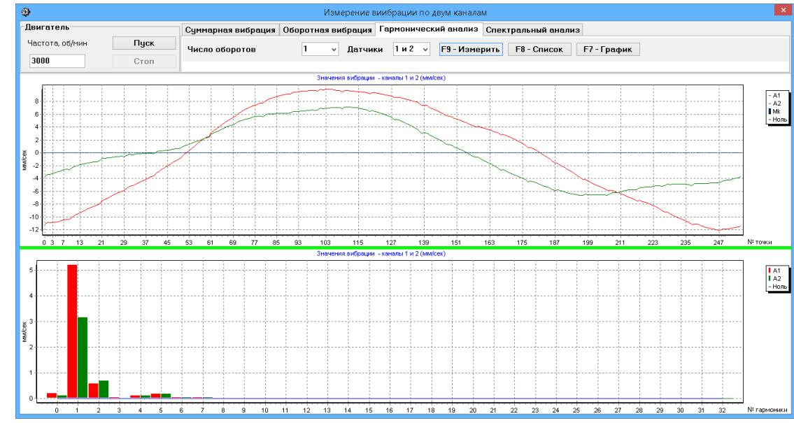

|                                                                                                                                                                                                                                                                                     |                                                                    | СОДЕРЖАНИЕ                                                                                                     |                                                                                   |                                                     |              |  |                                     |      |                  |        |  |
|-------------------------------------------------------------------------------------------------------------------------------------------------------------------------------------------------------------------------------------------------------------------------------------|--------------------------------------------------------------------|----------------------------------------------------------------------------------------------------------------|-----------------------------------------------------------------------------------|-----------------------------------------------------|--------------|--|-------------------------------------|------|------------------|--------|--|
|                                                                                                                                                                                                                                                                                     |                                                                    | 1.                                                                                                             |                                                                                   |                                                     |              |  |                                     | Лист |                  |        |  |
| Перв. примен.                                                                                                                                                                                                                                                                       |                                                                    |                                                                                                                | Назначение                                                                        |                                                     |              |  |                                     |      |                  | 3      |  |
|                                                                                                                                                                                                                                                                                     |                                                                    | 2.                                                                                                             |                                                                                   | Технические характеристики                          |              |  |                                     |      |                  | 4      |  |
|                                                                                                                                                                                                                                                                                     |                                                                    | 3.                                                                                                             |                                                                                   | Состав изделия и комплект поставки                  |              |  |                                     |      |                  | 5      |  |
|                                                                                                                                                                                                                                                                                     |                                                                    | 4.                                                                                                             |                                                                                   |                                                     |              |  | Устройство и принцип работы прибора |      |                  | 6      |  |
|                                                                                                                                                                                                                                                                                     |                                                                    | 5. Указания мер безопасности                                                                                |                                                                                   |                                                     |              |  |                                     |      | 10               |        |  |
|                                                                                                                                                                                                                                                                                     |                                                                    | 6.                                                                                                             | Подготовка прибора к работе                                                       |                                                     |              |  |                                     |      | 10               |        |  |
| №                                                                                                                                                                                                                                                                                   |                                                                    | 7.                                                                                                             |                                                                                   | Работа с прибором                                   |              |  |                                     |      |                  | 11     |  |
| Справ.                                                                                                                                                                                                                                                                              |                                                                    |                                                                                                                | 7.1 Главное рабочее окно программы. Назначение основных управ ляющих кнопок |                                                     |              |  |                                     |      |                  | 11     |  |
|                                                                                                                                                                                                                                                                                     |                                                                    | 7.2 Ввод или коррекция коэффициентов преобразования датчиков                                                |                                                                                   |                                                     |              |  |                                     |      |                  | 15     |  |
|                                                                                                                                                                                                                                                                                     |                                                                    |                                                                                                                |                                                                                   | 7.3 Балансировка в одной плоскости (статическая) |              |  |                                     |      |                  |        |  |
| 7.4 Балансировка в двух плоскостях (динамическая)                                                                                                                                                                                                                                |                                                                    |                                                                                                                |                                                                                   |                                                     |              |  | 30                                  |      |                  |        |  |
|                                                                                                                                                                                                                                                                                     |                                                                    |                                                                                                                |                                                                                   | Балансировка в трёх плоскостях (динамическая)       |              |  |                                     |      |                  |        |  |
|                                                                                                                                                                                                                                                                                     |                                                                    | Балансировка в четырёх плоскостях (динамическая) Работа в режиме измерения и индикации угла поворота ротора |                                                                                   |                                                     |              |  |                                     | 56   |                  |        |  |
|                                                                                                                                                                                                                                                                                     |                                                                    |                                                                                                                |                                                                                   |                                                     |              |  |                                     |      | 70               |        |  |
|                                                                                                                                                                                                                                                                                     |                                                                    |                                                                                                                |                                                                                   |                                                     |              |  |                                     | 73   |                  |        |  |
|                                                                                                                                                                                                                                                                                     |                                                                    | Общие указания по эксплуатации и техническому обслуживанию 8. прибора                                    |                                                                                   |                                                     |              |  |                                     |      | 78               |        |  |
|                                                                                                                                                                                                                                                                                     |                                                                    | Правила транспортирования и хранения                                                                           |                                                                                   |                                                     |              |  |                                     |      |                  | 79     |  |
| вибрации 7.5 7.6 7.7. Подпись и дата 7.8 Работа в режиме «Графики» 9. № дубл. 10. Поверка прибора Инв. 11. Свидетельство о приёмке № 12. Свидетельство об упаковке Взам. инв. 13. Гарантии изготовителя Приложение 1 |                                                                    |                                                                                                                |                                                                                   | 79                                                  |              |  |                                     |      |                  |        |  |
|                                                                                                                                                                                                                                                                                     |                                                                    |                                                                                                                |                                                                                   |                                                     |              |  |                                     |      | 80               |        |  |
|                                                                                                                                                                                                                                                                                     |                                                                    |                                                                                                                |                                                                                   |                                                     |              |  |                                     |      | 80               |        |  |
|                                                                                                                                                                                                                                                                                     |                                                                    |                                                                                                                |                                                                                   |                                                     |              |  |                                     |      |                  | 80     |  |
|                                                                                                                                                                                                                                                                                     |                                                                    |                                                                                                                |                                                                                   |                                                     |              |  |                                     |      | 81               |        |  |
| Подпись и дата                                                                                                                                                                                                                                                                      | Балансировка в эксплуатационных условиях (справочные рекомендации) |                                                                                                                |                                                                                   |                                                     |              |  |                                     |      |                  |        |  |
|                                                                                                                                                                                                                                                                                     |                                                                    |                                                                                                                |                                                                                   |                                                     |              |  |                                     |      |                  |        |  |
|                                                                                                                                                                                                                                                                                     |                                                                    | Изм.                                                                                                           | Лист                                                                              | № докум.                                            | Подпись Дата |  | КИН 044.00.00.000 ПиРЭ иРЭ       |      |                  |        |  |
|                                                                                                                                                                                                                                                                                     |                                                                    | Разраб.                                                                                                        |                                                                                   | Фельдман                                            |              |  | Прибор для балансировки             | Лит. | Лист             | Листов |  |
| № подл.                                                                                                                                                                                                                                                                             |                                                                    | Провер.                                                                                                        |                                                                                   |                                                     |              |  | «Балстан-4»                         |      | 2                | 85     |  |
|                                                                                                                                                                                                                                                                                     |                                                                    | Реценз. Н. Контр.                                                                                           |                                                                                   |                                                     |              |  | Паспорт и руководство               |      | ООО «Кинематика» |        |  |
| Инв.                                                                                                                                                                                                                                                                                |                                                                    | Утверд.                                                                                                        |                                                                                   | Шелковенко                                          |              |  | по эксплуатации                     |      |                  |        |  |

*.*

## **1. НАЗНАЧЕНИЕ**

Прибор «Балстан-4» (далее по тексту «Прибор») является портативным балансировочным комплектом, предназначенным для балансировки в одной, двух, трёх и четырёх плоскостях коррекции роторов, вращающихся в собственных подшипниках.

Прибор включает в себя: до 4-х датчиков силы (или вибрации), датчик фазового угла, измерительный блок, а также переносной компьютер - нетбук или ноутбук. (При необходимости в составе прибора возможно использование стационарного компьютера).

Кроме того, в состав прибора могут быть включены датчик угла поворота ротора и интерфейс модуль к нему, используемые при необходимости вывода на индикацию информации об угловом положении балансируемого ротора.

Прибор может быть использован при проведении сборочных, монтажных и ремонтных работ с целью снижения динамических нагрузок, действующих на подшипниковые узлы машин вследствие их неуравновешенности. При этом существенно повышается ресурс работы машин и механизмов.

Использование балансировочного комплекта позволяет во многих случаях исключить потребность в специальных балансировочных станках, так как балансировка ротора выполняется в его собственных подшипниках без разборки механизма.

При необходимости прибор «Балстан-4» может быть также использован в качестве измерительной системы балансировочного станка.

Весь процесс балансировки, включающий в себя измерение, обработку и вывод на индикацию информации о величине и месте установки корректирующего груза, выполняется в автоматизированном режиме и не требует от пользователя дополнительных навыков и знаний, выходящих за рамки настоящей инструкции.

Результаты всех балансировок сохраняются в Архиве балансировки и при необходимости могут быть распечатаны в виде протоколов.

Помимо балансировки прибор «Балстан-4» (при включении в комплект акселерометров) дополнительно может использоваться как обычный вибротахометр, позволяющий осуществлять измерение по четырём каналам среднего квадратического значения (СКЗ) суммарной вибрации, СКЗ оборотной составляющей вибрации, а также контролировать частоту вращения ротора.

Кроме того, данный прибор позволяет выводить дисплей графики временной функции и спектра вибрации (силы), что может быть полезным при оценке технического состояния балансируемой машины.

| № подл. |      |      |          |              |  |
|---------|------|------|----------|--------------|--|
|         |      |      |          |              |  |
| Инв.    |      |      |          |              |  |
|         | Изм. | Лист | № докум. | Подпись Дата |  |

*Перв. примен.*

*Справ. №*

*Подпись и дата*

*Инв. № дубл.*

*Взам. инв. №*

*Подпись и дата*

## **КИН 044.00.00.000 ПиРЭ**

| 2.1. Число плоскостей коррекции при балан                                                                                         | 2. ТЕХНИЧЕСКИЕ ХАРАКТЕРИСТИКИ               |
|-----------------------------------------------------------------------------------------------------------------------------------|---------------------------------------------|
| сировке                                                                                                                           | 1, 2, 3, 4                                  |
| 2.2. Число каналов измерения вибрации                                                                                             | 4                                           |
| 2.3. Число каналов измерения частоты вра                                                                                          |                                             |
| щения                                                                                                                             | 1                                           |
| 2.4.Диапазон измерения среднего квадрати ческого значения (СКЗ) виброскорости, мм/сек (для датчика вибрации) *) | от 0.2 до 50                                |
| 2.5. Частотный диапазон измерения СКЗ                                                                                 |                                             |
| виброскорости или силы, Гц                                                                                                     | от 5 до 200                                 |
| 2.6.Пределы допускаемой абсолютной по                                                                                             |                                             |
| грешности измерения СКЗ виброскорости на                                                                                          | ±(0.1 + 0.1*Vи),                            |
| базовой частоте (80 Гц) и в рабочем диапа                                                                                         | где Vи – измеренное значение СКЗ виброс  |
| зоне частот, мм/сек *)                                                                                                         | корости                                     |
| 2.7. Диапазон измерения частоты вращения, об/мин                                                                               | 300 - 30000                              |
| 2.8. Пределы допускаемой абсолютной по                                                                                         | ±(1 + 0.005*Nи),                            |
| грешности измерения частоты враще-ния в                                                                                           | где Nи – измеренное значение частоты вра |
| рабочем диапазоне частот, об/мин                                                                                                  | щения ротора                                |
| 2.9. Диапазон измерения сдвига фазы вибра                                                                                         |                                             |
| ции, угловых градусов                                                                                                             | от 0 до 360                                 |
| 2.10. Пределы допускаемой абсолютной по                                                                                           |                                             |
| грешности измерения сдвига фазы вибрации,                                                                                         |                                             |
| угловых градусов                                                                                                                  | ± 2                                         |
| 2.11.Габаритные размеры измерительного блока, мм, не более                                                               | 200*160*65                                  |
| 2.12.Масса измерительного блока, кг, не бо                                                                                        |                                             |
| лее                                                                                                                               | 0.9                                         |
| 2.13. Габаритные размеры вибропрео                                                                                       |                                             |
| бразователя, мм, не более                                                                                                         | 25*25*20                                    |
| 2.14. Масса вибропреобразователя, кг, не                                                                                          |                                             |
| более                                                                                                                             | 0.04                                        |
| 2.15. Габаритные размеры датчика фазового                                                                                         |                                             |
| угла, мм, не более                                                                                                                | 120*60*30                                   |
| 2.16. Масса датчика фазового с кабелем, кг,                                                                                       |                                             |
| не более                                                                                                                          | 0.2                                         |
| 2.17. Условия эксплуатации:                                                                                                       |                                             |
| ▪ температура окружающего воздуха, °C                                                                                             | от 1 до 35                                  |
| ▪ относительная влажность воздуха при температуре 25 °C, %                                                         | до 80                                       |
| ▪ атмосферное давление, кПа                                                                                                       | от 84 до 106.7                              |
| 2.18. Средний срок службы, лет, не менее                                                                                          | 6                                           |
|                                                                                                                                   |                                             |
| *) Для датчиков силы указанные параметры не нормируются                                                                           |                                             |
|                                                                                                                                   |                                             |

*Перв. примен.*

*Справ. №*

*Подпись и дата*

*Инв. № дубл.*

*Взам. инв. №*

*Подпись и дата*

*Инв. № подл.*

*Изм. Лист № докум. Подпись Дата*

# **КИН 044.00.00.000 ПиРЭ**

4

## **3. СОСТАВ ИЗДЕЛИЯ И КОМПЛЕКТ ПОСТАВКИ**

Базовый комплект поставки прибора «Технобаланс-4» включает в себя измерительный блок, до 4-х датчиков вибрации (силы), датчик фазового угла, оснастку, необходимую пользователю для выполнения основных измерений, а также CD-диск с программным обеспечением.

Дополнительно (по желанию Заказчика) прибор может быть укомплектован переносным компьютером (нетбуком, ноутбуком)

| Обозначение       | Наименование                                                                                      | Кол во | Примечание                              |
|-------------------|---------------------------------------------------------------------------------------------------|-----------|-----------------------------------------|
| КИН 044.00.00.000 | Блок измерительный                                                                                | 1         |                                         |
| DT 2234C+         | Тахометр лазерный                                                                                 | 1         |                                         |
| DS 1           | Датчик силы                                                                                       | 4         | Поставляются по выбору Заказчика     |
| AD 1              | Вибропреобразователь емкостной (на базе акселерометра ADXL335)                                 | 4         | Поставляются по выбору Заказчика     |
|                   | Преобразователь угловых перемещений                                                               | 1         | Поставляется по желанию Заказчика |
|                   | Интерфейсный модуль                                                                               | 1         | Поставляется по желанию Заказчика |
|                   | Компьютер (нетбук или ноутбук)                                                                    | 1         | Поставляется по желанию Заказчика |
|                   | Штатив магнитный                                                                                  | 1         |                                         |
|                   | Весы электронные                                                                                  | 1         |                                         |
|                   | Чемодан (сумка) для транспортировки прибора                                                    | 1         |                                         |
|                   | Документация                                                                                      |           |                                         |
| КИН 044.00.00.000 | Прибор для балансировки механизмов «Балстан - 4». Паспорт и Руководство по эксплуатации. | 1         |                                         |
| DT 2234C+         | Тахометр лазерный. Этикетка                                                                       | 1         |                                         |
|                   | Программное обеспечение на флэшнакопителе                                                      | 1         |                                         |

#### **Комплект поставки**

| № подл. |      |      |          |              |  |
|---------|------|------|----------|--------------|--|
|         |      |      |          |              |  |
| Инв.    |      |      |          |              |  |
|         | Изм. | Лист | № докум. | Подпись Дата |  |

*Перв. примен.*

*Справ. №*

*Подпись и дата*

*Инв. № дубл.*

*Взам. инв. №*

*Подпись и дата*

## **КИН 044.00.00.000 ПиРЭ**

# **4. УСТРОЙСТВО И ПРИНЦИП РАБОТЫ ПРИБОРА**

**4.1**. Фотографии прибора «Балстан-4» представлены на рис. 4.1 и 4.2.

*Перв. примен.*

*Справ. №*

*Подпись и дата*

*Инв. № дубл.*

*Взам. инв. №*

*Подпись и дата*

Прибор (см. рис. 4.1) состоит из измерительного блока **6**, четырёх датчиков вибрации (или силы) **1** ,**2**, **3, 4**, датчика фазового угла **5** и портативного компьютера (нетбука или ноутбука) **7**.

Кроме того, в состав прибора могут быть включены датчик угла поворота ротора и интерфейсный модуль к нему (на рис. 4.1 не показаны).

В комплект поставки прибора также может быть включена оснастка, необходимая для проведения балансировки механизмов в полевых условиях. В частности, магниты, используемые для установки на объекте датчиков вибрации, и магнитный штатив, используемый для установки датчика фазового угла.

Корпус измерительного блока прибора выполнен из пластика ABS серого цвета.

На лицевой стенке корпуса (см. рис. 4.2) расположены разъёмы Х1, Х2 Х3, Х4, предназначенные для подключения датчиков вибрации (силы) соответственно к 1, 2, 3 и 4 измерительным каналам прибора, а также разъём Х5, используемый для подключения датчика фазового угла.

Из боковой стенки корпуса выведен кабель с USB-разъёмом Х6, предназначенный для подключения измерительного блока к компьютеру.

На задней стенке прибора расположены разъёмы Х7 (релейный выход) и Х8 (выход ЦАП), которые могут использоваться для управления работой привода станка.

Рис. 4.1. Прибор для балансировки «Балстан-4» в комплекте

| № подл. |      |      |          |              |  |                        |      |  |  |  |
|---------|------|------|----------|--------------|--|------------------------|------|--|--|--|
|         |      |      |          |              |  |                        | Лист |  |  |  |
| Инв.    |      |      |          |              |  | КИН 044.00.00.000 ПиРЭ |      |  |  |  |
|         | Изм. | Лист | № докум. | Подпись Дата |  |                        | 6    |  |  |  |
|         |      |      |          |              |  |                        |      |  |  |  |

Рис. 4.2. Лицевая панель измерительного блока прибора «Балстан-4».

**4.2.** Функциональная схема прибора приведена на рис. 4.3.

Прибор включает в себя следующие конструктивные единицы: измерительный блок **6**, датчики вибрации (силы) **1**, **2**, **3, 4**, датчик фазового угла (лазерный тахометр) **5**, портативный компьютер **7**

Как видно из схемы, в корпусе измерительного блока установлены модуль **8** АЦП/ЦАП Е154 (или Е14-140-М)**,** к которому подключена плата **9** нормирующих преобразователей сигналов датчиков**.**

На плате **9** собраны основные узлы, обеспечивающие нормирование сигналов с датчиков, в том числе:

- интеграторы **10**, **11, 12, 13** сигналов датчиков вибрации по первому, второму, третьему и четвёртому измерительным входам;
- преобразователь **14** сигнала датчика фазового угла;
- преобразователь **15** питания DC-DC +5B/+3B;
- преобразователь **16** питания DC-DC +5B/+12B.

Принцип действия прибора основан на измерении механических колебаний (деформаций), которые имеют место на корпусах машин при их работе.

Для преобразования механических колебаний (относительных деформаций опор) в электрический сигнал используются датчики вибрации – емкостные интегральные акселерометры **1-4** (или пьезоэлектрические датчики силы).

Для определения фазовых характеристик сигнала используется оптический лазерный тахометр **5**, работающий на отражение.

 Как уже отмечалось выше, в комплект поставки прибора могут быть включены преобразователь (датчик) угловых перемещений **17** и интерфейсный модуль **18**, которые используются совместно для вывода на индикацию информации об угле поворота балансируемого ротора.

| № подл. |      |      |          |              |  |
|---------|------|------|----------|--------------|--|
|         |      |      |          |              |  |
| Инв.    |      |      |          |              |  |
|         | Изм. | Лист | № докум. | Подпись Дата |  |

*Перв. примен.*

*Справ. №*

*Подпись и дата*

*Инв. № дубл.*

*Взам. инв. №*

*Подпись и дата*

## **КИН 044.00.00.000 ПиРЭ**

Под воздействием механических колебаний на выходе датчика вибрации (силы) формируется электрический аналоговый сигнал пропорциональный виброускорению (силе), который подается на соответствующий вход измерительного блока **6** прибора.

Далее после преобразования (интегрирования, полосовой фильтрации) видоизмененный сигнал пропорциональный виброскорости поступает на соответствующий аналоговый вход модуля **8** АЦП/ЦАП Е154 (Е14-140-М), в котором преобразуется в цифровую форму и запоминается в его оперативном запоминающем устройстве (ОЗУ).

*Перв. примен.*

*Справ. №*

*Подпись и дата*

*Инв. № дубл.*

*Взам. инв. №*

*Подпись и дата*

В случае необходимости измерения частоты вращения и/или фазовых характеристик вибрационного сигнала дополнительно используется импульсный сигнал, формируемый датчиком фазового угла **5**, который после нормирования также подается на соответствующий аналоговый вход модуля **8**.

В модуле **8** АЦП/ЦАП производится предварительная цифровая обработка и запоминание аналоговых сигналов, поступающих с датчиков. После чего оцифрованные сигналы по шине USB передаются в портативный компьютер **7**, в котором по заданной программе осуществляется дальнейшая обработка цифрового сигнала (фильтрация, интерполяция, Фурье – анализ, вычисление параметров балансировки и т.д.).

Полученные результаты (численные значения амплитуды и фазы вибрации, частоты вращения и т.п.) выводятся на дисплей компьютера и запоминаются в соответствующих отделах его памяти.

В зависимости от выбранного режима балансировки (одна, две, три или четыре плоскости коррекции) последовательно выполняется соответствующее количество измерений вибрации объекта в исходном состоянии и после установки пробного груза, используемого для тарировки прибора.

По результатам измерений в цифровом виде осуществляется решение задачи балансировки, после чего на дисплей компьютера выводятся данные о величине и угле установки корректирующей массы.

Роль пользователя сводится при этом к установке пробных и корректирующих грузов на балансируемом роторе и нажатию по готовности соответствующих клавиш на клавиатуре компьютера (или виртуальных клавиш на дисплее).

Весь процесс балансировки, включающий в себя измерение, обработку сигнала и вычисление результата, выполняется в автоматизированном режиме по программам, находящимся в памяти компьютера.

 На задней стенке прибора установлены разъёмы Х7 (**19**) и Х8 (**20**), сигналы с которых можно использовать для управления работой привода балансировочного станка.

 Разъём Х7 позволяет подключиться к релейному выходу прибора, с помощью которого осуществляется программное управление пуском и остановом двигателя. Для этого в разъёме задействованы следующие контакты:

- контакт 1 нормально разомкнутый контакт;
- контакт 3 центральный контакт;
- контакт 5 нормально замкнутый контакт.

 Разъём Х8 используется для вывода постоянного напряжения, программно формируемого ЦАП прибора. Диапазон регулирования выходного сигнала ЦАП находится в пределах от 0 -10 В. Указанный сигнал может использоваться при управлении частотным регулятором для программного задания частоты вращения электропривода.

В разъёме задействованы контакт 1 (выход ЦАП) и контакт 2 (0 В).

| № подл. |      |      |          |              |                        |      |
|---------|------|------|----------|--------------|------------------------|------|
|         |      |      |          |              |                        | Лист |
| Инв.    |      |      |          |              | КИН 044.00.00.000 ПиРЭ |      |
|         | Изм. | Лист | № докум. | Подпись Дата |                        | 9    |

1. **Внимание!** При работе прибора от сети 220В необходимо соблюдать правила электробезопасности. Не допускается проводить ремонт прибора при его подключении к сети 220 В.

2. В случае эксплуатации прибора в условиях низкого качества сетевого питания и заметных сетевых помех рекомендуется использовать режим автономного питания от аккумуляторов компьютера.

При этом с целью увеличения времени эксплуатации прибора на автономном питании рекомендуется в случае длительных перерывов в его работе переводить компьютер в режим **гибернации (спящий режим)**.

В этом случае вся имеющаяся на момент выключении компьютера информация автоматически сохраняется в его энергонезависимой памяти, что позволяет при повторном запуске продолжить работу прибора с начала прерванного шага программы.

# **6. ПОДГОТОВКА ПРИБОРА К РАБОТЕ**

6.1. Установить датчики вибрации (силы) **1, 2, 3, 4** на опорах балансировочного станка или балансируемого механизма.

Подробная информация об установке датчиков вибрации дана в приложении 1.. Подключить датчики вибрации к разъемам Х1, Х2, Х3, Х4.

6.3. Установить датчик фазового угла (лазерный тахометр) **5** таким образом, чтобы номинальный зазор между радиальной (или торцовой) поверхностью балансируемого ротора и корпусом датчика находился в диапазоне от 10 до 300 мм.

Наклеить на поверхность ротора метку из катафотной ленты шириной не менее 10 -15 мм.

Подключить датчик фазового угла к разъёму Х5.

6.4. Подключить измерительный блок к USB-входу компьютера.

6.5. Подключить датчик угла поворота ротора **17** к интерфейсному модулю **18**, который в свою очередь подключить к USB-входу компьютера.

6.6. Подключить релейный выход (разъём Х7) и выход ЦАП (разъём Х8) к управляемому приводу станка.

6.7. При использовании сетевого питания подключить компьютер к блоку сетевого питания. Подключить блок питания к сети 220 В, 50 Гц.

6.8. Включить компьютер и выбрать программу Stanok 4pl ….

| № подл. |      |      |          |              |  |
|---------|------|------|----------|--------------|--|
|         |      |      |          |              |  |
| Инв.    |      |      |          |              |  |
|         | Изм. | Лист | № докум. | Подпись Дата |  |

*Перв. примен.*

*Справ. №*

*Подпись и дата*

*Инв. № дубл.*

*Взам. инв. №*

*Подпись и дата*

# 10 **КИН 044.00.00.000 ПиРЭ**

# **7. РАБОТА С ПРИБОРОМ**

## **7.1. Главное рабочее окно программы. Назначение основных управляющих кнопок.**

*Перв. примен.*

*Справ. №*

*Подпись и дата*

*Инв. № дубл.*

*Взам. инв. №*

*Подпись и дата*

При запуске программы «Балстан-4» на дисплее компьютера появляется главное рабочее окно программы, представленное на рис. 7.1.

Рис. 7.1. Главное рабочее окно программы «Балстан-4»

Для управления работой программы в указанном окне имеется 13 виртуальных кнопок, на которых нанесены названия реализуемых при их нажатии функций.

Для нажатия выбранной кнопки необходимо навести на неё стрелку «мышки» и «щёлкнуть» по ней, нажав левую клавишу «мышки».

Управление работой в Главном окне программы также может осуществляться с помощью функциональных клавиш клавиатуры компьютера, обозначение которых также нанесено на соответствующих кнопках окна.

**7.1.1**. Кнопки выбора плоскостей балансировки**.**

При нажатии кнопки **«Балансировка в 1-й плоскости»** производится выбор режима балансировки в одной плоскости, выполняемого с использованием датчика вибрации (силы) **1**, установленного на опоре 1 станка (или балансируемой машины) и подключённого к входу **Х1** измерительного блока.

После нажатия этой кнопки на дисплее компьютера остаётся только одна круговая диаграмма с надписью **«Опора 1»**, используемая для вывода результатов балансировки в одной плоскости (см. рис. 7.2).

При нажатии кнопки **«Балансировка в 2-х плоскостях»** производится выбор режима балансировки в двух плоскостях с использованием датчиков вибрации (силы) **1** и **4**, установленных соответственно на опорах станка (балансируемой машины) **1** и **4** и подключённых к входам **Х1** и **Х4** измерительного блока.

| № подл. |      |      |          |              |                        |      |
|---------|------|------|----------|--------------|------------------------|------|
|         |      |      |          |              |                        | Лист |
| Инв.    |      |      |          |              | КИН 044.00.00.000 ПиРЭ |      |
|         | Изм. | Лист | № докум. | Подпись Дата |                        | 11   |

*Перв. примен.*

*Справ. №*

Рис. 7.2. Вид главного рабочего окна программы «Балстан-4» после нажатия кнопки **«Балансировка в 1-й плоскости»**

При этом на дисплее компьютера появляются две круговые диаграммы с надписью **«Опора 1» и «Опора 4»**, используемые для вывода результатов балансировки в в двух плоскостях (см. рис. 7.3).

**2** и **4**, установленных соответственно на опорах станка (балансируемой машины) **1, 2**, **4** и подключённых к входам **Х1, Х2**, **Х4** измерительного блока.

 При этом на дисплее компьютера появляются три круговые диаграммы с надписью **«Опора 1», «Опора 2» и «Опора 4»**, используемые для вывода результатов балансировки в трёх плоскостях (см. рис. 7.4).

 При нажатии кнопки **«Балансировка в 4-х плоскостях»** производится выбор режима балансировки в четырёх плоскостях с использованием датчиков вибрации (силы, установленных соответственно на опорах станка (балансируемой машины) **1, 2**, **3**, **4** и подключённых к входам **Х1, Х2**, **Х3**, **Х4** измерительного блока.

При этом на дисплее компьютера сохраняются четыре круговые диаграммы с надписью **«Опора 1», «Опора 2», «Опора 3» и «Опора 4»**, используемые для вывода результатов балансировки в четырёх плоскостях (см. рис. 7.1).

# **7.1.2**. Кнопка **«Датчики».**

При нажатии этой кнопки пользователь может войти в рабочее окно «Коэффициенты преобразования датчиков» и, при необходимости, провести корректировку этих коэффициентов.

# **7.1.3**. Кнопка **«F3 - Дополн.».**

Данная кнопка (или функциональная клавиша **F3** на клавиатуре компьютера) используется при проведении балансировки в режиме "Повторно» для вывода на дисплей компьютера результатов балансировки в табличной форме, а также для выполнения ряда дополнительных операций (индикации угла поворота ротора; суммирования и разложения векторов корректирующих грузов; вывода истории процесса измерений).

|  |      |      |          |              |                        | Лист |
|--|------|------|----------|--------------|------------------------|------|
|  |      |      |          |              | КИН 044.00.00.000 ПиРЭ |      |
|  | Изм. | Лист | № докум. | Подпись Дата |                        | 13   |

*Подпись и дата Инв. № дубл. Взам. инв. № Подпись и дата Инв. № подл.*

*Перв. примен.*

*Справ. №*

## **7.1.4**. Кнопка **«F4 - Новый».**

*Перв. примен.*

*Справ. №*

*Подпись и дата*

*Инв. № дубл.*

*Взам. инв. №*

*Подпись и дата*

Данная кнопка (или функциональная клавиша **F4** на клавиатуре компьютера) используется при проведении балансировки партии роторов в режиме "Повторно» для обнуления результатов балансировки предыдущего ротора и перехода к балансировке нового ротора.

### **7.1.5**. Кнопка **«F5 – График».**

При нажатии этой кнопки (или функциональной клавиши **F5** на клавиатуре компьютера) включается режим графического представления результатов измерений, при реализации которого на дисплей выводятся графики её временной функции и спектра вибрационного сигнала.

## **7.1.6**. Кнопка **«F6 – Архив».**

При нажатии этой кнопки (или функциональной клавиши **F6** на клавиатуре компьютера) осуществляется переход в Архив балансировки, из которого можно распечатать протокол с результатами балансировки для конкретного механизма (или ротора).

### **7.1.7**. Кнопка **«F7 –Настройка».**

После нажатия этой кнопки (или функциональной клавиши **F7** на клавиатуре компьютера) в режиме первичной балансировки выполняется ввод исходных данных и производится тарировка (настройка для конкретного типа ротора) измерительной системы станка с использованием пробных грузов.

 Результаты, полученные на этапе настройки (коэффициенты балансировки), сохраняются в памяти прибора для каждого конкретного типа ротора, что позволяет в дальнейшем выполнять балансировку роторов этого типа ротора за один пуск.

### **7.1.8**. Кнопка **«F8 – Выбор».**

При нажатии этой кнопки (или функциональной клавиши **F8** на клавиатуре компьютера) в режиме повторной балансировки осуществляется выбор конкретного типа ротора, для которого ранее в режиме «Настройка» были определены коэффициенты балансировки.

### **7.1.9**. Кнопка **«F9 – Баланс».**

При нажатии этой кнопки (или функциональной клавиши **F9** на клавиатуре компьютера) в режиме повторной балансировки начинают выполняться измерения вибрации (силы) на опорах станка, используемые для расчёта параметров корректирующих грузов.

### **7.1.10**. Кнопка **«F10 – Выход».**

При нажатии этой кнопки (или функциональной клавиши **F10** на клавиатуре компьютера) осуществляется завершение работы по программе «Балстан-4».

| № подл. Инв. |  |      |      |          |              |                        |      |
|-----------------|--|------|------|----------|--------------|------------------------|------|
|                 |  |      |      |          |              |                        | Лист |
|                 |  |      |      |          |              | КИН 044.00.00.000 ПиРЭ |      |
|                 |  | Изм. | Лист | № докум. | Подпись Дата |                        | 14   |

## **7.2. Ввод или корректировка коэффициентов преобразования датчиков вибрации (силы) и других настроечных параметров.**

При нажатии в Главном рабочем окне программы кнопки **«Датчики»** на дисплее компьютера появляется рабочее окно «Коэффициенты преобразования» (см. рис. 7.5).

В этом окне проводится корректировка коэффициентов преобразования датчиков вибрации, необходимость в которой выявляется в процессе проведения их калибровки.

Для ввода уточнённого по результатам калибровки значения коэффициента преобразования необходимо навести стрелку «мышки» на соответствующее окошко «**Кпрi**» рабочего окна, «щёлкнуть» по нему левой клавишей «мышки» и ввести соответствующее значение коэффициента преобразования датчика вибрации.

#### **Внимание!**

*Перв. примен.*

*Справ. №*

*Подпись и дата*

*Инв. № дубл.*

*Взам. инв. №*

*Подпись и дата*

*Инв. № подл.*

**При вводе коэффициента преобразования его дробная часть отделяется от целой части запятой (знаком « , »).**

 В этом же окне, при необходимости, имеется возможность провести корректировку, учитывающую величину смещения нуля АЦП измерительного блока.

| - Балансировочный комплект "БалКом - 2 " для балансировочных станков |            |                       |             |                         | ×            |
|----------------------------------------------------------------------|------------|-----------------------|-------------|-------------------------|--------------|
| -Наименование предприятия Завод №3                                |            |                       |             | Для служебных сообщений |              |
| Коэффициенты преобразования                                          |            |                       |             |                         |              |
| Кпр1 (мВу.е.)                                                        | 25         | Кпр3 (мВу е.)         | 25          |                         |              |
| Кпр2 (мВу.е.)                                                        | 25         | Кпр4 (мВу.е.)         | 25          |                         |              |
| Смещение "нуля"                                                      |            |                       |             |                         |              |
| Vs1 (y.e.)                                                           | 0          | Vs3 (y.e.)            | 0           |                         |              |
| Vs2 (y.e.)                                                           | 0          | Vs4 (y.e.)            | 0           |                         |              |
| Дисбаланс                                                            |            | -Усреднение           |             |                         |              |
| Единица измерения                                                    | LAMM >  | Число, штук           | 64 V     |                         |              |
| Шкив двигателя                                                       |            | -ЦАП-                 |             |                         |              |
| Диаметр, мм                                                          | 100        | Макс. частота, об/мин | 3000        |                         |              |
| Датчик поворота                                                      |            |                       |             |                         |              |
| Число штрихов, шт.                                                   | 400        | Направление           | прямое > | Порт для связи          | COM19 V   |
| F10 - Выход                                                          | F8 - Сброс |                       |             |                         | F9 - Принять |

Рис. 7.5. Рабочее окно для ввода коэффициентов преобразования датчиков вибрации и ряда других параметров.

В случае ошибочного ввода какого-либо коэффициента преобразования для устранения ошибки необходимо «щёлкнуть мышкой» по кнопке «**Отменить**», после чего можно повторить ввод данного коэффициента.

# **Внимание! При использовании датчиков силы коэффициенты**

### **преобразования устанавливаются равными 25 мВ/мм/с**

В этом же окне можно выбрать вариант задания единиц измерения остаточного дисбаланса:

|      |      |          |              |                        | Лист |
|------|------|----------|--------------|------------------------|------|
|      |      |          |              | КИН 044.00.00.000 ПиРЭ |      |
| Изм. | Лист | № докум. | Подпись Дата |                        | 15   |

**- г\*мм** (остаточный дисбаланс);

- **мкм** (удельный остаточный дисбаланс).

Кроме того, в соответствующих разделах рабочего окна следует задать количество циклов (число) усреднений, выполняемых при измерении вибрации, а также **максимальную** частоту вращения электродвигателя привода.

При использовании в составе прибора импульсного преобразователя угловых перемещений ротора в соответствующих разделах окна необходимо:

- задать число импульсов, генерируемых датчиком за 1 оборот;

- выбрать направление отсчёта (прямое или обратное);
- задать диаметр шкива вала, на котором установлен датчик;
- задать COM-порт связи, который используется для подключения интерфейсного модуля преобразователя угловых перемещений к компьютеру \*).

\*) Примечание: Порт связи, используемый для подключения преобразователя, опреде ляется в разделе «Диспетчер устройств» компьютера пользователя.

После завершения ввода коэффициентов преобразования датчиков по обоим измерительным каналам, а также других параметров необходимо «щёлкнуть мышкой» по кнопке «**Принять**», после чего новые значения коэффициентов будут сохранены в памяти программы.

Для продолжения работы по программе необходимо «щёлкнуть мышкой» по кнопке «**F10 – Выход**» и вернуться в Главное рабочее окно программы.

#### **7.3. Балансировка в одной плоскости (статическая).**

Перед началом работы в режиме «**Балансировка в 1-й плоскости**» необходимо убедиться, что датчик вибрации (силы) **1** установлен на опоре 1 балансировочного станка и подключен к входу **Х1** измерительного блока.

Оптический датчик фазового угла **5** должен быть подключен к входу **Х5** измерительного блока. Кроме того, для обеспечения работы этого датчика на доступную поверхность шпинделя станка должна быть нанесена специальная метка, имеющая отражающую способность, контрастную по отношению к отражающей способности поверхности шпинделя.

Работа по программе в режиме "**Балансировка в 1-й плоскости**" начинается из Главного рабочего окна программы.

Для этого первоначально необходимо «щёлкнуть мышкой» по кнопке **«Балансировка в 1-й плоскости».**

Подтверждением того, что выбран режим балансировки в одной плоскости, является появление на дисплее компьютера рабочего окна с круговой диаграммой, представленной на рис. 7.2.

 Работа в этом режиме предусматривает возможность использования одного из двух вариантов балансировки:

– **«Первичной»** балансировки;

– **«Повторной»** балансировки.

«**Первичная**» балансировка обычно выполняется для роторов, которые ранее не балансировались и для которых в архивной памяти компьютера отсутствует информация, необходимая для проведения «**Повторной**» балансировки (численные значения коэффициентов балансировки и масса пробного груза и т.п.).

| № подл. |      |      |          |              |                        |      |
|---------|------|------|----------|--------------|------------------------|------|
|         |      |      |          |              |                        | Лист |
| Инв.    |      |      |          |              | КИН 044.00.00.000 ПиРЭ |      |
|         | Изм. | Лист | № докум. | Подпись Дата |                        | 16   |

*Перв. примен.*

*Справ. №*

*Подпись и дата*

*Инв. № дубл.*

*Взам. инв. №*

*Подпись и дата*

При выполнении «**Первичной**» балансировки в 1-й плоскости, требуется проведение как минимум трёх пусков необходимых для тарировки измерительной системы прибора. (двух настроечных и одного проверочного пусков машины).

При этом во время первого пуска определяется исходная вибрация машины.

 Второй пуск машины выполняется после установки на ротор пробного груза, с помощью которого производится настройка прибора для балансировки конкретного типа ротора.

 На третьем пуске осуществляется проверка эффективности результатов балансировки.

«**Повторная**» балансировка может выполняться только для уже ранее отбалансированных роторов, для которых определены и занесены в память прибора масса пробного груза, коэффициенты балансировки и ряд других параметров.

 В этом случае для определения массы и места установки корректирующего груза, необходимого для компенсации дисбаланса, требуется проведение двух пусков (одного настроечного и одного проверочного).

### **7.3.1. Первичная балансировка в 1-й плоскости.**

*Перв. примен.*

*Справ. №*

*Подпись и дата*

*Инв. № дубл.*

*Взам. инв. №*

*Подпись и дата*

 Первичная балансировка в 1-й плоскости начинается из рабочего окна, представленного на рис.7.2, при нажатии кнопки **«F7 –Настройка».**

При этом на дисплей компьютера выводится рабочее окно для ввода исходных данных - **«Балансировка в 1-й пл., исходные данные»** (см. рис. 7.6.).

| Масса ротора, кг- Масса пробного груза, г |     |                                     |        |        |  |           |  |  |
|-------------------------------------------|-----|-------------------------------------|--------|--------|--|-----------|--|--|
| 5                                         |     | Пл.1                                |        | 1      |  |           |  |  |
| Способ коррекции массы                    |     |                                     |        |        |  |           |  |  |
| • Добавление                              |     |                                     |        | О Съём |  | Сверление |  |  |
| Вращение                                  |     |                                     |        |        |  |           |  |  |
|                                           |     | Частота при балансировке, об/мин    |        | 3000   |  |           |  |  |
|                                           |     |                                     |        |        |  |           |  |  |
|                                           |     |                                     |        |        |  |           |  |  |
| Система координат                         |     |                                     |        |        |  |           |  |  |
|                                           |     |                                     |        |        |  |           |  |  |
| О Полярная                                |     |                                     |        |        |  |           |  |  |
|                                           |     |                                     |        | н.д.   |  |           |  |  |
|                                           |     |                                     |        |        |  |           |  |  |
| О Лопастная                               |     | Радиус установки пробного груза, мм |        |        |  |           |  |  |
| Пл.1                                      | 50  |                                     |        |        |  |           |  |  |
|                                           |     |                                     |        |        |  |           |  |  |
|                                           |     |                                     |        |        |  | Расчёт    |  |  |
| Допуск на дисбаланс, *мм Пл.1          |     |                                     |        |        |  |           |  |  |
|                                           |     | Диаметры шкивов рем. Передачи, мм   |        |        |  |           |  |  |
| Шкив                                      | 100 |                                     | Деталь | н д.   |  | Расчёт    |  |  |

Рис. 7.6. Рабочее окно для ввода исходных данных при балансировке в одной плоскости.

| № подл. |      |      |          |              |                        |      |
|---------|------|------|----------|--------------|------------------------|------|
|         |      |      |          |              |                        | Лист |
| Инв.    |      |      |          |              | КИН 044.00.00.000 ПиРЭ |      |
|         | Изм. | Лист | № докум. | Подпись Дата |                        | 17   |

### **7.3.1.1. Ввод исходных данных.**

*Перв. примен.*

*Справ. №*

*Подпись и дата*

*Инв. № дубл.*

*Взам. инв. №*

*Подпись и дата*

Ввод исходных данных для проведения первичной балансировки начинается с ввода в разделе **«Масса ротора»** массы балансируемого ротора в **килограммах**.

Далее в разделе «**Масса пробного груза**» вводится масса пробного груза, который будет устанавливаться на роторе в **граммах**.

Далее в разделе **«Способ коррекции»** выбирается способ компенсации дисбаланса.

В данном разделе предлагается два возможных варианта коррекции:

а) «**Добавление»** корректирующих грузов;

б) **«Съём»** (удаление) корректирующих грузов.

Для этого необходимо с помощью мышки поставить метку рядом с соответствующей надписью.

В варианте съёма корректирующего груза возможно его отображение в единицах глубины сверления (в **мм**).

Для этого следует дополнительно нажать кнопку «**Сверление**», после чего появляется рабочее окно для ввода необходимых исходных данных (см. рис. 7.7).

| Глубина сверления - исходные данные данные - Сман Саманского |          | O OX    |
|--------------------------------------------------------------|----------|---------|
| Плоскость 1-                                                 |          |         |
| Диаметр сверла, мм                                           |          |         |
| Максимальная глубина сверления, мм                           |          | н.Д.    |
| Удельный вес высверливаемого материала, г/см3   Н.д.         |          |         |
|                                                              |          |         |
|                                                              |          |         |
|                                                              |          |         |
|                                                              |          |         |
|                                                              |          |         |
|                                                              | Отменить | Принять |
|                                                              |          |         |

Рис. 7.7. Рабочее окно для ввода исходных данных, необходимых для расчета масс корректирующего груза в единицах глубины сверления .

После ввода всех запрашиваемых данных в указанном окне следует с помощью «мышки» нажать кнопку **«Принять»** и вернуться в предыдущее рабочее «Балансировка в 1-й плоскости. Исходные данные» (см. рис. 7.6).

В случае ошибочного ввода какого-либо параметра следует нажать кнопку **«Отменить»** и повторить ввод исходных данных.

#### **ВНИМАНИЕ!**

**При вводе исходных данных их дробная часть отделяется от целой части запятой (знаком « , »).**

| № подл. |      |      |          |              |  |
|---------|------|------|----------|--------------|--|
|         |      |      |          |              |  |
| Инв.    |      |      |          |              |  |
|         | Изм. | Лист | № докум. | Подпись Дата |  |

# 18 **КИН 044.00.00.000 ПиРЭ**

 После этого в следующем разделе «**Вращение**» (см. рис. 7.6) необходимо ввести частоту вращения ротора, на которой должна проводиться его балансировка. Частота вращения ротора вводится **в оборотах в минуту.**

Далее в разделе «**Система координат**» (см. рис. 7.6) следует выбрать один из возможных вариантов размещения корректирующих грузов на балансируемом роторе – в «**Полярной**» или «**Лопастной**» системе координат. Для этого необходимо с помощью мышки поставить метку рядом с соответствующей надписью.

*Перв. примен.*

*Справ. №*

*Подпись и дата*

*Инв. № дубл.*

*Взам. инв. №*

*Подпись и дата*

В случае выбора варианта размещения грузов по лопастям рабочего колеса балансируемой машины необходимо ввести число лопастей ротора в соответствующем окошке, расположенном рядом с надписью «**Лопастная**».

Далее в следующем разделе данного рабочего окна (см. рис. 7.6) необходимо ввести радиус установки пробного груза, что позволяет рассчитывать величину остаточного дисбаланса ротора в «**г \* мм**».

После этого следует заполнить последний раздел данного рабочего окна «**Допуск на дисбаланс, г\*мм**», введя в соответствующем окне допуск на величину остаточного дисбаланса. Указанный допуск обычно задаётся в технической документации.

Если допуск в технической документации отсутствует, то его можно рассчитать с учётом требований ГОСТ ИСО 1940-1-2007.

Для этого в разделе рабочего окна «**Допуск на дисбаланс, г\*мм**» (см. рис. 7.6) следует нажать кнопку **«Расчёт».**

При этом на дисплее компьютера появится таблица (см. рис.7.8) с перечнем типов различных механизмов, для роторов которых по ГОСТ ИСО 1940-1-2007 рекомендованы соответствующие классы допустимого дисбаланса.

|        |                                                                         | Рабочая частота вращения ротора, об/мин                                                                                            |                                      |  |
|--------|-------------------------------------------------------------------------|------------------------------------------------------------------------------------------------------------------------------------|--------------------------------------|--|
|        | (скорость движения поршня менее 9 м/с)                                  | О G 4000     Приводные коленчатыв вель (конструктивно не уравновешенные) для крупных низкоскоростных двигателей                    |                                      |  |
|        | (скорость движения моршня менее 9 м/с)                                  | OG1600   Приводные коленчатые валы (коструктивно уравновешенные) для крупных низкоскоростных двигателей                            |                                      |  |
| OG 830 |                                                                         | Приводные коленчатые валы (конструктивно не уравновешенные) на виброизоляторах                                                     |                                      |  |
| OG 250 |                                                                         | Приводные коленчатые валы (конструктивно не уравновешенные) на жёстких опорах                                                      |                                      |  |
| OG 100 |                                                                         | Двигатели возвратно-поступательного действия в сборе для легковых автомобилей, грузовиков и локомотвов                             |                                      |  |
| O G 40 | Детали автомобилей: колёса, колёсные диски, колёсные пары, трансимссии; | Приводные коленчатые валы (коструктивно уравновешенные) на виброизоляторах                                                         |                                      |  |
| OG 16  | Сельскохозяйственные машины; Дробилки;                               | Приводные валы (карданные валы, винтовые валы); Приводные коленчатые валы (уравновешенные) на жёстких опорах                    |                                      |  |
|        | Авиационные газовые турбины;                                            | Центрифуги (сепараторы, отстойники);                                                                                               |                                      |  |
| OG 6,3 | Электрические двигатели высотой оси вала менее 80мм;                    | Электрические двигатели и генератори оси вла не менее 80мм) с максимальной настотой врещения до 500 ми                             |                                      |  |
|        | Вентиляторы; Металлорежущие станки;                                  | Зубчатые передачи; Бумагоделательные машины;                                                                                    | Машины общего назначения; Насосы; |  |
|        | Турбонагнетатели;                                                       | Водяные турбины                                                                                                                    |                                      |  |
| OG 2,5 | Компрессоры)                                                            | Приводы управления от компьютера; Электрические двигатели и генераторы (свысотой оси вала не менее 80мм) смаксимальной частотой |                                      |  |
|        | вращения свыше 950 мин-1; Газовые и паровые турбины;                 | Приводы металлорежущих станков;                                                                                                    | Текстильные станки                   |  |
| OG1    | Приводы аудио- и видеоаппаратуры;                                       | Приводы шлифовальных станков (машин)                                                                                               |                                      |  |
| OG 0,4 | Шпиндели и приводы высокоточного оборудования;                          | Гироскопы                                                                                                                          |                                      |  |

 Рис.7.8. Рабочее окно для выбора класса балансировки машин по ГОСТ ИСО 1940-1-2007.

|      |      |          |  |              | Лист                   |
|------|------|----------|--|--------------|------------------------|
|      |      |          |  |              |                        |
| Изм. | Лист | № докум. |  |              | 19                     |
|      |      |          |  | Подпись Дата | КИН 044.00.00.000 ПиРЭ |

 Для начала работы в этом окне необходимо ввести рабочую частоту вращения ротора в оборотах в минуту**.**

 Ввод рабочей частоты выполняется в левом верхнем окошке таблицы, представленной на рис.7.8.

В указанной таблице необходимо выбрать класс точности балансировки ротора, для чего следует с помощью «мышки» поставить метку в соответствующем разделе рабочего окна и нажать кнопку «**Принять**».

 После этого выполняется возврат в рабочее окно ввода исходных данных (см. рис. 7.6), в котором в дополнение к ранее введённым параметрам указывается величина допуска на остаточный дисбаланс ротора, рассчитанного с учётом требований ГОСТ ИСО 1940-1-2007.

 Далее в соответствующем разделе рабочего окна ввода исходных данных (см. рис. 7.6) следует ввести диаметр шкива шпинделя в мм, используемый для расчёта передаточного отношения ременной передачи, связывающей электродвигатель и шпиндель станка.

При необходимости процесс ввода исходных данных в данном рабочем окне (см. рис. 7.6) может быть прерван с помощью кнопки **«F10 – Выход»,** нажатие которой позволяет вернуться в предыдущее рабочее окно.

 После завершения ввода всех указанных выше данных следует нажать кнопку «F9 – Продолжить» и перейти к выполнению цикла измерений в рабочем окне **«Балансировка в 1-й плоскости»**, представленном на рис. 7.9.

| 4 Балансировка в 1-й плоскости Пуск без груза |  |               |
|--------------------------------------------------|--|---------------|
|                                                  |  | Noo E H. д.   |
|                                                  |  | F9 - Измерить |
| I руз в плоскости 1-                             |  |               |
|                                                  |  | Noo = H. д.   |
|                                                  |  | F9 - Измерить |
|                                                  |  |               |
|                                                  |  |               |
|                                                  |  |               |
| Проверка                                         |  | Noo = н.д.    |
|                                                  |  | F9 - Измерить |
| F10 - Выход                                      |  |               |

Рис. 7.9. Рабочее окно, используемое для измерений при балансировке в одной плоскости при настройке.

| № подл. |      |      |          |              |  |
|---------|------|------|----------|--------------|--|
|         |      |      |          |              |  |
| Инв.    |      |      |          |              |  |
|         | Изм. | Лист | № докум. | Подпись Дата |  |

*Перв. примен.*

*Справ. №*

*Подпись и дата*

*Инв. № дубл.*

*Взам. инв. №*

*Подпись и дата*

# 20 **КИН 044.00.00.000 ПиРЭ**

#### **7.3.1.2. Измерения при проведении балансировки.**

Как уже отмечалось выше, «**Первичная**» балансировка требует проведения двух настроечных (тарировочных) пусков и, как минимум, одного проверочного пуска баласируемой машины.

Измерение вибрации на первом пуске машины выполняется в рабочем окне «**Балансировка в 1-й плоскости**» (см. рис. 7.9) в разделе **«Пуск без груза».**

На готовность программы к работе в данном разделе указывает темно-зеленый цвет фона раздела и подсветка кнопок **«F8 – Возврат»** и **«F9 – выполнить»,** расположенных в его правой части.

Кнопка **«F8 – Возврат»** (или функциональная клавиша **F8**) может использоваться для возврата в предыдущее рабочее окно программы.

Для проведения измерения параметров вибрации в разделе **«Пуск без груза»**  необходимо «щёлкнуть мышкой» по кнопке **«F9 – Выполнить» (**или нажать клавишу **F9** на клавиатуре компьютера**),** после чего начинают выполняться замер вибрации и обработка результатов измерений, которые в зависимости от частоты вращения ротора могут длиться от 2 до 30 секунд.

 **Внимание! В случае, когда фактическая частота вращения ротора более чем на 10% отличается от заданного значения, измерение вибрации не производится и поверх рабочего окна, представленного на рис. 7.9, появляется табло с результатами измерения частоты вращения.**

 **При этом, если фактическая частота вращения ротора выше заданной, цвет фона табло красный, а если ниже – синий.**

 **Измерения вибрации может быть продолжено только после подстройки частоты вращения балансируемого ротора до заданного уровня.** 

При успешном выполнении процесса измерений в соответствующих окошках раздела «Пуск без груза» появляются результаты измерения частоты вращения ротора (**Nоб**), а также значение составляющей СКЗ (**Vо1**) и фазы (**F1**) вибрации (силы), проявляющейся на частоте вращения баланcируемого ротора.

При этом также меняется цвет фона раздела **«Груз в плоскости 1» (**с салатного на темно-зеленый) и включается подсветка кнопок **«F8 – Возврат» и «F9 – выполнить»**, что указывает на готовность прибора к работе на втором пуске.

Кнопка **«F8 – Возврат»** (или функциональная клавиша **F8**) используется для возвращения в раздел **«Пуск без груза»** и проведения при необходимости повторного измерения параметров вибрации на этом режиме.

Перед началом измерения параметров вибрации в разделе **«Груз в плоскости 1»**, следует остановить вращение ротора и установить на нём пробный груз, масса которого задана в рабочем окне **«Балансировка в 1-й плоскости. Исходные данные»** .

После этого необходимо вновь включить вращение ротора и убедиться, что она вышла на рабочий режим.

#### **Внимание!**

*Перв. примен.*

*Справ. №*

*Подпись и дата*

*Инв. № дубл.*

*Взам. инв. №*

*Подпись и дата*

*Инв. № подл.*

**1. Вопрос о выборе массы пробного груза и места его установки на роторе балансируемой подробно рассмотрен в приложении 1.**

**2. При необходимости использования в дальнейшей работе режима «Повторно» место установки пробного груза должно обязательно совпадать с плоскостью установки метки, используемой для отсчета фазового угла.** 

Для проведения измерения параметров вибрации (силы) в разделе **«Груз в плоскости 1»** необходимо «щёлкнуть мышкой» по кнопке **«F9 – Выполнить» (**или нажать

|      |      |          |              |  | КИН 044.00.00.000 ПиРЭ |    |  |  |
|------|------|----------|--------------|--|------------------------|----|--|--|
| Изм. | Лист | № докум. | Подпись Дата |  |                        | 21 |  |  |

клавишу **F9** на клавиатуре компьютера**),** после чего начинают выполняться замер вибрации и обработка результатов измерений, которые в зависимости от частоты вращения ротора могут длиться от 2 до 30 секунд.

После завершения замера результаты измерений частоты вращения ротора (**Nоб**) и величины СКЗ (**V1o**) и фазы (**F1**), оборотной составляющей вибрации (силы) выводятся на дисплее компьютера в соответствующих окошках данного раздела.

Одновременно поверх рабочего окна «**Балансировка в 1-й плоскости**» появляется рабочее окно **«Установка грузов и дисбаланс»** (см. рис.7.10), в котором выводятся результаты расчёта параметров корректирующего груза, необходимого для компенсации дисбаланса.

Причём, в случае использования полярной системы координат на дисплей выводятся значение массы (**М1**) и угла установки (**F1**) корректирующего груза.

В случае разложения корректирующего груза по лопастям на дисплей выводятся номера лопастей (**Z1i, Z1j**) балансируемого ротора и массы грузов, которые необходимо на них установить.

| Способ корректировки © Добавление | с Съем                                                  |             |
|--------------------------------------|---------------------------------------------------------|-------------|
|                                      |                                                         |             |
| Балансировочные грузы                | Опора - 1-                                              |             |
|                                      | M= L                                                 |             |
|                                      |                                                         |             |
|                                      |                                                         |             |
|                                      | F= O                                                 |             |
|                                      | 324                                                     |             |
|                                      |                                                         |             |
| Остаточный дисбаланс                 |                                                         |             |
|                                      | -D1, г*мм-                                              |             |
|                                      |                                                         |             |
|                                      | 26,9                                                    |             |
|                                      | 19,9 Допуск:                                         |             |
|                                      | F4 - Чгломер F8 - Коэфф-ты F9 - В архив FF7 - Уч. Эксц. | F10 - Выход |

Рис. 7.10. Рабочее окно с результатами расчета параметров корректирующего груза

### **Внимание!**

*Перв. примен.*

*Справ. №*

*Подпись и дата*

*Инв. № дубл.*

*Взам. инв. №*

*Подпись и дата*

- **1. После завершения процесса измерения на втором пуске балансируемого ротора необходимо остановить вращение шпинделя станка и снять с ротора , установленный ранее, пробный груз. Только после этого можно приступать к установке (или съему) на роторе корректирующего груза.**
- **2. Отсчет углового положения места добавления (или удаления) с ротора корректирующего груза в полярной системе координат выполняется от места установки пробного груза. Направление отсчета угла совпадает с направлением вращения ротора.**
- **3. В случае балансировки по лопастям - лопасть балансируемого ротора, условно принимаемая за 1-ю, совпадает с местом установки пробного груза. Направление отсчёта номера лопасти, указанной на дисплее компьютера, выполняется по направлению вращения ротора.**

| № подл. |      |      |          |              |                        |      |
|---------|------|------|----------|--------------|------------------------|------|
|         |      |      |          |              |                        | Лист |
| Инв.    |      |      |          |              | КИН 044.00.00.000 ПиРЭ |      |
|         | Изм. | Лист | № докум. | Подпись Дата |                        | 22   |

После установки на балансируемом роторе требуемого корректирующего груза нужно нажать кнопку **«F10 -Выход» (**или функциональную клавишу **F10** на клавиатуре компьютера**),** вернуться в предыдущее рабочее окно программы **«Балансировка в 1-й плоскости»** и провести оценку эффективности выполненной балансировочной операции.

При этом в рабочем окне программы **«Балансировка в 1-й плоскости»** (рис.7.9) меняется цвет фона раздела **«Проверка» (**с салатного на темно-зеленый) и включается подсветка кнопки **«F9 – Выполнить»**, что указывает на готовность прибора к работе на четвёртом (проверочном) пуске.

Далее следует нажать кнопку **«F9– Выполнить»** и выполнить проверочный пуск.

 После завершения проверочного замера результаты измерений частоты вращения ротора (**Nоб**) и величины СКЗ (**V1o**) и фазы (**F1**) оборотной составляющей вибрации (силы), достигнутые в результате балансировки, выводятся на дисплее компьютера в соответствующих окошках данного раздела.

 Одновременно поверх рабочего окна «**Балансировка в 1-й плоскости**» появляется рабочее окно **«Установка грузов и дисбаланс»** (см. рис.7.10), в котором выводятся результаты расчёта параметров **дополнительного** корректирующего груза, который необходимо установить (удалить) на роторе для компенсации его остаточного дисбаланса.

Кроме того, в этом же окне выводятся величина остаточного дисбаланса ротора, достигнутая после балансировки, и допуск на дисбаланс.

В случае, когда величина остаточной вибрации и/или остаточного дисбаланса балансируемого ротора удовлетворяет требованиям допусков, установленных в технической документации, процесс балансировки может быть завершён.

В противном случае процесс балансировки может быть продолжен. Это позволяет путём последовательного приближения скорректировать возможные погрешности, которые могут иметь место при установке (удалении) корректирующего груза на балансируемом роторе.

При продолжении процесса балансировки на балансируемом роторе необходимо установить (удалить) дополнительную корректирующую массу, параметры которой указаны в окне **«Установка грузов и дисбаланс».**

После чего нужно нажать кнопку **«F10-Выход» (**или функциональную клавишу **F10** на клавиатуре компьютера**)** и вернуться в предыдущее рабочее окно программы для продолжения работы.

Как видно из рис. 7.10, в рабочем окне **«Установка грузов и дисбаланс»**  помимо кнопки **«F10 -Выход»** может использоваться ряд других управляющих кнопок, в том числе: **«F4 – Угломер»**, **«F7 – Уч. Эксц.», «F8 - Коэффициенты», «F9 - В архив».**

Кнопка **F4 – Угломер»** может использоваться для подключения режима измерения угла поворота ротора в случае, когда в комплект прибора входит датчик угловых перемещений (энкодер).

 Кнопка **«F7 – Уч. Эксц.»** используется в случае, когда необходимо компенсировать эксцентриситет установки балансируемого ротора на оправке. (Подробно данная процедура рассмотрена в разделе 7.3.2).

 Кнопка **«F8 - Коэффициенты» (**или функциональная клавиша **F8** на клавиатуре компьютера**)** используется для просмотра и запоминания в памяти компьютера коэффи-

| № подл. |      |      |          |              |                        |      |
|---------|------|------|----------|--------------|------------------------|------|
|         |      |      |          |              |                        | Лист |
| Инв.    |      |      |          |              | КИН 044.00.00.000 ПиРЭ |      |
|         | Изм. | Лист | № докум. | Подпись Дата |                        | 23   |

*Подпись и дата*

*Инв. № дубл.*

*Взам. инв. №*

*Подпись и дата*

*Перв. примен.*

циентов балансировки ротора, рассчитанных по результатам двух тарировочных пусков.

 При её нажатии на дисплее компьютера появляется рабочее окно **«Коэффициенты балансировок в 1-й плоскости»** (см. рис.7.11), в котором выводятся коэффициенты балансировки, рассчитанные по результатам двух первых тарировочных пусков.

*Перв. примен.*

*Справ. №*

*Подпись и дата*

*Инв. № дубл.*

*Взам. инв. №*

*Подпись и дата*

В случае, если при последующей балансировке данной машины предполагается использовать режим **«Повторная»**, указанные коэффициенты должны быть сохранены в памяти компьютера.

Для этого следует нажать кнопку «**F9 – Сохранить**» и перейти на вторую страницу окна **«Коэффициенты балансировок в 1-й плоскости»** (см. рис.7.12)

После чего необходимо ввести условное обозначение этой машины в окошке **«Машина»** в последней значащей строке таблицы и нажать («щёлкнуть мышкой») кнопку **« √ »** для сохранения в памяти компьютера указанных данных**.**

Далее следует вернуться предыдущее окно, для чего следует нажать кнопку **«F10-Выход» (**или функциональную клавишу **F10** на клавиатуре компьютера**).**

| Коэффициенты балансировки в 1-й плоскости | 25           |  |  |  |  |  |  |  |  |
|-------------------------------------------|--------------|--|--|--|--|--|--|--|--|
| N 06= 2998                                |              |  |  |  |  |  |  |  |  |
| R11= - 26,330                             | R12= - 9,162 |  |  |  |  |  |  |  |  |
|                                           |              |  |  |  |  |  |  |  |  |
|                                           |              |  |  |  |  |  |  |  |  |
|                                           |              |  |  |  |  |  |  |  |  |
|                                           |              |  |  |  |  |  |  |  |  |
| F9 - Сохранить                            | F10 - Выход  |  |  |  |  |  |  |  |  |

Рис. 7.11. Рабочее окно с коэффициентами балансировки в 1-й плоскости

| Кнопка для запоминания коэффициентов |  | балансировки |  |
|--------------------------------------|--|--------------|--|

Рис. 7.12. Вторая страница рабочего окна **«Коэффициенты балансировки в 1-й плоскости».**

| № подл. |      |      |          |              |                        |      |
|---------|------|------|----------|--------------|------------------------|------|
|         |      |      |          |              |                        | Лист |
| Инв.    |      |      |          |              | КИН 044.00.00.000 ПиРЭ |      |
|         | Изм. | Лист | № докум. | Подпись Дата |                        | 24   |

. Кнопка **«F9 - В архив»** в рабочем окне **«Балансировка в 1-й пл. Установка грузов и дисбаланс»** (см. рис. 7.10.) используется для просмотра и редактирования архивных данных, которые хранятся в памяти компьютера и при необходимости используются как справочные документы или для распечатки протоколов балансировки.

 **Внимание! Кнопка «F9 - В архив» может использоваться только после выполнения проверочного (третьего) пуска ротора.**

При её нажатии на дисплее компьютера появляется рабочее окно **«Архив балансировок в 1-й плоскости»** (см. рис.7.13), в котором приводятся исходные и конечные текущей балансировки, а также таблица с результатами всех предыдущих балансировок

При работе в данном окне выполняется подготовка результатов последней балансировки для архивного хранения и последующей распечатки протокола.

Подготовка включает в себя:

*Перв. примен.*

*Справ. №*

*Подпись и дата*

*Инв. № дубл.*

*Взам. инв. №*

*Подпись и дата*

*Инв. № подл.*

- ввод названия (или условного обозначения) блансируемого механизма, который выполняется в окошке **«Имя машины»;**
- ввод места установки блансируемого механизма, который выполняется в окошке **«Место установки»;**
- ввод допусков, установленных в нормативной документации на вибрацию и остаточный дисбаланс блансируемого механизма, который выполняется в соответствующих окошках **«Допуск».**

### **Кнопка запоминания введённых данных**

Рис. 7.13. Рабочее окно «Архив балансировки в 1-й плоскости»

После ввода указанных данных для их запоминания в памяти компьютера необходимо нажать («щёлкнуть мышкой») кнопку **« √ »**, расположенную в ряду управляющих кнопок рабочего окна **«Архив балансировок в 1-й плоскости»**.

После этого, нажав («щёлкнув мышкой») кнопку **«F9 - Протокол»**, можно вывести на дисплей компьютера проект протокола проверки (рис. 7.14), отредактировать его и, при необходимости, распечатать на принтере или сохранить в памяти компьютера как текстовый документ.

|      |      |          |              |                        | Лист |
|------|------|----------|--------------|------------------------|------|
|      |      |          |              | КИН 044.00.00.000 ПиРЭ |      |
| Изм. | Лист | № докум. | Подпись Дата |                        | 25   |

| Рис. 7.14. Протокол балансировки. 7.3.2. Повторная балансировка в 1-й плоскости. 7.3.2.1. Настройка измерительной системы (ввод исходных данных). Повторная балансировка может выполняться для роторов, у которых были определены и занесены в память компьютера коэффициенты балансировки. Внимание! 1. При проведении повторной балансировки датчик вибрации и датчик фазового угла должны быть установлены точно так же, как и при проведении первичной балансировки. Работа в режиме повторной балансировки в 1-й плоскости начинается в главном рабочем окне программы (см. рис. 7.2) при нажатии кнопки «F8 – Выбор». |  |  |           |
|-----------------------------------------------------------------------------------------------------------------------------------------------------------------------------------------------------------------------------------------------------------------------------------------------------------------------------------------------------------------------------------------------------------------------------------------------------------------------------------------------------------------------------------------------------------------------------------------------------------------------------------------------------------------|--|--|-----------|
|                                                                                                                                                                                                                                                                                                                                                                                                                                                                                                                                                                                                                                                                 |  |  |           |
|                                                                                                                                                                                                                                                                                                                                                                                                                                                                                                                                                                                                                                                                 |  |  |           |
|                                                                                                                                                                                                                                                                                                                                                                                                                                                                                                                                                                                                                                                                 |  |  |           |
|                                                                                                                                                                                                                                                                                                                                                                                                                                                                                                                                                                                                                                                                 |  |  |           |
|                                                                                                                                                                                                                                                                                                                                                                                                                                                                                                                                                                                                                                                                 |  |  |           |
|                                                                                                                                                                                                                                                                                                                                                                                                                                                                                                                                                                                                                                                                 |  |  |           |
|                                                                                                                                                                                                                                                                                                                                                                                                                                                                                                                                                                                                                                                                 |  |  |           |
|                                                                                                                                                                                                                                                                                                                                                                                                                                                                                                                                                                                                                                                                 |  |  |           |
|                                                                                                                                                                                                                                                                                                                                                                                                                                                                                                                                                                                                                                                                 |  |  |           |
|                                                                                                                                                                                                                                                                                                                                                                                                                                                                                                                                                                                                                                                                 |  |  |           |
|                                                                                                                                                                                                                                                                                                                                                                                                                                                                                                                                                                                                                                                                 |  |  |           |
|                                                                                                                                                                                                                                                                                                                                                                                                                                                                                                                                                                                                                                                                 |  |  |           |
|                                                                                                                                                                                                                                                                                                                                                                                                                                                                                                                                                                                                                                                                 |  |  |           |
|                                                                                                                                                                                                                                                                                                                                                                                                                                                                                                                                                                                                                                                                 |  |  |           |
|                                                                                                                                                                                                                                                                                                                                                                                                                                                                                                                                                                                                                                                                 |  |  |           |
|                                                                                                                                                                                                                                                                                                                                                                                                                                                                                                                                                                                                                                                                 |  |  |           |
|                                                                                                                                                                                                                                                                                                                                                                                                                                                                                                                                                                                                                                                                 |  |  | ранее уже |
|                                                                                                                                                                                                                                                                                                                                                                                                                                                                                                                                                                                                                                                                 |  |  |           |

*Изм. Лист № докум. Подпись Дата*

При нажатии этой кнопки на дисплее компьютера появляется вторая страница рабочего окна **«Коэффициенты балансировок в 1-й плоскости»** (см. рис.7.12), в котором хранится архив, определённых ранее коэффициентов балансировки.

Перемещаясь по таблице этого архива с помощью управляющих кнопок «►» или «◄» можно выбрать нужную запись с коэффициентами балансировки интересующего нас ротора. После чего для использования этих данных в текущих измерениях следует нажать кнопку **«F2 – Выбрать»** и вернуться в предыдущее рабочее окно (см. рис. 7.2).

## **7.3.2.2. Измерения при проведении повторной балансировки.**

*Перв. примен.*

*Справ. №*

*Подпись и дата*

*Инв. № дубл.*

*Взам. инв. №*

*Подпись и дата*

«**Повторная**» балансировка требует проведения всего лишь одного настроечного и, как минимум, одного проверочного пуска балансируемого ротора

Для начала работы в режиме повторной балансировки в главном рабочем окне (см. рис.7.2) следует нажать кнопку **«F9 – Баланс.» (**или нажать клавишу **F9** на клавиатуре компьютера**),** после чего начинают выполняться замер вибрации и обработка результатов измерений, которые в зависимости от частоты вращения ротора могут длиться от 10 до 30 секунд.

После завершения замера результаты расчёта массы **М** и угла установки **F** корректирующего груза выводятся на панорамном индикаторе и в соответствующих окошках главного рабочего окна программы (см. рис. 7.15).

 Там же выводится информация о фактической величине дисбаланса ротора и допуске, установленном на этот параметр.

| చేస                                                                                                       |              |     | Балансировочный станок |      |                                                                                          |             | - Ox |
|-----------------------------------------------------------------------------------------------------------|--------------|-----|------------------------|------|------------------------------------------------------------------------------------------|-------------|------|
| Баланскровка в 1-й плоскости Баланскровка в 2-х плоскостя: Балансировка в 4-х плоскостях в 4-х плоскостях |              |     |                        |      |                                                                                          |             |      |
| Текущий ротор:                                                                                            | 555-1-19     |     | Частота, об/мин=       | 3000 |                                                                                          | ATRES       |      |
| Опора 1                                                                                                   |              |     |                        |      |                                                                                          |             |      |
| 0                                                                                                         |              |     |                        |      |                                                                                          |             |      |
| 180                                                                                                       | 1.5-2        | -90 |                        |      |                                                                                          |             |      |
| Способ коррекции нассы- О Добавление                                                                   | ● Съём       |     |                        |      |                                                                                          |             |      |
| 1.0                                                                                                       | 123          |     |                        |      |                                                                                          |             |      |
| HC, Camil 49.0                                                                                         | Допуск, г*ин |     |                        |      |                                                                                          |             |      |
| F2 - Угломер                                                                                              |              |     |                        |      | F3 - Дополн.   F 4 - Новый   F 5 - График   F 7 - Настр.   F 8 - Выбор     F 9 - Баланс. | F10 - Вьход |      |

 Рис.7.15. Вывод результатов повторной балансировки в главном рабочем окне

 После установки на роторе корректирующего груза, рассчитанного по результатам настроечного пуска, выполняется проверка эффективности выполнения балансировки.

 Для этого необходимо включить вращение ротора, нажать в главном рабочем окне (см. рис. 7.15) кнопку **«F9 – Баланс.»** и выполнить проверочный пуск.

| № подл. |      |      |          |              |                        |      |
|---------|------|------|----------|--------------|------------------------|------|
|         |      |      |          |              |                        | Лист |
| Инв.    |      |      |          |              | КИН 044.00.00.000 ПиРЭ |      |
|         | Изм. | Лист | № докум. | Подпись Дата |                        | 27   |

 После завершения процесса измерения на очередном проверочном пуске в главном рабочем окне программы появятся результаты расчёта массы и угла установки дополнительного корректирующего груза, который необходимо установить (удалить) на роторе для компенсации его остаточного дисбаланса.

 В случае, когда величина остаточного дисбаланса балансируемого ротора удовлетворяет требованиям допусков, установленных в технической документации, процесс балансировки может быть завершён.

В противном случае процесс балансировки может быть продолжен.

 При балансировке партии однотипных роторов для перехода к работе с новым ротором того же типа в главном рабочем окне программы (см. рис. 7.15) используется кнопка **«F4 – Новый».**

 При нажатии этой кнопки обнуляются результаты балансировки предыдущего ротора. После чего можно включить вращение ротора, нажать в главном рабочем окне (см. рис. 7.15) кнопку **«F9 – Баланс.»** и начать балансировку очередного ротора, входящего в партию однотипных роторов.

 При необходимости для удобства пользователя вся информация о массе и месте установки корректирующего груза может быть выведена на дисплей компьютера в табличной форме **в увеличенном масштабе** (см. рис. 7.10). Для этого в главном рабочем окне программы следует нажать кнопку **«F3 – Дополн.».**

Указанное рабочее окно (см. рис. 7.10) также может использоваться для выхода в режим компенсации эксцентриситета оправки, а также в режимы архивации и формирования протокола балансировки.

### **7.3.3. Балансировка в 1-й плоскости с компенсацией эксцентриситета установки ротора на оправке.**

## **7.3.3.1. Режим первичной балансировки.**

*Перв. примен.*

*Справ. №*

*Подпись и дата*

*Инв. № дубл.*

*Взам. инв. №*

*Подпись и дата*

*Инв. № подл.*

При необходимости компенсации погрешности балансировки ротора, связанной с эксцентриситетом его установки на оправке (или в шпинделе станка), в программе предусмотрен специальный режим.

 Начало работы в этом режиме производится из рабочего окна, содержащего результаты расчета параметров корректирующего груза (см. рис. 7.10), которые выводятся после выполнения двух настроечных пусков.

 **Внимание! В случае работы в этом режиме корректирующие грузы, указанные в рабочем окне (см. рис. 7.10), на ротор не устанавливаются.**

 Для начала работы в этом режиме следует нажать кнопку **«F7 – Уч. Экс.»,** после чего на дисплее компьютера появляется рабочее окно «Балансировка в 1 плоскости. Эксцентриситет оправки» (См. рис. 7.16)

 В данном рабочем окне указывается, что для учёта компенсации эксцентриситета балансируемого ротора на оправке его необходимо повернуть относительно оправки (шпинделя станка) на 180 по отношению к первоначальному положению.

 После этого следует нажать кнопку **«F9 – Выполнить»** и провести измерение новых значений вибрации ротора на опорах, которые учитывают разворот ротора на 180.

| Изм. | Лист | № докум. | Подпись Дата |  |
|------|------|----------|--------------|--|

# 28 **КИН 044.00.00.000 ПиРЭ**

|                                                          | Перед измерением                     |
|----------------------------------------------------------|--------------------------------------|
|                                                          | развернуть ротор на 180 градусов !!! |
|                                                          |                                      |
| Пуск после разворота в оправке на 180 градусов- onopa |                                      |

*Перв. примен.*

*Справ. №* *Подпись и дата*

*Инв. № дубл.*

*Взам. инв. №*

*Подпись и дата*

 Рис. 7.16. Рабочее окно, используемое для измерения вибрации опор после разворота ротора на 180°.

 После завершения процесса измерения в соответствующих окошках рабочего окна будут выведены текущие значения частоты вращения ротора **Nоб,** а также СКЗ и фаза оборотной вибрации (силы) **V1o** и **F1**.

 В случае успешного завершения данного шага измерения необходимо нажать кнопку **«F7 – Принять».**

При этом на дисплей компьютера будет выведено рабочее окно (см. рис. 7.17), содержащее параметры корректирующего груза, который необходимо установить для компенсации дисбаланса ротора с учётом эксцентриситета его установки на оправке.

| © Добавление • Съем Балансировочные грузы -Опора - 1 M= 0 F= |   |
|--------------------------------------------------------------------------------|---|
|                                                                                |   |
|                                                                                |   |
|                                                                                |   |
|                                                                                |   |
|                                                                                | O |
| Остаточный дисбаланс                                                           |   |
| -D1, г*мм-                                                                     |   |
|                                                                                |   |
| 0.0                                                                            |   |
| Допуск: 19.9                                                                |   |
| F4 - Чгломер F8 - Коэфф-ты F9 - В архив F7 - Уч. Эксц.                         |   |

 Рис. 7.17. Рабочее окно с результатом расчета параметров корректирующего груза, учитывающим эксцентриситет установки ротора на оправке.

 После установки на роторе корректирующего груза, указанного в рабочем окне (см. рис. 7.17), нужно нажать кнопку **«Выход -F10» (**или функциональную клавишу **F10**  на клавиатуре компьютера**),** вернуться в рабочее окно программы **«Балансировка в 1-й** 

| № подл. |      |      |          |              |                        |      |
|---------|------|------|----------|--------------|------------------------|------|
|         |      |      |          |              |                        | Лист |
| Инв.    |      |      |          |              | КИН 044.00.00.000 ПиРЭ |      |
|         | Изм. | Лист | № докум. | Подпись Дата |                        | 29   |

**плоскости»** (см. рис. 7.9) и провести проверку эффективности выполненной балансировочной операции.

 Далее работа по программе проводится в соответствии с рекомендациями раздела **7.3.1.**

#### **7.3.3.2. Режим повторной балансировки.**

 Начало работы по компенсации эксцентриситета оправки в режиме повторной балансировки производится из рабочего окна, содержащего результаты расчета параметров корректирующего груза (см. рис. 7.15), которые выводятся после выполнения настроечного пуска.

#### **Внимание! В случае работы в этом режиме корректирующие грузы, указанные в рабочем окне (см. рис. 7.15), на ротор не устанавливаются.**

 Для начала работы в этом окне следует нажать кнопку **«F3 –Дополн.»,** после чего на дисплёй выводится дополнительное рабочее окно (см. рис 7.10) с информацией о массе и месте установки корректирующего груза в табличной форме.

 Для начала работы в режиме компенсации эксцентриситета в этом окне следует нажать кнопку **«F7 – Уч. Экс.»,** после чего на дисплее компьютера появляется рабочее окно « Балансировка в 1 плоскости. Эксцентриситет оправки» (См. рис. 7.16)

Далее работа по программе проводится в соответствии с рекомендациями раздела **7.3.3.1.**

#### **7.4. Балансировка в двух плоскостях (динамическая).**

Перед началом работы в режиме «**Балансировка в 2-х плоскостях**» необходимо убедиться, что датчики вибрации (силы) **1** и **4** установлены соответственно на опорах **1** и **4** балансировочного станка и подключены к входам **Х1** и **Х4** измерительного блока.

Оптический датчик фазового угла **5** должен быть подключен к входу **Х5** измерительного блока. Кроме того, для обеспечения работы этого датчика на доступную поверхность шпинделя станка должна быть нанесена специальная метка, имеющая отражающую способность, контрастную по отношению к отражающей способности поверхности шпинделя.

Работа по программе в режиме "**Балансировка в 2-х плоскостях**" начинается из Главного рабочего окна программы.

Для этого первоначально необходимо «щёлкнуть мышкой» по кнопке **«Балансировка в 2-х плоскостях».**

Подтверждением того, что выбран режим балансировки в двух плоскостях, является появление на дисплее компьютера рабочего окна (см. 7.3) с двумя круговыми диаграммами.

 Работа в этом режиме предусматривает возможность использования одного из двух вариантов балансировки:

– **«Первичной»** балансировки;

– **«Повторной»** балансировки.

«**Первичная**» балансировка обычно выполняется для роторов, которые ранее не балансировались и для которых в архивной памяти компьютера отсутствует информация, необходимая для проведения «**Повторной**» балансировки (численные значения коэффициентов балансировки и масса пробного груза и т.п.).

|      |      |          |              |                        | Лист |
|------|------|----------|--------------|------------------------|------|
|      |      |          |              | КИН 044.00.00.000 ПиРЭ |      |
| Изм. | Лист | № докум. | Подпись Дата |                        | 30   |

*Перв. примен.*

*Справ. №*

При выполнении «**Первичной**» балансировки в 2-х плоскостях, требуется проведение как минимум четырёх пусков, необходимых для тарировки измерительной системы прибора (трёх настроечных и одного проверочного).

При этом во время первого пуска определяется исходная вибрация машины.

 Второй пуск машины выполняется после установки на ротор пробного груза в плоскости 1.

 Третий пуск машины выполняется после установки на ротор пробного груза в плоскости 2.

 С помощью указанных грузов производится настройка измерительной системы прибора под конкретный тип ротора.

 На четвёртом пуске осуществляется проверка эффективности результатов балансировки.

«**Повторная**» балансировка может выполняться только для уже ранее отбалансированных роторов, для которых определены и занесены в память прибора массы пробных грузов, коэффициенты балансировки и ряд других параметров.

 В этом случае для определения массы и места установки корректирующих грузов, необходимых для компенсации дисбаланса, требуется проведение двух пусков (одного настроечного и одного проверочного).

## **7.4.1. Первичная балансировка в 2-х плоскостях.**

 Первичная балансировка в 2-х плоскостях начинается из рабочего окна, представленного на рис.7.3, при нажатии кнопки **«F7 –Настройка».**

При этом на дисплей компьютера выводится рабочее окно для ввода исходных данных - **«Балансировка в 2-х пл., исходные данные»** (см. рис. 7.18).

### **7.4.1.1. Ввод исходных данных.**

*Перв. примен.*

*Справ. №*

*Подпись и дата*

*Инв. № дубл.*

*Взам. инв. №*

*Подпись и дата*

Ввод исходных данных для проведения первичной балансировки начинается с ввода в разделе **«Масса ротора»** массы балансируемого ротора в **килограммах**.

Далее в разделе «**Масса пробного груза**» вводятся массы пробных грузов, которые будут устанавливаться на роторе в **граммах**.

Далее в разделе **«Способ коррекции»** выбирается способ компенсации дисбаланса.

В данном разделе предлагается два возможных варианта коррекции:

а) «**Добавление»** корректирующих грузов;

б) **«Съём»** (удаление) корректирующих грузов.

Для этого необходимо с помощью мышки поставить метку рядом с соответствующей надписью.

В варианте, предусматривающем съёма корректирующего груза, возможно его отображение в единицах глубины сверления (в **мм**).

Для этого следует дополнительно нажать кнопку «**Сверление**», после чего появляется рабочее окно для ввода необходимых исходных данных (см. рис. 7.19).

| № подл. |      |      |          |              |  |
|---------|------|------|----------|--------------|--|
|         |      |      |          |              |  |
| Инв.    |      |      |          |              |  |
|         | Изм. | Лист | № докум. | Подпись Дата |  |

# 31 **КИН 044.00.00.000 ПиРЭ**

| Балансировка 2пл., исходные данные  |      |                          |        |      | ×               |  |  |
|-------------------------------------|------|--------------------------|--------|------|-----------------|--|--|
| Масса ротора, кг-                   |      | -Масса пробного груза, г |        |      |                 |  |  |
| н.д.                                | Пл.1 | н.д.                     | Пл.2   | н.д. |                 |  |  |
| Способ коррекции массы              |      |                          |        |      |                 |  |  |
| • Добавление                        |      |                          | О Съём |      | Сверление       |  |  |
| Вращение                            |      |                          |        |      |                 |  |  |
| Частота при балансировке, об/мин    |      |                          | н.д.   |      |                 |  |  |
|                                     |      |                          |        |      |                 |  |  |
| Система координат                   |      |                          |        |      |                 |  |  |
| О Полярная                          |      |                          |        |      |                 |  |  |
| Лопастная                           |      |                          | н д.   |      |                 |  |  |
| Радиус установки пробного груза, мм |      |                          |        |      |                 |  |  |
| Пл.1 н.д.                        |      | Пл.2                     | н.д.   |      |                 |  |  |
| Допуск на дисбаланс, *мм            |      |                          |        |      |                 |  |  |
| Пл.1 н.д.                        |      | Пл.2                     | н.д.   |      | Расчёт          |  |  |
| Диаметры шкивов рем. Передачи, мм   |      |                          |        |      |                 |  |  |
| 100 Шкив                         |      | Деталь                   | н.д.   |      | Расчёт          |  |  |
| F10 - Выход                         |      |                          |        |      | F9 - Продолжить |  |  |

*Перв. примен.*

*Справ. №*

*Подпись и дата*

*Инв. № дубл.*

*Взам. инв. №*

*Подпись и дата*

*Инв. № подл.*

| Глубина сверления - исходные данные данные - Пали и Плоскость 1                                             |          |              |
|----------------------------------------------------------------------------------------------------------------|----------|--------------|
| Диаметр сверла, мм                                                                                             |          |              |
| Максимальная глубина сверления, мм                                                                             | н.д.     |              |
| Удельный вес высверливаемого материала, г/см3                                                                  |          | н.д.         |
| Диаметр сверла, мм Максимальная глубина сверления, мм Удельный вес высверливаемого материала, г/см3 Н.Д. |          | Н.Д. н.д. |
|                                                                                                                | Отменить | Принять      |

Рис. 7.19. Рабочее окно для ввода исходных данных, необходимых для расчета масс корректирующего груза в единицах глубины сверления.

После ввода всех запрашиваемых данных в указанном окне следует с помощью «мышки» нажать кнопку **«Принять»** и вернуться в предыдущее рабочее «Балансировка в 2-х плоскостях. Исходные данные» (см. рис. 7.18).

В случае ошибочного ввода какого-либо параметра следует нажать кнопку **«Отменить»** и повторить ввод исходных данных.

|      |      |          |              |                        | Лист |
|------|------|----------|--------------|------------------------|------|
|      |      |          |              | КИН 044.00.00.000 ПиРЭ |      |
| Изм. | Лист | № докум. | Подпись Дата |                        | 32   |

#### **ВНИМАНИЕ!**

*Перв. примен.*

*Справ. №*

*Подпись и дата*

*Инв. № дубл.*

*Взам. инв. №*

*Подпись и дата*

**При вводе исходных данных их дробная часть отделяется от целой части запятой (знаком « , »).**

 После этого в следующем разделе «**Вращение**» (см. рис. 7.18) необходимо ввести частоту вращения ротора, на которой должна проводиться его балансировка, **в оборотах в минуту.**

Далее в разделе «**Система координат**» (см. рис. 7.18) следует выбрать один из возможных вариантов размещения корректирующих грузов на балансируемом роторе – в «**Полярной**» или «**Лопастной**» системе координат. Для этого необходимо с помощью мышки поставить метку рядом с соответствующей надписью.

В случае выбора варианта размещения грузов по лопастям рабочего колеса балансируемой машины необходимо ввести число лопастей ротора в соответствующем окошке, расположенном рядом с надписью «**Лопастная**».

Далее в следующем разделе данного рабочего окна (см. рис. 7.18) необходимо ввести радиус установки пробного груза, что позволяет рассчитывать величину остаточного дисбаланса ротора в «**г \* мм**».

После этого следует заполнить последний раздел данного рабочего окна «**Допуск на дисбаланс, г\*мм**», введя допуск на величину остаточного дисбаланса, установленный для балансируемого ротора в технической документации.

Если допуск в технической документации отсутствует, то его можно рассчитать с учётом требований ГОСТ ИСО 1940-1-2007.

Для этого в разделе рабочего окна «**Допуск на дисбаланс, г\*мм**» (см. рис. 7.18) следует нажать кнопку **«Расчёт».**

При этом на дисплее компьютера появится таблица (см. рис.7.8) с перечнем типов различных механизмов, для роторов которых по ГОСТ ИСО 1940-1-2007 рекомендованы соответствующие классы допустимого дисбаланса.

 Для начала работы в этом окне необходимо ввести рабочую частоту вращения ротора в оборотах в минуту**.**

 Ввод рабочей частоты выполняется в левом верхнем окошке таблицы, представленной на рис.7.8.

Далее в указанной таблице необходимо выбрать класс точности балансировки ротора. Для чего следует с помощью «мышки» поставить метку в соответствующем разделе рабочего окна и нажать кнопку «**Принять**».

 После этого выполняется возврат в рабочее окно ввода исходных данных (см. рис. 7.18), в котором в дополнение к ранее введённым параметрам указываются величины допусков на остаточный дисбаланс ротора, рассчитанные с учётом требований ГОСТ ИСО 1940-1-2007.

 Далее в соответствующем разделе рабочего окна ввода исходных данных (см. рис. 7.18) следует ввести диаметр шкива шпинделя в мм, используемый для расчёта передаточного отношения ременной передачи, связывающей электродвигатель и шпиндель станка.

При необходимости процесс ввода исходных данных в данном рабочем окне (см. рис. 7.18) может быть прерван с помощью кнопки **«F10 – Выход»,** нажатие которой позволяет вернуться в предыдущее рабочее окно.

 После завершения ввода всех указанных выше данных следует нажать кнопку **«F9 – Продолжить»** и перейти к выполнению цикла измерений в рабочем окне **«Балансировка в 2-х плоскостях»** (см. рис. 7.20).

| № подл. |      |      |          |              |                        |      |
|---------|------|------|----------|--------------|------------------------|------|
|         |      |      |          |              |                        | Лист |
| Инв.    |      |      |          |              | КИН 044.00.00.000 ПиРЭ |      |
|         | Изм. | Лист | № докум. | Подпись Дата |                        | 33   |

## **7.4.1.2. Измерения при проведении балансировки.**

*Перв. примен.*

*Справ. №*

*Подпись и дата*

*Инв. № дубл.*

*Взам. инв. №*

*Подпись и дата*

*Инв. № подл.*

 При балансировке в двух плоскостях в режиме «**Первичная**» балансировка требует проведение трёх настроечных (тарировочных) пусков и, как минимум, одного проверочного пуска баласируемого ротора.

Измерение вибрации на первом пуске машины выполняется в рабочем окне «**Балансировка в 2-х плоскостях**» (см. рис. 7.20) в разделе **«Пуск без груза».**

На готовность программы к работе в данном разделе указывает темно-зеленый цвет фона раздела и подсветка кнопок **«F8 – Возврат»** и **«F9 – выполнить»,**  расположенных в его правой части.

Кнопка **«F8 – Возврат»** (или функциональная клавиша **F8**) может использоваться для возврата в предыдущее рабочее окно программы.

| 4 Балансировка в 2-х плоскостях в Никола Пуск без груза |                      |                      | X             |
|------------------------------------------------------------|----------------------|----------------------|---------------|
| No6= н.д. об/мин                                     | Vo1= н.д. ч.е  | Vo2= н.д. ч.е.    | F8 - Возврат  |
|                                                            | F1= н.д. град  | F2= н.д. град. | F9 - Измерить |
| I руз в плоскости 1                                        |                      |                      |               |
| No6= H.A.                                                  | Vo1= н.д. ч.е  | Vo2= H.A. ч.е     | F8 - Возврат  |
|                                                            | F1= н.д. град  | F2= н.д. град. | F9 - Измерить |
| I руз в плоскости 2                                        |                      |                      |               |
| No6= н.д. 06/мин                                        | Vo1= н.д. ч.е     | Vo2= H.A. u.e     | F8 - Возврат  |
|                                                            | F1= н Д. град  | F2= н.д. град  | F9 - Измерить |
| Проверка                                                   |                      |                      |               |
| No6= H.A. 06/Mur                                        | Vo1= н.д. y.e. | Vo2= н.д. u.e. | F8 - Возврат  |
|                                                            | F1= н.д. град. | F2= н.д. град. | F9 - Измерить |
| F10 - Выход                                                |                      |                      |               |

Рис. 7.20. Рабочее окно, используемое для измерений при балансировке в двух плоскостях.

Для проведения измерения параметров вибрации в разделе **«Пуск без груза»**  необходимо «щёлкнуть мышкой» по кнопке **«F9 – Выполнить» (**или нажать клавишу **F9** на клавиатуре компьютера**),** после чего начинают выполняться замер вибрации и обработка результатов измерений, которые в зависимости от частоты вращения ротора могут длиться от 2 до 30 секунд.

При успешном выполнении процесса измерений в соответствующих окошках раздела **«Пуск без груза»** появляются результаты измерения частоты вращения ротора (**Nоб**), а также значения величин СКЗ (**Vо1, Vо2**) и фаз (**F1, F2**) вибрации (силы), проявляющиеся на частоте вращения баланcируемого ротора.

При этом также меняется цвет фона раздела **«Груз в плоскости 1» (**с салатного на темно-зеленый) и включается подсветка кнопок **«F8 – Возврат» и «F9 – выполнить»**, что указывает на готовность прибора к работе на втором пуске.

|      |      |          |              |                        | Лист |
|------|------|----------|--------------|------------------------|------|
|      |      |          |              | КИН 044.00.00.000 ПиРЭ |      |
| Изм. | Лист | № докум. | Подпись Дата |                        | 34   |

Перед началом измерения параметров вибрации в разделе **«Груз в плоскости 1»**, следует остановить вращение балансируемого ротора и установить на нём в первой плоскости пробный груз. Масса этого груза уже задана при подготовке к измерениям в рабочем окне **«Балансировка в 2-х плоскостях. Исходные данные»** (см. рис. 7.18).

После этого необходимо вновь включить вращение ротора балансируемой машины и убедиться, что она вышла на рабочий режим.

#### **Внимание!**

*Перв. примен.*

*Справ. №*

*Подпись и дата*

*Инв. № дубл.*

*Взам. инв. №*

*Подпись и дата*

- **1. Вопрос о выборе массы пробного груза и места его установки на роторе подробно рассмотрен в приложении 1.**
- **2. При необходимости использования в дальнейшей работе режима «Повторно» место установки пробного груза должно обязательно совпадать с плоскостью установки метки, используемой для отсчета фазового угла.**

Для проведения измерения параметров вибрации в разделе **«Груз в плоскости 1»**  необходимо «щёлкнуть мышкой» по кнопке **«F9 – Выполнить» (**или нажать клавишу **F9** на клавиатуре компьютера**),** после чего начинают выполняться замер вибрации (силы) и обработка результатов измерений, которые в зависимости от частоты вращения ротора могут длиться от 2 до 30 секунд.

После завершения замера на втором пуске результаты измерений частоты вращения ротора (**Nоб**), а также значения величин СКЗ (**Vо1, Vо2**) и фаз (**F1, F2**) вибрации (силы) в первой и второй плоскостях, появляются в соответствующих окошках таблицы измерений.

При этом также меняется цвет фона раздела **«Груз в плоскости 2» (**с салатного на темно-зеленый) и включается подсветка кнопок **«F8 – Возврат» и «F9 – выполнить»**, что указывает на готовность прибора к работе на третьем пуске

Перед началом измерения параметров вибрации в разделе **«Груз в плоскости 2»**, следует:

- остановить вращение ротора балансируемой машины;

- снять пробный груз, ранее установленный в плоскости 1;

- установить пробный груз в плоскости 2.

 Масса этого груза уже задана при подготовке к измерениям в рабочем окне **«Балансировка в 2-х плоскостях. Исходные данные»** (см. рис. 7.18).

После этого необходимо вновь включить вращение ротора балансируемой машины и убедиться, что она вышла на рабочий режим.

Для проведения измерения параметров вибрации в разделе **«Груз в плоскости 2»**  необходимо «щёлкнуть мышкой» по кнопке **«F9 – Выполнить» (**или нажать клавишу **F9** на клавиатуре компьютера**),** после чего начинают выполняться замер вибрации (силы) и обработка результатов измерений, которые в зависимости от частоты вращения ротора могут длиться от 2 до 30 секунд.

При успешном выполнении процесса измерений в соответствующих окошках раздела «**Груз в плоскости 2**» появляются результаты измерения частоты вращения ротора (**Nоб**), а также значения величин СКЗ (**Vо1, Vо2**) и фаз (**F1, F2**) вибрации, проявляющиеся на частоте вращения баланcируемого ротора.

При этом также меняется цвет фона раздела **«Проверка» (**с салатного на темнозеленый) и включается подсветка кнопок **«F8 – Возврат» и «F9 – выполнить»**, что указывает на готовность прибора к работе на втором пуске.

| № подл. |      |      |          |              |                        |      |
|---------|------|------|----------|--------------|------------------------|------|
|         |      |      |          |              |                        | Лист |
| Инв.    |      |      |          |              | КИН 044.00.00.000 ПиРЭ |      |
|         | Изм. | Лист | № докум. | Подпись Дата |                        | 35   |

Одновременно поверх рабочего окна «**Балансировка в 2-х плоскостях**» появляется рабочее окно **«Установка грузов и дисбаланс»** (см. рис.7.21), в котором выводятся результаты расчёта параметров корректирующих грузов, которые необходимо установить на роторе в первой и второй плоскостях для компенсации его дисбаланса.

Причём, в случае использования полярной системы координат на дисплей выводятся значения масс (**М1, М2**) и углов установки (**f1, f2**) корректирующих грузов.

В случае разложения корректирующего груза по лопастям на дисплей для каждой плоскости выводятся номера лопастей (**Z1i, Z1j** и **Z2i, Z2j**) балансируемого ротора и массы грузов, которые необходимо на них установить.

| 3 Балансировка 2пл. - установка грузов и дисбаланс Способ корректировки |                       |                       |             |
|----------------------------------------------------------------------------|-----------------------|-----------------------|-------------|
| © Добавление Балансировочные грузы                                      |                       | с Сьем                |             |
|                                                                            | Опора - 4-            | -- Onopa - 1          |             |
| M=                                                                         |                       | r. MM=                | Г.          |
| F= 8                                                                    | o                     | F= 309             | O           |
| Остаточный дисбаланс                                                       |                       |                       |             |
|                                                                            | -D2, r*MM-D1, r*MM-   |                       |             |
|                                                                            | 57.0 Допуск: 10 | 59,0 Допуск: 10 |             |
| F4 - Угломер F8 - Коэфф-ты F9 - В архив F7 - Уч. Эксц.                     |                       |                       | F10 - Выход |

Рис. 7.21. Рабочее окно с результатами расчета параметров корректирующих грузов при балансировке в двух плоскостях.

## **Внимание!:**

- **1. После завершения процесса измерения на третьем пуске балансируемой машины необходимо остановить вращение её ротора и снять с него, установленный ранее, пробный груз. Только после этого можно приступать к установке (или съему) на роторе корректирующих грузов.**
- **2. Отсчет углового положения места добавления (или удаления) с ротора корректирующего груза в полярной системе координат выполняется от места установки пробного груза. Направление отсчета угла совпадает с направлением вращения ротора.**
- **3. В случае балансировки по лопастям лопасть балансируемого ротора, условно принимаемая за 1-ю, совпадает с местом установки пробного груза. Направление отсчёта номера лопасти, указанной на дисплее компьютера, выполняется по направлению вращения ротора.**

После установки на балансируемом роторе корректирующих масс нужно нажать кнопку **«Выход -F10» (**или функциональную клавишу **F10** на клавиатуре компьютера**),**  вернуться в предыдущее рабочее окно программы **«Балансировка в 2-х плоскостях»** и провести проверку эффективности выполненной балансировочной операции.

|  |      |      |          |              |                        | Лист |
|--|------|------|----------|--------------|------------------------|------|
|  |      |      |          |              | КИН 044.00.00.000 ПиРЭ |      |
|  | Изм. | Лист | № докум. | Подпись Дата |                        | 36   |
|  |      |      |          |              |                        |      |

*Перв. примен.*

*Справ. №*

При этом рабочем окне программы **«Балансировка в 2-х плоскостях»** меняется цвет фона раздела **«Проверка» (**с салатного на темно-зеленый) и включается подсветка кнопки **«F9 – Выполнить»**, что указывает на готовность прибора к работе на четвёртом (проверочном) пуске.

После завершения проверочного пуска результаты измерений частоты вращения ротора (Nоб) а также значения величин СКЗ (**Vо1, Vо2**) и фаз (**F1, F2**) вибрации, проявляющиеся на частоте вращения баланcируемого ротора.

Одновременно поверх рабочего окна «**Балансировка в 2-х плоскостях**» появляется рабочее окно **«Установка грузов и дисбаланс»** (см. рис.7.21), в котором выводятся результаты расчёта параметров дополнительных корректирующих грузов, которые необходимо установить (удалить) на роторе для компенсации его остаточного дисбаланса.

Кроме того в этом же окне выводятся величины остаточного дисбаланса ротора, достигнутые после балансировки, а также допуск, установленный на этот параметр.

В случае, когда величина остаточного дисбаланса и/или остаточной вибрации балансируемого ротора удовлетворяет требованиям допусков, установленных в технической документации, процесс балансировки может быть завершён.

В противном случае процесс балансировки может быть продолжен. Это позволяет путём последовательного приближения скорректировать возможные погрешности, которые могут иметь место при установке (удалении) корректирующего груза на балансируемом роторе.

При продолжении процесса балансировки на балансируемом роторе необходимо установить (удалить) дополнительные корректирующие грузы, параметры которых указаны в окне **«Установка грузов и дисбаланс».**

После чего нужно нажать кнопку **«F10-Выход» (**или функциональную клавишу **F10** на клавиатуре компьютера**)** и вернуться в предыдущее рабочее окно программы для продолжения работы.

Как видно из рис.7.21, в рабочем окне **«Установка грузов и дисбаланс»**  помимо кнопки **«F10 -Выход»** может использоваться ряд других управляющих кнопок, в том числе: **«F4 – Угломер»**, **«F7 – Уч.Эксц.», «F8 - Коэффициенты», «F9 - В архив».**

Кнопка **F4 – Угломер»** может использоваться для подключения режима измерения угла поворота ротора в случае, когда в комплект прибора входит датчик угловых перемещений (энкодер).

 Кнопка **«F7 – Уч.Эксц.»** используется в случае, когда необходимо компенсировать эксцентриситет установки балансируемого ротора на оправке. (Подробно данная процедура рассмотрена в разделе 7.4.2).

 Кнопка **«F8 - Коэффициенты» (**или функциональная клавиша **F8** на клавиатуре компьютера**)** используется для просмотра и запоминания в памяти компьютера коэффициентов балансировки ротора.

При её нажатии на дисплее компьютера появляется рабочее окно **«Коэффициенты балансировок в 2-х плоскостях»** (см. рис.7.22), в котором выводятся коэффициенты балансировки, рассчитанные по результатам трёх первых настроечных (тарировочных) пусков.

| № подл. |      |      |          |              |  |
|---------|------|------|----------|--------------|--|
|         |      |      |          |              |  |
| Инв.    |      |      |          |              |  |
|         | Изм. | Лист | № докум. | Подпись Дата |  |

*Перв. примен.*

*Справ. №*

*Подпись и дата*

*Инв. № дубл.*

*Взам. инв. №*

*Подпись и дата*

# 37 **КИН 044.00.00.000 ПиРЭ**

| Коэффициенты балансировки в 2-х плоскостях |             |  |  |  |  |  |  |  |  |  |  |
|--------------------------------------------|-------------|--|--|--|--|--|--|--|--|--|--|
| N o6= 2996                                 |             |  |  |  |  |  |  |  |  |  |  |
| R11= 1,840                                 | R12= 10,576 |  |  |  |  |  |  |  |  |  |  |
| R21= 3,072                                 | R22= 10,052 |  |  |  |  |  |  |  |  |  |  |
| R31= 4,594                                 | R32= 10,024 |  |  |  |  |  |  |  |  |  |  |
| R41= - 1,420                               | R42= 1,011  |  |  |  |  |  |  |  |  |  |  |
| F9 - Сохранить                             | F10 - Выход |  |  |  |  |  |  |  |  |  |  |

В случае, когда предполагается балансировка роторов данного типа в режиме **«Повторная»**, указанные коэффициенты должны быть сохранены в памяти компьютера.

Для этого следует нажать кнопку «**F9 – Сохранить**» и перейти на вторую страницу окна **«Коэффициенты балансировок в 2-х плоскостях»** (см. рис.7.23)

| Кнопка для запоминания коэффициентов |  |  |  |  |  |  | балансировки |  |  |
|--------------------------------------|--|--|--|--|--|--|--------------|--|--|
|                                      |  |  |  |  |  |  |              |  |  |

Рис. 7.23. Вторая страница рабочего окна **«Коэффициенты балансировки в 2-х плоскостях».**

После чего необходимо ввести условное обозначение этого ротора в окошке **«Машина»** в последней значащей строке таблицы и нажать («щёлкнуть мышкой») кнопку **« √ »,** используемую для сохранения в памяти компьютера указанных данных**.**

Далее следует вернуться предыдущее окно, для чего следует нажать кнопку **«F10-Выход» (**или функциональную клавишу **F10** на клавиатуре компьютера**).**

Кнопка **«F9 - В архив»** в рабочем окне **«Балансировка в 2-х пл. Установка грузов и дисбаланс»** (см. рис. 7.21) используется для просмотра и редактирования архивных данных, которые хранятся в памяти компьютера. Эти данные, при необходимости,

|  |      |      |          |              |                        | Лист |
|--|------|------|----------|--------------|------------------------|------|
|  |      |      |          |              | КИН 044.00.00.000 ПиРЭ |      |
|  | Изм. | Лист | № докум. | Подпись Дата |                        | 38   |

*Перв. примен.*

*Справ. №* используются как справочные документы или как данные для распечатки протоколов балансировки.

 **Внимание! Кнопка «F9 - В архив» может использоваться только после выполнения проверочного (четвёртого) пуска ротора.**

При её нажатии на дисплее компьютера появляется рабочее окно **«Архив балансировок в 2-х плоскостях»** (см. рис.7.24), в котором приводятся исходные и конечные текущей балансировки, а также таблица с результатами всех предыдущих балансировок

При работе в данном окне выполняется подготовка результатов последней балансировки для архивного хранения и последующей распечатки протокола.

Подготовка включает в себя:

*Перв. примен.*

*Справ. №*

*Подпись и дата*

*Инв. № дубл.*

*Взам. инв. №*

*Подпись и дата*

- ввод названия (или условного обозначения) блансируемого ротора, который выполняется в окошке **«Имя машины»;**
- ввод места установки блансируемого ротора, который выполняется в окошке **«Место установки»;**
- ввод допусков, установленных в нормативной документации на вибрацию и остаточный дисбаланс блансируемого механизма, который выполняется в соответствующих окошках **«Допуск».**

| Архив балансировок в 2-х плоскостях |            |            |      |         |                 |        |         |           |         |       | ×           |
|-------------------------------------|------------|------------|------|---------|-----------------|--------|---------|-----------|---------|-------|-------------|
| -Общие сведения                     |            |            |      |         | -Дисбалано г*мм | -Пл.1- | -Пл.2-  | -Вибрация | -Пл. 1- |       | -Пл.2-      |
| Обозначение                         | Машинка •1 |            |      | До      |                 | 118    | 114     |           |         |       |             |
| Jara                                | 06.06.2011 |            |      |         |                 |        |         | Допуск    |         | 250   | 255         |
|                                     |            |            |      |         | После           | 12     | 11      |           |         |       |             |
| F9 - Протокол                       |            |            |      | 1       | ▶ >> +          | ୯      |         |           |         |       | F10 - Выход |
| Обозначение                         |            | Дата       | №б   | D1-нач. | D1 кнч.         | Доп.D1 | D2-нач. | D2-кнч.   | Доп.D2  | Diam1 |             |
| Машинка -1                          |            | 06.06.2011 |      | 118     | 12              | 250    | 114     | 11        | 255     |       |             |
|                                     |            | 07.06.2011 |      | 0       | 0               |        | 0       | 0         |         |       |             |
| Цигельбобер                         |            | 07.06.2011 |      | 118     | 12              | 1500   | 225,72  | 21,78     |         |       |             |
|                                     |            | 10.06.2011 |      | 0       | 0               |        | 0       | 0         |         |       |             |
|                                     |            | 02.01.2012 |      | 0       | 0               |        | 0       | 0         |         |       |             |
|                                     |            | 02.01.2012 |      | 0       | 0               |        | 0       | 0         |         |       |             |
| Ноэвый                              |            | 23.06.2013 | 2499 | 263,27  | 263,27          |        | 284,65  | 284,65    |         |       |             |
|                                     |            | 07.07.2013 | 2999 | 130,98  | 130,98          |        | 126,54  | 126,54    |         |       |             |
|                                     |            | 03.08.2014 | 2996 | 130,98  | 13,32           | 111111 | 126,54  | 12,21     | 1111    |       |             |
|                                     |            | 09.08.2014 | 2999 | ਦਰ      | ਦਰ              | 388    | 57      | 57        | 388     |       |             |
|                                     |            | 14.08.2014 | 2999 | ਦਰ      | દિવે            | 398    | 57      | 57        | 388     |       |             |
|                                     |            | 14.08.2014 | 2996 | ਦਰ      | ട               | 123    | 57      | 5,5       | 123     |       |             |
|                                     |            |            |      |         |                 |        |         |           |         |       |             |

**Кнопка запоминания введённых данных**

Рис. 7.24. Рабочее окно **«Архив балансировки в 2-х плоскостях»**.

После ввода указанных данных для их запоминания в памяти компьютера необходимо нажать («щёлкнуть мышкой») кнопку **« √ »**, расположенную в ряду управляющих кнопок рабочего окна **«Архив балансировок в 2-х плоскостях»**.

После этого, нажав («щёлкнув мышкой») кнопку **«F9 - Протокол»**, можно вывести на дисплей компьютера проект протокола проверки, отредактировать его и, при необходимости, распечатать на принтере или сохранить в памяти компьютера как текстовый документ.

Указанный документ аналогичен протоколу балансировки в одной плоскости, представленному выше на рис. 7.14.

| № подл. |      |      |          |              |                        |      |
|---------|------|------|----------|--------------|------------------------|------|
|         |      |      |          |              |                        | Лист |
| Инв.    |      |      |          |              | КИН 044.00.00.000 ПиРЭ |      |
|         | Изм. | Лист | № докум. | Подпись Дата |                        | 39   |

Для завершения работы в данном окне необходимо нажать («щёлкнуть мышкой») кнопку **«F10 - Выход».** 

### **7.4.2. Повторная балансировка в 2-х плоскостях.**

### **7.4.2.1. Настройка измерительной системы (ввод исходных данных).**

Повторная балансировка может выполняться для роторов, у которых ранее уже были определены и занесены в память компьютера коэффициенты балансировки.

#### **Внимание!**

*Перв. примен.*

*Справ. №*

*Подпись и дата*

*Инв. № дубл.*

*Взам. инв. №*

*Подпись и дата*

*Инв. № подл.*

**1. При проведении повторной балансировки датчики вибрации и датчик фазового угла должны быть установлены точно так же, как и при проведении первичной балансировки.**

 Работа в режиме повторной балансировки в 2-х плоскостях начинается в главном рабочем окне программы (см. рис. 7.3) при нажатии кнопки **«F8 – Выбор».**

При нажатии этой кнопки на дисплее компьютера появляется вторая страница рабочего окна **«Коэффициенты балансировок в 2-х плоскостях»** (см. рис.7.23), в котором хранится архив, определённых ранее коэффициентов балансировки.

Перемещаясь по таблице этого архива с помощью управляющих кнопок «►» или «◄» можно выбрать нужную запись с коэффициентами балансировки интересующего нас ротора. После чего для использования этих данных в текущих измерениях следует нажать кнопку **«F2 – Выбрать»** и вернуться в предыдущее рабочее окно (см. рис. 7.3).

## **7.4.2.2. Измерения при проведении повторной балансировки.**

«**Повторная**» балансировка требует проведения всего лишь одного настроечного пуска и, как минимум, одного проверочного пуска балансируемой машины.

Для начала работы в режиме повторной балансировки в главном рабочем окне (см. рис.7.3) следует нажать кнопку **«F9 – Баланс.» (**или нажать клавишу **F9** на клавиатуре компьютера**),** после чего начинают выполняться замер вибрации и обработка результатов измерений, которые в зависимости от частоты вращения ротора могут длиться от 10 до 30 секунд.

После завершения замера результаты расчёта масс и углов установки корректирующих грузов выводятся на панорамных индикаторах и в соответствующих окошках главного рабочего окна программы (см. рис. 7.25).

 Там же выводится информация о фактической величине дисбаланса ротора и допуске, установленном на этот параметр.

 После установки на роторе корректирующего груза, рассчитанного по результатам настроечного пуска, выполняется проверка эффективности выполнения балансировки.

 Для этого необходимо включить вращение ротора, нажать в рабочем окне (см. рис. 7.25) кнопку **«F9 – Баланс.»** и выполнить проверочный пуск.

 После завершения процесса измерения на очередном проверочном пуске в главном рабочем окне программы появятся результаты расчёта масс и углов установки дополнительных корректирующих грузов, которые необходимо установить (удалить) на роторе для компенсации его остаточного дисбаланса

 В случае, когда величина остаточного дисбаланса ротора удовлетворяет требованиям допусков, установленных в технической документации, процесс балансировки может быть завершён.

|      |      |          |              |                        | Лист |
|------|------|----------|--------------|------------------------|------|
|      |      |          |              | КИН 044.00.00.000 ПиРЭ |      |
| Изм. | Лист | № докум. | Подпись Дата |                        | 40   |

*Перв. примен.*

*Справ. №*

*Подпись и дата*

*Инв. № дубл.*

*Взам. инв. №*

*Подпись и дата*

 Рис.7.25. Вывод результатов повторной балансировки в двух плоскостях в главном рабочем окне.

В противном случае процесс балансировки может быть продолжен.

 При балансировке партии однотипных роторов для перехода к работе с новым ротором того же типа в текущем рабочем окне программы (см. рис. 7.25) используется кнопка **«F4 – Новый».**

 При нажатии этой кнопки обнуляются результаты балансировки предыдущего ротора. После чего можно включить вращение ротора, нажать в рабочем окне (см. рис. 7.25) кнопку **«F9 – Баланс.»** и начать балансировку очередного ротора, входящего в партию однотипных роторов.

 При необходимости для удобства пользователя вся информация о массе и месте установки корректирующего груза может быть выведена на дисплей компьютера в табличной форме **в увеличенном масштабе** (см. рис. 7.21). Для этого в главном рабочем окне программы следует нажать кнопку **«F3 – Дополн.».**

Указанное рабочее окно (см. рис. 7.21) также может использоваться для выхода в режим архивации результатов и формирования протокола балансировки.

## **7.4.3. Балансировка в 2-х плоскостях с компенсацией эксцентриситета установки ротора на оправке.**

### **7.4.3.1. Режим первичной балансировки.**

При необходимости компенсации погрешности балансировки ротора, связанной с эксцентриситетом его установки на оправке (или в шпинделе станка), в программе предусмотрен специальный режим.

 Начало работы в этом режиме производится из рабочего окна **«Установка грузов и дисбаланс»**, содержащего результаты расчета параметров корректирующего груза (см. рис. 7.21), которые выводятся после выполнения трёх настроечных пусков.

| № подл. |      |      |          |              |                        |      |
|---------|------|------|----------|--------------|------------------------|------|
|         |      |      |          |              |                        | Лист |
| Инв.    |      |      |          |              | КИН 044.00.00.000 ПиРЭ |      |
|         | Изм. | Лист | № докум. | Подпись Дата |                        | 41   |

#### **Внимание! В случае работы в этом режиме корректирующие грузы, указанные в рабочем окне (см. рис. 7.21), на ротор не устанавливаются.**

 Для начала работы в этом режиме следует нажать кнопку **«F7 – Уч. Экс.»,** после чего на дисплее компьютера появляется рабочее окно **«Балансировка в 2 плоскостях. Эксцентриситет оправки»** (см. рис. 7.26)

*Перв. примен.*

*Справ. №*

*Подпись и дата*

*Инв. № дубл.*

*Взам. инв. №*

*Подпись и дата*

|           | Перед измерением развернуть ротор на 180 градусов !!! |              |
|-----------|----------------------------------------------------------|--------------|
|           |                                                          |              |
|           |                                                          |              |
|           | Пуск после разворота в оправке на 180 градусов-          |              |
| No6= H.A. | опора 2 onona II Vo2= H.A. Vo1= H.A.            | F8 - Возврат |

 Рис. 7.26. Рабочее окно, используемое для измерения вибрации опор после разворота ротора на 180°.

 В данном рабочем окне указывается, что для учёта компенсации эксцентриситета балансируемого ротора на оправке его необходимо повернуть вокруг оси на 180 по отношению к первоначальному положению.

 После выполнения этого требования следует нажать кнопку **«F9 – Выполнить»**  и провести измерение новых значений вибрации (силы) на опорах ротора, которые учитывают разворот ротора на 180.

 После завершения процесса измерения в соответствующих окошках рабочего окна будут выведены текущие значения частоты вращения ротора (**Nоб),** а также СКЗ и фазы оборотной составляющей вибрации (силы) в двух плоскостях коррекции (**V1o**, **F1 и V2o**, **F2**).

 В случае успешного завершения данного шага измерения необходимо нажать кнопку **«F7 – Принять».**

При этом на дисплей компьютера будет выведено рабочее окно (см. рис. 7.21), содержащее параметры корректирующих грузов, которые необходимо установить на ротор для компенсации его дисбаланса с учётом эксцентриситета установки на оправке.

 После установки на роторе корректирующих грузов нужно нажать кнопку **«F10 - Выход» (**или функциональную клавишу **F10** на клавиатуре компьютера**),** вернуться в рабочее окно программы **«Балансировка в 2-х плоскостях»** (см. рис. 7.18) и провести проверку эффективности выполненной балансировочной операции.

 Далее работа по программе проводится в соответствии с рекомендациями раздела **7.4.1.**

| № подл. |  |  |  |
|---------|--|--|--|
| Инв.    |  |  |  |

# 42 **КИН 044.00.00.000 ПиРЭ**

### **7.4.3.2. Режим повторной балансировки.**

*Перв. примен.*

*Справ. №*

*Подпись и дата*

*Инв. № дубл.*

*Взам. инв. №*

*Подпись и дата*

*Инв. № подл.*

 Начало работы по компенсации эксцентриситета оправки в режиме повторной балансировки производится из рабочего окна, содержащего результаты расчета параметров корректирующего груза (см. рис. 7.25), которые выводятся после выполнения настроечного пуска.

#### **Внимание! В случае работы в этом режиме корректирующие грузы, указанные в рабочем окне (см. рис. 7.25), на ротор не устанавливаются.**

 Для начала работы в этом окне следует нажать кнопку **«F3 – Дополн.»,** после чего на дисплёй выводится дополнительное рабочее окно (см. рис 7.21) с информацией о массах и местах установки корректирующих грузов в табличной форме.

 Для начала работы в режиме компенсации эксцентриситета в этом окне следует нажать кнопку **«F7 – Уч. Экс.»,** после чего на дисплее компьютера появляется рабочее окно « Балансировка в 1 плоскости. Эксцентриситет оправки» (См. рис. 7.26)

Далее работа по программе проводится в соответствии с рекомендациями раздела **7.4.3.1.**

#### **7.5. Балансировка в трёх плоскостях (динамическая).**

Перед началом работы в режиме «**Балансировка в 3-х плоскостях**» необходимо убедиться, что датчики вибрации (силы) **1, 2** и **4** установлены соответственно на опорах 1, 2, 4 балансировочного станка и подключены к входам **Х1, Х2** и **Х4** измерительного блока.

Оптический датчик фазового угла **5** должен быть подключен к входу **Х5** измерительного блока. Кроме того для обеспечения работы этого датчика на доступную поверхность шпинделя станка должна быть нанесена специальная метка, имеющая отражающую способность, контрастную по отношению к отражающей способности поверхности шпинделя.

Работа по программе в режиме "**Балансировка в 3-х плоскостях**" начинается из Главного рабочего окна программы.

Для этого первоначально необходимо «щёлкнуть мышкой» по кнопке **«Балансировка в 3-х плоскостях».**

Подтверждением того, что выбран режим балансировки в трёх плоскостях, является появление на дисплее компьютера рабочего окна (см. 7.4) с тремя круговыми диаграммами.

 Работа в этом режиме предусматривает возможность использования одного из двух вариантов балансировки:

– **«Первичной»** балансировки;

– **«Повторной»** балансировки.

«**Первичная**» балансировка обычно выполняется для роторов, которые ранее не балансировались и для которых в архивной памяти компьютера отсутствует информация, необходимая для проведения «**Повторной**» балансировки (численные значения коэффициентов балансировки и масса пробного груза и т.п.).

При выполнении «**Первичной**» балансировки в 3-х плоскостях, требуется проведение как минимум пяти пусков, необходимых для тарировки измерительной системы прибора (четырёх настроечных и одного проверочного).

При этом во время первого пуска определяется исходная вибрация ротора.

 Второй пуск машины выполняется после установки на ротор пробного груза в плоскости 1.

|      |      |          |              |                        | Лист |
|------|------|----------|--------------|------------------------|------|
|      |      |          |              | КИН 044.00.00.000 ПиРЭ |      |
| Изм. | Лист | № докум. | Подпись Дата |                        | 43   |

 Третий пуск машины выполняется после установки на ротор пробного груза в плоскости 2.

 Четвёртый пуск машины выполняется после установки на ротор пробного груза в плоскости 3.

 С помощью указанных грузов производится настройка измерительной системы прибора под конкретный тип ротора.

 На пятом пуске осуществляется проверка эффективности результатов балансировки.

«**Повторная**» балансировка может выполняться только для уже ранее отбалансированных роторов, для которых определены и занесены в память прибора массы пробных грузов, коэффициенты балансировки и ряд других параметров.

 В этом случае для определения массы и места установки корректирующих грузов, необходимых для компенсации дисбаланса, требуется проведение двух пусков (одного настроечного и одного проверочного).

## **7.5.1. Первичная балансировка в 3-х плоскостях.**

*Перв. примен.*

*Справ. №*

*Подпись и дата*

*Инв. № дубл.*

*Взам. инв. №*

*Подпись и дата*

*Инв. № подл.*

 Первичная балансировка в 3-х плоскостях начинается из рабочего окна, представленного на рис.7.4, при нажатии кнопки **«F7 –Настройка».**

При этом на дисплей компьютера выводится рабочее окно для ввода исходных данных - **«Балансировка в 3-х пл., исходные данные»** (см. рис. 7.27).

| Изм. | Лист | № докум. | Подпись Дата |  |
|------|------|----------|--------------|--|

# 44 **КИН 044.00.00.000 ПиРЭ**

#### **7.5.1.1. Ввод исходных данных.**

Ввод исходных данных для проведения первичной балансировки начинается с ввода в разделе **«Масса ротора»** массы балансируемого ротора в **килограммах**.

Далее в разделе «**Масса пробного груза**» вводятся массы пробных грузов, которые будут устанавливаться на роторе в **граммах**.

Далее в разделе **«Способ коррекции»** выбирается способ компенсации дисбаланса.

В данном разделе предлагается два возможных варианта коррекции:

а) «**Добавление»** корректирующих грузов;

б) **«Съём»** (удаление) корректирующих грузов.

Для этого необходимо с помощью мышки поставить метку рядом с соответствующей надписью.

В варианте, предусматривающем съёма корректирующего груза, возможно его отображение в единицах глубины сверления (в **мм**).

Для этого следует дополнительно нажать кнопку «**Сверление**», после чего появляется рабочее окно для ввода необходимых исходных данных, аналогичное тому, которое используется при балансировке в 2-х плоскостях (см. рис. 7.19).

После ввода всех запрашиваемых данных в указанном окне следует с помощью «мышки» нажать кнопку **«Принять»** и вернуться в предыдущее рабочее **«Балансировка в 3-х плоскостях. Исходные данные»** (см. рис. 7.27).

В случае ошибочного ввода какого-либо параметра следует нажать кнопку **«Отменить»** и повторить ввод исходных данных.

 **Внимание! При вводе исходных данных их дробная часть отделяется от целой части запятой (знаком « , »).**

 После этого в следующем разделе «**Вращение**» (см. рис. 7.27) необходимо ввести частоту вращения ротора, на которой должна проводиться его балансировка, **в оборотах в минуту.**

Далее в разделе «**Система координат**» (см. рис. 7.27) следует выбрать один из возможных вариантов размещения корректирующих грузов на балансируемом роторе – в «**Полярной**» или «**Лопастной**» системе координат. Для этого необходимо с помощью мышки поставить метку рядом с соответствующей надписью.

В случае выбора варианта размещения грузов по лопастям рабочего колеса балансируемой машины необходимо ввести число лопастей ротора в соответствующем окошке, расположенном рядом с надписью «**Лопастная**».

Далее в следующем разделе данного рабочего окна (см. рис. 7.27) необходимо ввести радиус установки пробного груза, что позволяет рассчитывать величину остаточного дисбаланса ротора в «**г \* мм**».

После этого следует заполнить последний раздел данного рабочего окна «**Допуск на дисбаланс, г\*мм**», введя допуск на величину остаточного дисбаланса, установленный для балансируемого ротора в технической документации.

Если допуск в технической документации отсутствует, то его можно рассчитать с учётом требований ГОСТ ИСО 1940-1-2007.

Для этого в разделе рабочего окна «**Допуск на дисбаланс, г\*мм**» (см. рис. 7.27) следует нажать кнопку **«Расчёт».**

При этом на дисплее компьютера появится таблица (см. рис.7.8) с перечнем типов различных механизмов, для роторов которых по ГОСТ ИСО 1940-1-2007 рекомендованы соответствующие классы допустимого дисбаланса.

|      |      |          |              |                        | Лист |
|------|------|----------|--------------|------------------------|------|
|      |      |          |              | КИН 044.00.00.000 ПиРЭ |      |
| Изм. | Лист | № докум. | Подпись Дата |                        | 45   |

*Перв. примен.*

*Справ. №*

 Для начала работы в этом окне необходимо ввести рабочую частоту вращения ротора в оборотах в минуту**.**

 Ввод рабочей частоты выполняется в левом верхнем окошке таблицы, представленной на рис.7.8.

Далее в указанной таблице необходимо выбрать класс точности балансировки ротора. Для чего следует с помощью «мышки» поставить метку в соответствующем разделе рабочего окна и нажать кнопку «**Принять**».

 После этого выполняется возврат в рабочее окно ввода исходных данных (см. рис. 7.27), в котором в дополнение к ранее введённым параметрам указываются величины допусков на остаточный дисбаланс ротора, рассчитанные с учётом требований ГОСТ ИСО 1940-1-2007.

 Далее в соответствующем разделе рабочего окна ввода исходных данных (см. рис. 7.27) следует ввести диаметр шкива шпинделя в мм, используемый для расчёта передаточного отношения ременной передачи, связывающей электродвигатель и шпиндель станка.

При необходимости процесс ввода исходных данных в данном рабочем окне (см. рис. 7.27) может быть прерван с помощью кнопки **«F10 – Выход»,** нажатие которой позволяет вернуться в предыдущее рабочее окно.

 После завершения ввода всех указанных выше данных следует нажать кнопку **«F9 – Продолжить»** и перейти к выполнению цикла измерений в рабочем окне **«Балансировка в 3-х плоскостях»** (см. рис. 7.28).

#### **7.5.1.2. Измерения при проведении балансировки.**

 При балансировке в трёх плоскостях в режиме «**Первичная**» балансировка требует проведение четырёх настроечных (тарировочных) пусков и, как минимум, одного проверочного пуска баласируемого ротора.

Измерение вибрации на первом пуске машины выполняется в рабочем окне «**Балансировка в 3-х плоскостях**» (см. рис. 7.28) в разделе **«Пуск без груза».**

На готовность программы к работе в данном разделе указывает темно-зеленый цвет фона раздела и подсветка кнопок **«F8 – Возврат»** и **«F9 – выполнить»,**  расположенных в его правой части.

Кнопка **«F8 – Возврат»** (или функциональная клавиша **F8**) может использоваться для возврата в предыдущее рабочее окно программы.

Для проведения измерения параметров вибрации в разделе **«Пуск без груза»**  необходимо «щёлкнуть мышкой» по кнопке **«F9 – Выполнить» (**или нажать клавишу **F9** на клавиатуре компьютера**),** после чего начинают выполняться замер вибрации и обработка результатов измерений, которые в зависимости от частоты вращения ротора могут длиться от 2 до 30 секунд.

 При успешном выполнении процесса измерений в соответствующих окошках раздела **«Пуск без груза»** появляются результаты измерения частоты вращения ротора (**Nоб**), а также значения величин СКЗ (**Vо1, Vо2, Vо3**) и фаз (**F1, F2, F3**) вибрации (силы), проявляющиеся на частоте вращения баланcируемого ротора.

| № подл. |      |      |          |              |  |
|---------|------|------|----------|--------------|--|
|         |      |      |          |              |  |
| Инв.    |      |      |          |              |  |
|         | Изм. | Лист | № докум. | Подпись Дата |  |

*Перв. примен.*

*Справ. №*

*Подпись и дата*

*Инв. № дубл.*

*Взам. инв. №*

*Подпись и дата*

# 46 **КИН 044.00.00.000 ПиРЭ**

*Перв. примен.Справ. №*

*Подпись и дата*

*Инв. № дубл.*

*Взам. инв. №*

*Подпись и дата*

| Пуск без груза       | опора 1                | опора 2                | опора 4                |                |
|----------------------|------------------------|------------------------|------------------------|----------------|
| No6= H. д. об/мин | Vo1= нд. мм/сек     | Vo2= H.A. мм/сек    | Vo3= H.A. мм/сек    | F8 - Возврат   |
|                      | F1= н.д. град.   | F2= н.д. град.   | F3= н.д. град.   | F9 - Выполнить |
| Груз в плоскости 1   | опора 1                | опора 2                | опора 4                |                |
| No6= H.A. об/мин  | Vo1= н.д. мм/сек | Vo2= Н.д.              | Vo3= H.A. мм/сек    | F8 - Возврат   |
|                      | F1= н.д. град.   | F2= н.д. град.   | F3= н.д. град    | F9 - Выполнить |
| Груз в плоскости 2   | опора 1                | опора 2                | опора 4                |                |
| No6= H.A. об/мин  | Vo1= н д. мм/сек | Vo2= H.A. мм/сек    | Vo3= н.д. мм/сек | F8 - Возврат   |
|                      | F1= н.д. град    | F2= н.д. град    | F3= н.д. град    | F9 - Выполнить |
| Груз в плоскости 3   | опора 1                | опора 2                | опора 4                |                |
| No6= н.д.            | Vo1= н.д.           | Vo2= н.д.           | Vo3= н.д.           | F8 - Возврат   |
|                      | F1= н.д. град.   | F2= н.д. град.   | F3= н.д. град.   | F9 - Выполнить |
| Поверка              | опора 1                | опора 2                | опора 4                |                |
| No6= н.д. 06/мин  | Vo1= н.д. мм/сек | Vo2= н.д. мм/сек | Vo3= H. A. мм/сек   | F8 - Возврат   |
|                      | F1= н.д. град    | F2= н.д. град    | E3= н.д. град    | F9 - Выполнить |

Рис. 7.28. Рабочее окно, используемое для измерений при балансировке в трёх плоскостях.

При этом также меняется цвет фона раздела **«Груз в плоскости 1» (**с салатного на темно-зеленый) и включается подсветка кнопок **«F8 – Возврат» и «F9 – выполнить»**, что указывает на готовность прибора к работе на втором пуске.

Перед началом измерения параметров вибрации в разделе **«Груз в плоскости 1»**, следует остановить вращение балансируемого ротора и установить на нём в первой плоскости пробный груз. Масса этого груза уже задана при подготовке к измерениям в рабочем окне **«Балансировка в 3-х плоскостях. Исходные данные»** (см. рис. 7.27).

После этого необходимо вновь включить вращение ротора балансируемой машины и убедиться, что она вышла на рабочий режим.

### **Внимание!**

- **1. Вопрос о выборе массы пробного груза и места его установки на роторе подробно рассмотрен в приложении 1.**
- **2. При необходимости использования в дальнейшей работе режима «Повторно» место установки пробного груза должно обязательно совпадать с плоскостью установки метки, используемой для отсчета фазового угла.**

Для проведения измерения параметров вибрации в разделе **«Груз в плоскости 1»**  необходимо «щёлкнуть мышкой» по кнопке **«F9 – Выполнить» (**или нажать клавишу **F9** на клавиатуре компьютера**),** после чего начинают выполняться замер вибрации (силы) и обработка результатов измерений, которые в зависимости от частоты вращения ротора могут длиться от 2 до 30 секунд.

| № подл. |      |      |          |              |                        |      |
|---------|------|------|----------|--------------|------------------------|------|
|         |      |      |          |              |                        | Лист |
| Инв.    |      |      |          |              | КИН 044.00.00.000 ПиРЭ |      |
|         | Изм. | Лист | № докум. | Подпись Дата |                        | 47   |

После завершения замера в соответствующих окошках рабочего окна выводятся результаты измерений частоты вращения ротора (**Nоб**), а также значения величин СКЗ (**Vо1, Vо2, Vо3**) и фаз (**F1, F2, F3**) вибрации (силы), проявляющиеся на частоте вращения баланcируемого ротора.

При этом также меняется цвет фона раздела **«Груз в плоскости 2» (**с салатного на темно-зеленый) и включается подсветка кнопок **«F8 – Возврат» и «F9 – выполнить»**, что указывает на готовность прибора к работе на третьем пуске

Перед началом измерения параметров вибрации в разделе **«Груз в плоскости 2»**, следует:

- остановить вращение ротора балансируемой машины;

- снять пробный груз, ранее установленный в плоскости 1;

- установить пробный груз в плоскости 2.

*Перв. примен.*

*Справ. №*

*Подпись и дата*

*Инв. № дубл.*

*Взам. инв. №*

*Подпись и дата*

 Масса этого груза уже задана при подготовке к измерениям в рабочем окне **«Балансировка в 3-х плоскостях. Исходные данные»** (см. рис. 7.27).

Для проведения измерения параметров вибрации в разделе **«Груз в плоскости 2»**  необходимо «щёлкнуть мышкой» по кнопке **«F9 – Выполнить» (**или нажать клавишу **F9** на клавиатуре компьютера**),** после чего начинают выполняться замер вибрации (силы) и обработка результатов измерений, которые в зависимости от частоты вращения ротора могут длиться от 2 до 30 секунд.

При успешном выполнении процесса измерений в соответствующих окошках раздела «**Груз в плоскости 2**» появляются результаты измерения частоты вращения ротора (**Nоб**), а также значения величин СКЗ (**Vо1, Vо2, Vо3**) и фаз (**F1, F2, F3**) вибрации, проявляющиеся на частоте вращения баланcируемого ротора.

При этом также меняется цвет фона раздела **«Груз в плоскости 3» (**с салатного на темно-зеленый) и включается подсветка кнопок **«F8 – Возврат» и «F9 – выполнить»**, что указывает на готовность прибора к работе на втором пуске.

Перед началом измерения параметров вибрации в разделе **«Груз в плоскости 3»**, следует:

- остановить вращение ротора балансируемой машины;

- снять пробный груз, ранее установленный в плоскости 2;

- установить пробный груз в плоскости 3.

 Масса этого груза уже задана при подготовке к измерениям в рабочем окне **«Балансировка в 3-х плоскостях. Исходные данные»** (см. рис. 7.27).

Для проведения измерения параметров вибрации в разделе **«Груз в плоскости 3»**  необходимо «щёлкнуть мышкой» по кнопке **«F9 – Выполнить» (**или нажать клавишу **F9** на клавиатуре компьютера**),** после чего начинают выполняться замер вибрации (силы) и обработка результатов измерений, которые в зависимости от частоты вращения ротора могут длиться от 2 до 30 секунд.

При успешном выполнении процесса измерений в соответствующих окошках раздела «**Груз в плоскости 3**» появляются результаты измерения частоты вращения ротора (**Nоб**), а также значения величин СКЗ (**Vо1, Vо2, Vо3**) и фаз (**F1, F2, F3**) вибрации, проявляющиеся на частоте вращения баланcируемого ротора.

При этом также меняется цвет фона раздела **«Проверка» (**с салатного на темнозеленый) и включается подсветка кнопок **«F8 – Возврат» и «F9 – выполнить»**, что указывает на готовность прибора к работе на втором пуске.

| № подл. |      |      |          |              |                        |      |
|---------|------|------|----------|--------------|------------------------|------|
|         |      |      |          |              |                        | Лист |
| Инв.    |      |      |          |              | КИН 044.00.00.000 ПиРЭ |      |
|         | Изм. | Лист | № докум. | Подпись Дата |                        | 48   |

Одновременно поверх рабочего окна «**Балансировка в 3-х плоскостях**» появляется рабочее окно **«Установка грузов и дисбаланс»** (см. рис.7.29), в котором выводятся результаты расчёта параметров корректирующих грузов, которые необходимо установить на роторе для компенсации его дисбаланса.

Рис. 7.29. Рабочее окно с результатами расчета параметров корректирующих грузов при балансировке в трёх плоскостях

Причём, в случае использования полярной системы координат на дисплей выводятся значения масс (**М1, М2, М3**) и углов установки (**f1, f2, f3**) корректирующих грузов.

В случае разложения корректирующего груза по лопастям на дисплей для каждой плоскости выводятся номера лопастей (**Z1i, Z1j** и **Z2i, Z2j**) балансируемого ротора и массы грузов, которые необходимо на них установить.

### **Внимание!**

*Перв. примен.*

*Справ. №*

*Подпись и дата*

*Инв. № дубл.*

*Взам. инв. №*

*Подпись и дата*

*Инв. № подл.*

- **1. После завершения процесса измерения на четвёртом пуске балансируемого ротора необходимо остановить вращение ротора и снять с него, установленный ранее, пробный груз. Только после этого можно приступать к установке (или съему) на роторе корректирующих грузов.**
- **2. Отсчет углового положения места добавления (или удаления) с ротора корректи рующего груза в полярной системе координат выполняется от места установки пробного груза. Направление отсчета угла совпадает с направлением вращения ротора.**
- **3. В случае балансировки по лопастям лопасть балансируемого ротора, условно при нимаемая за 1-ю, совпадает с местом установки пробного груза. Направление отсчё та номера лопасти, указанной на дисплее компьютера, выполняется по направлению вращения ротора.**

После установки на балансируемом роторе корректирующих масс нужно нажать кнопку **«Выход -F10» (**или функциональную клавишу **F10** на клавиатуре компьютера**),** 

|      |      |          |              |                        | Лист |
|------|------|----------|--------------|------------------------|------|
|      |      |          |              | КИН 044.00.00.000 ПиРЭ |      |
| Изм. | Лист | № докум. | Подпись Дата |                        | 49   |

вернуться в предыдущее рабочее окно программы **«Балансировка в 3-х плоскостях»** и провести проверку эффективности выполненной балансировочной операции.

При этом рабочем окне программы **«Балансировка в 3-х плоскостях»** меняется цвет фона раздела **«Проверка» (**с салатного на темно-зеленый) и включается подсветка кнопки **«F9 – Выполнить»**, что указывает на готовность прибора к работе на пятом (проверочном) пуске.

*Перв. примен.*

*Справ. №*

*Подпись и дата*

*Инв. № дубл.*

*Взам. инв. №*

*Подпись и дата*

После завершения проверочного пуска в соответствующих окошках рабочего окна выводятся результаты измерений частоты вращения ротора (Nоб) а также значения величин СКЗ (**Vо1, Vо2, Vo3**) и фаз (**F1, F2, F3**) вибрации (силы), проявляющиеся на частоте вращения баланcируемого ротора.

Одновременно поверх рабочего окна «**Балансировка в 3-х плоскостях**» появляется рабочее окно **«Установка грузов и дисбаланс»** (см. рис.7.29), в котором выводятся результаты расчёта параметров дополнительных корректирующих грузов, которые необходимо установить (удалить) на роторе для компенсации его остаточного дисбаланса.

Кроме того, в этом же окне выводятся величины остаточного дисбаланса ротора, достигнутые после балансировки, а также допуск, установленный на этот параметр.

В случае, когда величина остаточной вибрации и/или остаточного дисбаланса балансируемого ротора удовлетворяет требованиям допусков, установленных в технической документации, процесс балансировки может быть завершён.

В противном случае процесс балансировки может быть продолжен. Это позволяет путём последовательного приближения скорректировать возможные погрешности, которые могут иметь место при установке (удалении) корректирующего груза на балансируемом роторе.

При продолжении процесса балансировки на балансируемом роторе необходимо установить (удалить) дополнительные корректирующие грузы, параметры которых указаны в окне **«Установка грузов и дисбаланс».**

После чего нужно нажать кнопку **«F10-Выход» (**или функциональную клавишу **F10** на клавиатуре компьютера**)** и вернуться в предыдущее рабочее окно программы для продолжения работы.

Как видно из рис.7.29, в рабочем окне **«Установка грузов и дисбаланс»**  помимо кнопки **«F10 -Выход»** может использоваться ряд других управляющих кнопок, в том числе: **«F4 – Угломер»**, **«F7 – Уч.Эксц.», «F8 - Коэффициенты», «F9 - В архив».**

Кнопка **F4 – Угломер»** может использоваться для подключения режима измерения угла поворота ротора в случае, когда в комплект прибора входит датчик угловых перемещений (энкодер).

 Кнопка **«F7 – Уч.Эксц.»** используется в случае, когда необходимо компенсировать эксцентриситет установки балансируемого ротора на оправке. (Подробно данная процедура рассмотрена в разделе 7.5.2).

 Кнопка **«F8 - Коэффициенты» (**или функциональная клавиша **F8** на клавиатуре компьютера**)** используется для просмотра и запоминания в памяти компьютера коэффициентов балансировки ротора.

При её нажатии на дисплее компьютера появляется рабочее окно **«Коэффициенты балансировок в 3-х плоскостях»** (см. рис.7.30), в котором выводятся коэффициен-

| № подл. |      |      |          |              |  |
|---------|------|------|----------|--------------|--|
|         |      |      |          |              |  |
| Инв.    | Изм. | Лист | № докум. | Подпись Дата |  |

50 **КИН 044.00.00.000 ПиРЭ**

ты балансировки, рассчитанные по результатам четырёх первых настроечных (тарировочных) пусков.

*Перв. примен.*

*Справ. №*

*Подпись и дата*

*Инв. № дубл.*

*Взам. инв. №*

| Коэффициенты балансировки в 3-х плоскостях |                                                |  |             |  |  |  |  |  |  |  |
|--------------------------------------------|------------------------------------------------|--|-------------|--|--|--|--|--|--|--|
|                                            | N 06= 2997                                     |  |             |  |  |  |  |  |  |  |
|                                            | E1[1,1]= 10,738 E2[1,1]= 10,515 E3[1,1]= 5,462 |  |             |  |  |  |  |  |  |  |
|                                            | E1[2,1]= 11,028 E2[2,1]= 1,743 E3[2,1]= 7,313  |  |             |  |  |  |  |  |  |  |
|                                            | E1[3,1]= 12,999 E2[3,1]= 12,871 E3[3,1]= 9,834 |  |             |  |  |  |  |  |  |  |
|                                            | E1[1,2]= 1,400 E2[1,2]= 1,277 E3[1,2]= -1,335  |  |             |  |  |  |  |  |  |  |
|                                            | E1[2,2]= 1,143 E2[2,2]= 2,525 E3[2,2]= 0,130   |  |             |  |  |  |  |  |  |  |
|                                            | E1[3,2]= 1,621 E2[3,2]= 2,776 E3[3,2]= 0,388   |  |             |  |  |  |  |  |  |  |
| F9 - Сохранить                             |                                                |  | F10 - Выход |  |  |  |  |  |  |  |

Рис. 7.30. Рабочее окно с коэффициентами балансировки в 3-х плоскостях.

В случае, когда предполагается балансировка роторов данного типа в режиме **«Повторная»**, указанные коэффициенты должны быть сохранены в памяти компьютера.

Для этого следует нажать кнопку «**F9 – Сохранить**» и перейти на вторую страницу окна **«Коэффициенты балансировок в 3-х плоскостях»** (см. рис.7.31)

| Кнопка для запоминания коэффициентов балансировки |  |  |  |  |  |  |  |  |  |  |
|---------------------------------------------------|--|--|--|--|--|--|--|--|--|--|
|                                                   |  |  |  |  |  |  |  |  |  |  |
|                                                   |  |  |  |  |  |  |  |  |  |  |
|                                                   |  |  |  |  |  |  |  |  |  |  |
|                                                   |  |  |  |  |  |  |  |  |  |  |
|                                                   |  |  |  |  |  |  |  |  |  |  |
|                                                   |  |  |  |  |  |  |  |  |  |  |
|                                                   |  |  |  |  |  |  |  |  |  |  |
|                                                   |  |  |  |  |  |  |  |  |  |  |
|                                                   |  |  |  |  |  |  |  |  |  |  |
|                                                   |  |  |  |  |  |  |  |  |  |  |
|                                                   |  |  |  |  |  |  |  |  |  |  |
|                                                   |  |  |  |  |  |  |  |  |  |  |

Рис. 7.31. Вторая страница рабочего окна **«Коэффициенты балансировки в 3-х плоскостях».**

| Подпись и дата |      |      |          |              | Рис. 7.31. Вторая страница рабочего окна «Коэффициенты балансировки в 3-х плоскостях». |      |
|----------------|------|------|----------|--------------|-------------------------------------------------------------------------------------------|------|
| № подл.        |      |      |          |              |                                                                                           |      |
|                |      |      |          |              |                                                                                           | Лист |
| Инв.           |      |      |          |              | КИН 044.00.00.000 ПиРЭ                                                                    |      |
|                | Изм. | Лист | № докум. | Подпись Дата |                                                                                           | 51   |
|                |      |      |          |              |                                                                                           |      |

 После чего необходимо ввести условное обозначение этого ротора в окошке **«Машина»** в последней значащей строке таблицы и нажать («щёлкнуть мышкой») кнопку **« √ »,** используемую для сохранения в памяти компьютера указанных данных**.**

Далее следует вернуться предыдущее окно, для чего следует нажать кнопку **«F10-Выход» (**или функциональную клавишу **F10** на клавиатуре компьютера**).**

. Кнопка **«F9 - В архив»** в рабочем окне **«Балансировка в 3-х пл. Установка грузов и дисбаланс»** (см. рис. 7.29) используется для просмотра и редактирования архивных данных, которые хранятся в памяти компьютера. Эти данные, при необходимости, используются как справочные документы или как данные для распечатки протоколов балансировки.

 **Внимание! Кнопка «F9 - В архив» может использоваться только после выполнения проверочного (пятого) пуска ротора.**

При её нажатии на дисплее компьютера появляется рабочее окно **«Архив балансировок в 3-х плоскостях»** (см. рис.7.32), в котором приводятся исходные и конечные текущей балансировки, а также таблица с результатами всех предыдущих балансировок

При работе в данном окне выполняется подготовка результатов последней балансировки для архивного хранения и последующей распечатки протокола.

Подготовка включает в себя:

*Перв. примен.*

*Справ. №*

*Подпись и дата*

*Инв. № дубл.*

*Взам. инв. №*

*Подпись и дата*

- ввод названия (или условного обозначения) блансируемого ротора, который выполняется в окошке **«Имя машины»;**
- ввод места установки блансируемого ротора, который выполняется в окошке **«Место установки»;**
- ввод допусков, установленных в нормативной документации на вибрацию и остаточный дисбаланс блансируемого механизма, который выполняется в соответствующих окошках **«Допуск».**

**Кнопка запоминания введённых данных**

| Общие сведения Обозначение Jara | Машинка -1 06.06.2011 |            |      |        | Дисбаланс, г*мм До После | Пл. - 118 12 | -Пл.2- 114 11 | -17.3- | Пл. 4- 3.1 031 | 4,1 0.41 | Вибрация Допуск | Пл. 1- 250 | Пл. 2-   | Пл.3-   | -Пл.4-      |
|---------------------------------------|--------------------------|------------|------|--------|--------------------------------|--------------------|---------------------|--------|----------------------|-------------|--------------------|---------------|----------|---------|-------------|
| F9 - Протокоя                         |                          |            |      |        |                                |                    | +                   |        | ر                    |             |                    |               |          |         | F10 - Выход |
|                                       | Обозначение              | Дата       | Nos  | D1-H4  | D1-KH                          | Доп.D1             | D2-H4               | D2 кн  | Доп. D2              | D3-HY       | D3 KH              | Доп D3        | D4-H4    | D4-KH   | Доп.D4      |
| Машинка -1                            |                          | 06.06.2011 |      | 118    | 12                             | 250                | 114                 | 11     |                      | 3.1         | 0,31               |               | 4,1      | 0,41    |             |
|                                       |                          | 07.06.2011 |      | 0      | 0                              |                    | 0                   | 0      |                      |             |                    |               |          |         |             |
| Цигельбобер                           |                          | 07.06.2011 |      | 118    | 12                             | 1500               | 225,72              | 21,78  |                      |             |                    |               |          |         |             |
|                                       |                          | 10.06.2011 |      | 0      | 0                              |                    | 0                   | 0      |                      |             |                    |               |          |         |             |
|                                       |                          | 02.01.2012 |      | 0      | 0                              |                    | 0                   | 0      |                      |             |                    |               |          |         |             |
|                                       |                          | 02.01.2012 |      | 0      | 0                              |                    | 0                   | 0      |                      |             |                    |               |          |         |             |
| 4пл первый раз                        |                          | 08.02.2014 |      | 0      | 0                              |                    | 0                   | 0      |                      | 0           | 0                  |               | 0        | 0       |             |
| 4пл второй раз                        |                          | 08.02.2014 |      | 772,77 | 73,17                          | 100                | 317,31              | 11,73  |                      | 1413.59     | 141.36             |               | 913,78   | 74.88   |             |
| 4пл третий раз                        |                          | 08.02.2014 |      | 850,05 | 80,43                          |                    | 1396,16             | 51 63  |                      | 13994,49    | 1399,45            |               | 16082,55 | 1317,91 |             |
| 161                                   |                          | 16.04.2014 |      | 33.89  | 1,16                           | 19,9               | 0,91                | 0,74   |                      | 0,32        | 0,3                |               | 0,75     | 08      |             |
|                                       |                          | 05.08.2014 | 2999 | 33,63  | 33,63                          | 100                | 87,3                | 87,3   | 1000                 |             |                    |               |          |         |             |
|                                       |                          | 05.08.2014 | 2999 | 33.63  | 33,63                          | 100                | 87,3                | 87,3   | 1000                 |             |                    | 1000          |          |         | 1000        |
|                                       |                          | 05.08.2014 | 2999 | 33.63  | 33.63                          | 100                | 87,3                | 87,3   | 1000                 | 123.26      | 123.26             | 1000          | 20.38    | 20.38   | 1000        |
|                                       |                          | 05.08.2014 | 2999 | 33,63  | 33.63                          | 100                | 873                 | 87.3   | 1000                 | 123.26      | 123.26             | 1000          | 20.38    | 20.38   | 1000        |
| Мукомолка                             |                          | 05.08.2014 | 2999 | 33,63  | 33,63                          | 100                | 87.3                | 87,3   | 1000                 | 123,26      | 123.26             | 1000          | 20,38    | 20,38   | 1000        |

Рис. 7.32. Рабочее окно «Архив балансировки в 3-х плоскостях».

| № подл. |      |      |          |              |  |
|---------|------|------|----------|--------------|--|
|         |      |      |          |              |  |
| Инв.    |      |      |          |              |  |
|         | Изм. | Лист | № докум. | Подпись Дата |  |

# 52 **КИН 044.00.00.000 ПиРЭ**

После ввода указанных данных для их запоминания в памяти компьютера необходимо нажать («щёлкнуть мышкой») кнопку **« √ »**, расположенную в ряду управляющих кнопок рабочего окна **«Архив балансировок в 3-х плоскостях»**.

После этого, нажав («щёлкнув мышкой») кнопку **«F9 - Протокол»**, можно вывести на дисплей компьютера проект протокола проверки, отредактировать его и, при необходимости, распечатать на принтере или сохранить в памяти компьютера как текстовый документ.

Указанный документ аналогичен протоколу балансировки в одной плоскости, представленному выше на рис. 7.14.

Для завершения работы в данном окне необходимо нажать («щёлкнуть мышкой») кнопку **«F10 - Выход».** 

#### **7.5.2. Повторная балансировка в 3-х плоскостях.**

#### **7.5.2.1. Настройка измерительной системы (ввод исходных данных).**

Повторная балансировка может выполняться для роторов, у которых ранее уже были определены и занесены в память компьютера коэффициенты балансировки.

#### **Внимание!**

*Перв. примен.*

*Справ. №*

*Подпись и дата*

*Инв. № дубл.*

*Взам. инв. №*

*Подпись и дата*

**1. При проведении повторной балансировки датчики вибрации и датчик фазового угла должны быть установлены точно так же, как и при проведении первичной балансировки.**

 Работа в режиме повторной балансировки в 3-х плоскостях начинается в главном рабочем окне программы (см. рис. 7.4) при нажатии кнопки **«F8 – Выбор».**

При нажатии этой кнопки на дисплее компьютера появляется вторая страница рабочего окна **«Коэффициенты балансировок в 3-х плоскостях»** (см. рис.7.31), в котором хранится архив, определённых ранее, коэффициентов балансировки.

Перемещаясь по таблице этого архива с помощью управляющих кнопок «►» или «◄» можно выбрать нужную запись с коэффициентами балансировки интересующего нас ротора. После чего для использования этих данных в текущих измерениях следует нажать кнопку **«F2 – Выбрать»** и вернуться в предыдущее рабочее окно (см. рис. 7.4).

#### **7.5.2.2. Измерения при проведении повторной балансировки.**

«**Повторная**» балансировка требует проведения всего лишь одного настроечного пуска и, как минимум, одного проверочного пуска балансируемой машины.

Для начала работы в режиме повторной балансировки в главном рабочем окне (см. рис.7.4) следует нажать кнопку **«F9 – Баланс.» (**или нажать клавишу **F9** на клавиатуре компьютера**),** после чего начинают выполняться замер вибрации и обработка результатов измерений, которые в зависимости от частоты вращения ротора могут длиться от 2 до 30 секунд.

После завершения замера результаты расчёта масс и углов установки корректирующих грузов выводятся на панорамных индикаторах и в соответствующих окошках главного рабочего окна программы (см. рис. 7.33).

 Там же выводится информация о фактической величине дисбаланса ротора и допуске, установленном на этот параметр.

| № подл. |      |      |          |              |  |
|---------|------|------|----------|--------------|--|
|         |      |      |          |              |  |
| Инв.    |      |      |          |              |  |
|         | Изм. | Лист | № докум. | Подпись Дата |  |

# 53 **КИН 044.00.00.000 ПиРЭ**

 Рис.7.33. Вывод результатов повторной балансировки в трёх плоскостях в главном рабочем окне.

 После установки на роторе корректирующего груза, рассчитанного по результатам настроечного пуска, выполняется проверка эффективности выполнения балансировки.

 Для этого необходимо включить вращение ротора, нажать в рабочем окне (см. рис. 7.33) кнопку **«F9 – Баланс.»** и выполнить проверочный пуск.

 После завершения процесса измерения на очередном проверочном пуске в главном рабочем окне программы появятся результаты расчёта масс и углов установки дополнительных корректирующих грузов, которые необходимо установить (удалить) на роторе для компенсации его остаточного дисбаланса.

 В случае, когда величина остаточного дисбаланса ротора удовлетворяет требованиям допусков, установленных в технической документации, процесс балансировки может быть завершён.

В противном случае процесс балансировки может быть продолжен.

 При балансировке партии однотипных роторов для перехода к работе с новым ротором того же типа в главном рабочем окне программы (см. рис. 7.34) используется кнопка **«F4 – Новый».**

 При нажатии этой кнопки обнуляются результаты балансировки предыдущего ротора. После чего можно включить вращение ротора, нажать в рабочем окне (см. рис. 7.33) кнопку **«F9 – Баланс.»** и начать балансировку очередного ротора, входящего в партию однотипных роторов.

 При необходимости для удобства пользователя вся информация о массе и месте установки корректирующего груза может быть выведена на дисплей компьютера в табличной форме **в увеличенном масштабе** (см. рис. 7.29). Для этого в рабочем окне программы (см. рис. 7.33) следует нажать кнопку **«F3 – Дополн.».**

| № подл. |      |      |          |              |  |
|---------|------|------|----------|--------------|--|
|         |      |      |          |              |  |
| Инв.    |      |      |          |              |  |
|         | Изм. | Лист | № докум. | Подпись Дата |  |

*Перв. примен.*

*Справ. №*

*Подпись и дата*

*Инв. № дубл.*

*Взам. инв. №*

*Подпись и дата*

# 54 **КИН 044.00.00.000 ПиРЭ**

Указанное рабочее окно (см. рис. 7.29) также может использоваться для выхода в режим компенсации эксцентриситета оправки, а также в режимы архивации результатов и формирования протокола балансировки.

## **7.5.3. Балансировка в 3-х плоскостях с компенсацией эксцентриситета установки ротора на оправке.**

## **7.5.3.1. Настроечный режим.**

*Перв. примен.*

*Справ. №*

*Подпись и дата*

*Инв. № дубл.*

*Взам. инв. №*

*Подпись и дата*

При необходимости компенсации погрешности балансировки ротора, связанной с эксцентриситетом его установки на оправке (или в шпинделе станка), в программе предусмотрен специальный режим.

 Начало работы в этом режиме производится из рабочего окна **«Установка грузов и дисбаланс»**, содержащего результаты расчета параметров корректирующего груза (см. рис. 7.29), которые выводятся после выполнения четырёх настроечных пусков.

| Балансировка в 3-х плоскостях - эксцентриситет оправки |                                      |                   |         |  |                | ------ |  |  |
|--------------------------------------------------------|--------------------------------------|-------------------|---------|--|----------------|--------|--|--|
|                                                        |                                      | Перед измерением  |         |  |                |        |  |  |
|                                                        | развернуть ротор на 180 градусов !!! |                   |         |  |                |        |  |  |
|                                                        |                                      |                   |         |  |                |        |  |  |
| Нуск после разворота в оправке на 180 градусов-        |                                      |                   | опора 3 |  |                |        |  |  |
| No 6 = H. a.           02 = H. A.     Vo 3 = H. A.     |                                      |                   |         |  | F8 - Возврат   |        |  |  |
|                                                        | F1=                                  | н.д. F2= н.д. F3= | н.д     |  | F9 - Выполнить |        |  |  |
| F10 - Выход                                            |                                      |                   |         |  | F7 - Принять   |        |  |  |

 Рис. 7.34. Рабочее окно, используемое для измерения вибрации опор после разворота ротора на 180°.

### **Внимание! В случае работы в этом режиме корректирующие грузы, указанные в рабочем окне (см. рис. 7.29), на ротор не устанавливаются.**

 Для начала работы в этом в рабочем окне (см. рис. 7.29) режиме следует нажать кнопку **«F7 – Уч. Экс.»,** после чего на дисплее компьютера появляется рабочее окно **« Балансировка в 3-х плоскостях. Эксцентриситет оправки»** (см. рис. 7.34)

 В данном рабочем окне указывается, что для компенсации эксцентриситета оправки (шпинделя), которые используется при балансировке ротора, ротор необходимо повернуть относительно оправки на 180.

 После выполнения этого требования следует нажать кнопку **«F9 – Выполнить»**  и провести измерение новых значений вибрации (силы) на опорах ротора, которые учитывают разворот ротора на 180.

 После завершения процесса измерения в соответствующих окошках рабочего окна будут выведены текущие значения частоты вращения ротора (**Nоб),** а также СКЗ и фазы оборотной составляющей вибрации (силы) в трёх плоскостях коррекции (**V1o**, **F1 , V2o**, **F2, V32o**, **F3**).

| № подл. |      |      |          |              |                        |      |
|---------|------|------|----------|--------------|------------------------|------|
|         |      |      |          |              |                        | Лист |
| Инв.    |      |      |          |              | КИН 044.00.00.000 ПиРЭ |      |
|         | Изм. | Лист | № докум. | Подпись Дата |                        | 55   |

 В случае успешного завершения данного шага измерения необходимо нажать кнопку **«F7 – Принять».**

При этом на дисплей компьютера будет выведено рабочее окно (см. рис. 7.29), содержащее параметры корректирующих грузов, которые необходимо установить на ротор для компенсации его дисбаланса с учётом эксцентриситета установки на оправке.

 После установки на роторе корректирующих грузов нужно нажать кнопку **«F10 - Выход» (**или функциональную клавишу **F10** на клавиатуре компьютера**),** вернуться в рабочее окно программы **«Балансировка в 3-х плоскостях»** (см. рис. 7.33) и провести проверку эффективности выполненной балансировочной операции.

 Далее работа по программе проводится в соответствии с рекомендациями раздела **7.5.1.**

#### **7.5.3.2. Повторный режим.**

*Перв. примен.*

*Справ. №*

*Подпись и дата*

*Инв. № дубл.*

*Взам. инв. №*

*Подпись и дата*

*Инв. № подл.*

 Начало работы по компенсации эксцентриситета оправки в режиме повторной балансировки производится из рабочего окна, содержащего результаты расчета параметров корректирующего груза (см. рис. 7.33), которые выводятся после выполнения настроечного пуска.

 **Внимание! В случае работы в этом режиме корректирующие грузы, указанные в рабочем окне (см. рис. 7.33), на ротор не устанавливаются.**

 Для начала работы в этом окне следует нажать кнопку **«F3 – Дополн.»,** после чего на дисплёй выводится дополнительное рабочее окно (см. рис 7.29), содержащее информацию о массах и местах установки корректирующих грузов в табличной форме.

 Для начала работы в режиме компенсации эксцентриситета в этом окне (см. рис 7.29) следует нажать кнопку **«F7 – Уч. Экс.»,** после чего на дисплее компьютера появляется рабочее окно «Балансировка в 1 плоскости. Эксцентриситет оправки» (См. рис. 7.34)

Далее работа по программе проводится в соответствии с рекомендациями раздела **7.5.3.1.**

### **7.6. Балансировка в четырёх плоскостях (динамическая).**

Перед началом работы в режиме «**Балансировка в 4-х плоскостях**» необходимо убедиться, что датчики вибрации (силы) **1, 2**, **3** и **4** установлены соответственно на опорах 1,2,3,4 балансировочного станка и подключены к входам **Х1, Х2, Х3, Х4** измерительного блока.

Оптический датчик фазового угла **5** должен быть подключен к входу **Х5** измерительного блока. Кроме того, для обеспечения работы этого датчика на доступную поверхность шпинделя станка должна быть нанесена специальная метка, имеющая отражающую способность, контрастную по отношению к отражающей способности поверхности шпинделя.

Работа по программе в режиме "**Балансировка в 4-х плоскостях**" начинается из Главного рабочего окна программы.

Для этого первоначально необходимо «щёлкнуть мышкой» по кнопке **«Балансировка в 4-х плоскостях».**

Подтверждением того, что выбран режим балансировки в трёх плоскостях, является появление на дисплее компьютера рабочего окна (см. 7.1) с четырьмя круговыми диаграммами.

|      |      |          |              |                        | Лист |
|------|------|----------|--------------|------------------------|------|
|      |      |          |              | КИН 044.00.00.000 ПиРЭ |      |
| Изм. | Лист | № докум. | Подпись Дата |                        | 56   |

 Работа в этом режиме предусматривает возможность использования одного из двух вариантов балансировки:

– **«Первичной»** балансировки;

– **«Повторной»** балансировки.

*Перв. примен.*

*Справ. №*

*Подпись и дата*

*Инв. № дубл.*

*Взам. инв. №*

*Подпись и дата*

*Инв. № подл.*

«**Первичная**» балансировка обычно выполняется для роторов, которые ранее не балансировались и для которых в архивной памяти компьютера отсутствует информация, необходимая для проведения «**Повторной**» балансировки (численные значения коэффициентов балансировки и масса пробного груза и т.п.).

При выполнении «**Первичной**» балансировки в 4-х плоскостях, требуется проведение как минимум шести пусков, необходимых для тарировки измерительной системы прибора (пяти настроечных и одного проверочного).

При этом во время первого пуска определяется исходная вибрация ротора.

 Второй пуск машины выполняется после установки на ротор пробного груза в плоскости 1.

 Третий пуск машины выполняется после установки на ротор пробного груза в плоскости 2.

 Четвёртый пуск машины выполняется после установки на ротор пробного груза в плоскости 3.

 Пятый пуск машины выполняется после установки на ротор пробного груза в плоскости 4.

 С помощью указанных грузов производится настройка измерительной системы прибора под конкретный тип ротора.

 На шестом пуске осуществляется проверка эффективности результатов балансировки.

«**Повторная**» балансировка может выполняться только для уже ранее отбалансированных роторов, для которых определены и занесены в память прибора массы пробных грузов, коэффициенты балансировки и ряд других параметров.

 В этом случае для определения массы и места установки корректирующих грузов, необходимых для компенсации дисбаланса, требуется проведение двух пусков (одного настроечного и одного проверочного).

#### **7.6.1. Первичная балансировка в 4-х плоскостях.**

 Первичная балансировка в 4-х плоскостях начинается из рабочего окна, представленного на рис.7.1, при нажатии кнопки **«F7 –Настройка».**

При этом на дисплей компьютера выводится рабочее окно для ввода исходных данных - **«Балансировка в 4-х пл., исходные данные»** (см. рис. 7.35).

#### **7.6.1.1. Ввод исходных данных.**

Ввод исходных данных для проведения первичной балансировки начинается с ввода в разделе **«Масса ротора»** массы балансируемого ротора в **килограммах**.

Далее в разделе «**Масса пробного груза**» вводятся массы пробных грузов, которые будут устанавливаться на роторе в **граммах**.

Далее в разделе **«Способ коррекции»** выбирается способ компенсации дисбаланса.

В данном разделе предлагается два возможных варианта коррекции:

а) «**Добавление»** корректирующих грузов;

|      |      |          |              |                        | Лист |
|------|------|----------|--------------|------------------------|------|
|      |      |          |              | КИН 044.00.00.000 ПиРЭ |      |
| Изм. | Лист | № докум. | Подпись Дата |                        | 57   |

б) **«Съём»** (удаление) корректирующих грузов.

*Перв. примен.*

*Справ. №*

*Подпись и дата*

*Инв. № дубл.*

*Взам. инв. №*

*Подпись и дата*

Для этого необходимо с помощью мышки поставить метку рядом с соответствующей надписью.

| • Балансировка 4пл., исходные данные × |                                           |        |      |      |                      |      |              |  |  |
|-------------------------------------------|-------------------------------------------|--------|------|------|----------------------|------|--------------|--|--|
|                                           | Масса ротора, кг- Масса пробного груза, г |        |      |      |                      |      |              |  |  |
| н.д.                                      | Пл.1                                      |        | Пл.2 | н.д. | Пл.3 Н.Д. Н.Д. С. С. |      | Пл.4 н.д. |  |  |
| Способ коррекции массы                    |                                           |        |      |      |                      |      |              |  |  |
| • Добавление                              | Сверление О Съём                       |        |      |      |                      |      |              |  |  |
| Вращение                                  |                                           |        |      |      |                      |      |              |  |  |
| Частота при балансировке, об/мин          |                                           |        |      |      |                      |      | н.д.         |  |  |
|                                           |                                           |        |      |      |                      |      |              |  |  |
| Система координат                         |                                           |        |      |      |                      |      |              |  |  |
| О Полярная                                |                                           |        |      |      |                      |      |              |  |  |
| О Лопастная                               |                                           |        |      |      |                      |      | н.д.         |  |  |
| -Радиус установки пробного груза, мм      |                                           |        |      |      |                      |      |              |  |  |
| Пл.1 н.д.                              | Пл.2                                      | Н.Д.   | Пл.3 | н.Д. | Пл.4                 | н.д. |              |  |  |
|                                           |                                           |        |      |      |                      |      |              |  |  |
| Допуск на дисбаланс, *мм                  |                                           |        |      |      |                      |      |              |  |  |
| Пл.1 н.д.                              | Пл.2                                      | н.д.   | Пл.3 | н.д. | Пл.4                 | н.Д. | Расчёт       |  |  |
| Диаметры шкивов рем. Передачи, мм         |                                           |        |      |      |                      |      |              |  |  |
| 100 Шкив                               |                                           | Деталь | н.д. |      |                      |      | Расчёт       |  |  |
|                                           |                                           |        |      |      |                      |      |              |  |  |
|                                           | F10 - Выход F9 - Продолжить            |        |      |      |                      |      |              |  |  |

 Рис. 7.35. Рабочее окно для ввода исходных данных при балансировке в четырёх плоскостях

В варианте, предусматривающем съёма корректирующего груза, возможно его отображение в единицах глубины сверления (в **мм**).

Для этого следует дополнительно нажать кнопку «**Сверление**», после чего появляется рабочее окно для ввода необходимых исходных данных, аналогичное тому, которое используется при балансировке в 2-х плоскостях (см. рис. 7.19).

После ввода всех запрашиваемых данных в указанном окне следует с помощью «мышки» нажать кнопку **«Принять»** и вернуться в предыдущее рабочее **«Балансировка в 4-х плоскостях. Исходные данные»** (см. рис. 7.35).

В случае ошибочного ввода какого-либо параметра следует нажать кнопку **«Отменить»** и повторить ввод исходных данных.

### **Внимание! При вводе исходных данных их дробная часть отделяется от целой части запятой (знаком « , »).**

 После этого в следующем разделе «**Вращение**» (см. рис. 7.35) необходимо ввести частоту вращения ротора, на которой должна проводиться его балансировка, **в оборотах в минуту.**

Далее в разделе «**Система координат**» (см. рис. 7.35) следует выбрать один из возможных вариантов размещения корректирующих грузов на балансируемом роторе – в «**Полярной**» или «**Лопастной**» системе координат. Для этого необходимо с помощью мышки поставить метку рядом с соответствующей надписью.

| № подл. |      |      |          |              |                        |      |
|---------|------|------|----------|--------------|------------------------|------|
|         |      |      |          |              |                        | Лист |
| Инв.    |      |      |          |              | КИН 044.00.00.000 ПиРЭ |      |
|         | Изм. | Лист | № докум. | Подпись Дата |                        | 58   |

В случае выбора варианта размещения грузов по лопастям рабочего колеса балансируемой машины необходимо ввести число лопастей ротора в соответствующем окошке, расположенном рядом с надписью «**Лопастная**».

Далее в следующем разделе данного рабочего окна (см. рис. 7.35) необходимо ввести радиус установки пробного груза, что позволяет рассчитывать величину остаточного дисбаланса ротора в «**г \* мм**».

*Перв. примен.*

*Справ. №*

*Подпись и дата*

*Инв. № дубл.*

*Взам. инв. №*

*Подпись и дата*

*Инв. № подл.*

После этого следует заполнить последний раздел данного рабочего окна «**Допуск на дисбаланс, г\*мм**», введя допуск на величину остаточного дисбаланса, установленный для балансируемого ротора в технической документации.

Если допуск в технической документации отсутствует, то его можно рассчитать с учётом требований ГОСТ ИСО 1940-1-2007.

Для этого в разделе рабочего окна «**Допуск на дисбаланс, г\*мм**» (см. рис. 7.35) следует нажать кнопку **«Расчёт».**

При этом на дисплее компьютера появится таблица (см. рис.7.8) с перечнем типов различных механизмов, для роторов которых по ГОСТ ИСО 1940-1-2007 рекомендованы соответствующие классы допустимого дисбаланса.

 Для начала работы в этом окне необходимо ввести рабочую частоту вращения ротора в оборотах в минуту**.**

 Ввод рабочей частоты выполняется в левом верхнем окошке таблицы, представленной на рис.7.8.

Далее в указанной таблице необходимо выбрать класс точности балансировки ротора. Для чего следует с помощью «мышки» поставить метку в соответствующем разделе рабочего окна и нажать кнопку «**Принять**».

 После этого выполняется возврат в рабочее окно ввода исходных данных (см. рис. 7.35), в котором в дополнение к ранее введённым параметрам указываются величины допусков на остаточный дисбаланс ротора, рассчитанные с учётом требований ГОСТ ИСО 1940-1-2007.

При необходимости процесс ввода исходных данных в данном рабочем окне (см. рис. 7.35) может быть прерван с помощью кнопки **«F10 – Возврат»,** нажатие которой позволяет вернуться в предыдущее рабочее окно.

 Далее в соответствующем разделе рабочего окна ввода исходных данных (см. рис. 7.35) следует ввести диаметр шкива шпинделя в мм, используемый для расчёта передаточного отношения ременной передачи, связывающей электродвигатель и шпиндель станка.

 После завершения ввода всех указанных выше данных следует нажать кнопку **«F9 – Продолжить»** и перейти к выполнению цикла измерений в рабочем окне **«Балансировка в 3-х плоскостях»** (см. рис. 7.36).

### **7.6.1.2. Измерения при проведении балансировки.**

 При балансировке в четырёх плоскостях в режиме «**Первичная**» балансировка требует проведение пяти настроечных (тарировочных) пусков и, как минимум, одного проверочного пуска баласируемого ротора.

Измерение вибрации на первом пуске машины выполняется в рабочем окне «**Балансировка в 4-х плоскостях**» (см. рис. 7.36) в разделе **«Пуск без груза».**

На готовность программы к работе в данном разделе указывает темно-зеленый цвет фона раздела и подсветка кнопок **«F8 – Возврат»** и **«F9 – выполнить»,** 

|  |      |      |          |              |  |                        | Лист |
|--|------|------|----------|--------------|--|------------------------|------|
|  |      |      |          |              |  | КИН 044.00.00.000 ПиРЭ |      |
|  | Изм. | Лист | № докум. | Подпись Дата |  | 59                     |      |

расположенных в его правой части.

Кнопка **«F8 – Возврат»** (или функциональная клавиша **F8**) может использоваться для возврата в предыдущее рабочее окно программы.

| Балансировка в 4-х плоскостях |                                   |                                                                     |                               |                         | X              |
|-------------------------------|-----------------------------------|---------------------------------------------------------------------|-------------------------------|-------------------------|----------------|
| Пуск без груза No6= H.A.   | опора 1 Vo1= H.A.              | опора 2 Vo2= H.A.                                                | опора 3 Vo3= н.д.       | опора 4 Vo4= H.A.    | F8 - Возврат   |
| об/мин                        | мм/сек F1= н Д. град     | мм/сек F2= н.д. град                                       | мм/сек F3= н Д. град | F4= н.д.             | F9 - Выполнить |
| Груз в плоскости 1- опора 1   |                                   | опора 2                                                             | опора 3                       | опора 4                 |                |
| No6= H.A.                     | Vo 1= H.A.                        | Vo2= H.A.                                                           | Vo3= н.д.                  | Vo4= н.д             | F8 - Возврат   |
|                               | F1= н.д. град               | F2= н.д. град                                                 | F3= H.Д. град           | -4= н.д.             | -9 - ВЫПОЛНИТЬ |
| Груз в плоскости 2            | опора 1                           |                                                                     | опора 3                       | опора 4                 |                |
| No6= H.A.                     | Vo1= H.A. мм/сек               | опора 2 Vo2= н.д. мм/сек                                   | Vo3= н д. мм/сек        | Vo4= H.A.               | F8 - Возврат   |
|                               | F1= н Д. град               | F2= н.д. град                                                 | F3= н.д. град           | F4= н.д.             | F9 - Выполнить |
| Груз в плоскости 3 опора 1    |                                   | опора 2                                                             | опора 3                       | опора 4                 |                |
| No6= H.A.                     | Vo1= H.A. мм/сек               | Vo2= H.A. MM/Cek                                                 | Vo3= н.д. мм/сек        | Vo4= нд              | F8 - Возврат   |
|                               | F1= н.д. град               | F2= н.д. град                                                 | F3= н д. град           | F4= н.д.             | F9 - Выполнить |
| Груз в плоскости 4            | опора 1                           | опора 2                                                             | опора 3                       | опора 4                 |                |
| No6= H.A.                     | Vo1= н.д. мм/сек            | Vo2= н.д. мм/сек                                              | Vo3= н.д. мм/сек        | Vo4= H.A.               | F8 - Возврат   |
|                               | F1= н.д. град               | F2= н.д. град                                                 | E3= н.д. град           | F4= н.д.             | F9 - Выполнить |
| Поверка                       |                                   | опора 2                                                             |                               |                         |                |
| No6= H.A.                     | опора 1 Vo1= н.д. мм/сек | Vo2= н.д. мм/сек                                              | опора З VO3= н.д.       | опора 4 Vo4= н.д. | F8 - Возврат   |
|                               | F1= н.д. град               | F2= н.д. град                                                 | F3= н.д. град           | F4= н.д.             | F9 - Выполнить |
| F10 - Выход                   |                                   |                                                                     |                               |                         |                |
|                               |                                   | Status and Crares land of the career land of the comments of 245 | an                            |                         |                |

Рис. 7.36. Рабочее окно, используемое для измерений при балансировке в четырёх плоскостях.

Для проведения измерения параметров вибрации в разделе **«Пуск без груза»**  необходимо «щёлкнуть мышкой» по кнопке **«F9 – Выполнить» (**или нажать клавишу **F9** на клавиатуре компьютера**),** после чего начинают выполняться замер вибрации и обработка результатов измерений, которые в зависимости от частоты вращения ротора могут длиться от 2 до 30 секунд.

При успешном выполнении процесса измерений в соответствующих окошках раздела **«Пуск без груза»** появляются результаты измерения частоты вращения ротора (**Nоб**), а также значения величин СКЗ (**Vо1, Vо2, Vо3, Vо4**) и фаз (**F1, F2, F3, F4**) вибрации (силы), проявляющиеся на частоте вращения баланcируемого ротора.

При этом также меняется цвет фона раздела **«Груз в плоскости 1» (**с салатного на темно-зеленый) и включается подсветка кнопок **«F8 – Возврат» и «F9 – выполнить»**, что указывает на готовность прибора к работе на втором пуске.

Перед началом измерения параметров вибрации в разделе **«Груз в плоскости 1»**, следует остановить вращение балансируемого ротора и установить на нём в первой плоскости пробный груз. Масса этого груза уже задана при подготовке к измерениям в рабочем окне **«Балансировка в 4-х плоскостях. Исходные данные»** (см. рис. 7.35).

| № подл. |      |      |          |              |                        |      |
|---------|------|------|----------|--------------|------------------------|------|
|         |      |      |          |              |                        | Лист |
| Инв.    |      |      |          |              | КИН 044.00.00.000 ПиРЭ |      |
|         | Изм. | Лист | № докум. | Подпись Дата |                        | 60   |

*Инв. № дубл.*

*Взам. инв. №*

*Подпись и дата*

После этого необходимо вновь включить вращение ротора балансируемой машины и убедиться, что она вышла на рабочий режим.

#### **Внимание!**

**1. Вопрос о выборе массы пробного груза и места его установки на роторе подробно рассмотрен в приложении 1.**

**2. При необходимости использования в дальнейшей работе режима «Повторно» место установки пробного груза должно обязательно совпадать с плоскостью установки метки, используемой для отсчета фазового угла.** 

Для проведения измерения параметров вибрации в разделе **«Груз в плоскости 1»**  необходимо «щёлкнуть мышкой» по кнопке **«F9 – Выполнить» (**или нажать клавишу **F9** на клавиатуре компьютера**),** после чего начинают выполняться замер вибрации (силы) и обработка результатов измерений, которые в зависимости от частоты вращения ротора могут длиться от 2 до 10 секунд.

После завершения замера на втором пуске в соответствующих окошках рабочего окна выводятся результаты измерений частоты вращения ротора (**Nоб**), а также значения величин СКЗ (**Vо1, Vо2, Vо3, Vо4**) и фаз (**F1, F2, F3, F4**) вибрации (силы), проявляющиеся на частоте вращения баланcируемого ротора.

При этом также меняется цвет фона раздела **«Груз в плоскости 2» (**с салатного на темно-зеленый) и включается подсветка кнопок **«F8 – Возврат» и «F9 – выполнить»**, что указывает на готовность прибора к работе на третьем пуске

Перед началом измерения параметров вибрации в разделе **«Груз в плоскости 2»**, следует:

- остановить вращение ротора балансируемой машины;

- снять пробный груз, ранее установленный в плоскости 1;

- установить пробный груз в плоскости 2.

 Масса этого груза уже задана при подготовке к измерениям в рабочем окне **«Балансировка в 4-х плоскостях. Исходные данные»** (см. рис. 7.35).

Для проведения измерения параметров вибрации в разделе **«Груз в плоскости 2»**  необходимо «щёлкнуть мышкой» по кнопке **«F9 – Выполнить» (**или нажать клавишу **F9** на клавиатуре компьютера**),** после чего начинают выполняться замер вибрации (силы) и обработка результатов измерений, которые в зависимости от частоты вращения ротора могут длиться от 2 до 30 секунд.

При успешном выполнении процесса измерений в соответствующих окошках раздела «**Груз в плоскости 2**» появляются результаты измерения частоты вращения ротора (**Nоб**), а также значения величин СКЗ (**Vо1, Vо2, Vо3, Vо4**) и фаз (**F1, F2, F3, F4**) вибрации.

При этом также меняется цвет фона раздела **«Груз в плоскости 3» (**с салатного на темно-зеленый) и включается подсветка кнопок **«F8 – Возврат» и «F9 – выполнить»**, что указывает на готовность прибора к работе на втором пуске.

Перед началом измерения параметров вибрации в разделе **«Груз в плоскости 3»**, следует:

- остановить вращение ротора балансируемой машины;

- снять пробный груз, ранее установленный в плоскости 2;

- установить пробный груз в плоскости 3.

 Масса этого груза уже задана при подготовке к измерениям в рабочем окне **«Балансировка в 3-х плоскостях. Исходные данные»** (см. рис. 7.35).

|      |      |          |              |                        | Лист |
|------|------|----------|--------------|------------------------|------|
|      |      |          |              | КИН 044.00.00.000 ПиРЭ |      |
| Изм. | Лист | № докум. | Подпись Дата |                        | 61   |

*Справ. №*

*Подпись и дата*

*Инв. № дубл.*

*Взам. инв. №*

*Подпись и дата*

*Инв. № подл.*

*Перв. примен.*

Для проведения измерения параметров вибрации в разделе **«Груз в плоскости 3»**  необходимо «щёлкнуть мышкой» по кнопке **«F9 – Выполнить» (**или нажать клавишу **F9** на клавиатуре компьютера**),** после чего начинают выполняться замер вибрации (силы) и обработка результатов измерений, которые в зависимости от частоты вращения ротора могут длиться от 2 до 30 секунд.

При успешном выполнении процесса измерений в соответствующих окошках раздела «**Груз в плоскости 3**» появляются результаты измерения частоты вращения ротора (**Nоб**), а также значения величин СКЗ (**Vо1, Vо2, Vо3, Vо4**) и фаз (**F1, F2, F3, F4**) вибрации.

При этом также меняется цвет фона раздела **«Груз в плоскости 4» (**с салатного на темно-зеленый) и включается подсветка кнопок **«F8 – Возврат» и «F9 – выполнить»**, что указывает на готовность прибора к работе на втором пуске.

Перед началом измерения параметров вибрации в разделе **«Груз в плоскости 4»**, следует:

- остановить вращение ротора балансируемой машины;

- снять пробный груз, ранее установленный в плоскости 3;

- установить пробный груз в плоскости 4.

 Масса этого груза уже задана при подготовке к измерениям в рабочем окне **«Балансировка в 4-х плоскостях. Исходные данные»** (см. рис. 7.35).

Для проведения измерения параметров вибрации в разделе **«Груз в плоскости 4»**  необходимо «щёлкнуть мышкой» по кнопке **«F9 – Выполнить» (**или нажать клавишу **F9** на клавиатуре компьютера**),** после чего начинают выполняться замер вибрации (силы) и обработка результатов измерений, которые в зависимости от частоты вращения ротора могут длиться от 2 до 30 секунд.

При успешном выполнении процесса измерений в соответствующих окошках раздела «**Груз в плоскости 4**» появляются результаты измерения частоты вращения ротора (**Nоб**), а также значения величин СКЗ (**Vо1, Vо2, Vо3, Vо4**) и фаз (**F1, F2, F3, F4**) вибрации.

При этом также меняется цвет фона раздела **«Проверка» (**с салатного на темнозеленый) и включается подсветка кнопок **«F8 – Возврат» и «F9 – выполнить»**, что указывает на готовность прибора к работе на втором пуске.

Одновременно поверх рабочего окна «**Балансировка в 4-х плоскостях**» появляется рабочее окно **«Установка грузов и дисбаланс»** (см. рис.7.37), в котором выводятся результаты расчёта параметров корректирующих грузов, которые необходимо установить на роторе для компенсации его дисбаланса.

Причём, в случае использования полярной системы координат на дисплей выводятся значения масс (**М1, М2, М3, М4**) и углов установки (**f1, f2, f3, f4**) корректирующих грузов.

В случае разложения корректирующего груза по лопастям на дисплей для каждой плоскости выводятся номера лопастей (**Z1i, Z1j, Z1k, Z1p** и **Z2i, Z2j, Z2k, Z2p**) балансируемого ротора и массы грузов, которые необходимо на них установить.

**Внимание!**

*Перв. примен.*

*Справ. №*

*Подпись и дата*

*Инв. № дубл.*

*Взам. инв. №*

*Подпись и дата*

*Инв. № подл.*

**1. После завершения процесса измерения на четвёртом пуске балансируемого ротора необходимо остановить вращение ротора и снять с него, установленный ранее, пробный груз. Только после этого можно приступать к установке (или съему) на роторе корректирующих грузов.** 

 **2. Отсчет углового положения места добавления (или удаления) с ротора корректи-**

|      |      |          |              |                        | Лист |
|------|------|----------|--------------|------------------------|------|
|      |      |          |              | КИН 044.00.00.000 ПиРЭ |      |
| Изм. | Лист | № докум. | Подпись Дата |                        | 62   |

 **рующего груза в полярной системе координат выполняется от места установки пробного груза. Направление отсчета угла совпадает с направлением вращения ротора.** 

*Перв. примен.*

*Справ. №*

*Подпись и дата*

*Инв. № дубл.*

*Взам. инв. №*

*Подпись и дата*

 **3. В случае балансировки по лопастям лопасть балансируемого ротора, условно при нимаемая за 1-ю, совпадает с местом установки пробного груза. Направление отсчё та номера лопасти, указанной на дисплее компьютера, выполняется по направлению вращения ротора.**

 Рис. 7.37. Рабочее окно с результатами расчета параметров корректирующих грузов при балансировке в четырёх плоскостях

После установки на роторе корректирующих грузов, указанных в рабочем окне на рис. 7.37, нужно нажать кнопку **«F10 -Выход» (**или функциональную клавишу **F10**  на клавиатуре компьютера**),** вернуться в предыдущее рабочее окно программы **«Балансировка в 4-х плоскостях»** и провести проверку эффективности выполненной балансировочной операции.

При этом рабочем окне программы **«Балансировка в 4-х плоскостях»** меняется цвет фона раздела **«Проверка» (**с салатного на темно-зеленый) и включается подсветка кнопки **«F9 – Выполнить»**, что указывает на готовность прибора к работе на пятом (проверочном) пуске.

После завершения проверочного пуска в соответствующих окошках раздела «**Проверка**» появляются результаты измерений частоты вращения ротора (Nоб) а также значения величин СКЗ (**Vо1, Vо2, Vo3, Vo4**) и фаз (**F1, F2, F3, F4**) вибрации (силы).

Одновременно поверх рабочего окна «**Балансировка в 4-х плоскостях**» появляется рабочее окно **«Установка грузов и дисбаланс»** (см. рис.7.37), в котором выводятся результаты расчёта параметров дополнительных корректирующих грузов, которые необходимо установить (удалить) на роторе для компенсации его остаточного дисбаланса.

| № подл. |      |      |          |              |                        |      |
|---------|------|------|----------|--------------|------------------------|------|
|         |      |      |          |              |                        | Лист |
| Инв.    |      |      |          |              | КИН 044.00.00.000 ПиРЭ |      |
|         | Изм. | Лист | № докум. | Подпись Дата |                        | 63   |

Кроме того в этом же окне выводятся величины остаточного дисбаланса ротора, достигнутые после балансировки, а также допуск, установленный на этот параметр.

В случае, когда величина остаточной вибрации и/или остаточного дисбаланса балансируемого ротора удовлетворяет требованиям допусков, установленных в технической документации, процесс балансировки может быть завершён.

В противном случае процесс балансировки может быть продолжен. Это позволяет путём последовательного приближения скорректировать возможные погрешности, которые могут иметь место при установке (удалении) корректирующего груза на балансируемом роторе.

При продолжении процесса балансировки на балансируемом роторе необходимо установить (удалить) дополнительные корректирующие грузы, параметры которых указаны в окне **«Установка грузов и дисбаланс».**

После чего нужно нажать кнопку **«F10-Выход» (**или функциональную клавишу **F10** на клавиатуре компьютера**)** и вернуться в предыдущее рабочее окно программы для продолжения работы.

Как видно из рис.7.37, в рабочем окне **«Установка грузов и дисбаланс»**  помимо кнопки **«F10 -Выход»** может использоваться ряд других управляющих кнопок, в том числе: **«F4 – Угломер»**, **«F7 – Уч.Эксц.», «F8 - Коэффициенты», «F9 - В архив».**

Кнопка **F4 – Угломер»** может использоваться для подключения режима измерения угла поворота ротора в случае, когда в комплект прибора входит датчик угловых перемещений (энкодер).

 Кнопка **«F7 – Уч.Эксц.»** используется в случае, когда необходимо компенсировать эксцентриситет установки балансируемого ротора на оправке. (Подробно данная процедура рассмотрена в разделе 7.6.2).

 Кнопка **«F8 - Коэффициенты» (**или функциональная клавиша **F8** на клавиатуре компьютера**)** используется для просмотра и запоминания в памяти компьютера коэффициентов балансировки ротора.

При её нажатии на дисплее компьютера появляется рабочее окно **«Коэффициенты балансировок в 4-х плоскостях»** (см. рис.7.38), в котором выводятся коэффициенты балансировки, рассчитанные по результатам пяти первых настроечных (тарировочных) пусков.

В случае, когда предполагается балансировка роторов данного типа в режиме **«Повторная»**, указанные коэффициенты должны быть сохранены в памяти компьютера.

Для этого следует нажать кнопку «**F9 – Сохранить**» и перейти на вторую страницу окна **«Коэффициенты балансировок в 4-х плоскостях»** (см. рис.7.39)

 После чего необходимо ввести условное обозначение этого ротора в окошке **«Машина»** в последней значащей строке таблицы и нажать («щёлкнуть мышкой») кнопку **« √ »,** используемую для сохранения в памяти компьютера указанных данных**.**

Далее следует вернуться предыдущее окно, для чего следует нажать кнопку **«F10-Выход» (**или функциональную клавишу **F10** на клавиатуре компьютера**).**

. Кнопка **«F9 - В архив»** в рабочем окне **«Балансировка в 4-х пл. Установка грузов и дисбаланс»** (см. рис. 7.37) используется для просмотра и редактирования архивных данных, которые хранятся в памяти компьютера. Эти данные, при необходимости,

| № подл. |      |      |          |              |  |
|---------|------|------|----------|--------------|--|
|         |      |      |          |              |  |
|         |      |      |          |              |  |
| Инв.    | Изм. | Лист | № докум. | Подпись Дата |  |

*Перв. примен.*

*Справ. №*

*Подпись и дата*

*Инв. № дубл.*

*Взам. инв. №*

*Подпись и дата*

# 64 **КИН 044.00.00.000 ПиРЭ**

используются как справочные документы или как данные для распечатки протоколов балансировки.

*Перв. примен.*

*Справ. №*

*Подпись и дата*

*Инв. № дубл.*

*Взам. инв. №*

*Подпись и дата*

| «4 Коэффициенты балансировки в 4-х плоскостях |  |                                                                  |  |             |  |  |  |  |  |
|-----------------------------------------------|--|------------------------------------------------------------------|--|-------------|--|--|--|--|--|
| N o6= 2996                                    |  |                                                                  |  |             |  |  |  |  |  |
|                                               |  | E1[1,1]= 11,905 E2[1,1]= 14,671 E3[1,1]= 5,462   E4[1,1]= 10,386 |  |             |  |  |  |  |  |
|                                               |  | E1[2,1]= 10,002 E2[2,1]= 5,501 E3[2,1]= 9,025 E4[2,1]= 3,899     |  |             |  |  |  |  |  |
|                                               |  | E1[3,1]= 12,999 E2[3,1]= 8,364 E3[3,1]= 9,834 E4[3,1]= 3,538     |  |             |  |  |  |  |  |
|                                               |  | E1[4,1]= 11,399 E2[4,1]= 17,201 E3[4,1]= 23,000 E4[4,1]= 5,929   |  |             |  |  |  |  |  |
|                                               |  | E1[1,2]= 1,160 E2[1,2]= 0,893 E3[1,2]= -1,335 E4[1,2]= 0,641     |  |             |  |  |  |  |  |
| E1[2,2]= 1,350                                |  | E2[2,2]= 0,462 E3[2,2]= -0,362 E4[2,2]= 3,370                    |  |             |  |  |  |  |  |
|                                               |  | E1[3,2]= 1,621 E2[3,2]= 2,349 E3[3,2]= 0,388 E4[3,2]= 4,545      |  |             |  |  |  |  |  |
|                                               |  | E1[4,2]= 3,728 E2[4,2]= 1,669 E3[4,2]= 0,825 E4[4,2]= 0,825      |  |             |  |  |  |  |  |
| F9 - Сохранить                                |  |                                                                  |  | F10 - Выход |  |  |  |  |  |

Рис. 7.38. Рабочее окно с коэффициентами балансировки в 4-х плоскостях.

Рис. 7.39. Вторая страница рабочего окна **«Коэффициенты балансировки в 4-х плоскостях».**

 **Внимание! Кнопка «F9 - В архив» может использоваться только после выполнения проверочного (пятого) пуска ротора.**

| Лист |
|------|
|      |
| 65   |
|      |

При её нажатии на дисплее компьютера появляется рабочее окно **«Архив балансировок в 4-х плоскостях»** (см. рис.7.40), в котором приводятся исходные и конечные текущей балансировки, а также таблица с результатами всех предыдущих балансировок

Рис. 7.40. Рабочее окно «Архив балансировки в 4-х плоскостях».

При работе в данном окне выполняется подготовка результатов последней балансировки для архивного хранения и последующей распечатки протокола.

Подготовка включает в себя:

*Перв. примен.*

*Справ. №*

*Подпись и дата*

*Инв. № дубл.*

*Взам. инв. №*

*Подпись и дата*

- ввод названия (или условного обозначения) блансируемого ротора, который выполняется в окошке **«Имя машины»;**
- ввод места установки блансируемого ротора, который выполняется в окошке **«Место установки»;**
- ввод допусков, установленных в нормативной документации на вибрацию и остаточный дисбаланс блансируемого механизма, который выполняется в соответствующих окошках **«Допуск».**

После ввода указанных данных для их запоминания в памяти компьютера необходимо нажать («щёлкнуть мышкой») кнопку **« √ »**, расположенную в ряду управляющих кнопок рабочего окна **«Архив балансировок в 4-х плоскостях»**.

После этого, нажав («щёлкнув мышкой») кнопку **«F9 - Протокол»**, можно вывести на дисплей компьютера проект протокола проверки, отредактировать его и, при необходимости, распечатать на принтере или сохранить в памяти компьютера как текстовый документ.

Указанный документ аналогичен протоколу балансировки в одной плоскости, представленному выше на рис. 7.14.

Для завершения работы в данном окне необходимо нажать («щёлкнуть мышкой») кнопку **«F10 - Выход».** 

| № подл. |      |      |          |              |  |
|---------|------|------|----------|--------------|--|
|         |      |      |          |              |  |
| Инв.    |      |      |          |              |  |
|         | Изм. | Лист | № докум. | Подпись Дата |  |

# 66 **КИН 044.00.00.000 ПиРЭ**

### **7.6.2. Повторная балансировка в 4-х плоскостях.**

#### **7.6.2.1. Настройка измерительной системы (ввод исходных данных).**

Повторная балансировка может выполняться для роторов, у которых ранее уже были определены и занесены в память компьютера коэффициенты балансировки.

### **Внимание!**

*Перв. примен.*

*Справ. №*

**1. При проведении повторной балансировки датчики вибрации и датчик фазового угла должны быть установлены точно так же, как и при проведении первичной балансировки.**

 Работа в режиме повторной балансировки в 4-х плоскостях начинается в главном рабочем окне программы (см. рис. 7.1) при нажатии кнопки **«F8 – Выбор».**

При нажатии этой кнопки на дисплее компьютера появляется вторая страница рабочего окна **«Коэффициенты балансировок в 4-х плоскостях»** (см. рис.7.39), в котором хранится архив, определённых ранее, коэффициентов балансировки.

Перемещаясь по таблице этого архива с помощью управляющих кнопок «►» или «◄» можно выбрать нужную запись с коэффициентами балансировки интересующего нас ротора. После чего для использования этих данных в текущих измерениях следует нажать кнопку **«F2 – Выбрать»** и вернуться в предыдущее рабочее окно (см. рис. 7.1).

### **7.6.2.2. Измерения при проведении повторной балансировки.**

«**Повторная**» балансировка требует проведения всего лишь одного настроечного пуска и, как минимум, одного проверочного пуска балансируемой машины.

Для начала работы в режиме повторной балансировки в главном рабочем окне (см. рис.7.1) следует нажать кнопку **«F9 – Баланс.» (**или нажать клавишу **F9** на клавиатуре компьютера**),** после чего начинают выполняться замер вибрации и обработка результатов измерений, которые в зависимости от частоты вращения ротора могут длиться от 2 до 10 секунд.

После завершения замера результаты расчёта масс и углов установки корректирующих грузов выводятся на панорамных индикаторах и в соответствующих окошках главного рабочего окна программы (см. рис. 7.41).

 Там же выводится информация о фактической величине дисбаланса ротора и допуске, установленном на этот параметр.

 После установки на роторе корректирующего груза, рассчитанного по результатам настроечного пуска, выполняется проверка эффективности выполнения балансировки.

 Для этого необходимо включить вращение ротора, нажать в главном рабочем окне (см. рис. 7.41) кнопку **«F9 – Баланс.»** и выполнить проверочный пуск.

 После завершения процесса измерения на очередном проверочном пуске в главном рабочем окне программы появятся результаты расчёта масс и углов установки дополнительных корректирующих грузов, которые необходимо установить (удалить) на роторе для компенсации его остаточного дисбаланса.

 В случае, когда величина остаточного дисбаланса ротора удовлетворяет требованиям допусков, установленных в технической документации, процесс балансировки может быть завершён.

В противном случае процесс балансировки может быть продолжен.

| Подпись и дата | № дубл. Инв. | № Взам. инв. | Подпись и дата | № подл. Инв. |
|----------------|-----------------|-----------------|----------------|-----------------|
|                |                 |                 |                |                 |

| Изм. | Лист | № докум. | Подпись Дата |  |
|------|------|----------|--------------|--|

# 67 **КИН 044.00.00.000 ПиРЭ**

 Рис.7.41. Вывод результатов повторной балансировки в четырёх плоскостях в главном рабочем окне.

 При балансировке партии однотипных роторов для перехода к работе с новым ротором того же типа в главном рабочем окне программы (см. рис. 7.42) используется кнопка **«F4 – Новый».**

 При нажатии этой кнопки обнуляются результаты балансировки предыдущего ротора. После чего можно включить вращение ротора, нажать в главном рабочем окне (см. рис. 7.41) кнопку **«F9 – Баланс.»** и начать балансировку очередного ротора, входящего в партию однотипных роторов.

 При необходимости для удобства пользователя вся информация о массе и месте установки корректирующего груза может быть выведена на дисплей компьютера в табличной форме **в увеличенном масштабе** (см. рис. 7.37). Для этого в главном рабочем окне программы следует нажать кнопку **«F3 – Дополн.».**

Указанное рабочее окно (см. рис. 7.37) также может использоваться для выхода в режим архивации результатов и формирования протокола балансировки.

## **7.6.3. Балансировка в 4-х плоскостях с компенсацией эксцентриситета установки ротора на оправке.**

## **7.6.3.1. Настроечный режим.**

*Перв. примен.*

*Справ. №*

*Подпись и дата*

*Инв. № дубл.*

*Взам. инв. №*

*Подпись и дата*

При необходимости компенсации погрешности балансировки ротора, связанной с эксцентриситетом его установки на оправке (или в шпинделе станка), в программе предусмотрен специальный режим.

При необходимости компенсации погрешности балансировки ротора, связанной с эксцентриситетом его установки на оправке (или в шпинделе станка), в программе предусмотрен специальный режим.

| № подл. |      |      |          |              |  |
|---------|------|------|----------|--------------|--|
|         |      |      |          |              |  |
| Инв.    |      |      |          |              |  |
|         | Изм. | Лист | № докум. | Подпись Дата |  |

# 68 **КИН 044.00.00.000 ПиРЭ**

 Начало работы в этом режиме производится из рабочего окна **«Установка грузов и дисбаланс»**, содержащего результаты расчета параметров корректирующего груза (см. рис. 7.37), которые выводятся после выполнения четырёх настроечных пусков.

*Перв. примен.*

*Справ. №*

*Подпись и дата*

*Инв. № дубл.*

*Взам. инв. №*

*Подпись и дата*

*Инв. № подл.*

 **Внимание! В случае работы в этом режиме корректирующие грузы, указанные в рабочем окне (см. рис. 7.37), на ротор не устанавливаются.**

 Для начала работы в этом режиме следует нажать кнопку **«F7 – Уч. Экс.»,** после чего на дисплее компьютера появляется рабочее окно **«Балансировка в 4-х плоскостях. Эксцентриситет оправки»** (См. рис. 7.42)

|             |                                                                      | Перед измерением           |        |                       |                                      |
|-------------|----------------------------------------------------------------------|----------------------------|--------|-----------------------|--------------------------------------|
|             |                                                                      |                            |        |                       | развернуть ротор на 180 градусов !!! |
|             |                                                                      |                            |        |                       |                                      |
|             |                                                                      |                            |        |                       |                                      |
|             |                                                                      |                            |        |                       |                                      |
| No6 = H. A. | Пуск после разворота в оправке на 180 градусов опора Vo1= H.A. | опорадопора 2 Vo2= H.A. | опораз | Vo3= н.д.   Vo4= н.д. | F8 - Возврат                         |

 Рис. 7.42. Рабочее окно, используемое для измерения вибрации опор после разворота ротора на 180°.

 В данном рабочем окне указывается, что для учёта компенсации эксцентриситета оправки (шпинделя) ротор необходимо повернуть вокруг оси на 180 по отношению к первоначальному положению.

 После выполнения этого требования следует нажать кнопку **«F9 – Выполнить»**  и провести измерение новых значений вибрации (силы) на опорах ротора, которые учитывают разворот ротора на 180.

 После завершения процесса измерения в соответствующих окошках рабочего окна будут выведены текущие значения частоты вращения ротора (**Nоб),** а также СКЗ и фазы оборотной составляющей вибрации (силы) в трёх плоскостях коррекции (**V1o**, **F1 , V2o**, **F2, V3o**, **F3, V4o**, **F4**).

 В случае успешного завершения данного шага измерения необходимо нажать кнопку **«F7 – Принять».**

При этом на дисплей компьютера будет выведено рабочее окно (см. рис. 7.37), содержащее параметры корректирующих грузов, которые необходимо установить на ротор для компенсации его дисбаланса с учётом эксцентриситета установки на оправке.

 После установки на роторе корректирующих грузов нужно нажать кнопку **«F10 - Выход» (**или функциональную клавишу **F10** на клавиатуре компьютера**),** вернуться в

|      |      |          |              |                        | Лист |
|------|------|----------|--------------|------------------------|------|
|      |      |          |              | КИН 044.00.00.000 ПиРЭ |      |
| Изм. | Лист | № докум. | Подпись Дата |                        | 69   |

рабочее окно программы **«Балансировка в 4-х плоскостях»** (см. рис. 7.36) и провести проверку эффективности выполненной балансировочной операции.

 Далее работа по программе проводится в соответствии с рекомендациями раздела **7.6.1.**

### **7.6.3.2. Повторный режим.**

*Перв. примен.*

*Справ. №*

*Подпись и дата*

*Инв. № дубл.*

*Взам. инв. №*

*Подпись и дата*

*Инв. № подл.*

 Начало работы по компенсации эксцентриситета оправки в режиме повторной балансировки производится из рабочего окна, содержащего результаты расчета параметров корректирующего груза (см. рис. 7.41), которые выводятся после выполнения настроечного пуска.

#### **Внимание! В случае работы в этом режиме корректирующие грузы, указанные в рабочем окне (см. рис. 7.41), на ротор не устанавливаются.**

 Для начала работы в этом окне следует нажать кнопку **«F3 – Дополн.»,** после чего на дисплёй выводится дополнительное рабочее окно (см. рис 7.37) с информацией о массах и местах установки корректирующих грузов в табличной форме.

 Для начала работы в режиме компенсации эксцентриситета в этом окне следует нажать кнопку **«F7 – Уч. Экс.»,** после чего на дисплее компьютера появляется рабочее окно « Балансировка в 1 плоскости. Эксцентриситет оправки» (См. рис. 7.42)

Далее работа по программе проводится в соответствии с рекомендациями раздела **7.6.3.1.**

#### **7.7. Работа в режиме измерения и индикации угла поворота ротора.**

В случае, когда балансировочный станок оснащён системой измерения угла поворота ротора, определение мест установки корректирующих грузов может выполняться с использованием показаний указанной системы.

 При этом предполагается, что преобразователь угла поворота (энкодер) установлен соосно со шпинделем станка или соединён со шпинделем с помощью передачи (ременной или зубчатой), имеющей передаточное отношение равное 1.

#### **7.7.1. Индикация угла поворота ротора в режиме первичной балансировки.**

 При проведении первичной балансировки индикация угла поворота ротора может быть включена после вывода на дисплей компьютера рабочего окна **«Установка грузов и дисбаланс»** (см. рис.7.10 или 7.21 или 7.29 или 7.37), в котором в цифровой форме выводятся данные о массах и углах установки корректирующих грузов.

Для включения индикации в этом окне используется кнопка **«F4-Угломер».**

 При её нажатии на дисплее компьютера появляется дополнительное рабочее окно **«Поворот ротора**» (см. рис 7.43), в котором имеется табло вывода угловых координат ротора. Измерение угловых координат производится относительно установленной на роторе метки.

 **Внимание! Перед началом измерения необходимо путём разворота ротора (шпинделя станка) совместить установленную на нём метку с плоскостью, в которой предполагается производить съем (установку) корректирующих грузов.**

| Изм. | Лист | № докум. | Подпись Дата |  |
|------|------|----------|--------------|--|

# 70 **КИН 044.00.00.000 ПиРЭ**

После этого в рабочем окне **«Поворот ротора**» следует нажать кнопку «**F9- Подкл.**» и включить индикацию углового положения ротора.

 При этом в рабочем окне появится угловая координата начального положения ротора равная 0 градусов.

 Далее можно, используя показания преобразователя угловых перемещений, начать разворот ротора на угол, соответствующий месту съема (установки) корректирующего груза, определённого для той или иной плоскости коррекции.

| 일 Поворот ротора                                                                                                                                                                                     |                    | 1 Развернуть |  |  |  |  |  |  |  |
|---------------------------------------------------------------------------------------------------------------------------------------------------------------------------------------------------------|--------------------|-----------------|--|--|--|--|--|--|--|
| Оборотов - 0                                                                                                                                                                                            |                    |                 |  |  |  |  |  |  |  |
| -Угол поворота, град. ------------------------------------------------------------------------------------------------------------------------------------------------------------------------------ | -Датчик -- Привод- |                 |  |  |  |  |  |  |  |
|                                                                                                                                                                                                         | Откл.              | Пуск            |  |  |  |  |  |  |  |
|                                                                                                                                                                                                         | Подкл.             | Стоп            |  |  |  |  |  |  |  |
| ВЫХОД                                                                                                                                                                                                   |                    |                 |  |  |  |  |  |  |  |

Рис. 7.43. Рабочее окно для индикации углового положения ротора.

Использование индикации угла поворота существенно повышает точность установки корректирующих грузов на роторе и в значительной степени сокращает трудоёмкость выполнения этой процедуры.

### **Внимание!**

*Перв. примен.*

*Справ. №*

*Подпись и дата*

*Инв. № дубл.*

*Взам. инв. №*

*Подпись и дата*

 **В данной измерительной системе отсчет углового положения места добавления (удаления) корректирующего груза производится от метки на роторе и ведётся в направлении, которое совпадает с направлением вращения ротора**

 После завершения установки корректирующих грузов во всех плоскостях коррекции в рабочем окне, используемом для индикации углового положения ротора (см. рис.7.43), следует последовательно нажать кнопку «**F8-Откл.»,** с помощью которой отключается система измерения углового положения ротора, и кнопку «**F10 – Выход**», использование которой позволяет вернуться в предыдущее рабочее окно программы.

#### **7.7.2. Индикация угла поворота ротора в режиме повторной балансировки.**

 При проведении повторной балансировки индикация угла поворота ротора может быть включена после вывода на дисплей компьютера рабочего окна с результатами расчёта параметров балансировки (см. рис.7.15 или 7.25 или 7.33 или 7.41), в котором в графической и цифровой форме выводятся данные о массах и углах установки корректирующих грузов.

 Для включения индикации углового положения ротора в этом окне используется кнопка **«F2-Угломер».**

 **Внимание! Перед началом измерения необходимо путём разворота ротора (шпинделя станка) совместить установленную на нём метку с плоскостью, в которой предполагается производить съем (установку) корректирующих грузов.**

| № подл. |      |      |          |              |  |
|---------|------|------|----------|--------------|--|
|         |      |      |          |              |  |
| Инв.    |      |      |          |              |  |
|         | Изм. | Лист | № докум. | Подпись Дата |  |

*Лист*

 После нажатия кнопки **«F2-Угломер»** в рабочем окне на круговой диаграмме появляется **вектор синего цвета**, обозначающий угловую координату начального положения ротора, равную 0 градусов.

*Перв. примен.*

*Справ. №*

 Далее, используя цифровые и графические показания преобразователя угловых перемещений, можно начать разворот ротора на угол, соответствующий месту съема (установки) соответствующего корректирующего груза, определённого для той или иной плоскости коррекции.

 Доворот ротора завершается в момент, когда указанный вектор синего цвета совмещается с красным вектором, характеризующим угловую координату размещения корректирующего груза в той или иной плоскости коррекции.

| № подл. Инв. | Изм. | Лист | № докум. | Подпись Дата | КИН 044.00.00.000 ПиРЭ | Лист 72 |
|-----------------|------|------|----------|--------------|------------------------|------------|
|                 |      |      |          |              |                        |            |
| Подпись и дата  |      |      |          |              |                        |            |
| № Взам. инв. |      |      |          |              |                        |            |
| № дубл. Инв. |      |      |          |              |                        |            |
| Подпись и дата  |      |      |          |              |                        |            |

## **7.8. Работа в режиме «Графики»**

*Перв. примен.*

*Справ. №*

*Подпись и дата*

*Инв. № дубл.*

*Взам. инв. №*

*Подпись и дата*

*Инв. № подл.*

Работа в режиме «**Графики**» начинается из Главного рабочего окна программы (см. рис. 7.1) при нажатии кнопки «F8 – Графики». После чего на дисплее компьютера открывается окно «Измерение вибрации по двум каналам. Графики» (см. рис. 7.45).

|                         |      |                                                                                      |                                            |                                     |  |  |  |  | ×                              |
|-------------------------|------|--------------------------------------------------------------------------------------|--------------------------------------------|-------------------------------------|--|--|--|--|--------------------------------|
| -01                     |      |                                                                                      |                                            | Измерение виибрации по двум каналам |  |  |  |  |                                |
| Двигатель-              |      | Суммарная вибрация   Оборотная вибрация   Гармонический анализ   Спектральный анализ |                                            |                                     |  |  |  |  |                                |
| Частота, об/мин Пуск |      | Длительность, сек                                                                    |                                            |                                     |  |  |  |  |                                |
| н.Д.                    | Стоп |                                                                                      |                                            |                                     |  |  |  |  |                                |
|                         |      |                                                                                      | Значения вибрации  - каналы 1 и 2 (мм/сек) |                                     |  |  |  |  |                                |
|                         |      |                                                                                      |                                            |                                     |  |  |  |  |                                |
|                         |      |                                                                                      |                                            |                                     |  |  |  |  | - A1 - A2 � Mk - Ноль |
|                         |      |                                                                                      |                                            |                                     |  |  |  |  |                                |
|                         |      |                                                                                      |                                            |                                     |  |  |  |  |                                |
| MMCC                    |      |                                                                                      |                                            |                                     |  |  |  |  |                                |
|                         |      |                                                                                      |                                            |                                     |  |  |  |  |                                |
|                         |      |                                                                                      |                                            |                                     |  |  |  |  |                                |
|                         |      |                                                                                      |                                            |                                     |  |  |  |  |                                |
|                         |      |                                                                                      |                                            |                                     |  |  |  |  |                                |
|                         |      |                                                                                      |                                            |                                     |  |  |  |  |                                |
|                         |      |                                                                                      |                                            |                                     |  |  |  |  |                                |
|                         |      |                                                                                      |                                            |                                     |  |  |  |  |                                |
|                         |      |                                                                                      |                                            |                                     |  |  |  |  |                                |
|                         |      |                                                                                      |                                            | 0                                   |  |  |  |  | № точки                        |
| Начало                  |      |                                                                                      |                                            |                                     |  |  |  |  |                                |
| Конец                   |      |                                                                                      |                                            |                                     |  |  |  |  |                                |
|                         |      |                                                                                      |                                            |                                     |  |  |  |  |                                |

Рис. 7.44. Рабочее окно «Измерение вибрации по двум каналам. Графики».

При работе в данном окне возможно построение четырёх вариантов графиков вибрации.

Первый вариант позволяет получить графики временной функции суммарной вибрации (по виброскорости) по первому и второму или третьему и четвёртому измерительным каналам.

Второй вариант позволяет получить графики вибрации (по виброскорости), проявляющейся на оборотной частоте ротора и её более высоких гармонических составляющих.

 Указанные графики получаются в результате проведения синхронной фильтрации временной функции суммарной вибрации.

 Третий вариант позволяет получить графики вибрации с результатами гармонического анализа.

 Четвёртый вариант позволяет получить графики вибрации с результатами спектрального анализа.

## **7.8.1. Графики суммарной вибрации.**

Для построения графиков суммарной вибрации в рабочем окне «**Измерение вибрации по двум каналам. Графики**» необходимо:

 - выбрать режим работы «**Суммарная вибрация**», для чего «щёлкнуть мышкой» по соответствующей кнопке;

 - задать время измерения вибрации в окошке «**Длительность, сек**», для чего нужно «щёлкнуть мышкой» по кнопке «▼» и выбрать из выпадающего списка нужную длительность процесса измерения, которая может быть равна 1, 5, 10, 15 или 20 секундам;

|      |      |          |              |                        | Лист |
|------|------|----------|--------------|------------------------|------|
|      |      |          |              | КИН 044.00.00.000 ПиРЭ |      |
| Изм. | Лист | № докум. | Подпись Дата |                        | 73   |

 - выбрать в окошке «Датчики».пару каналов 1, 2 или 3 и 4, для которых будет проводиться измерение.

Далее по готовности следует нажать («щёлкнуть мышкой») кнопку «**F9 – Измерить**», после чего начинается процесс измерения вибрации одновременно по двум каналам.

После завершения процесса измерения в рабочем окне появляются графики временной функции суммарной вибрации по обоим выбранным каналам (см. рис. 7.45).

 При этом график, построенный для канала с меньшим номером (1 или 3), будет изображён красным цветом, а с большим номером (2 или 4) - зелёным цветом.

На указанных графиках по оси **Х** откладывается время, а по оси **У** - амплитуда виброскорости в мм/сек.

Рис. 7.45. Рабочее окно для вывода графиков временной функции суммарной вибрации

На этих графиках также имеются метки (синий цвет), «привязывающие» графики суммарной вибрации к частоте вращения ротора. При этом каждая метка характеризует начало (завершение) очередного оборота ротора.

При необходимости изменения масштаба графика по оси Х может использоваться движок, указанный на рис. 7.45 стрелкой.

## **7.8.2. Графики оборотной вибрации.**

*Перв. примен.*

*Справ. №*

*Подпись и дата*

*Инв. № дубл.*

*Взам. инв. №*

*Подпись и дата*

Для построения графиков оборотной вибрации в рабочем окне «**Измерение вибрации по двум каналам. Графики**» (см. рис. 7.43) необходимо выбрать режим работы «**Оборотная вибрация**», для чего «щёлкнуть мышкой» по соответствующей кнопке.

 После этого в появившемся рабочем окне «**Оборотная вибрация**» выбрать в окошке «Датчики» нужную пару каналов (1, 2 или 3 и 4), для которых будет проводиться измерение.

 Далее по готовности нажать («щёлкнуть мышкой») кнопку «**F9 – Измерить**», после чего начинается процесс измерения вибрации одновременно по двум каналам.

| № подл. |      |      |          |              |                        |      |
|---------|------|------|----------|--------------|------------------------|------|
|         |      |      |          |              |                        | Лист |
| Инв.    |      |      |          |              | КИН 044.00.00.000 ПиРЭ |      |
|         | Изм. | Лист | № докум. | Подпись Дата |                        | 74   |

*Перв. примен.*

*Справ. №*

*Подпись и дата*

*Инв. № дубл.*

*Взам. инв. №*

*Подпись и дата*

*Инв. № подл.*

Рис. 7.46. Рабочее окно для вывода графиков оборотных составляющих вибрации.

 После завершения процесса измерения и математической обработки результатов (синхронной фильтрации временной функции суммарной вибрации) на дисплее в рабочем окне на периоде равном **одному обороту ротора** выводятся графики **оборотных составляющих вибрации** по обоим каналам (см рис. 7.46).

 При этом вибрация, измеренная по каналу с меньшим номером (1 или 3), отображается красным, а с большим номером (2 или 4) – зелёным цветом.

 На указанных графиках по оси **Х** откладывается угол поворота ротора на одном обороте (от метки до метки), а по оси **У** - амплитуда виброскорости в мм/сек.

Кроме того, в верхней части рабочего окна (справа от кнопки «**F9 – Измерить**») выводятся цифровые значения результатов измерений вибрации по обоим каналам, аналогичные тем, которые мы получаем в режиме **«Виброметр».**

В частности там выводятся: величины СКЗ суммарной вибрации (**Vis, Vjs**), величины СКЗ (**Vio, Vjo**) и фазы (**Fi, Fj**) 1-й гармоники оборотной составляющей вибрации, а также частота вращения ротора (**Nоб**).

### **Внимание! При работе в данном режиме необходимо использовать датчик фазового угла.**

### **7.8.3. Графики вибрации с результатами гармонического анализа.**

 Для построения графиков результатами гармонического анализа в рабочем окне «**Измерение вибрации по двум каналам. Графики**» (см. рис. 7.43) необходимо выбрать режим работы «**Гармонический анализ**», для чего «щёлкнуть мышкой» по соответствующей кнопке;

 После этого в появившемся рабочем окне «**Гармонический анализ**» выбрать в окошке «Датчики» нужную пару каналов (1, 2 или 3 и 4), для которых будет проводиться измерение.

 Далее следует задать число оборотов ротора, на которых предполагается проводить измерения. Для этого нужно «щёлкнуть мышкой» по кнопке «▼» и выбрать из

|      |      |          |              |                        | Лист |
|------|------|----------|--------------|------------------------|------|
|      |      |          |              | КИН 044.00.00.000 ПиРЭ |      |
| Изм. | Лист | № докум. | Подпись Дата |                        | 75   |

выпадающего списка нужный период измерения, который может быть равен 1, 2, 4 или 8 оборотам ротора.

 После этого по готовности следует нажать («щёлкнуть мышкой») кнопку «**F9 – Измерить**», после чего начинается процесс измерения вибрации одновременно по двум каналам.

После завершения процесса измерения в рабочем окне (см. рис. 7.47) появляются графики временной функции (верхний график) и спектра гармонических составляющих вибрации (нижний график).

На графике спектра по оси **Х** откладывается номер гармоники, а по оси **У** - СКЗ виброскорости в мм/сек.

 При этом вибрация, измеренная по каналу с меньшим номером (1 или 3), отображается красным, а с большим номером (2 или 4) – зелёным цветом.

Рис. 7.47. Рабочее окно для вывода спектра гармонических составляющих вибрации.

#### **7.8.4. Графики вибрации с результатами спектрального анализа.**

 Для построения графиков результатами узкополосного спектрального анализа в рабочем окне «**Измерение вибрации по двум каналам. Графики**» (см. рис. 7.43) необходимо выбрать режим работы «**Спектральный анализ**», для чего «щёлкнуть мышкой» по соответствующей кнопке.

 После этого в появившемся рабочем окне «**Спектральный анализ**» необходимо выбрать частотный диапазон, в котором предполагается проводить измерения.

 Для этого нужно «щёлкнуть мышкой» по кнопке «▼» и выбрать из выпадающего списка нужное значение частотного диапазона, которое может быть равно 64 Гц, 128 Гц, 320 Гц или 640 Гц.

| № подл. |      |      |          |              |  |
|---------|------|------|----------|--------------|--|
|         |      |      |          |              |  |
| Инв.    |      |      |          |              |  |
|         | Изм. | Лист | № докум. | Подпись Дата |  |

*Перв. примен.*

*Справ. №*

*Подпись и дата*

*Инв. № дубл.*

*Взам. инв. №*

*Подпись и дата*

# 76 **КИН 044.00.00.000 ПиРЭ**

 При выборе частотного диапазона следует иметь ввиду, что в диапазоне 64 Гц полоса анализа составляет 0,5 Гц, в диапазоне 128 Гц – 1 Гц, в диапазоне 320 Гц – 2,5 Гц, а в диапазоне 640 Гц – 5Гц.

 Далее следует выбрать в окошке «Датчики» нужную пару каналов (1, 2 или 3 и 4), для которых будет проводиться измерение.

*Перв. примен.*

*Справ. №*

*Подпись и дата*

*Инв. № дубл.*

*Взам. инв. №*

*Подпись и дата*

*Инв. № подл.*

 После этого по готовности следует нажать («щёлкнуть мышкой») кнопку «**F9 – Измерить**», после чего начинается процесс измерения вибрации одновременно по двум каналам.

 После завершения процесса измерения в рабочем окне (см. рис. 7.49) появляются графики временной функции (верхний график) и спектра вибрации (нижний график).

 На графике спектра по оси **Х** откладывается частота составляющей вибрации в Гц, а по оси **У** - СКЗ виброскорости в мм/сек.

 При этом вибрация, измеренная по каналу с меньшим номером (1 или 3), отображается красным, а с большим номером (2 или 4) – зелёным цветом.

Рис. 7.48. Рабочее окно для вывода узкополосного спектра вибрации.

|      |      |          |              |                        | Лист |
|------|------|----------|--------------|------------------------|------|
| Изм. | Лист | № докум. | Подпись Дата | КИН 044.00.00.000 ПиРЭ | 77   |
|      |      |          |              |                        |      |
|      |      |          |              |                        |      |

# **8. ОБЩИЕ УКАЗАНИЯ ПО ЭКСПЛУАТАЦИИ И ТЕХНИЧЕСКОМУ ОБСЛУЖИВАHИЮ**

**8.1.** Перед началом работы необходимо провести внешний осмотр прибора, при выполнении которого необходимо проверить:

- комплектность прибора согласно разделу 3 "Состав изделия и комплект поставки";
- отсутствие механических повреждений корпуса измерительного блока и компьютера, кабелей, датчиков и других комплектующих изделий;
- отсутствие загрязнения и окисления контактов разъемов на приборе и кабелях и легкость их соединения.

**8.2.** При эксплуатации прибора не рекомендуется включать его в производственную электросеть, в которой могут возникать резкие скачки тока и напряжения, которые могут привести к сбоям в работе прибора, особенно компьютера.

В случае невозможности обеспечения качественного электропитания прибора от внешней электросети рекомендуется использовать автономное питание от аккумулятора компьютера.

**8.3.** Климатические условия эксплуатации и хранения прибора должны соответствовать требованиям п.2.17 и п.9.4 настоящей инструкции.

**8.4**. В процессе эксплуатации с целью обеспечения нормальной работы прибора и поддержания его в исправном состоянии необходимо проводить регламентные работы по техническому обслуживанию прибора.

Виды и периодичность технического обслуживания приведены в таблице 8.1.

Таблица 8.1

| Виды технического обслужи вания               | Периодичность проведения           | Кто выполняет                                                                 |  |
|--------------------------------------------------|------------------------------------|-------------------------------------------------------------------------------|--|
| 1. Плановое техническое об служивание (ТО 1)  | Ежемесячно                         | оператор, работающий с при бором                                           |  |
| 2. Внеплановое техническое обслуживание | По возникновению неисправ ности | оператор, работающий с при бором; представитель ООО "Кинематика". |  |

**8.4.1.** Плановое техническое обслуживание включает в себя следующие виды ра-

бот:

*Перв. примен.*

*Справ. №*

*Подпись и дата*

*Инв. № дубл.*

*Взам. инв. №*

*Подпись и дата*

- внешний осмотр всех устройств прибора;
- удаление пыли и грязи с датчиков вибрации, соединительных кабелей, разъемов и измерительного блока, компьютера;
- промывку разъемов и оптических частей (светодиод-фотодиод) датчика фазового угла (очистку и промывку проводить марлей, смоченной в этиловом спирте);
- протирку кабелей (протирку выполнять марлей, смоченной в бензине);

| № подл. |      |      |          |              |  |                        |      |  |  |  |  |
|---------|------|------|----------|--------------|--|------------------------|------|--|--|--|--|
|         |      |      |          |              |  |                        | Лист |  |  |  |  |
| Инв.    |      |      |          |              |  | КИН 044.00.00.000 ПиРЭ |      |  |  |  |  |
|         | Изм. | Лист | № докум. | Подпись Дата |  |                        | 78   |  |  |  |  |

**8.4.2**. Внеплановое обслуживание производится при возникновении неисправности. Оно включает в себя работы, связанные с устранением неисправностей, заменой вышедших из строя комплектующих деталей, а также, при необходимости, все работы, по п. 8.4.1.

**8.4.3.** Перечень расходных материалов, необходимых для технического обслуживания, приведен в таблице 8.2.

Таблица 8.2

| №№   | Наименование и обозначение                       | ГОСТ, ТУ         | Нормы расхода материалов |     |                |
|------|--------------------------------------------------|------------------|--------------------------|-----|----------------|
| п.п. | материалов                                       | Материала        | ТО1                      | ТО2 | Итого в год |
| 1    | Спирт этиловый ректифицирован ный технический | ГОСТ 18300-72 | 0,05 л                   | -   | 0,6 л          |
| 2    | Бензин Б-70                                      | ГОСТ 1012-77     | 0,10 л                   | -   | 1,20 л         |
| 3    | Марля медицинская                                | ГОСТ 9412-77     | 5 дм                     | -   | 60 дм          |

# **9. ПРАВИЛА ТРАНСПОРТИРОВАНИЯ И ХРАНЕНИЯ**

**9.1.** Для удобства транспортировки прибора, комплектующие изделия и документация укладываются в специальную сумку или чемодан.

**9.2.** При транспортировке по почте сумка (чемодан) с прибором, комплектующими и документацией должна быть упакована в жесткий ящик. На ящике сверху должен быть помещен упаковочный лист. На двух боковых стенках ящика должны быть нанесены предупредительные знаки:

**9.3.** Хранить прибор необходимо на стеллаже в специально отведенном для него месте, защищенном от попадания влаги и пыли. Не допускается устанавливать на прибор другие изделия или воздействие на него механических нагрузок.

**9.4.** Температура воздуха в помещении для хранения прибора допускается в пределах от +4 до +45°С, относительная влажность не более 90 % при температуре 30°С.

**9.5.** Прибор, находящийся на длительном хранении, рекомендуется включать не реже одного раза в три месяца для тренировки элементов и подзарядки аккумуляторов.

# **10. КАЛИБРОВКА ПРИБОРА**

*Перв. примен.*

*Справ. №*

*Подпись и дата*

*Инв. № дубл.*

*Взам. инв. №*

*Подпись и дата*

Калибровка прибора производится в соответствии с требованиями Методики калибровки прибора для балансировки «Балстан-4» КИН 006.00.00.000 МК.

Периодическая поверка прибора должна проводиться не реже одного раза в 3 года на предприятии-изготовителе или организациями уполномоченными Ростехрегулированием.

| № подл. |      |      |          |              |  |
|---------|------|------|----------|--------------|--|
|         |      |      |          |              |  |
|         |      |      |          |              |  |
| Инв.    | Изм. | Лист | № докум. | Подпись Дата |  |

# 79 **КИН 044.00.00.000 ПиРЭ**

| Перв. примен.   |      |                                                                                                                                                                                                                                                                                                                                                                                                                          | 11. Свидетельство о приемке Дата выпуска Представитель изготовителя:            |              |  | Прибор для балансировки механизмов «Балстан-4» зав. №_______ изготовлен в соответствии с требованиями технических условий КИН 006.00.000ТУ и по ре зультатам приемо-сдаточных испытаний признан годным к эксплуатации. _______________ | _________________                                                  |            |  |  |  |  |
|-----------------|------|--------------------------------------------------------------------------------------------------------------------------------------------------------------------------------------------------------------------------------------------------------------------------------------------------------------------------------------------------------------------------------------------------------------------------|---------------------------------------------------------------------------------------|--------------|--|-------------------------------------------------------------------------------------------------------------------------------------------------------------------------------------------------------------------------------------------------|--------------------------------------------------------------------|------------|--|--|--|--|
| № Справ.     |      |                                                                                                                                                                                                                                                                                                                                                                                                                          | 12. Свидетельство об упаковке 006.00.000ТУ. Дата упаковки Упаковку произвел: |              |  | Прибор для балансировки механизмов «Балстан-4» зав. №________ упакован на предприятии-изготовителе в соответствии с требованиями технических условий КИН _______________                                                                  | (подпись) _________________                                     |            |  |  |  |  |
|                 |      |                                                                                                                                                                                                                                                                                                                                                                                                                          | Изделие после упаковки принял:                                                        |              |  |                                                                                                                                                                                                                                                 | (подпись) _________________ (подпись)                        |            |  |  |  |  |
| Подпись и дата  |      |                                                                                                                                                                                                                                                                                                                                                                                                                          | 13. Гарантии изготовителя                                                             |              |  | 13.1. Предприятие-изготовитель гарантирует соответствие прибора для баланси                                                                                                                                                                     |                                                                    |            |  |  |  |  |
| № дубл. Инв. |      |                                                                                                                                                                                                                                                                                                                                                                                                                          | документацией.                                                                        |              |  | ровки «Балстан-4» требованиям технических условий КИН нии потребителем условий и правил, установленных эксплуатационной (технической) 13.2. Гарантийный срок эксплуатации -                                                               | 006.00.000ТУ при соблюде 12 месяцев со дня приобретения прибора |            |  |  |  |  |
| № Взам. инв. |      | Потребителем. 13.3. В случае выхода прибора из строя по вине Изготовителя в течение срока действия гарантийных обязательств, гарантийный срок продлевается на время, затра ченное на устранение выявленных дефектов, о чем делается запись в формуляре. 13.4. Гарантийный ремонт выполняется по адресу: 190095, Россия, г. Санкт Петербург, ул. Шкапина, д. 32-34, ООО «Кинематика», тел. (812) 252-1325. |                                                                                       |              |  |                                                                                                                                                                                                                                                 |                                                                    |            |  |  |  |  |
| Подпись и дата  |      |                                                                                                                                                                                                                                                                                                                                                                                                                          |                                                                                       |              |  |                                                                                                                                                                                                                                                 |                                                                    |            |  |  |  |  |
| № подл. Инв. | Изм. | Лист                                                                                                                                                                                                                                                                                                                                                                                                                     | № докум.                                                                              | Подпись Дата |  | КИН 044.00.00.000 ПиРЭ                                                                                                                                                                                                                          |                                                                    | Лист 80 |  |  |  |  |

| Перв. примен.   | ПРИЛОЖЕНИЕ 1 БАЛАНСИРОВКА В ЭКСПЛУАТАЦИОННЫХ УСЛОВИЯХ (справочные рекомендации) П.1.1. Балансировка роторов в одной и двух плоскостях коррекции. Количество плоскостей балансировки определяется с учетом конструктивных особенностей ротора балансируемой машины.                                                                                                                                                                                                                  |  |  |  |  |  |  |  |  |
|-----------------|----------------------------------------------------------------------------------------------------------------------------------------------------------------------------------------------------------------------------------------------------------------------------------------------------------------------------------------------------------------------------------------------------------------------------------------------------------------------------------------------------|--|--|--|--|--|--|--|--|
| № Справ.     | Балансировка в одной плоскости ("статическая") обычно выполняется для узких дискообразных роторов, не имеющих существенных осевых биений. Типичными примерами роторов этого класса являются:  узкие шлифовальные круги;  шкивы ременных передач;  дисковые маховики;  зубчатые колеса;  муфты;  зажимные патроны токарных станков;  узкие вентиляторы и т.п. Балансировка в двух плоскостях ("динамическая") выполняется для длинных (ва |  |  |  |  |  |  |  |  |
|                 | лообразных) двухопорных роторов. Типичными примерами роторов этого класса являются:  роторы электродвигателей и генераторов;                                                                                                                                                                                                                                                                                                                                                             |  |  |  |  |  |  |  |  |
| Подпись и дата  |  роторы компрессоров и насосов;  рабочие колеса турбин и вентиляторов;  широкие шлифовальные круги;  шпиндели;  валы мукомольных машин с бичами и т.п.                                                                                                                                                                                                                                                                                                             |  |  |  |  |  |  |  |  |
| № дубл. Инв. | П.1.2. Особенности установки балансируемой машины. Как правило, балансировка машины выполняется непосредственно на месте ее установки. Исключением являются случаи, когда скорость ротора попадает в один из диапа зонов резонанса машины. Признаком этого является отличие (более чем на 10-20%) ре зультатов измерений по амплитуде и/или фазе от пуска к пуску. В случае выявления                                                                                               |  |  |  |  |  |  |  |  |
| № Взам. инв. | резонанса необходимо изменить скорость вращения ротора, а если такая возможность отсутствует - изменить условия установки машины на фундаменте (например, временно установив ее на упругие опоры).                                                                                                                                                                                                                                                                                        |  |  |  |  |  |  |  |  |
| Подпись и дата  | П.1.3. Выбор скорости вращения ротора. Балансировку обычно проводят на рабочей скорости вращения ротора. При этом в случае, когда применяется привод с возможностью изменения скорости, целесообраз но выбирать наивысшую рабочую скорость вращения. Внимания! При выборе скорости вращения ротора при балансировке необходимо избегать попадания в диапазоны резонансов машины (см.п.П.1.2.).                                                                                |  |  |  |  |  |  |  |  |
| № подл. Инв. | Лист КИН 044.00.00.000 ПиРЭ 81                                                                                                                                                                                                                                                                                                                                                                                                                                                               |  |  |  |  |  |  |  |  |

|      |      |          |              | КИН 044.00.00.000 ПиРЭ |    |  |  |
|------|------|----------|--------------|------------------------|----|--|--|
| Изм. | Лист | № докум. | Подпись Дата |                        | 81 |  |  |

**П.1.4.** Выбор точек измерения и плоскостей коррекции.

*Перв. примен.*

*Справ. №*

*Подпись и дата*

*Инв. № дубл.*

*Взам. инв. №*

*Подпись и дата*

В качестве точек измерения вибрации выбирают преимущественно подшипниковые опоры или плоскости опор.

При балансировке в одной плоскости достаточна одна точка измерения (см.рис.П1.1.).

**Рис. П.1.3.** Выбор точек измерения и плоскостей коррекции при балансировке в двух плоскостях в случае консольного ротора.

При балансировке в двух плоскостях необходимо иметь две точки измерения (см. рис. П.1.2 и П.1.3).

Плоскости коррекции, в которых осуществляется съем (установка) корректирующих масс на роторе, должны выбираться как можно ближе к точкам измерения. В случае балансировки в двух плоскостях коррекции расстояние между плоскостями должно выбираться как можно более большим.

**П.1.5**. Выбор массы пробного груза.

*Перв. примен.*

*Справ. №*

*Подпись и дата*

*Инв. № дубл.*

*Взам. инв. №*

*Подпись и дата*

Масса пробного груза может быть ориентировочно определена по эмпирической формуле:

 **К \* Мр Мп =** (П.1.1) **2**

**Rп\*(N/100)**

где: Мп - масса пробного груза, г

Мр - масса балансируемого ротора, г

Rп - радиус установки пробного груза, см

N - скорость ротора, об/мин

 К= от 1 до 5 – коэффициент, учитывающий условия установки балансируемого ротора.

При правильном подборе массы пробного груза его установка на роторе должна привести к заметным изменениям уровня вибрации. В противном случае масса пробного груза должна быть увеличена.

**П.1.6**. Особенности установки датчиков.

а) Датчик вибрации может устанавливаться в точке измерения при помощи:

- резьбовой шпильки (жесткое крепление);

- магнитной присоски;

| № подл. |      |      |          |              |                        |      |
|---------|------|------|----------|--------------|------------------------|------|
|         |      |      |          |              |                        | Лист |
| Инв.    |      |      |          |              | КИН 044.00.00.000 ПиРЭ |      |
|         | Изм. | Лист | № докум. | Подпись Дата |                        | 83   |

- переходного штыря (прижим рукой);

*Перв. примен.*

*Справ. №*

*Подпись и дата*

*Инв. № дубл.*

*Взам. инв. №*

*Подпись и дата*

- непосредственного контакта датчика с опорой (прижим рукой).

б) Датчик фазового угла может устанавливаться на корпусе машины при помощи специального приспособления (например, магнитной стойки или струбцины) и должен быть ориентирован по нормали к цилиндрической или торцевой поверхности ротора. На поверхности ротора при помощи мела, клейкой ленты и т.п., наносится метка для отсчета фазового угла. В качестве метки могут также использоваться имеющиеся на отдельных роторах шпоночные пазы, отверстия, выступающие головки болтов и т.п.

Для изготовления отражающей метки в комплект поставки прибора включены клейкая зеркальная отражающая лента или клейкая катафотная отражающая лента.

 Катафотную ленту рекомендуется использовать для жестких условий работы датчика (повышенный зазор, засветка внешними источниками светового излучения).

 Зазор между чувствительным элементом датчика и вращающейся поверхностью ротора для датчика фазового угла типа DT 2234C+ должен устанавливаться в пределах 10 - 500 мм.

Для датчиков фазового угла других моделей, которыми при необходимости может комплектоваться прибор, допустимый диапазон изменения рабочего зазора устанавливается с учётом требований технической документации на датчик.

Следует иметь в виду, что выбор ширины метки "**L**" зависит от частоты вращения ротора и радиуса установки метки. Ориентировочно она может быть рассчитана по формуле:

$$\mathbf{L} \ge \frac{\mathbf{N}^\* \mathbf{R}}{\mathbf{30000}} \ge 1 - \mathbf{1.5} \,\mathrm{cm} \tag{\Pi.1.2}$$

где: L - ширина метки (не менее), см

N - скорость ротора, об/мин

R - радиус установки метки, см

С учетом опыта практического применения рекомендуемая ширина метки не должна быть не меньше 1 - 1.5 см.

Для миниатюрных роторов с радиусом установки метки менее 10 мм рекомендуется использование более узкой метки. При этом желательно проведение экспериментальной проверки правильности выбора ширины метки.

#### **Внимание!**

**При использовании фотоэлектрического датчика фазового угла во избежание помех желательно избегать попадания прямых солнечных лучей или яркого искусственного освещения на отражающую метку и/или чувствительный элемент (фотодиод) датчика.**

| № подл. |      |      |          |              |  |
|---------|------|------|----------|--------------|--|
|         |      |      |          |              |  |
| Инв.    |      |      |          |              |  |
|         | Изм. | Лист | № докум. | Подпись Дата |  |

# 84 **КИН 044.00.00.000 ПиРЭ**

**П.1.7.** Критерии сбалансированности по стандарту ГОСТ ИСО 10816-1-97 ( ИСО 2372).

Предельные значения уровней вибрации, установленные для четырех классов машин, приведены в таблице П.1.

Таблица П.1

| *) Класс ма | Допустимые уровни вибрации, мм/сек СКЗ |              |               |             |  |  |
|-------------------|----------------------------------------|--------------|---------------|-------------|--|--|
| шины              | Хорошо                                 | Допустимо    | Еще допустимо | Недопустимо |  |  |
| 1                 | < 0.7                                  | 0.7 - 1.8 | 1.8 - 4.5  | > 4.5       |  |  |
| 2                 | < 1.1                                  | 1.1 - 2.8 | 2.8 - 7.1  | > 7.1       |  |  |
| 3                 | < 1.8                                  | 1.8 - 4.5 | 4.5 - 11   | > 11        |  |  |
| 4                 | < 2.8                                  | 2.8 - 7.1 | 7.1 - 18   | > 18        |  |  |

*Перв. примен.*

*Справ. №*

*Подпись и дата*

*Инв. № дубл.*

*Взам. инв. №*

**\*)Примечание: - классу 1 соответствуют небольшие машины, установленные на жестких фундаментах (аналог - электродвигатели мощностью до 15квт);**

- **- классу 2 соответствуют средние машины, установленные без отдельных фундаментов (аналог - электродвигатели мощностью 15-75квт ), а также приводные механизмы на отдельных фундаментах мощностью до 300квт;**
- **- классу 3 соответствуют крупные машины, установленные на жестких фундаментах (аналог - электрооборудование мощностью свыше 300квт);**
- **- классу 4 соответствуют крупные машины, установленные на фундаментах облегченного типа (аналог - электрооборудование мощностью свыше 300квт).**

|                | Изм. | Лист | № докум. | Подпись Дата |                        | 85   |
|----------------|------|------|----------|--------------|------------------------|------|
| Инв.           |      |      |          |              | КИН 044.00.00.000 ПиРЭ |      |
|                |      |      |          |              |                        | Лист |
| № подл.        |      |      |          |              |                        |      |
| Подпись и дата |      |      |          |              |                        |      |